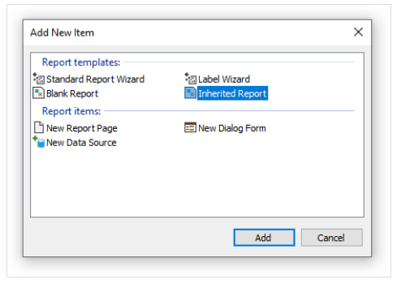

# 报表继承性

经常我们有很多的报表使用相同数据, 例如具有相同公司logo以及电子邮件、地址等等的头和尾, 现在想象这种情况, 你需要改变一些公司的数据,例如电子邮件,
你需要在每一个报表中做, 为了避免这样, 你能够使用报表继承性,那么它是什么?

举个例子,在每一个报表中都有一些共同元素(例如logo, 公司名称,电子邮件), 这些元素通常是放置在报表头或者页面头, 你能够创建一个包含仅公共元素的基础报表,
所有的其他报表将使用基础报表 于是,继承的报表包括一些公共元素和自己的元素。

当你需要改变某些事情(例如,logo,email)的情况下你仅仅打开基础报表然后做出必要改变即可, 所有其他的报表都继承于这个基础报表,将自动的进行改变,
事实上, 当你打开一个继承于其他的报表,  基础报表首先会打开,然后才是继承的报表。

## 创建一个报表

为了使用继承性, 你需要做以下事情:
1. 创建一个基础报表 然后保存它到文件中
2. 创建新报表然后继承于它.

为了创建一个继承的报表,选择`File|New...` 菜单项, 然后从窗口中选择`继承报表` 项.


你将能够选择一个继承的报表页面, 这个文件在此时必须是已经被创建, 在此之后, 基础报表将会加载到设计器中,你能够根据你想要的方式改变它,  你能够看到来自
于基础报表的对象通过锁符号标记.


这意味着你不能够删除这些对象, 重名名或者移动到其他带。

你能够增加对象或者带,改变对象的外观,尺寸和位置, 当你完成之后,保存此报表。

## 改变基础报表

当改变基础报表的时候发生了什么?

1. 从基础报表删除对象, 那么对象会从继承报表中删除
2. 增加对象到基础报表,那么也会自动的出现继承报表中
3. 改变对象的尺寸、位置、外观,所有改变将反应到继承的报表中, 此时,这个对象在继承的报表中没有任何改变。

下面几点需要解释, 让我们看一下使用继承的两个示例, 正在第一个示例中,我们做以下事情:

1. 创建包含`Text1` 对象的基础报表
2. 然后创建一个继承它的报表,不改变任何事情。
3. 打开基础报表并移动文本对象.
4. 打开继承报表并查看文本对象同样被移动。


在第二个示例中, 我们做以下事情:
1. 创建一个包含文本对象的基础报表
2. 创建一个继承的报表
3. 在继承报表中移动文本对象到新位置并保存对象
4. 打开基础报表并移动文本对象到不同位置.
5. 打开继承报表发现文本对象并没有移动。

它发生了什么, 当我们在继承报表中已经有改变的对象时,这个改变将保存在继承的报表文件中, 现在如果我们在基础报表中改变这个原始对象, 它将在继承的报表中被忽略,
在这种情况下,新对象的位置将会被忽略, 所有其他改变(例如文本颜色,举个例子)将继续反应在继承的报表中。

这个行为将变的很清晰 - 如果我们查看继承报表的内容, 例如它是怎样保存到继承报表中的, 当对象没有在继承报表中改变时:
```text
<inherited Name="Text1"/>
```

如果我们从继承的报表中改变这个对象的位置,  它将保存为下面这样:
```text
<inherited Name="Text1" Left="255.15" Top="28.35"/>
```

当打开这个继承的报表时, FastReport 将加载所有的对象的属性, 定义在基础报表中,然后加上保存在当前报表的属性。
## 限制
这个报表继承性已经设计为满足下面的目标, 保存公共的报表元素,例如头部和脚部到单独文件中, 然后在继承报表中进行重用, 不要尝试使用这个继承去执行某些复杂的任务,尤其是,
避免以下事情:

1. 不要继承一个本身是继承的报表(例如, 不要套娃)
2. 不要使用复杂的对象,例如 表格、矩阵
3. 不要在基础报表中使用脚本
4. 不要在基础报表中使用参数
