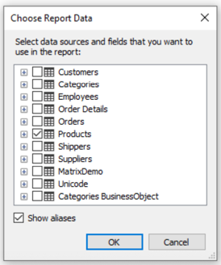

# 报表创建
此章节,我们查看创建常用类型报表的几种方式,为了创建一种报表,以经验来说,我们需要做以下事情:
1. 选择或者创建数据,它可以在报表中使用。
2. 创建报表结构,通过增加需要的带到报表中.
3. 连接带到数据源。
4. 放置文本对象到带中去打印数据。
5. 设置外观和格式。

## 选择报表的数据
在开始构建一个报表之前,我们需要选择在报表中打印的数据,你可以有两种方式:
1. 选择其中一种数据源,它们是通过编程方式注册到报表中的,这能够通过`Data|Choose Report Data` 菜单完成,确定需要的数据源。

2. 你能够在`Data|New Data Source` 菜单中选择创建一个新数据源

当你选择数据源之后,它会出现在`Data` 窗口中,现在你能够在报表中使用这个数据源,许多报表仅使用一种数据源。

对于主从报表类型,你需要选择两个数据源,彼此相关。
多个数据源能够在同一个报表中,从相关的数据源打印相关的数据。
