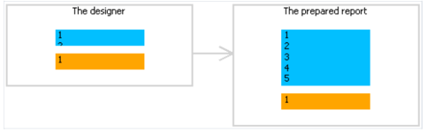

# 动态布局

当创建一个报表的时候,对于打印一个文本整体尺寸占用未知的情况下是必要的,例如货物的描述。

这种情况下,下面的任务将需要解决:
1. 计算对象的高度,这样的话它能够包含整个文本。
2. 计算带的高度,这样它能够包含使用了可变数量文本的对象。
3. 移动或者改变其他对象的高度,让它们包含在带中,这样的话,不会打扰报表的整体设计。

这些任务能够通过使用某些对象以及带属性解决:
1. `CanGrow` 以及 `CanShrink` 属性允许自动的计算对象的高度。
2. `ShiftMode` 属性允许当对对象进行展开的时候位于它上面的那些对象可以移动。
3. `GrowToBottom` 属性改变对象的尺寸到带的底部边缘。
4. `Anchor` 以及 `Dock` 属性允许控制依赖于带尺寸的那些对象的大小。

这些属性将会在下面详述:

### CanGrow,CanShrink

每一个带和报表对象都有这些属性,它们决定一个对象是否能够放大或者缩小 - 依赖于内容的尺寸,如果两个属性同时禁用,那么此对象的尺寸总是需要在设计器中指定。

这些属性是非常有用的,如果它需要打印的文本整体尺寸在设计的时候是未知的,为了让这个对象适应(顺应）整个文本,它需要启动这两个属性。

下面的对象能够影响带的高度:

- 文本
- 富文本
- 图片(启动了`AutoSize` 属性)
- 表格

### ShiftMode

每一个报表对象都有这个属性,这个属性仅在属性窗口中能够访问,一个对象,如果启用了这个属性,那么它能够上下移动,如果这个对象之上的对象(容器)在放大或者缩小的时候。

此属性能够有以下的值:
1. Always(总是,默认值),意味着此对象总是随时移动。
2. Never(绝不) - 意味着对象不需要移动.
3. WhenOverlapped(当重叠的时候), 意味着仅在这种情况下进行移动,如果正在展开的对象完全与它相交,那就是两个对象水平上 重叠)

这个属性在表格形式中打印信息的时候非常方便使用,当表格中的各种单元格堆叠在一起的时候并且单元格具有有可变数量的文本时。

### GrowToBottom 属性

每一个报表对象都有这个属性,当打印一个具有此属性的对象时,它能够延伸到带的底部边缘。

这对于打印表格中的信息时非常有用, 在表格行中各种对象都能够延伸.

此属性使得它能够设置所有对象的高度为带的最大高度。

### Anchor 属性

每一个报表对象都有这个属性,它决定一个对象应该怎么改变它的位置或者尺寸 - 当它的容器改变自身尺寸的时候。

通过Anchor,它能够跟随容器的大小而移动或者伸缩。

这个容器,涉及到的,大多数情况下是带,但是并全是,这能够是`Table` 或者 `Matrix`(矩阵)对象。

此属性具有以下值,并且这些值可以合并:

1. Left 

    以对象的左边作为锚点,当容器的尺寸发生改变的时候,那么这个对象不会左右移动。
2. Top

    以对象上边为锚点,当容器尺寸发生改变的时候,对象将不会上下移动。
3. Right

    以对象的右边为锚点,当容器的宽度发生改变的时候,此对象的右边距离容器的距离是一个常量,如果容器的左边同样是锚点,那么这个对象则根据容器的尺寸变化而同步伸缩。
4. Bottom
    以对象的下边为锚点,那么当容器的高度发生变化的时候,那么对象底部距离容器的距离是一个常量,如果对象的上边同样是固定了,那么此对象将根据容器的尺寸变化而伸缩。

默认情况想爱,此属性的值是`Left,Top` ,这意味着当容器的尺寸改变时,那么此对象将不会改变,在下表中,给出了有一些频繁使用值的合并。

1. Left,Top  默认值, 此对象在容器尺寸发生改变的时候不会改变。
2. Left Bottom ,当容器高度改变的时候会上下移动,对象和容器底部边缘相关的位置不会改变。
3. Left,Top,Bottom,当容器高度发生改变的时候,对象的高度会同步改变。
4. Left,Top,Right,Bottom,当容器的高度和宽度发生改变的时候,对象会跟随容器同步伸缩。

### Dock 属性(停靠)

每个报表对象都有这个属性,这个属性决定了对象应该停靠到容器的那一边。

此属性具有以下的值:
1. None  默认值，不需要停靠
2. Left 此对象将会停靠到容器的左边,这个对象的高度等于容器的高度(*) ..
3. Top  这个对象将停靠到容器的上边,这个对象的宽度等于容器的宽度(*) ..
4. Right 这个对象将停靠到容器的右边,这个对象的高度等价于容器的高度(*).
5. Bottom  这个对象将停靠到容器的底部,对象的宽度等于容器的宽度(*)。
6. Fill   这个对象占用这个容器的所有剩余空间。

* 表示并不是完全这样,如果好几个对象同时停靠,下表中展示了两个对象,第一个对象停靠在容器的上边,另一个停靠在左边.

正如你所见,第二个对象的高度实际上等于高度的剩余空间,这是第一个对象的停靠之后的剩余。
> 这个停靠行为依赖于对象的创建顺序,你能够在一个对象的上下文菜单中改变这个顺序,为了这样做,选择置于顶层或者置于底层的菜单项。