# 格式化

此部分,我们将查看以下问题:

1. 改变一个对象的外观
2. 改变打印值的格式
3. 当满足某种形式的条件时自动的改变一个对象的外观。
4. 隐藏不必要的值
5. 隔行不同颜色高亮


## 边框和填充

几乎所有的报表对象都有边框和填充,为了和这些属性工作,使用`Border and Fill`(边框和填充) 工具条;
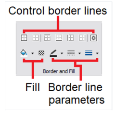

它可以控制边框线条和填充,以及边框线参数。

对象的边框由4条线组成,每一个条线能够有不同的宽度、颜色、风格。
工具条的按钮将影响一个窗体的所有线条。

然后,按钮会展示一个一个弹窗 - 这允许你单独的设置每一条线。

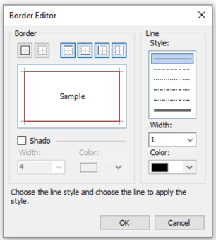

为了进行填充,工具条上存在两个按钮,允许选择一种去填充实心填充类型的颜色。

按钮展示了一个弹窗允许你选择不同的填充类型;

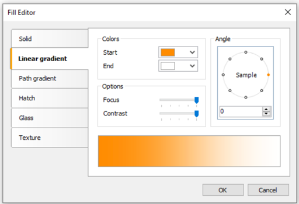

// 例如实心填充,渐变填充,路径渐变填充,网格填充,高斯模糊(玻璃填充),质地.

## 文本格式化
为了改变文本对象的外观,使用文本工具条,能够改变字体大小,字体风格,以及对齐方式,以及颜色颜色,以及旋转.

## 样式
为了设置对象的外观,能够使用样式,样式是一组具有以下属性的集合:
1. 边框
2. 填充
3. 字体
4. 文本颜色

样式列表是存储在报表中的,你能够控制它通过`Report|Styles` 菜单或者`Style` 样式工具条中的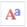

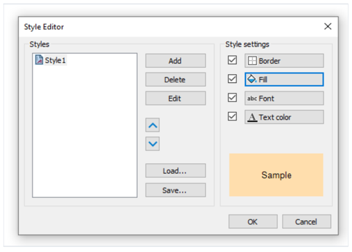

你能够设置一个对象的风格 - 根据以以下方式:

- 在属性窗口中设置`Style` 属性
- 使用`Style` 工具条
    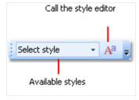

如果一个工具条没有展示在屏幕中,你可以通过`View|Toolbars` 视图|工具条菜单启用。

当你设置了对象的风格时,对象的外观会根据样式配置改编,当你改变样式的配置的时候,使用这个样式的对象将自动的发生改变。

## 数据格式

为了在报表中打印原文数据,那么需要使用文本对象,它将应用默认的格式到来自数据源的所有数据.

例如,`DateTime` 类型的数据源字段将根据以下方式打印(它依赖于你的系统整体配置);

```text
4/2/2024 6:04:52 PM
```

如果你仅仅打印日期部分,你能够设置数据格式,右击文本对象然后会展示一个上下文菜单,在菜单中你能够选择`Format...` 格式项,然后你能够看见
格式编辑器窗口。

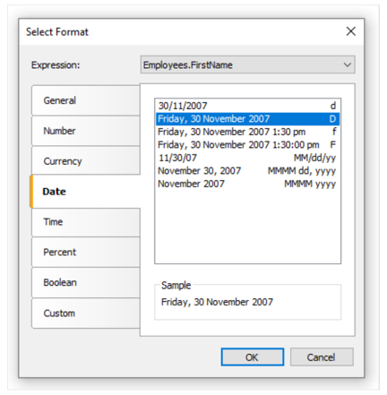

你也许可以选择一种合适的格式化类型或者配置自己的格式化字符串,为了这样做,选择`Custom` 自定义格式化.

如果文本对象包含了好几个数据列或者表达式,你也许能够为它们每一个选择合适的格式,为了这样做,选择窗口顶部的表达式,然后选择此格式:

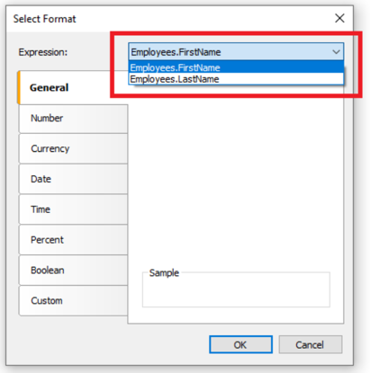

你也许能够格式化数据 - 通过使用`String.format` 方法,能够在MSDN中获得此方法的帮助。

[MSDN](https://learn.microsoft.com/en-us/dotnet/api/system.string.format?view=net-9.0)

```text
Today is [String.Format("{0:d}",[Date])]
```
## 条件高亮

改变文本对象的外观的另一种方式就是基于条件,例如一个对象能够高亮为红色(仅当它是负值),这个特性叫做条件性高亮,为了设置它,
选择文本对象并点击文本工具条中的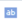,你能够看到以下的弹窗窗口:
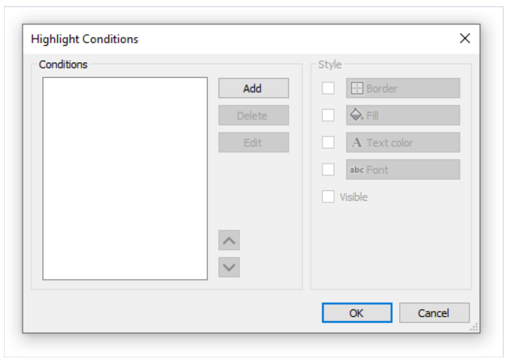

我们能够定义一个或者多个条件并且为每一个条件设置样式,样式能够包含一个或者多个以下配置:

- 填充
- 文本颜色
- 字体
- 对象可见性

你能够指示,当条件匹配的时候那些配置能够被改变,对此,使用选择框点击需要的配置,默认情况下,一个新的样式包含一种配置, 文本颜色。

为了创建一个新条件,你能够点击`Add` 新增按钮,你能够看到一个表达式编辑器:
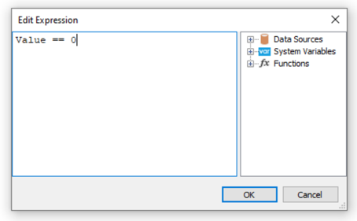

这样,它能编写任意返回boolean 结果的表达式,在许多情况下你需要使用`Value` 变量,它包含了当前打印的值。

让我们看一下下面的示例,我们有一个文本对象,其中我们想要打印一个产品的库存信息:
```text
[Products.UnitsInStock]
```

我们想要将对象变红,如果产品数量为0,我们将创建以下条件:
```text
Value == 0
```

在给定情况下,我们使用了`Value` 变量,它是获得被打印的值。

如果在对象中有多个表达式,那么这个变量将作为上一个表达式的结果,除了Value,你能够使用数据列。
```text
[Products.UnitsInStock]
```

表达式以C#风格编写,也就是说,如果选择报表的语言是C#,对于VisualBasic.NET,必须使用单等号`=`,
报表语言可以通过`Report|Options...` 菜单进行改变。

为给定的条件配置样式,这种情况下仅使用填充,并且选择红色.
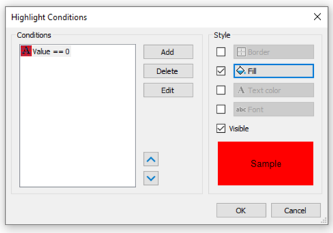

于是当打印的对象值为0的时候,将会展示为红色,现在将示例变得复杂一点,我们能够增加其他条件.

如果库存数量小于10,那么它必须打印为黄色,为了这样做,打开条件编辑器然后选择增加,第二个表达式如下:
```text
Value < 10
```
这种情况下存在多个条件,FastReport 会检查所有的条件,从第一个开始,如果某一个条件命中,那么FastReport 会应用
它的样式配置到对象然后处理结束,重要的是放置条件到正确的条件,在我们看到的这个示例中这些条件顺序是正确的:
```text
1. Value == 0
2. Value < 10
```
如果我们交换条件,那么高亮将错误工作
```text
1. Value < 10
2. Value == 0
```

在给出的情况中,`Value == 0` 将不会执行,因为当值为0的时候,第一个条件已经命中,然后为了改变条件的顺序,使用上下调整按钮即可。

## 隐藏零值

文本对象有一个`HideZeros`  属性能够被用来隐藏0值,让我们看一下具有以下内容的对象:
```text
Total elements: [CountOfElements]
```

如果变量`CountOfElements` 变量的值等于0,那么属性`HideZeros` 如果设置为true,那么这个对象将打印为以下内容:
```text
Total elements
```
文本对象也有一个`HideValue` 属性能够被用来隐藏给定值等于表达式的值,例如,如果属性值为0,那么所有的值将会隐藏。

此属性能够被用来隐藏0 `Date`(日期),通常来说,它是一个例如`1/1/0001` 或者`1/1/1900` 的日期,在这种情况下`HideValue` 属性的值必须像这样:
```text
1/1/1900 0:00:00 AM
```

正如你所见,除了日期, 同样你也需要标识时间,这是必要的,因为在.NET中日期的值包含时间;

> 主要的是,这个机制依赖于系统的区域设置,这能够通过控制面板进行设置,因为FastReport 比较字符串使用`ToString()` 方法获取字符串.
> 这个方法转换一个表达式的值为字符串,与之相关的是,要小心当构建报表的时候它能够在一个具有不同区域设置的计算机上启动(开始)。

最终,文本对象的`NullValue` 属性允许去打印某些值而不是空值,经常被用来打印一个下划线而不是空值,让我们看一下具有以下内容的对象:
```text
Total elements: [CountOfElements]
```
如果`CountOfElements` 的值如果为null, 并且`NullValue` 属性的值设置为`--` ,此对象将会打印为以下内容:
```text
Total elements: --
```
## 隐藏重复值

文本对象也有`Duplicates` 属性能够允许控制重复值应该如何打印。
这个属性能够被使用,如果文本对象使用在`Data` 带中,这个值将考虑为重复(如果它打印在相邻的数据行中).

这个`Duplicates` 属性可以有以下的值:
1. Show 展示重复值(默认行为)
2. Hide 隐藏重复值
3. Clear 清理对象的文本,但是展示此对象(那就是一个空行,看起来)。
4. Merge 合并具有相同值的多个对象。

下图中展示了不同模式:
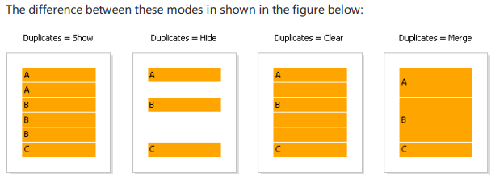

## 高亮偶数/奇数数据行
为了提高一个报表的外观,你能够使用不同颜色高亮偶数据行. 这能够通过带的`EvenStyle` 属性或者它对象的此属性来完成.

这属性包含了一个风格名称,这将能够被用来高亮偶数带行。
> 偏向于使用对象的`EventStyle` 属性而不是带的属性。 这能够在导出报表的时候避免可能的问题。

为了配置高亮,做以下事情:
1. 定义样式,这能够被用来高亮行,这能够在`Report|Style...` 菜单中完成。
2. 在带或者它的对象上设置EventStyle属性来标明新样式的名称。

默认的情况下,对象仅在EventStyle属性使用一个样式的填充属性,这个行为是可以通过`EventStylePriority` 属性进行定义的,
默认是`UseFill`,如果你需要使用其他样式参数,设置属性为`UseAll` .

一个准备好的报表,使用这种技术,它能够看起来像这样:
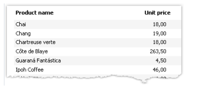


