# 单个数据带的报表

一种类型的报表经常是需要的, 它允许从数据源中打印数据列表,例如,打印顾客列表。
## 将带连接到数据源

为了从数据源中打印一个数据, 需要数据带,并且应该需要连接到数据源,这个带将会打印和数据源中一样多的行.
> 如果数据带没有连接到源,那么它仅打印一次。

当你创建了一个新报表,它已经包含了各种空的带, 包括了数据带,这个带能够通过`Configure Bands` 配置带的窗口进行设置 - 通过`Report | Configure Bands` 菜单项.

为了连接带到数据源,双击它,然后在编辑器中选择数据源然后点击OK.

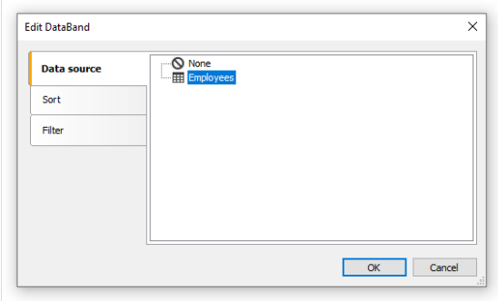

## 打印文本
在连接到数据源之后,你能够在带中放置文本对象,它将会显示一个来自数据列中的信息, 最快的方式就是从数据窗口中拖拽一个数据列,然后将它放置在带中.
## 数据排序
默认情况下,数据打印都是基于原始顺序(自然顺序). 经常在打印之前进行排序也是必要的.

例如,一组客户能够以字母自然顺序进行排序之后并呈现。

你能够在`Data` 带编辑器中控制排序, 为了唤起编辑器,双击带的空闲地方即可;
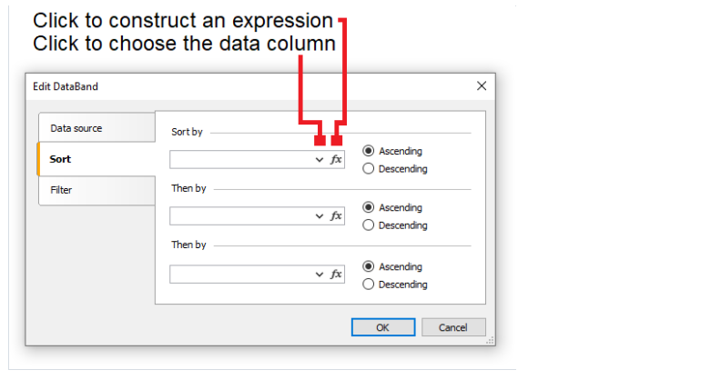

点击构造一个表达式,然后选择数据列。

作为排序的条件,你能够使用一个数据列或者表达式,你能够给出多个排序条件(但是不超过三个),这可能是需要的,如果你想要根据城市排序客户列表之后,然后通过客户的
名称排序,对于每一个条件,你能够选择排序的方向: 升序还是降序。

另一种排序的方式是,使用SQL 查询作为数据源,这个查询将会在数据服务器上执行并返回排好序的数据行。

## 过滤数据

为了过滤数据行,能够让它被打印,那么 我们需要在编辑器中进行设置,点击带的编辑行然后切换到过滤一栏:
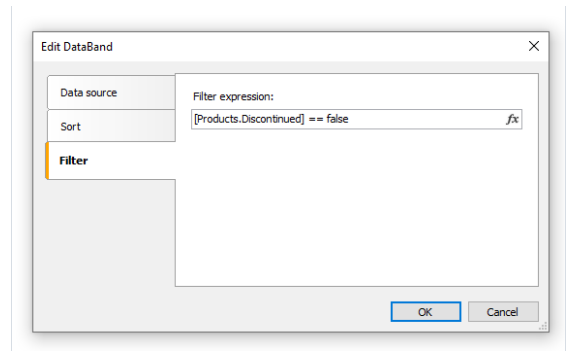

对于一个过滤器表达式,你能够指定任何正确的表达式,有关表达式的详细内容查看表达式章节。

在上面示例中下面的过滤器已经使用:
```text
[Products.Discontinued] == false
```

这意味着,所有的数据行 仅有`Disconnected` 标志等于false的才会选择打印。

你能够使用一个复杂的过滤器表达式
```text
[Products.Discontinued] == false && [Products.UnitPrice] < 10
```
此表达式不仅要满足前面表达式的要求还要求价格必须小于10才会选择打印。

这个过滤器假设,数据源包含了所有数据行,它的一部分将会过滤,如果数据源包含了大量的行,报表打印会严重下降,在这种情况下你能够使用SQL 查询作为数据源,
对此你能够执行需要的过滤,这个查询将会在数据服务器中执行并且再返回那些被报表所需要的行(也就是交给数据库来进行过滤)。

> 你也能够使用对话形式来执行数据过滤,详情查看对话表格章节。

## 数据头和数据尾

一个数据带能够包含一个头部和尾部,这个头将会在数据打印前打印,尾将会在所有数据打印完之后打印。

为了增加一个头和尾到数据带,能够选择`Report|Configure Bands...` 菜单项,在这个窗口中,选择数据带并右击鼠标,在上下文菜单中选择`Header`(头部)以及`Footer`(尾部);

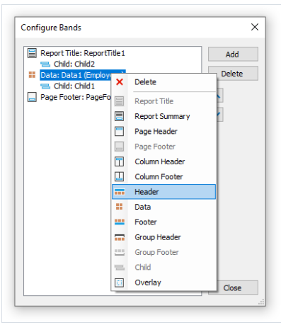

这些带在以下情况下是有用的:

- 在一页上打印各种列表(`master-master`(双重主报表) 报表),在这种情况下每一个数据带都有自己的头和尾。
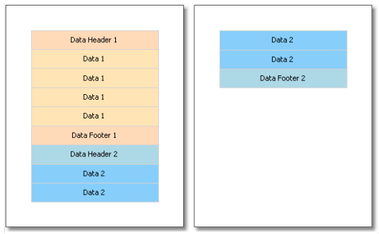

当你打印一个列表的时候,如果列表无法在最终报表中的一页上放置, 通过使用数据头或者数据尾的`Repeat On Every Page` 属性(在每一页上重复),你能够在
报表的每一页上打印这些带。

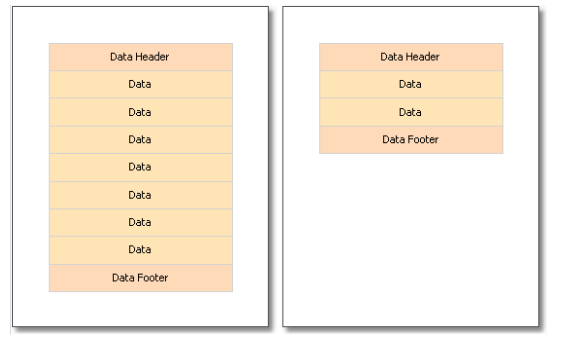

## 断开数据以及保持连续

这部分,我们将查看数据打印的两个模式,`分断` 以及`保持连续`

正常的带打印模式下,FastReport 会检查当前页是否有足够的空间去打印一个带,如果不够,那么整个带将会打印在下一页,如果带的`CanBreak` 属性启用,那么FastReport
将会尝试打印带的一部分到可用的空间上,然后断开此数据带。

尝试断开带可能成功,依赖于放在带上的对象的类型,下面的对象能够断开。
1. 文本
2. 富文本
3. 表格(TABLE)

这些对象同样都有一个`CanBreak` 属性,如果启用,那么此对象能够断开,不可打断的对象总是全部展示,它们必须有足够的空间。

下图中,展示了一个带被符合打断:

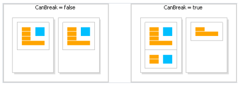

> 断开算法并不总是正确工作,当一个带上存在不同字体尺寸的对象时,可能会出现伪影(The artifacts can occur  in a situation).

断开带的目的是,解决最终打印纸的空间, 数据连续目的是对立的,它将带完整的打印在一个纸上, 这种情况下可能会存在大量未使用的空间,但是这种方式下数据打印
更容易感知。

连续算法允许在一页(或者列,如果报表有很多列)上连续一组带, 当打印的时候,直到数据到达页面的尾部,FastReport 会重新分配已经打印的所有数据到新的页面.

在以下情况下你能够使用连续算法:

1. 在数据带中连续打印所有行数据。
2. 打印一组分组(头部,数据,尾部)的所有元素到一起
3. 打印主数据源的所有行和所有详细行到一起(称为主从报表)
4. 打印至少有一行数据和报表头或者数据头到一起
5. 报表尾或者数据尾连同至少一行数据行一起打印。
6. 父子带一起打印。

让我们查看一下连续机制.

如果连同数据行和分组元素(头\数据\尾)一起连续,启动`KeepTogether` 属性. 这个属性被用在`Data` 以及`Group Header` 带中.

下图展示了使用和不使用连续机制的时候数据的打印形式

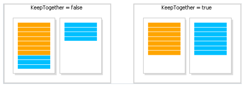

为了保持主数据行连同详细数据行一起，在数据带中启用`KeepDetail` 属性，这个属性将在主从类型报表中使用。

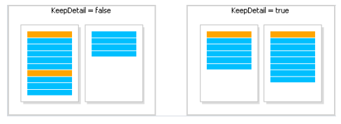
为了阻止悬挂头部或者尾部, 使用`KeepWithData` 属性,以下带都有这个属性

- 报表头
- 报表尾
- 数据头
- 数据尾
- 分组头
- 分组尾

这个属性允许让头或者尾和至少一条数据行连续在一起。

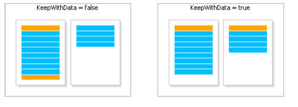

为了保持一个带和它的子带连续,启用`KeepChild` 属性即可。

## 打印空数据行

大多数情况下,在打印预印表单时,经常需要打印一定数量的数据行,如果实际的数据小于需要的数据行,那么需要打印空行,这可以通过子带来实现,将它附加到数据带上。

子带有一个属性`CompleteToNRows`,如果这个属性设置大于0,这个带将添加额外的数据行到指定数量,例如,我们需要打印15行,但是我们实际上在数据源中仅有8条,
这种情况下子带可以打印7次.

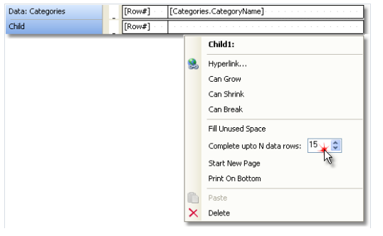

然后最终表格看起来像这样:
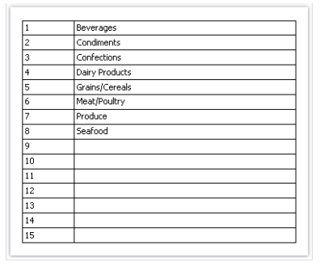

> 如果数据源比`CompleteToNRows` 属性指定的行数更多,那么空行将不会打印。

另一种打印空行的方式去填充页面的剩余空间,在这种情况下,`Child` 子带将附加到要么`Data Footer` (数据尾) 或者 `Group Footer` 分组尾类型的带,
并且填充这个页面的剩余空间。

这种尾带将会打印在页面的尾部。

为了使用这种方式打印一个空行,依附子带到尾带并且启用此子带的`FillUnusedSpace` 属性,你能够看到子带现在将会展示在它所依附的带之上,下图中展示了子带附加到了
报表尾带。
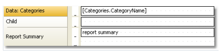

当我们运行这样的一个报表的时候,我们能看到以下内容:
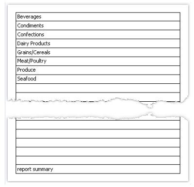

## 打印无数据内容

当数据带连接到一个空数据源的时候,它将不会打印,有时需要打印某些例如像`无数据`的文本而不是仅仅一个空页,为了这样做:

1. 增加子带到数据带
2. 设置子带的`PrintIfDatabandEmpty` 属性为true(它能够在`Properties` 属性窗口中完成);
3. 设置文本对象到子带并且写上`No data to display`(无数据)。

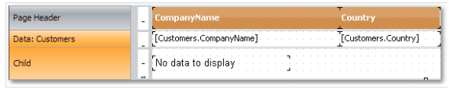

然后报表以以下方式打印:

1. 如果数据源有一些数据行,那么数据带将会打印,连同它相关的带(数据头、尾);
2. 如果数据源是空的,仅有包含无数据文本的子带将会打印。

## 打印体系结构

一个数据带允许打印具有机构化的列表,对此,需要使用数据带和数据源,层级必须在两个数据列的帮助下定义在数据源中:
1. Key 列,表示数据行的标识符。
2. 包含此项的父项的key的列

为了打印在结构化形式中的这样一种数据源,你需要设置数据带的以下属性,它能够在属性窗口中完成:

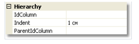

1. 在`IdColumn` 属性中指定Key 列。
2. 指示包含父项的列,在`PatientIdColumn` 属性中设置.
3. 指定结构化缩进 - `Indent` 属性。

让我们查看一个打印来自员工示例表的员工的结构化报表,这个表格有两个我们需要的列:

1. EmployeeID 列包含了key并且包含了员工的ID
2. ReportsTo 列包含了"父" 员工的ID

创建的报表如下:
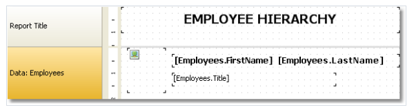

然后设置数据带的属性,对于结构化这是合理的
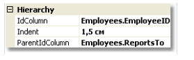

当我们预览一个报表的时候,我们能够看到如下内容:


当我们打印一个结构化数据,FastReport 会移动带到右边(通过`Indent` 属性所指定的一个值),并且对于相同值将会减少带的宽度。

这允许你去使用带重的对象的`Anchor` 属性。

这里有一些可能的值能够在这种情况下使用:

1. Left,Top(默认情况), 此对象跟随带移动
2. Right,Top,此对象待在原始位置。
3. Left,Right,Top, 此对象的右边位于它原始的位置,然后左边跟随带移动。

它能够允许你做一些有用的效果:


在这个示例中,这个照片设置了`Anchor` 属性为`Left,Top`,job 标题的对象固定到`Left,Right,Top` ,使用了名称的对象设置为`Right,Top`