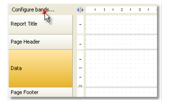
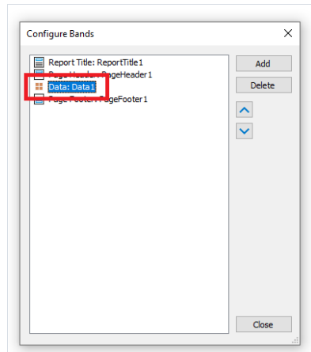
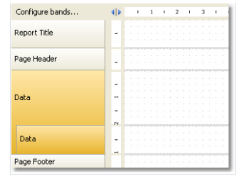
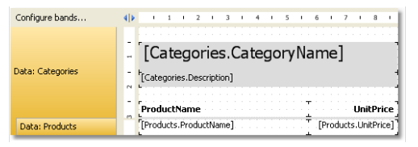

# 主从报表

通过使用两个数据带,我们很容易创建主从类型的报表, 在这个报表中,两个数据源, 它们在这有一种关系,主数据源的一行能够对应子数据源的多行。

有关详细信息能够在`Data` 章节了解更多。

必要的是以这种方式放置带到报表中,主带包含在它内部的详细带,这能够通过`Configure Bands` 配置带窗口进行完成,这能够在`Report|Configure Bands` 菜单中唤起。

让我们查看一下从头创建创建主从报表,对此,我们将启动报表设计器然后创建一个空的报表,它已经包含了一个`Data` 带。

为了增加一个从数据带, 在配置带窗口中进行设置,例如窗口展示为如下内容:

选择数据带,然后在它之上右击然后在上下文菜单中(或者点击Add按钮 - 位于上下文窗口的底下的右边的部分), 在对应弹窗中选择`Data` 数据带,

在此之后,一个内嵌的数据带将会增加到选择数据带中,然后查看报表设计器,能够从经典显示模式中看到:

内嵌的数据带已经清晰可见(在窗口左边的带结构中),在此之后,你需要连接带到对应的数据源并且在带中放置数据列.

我们将使用两个数据源,Categories(分类)以及产品 - 从示例数据库中(它来自FastReport携带的);

如果我们运行这个报表,我们能够看到以下内容:

在这种方式下,我们创建了一个主从类型的报表(它具有无限制的内嵌数据),例如, 主从-子主从,另一种方式,创建主从报表类型的是通过子报表(将数据源连接到它).

内嵌报表在子报表部分查看。
