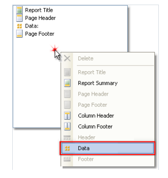
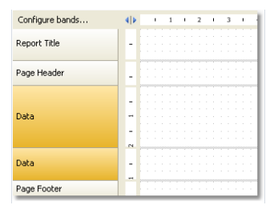
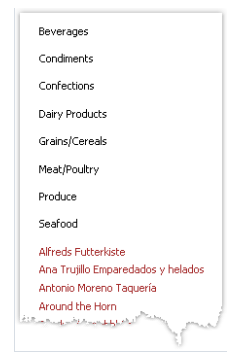

# 多重主报表

在报表页面中,我们能够打印各种简单的列表, 这能够通过在页面上放置一个或者多个数据带完成。

对于主从报表,带需要相互内嵌并打印来自相关数据源的数据, 这种类型的报表带和数据源不需要相互依赖。

通过一个示例来了解它,如何创建一个报表并在页面上打印两个列表,分类表格和客户表格,我们能够创建一个新报表并且给它加入数据源。

为了增加第二个数据带,打开`Configure Bands` 配置带窗口。

右击列表的空白地方,正如是上面图片中所展示的, 从上下文窗口中选择`Data` 数据带, 这能够创建一个新的独立的数据带,报表模版将看起来像:

现在我们能够连接带到数据源并且放置各种数据源到它的内部;

如果我们现在运行报表,则能够看到:
