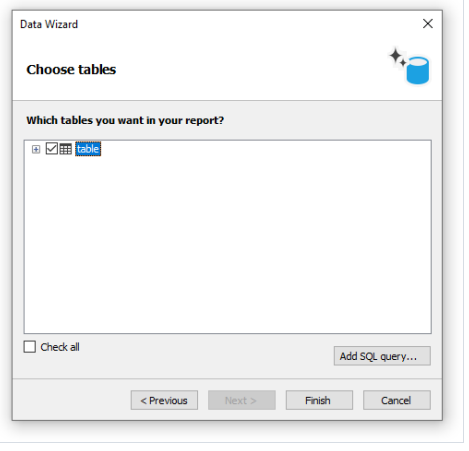
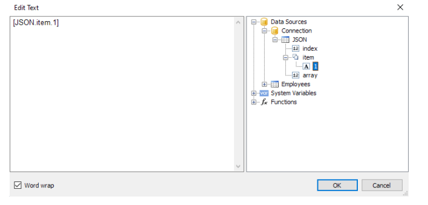
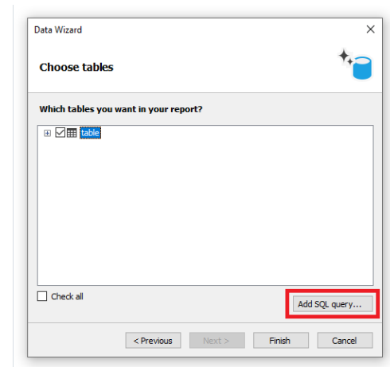
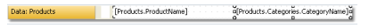

# 数据窗口

任何报表都需要打印某些数据,在FastReport中,你能够使用以下数据进行操作:
1. 数据源
2. 系统变量
3. 汇总值
4. 报表参数
5. 表达式,包含上面提到数据的任意之一

所有的数据都可以从数据窗口访问, 这个窗口能够通过选择`Data|Show Data Window`(数据窗口) 窗口展开


数据窗口允许你操作所有数据元素并且你能够拖动它们到报表页面中, 所有的操作都能够通过工具栏和`Action` 动作菜单的帮助完成.


这些参数的一部分和`数据` 窗口的上下文菜单重复,  例如, 如果你选择一个数据源, 你能够使用它的上下文菜单去创建一个计算的列,删除一个数据源,或者浏览它的数据。

## 数据源

正常情况下, 数据源表示DB(数据库表) 或者 SQL 查询, 在报表中可以有各种各样的数据源, 对于大多数报表, 仅需要一个数据源, 对于主从报表需要两个数据源 - 它们可以
使用一种关系相互连接.

数据源有一个或者多个列,每一个列有一个定义的数据类型, 为了查看列类型, 选择它并打开属性窗口, 列类型可以在`DataType` 属性中指定, 列名附近的图标也能够也能够帮助确定类型。

下面有两种方式定义数据源.

1. 在应用中定义的数据源 然后再报表中注册, 它取决于是那个编程者创建的这个项目(查看程序员手册), 一个用户应该仅仅选择它需要的数据源 为了在报表中使用它。
    也能够在`Data|Choose Report Data` 菜单中选择它。

    

    所有注册的数据源都会在这个窗口中展示, 仅仅选择需要的数据源即可。
2. 自己创建数据源, 可以是数据库表或者SQL 查询, 这种情况下,数据源定义保存在报表文件中。
    
    FastReport 允许你连接到任何热门的DBMS(数据库管理系统),例如 MS SQL, Oracle,Interbase,Access, 除此之外, 你能够使用那些保存在`xml/xsd` 格式中的数据文件。

> DB 数据库表内容不会保存在报表文件, 相反, 连接字符串以及数据库方案都会存储, 一个连接字符串可以包含登录名和密码等相关数据, 那就是为什么它在报表文件中是加密的,
> 当需要的时候你能够通过使用自己的密钥来进行数据加密去增强安全性, 在这种情况报表进能够正确的被你的程序打开。

## 创建一个数据源

打开数据源创建向导程序(wizard):


第一步,你需要创建连接, 对此你可以点击`New connection`(新连接), 你能够看到以下配置:


下面的元素是上图所展示的:
1. 连接类型
2. 如果启用, 选择的连接类型默认使用
3. 连接配置
4. 测试连接按钮

连接到MS Access 数据库正如下图展示,如果另一种连接类型选择, 那么连接配置区域(3)将会被改变,例如连接MS SQL 数据源有以下配置:


选择需要的连接类型并配置它的参数, 在点击OK之后,窗口关闭并返回数据向导窗口,
下一步,你需要设置连接名称,这个名字出现在数据窗口:


点击下一步按钮继续, 然后你将被提议选择从数据库中访问那些表格:


勾出需要的表格并关闭向导,现在你能够看到数据窗口有你创建的连接 - 它包含了选择的数据源。


## 连接到JSON( Javascript Object Notation)

此连接允许你传递一个静态的JSON文件或者URL 链接, 它将在报表构建之前获取并作为一个数据源。

### JSON 连接器

在FastReport设计器中创建一个连接时,看起来如下:


1. Encoding 表示位于请求将被用于处理的JSON 编码, 如果连接提供链接的话
2. JSON or URL  设置静态JSON 或者通过API 获取JSON的链接
3. JSON Schema   设置JSON 方案
4. Headers  为了通过API连接JSON 来设置需要的Http Headers(可选的)

在它们的右边存在一些按钮能够在单独的窗口编辑此字段。

如果JSON Schema 值如果是空的, 然后当你点击OK或者 Test 连接,使用JSON 将自动构建Schema.

当Schema已经定义之后,如果改变JSON 或者 URL, FastReport 将主动更新schema .

### JSON 编辑器窗口
此窗口允许编辑JSON:


此编辑器窗口从左向右描述:
1. 打开文件 - 允许你打开一个JSON 文件并粘贴它的内容到编辑器中。
2. 保存文件,允许你保存编辑器的内容到文本中.
3. 编码 - 设置打开的JSON文件的编码
4. Formatting 启用JSON 格式化, 同样也根据规范验证Json。

`Work Wrap` 此换行选择框将设置编辑器的启用或者禁用单词换行。

### 怎样让 连接工作

JSON 不是表格, 因此FastReport 并不会把JSON 连接作为数据库表。

相反, FastReport 处理每一个JSOn 数组作为具有以下三个字段的结构化数据源。

1. index 项的下标
2. item  项
3. array 项数组的URL

任何JSON 数组都能够连接到数据带。

然后你能够在报表对象中使用来自此JSOn的字段。




## 连接的参数

在连接中使用参数并通过连接向导传递时，参数的默认数据类型为字符串（string）。并不是所有的连接都能正确地将字符串转换为数据库可以接受的类型。因此，对于某些连接，添加了将字符串值转换为连接库支持的其他数据类型的功能。根据参数的类型，字符串将转换为以下类型。如果需要将一个不在下表中的类型或未实现的类型分配给参数值，那么只能通过编程方式实现。

### PostgresDataConnection
| NpgsqlDbType Type | C# Type | Example/Format |
|-------------------|-------------------|--------------------------------------------|
| Bigint | long | `123456` |
| Money | decimal | `123456` |
| Numeric | decimal | `123456` |
| Integer | int | `123456` |
| Oid | uint | `123456` |
| Xid | uint | `123456` |
| Cid | uint | `123456` |
| Smallint | short | `123456` |
| InternalChar | byte | `123456` |
| Real | float | `123456.12` |
| Double | double | `123456.12` |
| Boolean | bool | `True` or '1' |
| Bit | string | `1` |
| Timestamp | DateTime | '12:15:12' |
| TimestampTZ | DateTime | '12:15:12' |
| Date | DateTime | '16/02/2008' |
| Time | TimeSpan | `6:12:14` |
| Interval | TimeSpan | `6:12:14` |
| TimeTZ | DateTimeOffset | `05/01/2008` |
| Uuid | Guid | `81a130d2-502f-4cf1-a376-63edeb000e9f` |
| Box | NpgsqlBox | `((x1,y1),(x2,y2)) |
| Circle | NpgsqlCircle | <(x,y),r> (center point and radius) |
| Line | NpgsqlLine | {A,B,C} |
| Polygon | NpgsqlPolygon | ((x1,y1),...) |
| Path | NpgsqlPath | ((x1,y1),...) |
| LSeg | NpgsqlLSeg | ((x1,y1),(x2,y2)) |
| Point | NpgsqlPoint | (x,y) |
| Cidr | NpgsqlCidr | `192.168.100.128/25` IP address with mask |
| Inet | NpgsqlInet | `192.168.100.128/25` IP address |
| MacAddr | PhysicalAddress | '08:00:2b:01:02:03' |
| TsQuery | NpgsqlTsQuery | 'fat & rat' |
| TsVector | NpgsqlTsVector | 'a fat cat sat on a mat and ate a fat rat' |
| Char | string | `a` single char |
| Text | string | 'string' |
| Varchar | string | 'string' |
| Name | string | 'string' |
| Citext | string | 'string' |
| Bytea | string | `12AA` hex string |
| Varbit | string | `01101` bit string |
| Tid | NpgsqlTid | '12345, 123' uint number and ushort number |
| Array | --- | Not implemented |
| Range | --- | Not implemented |
| Hstore | --- | Not implemented |
| Oidvector | --- | Not implemented |
| MacAddr8 | --- | Not implemented |
| Int2Vector | --- | Not implemented |

### MYSQL
| MySqlDbType Type | C# Type | Example |
|------------------|------------------|----------------------------------------|
| Int64 | long | `123456` |
| UInt64 | ulong | `123456` |
| Int32 | int | `123456` |
| Int24 | int | `123456` |
| UInt24 | uint | `123456` |
| UInt32 | uint | `123456` |
| Int16 | short | `123456` |
| UInt16 | ushort | `123456` |
| Decimal | decimal | `123456` |
| NewDecimal | decimal | `123456` |
| Byte | sbyte | `12345` |
| UByte | byte | `12345` |
| Year | byte | `1901` |
| Float | float | `123456.12` |
| Double | double | `123456.12` |
| Bit | bool | `True` or '1' bool |
| Bool | bool | `True` or '1' bool |
| DateTime | DateTime | '16/02/2008 12:15:12' |
| Date | DateTime | '16/02/2008' |
| Newdate | DateTime | '16/02/2008' |
| Time | DateTime | `6:12:14` |
| Timestamp | DateTime | '16/02/2008 12:15:12' |
| Timestamp | DateTime | '16/02/2008 12:15:12' |
| Guid | Guid | `81a130d2-502f-4cf1-a376-63edeb000e9f` |
| VarChar | string | 'string' |
| String | string | 'string' |
| TinyText | string | 'string' |
| MediumText | string | 'string' |
| LongText | string | 'string' |
| Text | string | 'string' |
| VarString | string | 'string' |
| JSON | string | 'string' |
| Enum | string | 'string' |
| Binary | byte[] | `12AA` hex string |
| VarBinary | byte[] | `12AA` hex string |
| Blob | byte[] | `12AA` hex string |
| TinyBlob | byte[] | `12AA` hex string |
| MediumBlob | byte[] | `12AA` hex string |
| LongBlob | byte[] | `12AA` hex string |
| Null | DBNull | |
| Set | --- | Not implemented |
| Geometry | --- | Not implemented |

### MSSQL 
| SqlDbType Type | C# Type | Example |
|------------------|------------------|----------------------------------------|
| BigInt | long | `123456` |
| Bit | bool | `True` or '1' |
| DateTime | DateTime | '16/02/2008 12:15:12' |
| SmallDateTime | DateTime | '16/02/2008 12:15:12' |
| Date | DateTime | '16/02/2008 12:15:12' |
| Time | DateTime | '16/02/2008 12:15:12' |
| DateTime2 | DateTime | '16/02/2008 12:15:12' |
| Char | string | `a` single char |
| NChar | string | 'string' |
| NText | string | 'string' |
| NVarChar | string | 'string' |
| Text | string | 'string' |
| VarChar | string | 'string' |
| Xml | string | '<xml/>' xml string |
| Decimal | decimal | 'string' |
| Money | decimal | 'string' |
| SmallMoney | decimal | 'string' |
| Real | float | `123456.12` |
| Float | float | `123456.12` |
| Int | int | `123456` |
| UniqueIdentifier | Guid | `81a130d2-502f-4cf1-a376-63edeb000e9f` |
| SmallInt | short | `123456` |
| TinyInt | byte | `123456` |
| DateTimeOffset | DateTimeOffset | `05/01/2008` |
| Variant | object | |
| Udt | object | |
| Binary | byte[] | `12AA` hex string |
| Image | byte[] | `12AA` hex string |
| Timestamp | byte[] | `12AA` hex string |
| VarBinary | byte[] | `12AA` hex string |
| Structured | --- | Not implemented |

## 创建一个SQL 查询
数据指南允许你快速的选择来自数据库中的表格, 创建SQL 查询需要额外的一些努力,对此在向导的第二步中增加`Add SQL query`(增加SQL 查询按钮):


你能够看到查询向导窗口, 查询向导有4个页面, 能够来回切换。

在第一步中, 你需要设置查询的名称, 这个名称将展示在数据窗口中, 输入一个独一无二的值即可。


第二步中, 你需要根据SQL 语言输入一个查询,  使用由你选择的数据库支持的语言,你也能使用查询构建器去进行可视化查询创建. 对此你能够点击`Query Builder` 按钮,
这查询构建器将会在后续详细介绍。

当你输入查询文本之后, 点击`Next` 按钮, 在第三部, 你能够定义查询参数, 如果你的查询有参数的时候是必须的。

在向导的最后一步, 你能够配置此查询返回的列。


> 如果你在查询文本中产生了一个错误 或者在参数定义中发生了错误,当你打开向导的最后一页的时候你能够看到错误消息。

一般来说,保证查询返回所有需要的字段是足够的,在这一步, 你能够做以下事情:
1. 删除不必要的字段
2. 通过刷新按钮重置列
3. 增加计算列(通过`Add calculated column` 按钮), 对于一个新列, 有必要设置`Name`,`DataType`,`Expression` 属性。

在关闭向导之后,将返回向导窗口。

## 查询参数
在查询文本中可以使用查询参数:
```text
select * from DVDs
where Title = @param1
```

这是一个对MS sql 说明数据库的查询, `param1` 名称代表一个参数, 注意,MS SQL 查询在查询中描述参数的方式不同于其他数据库, 对于 MS SQL一个参数通过`@` 符号标记,
MS Access 参数没有名称且使用`?` 符号标记。

如果你的SQL 查询包含了参数,你可以声明它们,通过在`查询向导` 中完成, 为了创建参数,点击`Add parameter` 按钮,新参数将会创建。


下面的参数的属性应该可以在属性窗口中设置:
1. Name 参数名 (某些数据库不支持命名参数,这种情况下不需要改变属性名称)
2. DataType 参数的数据类型
3. DefaultValue  如果`Expression` 属性没有指定,那么这个值将会使用, 或者如果它是计算的(例如,当在报表设计模式中运行此查询).
4. Expression   返回参数值的表达式, 这个表达式在报表运行时处理, 你能够在属性中指定任何表达式。
5. Size  参数数据大小, 这个属性必须指定，如果参数是`string` - 在`DataType` 属性中指定的字符串类型
> 如果你不正确的设置了参数属性, 你将得到一个错误 - 当你打开向导的最后一页时.

## 传递值到参数

经常从用户哪里获取值, 有两种方式传递值到查询参数

1. 编程传入, 因为并没有一种很容易的方式传递值到查询参数, 你需要使用报表参数, 这很容易通过代码实现, 你应该这样做:
    1. 创建报表参数, 设置`DataType` 属性,它将被用在查询参数中
    2. 在查询参数的表达式属性中使用报表参数
    
        ```text
        [MyReportParameter]
        ```
    3. 传递值到报表参数

        ```text
        report1.SetParameterValue("MyReportParameter", 10);
        ```

2. 通过对话窗口实现,例如,如果你需要一个字符串类型的值

    1. 增加对话框到报表
    2.  放置`TextBoxControl` 到它之上, 这个控件将被用来输入字符串 
    3. 根据以下方式设置参数:

      ```text
       Name=param1
       DataType=VarChar
       DefaultValue= (empty string)
       Expression=TextBox1.Text
       Size=255
      ```
    然后TextBox1 被用来获取由用户输入的值.
## 编辑一个连接

能够通过数据向导完成, 然后编辑连接配置即可(但是连接的类型无法改变);

向导的第二页,能够选择报表所需要的数据表, 最终点击完成则改变完成。

## 编辑一个数据源

同上, 我们只需要点击数据窗口选择需要改变的数据源,然后点击工具条中的编辑即可, 然后你能够查看到一个查询向导窗口,
在这个窗口中,你能够改变SQL 查询文本, 设置查询参数和数据列。

为了删除数据源,点击工具栏中的删除即可, 数据源的物理删除不存在,仅仅是不可访问, 你能够再次启用这个数据源, 这应该不会对你造成困扰, 因为删除的数据源
绝不会保存在报表中, 并且相应的, 当报表下一次读取的时候并不会恢复它。

## 增加数据源到存在的连接

有两种方式增加数据源(table / query) 到现有连接:
1. 打开连接编辑器, 然后在向导窗口第二页能够选择或者创建新的数据源
2. 点击连接项目并右击然后选择菜单项`New data source` 新数据源(表格), 和前面的方法一样,会打开连接向导的窗口。

## 别名

每一个数据元素(数据源和列)都有自己的名称, 默认情况下这个名称是数据库定义的名称, 在某些情况下,它可能难以理解这个名称背后隐藏啥,例如,`ProdID`.

数据源可以有第二个名字, 别名, 通过使用别名, 你能够重命名一个元素.

例如,如果我们有一个数据源`CATEGORY_TABLE` 且具有一个`PROD_ID` 的字段, 你能够设置别名:
```text
CATEGORY_TABLE --> Categories
PROD_ID --> Product ID
```

你能够根据以下方式引用一个数据列:
```text
[Categories.Product ID]
```
> 当引用一个数据元素时, 你必须使用别名, 如果它已经定义了, 此时不能够通过原来的名称引用原来的元素。

为了重名一个元素, 在数据窗口中选择对应的数据元素,然后点击F2, 或者在对象的上下文菜单中找到`Rename` 重命名项, 然后进行修改即可。

或者通过元素的属性串钩,找到它的`Alias` 属性即可。

为了删除一个别名(重置为原始的名称), 在上下文菜单中选择删除别名即可.

## 层次化数据源
这种数据源看起来市有关系的, 也就是说, 它来自于一个关系型DBMS(经常叫做RDBMS), FastReport 也支持其他类型的数据, 层次化数据源,
这种数据源来自业务对象, 经常使用在应用程序中去呈现一种关系型数据源,作为一个`.Net` 类。

仅有一种方式去增加结构化数据源到报表中 - 通过编程, 这在编程者手册中讨论,现在我们来看一下普通的和层次化的数据源有啥不同,在下图中我们可以使用两种数据源,
`分类业务对象` 和产品, 正如你所见, 产品是包含在它的父数据源中的。

这意味着两个数据源是相互关联的,并且能够在主从报表中使用, 你能够在简单列表的报表中单独使用它们每一个。

## 关系

在两个数据源之间, 可以建立一种关系, 这种关系被用来定义主从报表. 例如,一个分类表可以对应产品表的多项。


为了创建一种关系,  你需要指定以下内容:

1. 父表
2. 子表
3. 父表的列集合(Key)
4. 子表的列集合(Key)

举个例子,我们能够看到来自示例表中的分类表和产品表, 他们具有以下结构:


两张表具有相同的`CategoryID` 字段, 可以在它之上设置一种关系, 一个分类也许包含多个产品。

如何在FastReport中使用关联的数据源, 这里有两种方式:

1. 建立主从报表,  需要使用两个带, 主带连接到主数据源, 详情带 - 关联到详情数据源, 我们的示例看起来像这样:

    

    这样的报表,如果你预览他,它将在每一个分类上打印一组产品。
    
2. 允许从详情数据源关联到 主表.

    例如, 如果说我们想要打印一个所有产品的列表, 对此,我们需要一个数据带, 它连接到产品表.

    这样的一个表格将打印所有分类的所有产品, 让我们说,出了每一个产品之外, 我们想要打印产品所属分类, 而不需要使用关系,这将变得很难。

    我们已知产品的分类是分类表的ID(通过产品表的`CategoryID` 呈现), 分类名- 是我们想要打印的,存储在分类表的`CategoryName` 中,通过这个关系的帮助, 
    我们能够引用分类的名称  -根据以下方式:
    ```text
    [Products.Categories.CategoryName]
    ```
   
    对于产品表的当前行,  FastReport 将发现在分类表中的相关父行, 然后返回`CategoryName` 字段的值.

    一般来说, 引用父表字段的方式允许不限制数量的表祖先访问器。

    ```text
    [Child_table.Its_parent.Parent_of_a_parent.And _so_on.Column_name]
    ```

    为了增加一个这种数据列到报表中, 在数据窗口中打开产品表, 你能够看到它的列之间 包含了连接到`Categories` 分类表的链接。

    

    如果我们将这个列拖动到报表中, 那么我们将得到一个具有以下内容的文本对象.
    ```text
    [Products.Categories.CategoryName]
    ```
   
    我们的报表看起来像这样:

    

    如果我们运行它,则能够看到以下内容:
    

## 创建关系

为了创建一个关系,点击数据窗口中的`Actions` 动作按钮,然后选择创建新关系。

然后你将看到一个关系编辑器:'


在第一栏,你需要选择父和子表, 之后, 窗口的底部,你需要选择关联的数据字段,  这些表可以通过一个或者多个数据字段进行关联。

在列设置之后, 关系就建立好了, 如果你选择子数据源 然后打开它的列, 在列之间你能够看到它和父表之间的关系。


父表的数据列能够插入到报表 - 通过拖拽并放置, 因此如果我们选择上图中展示的列, 然后并把它拖拽到报表页面中,我们将获得一个具有以下内容的文本对象:
```text
[Products.Categories.CategoryName]
```

## 编辑一个关系

打开关系编辑器, 进行编辑即可。


