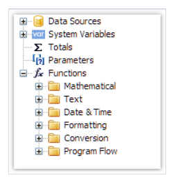

# 函数

FastReport.NET 包含了大量的内置函数(超过60个), 所有的函数划分到单独的分类,并且能够通过`Data` 窗口访问。



你能够在任何表达式中使用一个函数,在脚本中, 或者在文本中打印它的值,例如,在文本对象中打印结果:

```text
[Sqrt(4)]
```
这将打印4的平凡根 = 2

下面的表达式将返回4:
```text
Sqrt(4) + 2
```

让我们看一下插入函数到报表的方式:

1. 你能够从数据窗口拖拽它到报表页中, 然后会创建文本对象, 其中包含了函数调用,你能够编辑文本并增加参数到函数调用.
2. 你能够拖拽函数到脚本代码中。
3. 在表达式编辑器中, 你能够以相同方式从数据窗口中复制操作, 你能够拖拽并放置它们到表达式中。

## 分类

1. 数学类的

   1. Abs 返回绝对值
   2. Acos 返回反余弦弧度(角度)

      > 将返回值  * 180 / Math.PI 转换弧度到角度.
   3. Asin
      返回（反正弦）弧度 ,假设sine 的值是 d, `d` 位于 -1 到 1
   4. Atan

      返回反正切弧度

      ```text
      Atan(1) * 180 / Math.PI = 45
      ```
      
   5. Ceiling
      返回天花板值(大于或者等于d的最小整数)
   6. Cos

      返回余弦值(根据指定角度)
   7. Exp
      返回e的指定幂次。 e 自然对数的底数是 2.71828

   8. Floor
      返回小于等于给定值的最大整数。
   9. Log
      返回给定值的对数
      ```text
      Log(2.71828) = 1
      ```
   10. Maximum

      返回最大值
   11. Minimum
      返回最小值
   12. Round
      返回d最接近的整数,四舍五入
   13. Sin
      正弦值
   14. Sqrt
      平方根
   15. Tan
      返回正切值
   16. Truncate
      计算数的整数部分
## 文本类

   这些函数并不会修改传递的字符串,相反,他们返回一个新的字符串。
   
第一个字符串从下标0开始, 记住当和需要下标的函数一起工作时需要注意。
1. Asc

   返回对应字符的字符代码的整数值
2. Chr

   返回和指定字符代码相关联的字符
3. Insert

   参数: 字符串, 插入下标, 插入值
   
   ```text
   Insert("ABC", 1, "12") = "A12BC"
   ```
4. Length

返回字符串长度
```text
Length('abc') = 3
```
5. LowerCase
   返回给定字符串的所有小写形式
```text
LowerCase("ABC") = "abc"
```
6. PadLeft

右对齐, 在给定字符串左边填充空格加上剩余字符 等于总宽度。
```text
PadLeft("abc","5") = "  abc"
```

当然也可以填充给定字符
```text
PadLeft("ABC", 5, '0') = "00ABC"
```

7. PadRight

同上,左对齐

8. Remove

从给定下标处移除所有字符
```text
Remove("ABCD", 3) = "ABC"
```

也可以指定要移除多少数量的字符
```text
Remove("A00BC", 1, 2) = "ABC"
```
9. Replace

   替代给定子串为新串
```text
Replace("A00", "00", "BC") = "ABC"
```
10. Substring

从给定字符串中截取一部分子串,从给定下标开始截取
```text
Substring("ABCDEF", 4) = "EF"
```
也可以决定截取多少:
```text
Substring("ABCDEF", 1, 3) = "BCD"
```
11. TitleCase

   转换指定的字符串为开头大写
```text
TitleCase("john smith") = "John Smith"
```
12. Trim

   移除字符串左右两边的空格
```text
Trim(" ABC ") = "ABC"
```
13. UpperCase

   返回字符串大写形式
   
## 日期和时间

为了设置指定的日期,你能够使用`DateTime` 构造器或者`ToDateTime` 函数 或者`DateSerial` 函数。

例如,为了创建一个日期和时间 - 通过构建器:
```text
new DateTime(year, month, day, hours, minutes, seconds);
```

当使用日期转换函数的时候, 时间信息默认会保留,为了移除时间,那么使用`Format` 或者`FormatDateTime` 函数。

例如,`[Employees.BirthDate]` 字段能够使用在这些函数中

下面展示了格式化完成的结果。
```text
[Employees.BirthDate] = 27.01.1986
```

1. AddDays
增加多少天,返回增加天之后的新日期
```text
AddDays(new DateTime(2024,4,2), 2) = 4/4/2024 12:00:00 AM
AddDays(ToDateTime("4/2/2024"), 2) = 4/4/2024 12:00:00 AM
AddDays([Employees.BirthDate], 2) = 1/29/1986 12:00:00 AM
```

2. AddHours

增加小时到给定日期, 返回一个新值

```text
AddHours(new DateTime(2024,4,2,5,30,5), 1) = 4/2/2024 6:30:05 AM
AddHours(ToDateTime("4/2/2024 5:30:05"), 1) = 4/2/2024 6:30:05 AM
AddHours([Employees.BirthDate], 1) = 1/27/1986 1:00:00 AM
```

3. AddMinutes

增加分到给定日期, 返回新日期
```text
AddMinutes(new DateTime(2024,4,2,5,30,5), 10) = 4/2/2024 5:40:05 AM
AddMinutes(ToDateTime("4/2/2024 5:30:05"), 10) = 4/2/2024 5:40:05 AM
AddMinutes([Employees.BirthDate], 10) = 1/27/1986 12:10:00 AM
```
4. AddMonths

增加多少月
```text
AddMonths(new DateTime(2024,4,2,5,30,5), 2) = 6/2/2024 5:30:05 AM
AddMonths(ToDateTime("4/2/2024 5:30:05"), 2) = 6/2/2024 5:30:05 AM
AddMonths([Employees.BirthDate], 2) = 3/27/1986 12:00:00 AM
```
5. AddSeconds
增加多少秒
```text
AddMonths(new DateTime(2024,4,2,5,30,5), 2) = 6/2/2024 5:30:05 AM
AddMonths(ToDateTime("4/2/2024 5:30:05"), 2) = 6/2/2024 5:30:05 AM
AddMonths([Employees.BirthDate], 2) = 3/27/1986 12:00:00 AM
```
6. AddYears
增加多少年
```text
AddYears(new DateTime(2024,4,2,5,30,5), 3) = 4/2/2027 5:30:05 AM
AddYears(ToDateTime("4/2/2024 5:30:05"), 3) = 4/2/2027 5:30:05 AM
AddYears([Employees.BirthDate], 3) = 1/27/1989 12:00:00 AM
```
7. DateDiff

两个日期相差间距(天 / 小时 / 分 / 秒)
```text
DateDiff(new DateTime(2024,4,2,5,0,0), new DateTime(2025,1,2,5,30,5)) = -275.00:30:05
DateDiff(ToDateTime("1/2/2025 5:30:05"), ToDateTime("4/2/2024 5:00:00")) = 275.00:30:05
DateDiff(ToDateTime("4/2/2024 5:00:00"), [Employees.BirthDate]) = 13945.05:00:00
```
8. 日期序列
   根据给定年月日创建一个`DateTime` 
```text
DateSerial(2024,4,2) = 4/2/2024 12:00:00 AM
```

9. Day


   获取当前日子在当月的那一天(1-31)
```text
Day(new DateTime(2024,4,2)) = 2
Day(ToDateTime("4/2/2024")) = 2
Day([Employees.BirthDate]) = 27
```
10. DayOfWeek

   当前周的某一天,返回周内的本地化名称(周一.. 到周7)
```text
DayOfWeek(new DateTime(2024,4,2)) = "Tuesday"
DayOfWeek(ToDateTime("4/2/2024")) = "Tuesday"
DayOfWeek([Employees.BirthDate]) = "Monday"
```
11. DayOfYear

   返回这一年的第几天
```text
DayOfWeek(new DateTime(2024,4,2)) = 93
DayOfWeek(ToDateTime("4/2/2024")) = 93
DayOfWeek([Employees.BirthDate]) = 27
```

12. DaysInMonth

返回给定月内的第几天
```text
DaysInMonth(2024, 4) = 30
```
13. Hour

   返回给定日期当前小时时间(0-23)
```text
Hour(new DateTime(2024,4,2,5,30,5)) = 5
Hour(ToDateTime("4/2/2024 5:30:05")) = 5
Hour([Employees.BirthDate]) = 0
```
14. Minute

返回当前日子内的分时间(0-59)
```text
Minute(new DateTime(2024,4,2,5,30,5)) = 30
Minute(ToDateTime("4/2/2024 5:30:05")) = 30
Minute([Employees.BirthDate]) = 0
```

15. Month

返回当前日子所属月
```text
Month(new DateTime(2024,4,2)) = 4
Month(ToDateTime("4/2/2024")) = 4
Month([Employees.BirthDate]) = 1
```

16. MonthName

返回当前日子所属月的名字
```text
Month(new DateTime(2024,4,2)) = 4
Month(ToDateTime("4/2/2024")) = 4
Month([Employees.BirthDate]) = 1
```
17. Second

返回分钟内的秒数(0-59)
```text
Second(new DateTime(2024,4,2,5,30,5)) = 5
Second(ToDateTime("4/2/2024 5:30:05")) = 5
Second([Employees.BirthDate]) = 0
```
18.Year
返回年份
```text
Year(new DateTime(2024,4,2)) = 2024
Year(ToDateTime("4/2/2024")) = 2024
Year([Employees.BirthDate]) = 1986
```