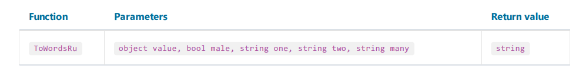

# 转换
1. ToBoolean

    转换值为boolean.

```text
ToBoolean(1) = true
ToBoolean(0) = false
```

2. ToByte

转换为字节
```text
ToByte("55") = 55
```

3. ToChar
转换为字符
```text
ToChar(65) = 'A'
```
4. ToDateTime
转换为时间(DateTime)
```text
ToDateTime("4.2.2024") = 04/02/2024 12:00:00 AM
ToDateTime("4,2,2024") = 04/02/2024 12:00:00 AM
ToDateTime("4/2/2024") = 04/02/2024 12:00:00 AM
```

5. ToDecimal
转换值为十进制
```text
ToDecimal(1) = 1m
ToDecimal("1") = 1m
```
6. ToDouble

转换值为浮点数
```text
ToDouble(1) = 1
ToDouble("1") = 1
```
7. ToInt32

转换值为整数
```text
ToInt32(1f) = 1
ToInt32("1") = 1
```
8. ToRoman
转换数值到罗马呈现,数字必须是1-3998
```ToRoman(9) = "IX"```
9. ToSingle

    将值转换为浮点数
```text
ToSingle(1m) = 1f
ToSingle("1") = 1f
```

10. ToString

将值转换为字符串
```text
ToString(false) = "False"
ToString(DateTime.Now) = "04/02/2024 8:41:00 PM"
```

11. ToWords

将货币转换为词
```text
ToWords(1024.25) = "One thousand and twenty-four dollars and 25 cents"
```

也可以指定货币形式:
1. `USD` 美刀
2. `EUR` 欧元
3. `GBP` 英镑
```text
ToWords(1024.25, "EUR") = "One thousand and twenty-four euros and 25 cents"
```

也可以转数字到单词, 同时可以指定单数和复数的名称:
```text
ToWords(124, "page", "pages") = "One hundred and twenty-four pages"
ToWords(1, "page", "pages") = "One page"
```
12. ToWordsEnG

转换指定的货币到 (大不列颠 英语) - Great Britain english. 和ToWords所有不同的是:

1. GBP 货币形式默认使用
2. 当转换10亿和万亿的时候使用不同的词.

```text
ToWordsEnGb(121) = "One hundred and twenty-one pounds and 00 pence"
```
当然你可以设定货币形式。
```text
ToWordsEnGb(1024.25, "EUR") = "One thousand and twenty-four euros and 25 cents"
```

当然你也可以在转换数字的时候设置单数和复数形式的词语
```text
ToWordsEnGb(124, "page", "pages") = "One hundred and twenty-four pages"
ToWordsEnGb(1, "page", "pages") = "One page"
```
13. ToWordsRu

转换货币为俄国的形式
```text
ToWordsRu(1024.25) = "Одна тысяча двадцать четыре рубля 25 копеек"
```

你同样能够指定货币形式:
1. `RUR` 卢布
2. `UAH` 格里夫纳
3. `USD` 美元
4. `EUR` 欧元
```text
ToWordsRu(1024.25, "EUR") = "Одна тысяча двадцать четыре евро 25 евроцентов"
```

将指定的整数值转换为俄语单词。 male 参数表示名字的性别。one、two 和 five 参数包含分别用于数字“1”、“2”和“5”的单词形式。

单双、5以上分别设置。


```text
// the "страница" word is of female gender, male = false
ToWordsRu(122, false, "страница", "страницы", "страниц") =
"Сто двадцать две страницы"
// the "лист" word is of male gender, male = true
ToWordsRu(122, true, "лист", "листа", "листов") =
"Сто двадцать два листа"
```
