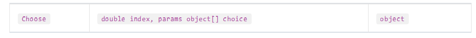
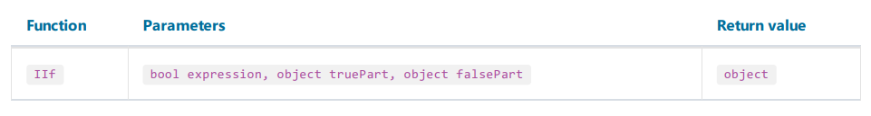
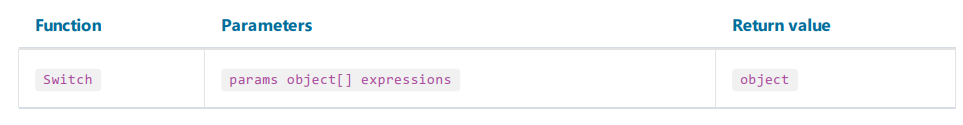

# 条件判断

## Choose



选择, 从给定下标中选择一个对象;
```text
Choose(2, "one", "two", "three") = "two"
```

## IIf



返回一个表达式, 如果为true,则返回`truePart` 部分的结果,否则返回`falsePart` 部分的结果。
```text
IIf(2 > 5, "true", "false") = "false"
```

## Switch



是一个表达式数组, 由条件-值对组成, 返回第一个条件为true的值:

```text
// returns one of the following values - "а greater than 0",
// "а less than 0", "а equals to 0", depending on "a" value
Switch(
a > 0, "а greater than 0",
a < 0, "а less than 0",
a == 0, "а equals to 0")
```

## IsNull

返回参数是否为空,这个参数可以是数据库列名,或者参数名,或者汇总的名,必须双引号包裹。

如果通过参数`name` 指定的对象的值为空,那么返回true, 否则返回false.
```text
IsNull("Parameter")
```
