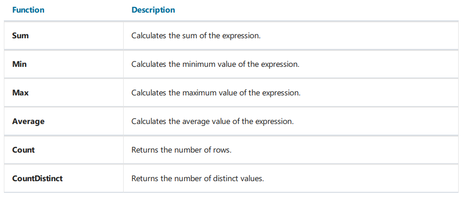

# 汇总值

在许多报表中,我们需要使用某些汇总信息,例如分组的求和, 列表中的行数, 以及其他汇总,FastReport 使用汇总来执行这个任务, 对于汇总,你需要指定下面的参数:

1. 汇总函数类型
2. 表达式, 被用来计算的, 对于`Count` 函数,你不需要指定表达式。
3. 条件,  如果条件成立,则执行函数, 它并不是必要去设置条件的
4. 数据带, 处理此函数的地方
5. 带, 汇总值所打印的地方(一般是文本对象)

## 以下函数不再详细解释

## 创建一个汇总

假设有一个主从报表:

数据如下:

我们想要为报表增加一个汇总去打印每一个分类在库存中的总量, - 根据`UnitsInStock` 数据字段汇总,然后汇总打印在数据尾带上。

首先我们需要创建汇总, 点击数据窗口中的`Action` 按钮, 然后选择`New Total` 项即可, 或者在数据树的`Total` 元素上右击 然后选择`New total` 菜单项。

你能够看到汇总编辑器窗口:

现在你能够设置汇总的名称了,  它将通过名称引用汇总, 名称也能够很容易理解它计算了什么, 让我们它为`TotalUnits` ..

然后我们选择`Sum` 函数。

现在我们需要制定我们计算汇总值的数据范围,  我们选择`Evaluate on Each row of the band` ,评估带中的每一行数据,
然后选择其中产品列表所打印的带, 在`Print on the band` 打印到那个带上的字段中,我们选择这个汇总值打印到哪里, 选择数据尾带。

现在我们能够看到我们的报表设计器中的报表页:

现在运行能够得到以下报表:

## 条件汇总

同上,但是我们仅设置条件即可,仅当条件满足我们才会对这些行进行计算:

例如这个条件意味着, 对于那些没有设置`Discontinued` 标志的产品才进行计算。

## 运行汇总

在我们的示例中汇总将在打印数据尾带之后重置,这是必然的,因为我们在汇总编辑器中设置了它在打印之后重置, 因此,每一个分类打印他们自己的汇总值.

如果我们不选择`Reset after print` 打印之后不重置的选项, 那么汇总将不会在打印之后重置, 这就是为什么叫做运行汇总;

如果你需要同时打印两种类型的汇总, 普通和运行汇总, 创建一个新的汇总 - 具有相似的配置 但是不选择打印重置。

## 页面汇总

为了创建一个打印在页面尾带的汇总,你需要在`Print on the band` 字段指定页尾带。

## 打印汇总在头部

通常是打印在尾部, 这是正常的打印顺序, 此时你这个值是计算好了的并且可以使用, 然而某些情况你需要在头部打印的时候,例如分组头,此时你尝试这样做,你会看到一个0值,
因为此时打印汇总的时候,它可能还没有计算。

为了解决这个问题, FastReport 有一个特性叫做`延迟打印`, 这个文本对象有一个`ProcessAt` 的属性 -可以有以下的值:

1. Default 默认打印模式,  它是默认值
2. ReportFinished  此对象的值将会在报表最后开始计算
3. ReportPageFinished 此对象将会在当前页的所有带打印完成之后计算。
4. PageFinished   在页面最后才计算此对象的值.
5. ColumnFinished 在列最后才计算此对象的值
6. DataFinished  此对象将会在数据带的最后(当它的尾已经打印之后)才计算此对象的值
7. GroupFinished 此对象将会在分组的最后(此时它的尾部已经打印了)计算。

让我们看一下它如何工作, 放入一个文本对象来打印汇总, 在分组头上, 设置此对象的`ProcessAt`属性为`GroupFinished` .

当你运行此报表时, FastReport 将做以下事情:

1. 先打印Group header, 汇总值0(错误的)将打印, 但是FastReport 将会记住它然后在最后处理它。
2. 它将打印所有数据行
3. 它将打印分组尾, 此时,FastReport 将会获取这个已经在分组头部打印的对象,然后处理它再次打印正确的汇总值。

准备好的报表如下所示:

使用`ProcessAt` 属性的其他属性, 你能够在报表标题中打印报表汇总值(设置`ProcessAt = ReportFinished`),或者在页头上打印页汇总(设置`ProcessAt=PageFinished`).

> 对于延迟打印的特性将不会工作 - 如果你开启了报表文件缓存(`Report|Options..` 报表|选项 菜单) - `Use file cache` (使用文件缓存).

