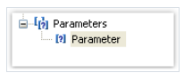
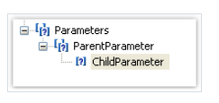

# 报表参数

你能够在报表中定义参数,参数是一个变量, 它的值能够同时定义在报表中或者报表的外面(例如程序, 调用报表并传递参数值到它。)

一个参数能够在表达式中使用并且能够展示在报表对象中(例如文本对象).

大多数参数的常见方法:
1. 设置在一个参数上的条件数据过滤
2. 在报表中的参数值打印

> 一个参数具有以下参数:

1. Name 参数名能够有符号,除了`.` .
2. DataType 参数数据类型
3. Expression  返回参数值的表达式,  大多数关于表达式的详情能够在`表达式章节` 了解更多, 这个表达式在调用此参数的时候会处理。
4. Value   参数值, 这个值在设计器中是不可用的 并且应该通过编程方式加载。

你能够设置`Name` 和`DataType` 属性, 表达式也能够留空,这种情况下参数的值应该编程的方式传入。

## 创建一个参数

为了创建参数, 能够在数据 窗口中选择`parameters`(参数)元素, 然后右击它并在它的上下文菜单中选择`New Paramter` 新增菜单项。

点击F2 并给它设置一个参数名, 然后切换到属性串钩并设置参数的`DataType` 属性。



参数可以内嵌,这种称为内嵌参数(它们的父亲,叫父参数),为了创建一个内嵌参数, 则选择一个参数然后右击并在它的上下文菜单中同上选择新增参数项即可。


你能够引用父、或它的内嵌参数, 内嵌的级别是不限制的。


## 报表中使用参数

通过表达式引用即可,和文本对象中的表达式一样:
```text
[Parameter name]
```

为了使用内嵌参数,你需要使用以下方法:
```text
[Parent parameter.Child parameter]
```

因为参数已经定义了类型(根据`DataType` 属性指定的), 然后我们可以对这些参数做一些它数据类型允许的动作,因此表达式中的字符串参数能够调用字符串的相关方法,
例如截取:
```text
[StringParameter].Substring(0, 2)
```

让我们查看使用参数的一个示例, 假设我们有一个打印`Employees` 员工表格的报表, 我们想想要修改报表去打印指定员工号的员工的信息, 为了这样做, 我们需要根据`EmployeeID` 
数据列进行数据过滤,  创建一个`EmployeeID` 名称的参数, 指定参数名为`Int32`, 它和`EmployeeID` 数据列的类型相同, 为了过滤给定员工编号的员工,我们
需要进入数据带编辑器 然后在过滤标签页中设置过滤数据的表达式:
```text
[Employees.EmployeeID] == [EmployeeID]
```
为了从程序传递参数值到报表,使用以下代码:
```text
report1.SetParameterValue("EmployeeID", 2);
```
