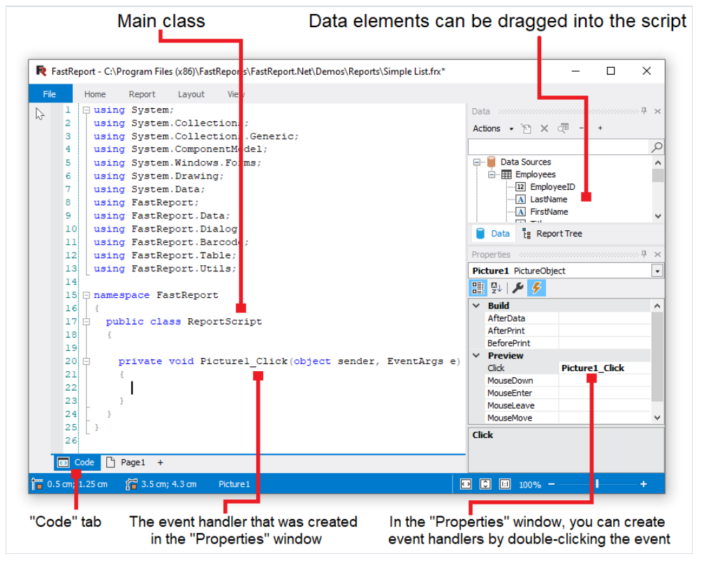
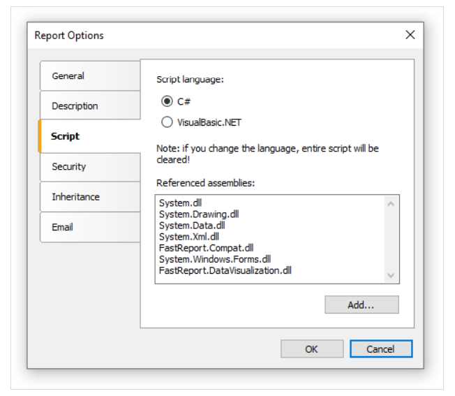
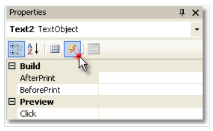
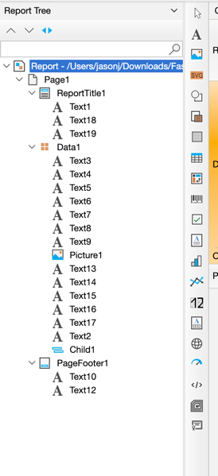
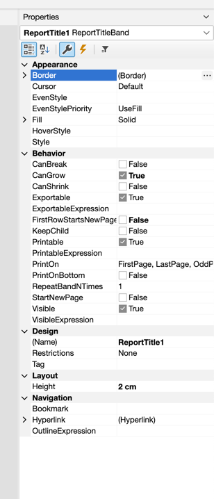
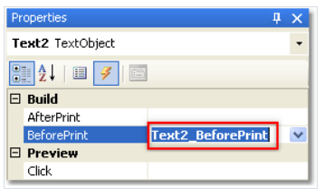
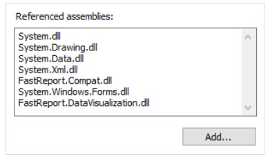
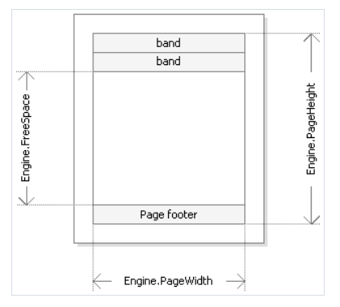

# 脚本

脚本是高级的编程语言, 它是报表的一部分, 脚本能够根据以下语言进行编写:

1. C#
2. VisualBasic.NET

一个脚本可以用在许多地方, 使用脚本你能够做以下事情:

1. 执行数据处理, 那些不能通过正常FastReport 引擎的方式。
2. 控制包报表页面以及页上面的带的打印。
3. 控制在对话框上的元素之间的交互
4. 控制动态表格对象的排列(编排)。
5. 以及其他更多内容。

为了查看报表的脚本,切换到设计器的代码:



脚本语言能够通过报表选项菜单设置。

最好是在你创建一个新报表之后去设置, 因为当你改变语言之后,存在的脚本将会删除。


对比与其他报表生成器来说, FastReport仅包含哪些你编写的脚本, 
1. 在这个脚本中,你能够增加你的变量,方法、以及属性到主脚本类中.
2. 创建一个脚本对象事件处理器
3. 增加新类到脚本,如果需要的话, 一个类能够增加到`ReportScript` 主类之前或者之后。

你不能:

1. 删除、重命名或者改变`ReportScript` 主类的可见区域。
2. 重命名其中这个主类所在的一个命名空间

当这个报表运行的时候,下面的事情将会发生:
1. FastReport 给脚本增加一组变量,这些变量的名称是报表对象的名称, 它将会在编译之前完成 并且允许你根据那些名称去引用报表对象。
2. 一个表达式处理器会增加到脚本中,它将处理在脚本中发现的所有表达式.
3. 一个脚本会被编译, 如果它不为空
4. 然后脚本类会初始化
5. 报表运行


## 事件处理器

一个脚本主要为了创建事件处理器, 为选择的对象创建事件处理器.

在属性窗口, 点击按钮, 为了切换到一组事件:


选择你想要的事件并双击即可, 然后FastReport 将会增加一个空的事件处理器到报表代码中:
```text
private void Text2_BeforePrint(object sender, EventArgs e)
{
}
```

报表对象也有事件, 这些对象根据以下方法进行选择:
1. 从报表树中选择`报表` 


2. 从属性窗口中的下拉列表中选择`Report`(报表)



为了删除事件处理器, 选择属性窗口中的事件,选择文本并点击`Delete` 键。



## 报表的事件

为了控制报表的最大灵活性, 每一个报表对象都有各种事件, 例如,在一个处理器中, 连接到数据带, 你能够过滤一些词, 那就是 可以根据某些条件展示或者隐藏带.

让我们考虑这个事件:  在报表的生成过程中触发, 举个例子, 我们将制作一个简单报表, 包含了一个页面,一个数据带以及带中的两个文本对象。

在报表的开始, 这个报表对象将触发`StartReport` 事件, 在报表页编排之前, 这个`StartPage` 事件将会触发。

这个事件对于每一个模版页都将触发(不要和最终报表页产生疑惑), 在这个示例中, 不管最终报表有多少页, 这个事件仅触发一次, 因为模版报表就一页,然后
`CreatePage` 事件将会调用 - 当最终报表创建这个页面的时候。


然后,数据带将会开始打印行, 根据以下形式发生:

1. `BeforePrint` 带的事件将会触发
2. 位于带中的所有对象的`BeforePrint` 事件将会触发。
3. 所有对象加载数据
4. 然后带中的所有对象的`AfterData` 事件将会触发。
5. `BeforeLayout` 带事件将会触发。
6. 在带中的所有对象将会放置,带的高度将计算并且带将延伸(如果能);
7. 然后`AfterLayout` 带的事件将会触发。
8. 如果带无法在页上完整打印, 将会产生一个新页。
9. 然后带以及所有它的对象都显示在最终报表页上。
10. `AfterPrint` 带事件触发。
11. 所有这个带的对象的`AfterPrint`将会触发。

带的行将会根据数据源中的数据来打印(和数据源中的数据一样长) - 数据源中有数据, 在此之后, 报表的编排将结束。

然后页面的`FinishPage` 事件将会触发,最终再触发`Report` 报表的`FinishReport` 事件。

因此, 通过使用不同对象的事件, 你能够控制报表构建的每一个步骤.  关键是正确使用这些事件, 完全理解带打印的过程, 在上11一个步骤已经解释完成。

因此,大量的操作能够在`BeforePrint` 事件中,任何在这个对象上的改变都能够显示.

但是在这个事件中,它没法分析, 这个带在那个页上打印, 如果它延伸了,因为带的高度将会在第6步计算, 所以需要第7步中的`AfterLayout` 或者第10步的`AfterPrint` 事件。

但是在后者的情况下, 带已经打印了, 这些对象的操作已经没有意义了。

换句话说,你必须清楚的规定, 什么时候那个事件触发和使用, 然后给与它们相应的任务。

## 使用`.NET` 对象

在脚本中,你能够使用任意的`.NET` 对象, 他们定义在以下装备中:
```text
System.dll
System.Drawing.dll
System.Windows.Forms.dll
System.Data.dll
System.Xml.dll
```

除此之外,你能够使用任何对象 - 来自FastReport 程序集中定义的.

如果你需要其他程序集, 在报表配置中设置, 通过选择`Script` 脚本标签页进行配置。



例如, 如果你想要使用一个函数 - 来自你的应用程序, 增加应用程序集(`.exe` ,`.dll`) 到报表的程序集列表, 然后你能够通过应用的命名空间去调用函数,
例如,如果你使用了一个来自应用的函数:
```text
namespace Demo
{
public static class MyFunctions
{
public static string Func1()
{
return"Hello!";
}
}
}
```
根据以下方式调用即可,
```text
string hello = Demo.MyFunctions.Func1();
```

如果你在脚本的顶部使用`using Demo`, 它将可以缩减语法:
```text
string hello = MyFunctions.Func1();
```

## 引用报表对象

引用报表对象,例如文本对象 - 根据对象名引用, 下面的示例将返回文本对象的高度。
```text
float height = Text1.Height;
```

注意, 报表对象的尺寸的本质单位是屏幕像素, 记住当你使用这些对象属性的时候`Left,Top,Width,Height`, 为了转变像素到厘米 或者相反, 使用`Units` 类中的这些常量
```text
float heightInPixels = Text1.Height;
float heightInCM = heightInPixels / Units.Centimeters;
Text1.Height = Units.Centimeters * 5; // 5cm
```

## 报表和引擎对象

除了对象之外, 还有两种变量可以使用: `Report` 和`Engine` .

`Report` 变量表示当前报表对象,  下面列表列出了它的相关方法:

1. `object Calc(string
   expression)` 计算表达式并返回值, 第一次调用此方法的时候,表达式将会编译,它需要一些时间。
2. `object GetColumnValue(string
   complexName)` 获取数据列中的值, 这个名称必须是`DataSource.Column` 表格中呈现的那样,  如果列如果为空, 那么它将转换为默认值(0,空字符串,或者`false`)
3. `object
   GetColumnValueNullable(string
   complexName)` 返回数据列的值, 相比于前的方法, 它不会转换默认值 并且可能返回null.
4. `Parameter GetParameter(string
   complexName)` 返回给定名称的报表参数, 名称能够是复合形式的,例如用来获取内嵌参数`MainParam,NestedParam` ..
5. `object
   GetParameterValue(string
   complexName)` 返回给定名称的报表参数的值
6. `void SetParameterValue(string
   complexName, object value)` 设置给定名称的报表参数的值.
7. `object
   GetVariableValue(string
   complexName)` 返回系统变量的值, 例如`Date` 
8. `object GetTotalValue(string
   name)` 返回定义在数据窗口中的汇总的值, 根据名称获取
9. `DataSourceBase
   GetDataSource(string alias)` 根据名称获取定义在报表中的数据源。

`Engine` 对象 是一个引擎被用来控制报表的创建, 通过使用引擎的方法和属性,你能够管理放置带到页面的过程,你能够使用引擎的下面属性:
1. `float CurX`  当前x轴上的坐标, 这个属性能够设置一个值,然后去偏移打印的对象。
2. `float CurY` 当前y轴上的坐标, 能够赋值去偏移打印的对象。
3. `int CurColumn` 在多列报表中的当前列的下标,第一个列是从0开始。
4. `int CurPage` 表示打印的当前页码, 这个值能够根据`Page` 系统属性获取
5. `float PageWidth` 页面的宽度减去左右外偏距(Margins)
6. `float PageHeight` 页面的高度减去上下外偏距(Margins)
7. `float PageFooterHeight` 页面尾部的高度(以及它所有的子带)
8. `float ColumnFooterHeight` 列尾的高度(以及它所有的子带)
9. `float FreeSpace` 当前页面上的剩余空间
10. `bool FirstPass` 返回true, 表示这是报表的第一次渲染通道, 通道值可以从`Report.DoublePass` 属性获取
11. `bool FinalPass` 返回true, 表示报表的最后一次渲染通道将被执行。

在下面的图中,你能够看到一些上面列出的属性:



`Engine.PageWidth` 和`Engine.PageHeight` 属性决定了打印区域的尺寸, 基本上小于实际的页面尺寸, 打印区域的尺寸是根据页面的外边距决定的,外边距
根据`LeftMargin, TopMargin,RightMargin,BottomMargin` 页面属性设置。

`Engine.FreeSpace` 属性决定了页面上剩余空间的高度, 如果这里包含了页尾, 它的高度也将会考虑(计算`FreeSpace), 注意到当带打印之后,剩余空间将会减少。

最终报表页面的构建是如何发生的, FastReport 引擎在页面上渲染带需要足够的空间, 当没有足够的空间时,`Report footer` 报表尾将会打印,然后产生一个新的空白页.

然后从当前位置显示带, 当前位置是通过`X`和`Y` 坐标确定的, 这个位置是根据`Engine.CurX` 和`Engine.CurY` 属性返回的,在打印一个带之后,
`CurY` 将自动的根据打印带的高度增加, 构建新页之后, `CurY` 的位置将重置为0, `CurX` 的位置在打印多列报表的时候会发生变化。

`Engine.CurX` 和`Engine.CurY` 属性能够访问(不仅为了读,也可以写), 这意味着我们能够手动的使用某些合适的事件去偏移带的打印, 有关这些属性的使用查看示例。

> 当和这些属性工作的时候,返回的尺寸或者位置,都是像素测量值。


同样引擎也有一些方法:

1. `void AddOutline(string
   text)` 增加元素到报表大纲中,然后设置当前位置到增加的元素.
2. `void OutlineRoot() ` 在大纲的根上设置当前位置
3. `void OutlineUp() ` 偏移当前位置到更高层级的大纲元素.
4. `void
   AddBookmark(string
   name)` 增加一个书签
5. `int
   GetBookmarkPage(string
   name)` 返回给定名称的书签在那一页.
6. `void StartNewPage() ` 开启一个新页, 如果报表是多列,从新列开始。

使用`AddOutline, OutlineRoot,OutlineUp` 方式时, 你能够手动的构建报表大纲, 通常情况下,这能够在`OutlineExpression` 属性的帮助下自动完成.

每一个带和报表页都有这个属性。

`AddOutline` 方法增加一个子元素到当前大纲元素中, 然后将子元素作为当前大纲元素, 然后当前报表页以及当前页的当前位置则关联到新元素,如果你调用
`AddOutline` 方法多次, 那么你能够得到以下结构:
```text
Item1
    Item2
        Item3
```

为了控制当前元素,`OutlineUp` 以及`OutlineRoot` 方法则可以做到, 第一个方法移动指针到这个元素的更高一层,因此这个脚本如下:
```text
Engine.AddOutline("Item1");
Engine.AddOutline("Item2");
Engine.AddOutline("Item3");
Engine.OutlineUp();
Engine.AddOutline("Item4");
```

将会产生如下结构:
```text
Item1
    Item2
        Item3
        Item4
```

`OutlineRoot`方法移动当前元素到大纲顶部,以下脚本:
```text
Engine.AddOutline("Item1");
Engine.AddOutline("Item2");
Engine.AddOutline("Item3");
Engine.OutlineRoot();
Engine.AddOutline("Item4");
```
产生如下结果:
```text
Item1
    Item2
        Item3
Item4
```
为了和书签一起工作,`AddBookmark` 以及`GetBookmarkPage` 方法能够被使用,通常情况下书签将会自动增加 - 使用`Bookmark` 属性,每一个对象都有.

使用`AddBookmark` 方法你能够编程式的增加书签, 这个方法在当前页面的当前打印位置创建一个书签。

`GetBookmarkPage` 将返回书签所在页面, 这个方法进场在创建目录的时候使用, 为了显示页码. 在这种情况下, 报表必须开启二次渲染(double pass);


