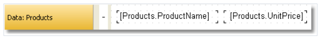
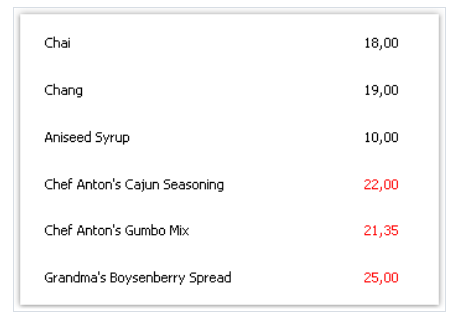
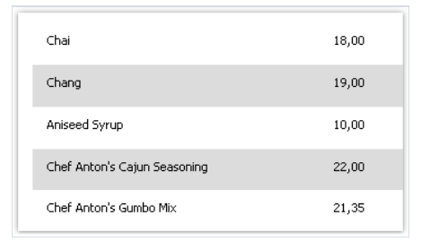
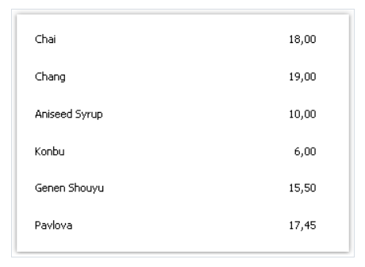
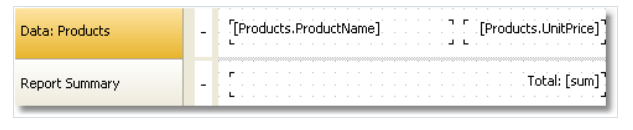
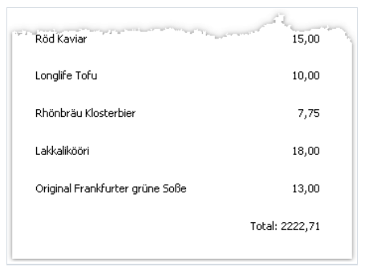
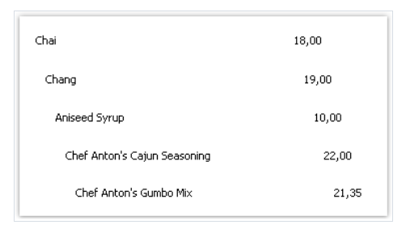

# 示例

## 1. 改变对象外观

1. 使用`BeforePrint` 事件
2. 从脚本中引用数据列

创建一个具有以下外观的报表:


选择这个对象, 它将打印`UnitPrice` 列, 然后创建`BeforePrint` 事件处理器。
```text
private void Text2_BeforePrint(object sender, EventArgs e)
{
if (((Decimal)Report.GetColumnValue("Products.UnitPrice")) > 20)
Text2.TextColor = Color.Red;
}
```

当你从数据窗口拖拽这个数据列的时候,则产生下面的代码
```text
((Decimal)Report.GetColumnValue("Products.UnitPrice"))
```

如果运行这个报表,则能够看到所有的产品, 如果价格大于20,则高亮为红色:


> 有关条件高亮,查看数据创建的条件高亮章节。

## 2. 偶数行高亮

1. 创建`BeforePrint` 带事件
2. 从脚本中引用`Row#` 系统变量

同上示例报表页面, 我们修改事件处理器:
```text
private void Data1_BeforePrint(object sender, EventArgs e)
{
if (((Int32)Report.GetVariableValue("Row#")) % 2 == 0)
Data1.FillColor = Color.Gainsboro;
}
```
有关变量引用的方式不在赘述。

如果运行报表,则看到偶数行高亮为亮灰色。



> 想通效果可以通过数据带的`EvenStyle` 属性完成。

## 3.数据过滤

这个示例基于给定条件隐藏数据带的行.

1. `BeforePrint` 带事件.
2. 从脚本中引用数据源

还是同上示例报表, 修改事件代码:
```text
private void Data1_BeforePrint(object sender, EventArgs e)
{
if (((Decimal)Report.GetColumnValue("Products.UnitPrice")) > 20)
Data1.Visible = false;
}
```

现在我们需要价格大于20的隐藏:



## 4.计算汇总值

通过编程形式计算汇总值:
1. `BeforePrint` 带事件。
2. 从脚本中引用数据列
3. 局部变量 以及它的值将会打印在报表中

现在创建一个以下形式的报表:


在脚本中,声明一个`sum` 变量,然后创建`BeforePrint` 事件:
```text
public class ReportScript
{
private decimal sum;
private void Data1_BeforePrint(object sender, EventArgs e)
{
sum += (Decimal)Report.GetColumnValue("Products.UnitPrice");
}
}
```

`Product.UnitPrice` 单元列将能放置到脚本中,从数据窗口拖拽即可。

 此时报表看起来像:
 
 

## 5. 移动打印位置

通过引擎对象来手动偏移打印位置。

1. BeforePrint 带事件
2. Engine 对象

同上示例,我们创建`BeforePrint` 事件处理器:

```text
private void Data1_BeforePrint(object sender, EventArgs e)
{
Engine.CurX = ((Int32)Report.GetVariableValue("Row#")) * 10;
}
```

如果运行这个报表,则能够看到:
