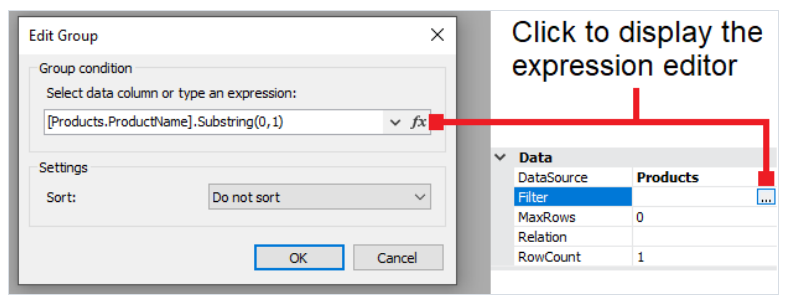
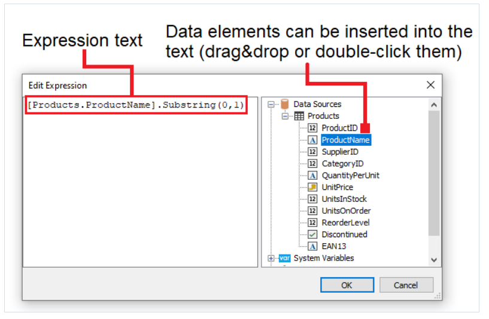

# 表达式编辑器

在FastReport的许多地方,使用了表达式,例如文本对象中可以包含表达式在`[]` 中.

一个表达式是`C#` 或者 `VB.NET` 语言的代码,它能够返回任意值, 例如:
```text
2 + 2
```

表达式的编写语言需要在报表的脚本标签页中进行选择,默认情况下是c#, 你能够设置为VB.

为了快速编写表达式, 使用表达式编辑器, 它能够FastReport UI的一些地方展示,然后你能够输入表达式:



表达式编辑器中 除了编写表达式之外你还能够插入某些数据元素到表达式中。


