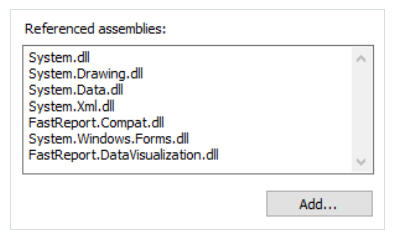

# 使用.NET函数

你能够在表达式中使用任何`.NET` 对象, 下面的示例中说明了`MAX` 函数的使用
```text
Math.Max(5, 10)
```

默认报表使用下面的`.NET` 库。
```text
System.dll
System.Drawing.dll
System.Windows.Forms.dll
System.Data.dll
System.Xml.dll
```

你能够访问这些库中的所有`.NET` 对象,如果你需要访问其他库, 增加它的名称到装配库即可, 你能够在`Report|Options...` 菜单中选择脚本元素标签页即可:


例如,如果你想要一个申明在你应用中的函数到报表中, 增加应用库(.exe 或者 .dll) 到报表装备库中, 然后你能够根据应用的命名空间去调用函数,例如,
如果下面的函数定义在你的应用中:
```text
namespace Demo
{
public static class MyFunctions
{
public static string Func1()
{
return "Hello!";
}
}
}
```

你能够在报表中根据以下方式调用此函数:
```text
Demo.MyFunctions.Func1()
```

如果你增加`using Demo` 一行到报表脚本的顶部, 那么它允许你使用简短语法。

```text
MyFunctions.Func1()
```

为了引用在脚本中定义的函数或者变量, 直接使用它们的名字即可:
```text
myPrivateVariableThatIHaveDeclaredInScript
MyScriptFunction()
```

> 你能够在表达式中仅使用这些函数去~~返回值.~~