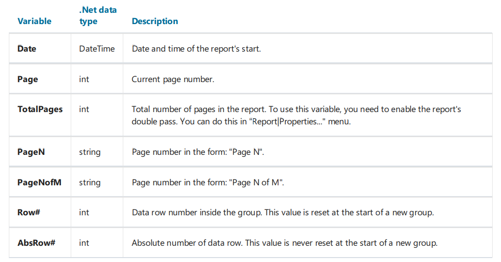

# 引用系统变量

你能在表达式中引用系统变量

下面的变量将不再赘述,查看数据章节了解更多。



每一个变量都有定义的数据类型, 此外,依赖于它将在表达式中如何使用, 这里是一个使用date 变量的示例:
```text
[Date].Year
```

这个表达式返回当前时间的年份, 因为`Date` 变量是一个`DateTime` 类型,  我们能够引用它的`Year` 属性,我们能够类似的方式获取它的`Month` 月份。

FastReport 转换系统变量的引用  - 根据以下方式(以`Date` 变量为例:)
```text
((DateTime)Report.GetVariableValue("Date"))
```