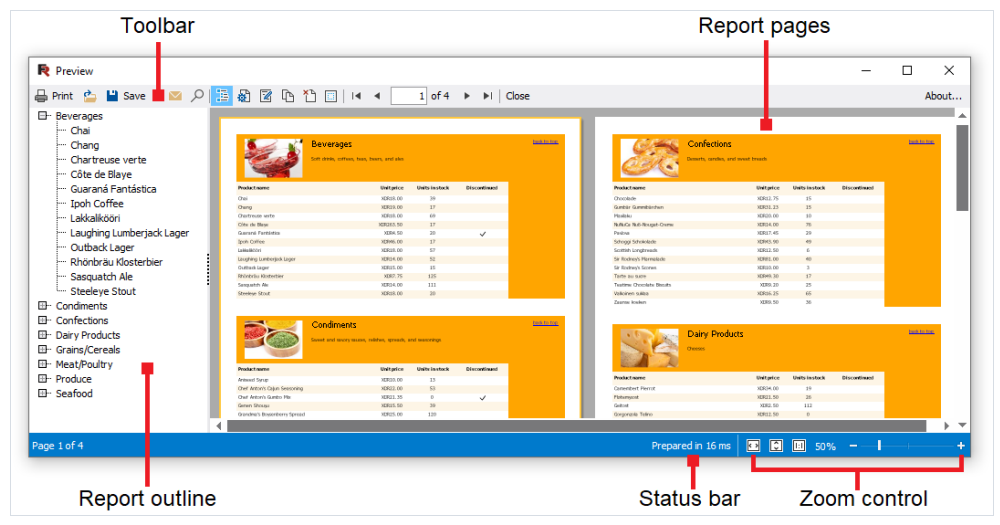
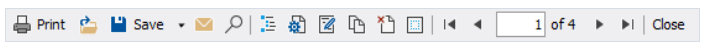
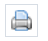
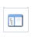
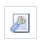
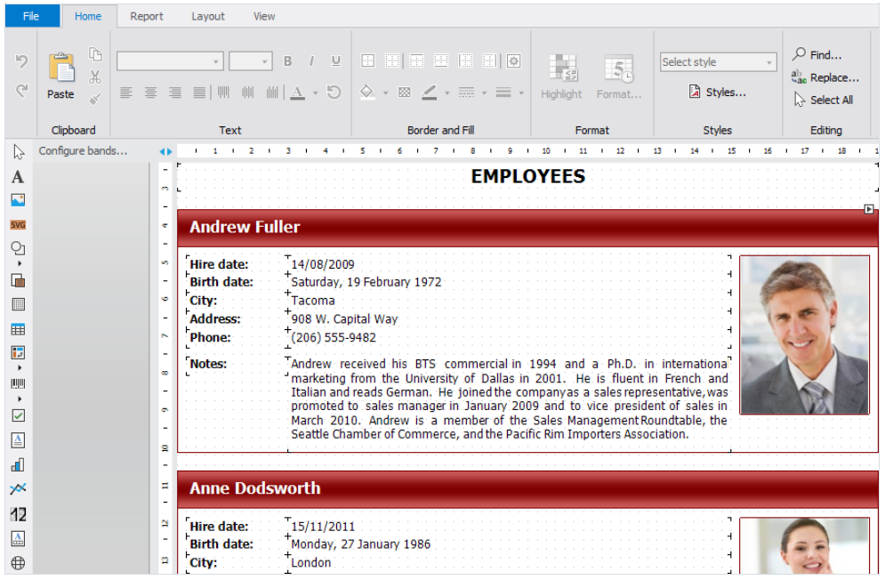

构建的报表能够展示在页面上, 然后在打印机上打印 或者根据任意支持的格式导出。
所有的这些都可以在预览窗口中完成。

其中包含了工具栏、报表页、报表大纲、状态条，缩放控制

在工具栏上,你能够看到以下按钮:

1.  打印报表
2.  打开以FPX格式存储的报表文件
3.  根据支持的格式之一保存报表
4.  发送电子邮件(将报表发送出去)
5.  在报表中搜索文本
6.  展示或者隐藏报表大纲
7.  页面设置
8.  编辑当前报表页
9.  水印设置
10.  导航到第一页
11.  导航到前一页
12.  导航到指定页,输入页码并导航
13.  导航到下一页
14.  导航到下一页

你能够使用以下快捷键:

1. `CTRL+P` 打印报表
2. `Ctrl+F` 文本搜索
3. `Arrows` 滚动预览
4. `PageUp,PageDown` 页面上下切换
5. `Home` 导航到第一页
6. `End` 导航到下一页
7. `Esc` 关闭预览窗口

为了编辑准备好的报表的某一页, 点击预览窗口中的 编辑按钮,然后当前页将会加载到报表设计器,然后你可以做你想要的事情:

在编辑之后, 关闭设计器, 然后它会询问是否保存修改到报表页中。
