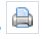
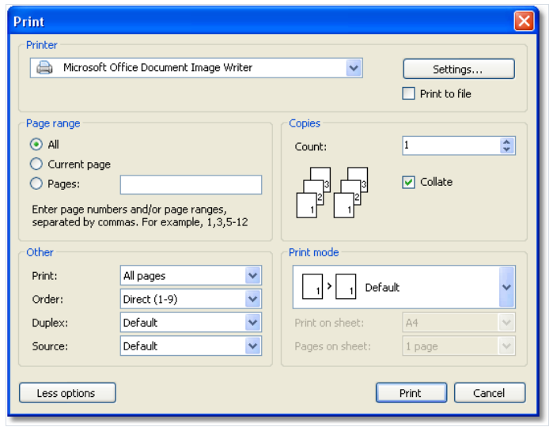

# 打印报表

为了打印报表, 点击按钮(或者点击快捷键`Ctrl+P`),你能够看到打印弹窗:

我们能够在对话框中看到一些可访问的设置:

1. `More/Less` 更多或者更少按钮能够展示全部设置还是基本设置, 默认情况下对话框展示为简单形式。
2. `Printer` 分组: 你能够选择打印机,改变它的设置(`Setting...` 按钮) 然后选择打印这个文件。
3. `Page` 分组: 你能够选择打印那一页(所有、当前或者给定页面);
4. `Copy` 分组: 你能够设置复制的数量并且选择复制中页面的顺序(`Collate` 核对、整理)
5. `Other` 分组: 你能够选择打印那些页(所有,偶数，奇数),选择打印的顺序(直接打印, 翻转),配置双工打印(如果打印机支持它),然后选择纸盒来源.
6. `Print mode` 分组允许你选择以下的打印模式:
    1. Default 打印机打到纸上(根据报表设置),一个报表页面对应一个打印页。
   2. Split big pages(拆分大页),使用这种模式,如果你需要在A4格式化页面上打印A3, 一个报表页将会产生两个打印页,当使用这种模式,你能够在`Print
on sheet(打印页)` 列表上设置。
   3. Scale 使用这种模式,例如你在A3 格式化页面上打印A4报表, 打印页的时候,你能够打印1,2,4 或者 8报表页,当使用这个模式,你需要你想要打印的选择页面的格式,
从`Printing on sheet` 打印页列表中设置, 同样也可以在`Pages on sheet` 列表上指定页数量。
在点击打印之后, 报表的打印将开始, 如果`Print to file`(打印到页面)的标志选择了, 那么请求一个打印文件名称并保存报表到文件中(具有`PRN` 扩展的文件)