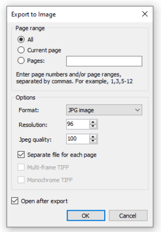

# 导出报表
FastReport 允许我们导出报表 - 以各种形式,为了后续编辑、归档、邮件以及其他目的。

为了导出,点击预览窗口中的`Save` 保存按钮 然后选择导出格式

此时,我们支持以下格式:

1. PDF
2. Office
   1. Excel 2007
   2. Word 2007
   3. PowerPoint 2007
   4. OpenOffice Calc / OpenOffice Writer
   5. RTF
   6. Excel XML(Excel 2003+)
3. Web
   4. HTML
   5. MHT
4. Images
    1. Bmp,Png,Jpeg,Gif,Tiff,Metafile
    2. SVG
5. Data Base(数据集)
   1. CSV
   2. DBF
   3. Json
6. Print

    1. TXT
    2. ZPL
    3. PPML
    4. PostScript
    5. XPS
7. Other
    1. LaTex
    2. DXF
    3. XAML

此外,它能够保存报表到云服务(例如: DropBox,Box,Google Drive,OneDrive,Simple Storage Service,以及 FTP 服务器)

## 保存到FPX 格式
FPX 格式是FastReport的原生格式, 这个格式有一些优点:

1. 不损失报表质量, 打开一个已经保存的文件,你能够对它进行操作,例如打印,导出,编辑。
2. 基于XML的紧凑格式,ZIP的帮助下压缩。
3. 当需要的时候, 报表文件能够根据任何支持ZIP格式的归档器解压 并且能够在任何文本编辑器中手动修正。

此格式的缺陷是, 查看它,你需要有FastReport.NET ..

为了保存在FPX格式, 点击预览窗口中的`Save` 按钮然后选择`Prepared report`(准备好的报表文件类型), 对于已经保存的文件选择`Open` 按钮打开即可。

## 导出到Adobe Acrobat(PDF)

PDF(Portable Document Format) 是一种平台无关的格式(然后是由 Adobe 系统创建的电子文档), 免费的Acrobat 阅读器包能够被用来查看, 这个格式是相对灵活的,
它允许去包括必要的字体、向量以及bitmap(位图)图片, 传输和存储文件 为了浏览或者后续打印。

导出方法是分层的:

当导出到Excel的时候,下面的弹窗将会用来设置输出文件的参数配置:

导出参数:

1. `Compressed` - 压缩  输出文件是压缩的, 它减少了文件尺寸 但是增加了导出时间。
2. `Embedded fonts` 在报表中使用的所有字体将包括到PDF文件中, 这将极大的增加文件尺寸。
3. `Background` 页面水印将导出为图片, 这将极大的增加文件的尺寸。
4. `Print optimized` 打印优化(所有图形对象的输出)是高质量的 - 为了后续打印。

在`Information` 信息标签页中,你能够填写文件的相关信息。

在`Viewer` 查看器标签页, 你能够设置一些和Adobe Acrobat 文档查看器的某些选项:

## 导出为RTF

RTF(rich text format) 富文本形式是由Microsoft 开发的转换文本信息的标准格式, 目前RTF文档兼容大多数新的文本编辑器和操作系统。

导出方法: `tabular`  - 扁平形式的.

当导出为RTF的时候,以下对话框用于设置输出文件的配置:

1. `Wysiwyg` - what you see is what you get 所见即所得,最终结果将尽可能接近报表,如果选项禁用, FastReport将减少结果中的行和列的数量。
2. `Page breaks` 在RTF文件中启用页断开。
3. `Pictures` 在RTF文件中选择图片的格式, 注意到`Metafile` 格式是对于显示例如`MSChartObject` 以及 ·ShapeObject` 对象的最好选择。

> 最终问价你的外观和尺寸取决于报表模版.

## 导出HTML
HTML(HyperText Markup Language)是web页面的主导地位标记语言。

它提供了在文档中描述基于文本信息的结构的方式, 通过指定某些文本为链接, 标题、段落、列表以及其他, 然后补充一些交互式格式的文本,内嵌图像以及其他对象。

导出方法: 扁平化的.

当导出HTML的情况下,也会弹出一个对话框,来设置导出参数:

导出参数:

1. `Wysiwyg` 导出结果将尽可能贴近报表
2. `Pictures` 启用 - 导出图片
3. `Sub-folder` 所有额外的文件都保存在一个单独的目录中(叫做`.files` )
4. `Navigator` 在页面上导航创建一个特定的导航器
5. `Single page` 所有页面保存在一个文件中。

## 导出为MHT(web 归档)
MHT， 是MIME HTML, 是一种web 页面归档被用来绑定资源(那些通常通过外部链接呈现的,例如 图片, Flash animations(动画), Java applets(java 网页内嵌技术 - 已过时),音频文件)和Html 代码结合在一起到单个文件。

MHT文件的内容将会编码 假设如果它是`HTML e-mail` 消息, 使用`MINE 类型 multipart/related` .

导出方法: 扁平

当导出MHT, 然后同样也会有对话框:

导出参数:
1. `Wysiwyg` 所见即所得
2. `Pictures` 启用导出图片

## 导出Excel(XML)

Excel 是为了和电子工作表工作的应用, 它是`Microsoft Office` 的一部分.

Export 方法; 扁平化的.

当导出到excel的时候,同样会有对话框:

1. `Wysiwyg` 所见即所得, 如果禁用,最终文件中减少行和列的数量。
2. `Page breaks` 启用页面断开

## 导出Excel2007

同样等价于excel, 同样可以设置参数:

导出参数:
1. `WysiWyg` 所见即所得
2. Page breaks  在最终文件中启用断页
3. Split pages - 最终报表的每一个页都将导出到单独的表(sheet);
4. Group on separate sheets  允许将每一个分组的数据放置到单独的sheet(工作表)

    如果文档中仅有一个分组或者这里没有分组, 那么下拉列表中仅有一个选项(ALL GROUPS);
5. `Ungroup sheets` 分组的工作表一起自动同步,因此任何对它们的改变都将应用到所有选择的工作表,默认情况下所有工作表都是分组的.
6. `Export all tabs` 导出可交互报表的所有标签页 - 例如详情报表能够在新标签页打开。
7. `Open after export` 最终文件将会在打印之后立即在excel中打开。

`Other` 标签页部分提供自定义外观和数据行为的工具 - 当打印到excel中的时候

每一个部分都提供了选项能够精确配置在excel中的格式化和数据显示。

1. `Pinned cell` 在导出过程中 - 固定单元格部分允许你选择冻结excel 工作表的特定区域

当在excel中滚动或者缩放表格的时候 - 这能够管理某些行和列的可见性

2. `Print Scaling` 打印规模部分允许你配置数据的打印方式, 决定打印的时候如何分配到多个页上.

   这包括选择数据在页面规模和位置 - 为了优化显示。
3. `Picture properties` 不分提供了自定义图片行为的能力, 当放置它在`Excel cell`中的时候,这部分的可用选项决定了图片移动还是连同单元格缩放尺寸  -
   当缩放单元格或者在表格中移动数据的时候。

## 导出为PPT(PowerPoint 2007)

导出方法是分层的.

同样有参数配置:

导出参数:

1. Pictures 选择最终文件中的图片格式
2. `Open after export` 

   导出结束之后立即在PPT中打开。

## 导出到CSV

CSV文件被用来进行以表格结构数据的列表形式的数字存储, 在csv文件中的每一行对应了表格中的一行.

在一行内, 字段通过逗号分隔, 每一列所属表格中的某一列.

CSV文件经常使用被用来移动扁平化数据(在两个不同的电话程序),例如在数据库程序和电子制表程序。

导出方法是扁平化的.

同样需要设置导出文件的参数:

1. Separator 字段分隔符字符
2. Codepage  被用来在最终文件中编辑文本, `Default` 默认的`codepage` 指的是windows 默认codepage.
   注意到Excel 不支持unicode codepages.
3. `Data only` 如果开启此选项则导出对象仅有数据带。

## 导出为文本(TXT)
Txt 是普通文本 - 能够被任何文本编辑器打开,或者打印到dot-matrix 打印机。(点阵打印机);

打印方法同样是扁平化的。

当导出为TXT, 同样需要设置输出文件的参数:

1. `Page breaks` 在最终文件中开启断页
2. `Empty Lines` 在最终文件中开启空行
3. `Data only` 将仅仅打印数据带
4. `Frames` 对象的边框类型, 选择`None`  - 如果你不想导出边框。
5. `Codepage` 被用来编码文本
6. `Scale X` 横向规模(比例)
7. `Scale Y` 纵向比例
8. `Auto Scale`  自动的计算比例X/Y 避免数据丢失。

## 导出为图片

支持以下图片格式：

1. BMP
2. PNG
3. JPG
4. GIF
5. TIFF
6. Windows Metafile(EMF,WMF)

导出方法: 绘画

同样需要设置参数:

1. `Resolution` 分辨率,图像的分辨率, 例如使用96 dpi 显示, 300 dpi 打印。

   当打印到tiff 格式, 你能够单独设置水平、纵向的分辨率。
2. `Jpeg quality` JPG 文件压缩层度, 仅当打印JPEG 格式的时候使用
3. `Separate file for each page` 如果选项启用, 那么每一个报表页将会导出到单独的文件, 文件的名称将根据所选页面的编号来形成
4. `Multi-frame TIFF` 这个选项将产生多帧TIFF 文件, 仅当导出为TIFF 格式的时候使用
5. `Monochrome TIFF` 这个选项将产生一个单色的TIFF 文件。
> 导出多个页面到一个文件(当`Separate file for each page` 每页单独文件选项禁用), 导出会使用大量的CPU/Memory 资源。

## 导出FTP

一个准备好的报表能够保存到一个FTP 服务, 这个报表能够导出任意支持的格式之一(当保存到FTP之前);

配置参数:

这个文件标签页有以下的字段:
1. FTP 服务器: 输入FTP 服务器的URL 地址
2. Username and Password 用户名和密码
3. File Type: 选择文件格式(准备好的报表或者导出格式之一)  - 根据下拉列表中

如果导出格式选择了 - 那么`Settings` 按钮则可用,然后打开选择的导出格式的配置窗口进行配置。

如果一个代理服务器能够使用, 填写代理服务器的URL-address,端口, 用户名、密码能够设置

当所有所有配置完成之后则将会保存文件到ftp 文件。

