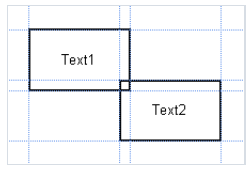
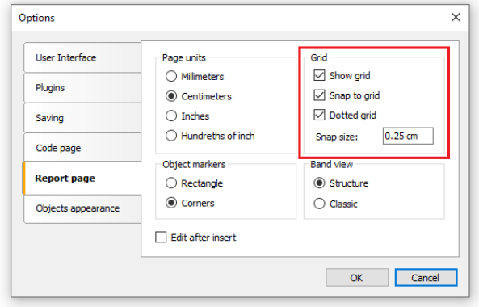

# 报表设计建议

此章节聊一些特定的报表设计要求 - 例如导出到其他数据格式所需要的.

FastReport 允许很多方式去操作对象(在报表创建期间), 这给与了快速开发任何报表的优势 并且后续用于打印.

打印的文档可能仅用于显示, 这是FastReport 报表生成器使用的主要意图。

这种开发自由度的缺点是将 FastReport 文档导出到不同数据格式时的复杂性，因为每种格式都有自己的限制和信息呈现要求，有时非常复杂。许多格式（如 HTML、XLS 或 RTF）使用表格数据展示。这些格式不允许单元格交叉或在表格标记时进行分层排列。

导出过滤器通常会考虑这些要求。这个过程通过一个特殊的算法实现，该算法考虑到对象交叉并将它们最优地放置。在对象交叉处，结果输出表格中会出现新的列和行。这对于使结果与原始报告最大程度相似是必要的。报告设计中对象交叉的数量越多，结果表格中的行列数就会增加，从而影响文件的大小和复杂度。

导出的质量取决于最初报表的合理设计， 让我们看一下下面的示例:

这两个对象稍微有一点交叉(一个放置在相同带上的另一个之上),报表上的形成的记录数量是150条, 在导出到RTF格式,将会创建450行(每一个对象150行 并且剩下150行用于交叉),
如果我们移除交叉,那么最终表格中仅有300行,大型报表以及大量对象之间的差异将会变得非常大, 那就是说这影响输出文件的尺寸。

在创建报告中的表格时，要注意相邻单元格的边框。确保单元格不发生交叉，并且排列在适当的层次中。
导出过滤器算法会裁剪单元格，但导出的结果可能会与预期不符（你看到的可能不是你想要的效果）。
应当以垂直和水平的方式合理排列对象。使用参考线可以帮助完成这一操作。

在单元格重叠的情况下，网格对齐也会非常有帮助。可以在设计器选项中启用网格对齐功能。为了简化对齐过程，你可以调整网格的间距。网格间距和对齐设置可以在“视图 | 选项...”菜单中找到。

对于文本框最好的是使用文本对象的边框 去替代单个图形对象,例如线,长方形,等等。

在透明文本对象上不要使用带背景的对象。

应用这些简单的规则 能够帮助你创建一个导出到基于表格形式之后看起来完美的报表。

