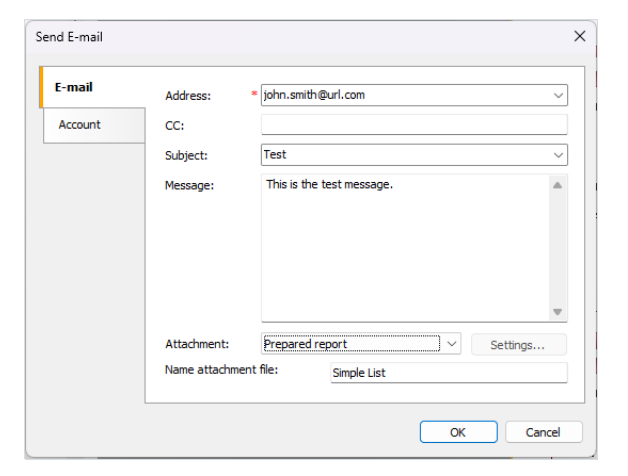
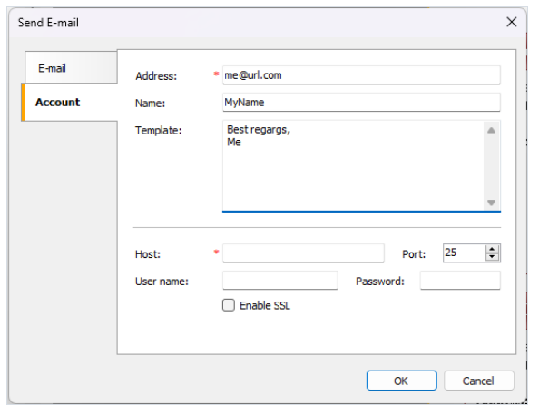

# 通过电子邮件发送报表

FastReport 支持你通过电子邮件发送报表, 它根据两种模式工作:

1. SMTP 默认模式, 为了发送邮件,你不需要任何外部程序.
2. MAPI  你能够编程式调整此模式, 为了这样做,设置`Config.EmailSettings.UseMAPI = true` ,或者如果你使用了`EnvironmentSettings` 组件,设置
它的`EnvironmentSettings.EmailSettings.UseMAPI` 属性为true,为了发送一个邮件, FastReport 使用默认的邮件客户端,例如`Outlook Express`, 这个客户端
必须支持MAPI 协议。

为了发送一个邮件, 你需要指定一个接受者的邮件地址, 同样你需要指定主题和邮件内容,但是这不是必要的,在对话框的底部,选择报表格式, 然后报表将附加到消息.

如果使用SMTP 模式,你需要设置一个账户,仅只需要设置一次, 一旦你完成了它, FastReport 将在配置文件中保存这些参数, 这些参数可以在`Account` 账户标签页发现。

所有的必要的字段通过红信号标识。

如果你的主机服务器需要认证, 你需要填充用户名和密码。