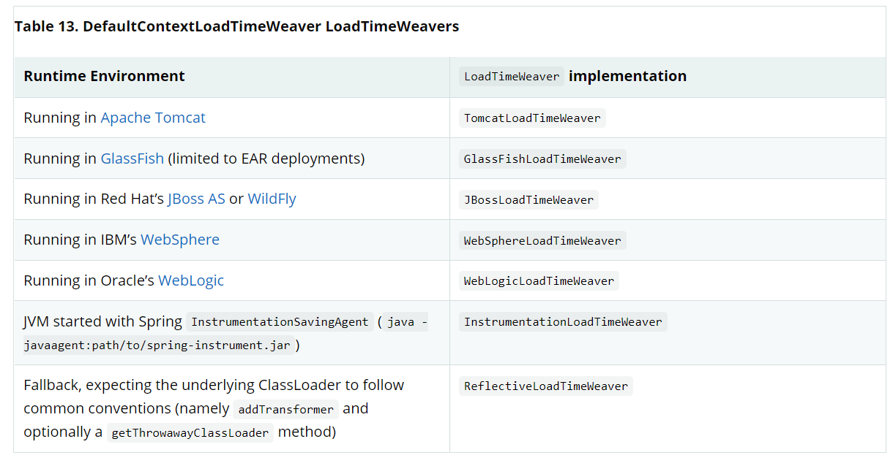

#Aop
spring 本身提供了Aop编程,根OOP编程类似,一个是面向切面编程,一个是面向对象编程,Aop提出了几大概念:
1.pointCut 切入点(目前支持方法拦截,但是切入点表达式可以是任意的,比如拦截某个类的所有方法执行),就是定义你需要拦截的方法
2.jointPoint 就是连接点(连接点和advice是相联系的),通过的pointcut拦截的对应类型的advice方法执行时所给出的jointPoint参数;
3.advice 是对pointCut 切入点指定的拦截通知,然后将对应的程序参数和jointPoint相联系,advice分为 前置、返回、返回异常、环绕通知;
4.AspectJ 一个切面(因为一个方法可能会被多个切面拦截),切面和对象是独立分开的; \
在spring中,Aop不是一个特殊的概念,它和AspectJ是互补的,通过AspectJ来对切面进行生成代理(拦截方法执行,调用advice),
所以在使用SpringAop Api的时候,需要导入aspectjweaver.jar的包作为切面的支持;

#### 开启Aop代理
* @EnableAspectJAutoProxy 注解和@Configuration配合使用,
开启对切面的支持;
```java
@Configuration
@EnableAspectJAutoProxy
public class AppConfig {

}
```
对于xml schema形式的
```xml
<aop:aspectj-autoproxy/>
```
即可;
##### 声明一个切面
@Aspect到一个普通的java 类上即可
```java

@Aspect
public class NotVeryUsefulAspect {

}
```
xml形式
```xml
<bean id="myAspect" class="org.xyz.NotVeryUsefulAspect">
    <!-- configure properties of the aspect here -->
</bean>
```
切面会自动通过组件扫描作为组件,但是前提是你需要使用@Component标识他是一个组件;
##### 声明一个pointcut
它决定了joinPoint的类型以及数据;
```java
@Aspect
public class customAop {
    @Pointcut("execution(* transfer(..))")
    public void pointCut(){}
}
```
这就声明了一个切面并生成了一个pointCut,它会拦截任何方法名为transfer的函数;
@PointCut需要填入一个aspectj的切入点表达式;
##### 支持PointCut的代号(标识符)
1) execution 使用的最多的标识符表达式
2) within 限制joinPoint的类型(在执行某些具体类型内声明的方法时需要)
3) this 限制join point的匹配(同样需要标识当前aop代理是给定类型的实例才能够匹配)
4) target 限制joinPoint的匹配(需要标识目标对象是给定类型的实例(一般是被代理的应用对象))
5) args 限制jointPoint匹配(标识参数是给定的类型)
6) 这些标识符有着对应的注解形式(@target @args @within @annotation(限制joinPoint,限制执行的方法需要有指定的注解!)) \
对于其他完整的切面标识符将不允许,抛出IllegalArgumentException ; \
AspectJ 本身是具有基于类型的定义,this和Target指向同一个对象,但是spring aop 是一个aop系统,所以this指向原始对象,target标识代理后的对象; \
由于spring aop的代理性质,目标对象内的调用不会被拦截,对于jdk代理,那么只有公共的方法调用能够被拦截,对于cglib公共的、保护的、甚至包可视的方法都能够被拦截,然而大多数情况应该和公共(public)方法进行交互;
##### bean(beannameorid)
能够限制匹配的joinPoint,调用的方法的方法bean是那种springBean或者一个springbean的名称集合,可以使用通配符; \
它能和其他描述符使用 && || !,此描述符不支持原生aspectj 编织; \
它是基于实例级别的,而不是基于类级别的切面代理;
##### 合并表达式
切入点的表达式合并;
```java
@Pointcut("execution(public * *(..))")
private void anyPublicOperation() {} 

@Pointcut("within(com.xyz.myapp.trading..*)")
private void inTrading() {} 

@Pointcut("anyPublicOperation() && inTrading()")
private void tradingOperation() {} 
```
##### 共享普通的切入点表达式定义
大多数情况下,我们可能想要引用应用的模块以及从各种切面中使用各种操作集合,推荐创建一个CommonPointcuts  切面收集所有普通的切入点表达式;
```java
package com.xyz.myapp;

import org.aspectj.lang.annotation.Aspect;
import org.aspectj.lang.annotation.Pointcut;

@Aspect
public class CommonPointcuts {

    /**
     * A join point is in the web layer if the method is defined
     * in a type in the com.xyz.myapp.web package or any sub-package
     * under that.
     */
    @Pointcut("within(com.xyz.myapp.web..*)")
    public void inWebLayer() {}

    /**
     * A join point is in the service layer if the method is defined
     * in a type in the com.xyz.myapp.service package or any sub-package
     * under that.
     */
    @Pointcut("within(com.xyz.myapp.service..*)")
    public void inServiceLayer() {}

    /**
     * A join point is in the data access layer if the method is defined
     * in a type in the com.xyz.myapp.dao package or any sub-package
     * under that.
     */
    @Pointcut("within(com.xyz.myapp.dao..*)")
    public void inDataAccessLayer() {}

    /**
     * A business service is the execution of any method defined on a service
     * interface. This definition assumes that interfaces are placed in the
     * "service" package, and that implementation types are in sub-packages.
     *
     * If you group service interfaces by functional area (for example,
     * in packages com.xyz.myapp.abc.service and com.xyz.myapp.def.service) then
     * the pointcut expression "execution(* com.xyz.myapp..service.*.*(..))"
     * could be used instead.
     *
     * Alternatively, you can write the expression using the 'bean'
     * PCD, like so "bean(*Service)". (This assumes that you have
     * named your Spring service beans in a consistent fashion.)
     */
    @Pointcut("execution(* com.xyz.myapp..service.*.*(..))")
    public void businessService() {}

    /**
     * A data access operation is the execution of any method defined on a
     * dao interface. This definition assumes that interfaces are placed in the
     * "dao" package, and that implementation types are in sub-packages.
     */
    @Pointcut("execution(* com.xyz.myapp.dao.*.*(..))")
    public void dataAccessOperation() {}

}
```
例如以xml形式引用切入点:
```xml
<aop:config>
    <aop:advisor
        pointcut="com.xyz.myapp.CommonPointcuts.businessService()"
        advice-ref="tx-advice"/>
</aop:config>

<tx:advice id="tx-advice">
    <tx:attributes>
        <tx:method name="*" propagation="REQUIRED"/>
    </tx:attributes>
</tx:advice>
```
##### examples
首先是execution 使用的比较多,定义如下
```text
   execution(modifiers-pattern? ret-type-pattern declaring-type-pattern?name-pattern(param-pattern)
                throws-pattern?)
```
modifiers-pattern以及param-pattern以及throws-pattern是可选的,其次 *可以作为表达式的全部或者一部分,来通用匹配,其次name-pattern是可以通过对应组件(类)尾随一个.来连接一个方法,参数表达式通常是.. 标识零个或者多个参数,*标识一个任意类型的参数,(*,String)表示第一个为任意类型,第二个参数为string; \
根据这个表达式的说明:
```java
execution(public * *(..))
```
```java
  execution(* set*(..))
```
```java
execution(* com.xyz.service.AccountService.*(..))
```
AccountService类下的任意方法;
```java
 execution(* com.xyz.service.*.*(..))
```
service包下的xx类xx方法

```java
execution(* com.xyz.service..*.*(..))
```
那么这个就可以是service或者零个或者多个子包下的xx类xx方法拦截;
```java
 within(com.xyz.service.*)
```
这个也是表示方法需要是在com.xyz.service包下
```java
 within(com.xyz.service..*)
```
表示service以及子包
```java
this(com.xyz.service.AccountService)
```
表示此方法位于AccountService类中;
```java
   args(java.io.Serializable)
```
此处的args匹配条件和execution(* *(java.io.Serializable))不一致,前一个表示参数类型为Serializable即可,后一个表示第一个参数类型为Serializable;
```java
  @target(org.springframework.transaction.annotation.Transactional)
```
表示目标方法包含了此注解进行拦截;
##### 编写一个好的pointCut
由于需要编译,aspectj需要处理切入点来优化匹配性能,可以静态或者动态的检测匹配条件,匹配过程需要大量的处理,对于动态来说,静态分析无效,然后第一次遇见切入点声明时,aspectj会将其重写为匹配过程的最佳形式,就是通过切入点进行析取范式(DNF)重写,并且会对切入点的组件进行排序,然后首先对成本较低的组件进行评估,那么这就意味着你可以随意使用切入点表达式描述符,不需要关心它们的执行效率; \
aspectj需要告诉它应该怎么做,为了提高匹配的性能,需要思考如何创建优秀的切入点(减少匹配范围),需要从三方面进行考虑:
1) kinded
    包含了 execution ,get ,set,call,handler
2) scoped
    包含了within 以及withcode
3） Contextual
    包含了 this, target 以及@annotation

一个好的切入点应该同时包含kinded以及scoped的描述符;
这样aspectj能够通过scope的分组描述符快速的消除还未执行但不应该执行的描述符分组,提升性能;

##### 声明一个advice
advice是和切入点表达式相关联,包括before、after、around等等;
一个pointcut表达式可以是一个简单的pointcut的引用,也可以是pointcut的表达式集合;

##### before
前置通知@Before
```java
@Aspect
public class BeforeExample {

    @Before("com.xyz.myapp.CommonPointcuts.dataAccessOperation()")
    public void doAccessCheck() {
        // ...
    }
}
```
注解中写入切入点表达式
当然也可以是
```java
import org.aspectj.lang.annotation.Aspect;
import org.aspectj.lang.annotation.Before;

@Aspect
public class BeforeExample {

    @Before("execution(* com.xyz.myapp.dao.*.*(..))")
    public void doAccessCheck() {
        // ...
    }
}
```
##### 后置返回通知
```java
import org.aspectj.lang.annotation.Aspect;
import org.aspectj.lang.annotation.AfterReturning;

@Aspect
public class AfterReturningExample {

    @AfterReturning("com.xyz.myapp.CommonPointcuts.dataAccessOperation()")
    public void doAccessCheck() {
        // ...
    }
}   
```
有些时候我们需要拿到返回值:
```java

@Aspect
public class AfterReturningExample {

    @AfterReturning(
        pointcut="com.xyz.myapp.CommonPointcuts.dataAccessOperation()",
        returning="retVal")
    public void doAccessCheck(Object retVal) {
        // ...
    }
}
```
就这样做即可,如果要严格限制匹配返回的类型的结果,那么将Object改为对应类型即可;
##### after throwing advice
```java
@Aspect
public class AfterThrowingExample {

    @AfterThrowing("com.xyz.myapp.CommonPointcuts.dataAccessOperation()")
    public void doRecoveryActions() {
        // ...
    }
}
```
如果要接收异常:
```java
import org.aspectj.lang.annotation.Aspect;
import org.aspectj.lang.annotation.AfterThrowing;

@Aspect
public class AfterThrowingExample {

    @AfterThrowing(
        pointcut="com.xyz.myapp.CommonPointcuts.dataAccessOperation()",
        throwing="ex")
    public void doRecoveryActions(DataAccessException ex) {
        // ...
    }
}
```
这不意味着它是一个异常回调方法,它的异常接收来自于目标方法的异常抛出类型,而不是来源于@After或者@AfterThrowing

##### after 后置通知
```java
import org.aspectj.lang.annotation.Aspect;
import org.aspectj.lang.annotation.After;

@Aspect
public class AfterFinallyExample {

    @After("com.xyz.myapp.CommonPointcuts.dataAccessOperation()")
    public void doReleaseLock() {
        // ...
    }
}
```
它可以进行方法返回的收尾动作或者相似的目的;同时不同于try-finally来说,它接受目标方法返回的正确结果或者异常,而@AfterReturning 只接收正确结果!
##### 环绕通知
例如before以及after都需要运行(即使方法实际获取运行的结果),环绕通知是有用的(如果需要再before以及after的方法执行中保持线程安全,例如开启、关闭一个定时器);
环绕通知可以获取一个连接点(类型为ProceedingJoinPoint),它可以使用在通知中,通过proceed()调用目标方法执行并返回结果,proceed()方法支持参数; \
当用Object []进行调用时，proceed()的行为与AspectJ编译器编译的around advice的proceed()行为略有不同。对于使用传统 AspectJ 语言编写的环绕通知，传递给procedure 的参数数量必须与传递给环绕通知的参数数量（而不是底层连接点采用的参数数量）相匹配，并且传递给proceed() 的值在一个给定的参数位置取代了该值绑定到的实体的连接点处的原始值（如果这现在没有意义，请不要担心）。 Spring 采用的方法更简单，并且更符合其基于代理的仅执行语义。如果您编译为 Spring 编写的 @AspectJ 方面并使用继续与 AspectJ 编译器和编织器的参数，您只需要知道这种差异。有一种方法可以编写跨 Spring AOP 和 AspectJ 100% 兼容的方面,更多参考[兼容](https://docs.spring.io/spring-framework/docs/current/reference/html/core.html#aop-ataspectj-advice-params)
```java
import org.aspectj.lang.annotation.Aspect;
import org.aspectj.lang.annotation.Around;
import org.aspectj.lang.ProceedingJoinPoint;

@Aspect
public class AroundExample {

    @Around("com.xyz.myapp.CommonPointcuts.businessService()")
    public Object doBasicProfiling(ProceedingJoinPoint pjp) throws Throwable {
        // start stopwatch
        Object retVal = pjp.proceed();
        // stop stopwatch
        return retVal;
    }
}
```
##### 访问当前JoinPoint
任何通知方法的第一个参数都可以是连接点,类型为org.aspectj.lang.JoinPoint,在环绕通知中类型为ProceedingJoinPoint;
有以下方法可以使用:
* getArgs() 返回方法参数
* getThis() 返回代理对象本身
* getTarget() 返回代理后的对象
* getSignature 返回已经通知完毕的方法描述
* toString() 打印出被通知的方法的有用描述

##### 给advice传递参数
可以使用具有args的切入点表达式,例如
```java
@Before("com.xyz.myapp.CommonPointcuts.dataAccessOperation() && args(account,..)")
public void validateAccount(Account account) {
    // ...
}
```
第二种方式可以是给切入点匹配入参,如果你需要:
```java
@Pointcut("com.xyz.myapp.CommonPointcuts.dataAccessOperation() && args(account,..)")
private void accountDataAccessOperation(Account account) {}

@Before("accountDataAccessOperation(account)")
public void validateAccount(Account account) {
    // ...
}
```
这样匹配到了具体方法会传递此参数,代理对象(this),目标对象target以及注解@within,@target @annotation 以及@args 都能够通过相似的方式绑定,例如匹配被@Auditable注解的方法:
```java
@Retention(RetentionPolicy.RUNTIME)
@Target(ElementType.METHOD)
public @interface Auditable {
    AuditCode value();
}
```
注解定义如上,
```java
@Before("com.xyz.lib.Pointcuts.anyPublicMethod() && @annotation(auditable)")
public void audit(Auditable auditable) {
    AuditCode code = auditable.value();
    // ...
}
```
前置通知实现如上;
##### 通知参数以及泛型
spring aop能够处理在类上声明的泛型以及方法参数,假设你有一个定义:
```java
public interface Sample<T> {
    void sampleGenericMethod(T param);
    void sampleGenericCollectionMethod(Collection<T> param);
}
```
你能够限制方法类型的拦截(使得参数类型必须是某些类型),通过通知方法的参数取限制目标方法的参数类型:
```java
@Before("execution(* ..Sample+.sampleGenericMethod(*)) && args(param)")
public void beforeSampleMethod(MyType param) {
    // Advice implementation
}
```
例如以下定义通知不会生效:
```java
@Before("execution(* ..Sample+.sampleGenericCollectionMethod(*)) && args(param)")
public void beforeSampleMethod(Collection<MyType> param) {
    // Advice implementation
}
```
除此之外,你可以将类型声明为collection<?>,这样唯一的后果就是自己检查集合中的元素类型;

##### 决定参数名称
绑定在通知执行的参数依赖于切入点方法签名和切入点表达式中声明的参数名称匹配的名称,对于java反射来说,参数名不必要,因此aop使用了以下策略明确参数名:
* 如果参数名被显式声明,那么将使用此参数名,在通知和切入点表达式上有一个可选的argNames属性(你能够指定被注解方法的参数名称),这个参数名称在运行时是必要的,例如:
```java
@Before(value="com.xyz.lib.Pointcuts.anyPublicMethod() && target(bean) && @annotation(auditable)",
        argNames="bean,auditable")
public void audit(Object bean, Auditable auditable) {
    AuditCode code = auditable.value();
    // ... use code and bean
}
```
如果第一个参数为JoinPoint, ProceedingJoinPoint, or JoinPoint.StaticPart中的其中一种,你不需要在argNames中设置切入点的名称
```java
@Before(value="com.xyz.lib.Pointcuts.anyPublicMethod() && target(bean) && @annotation(auditable)",
        argNames="bean,auditable")
public void audit(JoinPoint jp, Object bean, Auditable auditable) {
    AuditCode code = auditable.value();
    // ... use code, bean, and jp
}
```
当只有连接点的时候,不需要使用argNames,其次使用argNames是比较蠢的,例如spring aop查看类的调试信息并尝试从局部变量表中确定参数名称,只要使用了调试信息编译此类,就存在此信息(通过 -g:vars)启动此标志编译:
    1) 代码会更容易理解
    2) 类文件大小会稍微大一点
    3) 优化删除未使用的本地变量(编译器不会应用) \
如果一个@AspectJ 切面通过AspectJ 编译器编译(但是没有使用 debug 信息),不需要添加argNames属性，因为编译器会保留所需的信息 \
* 如果代码没有通过必要的调试信息编译(已编译),spring aop 尝试绑定参数 到变量参数的配对推断(例如,如果切入点表达式中只有一个变量绑定,那么通知方法应该只有一个参数,和之前的进行配对),如果变量的绑定(和给定的必要信息存在二义性,那么会抛出AmbiguousBindingException \
* 如果上面的策略都失败了,抛出IllegalArgumentException

##### 使用参数执行
这里给出如何将proceed方法并传递给定参数在spring aop 和Aspectj中工作一致,解决方案就是让通知方法签名绑定的参数顺序和目标方法参数顺序一致;
```java
@Around("execution(List<Account> find*(..)) && " +
        "com.xyz.myapp.CommonPointcuts.inDataAccessLayer() && " +
        "args(accountHolderNamePattern)")
public Object preProcessQueryPattern(ProceedingJoinPoint pjp,
        String accountHolderNamePattern) throws Throwable {
    String newPattern = preProcess(accountHolderNamePattern);
    return pjp.proceed(new Object[] {newPattern});
}
```
请注意,com.xyz.myapp.CommonPointcuts.inDataAccessLayer()是一个切入点;
##### 通知的顺序
当同一个切面的多个通知都在同一个连接点运行,那么必然存在执行顺序,高优先级先执行,但是后返回,低优先级后执行先返回;
当在同一个连接点运行的不同切面的通知时,除非指定了顺序,否则执行顺序是未知的,你能够控制顺序,只需要实现Ordered接口提供顺序,或者声明@Order注解; \
注意:  通知都是直接和连接点接入,所以@AfterThrowing不建议从从@After或者@AfterReturning 接收异常; \
在spring5.2.7开始,相同@Aspect类的通知方法运行在相同连接点基于通知类型的优先级顺序进行执行;
@After方法的执行建议放在同一个切面的@AfterReturning 或者 @AfterThrowing通知方法之后,考虑"after finally advice"的概念 \
由于同一个切面的多个相同类型在于同一个连接点的通知方法执行顺序未知这导致通过javac编译类的时候无法获取源码声明顺序,考虑将方法变成一个通知方法或者分别放入不同切面,并通过Order接口或者注解进行执行顺序调节;

##### aop对bean进行增强
introduction(在AspectJ中称为类型间声明)启用一个切片去声明被通知的对象声明 指定接口,在这些对象中间提供一个这个接口的实现;
你能够制造一个introduction(通过使用@DeclareParent注解),能够给匹配的类型声明一个新的父类,例如给定一个接口UsageTracked,并给定一个默认实现DefaultUsageTracked,那么切面将会声明此服务接口的所有实现并实现此接口(举个例子:例如通过jmx 进行统计) \
```java
@Aspect
public class UsageTracking {

    @DeclareParents(value="com.xzy.myapp.service.*+", defaultImpl=DefaultUsageTracked.class)
    public static UsageTracked mixin;

    @Before("com.xyz.myapp.CommonPointcuts.businessService() && this(usageTracked)")
    public void recordUsage(UsageTracked usageTracked) {
        usageTracked.incrementUseCount();
    }

}
```
从这里可以发现它将com.xzy.myapp.service.*+ 的所有类进行了增强,同时还给当前代理增加了一个前置通知,那么当执行被代理的类的时候,由于这里将UsageTracked 也融合到了一起,将导致在执行前会先执行UsageTracked 实例的方法;(详情查看src下的aop包的应用),对于schema风格的增强[请看](https://blog.csdn.net/u011734144/article/details/77700072v)

##### 切面实例化模型
默认在spring 应用上下文中,切面是一个单例,但是spring支持 aspectJ的perthis,pertarget 实例化模型,percflow,percflowbelow,pertypewithin不支持;

```java
@Aspect("perthis(com.xyz.myapp.CommonPointcuts.businessService())")
public class MyAspect {

    private int someState;

    @Before("com.xyz.myapp.CommonPointcuts.businessService()")
    public void recordServiceUsage() {
        // ...
    }
}
```
这样写那么当每一个服务对象执行业务逻辑都会创建一个切面实例(每一个对独一无二的对象绑定this在连接点匹配切入点表达式),在服务对象第一次执行时切面就会创建; 切面的作用域受限于服务对象作用域;切面创建之前没有任何通知方法执行,pertarget实例化模型工作形式和perthis差不多,但是是通过目标对象进行连接点匹配然后调用通知方法(由于切面中 this = target 那么目前代理对象 是原型对象时(那么效果是一致的),如果需要不一致,那么可以尝试通过一个方法返回当前代理对象的增强代理,然后继续调用对应被切的方法,此时代理对象就应该和代理后的对象不同,效果就可以出现了!);
(详情看src下的aop例子)
##### aop 例子
例如并发访问,有时候由于悲观锁会抛出异常,那么需要重试,此时可以通过切面代理进行重试请求,重试次数用完之后在异常处理!
```java
@Aspect
public class ConcurrentOperationExecutor implements Ordered {

    private static final int DEFAULT_MAX_RETRIES = 2;

    private int maxRetries = DEFAULT_MAX_RETRIES;
    private int order = 1;

    public void setMaxRetries(int maxRetries) {
        this.maxRetries = maxRetries;
    }

    public int getOrder() {
        return this.order;
    }

    public void setOrder(int order) {
        this.order = order;
    }

    @Around("com.xyz.myapp.CommonPointcuts.businessService()")
    public Object doConcurrentOperation(ProceedingJoinPoint pjp) throws Throwable {
        int numAttempts = 0;
        PessimisticLockingFailureException lockFailureException;
        do {
            numAttempts++;
            try {
                return pjp.proceed();
            }
            catch(PessimisticLockingFailureException ex) {
                lockFailureException = ex;
            }
        } while(numAttempts <= this.maxRetries);
        throw lockFailureException;
    }
}
```
如果是非幂等操作,那么一次即可!
```xml
<aop:aspectj-autoproxy/>

<bean id="concurrentOperationExecutor" class="com.xyz.myapp.service.impl.ConcurrentOperationExecutor">
    <property name="maxRetries" value="3"/>
    <property name="order" value="100"/>
</bean>
```
然后这个注入bean即可使用;由于需要处理幂等性,所以可以准备一个注解,在幂等性操作上设置重试:
```java
@Retention(RetentionPolicy.RUNTIME)
public @interface Idempotent {
    // marker annotation
}
```
然后改写切面即可:
```java
@Around("com.xyz.myapp.CommonPointcuts.businessService() && " +
        "@annotation(com.xyz.myapp.service.Idempotent)")
public Object doConcurrentOperation(ProceedingJoinPoint pjp) throws Throwable {
    // ...
}
```
#### xml形式的aspectJ支持
所有的配置放入<aop:config>中,<aop:config>是一种自动代理机制的沉重使用,请注意不要混合<aop:config>风格和AutoProxyCreator风格的[自动代理](https://docs.spring.io/spring-framework/docs/current/reference/html/core.html#aop-autoproxy)  (当你已经使用了BeanNameAutoProxyCreator或者其他相似的代理时,使用<aop:config>将导致一些问题,只推荐使用一种;)
##### 声明一个切面
```xml
<aop:config>
    <aop:aspect id="myAspect" ref="aBean">
        ...
    </aop:aspect>
</aop:config>

<bean id="aBean" class="...">
    ...
</bean>
```
##### 切点
```xml
<aop:config>

    <aop:pointcut id="businessService"
        expression="execution(* com.xyz.myapp.service.*.*(..))"/>

</aop:config>
```
或者使用一个切入点表达式
```xml
<aop:config>

    <aop:pointcut id="businessService"
        expression="com.xyz.myapp.CommonPointcuts.businessService()"/>

</aop:config>
```
请注意是一个顶级切入点表达式
```xml
<aop:config>

    <aop:aspect id="myAspect" ref="aBean">

        <aop:pointcut id="businessService"
            expression="execution(* com.xyz.myapp.service.*.*(..))"/>

        ...
    </aop:aspect>

</aop:config>
```
上述是一个切面内的切入点表达式
```xml
<aop:config>

    <aop:aspect id="myAspect" ref="aBean">

        <aop:pointcut id="businessService"
            expression="execution(* com.xyz.myapp.service.*.*(..)) &amp;&amp; this(service)"/>

        <aop:before pointcut-ref="businessService" method="monitor"/>

        ...
    </aop:aspect>

</aop:config>
```
收集this对象作为连接点的上下文(并传递它给通知方法),monitor方法如下:
```java
public void monitor(Object service) {
    // ...
}
```
由于&amp;&amp;使用比较尴尬,笨重,所以可以使用and、or、not关键字替代对应的语法语义;
```xml
<aop:config>

    <aop:aspect id="myAspect" ref="aBean">

        <aop:pointcut id="businessService"
            expression="execution(* com.xyz.myapp.service.*.*(..)) and this(service)"/>

        <aop:before pointcut-ref="businessService" method="monitor"/>

        ...
    </aop:aspect>
</aop:config>
```
xml形式中引用是通过id进行的组合切入点,而不是名称,所以@Aspect风格的切面配置支持更多;
##### 前置通知
```xml

<aop:aspect id="beforeExample" ref="aBean">

    <aop:before
        pointcut-ref="dataAccessOperation"
        method="doAccessCheck"/>

    ...

</aop:aspect>
```
也可使用行内切入表达式进行替换
```xml
<aop:aspect id="beforeExample" ref="aBean">

    <aop:before
        pointcut="execution(* com.xyz.myapp.dao.*.*(..))"
        method="doAccessCheck"/>

    ...
</aop:aspect>
```
其他通知与之类似;
##### xml中的通知顺序
要么通过<aop:aspect>的order属性进行优先级确定或者增加@Order注解或者实现Ordered接口; \
注意: 如果是相同切面中相同连接点的多个通知方法,那么可以通过xml中对于通知方法的声明顺序进行确定执行顺序(从高到底);
一般来说,要么变成一个通知方法要么切分到不同aspect中;
##### xml形式的introduction
```xml

<aop:aspect id="usageTrackerAspect" ref="usageTracking">

    <aop:declare-parents
        types-matching="com.xzy.myapp.service.*+"
        implement-interface="com.xyz.myapp.service.tracking.UsageTracked"
        default-impl="com.xyz.myapp.service.tracking.DefaultUsageTracked"/>

    <aop:before
        pointcut="com.xyz.myapp.CommonPointcuts.businessService()
            and this(usageTracked)"
            method="recordUsage"/>

</aop:aspect>
```
只需要注意type-matching是一个Aspect 类型匹配表达式,需要增强的类型,其他的就是增强的接口以及默认实现,详情查看java形式版的introduction;
##### advisor
通过advisor能够包含一组advice,它包含的advice必须实现advice接口[advice type in spring](https://docs.spring.io/spring-framework/docs/current/reference/html/core.html#aop-api-advice-types) ,advisor能够使用aspectj 切入点表达式带来的好处,spring 提供了一个advisor的实现 <aop:advisor>  \
```xml
<aop:config>

    <aop:pointcut id="businessService"
        expression="execution(* com.xyz.myapp.service.*.*(..))"/>

    <aop:advisor
        pointcut-ref="businessService"
        advice-ref="tx-advice"/>

</aop:config>

<tx:advice id="tx-advice">
    <tx:attributes>
        <tx:method name="*" propagation="REQUIRED"/>
    </tx:attributes>
</tx:advice>
```
例如这里使用一个advisor(它本质上是一个小的切面只有一个advice) 经常容易看到的是和事务advice进行联系; \
设置advice的执行顺序只要通过advisor的order属性进行设置即可;

##### 代理机制
1) JDK动态代理
2) CGLIB
* CGLIB的缺点
    * final 方法无法被通知,它不能覆盖运行时生成的子类;
    * 从Spring 4.0开始，由于CGLIB代理实例是通过Objenesis创建的，因此不再调用代理对象的构造函数两次。仅当您的 JVM 不允许构造函数绕过时，您可能会看到来自 Spring 的 AOP 支持的双重调用和相应的调试日志条目 \
强制使用cglib代理,只需要设置
```xml
<aop:config proxy-target-class="true">
    <!-- other beans defined here... -->
</aop:config>
```
多个<aop:config>部分在运行时会合并到一个auto-proxy 构造器,通常会在不同xml bean definition文件中设置<aop:config/>,除此之外,<tx:annotation-driven /> 以及 <aop:aspectj-auto-proxy/>都能够进行代理模式切换;
##### 理解aop 代理
通过代理调用方法然后代理到目标方法上执行;
##### 程序化创建@AspectJ aop代理
```java
// create a factory that can generate a proxy for the given target object
AspectJProxyFactory factory = new AspectJProxyFactory(targetObject);

// add an aspect, the class must be an @AspectJ aspect
// you can call this as many times as you need with different aspects
factory.addAspect(SecurityManager.class);

// you can also add existing aspect instances, the type of the object supplied must be an @AspectJ aspect
factory.addAspect(usageTracker);

// now get the proxy object...
MyInterfaceType proxy = factory.getProxy();
```
通过org.springframework.aop.aspectj.annotation.AspectJProxyFactory对目标对象创建一个代理且被切面进行通知!

#### 在spring中使用AspectJ
AspectJ需要使用AspectJ的编辑器以及Weaver进行切面编织(替代SpringAop)
spring和AspectJ建立关系的库(spring-aspects.jar),导入即可
[ Using AspectJ to Dependency Inject Domain Objects with Spring](https://docs.spring.io/spring-framework/docs/current/reference/html/core.html#aop-atconfigurable) 以及  [ Other Spring aspects for AspectJ ](https://docs.spring.io/spring-framework/docs/current/reference/html/core.html#aop-ajlib-other)讨论库的内容以及如何使用它;
[Configuring AspectJ Aspects by Using Spring IoC ](https://docs.spring.io/spring-framework/docs/current/reference/html/core.html#aop-aj-configure) 讨论了如何依赖注入AspectJ 切面(使用AspectJ编译器编织的切面),[ Load-time Weaving with AspectJ in the Spring Framework](https://docs.spring.io/spring-framework/docs/current/reference/html/core.html#aop-aj-ltw) 提供了如何在spring中进行 
load-time weaving(对AspectJ)

##### 使用AspectJ 依赖注入 domain 对象
spring 容器实例化并配置beans到你的应用上下文中,他也可能询问一个工厂去配置一个预先存在的对象，给定了包含要应用的配置的bean 定义名称;
spring-aspects.jar 包含了一个注解驱动的切面,利用这个能力去允许依赖注入任何对象,这对于在容器之外控制所创建的对象来说是有效的,Domain对象经常（fall into 落入，分成)分为 这一类,因为它们经常被编程创建(使用new 操作符,或者通过ORM 框架作为一个数据库查询的结果!)
这么,一个@COnfigurable注解能够使得一个类对Spring 驱动配置适配,一个最简单的例子,你能够完全使用它作为一个标记者注解,例如:

```java
package com.xyz.myapp.domain;

import org.springframework.beans.factory.annotation.Configurable;

@Configurable
public class Account {
    // ...
}
```
当使用这种方式作为一个标记者注解,spring 将会配置一个被此注解注解的类型的实例(Account,在这个例子中)-> 通过使用一个bean 定义(通常是原型bean definition)使用全类型修饰符作为相同的名称(com.xyz.myapp.domain.Account),因此默认名称就是它,一个方便的形式去生命这个原型定义是可以省略id属性,例如:
```xml
<bean class="com.xyz.myapp.domain.Account" scope="prototype">
    <property name="fundsTransferService" ref="fundsTransferService"/>
</bean>
```
如果显式的指定原型定义的指定名称,你可以直接声明在此注解上,例如 
```java

package com.xyz.myapp.domain;
import org.springframework.beans.factory.annotation.Configurable;

@Configurable("account")
public class Account {
    // ...
}
```
spring 现在会查询一个名称叫做account的bean 定义并且会使用此bean 定义去创建一个Account实例
你能够使用自动注入去避免拥有一个指定的专用bean 定义,为了能够自动装配 ,你也可以使用此注解的autowire属性,你要么指定@Configurable(autowire=Autowire.BY_TYPE) 或者@Configurable(autowire=Autowire.BY_NAME)去通过类型或者名称注入,另一方面，它更宁愿显式指定、注解驱动的依赖注入(通过对@Configurable的bean进行@Autowired或者@Inject)到字段或者方法级别(查看基于注解的容器配置获取更多)
最终,你能够启动spring 对对象应用进行依赖检查通过dependencyCheck属性（在这种新的创建的以及可配置的对象)(例如,@Configurable(autowire=Autowire.BY_NAME,dependencyCheck=true)),如果属性设置为true,那么spring 会在配置完所有属性之后进行验证(这里的属性是非基础类型或者集合)以及被设置;\
单独使用此注解没有任何效果,此注解被spring-aspectj.jar中的AnnotationBanConfigurerAspect处理,最终,此切面会说,"spring 会根据注解的属性进行新创建对象的配置,并且最终会返回此注解注解的某个类型的初始化实例",当前上下文中,初始化意味着新实例化对象(比如,通过new 实例化)同样也可以使用一个Serializable对象(通过底层的反序列化,例如[readResolve](https://docs.oracle.com/javase/8/docs/api/java/io/Serializable.html)) \
上一段的关键点之一是"in essence", 对于大多数情况,"从新对象的初始化之后返回"是完全正确的,在当前上下文中,"初始化之后"意味着对象构造之后依赖已经注入了,这就意味着这些依赖对于类构造体中来说是不必要的（不可用的）,如果你想在构造器body运行之前因此,在构造器内使用它们是有效的->进行依赖注入,那么你需要定义一个这样的@Configurable注解,例如
```java
@Configurable(preConstruction = true)
```
你能发现关于这种各样的切入点类型的语言语义(在[appendix](https://www.eclipse.org/aspectj/doc/next/progguide/semantics-joinPoints.html) --- [Aspectj Programming Guide](https://www.eclipse.org/aspectj/doc/next/progguide/index.html))\
为了让他工作,此注解的类型必须通过Aspectj weaver进行编织,你可以选择使用一个构建时Ant或者  maven任务来执行此目的(例如 [AspectJ Development Environment Guide](https://www.eclipse.org/aspectj/doc/released/devguide/antTasks.html))或者进行加载时编织(查看 [Load time Weaving with AspectJ in the spring FrameWork](https://docs.spring.io/spring-framework/docs/5.3.10-SNAPSHOT/reference/html/core.html#aop-aj-ltw)).
这个AnnotationBeanConfigurerAspect 它自己需要通过spring 进行配置(为了包含一个bean 工厂的应用,为了能够被这些新创建的对象进行使用),你可以使用基于java的方式配置，通过注解@EnableSpringConfigured 配置到任何@Configuration类上,例如:
```java
@Configuration
@EnableSpringConfigured
public class AppConfig {
}
```
如果你更喜欢xml 的配置方式,那么Spring 上下文命名空间定义了一个方便的context:spring-configured 元素供你使用,例如:
```xml
<context:spring-configured />
```
@Configurable的实例化对象在切面已经配置之前创建会导致一个debug的问题消息日志记录并且此对象将不会携带任何配置,一个例子:
可能在spring配置中创建了一个bean,当它初始化的时候可能会创建域对象,在这种情况下,你能够使用depends-on的bean属性来手动的指定这个bean依赖于配置的切面,下面是一个例子:
```xml
<bean id="myService"
        class="com.xzy.myapp.service.MyService"
        depends-on="org.springframework.beans.factory.aspectj.AnnotationBeanConfigurerAspect">

    <!-- ... -->

</bean>
```
不要激活一个@Configurable的处理（通过一个bean configurer切面),除非你真的打算依赖它的运行时语义,特别是,确保你没有将一个@Configurable的bean类注册为一个普通的Spring bean到容器中,因为这会造成两次初始化;
##### 单元测试 @Configurable 对象
@Configurable 支持的目标之一是为了启用独立领域对象单元测试(而不需要通过硬编码查询),如果@Configurable 类型没有通过Aspectj编织,那么此注解在单元测试时没有任何影响;你能够在此对象中设置模拟或者存根属性引用(让测试能够正常处理),如果@Configurable 类型已经通过Aspectj编织,你仍然能够在容器外部进行单元测试,但是你每次会得到一个警告信息(当你构造一个@Configurable对象时)-会指示它没有被spring 配置
##### 多应用上下文工作
AnnotationBeanConfigurerAspect 能够作为一个AspectJ 单例切面 为@Configurable 对象提供支持,这单例切面的作用域等价于static 成员作用域,这仅仅是一个切面实例(每一个类加载器会定义一个类型的切面实例),这意味着如果你需要通过相同类加载器体系定义多个应用上下文,你需要考虑定义一个@EnableSpringConfigured bean 并将Spring-aspects.jar 作为依赖放置在classpath上; \
考虑一个典型的Spring Web应用程序配置，它有一个共享的父应用程序上下文，它定义了通用的业务服务、支持这些服务所需的一切，以及每个Servlet的一个子应用程序上下文（它包含该Servlet的特定定义）。所有这些上下文都在同一个classloader层次结构中共存，因此AnnotationBeanConfigurerAspect只能持有对其中一个的引用。在这种情况下，我们建议在共享（父）应用程序上下文中定义@EnableSpringConfigured bean。这定义了你可能想要注入到域对象中的服务。一个后果是，你不能通过使用@Configurable机制（这可能不是你想做的事情）来配置域对象，并引用定义在子（特定服务）上下文中的bean \
在同一个容器中部署多个 web 应用程序时，确保每个 web 应用程序使用自己的类加载器加载 spring-aspects.jar 中的类型（例如，通过将 spring-aspects.jar 放在 'WEB-INF/lib' 中）。如果 spring-aspects.jar 仅添加到容器范围的类路径（因此由共享的父类加载器加载,例如应用类路径），则所有 Web 应用程序共享相同的方面实例（这可能不是您想要的

##### 其他aspectJ的spring 切面
除了@Configurable,spring-aspects.jar包括了一个衍生事务管理的类型 并且方法被@Transactional注解的支持,主要是为了用户在spring 容器外使用spring 框架的事务支持; \
此切面会将@Transactional 解析为AnnotationTransactionAspect,使用此切面需要注解实现类(方法或者类都可以),而不是接口上注解,aspectj遵循java注解的规则,接口上的注解无法被继承 \
一个@Transactional 注解如果在类上指示当前类上的任何公共操作执行的默认事务语义 \
@Transactional 注解如果在方法上,将会覆盖类的默认事务语义(如果类上存在),任何可见性的方法都能被注解,包括私有方法,注解一个非公有方法是为唯一获取执行方法的事务划界 \
spring 4.2开始,spring-aspects提供了一个类似的切面提供了抓取标准javax.transaction.Transactional注解的相同属性,查看JtaAnnotationTransactionAspect切面查看更多信息; \
对于想要使用spring 配置以及 事务管理支持单又不想使用这些注解的切面编程者,spring-aspect也包含了一些abstract 切面 你能够扩展并提供你自己的切入点定义,查看AbstractBeanConfigurerAspect以及AbstractTransactionAspect了解更多, 举个例子,根据一个全修饰类名的原型bean 定义去写入一个能够配置所有对象实例(定义在领域模型中)的切面
```java
public aspect DomainObjectConfiguration extends AbstractBeanConfigurerAspect {

    public DomainObjectConfiguration() {
        setBeanWiringInfoResolver(new ClassNameBeanWiringInfoResolver());
    }

    // the creation of a new bean (any object in the domain model)
    protected pointcut beanCreation(Object beanInstance) :
        initialization(new(..)) &&
        CommonPointcuts.inDomainModel() &&
        this(beanInstance);
}
```
##### 通过spring ioc 配置 aspectJ aspects
当你在Spring应用程序中使用AspectJ方面时，自然希望并期望能够用Spring配置这些方面。AspectJ运行时本身负责方面的创建，而通过Spring配置AspectJ创建的方面的方法取决于方面使用的AspectJ实例化模型（per-xxx条款） \
aspectJ 一般来说都是单例,配置很容易,你能够创建一个bean 定义来应用aspectj 类型并且包括一个 factory-method="aspectOf"的bean 属性,确保spring 获取aspect实例是通过询问AspectJ而不是自行创建;
```xml
<bean id="profiler" class="com.xyz.profiler.Profiler"
        factory-method="aspectOf"> 

    <property name="profilingStrategy" ref="jamonProfilingStrategy"/>
</bean>
```
非单例需要使用@Configurable 支持(通过spring-aspects.jar)去配置 切面实例(在Aspectj 运行时创建的对象) \
如果你想使用一些@Aspectj 切面(想通过AspectJ编织)-例如使用load-time 对领域模型类型编织以及想通过spring aop使用的@Aspect 切面,并且这些切面都配置到spring中了,你需要告诉Spring aop @AspectJ 自动代理支持(去抓取@Aspectj 切面-定义在配置中的的子集合),你能够使用一个或者多个<include>元素 到<aop:aspectj-autoproxy/>声明中,每一个<include> 元素都可以指定一个命名模式,并且仅仅只有bean的名称能够匹配其中一个模式才能够被spring aop用于自动代理配置所使用
```xml
<aop:aspectj-autoproxy>
    <aop:include name="thisBean"/>
    <aop:include name="thatBean"/>
</aop:aspectj-autoproxy>
```
不要被<aop:aspectj-autoproxy/>元素误导,使用它会导致spring aop 代理创建,@Aspectj 风格的切面声明在这里能够更好的被使用,但是apectj 运行时不被执行;
##### load-time weaving AspectJ(在 spring中)
load-time weaving(LTW) 指的是 编织Aspectj 切面到一个应用类文件的处理程序(一开始 加载到jvm),此部分的核心就是在配置以及使用LTW 到spring框架的指定上下文,这部分不是一个LTW通用介绍,对于LTW的详细信息以及如何配置LTW到Aspect中(spring 不会执行它),查看[LTW section of the AspectJ Development Environment Guide](https://www.eclipse.org/aspectj/doc/released/devguide/ltw.html) \
Spring 框架为 AspectJ LTW 带来的价值在于能够对编织过程进行更细粒度的控制。 “Vanilla”AspectJ LTW 是通过使用 Java (5+) 代理来实现的，该代理通过在启动 JVM 时指定 VM 参数来开启。因此，它是 JVM 范围的设置，在某些情况下可能很好，但通常有点过于粗糙。启用 Spring 的 LTW 允许您在每个类加载器的基础上打开 LTW，这更细粒度，并且在“单 JVM 多应用程序”环境中更有意义（例如在典型的应用程序服务器中找到）环境） \
此外，在某些环境下，这种支持可以实现加载时编织，而不需要对应用服务器的启动脚本进行任何修改，因为需要添加 -javaagent:path/to/aspectjweaver.jar 或（正如我们在本节后面所描述的） -javaagent:path/to/spring-instrument.jar。开发人员配置应用程序上下文以启用加载时编织，而不是依靠通常负责部署配置的管理员，如启动脚本 \

##### 第一个例子(刨析工具切面)
可以通过基于xml配置亦可以通过java配置,同时可以使用@EnableLoadTimeWeaving 来替代 <context:load-time-weaver/>
```java
package foo;

import org.aspectj.lang.ProceedingJoinPoint;
import org.aspectj.lang.annotation.Aspect;
import org.aspectj.lang.annotation.Around;
import org.aspectj.lang.annotation.Pointcut;
import org.springframework.util.StopWatch;
import org.springframework.core.annotation.Order;

@Aspect
public class ProfilingAspect {

    @Around("methodsToBeProfiled()")
    public Object profile(ProceedingJoinPoint pjp) throws Throwable {
        StopWatch sw = new StopWatch(getClass().getSimpleName());
        try {
            sw.start(pjp.getSignature().getName());
            return pjp.proceed();
        } finally {
            sw.stop();
            System.out.println(sw.prettyPrint());
        }
    }

    @Pointcut("execution(public * foo..*.*(..))")
    public void methodsToBeProfiled(){}
}
```
现在需要创建一个META-INF/aop.xml,通知aspectj 编织器(我们想要编织ProfilingAspect到我们的类中),这个配置文件是一个标准的Aspectj,例如:
```xml
<!DOCTYPE aspectj PUBLIC "-//AspectJ//DTD//EN" "https://www.eclipse.org/aspectj/dtd/aspectj.dtd">
<aspectj>

    <weaver>
        <!-- only weave classes in our application-specific packages -->
        <include within="foo.*"/>
    </weaver>

    <aspects>
        <!-- weave in just this aspect -->
        <aspect name="foo.ProfilingAspect"/>
    </aspects>

</aspectj>
```
现在你还需要移动配置的spring 相关部分,需要配置一个LoadTimeWeaver(这个组件有责任去编织切面配置(在META-INF/aop.xml中的配置,一个或者多个此文件都会自动进行处理))会将他们编织到应用程序中,这样做的一个好处是,不需要大量的配置(这里此时还有一些选项能够进行指定):
```xml
<?xml version="1.0" encoding="UTF-8"?>
<beans xmlns="http://www.springframework.org/schema/beans"
    xmlns:xsi="http://www.w3.org/2001/XMLSchema-instance"
    xmlns:context="http://www.springframework.org/schema/context"
    xsi:schemaLocation="
        http://www.springframework.org/schema/beans
        https://www.springframework.org/schema/beans/spring-beans.xsd
        http://www.springframework.org/schema/context
        https://www.springframework.org/schema/context/spring-context.xsd">

    <!-- a service object; we will be profiling its methods -->
    <bean id="entitlementCalculationService"
            class="foo.StubEntitlementCalculationService"/>

    <!-- this switches on the load-time weaving -->
    <context:load-time-weaver/>
</beans>
```
现在我们需要这些归档文件(meta-inf/aop.xml文件,以及spring 配置),需要创建一个驱动类(包含main方法的)来证实ltw的一个动作:
```java
package foo;

import org.springframework.context.support.ClassPathXmlApplicationContext;

public final class Main {

    public static void main(String[] args) {
        ApplicationContext ctx = new ClassPathXmlApplicationContext("beans.xml", Main.class);

        EntitlementCalculationService entitlementCalculationService =
                (EntitlementCalculationService) ctx.getBean("entitlementCalculationService");

        // the profiling aspect is 'woven' around this method execution
        entitlementCalculationService.calculateEntitlement();
    }
}
```
现在还需要做一个事情,描述这一部分该怎样让每一个ClassLoader开启ltw(在spring中),然而 这个例子我么们使用了一个java代理(通过spring 提供)去开启LTW,我们使用以下命令去运行Main 类:
```java
java -javaagent:C:/projects/foo/lib/global/spring-instrument.jar foo.Main
```
这个-javaagent 是一个标志(指示并启动检测在 JVM 上运行的程序的代理),spring 的关系就是一个代理,InstrumentationSavingAgent,他被打包到spring-instrument.jar(将作为-javaagent的 值被处理),正如前面的一个例子所展示的那样; \
从这个main程序的执行输出结果看起像下一个例子:(我们将Thread.sleep语句放入了calculateEntitlement实现 因此这个刨析者实际上能够捕捉0秒意外的某些事情)-01234毫秒不是aop引入的开销,下面的列表展示了结果:
```text
Calculating entitlement

StopWatch 'ProfilingAspect': running time (millis) = 1234
------ ----- ----------------------------
ms     %     Task name
------ ----- ----------------------------
01234  100%  calculateEntitlement
```
因此ltw能够运用到成熟的aspectj,我们并没有限制它去通知spring bean,下面是一个main程序变种能够获取相同结果:
```java
package foo;

import org.springframework.context.support.ClassPathXmlApplicationContext;

public final class Main {

    public static void main(String[] args) {
        new ClassPathXmlApplicationContext("beans.xml", Main.class);

        EntitlementCalculationService entitlementCalculationService =
                new StubEntitlementCalculationService();

        // the profiling aspect will be 'woven' around this method execution
        entitlementCalculationService.calculateEntitlement();
    }
}
```
根本上此例子是简单化的,但是ltw基本支持都已经导入到spring中,其他部分也讲述了每一个配置后边的原因;\
ProfilingAspect 在这个例子中使用非常简单,但是十分有用,他是一个非常好的demo,开发时切面(能够被当前开发所使用的)并且当应用构建到一个UAT或者生产时能够容易的排除\
##### Aspects
您在 LTW 中使用的方面必须是 AspectJ 方面, 你能够通过aspectj 语言本身编写切面,要么使用@Aspectj风格的编写切面,你的切面可以同时是AspectJ以及 spring aop 切面,因此 编译好的切面类需要在类路径上;
##### META-INF/aop.xml
aspectj LTW 基础设施能够通过一个或者多个META-INF/aop.xml配置(直接在类路径上或者jar文件) \
文件的结构和内容在Aspect 参考文档中有详细介绍[LTW](https://www.eclipse.org/aspectj/doc/released/devguide/ltw-configuration.html),因为
aop.xml 文件是百分百AspectJ,不在这里过多描述;
##### 需要的jars
最少,你需要使用以下jar来支持 aspectJ  LTW;
* spring-aop.jar
* aspectjweaver.jar \
如果你需要使用Spring 提供一个代理支持检测(instrumentation),可以:
* spring-instrument.jar
##### spring 配置
关键组件配置(在spring ltw支持是 LoadTimeWeaver接口),并且各种各样的跟spring 发行的相关的实现,一个LoadTimeWeaver 有责任增加一个或者多个java.lang.instrument.ClassFilterTransformers 到类加载器(运行时),对于感兴趣的应用来说它打开了一扇门,其中之一就是切面的LTW; \
如果你对运行时类转换的想法不熟悉,可以看一下java.lang.instrument包的api 文档,当然这个文档不是很全面,至少你能够查看关键接口以及类(供您阅读本节时参考) 、
配置一个LoadTimeWeaver到一个特殊的应用上下文中能够非常简单(注意你只需要关心将Application作为你的Spring 容器,通常来说,BeanFactory 不够,因为LTW支持使用BeanFactoryPostProcessor); \
为了启用Spring LWT支持,你需要配置一个LoadTimeWeaver,通常通过注解启动:
```java
@Configuration
@EnableLoadTimeWeaving
public class AppConfig {
}
```
也可以是
```xml
<?xml version="1.0" encoding="UTF-8"?>
<beans xmlns="http://www.springframework.org/schema/beans"
    xmlns:xsi="http://www.w3.org/2001/XMLSchema-instance"
    xmlns:context="http://www.springframework.org/schema/context"
    xsi:schemaLocation="
        http://www.springframework.org/schema/beans
        https://www.springframework.org/schema/beans/spring-beans.xsd
        http://www.springframework.org/schema/context
        https://www.springframework.org/schema/context/spring-context.xsd">

    <context:load-time-weaver/>

</beans>
```
之前的配置能够自动的定义和注册大量的LTW相关的基础设施类,例如LoadTimeWeaver以及AspectJWeavingEnabler,默认的LoadTimeWeaver 是DefaultContextLoadTimeWeaver 类,能够尝试去包装(通过自动检测的LoadTimeWeaver),LoadTimeWeaver的相关类型 将自动检测-依赖于你的运行时环境,以下列出了各种各样的LoadTimeWeaver实现:
 \
注意这些LoadTimeWeaver实现仅仅在于你使用了DefaultContextLoadTimeWeaver才会自动检测,你能够指定你实际想要使用的LoadTimeWeaver \
对于指定一个特殊的LoadTimeWeaver 通过java形式,你能够实现LoadTimeWeavingConfigurer接口并且覆盖getLoadTimeWeaver()方法,例如以下例子指定了一个ReflectiveLoadTimeWeaver:
```java
@Configuration
@EnableLoadTimeWeaving
public class AppConfig implements LoadTimeWeavingConfigurer {

    @Override
    public LoadTimeWeaver getLoadTimeWeaver() {
        return new ReflectiveLoadTimeWeaver();
    }
}
```
能够能够基于xml形式
```xml
<?xml version="1.0" encoding="UTF-8"?>
<beans xmlns="http://www.springframework.org/schema/beans"
    xmlns:xsi="http://www.w3.org/2001/XMLSchema-instance"
    xmlns:context="http://www.springframework.org/schema/context"
    xsi:schemaLocation="
        http://www.springframework.org/schema/beans
        https://www.springframework.org/schema/beans/spring-beans.xsd
        http://www.springframework.org/schema/context
        https://www.springframework.org/schema/context/spring-context.xsd">

    <context:load-time-weaver
            weaver-class="org.springframework.instrument.classloading.ReflectiveLoadTimeWeaver"/>

</beans>
```
通过weaver-class属性设置类名,并且使用<context:load-time-weaver/> \
loadTimeWeaver(记住LoadTimeWeaver指示一个spring的LTW基础设施的一个加载机制,能够增加一个或者多个ClassFileTransformers),实际的ClassFileTransformer 实际上操作LWT是一个ClassPreProcessorAgentAdapter(来自org.aspectj.weaver.loadtime),因为它指定了如何实际处理编织(这个知识已经超出这个文档的范围) \
最后的一个讨论属性是aspectjWeaving,如果是xml那么就是 aspectj-weaving,这个属性控制了LTW是否启动,它接受三种可能的值,如果没有值出现默认就是autodetect,下面统计了三个值:
* enabled 启动  aspectj编织启动,是所有的切面都将在加载时编织完成
* disabled 关闭 ltw关闭,没有切面能够在运行时编织
* autodetect 自动抉择 如果 spring ltw 基础设施能够发现一个META-INF/aop.xml那么就会开始aspect 编织,这是一个默认值;
##### 环境相关的配置
使用spring相关的环境加载机制加载必要的环境
##### TOMCAT,JBoss,WebSphere,WebLogic
tomcat,jboss/wildfly,ibm websphere 应用服务器以及oracle 的weblogic 服务器全部都提供了一个通用的应用  ClassLoader 对于本地的检测已经足够,spring的原生 LTW也许能够利用这些类加载实现去提供Aspectj weaving,你能够简单的启动load-time weaving,特别是你不需要修改Jvm启动脚本来增加一个 -javaagent: ...spring-instrument.jar\
注意JBoss,你也许需要禁用app server 去扫描阻止它在应用实际启动之前加载这些类,一个解决办法就是增加一个归档文件为 WEB-INF/jboss-scanning.xml且配置以下内容
```text
<scanning xmlns="urn:jboss:scanning:1.0"/>
```
#### 通用应用上下文
当需要在特定的LoadTimeWeaver实现所不支持的环境中进行类分析时,jvm agent就是通用解决方案,对于这样的原因,spring 提供了InstrumentationLoadTimeWeaver,他作为一个spring 相关的(但不是非常普遍)的jvm agent,spring-instrument.jar会自动通过@EnableLoadTimeWeaving 以及 <context:load-time-weaver>配置检测 \
为了使用它:
```text
-javaagent:/path/to/spring-instrument.jar
```
注意它需要修改jvm 启动脚本,这也许会阻碍使用来自应用服务器的环境(依赖于你的服务器以及你的操作策略),也就是说,用于每一个jvm 应用程序的部署(例如单机Spring boot 应用),你通常需要控制整个jvm的配置 \
##### 更多资源
能够在AspectJ 站点发现更多切面知识 \
