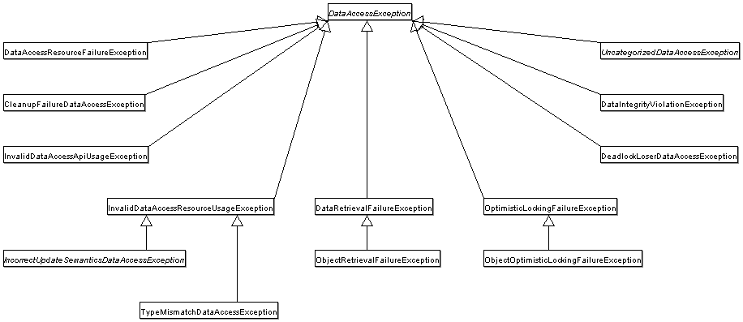

## dao 支持
dao 支持(data access object) 在Spring 主要是让它和数据访问技术更好的工作(例如JDBC,Hibernate,JPA) - 根据一致的方式 \
这样你能够在持久化技术中进行切换,并且你的代码无须担心捕捉特定于每种技术的错误异常 ..

### 2.1 一致的异常体系
Spring提供了特定技术异常的便捷翻译,例如SQLException 到它自己的异常类体系,DataAccessException作为顶部异常,这些异常会包装\
原始的异常,这样你将不会丢失任何有关到底什么造成错误的风险 .. \
除了JDBC异常,Spring能够包装各种持久化技术的异常,并将它们转换到聚焦到运行时异常集合,这样你能够处理大多数不可恢复的持久化异常-在合适的层, \
而无须讨厌的catchand-throw 模版代码快以及 在dao层中的异常声明(你仍然能够捕捉并处理你想要处理的异常 - 在任何地方),正如上面所提到的, \
JDBC异常(包括数据库特定的方言) 同样将转换到相同体系,这意味着你能够使用jdbc执行某些操作(这将使用一致的编程模型) .. \
前面的讨论适用于 Spring 对各种 ORM 框架的支持中的各种模板类。如果你使用基于拦截器的类,应用必须小心处理HibernateExceptions 以及PersistenceExceptions(自己小心处理), \
宁愿代理到convertHibernateAccessException(..) 或者 convertJpaAccessException(..)方法上 - SessionFactoryUtils的方法 .. \
这些方法转换异常到与org.springframework.dao异常体系中兼容的异常,因为PersistenceExceptions是未检测的,它们能够重新抛出（尽管在异常方面牺牲了通用 DAO 抽象 - 因为你没法模版化异常的后续处理）. \
以下的图片展示了Spring提供的异常体系(注意到图片中仅仅展示了DataAccessException体系的一部分) ..


### 2.2 使用注解注释dao / repository class
通过@Repository注解提供异常转换,这个注解也能够支持组件扫描并配置你的dao以及repository bean ..
```java
@Repository 
public class SomeMovieFinder implements MovieFinder {
    // ...
}
```
任何dao或者repository 实现需要访问一个持久化资源,依赖于使用的持久化技术,例如基于jdbc的repository 需要访问jdbc datasource, jpa 仓库需要访问一个EntityManager .. \
最容易的方式是通过其他依赖注入注解进行依赖注入,例如示例:
```java
@Repository
public class JpaMovieFinder implements MovieFinder {

    @PersistenceContext
    private EntityManager entityManager;

    // ...
}
```
如果你使用Hibernate api,你可以注入SessionFactory,以下示例展示为:
```java
@Repository
public class HibernateMovieFinder implements MovieFinder {

    private SessionFactory sessionFactory;

    @Autowired
    public void setSessionFactory(SessionFactory sessionFactory) {
        this.sessionFactory = sessionFactory;
    }

    // ...
}
```
上一个示例是jdbc支持,你能够将一个已经注入的DataSource使用在初始化方法或者通过构造器注入,例如你用来创建JdbcTemplate 以及其他数据访问支持类(例如SimpleJdbcCall或者其他) - 
通过使用DataSource,例如:
```java
@Repository
public class JdbcMovieFinder implements MovieFinder {

    private JdbcTemplate jdbcTemplate;

    @Autowired
    public void init(DataSource dataSource) {
        this.jdbcTemplate = new JdbcTemplate(dataSource);
    }

    // ...
}
```
> 有关如何配置应用程序上下文以利用这些注释的详细信息，请参阅每种持久性技术的具体介绍。

## jdbc 进行数据访问

### 3.1 选择jdbc数据库访问的方式
你能够在各种方式之间进行选择塑造jdbc 访问数据库的基础，除了三种类型的JdbcTemplate，新的SimpleJdbcInsert和SimpleJdbcCall方法优化了数据库元数据。
并且RDBMS对象风格采用了面向对象的方式 类似于JDO Query设计 ..一旦开始使用其中一种方法，您仍然可以混合搭配以包含来自不同方法的功能。
所有的方式都需要一个jdbc2.0兼容的驱动器,并且某些高级特性需要JDBC 驱动3.0 ...
- JdbcTemplate 是一个典型的并且大多数受欢迎的Spring JDBC方式,这是底层api 并且其他方法都在幕后使用JdbcTemplate ..
- NamedParameterJdbcTemplate 包装了jdbcTemplate 去提供命名参数 去替代传统的jdbc ? 占位符 .. 这个方式提供了更好的文档并更容易使用,当你在SQl语句
中包含了多个参数时 ..
- SimpleJdbcInsert 以及 SimpleJdbcCall 优化了数据库元数据去限制 必要配置的数量,这个方式简化了代码,因此我们仅仅需要提供表或者存储过程的名称并提供匹配
字段名的参数map,这个仅仅当数据库提供了充足的元数据才会工作 ... 如果数据库不提供元数据,你能够提供参数的显式配置 ...
- RDBMS 对象 包括了 MappingSqlQuery,SqlUpdate,StoredProcedure, 需要你创建可重用的且线程安全的对象(在数据访问层的初始化阶段) ..
    这种方式以JDO Query为模型,在这其中你定义了查询字符串,声明参数,并编译查询.. 一旦你这样做,execute(..) / update(...) 以及 findObject(..)
    方法能够使用不同的参数值多次调用 ...(jdo 表示 java data object)
    [JDO](https://www.oracle.com/java/technologies/java-data-objects.html)

### 3.2 包体系
Spring框架的jdbc 抽象框架由4个不同的包组成：
- core:
    org.springframework.jdbc.core包包含了JdbcTemplate类以及各种回调接口,以及各种相关的类. 一个子包名为org.springframework.jdbc.core.simple包含了
SimpleJdbcInsert / SimpleJdbcCall类.. 另一个子包名为 org.springframework.jdbc.core.namedparam 包含了NamedParameterJdbcTemplate类 以及各种支持类 ..
    查看使用Jdbc 核心类去控制基本的jdbc处理以及错误处理,jdbc 批处理 并且使用SimpleJdbc类简化Jdbc 操作 ..
- datasource
    org.springframework.datasource 包含了容易使用DataSource访问的工具类以及各种简单DataSource实现 能够用来进行在Jakarta EE容器之外运行并测试未修改的JDBC代码 ..
    一个子包,org.springframework.jdbc.datasource.embedded 提供了使用java 数据库引擎创建内嵌数据库的支持,例如HSQL,H2以及 Derby..
- object
    org.springframework.jdbc.object 包包含了呈现RDBMS查询/更新/和存储过程作为线程安全，可重用对象的类 ..
    这种方式以JDO为模型,虽然由查询返回的对象本质上从数据库失联.Jdbc抽象的高级功能依赖于org.springframework.jdbc.core包的底层抽象 ..
- support
    org.springframework.jdbc.support 包提供了SQLException 翻译功能以及某些工具类 .. 在jdbc过程中处理的异常将翻译为org.springframework.dao包中的异常 ..
    这意味着使用Spring抽象层的代码不需要实现Jdbc或者RDBMS 特定的错误处理 .. 所有翻译的过的异常都是未检查的，你可以捕捉或者传播给调用者 或者恢复调用过程.. 
    查看 SQLExceptionTranslator ..

### 3.3 使用Jdbc 核心类去控制基本的 jdbc 处理以及 错误处理
#### 使用 jdbcTemplate
使用它的好处就是,自动关闭链接(创建或者释放链接),能够执行核心jdbc工作流中的基本任务(例如语句创建和执行) .. 
让应用代码提供SQL并抓取结果 ...
- 运行Sql 查询
- 更新语句和存储过程调用
- 在ResultSet实例上进行迭代并抓取映射为应用数据模型
- 捕捉jdbc异常并翻译到通用的,具有信息更加友好的org.springframework.dao包中的异常..

当你在代码中使用JdbcTemplate的时候，你需要 实现回调接口,给出干净的约定,通过jdbTemplate 给出connection,
PreparedStatementCreator回调接口将创建预备语句,提供SQl和任何必要的参数即可 ..
对于CallableStatementCreator 完全等价的,它创建callable 语句,RowCallbackHandler 接口抓取ResultSet中每一行的值 .. \
你能够在Dao实现中使用JdbcTemplate - 通过DataSource 引用直接实例化一个 JdbcTemplate,或者通过Spring ioc容器配置它并在dao
中引用 bean 对象 ..
> datasource 应该总是配置到ioc容器中 ...
由此类执行的sql都会记录为debug级别(分类到完全限定的模版实例的类名之下)，通常是jdbcTemplate,但是也可以不同,如果你使用一个自定义的
JdbcTemplate类的子类 ..

### 查询
```java
int rowCount = this.jdbcTemplate.queryForObject("select count(*) from t_actor", Integer.class);
```
使用绑定变量的形式查询
```java
int countOfActorsNamedJoe = this.jdbcTemplate.queryForObject(
        "select count(*) from t_actor where first_name = ?", Integer.class, "Joe");
```
查询并将结果作为String
```java
String lastName = this.jdbcTemplate.queryForObject(
        "select last_name from t_actor where id = ?",
        String.class, 1212L);
```
查询并填充单个域对象 ..
```java
Actor actor = jdbcTemplate.queryForObject(
        "select first_name, last_name from t_actor where id = ?",
        (resultSet, rowNum) -> {
            Actor newActor = new Actor();
            newActor.setFirstName(resultSet.getString("first_name"));
            newActor.setLastName(resultSet.getString("last_name"));
            return newActor;
        },
        1212L);
```
填充列表
```java
List<Actor> actors = this.jdbcTemplate.query(
        "select first_name, last_name from t_actor",
        (resultSet, rowNum) -> {
            Actor actor = new Actor();
            actor.setFirstName(resultSet.getString("first_name"));
            actor.setLastName(resultSet.getString("last_name"));
            return actor;
        });
```
如果在相同应用中,可以减少代码
```java
private final RowMapper<Actor> actorRowMapper = (resultSet, rowNum) -> {
    Actor actor = new Actor();
    actor.setFirstName(resultSet.getString("first_name"));
    actor.setLastName(resultSet.getString("last_name"));
    return actor;
};

public List<Actor> findAllActors() {
    return this.jdbcTemplate.query("select first_name, last_name from t_actor", actorRowMapper);
}
```

### 更新
例如,insert / update / delete ...操作 参数值可以提供变量参数或者对象数组 ..
```java
this.jdbcTemplate.update(
        "insert into t_actor (first_name, last_name) values (?, ?)",
        "Leonor", "Watling");
```
以下的示例更新了一个存在的entry
```java
this.jdbcTemplate.update(
        "update t_actor set last_name = ? where id = ?",
        "Banjo", 5276L);
```
删除一项:
```java
this.jdbcTemplate.update(
        "delete from t_actor where id = ?",
        Long.valueOf(actorId));
```
### 其他操作
可以通过execute执行任何sql,因此,它通常被用来执行ddl 语句,它有着采用回调,绑定变量数组的非常多的变种 ...
```java
this.jdbcTemplate.execute("create table mytable (id integer, name varchar(100))");
```
执行存储过程
```java
this.jdbcTemplate.update(
        "call SUPPORT.REFRESH_ACTORS_SUMMARY(?)",
        Long.valueOf(unionId));
```
### 最佳实战
jdbcTemplate 是一个线程安全的实例的类,JdbcTemplate 是有状态的，它引用一个数据源 ... 但是状态并不是会话状态 ..
```java
public class JdbcCorporateEventDao implements CorporateEventDao {

    private JdbcTemplate jdbcTemplate;

    public void setDataSource(DataSource dataSource) {
        this.jdbcTemplate = new JdbcTemplate(dataSource);
    }

    // JDBC-backed implementations of the methods on the CorporateEventDao follow...
}
```
xml配置
```java
<?xml version="1.0" encoding="UTF-8"?>
<beans xmlns="http://www.springframework.org/schema/beans"
        xmlns:xsi="http://www.w3.org/2001/XMLSchema-instance"
        xmlns:context="http://www.springframework.org/schema/context"
        xsi:schemaLocation="
        http://www.springframework.org/schema/beans
        https://www.springframework.org/schema/beans/spring-beans.xsd
        http://www.springframework.org/schema/context
        https://www.springframework.org/schema/context/spring-context.xsd">

<bean id="corporateEventDao" class="com.example.JdbcCorporateEventDao">
<property name="dataSource" ref="dataSource"/>
</bean>

<bean id="dataSource" class="org.apache.commons.dbcp.BasicDataSource" destroy-method="close">
<property name="driverClassName" value="${jdbc.driverClassName}"/>
<property name="url" value="${jdbc.url}"/>
<property name="username" value="${jdbc.username}"/>
<property name="password" value="${jdbc.password}"/>
</bean>

<context:property-placeholder location="jdbc.properties"/>

</beans>
```
除了显式配置,可以使用注解加组件扫描的方式 ...并启用依赖注入 ..,例如dao层使用@Repository进行注解,并依赖注入DataSource即可 ...
```java
@Repository (1)
public class JdbcCorporateEventDao implements CorporateEventDao {

    private JdbcTemplate jdbcTemplate;

    @Autowired (2)
    public void setDataSource(DataSource dataSource) {
        this.jdbcTemplate = new JdbcTemplate(dataSource); (3)
    }

    // JDBC-backed implementations of the methods on the CorporateEventDao follow...
}
```
开启组件扫描
```xml
<?xml version="1.0" encoding="UTF-8"?>
<beans xmlns="http://www.springframework.org/schema/beans"
    xmlns:xsi="http://www.w3.org/2001/XMLSchema-instance"
    xmlns:context="http://www.springframework.org/schema/context"
    xsi:schemaLocation="
        http://www.springframework.org/schema/beans
        https://www.springframework.org/schema/beans/spring-beans.xsd
        http://www.springframework.org/schema/context
        https://www.springframework.org/schema/context/spring-context.xsd">

    <!-- Scans within the base package of the application for @Component classes to configure as beans -->
    <context:component-scan base-package="org.springframework.docs.test" />

    <bean id="dataSource" class="org.apache.commons.dbcp.BasicDataSource" destroy-method="close">
        <property name="driverClassName" value="${jdbc.driverClassName}"/>
        <property name="url" value="${jdbc.url}"/>
        <property name="username" value="${jdbc.username}"/>
        <property name="password" value="${jdbc.password}"/>
    </bean>

    <context:property-placeholder location="jdbc.properties"/>

</beans>

```
如果你使用Spring JdbcDaoSupport类 并且你的各种Jdbc 支持的DAo类从它进行扩展,子类会继承JdbcDaoSupport类的setDataSource方法 ... 你能够选择是否从这个类进行继承 .. \
JdbcDaoSupport 仅仅只是为了提供方便 .. \
不管你选择哪一种初始化风格,你很少需要在每次执行sql时创建一个新的jdbcTemplate .. 一旦配置线程安全，如果你的应用访问多个数据库,你能够包含多个JdbcTemplate实例,这需要多个DataSource,
并且有多个不同的配置的JdbcTemplate 实例 ...
### 使用 NamedParameterJdbcTemplate
```java
// some JDBC-backed DAO class...
private NamedParameterJdbcTemplate namedParameterJdbcTemplate;

public void setDataSource(DataSource dataSource) {
    this.namedParameterJdbcTemplate = new NamedParameterJdbcTemplate(dataSource);
}

public int countOfActorsByFirstName(String firstName) {

    String sql = "select count(*) from T_ACTOR where first_name = :first_name";

    SqlParameterSource namedParameters = new MapSqlParameterSource("first_name", firstName);

    return this.namedParameterJdbcTemplate.queryForObject(sql, namedParameters, Integer.class);
}
```
本质上通过MapSqlParameterSource提供在sql中提供的命名参数的对应值 ..
或者你可以使用map提供key-value关系 ..
```java
// some JDBC-backed DAO class...
private NamedParameterJdbcTemplate namedParameterJdbcTemplate;

public void setDataSource(DataSource dataSource) {
    this.namedParameterJdbcTemplate = new NamedParameterJdbcTemplate(dataSource);
}

public int countOfActorsByFirstName(String firstName) {

    String sql = "select count(*) from T_ACTOR where first_name = :first_name";

    Map<String, String> namedParameters = Collections.singletonMap("first_name", firstName);

    return this.namedParameterJdbcTemplate.queryForObject(sql, namedParameters,  Integer.class);
}
```
一个好的特性是 SqlParameterSource,它是 NamedParameterJdbcTemplate的 命名参数的来源 ,MapSqlParameterSource仅仅是一个简单实现,
且围绕java.util.map进行装饰的,key是参数名，value是参数值 ..
另一个SqlParameterSource的实现是 BeanPropertySqlParameterSource,这个类包装了一个随意的 javaBean(也就是一个类的实例,遵守java bean 约定)
使用 javabean的属性作为 命名的参数值的来源 ..
```java
public class Actor {

    private Long id;
    private String firstName;
    private String lastName;

    public String getFirstName() {
        return this.firstName;
    }

    public String getLastName() {
        return this.lastName;
    }

    public Long getId() {
        return this.id;
    }

    // setters omitted...

}
```
使用示例
```java
// some JDBC-backed DAO class...
private NamedParameterJdbcTemplate namedParameterJdbcTemplate;

public void setDataSource(DataSource dataSource) {
    this.namedParameterJdbcTemplate = new NamedParameterJdbcTemplate(dataSource);
}

public int countOfActors(Actor exampleActor) {

    // notice how the named parameters match the properties of the above 'Actor' class
    String sql = "select count(*) from T_ACTOR where first_name = :firstName and last_name = :lastName";

    SqlParameterSource namedParameters = new BeanPropertySqlParameterSource(exampleActor);

    return this.namedParameterJdbcTemplate.queryForObject(sql, namedParameters, Integer.class);
}
```
它本身包含了一个JdbcTemplate,你可以通过getJdbcOperations访问它 ..

## 使用SQLExceptionTranslator
SQLExceptionTranslator 是一个接口能够被类实现 - 能够将SQLException 转换为Spring自己的org.springframework.dao.DataAccessExcetion ..  \
它不需要针对数据访问策略来说无感知 .. 实现能够泛化(例如 使用jdbc 的SQL状态码) 或者使用专有的 Oracle 错误码以了解更大的精度 ..
SQLErrorCodeSQLExceptionTranslator 是SQLExceptionTranslator的实现 .. \
错误码翻译是基于定义在JavaBean类型类中的code,类叫做 SQLErrorCodes.. 这个类通过SQLErrorCodesFactory创建并填充,此工厂(如命名提议)通过名为sql-error-codes.xml
的配置文件的内容创建SQLErrorCodes ..
这个文件是使用厂商代码以及从DatabaseMetaData中获取DatabaseProductName进行填充 ..将使用实际数据库的代码 .. \
这个SQLErrorCodeSQLExceptionTranslator 根据以下顺序使用匹配规则:
- 任何由子类提供的自定义翻译,通常,具体的SQLErrorCodeSQLExceptionTranslator将使用,因此这个规则将不会被使用.   仅当实际提供了实际的自定义子类实现 ..
- 任何SQLExceptionTranslator的任何自定义实现(作为 SQLErrorCodes类的 customSqlExceptionTranslator属性) ..
- 查询CustomSQLErrorCodesTranslation类的实例列表(根据SQLErrorCodes类的customTranslations属性) 进行匹配 ..
- 应用错误代码匹配
- 使用fallback 翻译器,SQLExceptionSubclassTranslator 将作为默认的兜底翻译器. 如果这个翻译不可用,默认的翻译器将使用 \
    SQLStateSQLExceptionTranslator ...
> SQLErrorCodesFactory 将默认被使用去定义Error错误码 并自定义异常翻译 .. 它将查询一个命名为sql-error-codes.xml(从类路径上),
> 匹配的SQLErrorCodes实例 将基于当前使用的数据库的数据库元数据的数据库名称获取 ...

你能够扩展SQLErrorCodeSQLExceptionTranslator,如下展示:
```java
public class CustomSQLErrorCodesTranslator extends SQLErrorCodeSQLExceptionTranslator {

    protected DataAccessException customTranslate(String task, String sql, SQLException sqlEx) {
        if (sqlEx.getErrorCode() == -12345) {
            return new DeadlockLoserDataAccessException(task, sqlEx);
        }
        return null;
    }
}
```
前面的示例很简单,其他的错误将由默认的翻译器实现翻译 .. 为了使用自定义翻译器,你必须传递它到JdbcTemplate - 通过方法setExceptionTranslator进行配置 .. \
并且你必须使用这个JdbcTemplate 进行所有数据访问的处理(如果需要这个翻译器):
```java
private JdbcTemplate jdbcTemplate;

public void setDataSource(DataSource dataSource) {

    // create a JdbcTemplate and set data source
    this.jdbcTemplate = new JdbcTemplate();
    this.jdbcTemplate.setDataSource(dataSource);

    // create a custom translator and set the DataSource for the default translation lookup
    CustomSQLErrorCodesTranslator tr = new CustomSQLErrorCodesTranslator();
    tr.setDataSource(dataSource);
    this.jdbcTemplate.setExceptionTranslator(tr);

}

public void updateShippingCharge(long orderId, long pct) {
    // use the prepared JdbcTemplate for this update
    this.jdbcTemplate.update("update orders" +
        " set shipping_charge = shipping_charge * ? / 100" +
        " where id = ?", pct, orderId);
}
```
自定义的翻译器传递了一个数据库, 为了查看sql-error-codes.xml的错误码 ..
对应前面的所说,通过SQLErrorCodesFactory 获取特定数据库的 SQLErrorCodes ..

### 3.3.4 运行语句
运行一个SQL语句 仅仅需要一点点的代码 .. 你需要一个数据库 以及JdbcTemplate.. 包括这个由JdbcTemplate提供的便利方法 ..
以下的示例展示了你需要一点点代码去创建新数据库的全功能的类:
```java
import javax.sql.DataSource;
import org.springframework.jdbc.core.JdbcTemplate;

public class ExecuteAStatement {

    private JdbcTemplate jdbcTemplate;

    public void setDataSource(DataSource dataSource) {
        this.jdbcTemplate = new JdbcTemplate(dataSource);
    }

    public void doExecute() {
        this.jdbcTemplate.execute("create table mytable (id integer, name varchar(100))");
    }
}
```
### 3.3.5 运行查询
某些查询方法返回单个值. 为了抓取统计值 或者某一行的特定值, 使用 queryForObject(..)...  \
后者转换返回的Jdbc Type 到 java 类(通过传递为参数的java 类).. 如果类型转换无效,一个InvalidDataAccessApiUsageException 抛出..
以下的示例包含两个查询方法,一个是int 一个是查询String ..
```java
import javax.sql.DataSource;
import org.springframework.jdbc.core.JdbcTemplate;

public class RunAQuery {

    private JdbcTemplate jdbcTemplate;

    public void setDataSource(DataSource dataSource) {
        this.jdbcTemplate = new JdbcTemplate(dataSource);
    }

    public int getCount() {
        return this.jdbcTemplate.queryForObject("select count(*) from mytable", Integer.class);
    }

    public String getName() {
        return this.jdbcTemplate.queryForObject("select name from mytable", String.class);
    }
}
```
除了单个结果查询方法, 各种返回查询的每一行对应实体的列表 .. 最通用的方法将是 queryForList(...) ..  这包括返回一个List<Map>,每一个元素包含了
每一个字段的值 .. 如果你增加一个方法到前面的示例中抓取所有行的列表 .. 如下所示:
```java
private JdbcTemplate jdbcTemplate;

public void setDataSource(DataSource dataSource) {
    this.jdbcTemplate = new JdbcTemplate(dataSource);
}

public List<Map<String, Object>> getList() {
    return this.jdbcTemplate.queryForList("select * from mytable");
}
```
返回列表如下:
```java
[{name=Bob, id=1}, {name=Mary, id=2}]
```
### 3.3.6 更新数据库
以下示例根据某个组件更新一个字段
```java
import javax.sql.DataSource;
import org.springframework.jdbc.core.JdbcTemplate;

public class ExecuteAnUpdate {

    private JdbcTemplate jdbcTemplate;

    public void setDataSource(DataSource dataSource) {
        this.jdbcTemplate = new JdbcTemplate(dataSource);
    }

    public void setName(int id, String name) {
        this.jdbcTemplate.update("update mytable set name = ? where id = ?", name, id);
    }
}
```
在前面的示例,一个SQL 语句包含了对字段参数的占位符 .. 你能够传递参数值作为 可变参数 .. 除此之外,可以是对象数组 ..
因此,你应该显式的包装原始类- 基础类到基础包装类,或者你应该使用 自动装箱 ..

### 3.3.7 抓取自动生成的key
一个update便利的方法支持抓取由数据库生成的主键.. 这个支持是jdbc 3.0支持的一部分 .. 查看 此规范的 13.6章节了解详情 ..
这个方法例如PreparedStatementCreator 作为第一个参数,这是指定必要插入语句的方法..
这个其他的参数是KeyHolder,这包含了从更新中成功返回的生成的key.. 这没有标准的方式去创建一个还是的PreparedStatement ..
(这解释了为什么这个方法签名是这样),以下的示例在Oracle工作,但是不在其他平台工作 ..
```java
final String INSERT_SQL = "insert into my_test (name) values(?)";
final String name = "Rob";

KeyHolder keyHolder = new GeneratedKeyHolder();
jdbcTemplate.update(connection -> {
    PreparedStatement ps = connection.prepareStatement(INSERT_SQL, new String[] { "id" });
    ps.setString(1, name);
    return ps;
}, keyHolder);

// keyHolder.getKey() now contains the generated key
```

### 3.4 控制数据库连接
以下的部分包括:
- 使用数据库源
- 使用DataSourceUtils
- 实现SmartDataSource
- 扩展AbstractDataSource
- 使用SingleConnectionDataSource
- 使用DriverManagerDataSource
- 使用TransactionAwareDataSourceProxy
- 使用DataSourceTransactionManager


### 3.4.1 使用数据库
Spring 通过DataSource 连接数据库,DataSource 作为Jdbc 规范的一部分 并且是一个已知的连接工厂 .. 它让一个容器或者工厂隐含一个连接池 和事务管理 
能够通过应用代码 - 去做到这个事情 .. 作为开发者,你不需要知道如何连接到数据库的详情 .. 这是配置数据库的管理者的责任 .. 你最有可能充当的角色是开发和测试代码..
但是你没必要知道生产数据库是如何配置的 .. \
当你使用Spring jdbc layer, 你可以从 jndi中获取数据源,或者你能够配置通过由第三方实现的连接池进行配置 ... 传统的选择是apache commons DBCP 以及 C3p0的
bean 风格的DataSource类,对于现代化的jdbc连接池,考虑使用构建者风格的HikariCP替代 ..

> 你应该使用DriverManagerDataSource 以及 SimpleDriverDataSource 类(这是spring提供的) 仅仅用于测试支持 ..
> 这些变种不会提供池化技术并且性能贫乏 - 当在一个连接上发出多个请求时 ...
> 可以看出来它是单连接处理形式 ..


以下部分使用Spring DriverManagerDataSource 实现, 各种其他的数据库变种将在后面描述 ..
为了配置一个DriverManagerDataSource:
1. 从DriverManagerDataSource中获取一个连接,就像获取jdbc 连接一样 ..
2. 指定jdbc 驱动的完全限定类名称 ,让DriverManager能够加载驱动类 ...
3. 不同于jdbc 驱动的 url(每一种驱动可能使用的url 不一样), 查看驱动文档了解正确的值 ..
4. 提供用户名和密码去连接数据库 ..

以下的示例中展示了如何配置一个DriverManageDataSource - 在java中:
```java
DriverManagerDataSource dataSource = new DriverManagerDataSource();
        dataSource.setDriverClassName("org.hsqldb.jdbcDriver");
        dataSource.setUrl("jdbc:hsqldb:hsql://localhost:");
        dataSource.setUsername("sa");
        dataSource.setPassword("");
```
等价于xml
```xml
DriverManagerDataSource dataSource = new DriverManagerDataSource();
dataSource.setDriverClassName("org.hsqldb.jdbcDriver");
dataSource.setUrl("jdbc:hsqldb:hsql://localhost:");
dataSource.setUsername("sa");
dataSource.setPassword("");
```

例如dbcp 和 c3p0的连接和配置,可以查看它们的文档了解如何控制池化特性 ..
```xml
<bean id="dataSource" class="org.apache.commons.dbcp.BasicDataSource" destroy-method="close">
    <property name="driverClassName" value="${jdbc.driverClassName}"/>
    <property name="url" value="${jdbc.url}"/>
    <property name="username" value="${jdbc.username}"/>
    <property name="password" value="${jdbc.password}"/>
</bean>

<context:property-placeholder location="jdbc.properties"/>
```
这里需要注意一下,spring 数据源配置,并没有纳入c3p0的配置,摧毁方法对于单例来说都是自动检测的 ..
### 3.4.2 使用数据源工具类
DataSourceUtils 类是一个方便的且有力的类 提供了一些静态方法去从JNDI中获取连接并且在合适的情况下关闭连接 ..
它支持线程绑定的连接,例如 DataSourceTransactionManager ...

### 3.4.3 实现 SmartDataSource
此接口能够被类实现 能够提供一个到关系型数据库的连接 .. 它继承 DataSource 接口让类能够使用它去查询给定操作之后 \
决定是否应该关闭连接 ..这个使用是有效的,当你知道你需要重用连接 ...

### 3.4.4 扩展AbstractDataSource
AbstractDataSource 是一个 抽象类,是Spring DataSource的实现,它通常是所有数据库的的通用逻辑 ..
你应该继承抽象AbstractDataSource - 如果你编写自定义的数据实现..

### 3.4.5 使用单个ConnectionDataSource
这个SingleConnectionDataSource 类是SmartDataSource接口的实现,包装了单个Connection - 在每次使用之后它将不会关闭 ..
这不支持多线程 ... \
如果任何客户端代码在池化连接的假设上调用close(正如你使用持久化工具一样),你应该设置suppressClose 属性为true,这个设置将返回一个压制
close调用的代理(它包装了物理连接) ... 注意到你不能够强转到原始的Oracle 连接或者类似的对象, 需要通过Wrapper类提供的unwrap方法处理 .. \
SingleConnectionDataSource 主要作为测试类使用. 通常能够非常简单的在应用服务器之外启用代码测试,也可以结合简单的JNDI环境 ..
它对应DriverManagerDataSource, 将会从头到尾利用相同的连接,避免物理连接的过度的创建 ..

### 3.4.6 使用DriverManagerDataSource
DriverManagerDataSource 类作为标准的DataSource接口的实现,它能通过bean 属性配置一个简单的JDBC驱动并每次返回一个新的连接 ..
这个实现在测试或者单机环境(子jakarta ee容器之外的)是游泳的,要么作为spring ioc 容器中的一个dataSource bean 或者结合简单的JNDI环境 ..
池化假设Connection.close()调用去关闭这个连接,因此任何数据库感知的持久化代码都会工作 ..
但是使用javabean风格的连接池(例如 commons-dbcp)也是非常简单的,即使在测试环境中,它几乎总是在DriverManagerDataSource上使用一个连接池 ..

### 3.4.7 使用TransactionAwareDataSourceProxy
TransactionAwareDataSourceProxy 是一个目标数据库 的代理,它将会代理包装的目标数据源 并自动感知Spring管理的事务.. 在这个方面,类似于事务性的JNDI
数据源 - 由jakarta ee 服务器提供的 ..
> 你很少使用这个类,除了已经存在的代码必须调用并且你只需要传递一个JDBC数据源接口实现即可, 这样你就能够保持代码可用同时你能够参与到Spring管理的事务 ..
通常更偏向于通过使用高级的抽象编写新的代码来进行资源管理,例如JdcTemplate或者DataSourceUtils ...
也就是这个使用情况在于,你使用的不是spring提供的数据源实现,并且你希望用最少的代码实现利用spring 事务管理 .. 这一般在非spring环境中使用,用了这个之后,
你能使用这个数据源代理直接参与到spring事务中,已有代码也能够工作 ...
但是一般文档也说明使用高级api,就算不使用代理也能支持事务 ...(但是基于高级api 进行api操作),其次你如果你想通过简单jdbc api并支持spring事务,那么
你就必须提供一个这样的事务感知数据源代理 ..

### 3.4.8 使用DataSourceTransactionManager
这个类是一个PlatformTransactionManager 实现(针对单个JDBC数据源的),它从当前执行线程上绑定了指定数据源的jdbc 连接,本质上允许每一个数据源可以支持一个线程连接 .
应用代码需要抓取jdbc 连接 - 通过DatasourceUtils.getConnection(DataSource) 替代 jakarta EE的标准DataSource.getConnection()的形式 ...
它会自动进行异常转换,例如抛出org.springframework.dao异常而不是检查的SQLExceptions .. \
所有的框架类(例如JdcTemplate) 隐式的使用这个策略 .. 如果你不结合这个事务管理器使用,查询策略完成等价于普通情况 ..
也就是说这个事务管理器能够使用在任务情况下 ..(例如不开启事务 或者开启事务都会正常工作,仅仅是行为不一致) .. \
这个管理器支持自定义的隔离级别和超时 - 超时将应用到jdbc 语句查询超时上 ...(这个行为 TransactionAwareDataSourceProxy同样存在) ... 为了支持后者,
本质上式通过DataSourceUtils.applyTransactionTimeout(...)到每一个创建的语句上,或者你也可以使用高级api(例如JdbcTemplate 隐式达到这个目的 ..) \
你能够使用这个实现替代JtaTransactionManger(例如本地事务,还记得全局事务和本地事务的概念吗) -也就是在单个资源的情况下你可以使用这个实现替代JtaTransactionManager ...
此外,这个事务管理器不支持这个容器支持jta ... 两者之间的切换仅仅是配置的方式不同..
JTA 不支持自定义的隔离级别 ...


## 3.5 jdbc 批处理操作
大多数驱动器提供了优化的性能,你能够批处理多次调用(在相同的准备的语句上) .. 通过将更新分组到批次中，您可以限制往返数据库的次数。

### 3.5.1 通过jdbcTemplate 进行批操作
你能够完成jdbcTemplate 批操作 - 通过实现特定接口的两个方法即可处理, BatchPreparedStatementSetter, 并传递它的实现作为的哥参数到batchUpdate方法调用中..
你能够使用getBatchsize方法去提供当前批的尺寸,你能够使用setValues方法设置预备语句的参数的值 ..
这个方法将会多次调用 - 根据你在getBatchSize的批的项数量 ..
以下的示例更新t_actor表,根据列表中的项,下面的列表的项将作为一个批次处理:
```java
public class JdbcActorDao implements ActorDao {

    private JdbcTemplate jdbcTemplate;

    public void setDataSource(DataSource dataSource) {
        this.jdbcTemplate = new JdbcTemplate(dataSource);
    }

    public int[] batchUpdate(final List<Actor> actors) {
        return this.jdbcTemplate.batchUpdate(
                "update t_actor set first_name = ?, last_name = ? where id = ?",
                new BatchPreparedStatementSetter() {
                    public void setValues(PreparedStatement ps, int i) throws SQLException {
                        Actor actor = actors.get(i);
                        ps.setString(1, actor.getFirstName());
                        ps.setString(2, actor.getLastName());
                        ps.setLong(3, actor.getId().longValue());
                    }
                    public int getBatchSize() {
                        return actors.size();
                    }
                });
    }

    // ... additional methods
}
```
如果你处理一个更新流或者从从文件中读取,你可能由了一个预设的偏好的批值,但是最后一次的批可能不包含足够数量的项,在这种情况下你能够使用
InterruptibleBatchPreparedStatementSetter接口, 这能够让你打断一个批(结束批的搜集) - 一旦输入源已经耗尽时 ..
isBatchExhausted方法让你能够指示批的结束 ..

### 3.5.2 通过对象列表进行批处理
jdbcTemplate 以及 namedParameterJdbcTemplate 提供了一个额外的提供批处理更新的方式 .. 去替代实现指定的接口 .. 你能够在列表中提供
调用一次批所需要的所有参数 ..框架将会查询这些值并通过內部的预备语句的setter进行设置 ..api差异就是是否依赖于使用命名参数 ..
对于命名参数,你能够提供一个SqlParameterSource的数组,每一个项作为批的一个成员 ..
你能够使用SqlParameterSourceUtils.createBatch便利函数去创建这个数组,传递一个bean风格的对象数组(使用getter方法或者相关的参数),
或者使用一个以String作为key的map 实例(包含了相关参数作为值),或者同时混合.. 这个数组支持这两种形式 ..
以下的示例展示了如何使用命名参数批量更新
```java
public class JdbcActorDao implements ActorDao {

    private NamedParameterTemplate namedParameterJdbcTemplate;

    public void setDataSource(DataSource dataSource) {
        this.namedParameterJdbcTemplate = new NamedParameterJdbcTemplate(dataSource);
    }

    public int[] batchUpdate(List<Actor> actors) {
        return this.namedParameterJdbcTemplate.batchUpdate(
                "update t_actor set first_name = :firstName, last_name = :lastName where id = :id",
                SqlParameterSourceUtils.createBatch(actors));
    }

    // ... additional methods
}


```
如果sql语句使用?占位符,那么你需要传递一个包含更新值的对象数组的列表,这个对象数组必须包含对应sql语句中每一个占位符的项,并且它们必须根据在sql中定义的顺序进行相同定义排放 ..
```java
public class JdbcActorDao implements ActorDao {

    private JdbcTemplate jdbcTemplate;

    public void setDataSource(DataSource dataSource) {
        this.jdbcTemplate = new JdbcTemplate(dataSource);
    }

    public int[] batchUpdate(final List<Actor> actors) {
        List<Object[]> batch = new ArrayList<Object[]>();
        for (Actor actor : actors) {
            Object[] values = new Object[] {
                    actor.getFirstName(), actor.getLastName(), actor.getId()};
            batch.add(values);
        }
        return this.jdbcTemplate.batchUpdate(
                "update t_actor set first_name = ?, last_name = ? where id = ?",
                batch);
    }

    // ... additional methods
}
```
所有的批更新函数都会返回一个int数组包含了每一个项到底影响了多少行.. 这个数字是通过jdbc驱动报道的 ..
如果统计不可用,则jdbc驱动返回一个-2的值 ...

> 在这样的一个场景中,在底层的preparedStatement上使用值的自动设定 ,每一个值相关的jdbc类型需要从给定的java类型进行推断 ..
> 通常它工作的很好,但是有一个潜在的问题(例如,map中包含了null值).. spring,默认将在这种情况下调用ParameterMetaData.getParameterType . \
> 那么这个操作可能对于你的jdbc驱动很昂贵, 你应该使用一个最近的驱动版本并且考虑设置spring.jdbc.getParameterType.ignore属性设置为true,
> 通过jvm系统属性或者通过SpringProperties机制 .. 如果你出现了性能问题(例如在oracle 12c / JBoss / PostgreSQL上) ..
> 除此之外,你可能会显式的指定底层的JDBC类型,要么通过BatchPreparedStatementSetter,通过显式类型数组 对给定List<Object[]>的调用,
> 在自定义的MapSqlParameterSource实例上调用registerSqlType方法或者通过BeanPropertySqlParameterSource(它根据java 声明的属性类型进行派生 - 即使属性值为null)
> 总结就是NamedParameterTemplate 底层使用的是SqlParameterSource 进行处理,你可以对ParameterSource进行sql类型注册,从而保证null值被正确处理 ..
> 对于简单的jdbcTemplate的?占位符, 同样可以通过BatchPreparedStatementSetter中的回调中使用 SqlParameterSource来针对对应的类型设置对应的参数,
> 从而实现sql 批处理 ..
> 详情参考 spring-framework-data-access-project的测试用例[PreparedStatementTests]

### 3.5.3 具有多个批次的批操作
前面的批处理更新 处理的批次如果非常大,你可能想要将他们分割成更小的批次.. 你能够使用前面提供的方法来进行多次执行batchUpdate方法 ..
但是我们有更加方便的方法,这个方法需要sql语句作为参数,以及 包含参数的集合对象,以及每一次批需要更新的数量,并且使用ParameterizedPreparedStatementSetter去设置
prepared statement的参数值 .. 框架将会在提供的值之上进行迭代并分割更新调用到指定尺寸的批次 ..
以下的示例展示了使用每批100此的一个批处理 ..
```java
public class JdbcActorDao implements ActorDao {

    private JdbcTemplate jdbcTemplate;

    public void setDataSource(DataSource dataSource) {
        this.jdbcTemplate = new JdbcTemplate(dataSource);
    }

    public int[][] batchUpdate(final Collection<Actor> actors) {
        int[][] updateCounts = jdbcTemplate.batchUpdate(
                "update t_actor set first_name = ?, last_name = ? where id = ?",
                actors,
                100,
                (PreparedStatement ps, Actor actor) -> {
                    ps.setString(1, actor.getFirstName());
                    ps.setString(2, actor.getLastName());
                    ps.setLong(3, actor.getId().longValue());
                });
        return updateCounts;
    }

    // ... additional methods
}
```
这个批处理方法将会返回一个int数组的数组,也就是int[][],那么每一个数组项表示每一批中 每一次更新实际影响行的数量的数组 ...
也就是[0] -> [3,2,1,2,4,5,6],可以理解为 第0批中,第一个语句更新影响了3条数据.... 最后一个影响了6条数据 ...
顶层的数组长度指示了有多少批,第二层的数组长度表示了这一批有多少次更新.. 每一批的更新的数量应该语句中提供的批尺寸(对于所有批此来说都是这样)
除了最后一个批可能会没有指定批次这么多的更新语句 ..
每一次更新语句的影响数量将会被jdbc 驱动记录,如果统计不可用,jdbc 驱动的返回值将是-2..

### 3.6 使用SimpleJdbc 类简化JDBC操作 ..
例如SimpleJdbcInsert 和SimpleJdbcCall 类提供了简化的配置 - 通过利用数据库元数据的优势 能够通过jdbc 驱动进行数据抓取,这意味着你很少需要
提前配置,尽管你能够覆盖或者关闭元数据处理 - 如果你偏好在你的代码中提供所有细节 ..

### 3.6.1 使用SimpleJdbcInsert
开始使用它并启用最小化的配置选项 .. 你应该通过数据访问层初始化方法实例化SimpleJdbcInsert .. 举个例子,初始化方法是setDataSource() .
你不需要子类化SimpleJdbcInsert类,相反,你能够创建新的示例 并通过withTableName方法设置表明 ..
这个类的配置方法允许fluid风格,请问这是什么风格? 去返回一个SimpleJdbcInsert的示例, 这让我们链式所有的配置方法...
例如:
```java
public class JdbcActorDao implements ActorDao {

    private SimpleJdbcInsert insertActor;

    public void setDataSource(DataSource dataSource) {
        this.insertActor = new SimpleJdbcInsert(dataSource).withTableName("t_actor");
    }

    public void add(Actor actor) {
        Map<String, Object> parameters = new HashMap<String, Object>(3);
        parameters.put("id", actor.getId());
        parameters.put("first_name", actor.getFirstName());
        parameters.put("last_name", actor.getLastName());
        insertActor.execute(parameters);
    }

    // ... additional methods
}
```
execute方法将使用简单的java.util.Map作为它仅有的参数 ... 这重要的事情是这里key将被用来匹配字段的名称(表的字段) - 由数据库定义的 ..
这是因为需要读取元数据来构建实际的插入语句 ..
```java
public class JdbcActorDao implements ActorDao {

    private SimpleJdbcInsert insertActor;

    public void setDataSource(DataSource dataSource) {
        this.insertActor = new SimpleJdbcInsert(dataSource)
                .withTableName("t_actor")
                .usingGeneratedKeyColumns("id");
    }

    public void add(Actor actor) {
        Map<String, Object> parameters = new HashMap<String, Object>(2);
        parameters.put("first_name", actor.getFirstName());
        parameters.put("last_name", actor.getLastName());
        Number newId = insertActor.executeAndReturnKey(parameters);
        actor.setId(newId.longValue());
    }

    // ... additional methods
}
```
这主要的不同是 当你通过第二种方式运行插入的情况下,你不需要增加id到map中,它将返回一个java.lang.Number对象 - 你能够创建在你域对象中的数字化类型 .. \
你不能够依赖所有数据库去返回特定的java 类 .. 并且有些数据库不一定支持返回主键 ..如果你有多个自动生成的字段或者生成的值是非数字化的,你能够使用KeyHOlder -
它从executeAndReturnKeyHolder方法返回的一个实例对象 ..

### 3.6.3 为SimpleJdbcInsert 指定字段 
你能够限制需要插入的字段 - 通过指定字段名称列表 - 使用usingColumns 方法 ,以下的示例:
```java
public class JdbcActorDao implements ActorDao {

    private SimpleJdbcInsert insertActor;

    public void setDataSource(DataSource dataSource) {
        this.insertActor = new SimpleJdbcInsert(dataSource)
                .withTableName("t_actor")
                .usingColumns("first_name", "last_name")
                .usingGeneratedKeyColumns("id");
    }

    public void add(Actor actor) {
        Map<String, Object> parameters = new HashMap<String, Object>(2);
        parameters.put("first_name", actor.getFirstName());
        parameters.put("last_name", actor.getLastName());
        Number newId = insertActor.executeAndReturnKey(parameters);
        actor.setId(newId.longValue());
    }

    // ... additional methods
}
```
插入的执行是等价的,如果你强制依赖元数据去决定那些字段需要使用 ..
### 3.6.4 使用SqlParameterSource 去提供Parameter 值 ..
使用Map去提供参数值也能够很好的工作,但是他不是使用的最方便的类 .. \
Spring 提供了一组SqlParameterSource 接口的实现 能够进行替代 ..
第一个BeanPropertySqlParameterSource,它是一个非常方便的类,如果你有一个
JavaBean兼容的类 去包含你的值,它使用相关的getter方法去抓取参数值 ..
以下的示例展示了如何使用BeanPropertySqlParameterSource
```java
public class JdbcActorDao implements ActorDao {

    private SimpleJdbcInsert insertActor;

    public void setDataSource(DataSource dataSource) {
        this.insertActor = new SimpleJdbcInsert(dataSource)
                .withTableName("t_actor")
                .usingGeneratedKeyColumns("id");
    }

    public void add(Actor actor) {
        SqlParameterSource parameters = new BeanPropertySqlParameterSource(actor);
        Number newId = insertActor.executeAndReturnKey(parameters);
        actor.setId(newId.longValue());
    }

    // ... additional methods
}
```
另外一个选择是MapSqlParameterSource 类似于Map,但是它提供了一个更加方便的方法addValue能够链式调用 ..
以下的示例展示了如何使用
```java
public class JdbcActorDao implements ActorDao {

    private SimpleJdbcInsert insertActor;

    public void setDataSource(DataSource dataSource) {
        this.insertActor = new SimpleJdbcInsert(dataSource)
                .withTableName("t_actor")
                .usingGeneratedKeyColumns("id");
    }

    public void add(Actor actor) {
        SqlParameterSource parameters = new MapSqlParameterSource()
                .addValue("first_name", actor.getFirstName())
                .addValue("last_name", actor.getLastName());
        Number newId = insertActor.executeAndReturnKey(parameters);
        actor.setId(newId.longValue());
    }

    // ... additional methods
}
```
如你所示,配置是相同的,仅仅执行的代码只需要改变这些额外的输入类 ..

### 3.6.5 使用SimpleJdbcCall调用存储过程
这个类使用数据库的元数据去查看 in 名称以及out参数,这样你不需要显式的声明它们 ..
你能够声明参数 - 如果你偏好这样做或者你有参数例如(array / struct) - 没有自动映射到java类,那么第一个示例展示了一个简单的过程，它将从mysql 数据库中
返回一个varchar 以及 date格式的 标量值 ..这个示例过程读取一个特定的演员项并返回first_name,last_name 以及 birth_date字段 - 根据out参数的形式 ..
```java
CREATE PROCEDURE read_actor (
    IN in_id INTEGER,
    OUT out_first_name VARCHAR(100),
    OUT out_last_name VARCHAR(100),
    OUT out_birth_date DATE)
BEGIN
    SELECT first_name, last_name, birth_date
    INTO out_first_name, out_last_name, out_birth_date
    FROM t_actor where id = in_id;
END;
```
这个in_id 参数包含了演员的id - 你需要查询的,out 参数返回了从数据库读取的数据 ..
你能够声明SimpleJdbcCall 以一种类似于声明SimpleJdbcInsert的方式 ..
你可以实例化并配置这个类  - 在数据访问层中的初始化方法中 ..
对比StoredProcedure类,你不需要创建子类并且你不需要声明参数 - 能够从数据库元数据中查看 ..
以下的示例中SimpleJdbcCall配置使用前面的存储过程(仅仅式配置选项,除了数据库,也就是存储过程的名称)
```java
public class JdbcActorDao implements ActorDao {

    private SimpleJdbcCall procReadActor;

    public void setDataSource(DataSource dataSource) {
        this.procReadActor = new SimpleJdbcCall(dataSource)
                .withProcedureName("read_actor");
    }

    public Actor readActor(Long id) {
        SqlParameterSource in = new MapSqlParameterSource()
                .addValue("in_id", id);
        Map out = procReadActor.execute(in);
        Actor actor = new Actor();
        actor.setId(id);
        actor.setFirstName((String) out.get("out_first_name"));
        actor.setLastName((String) out.get("out_last_name"));
        actor.setBirthDate((Date) out.get("out_birth_date"));
        return actor;
    }

    // ... additional methods
}
```
这个代码涉及到SQlParameterSource的创建 - 它需要包含in参数. 你必须为输入值提供参数的名称(声明在存储过程中的名称) ..
大小写不需要匹配,存储过程的源代码中指定的内容不一定是它在数据库中的存储方式。一些数据库将名称转换为全部大写，而其他数据库则使用小写或使用指定的大小写..
execute方法需要一个in参数 并返回一个map(包含了任何out 参数的数据,key作为out参数的名称 - 在存储过程中指定的名称),在这个情况下,是
out_first_name,out_last_name 以及 out_birth_date .. \
execute方法的后一部分创建了Actor示例去使用返回的数据,对此重要的是它使用out参数的名称(声明在存储过程中的定义),同样,out参数的名称 - 存储在结果集中的
大小写需要匹配在数据库中的out参数名的大小写 .. 在数据库中可能有所不同,为了让你的代码具有移植性,你应该进行大小写不敏感检查 或者指示spring使用 LinkedCaseInsensitiveMap... \
后者,你能够创建自己的JdbcTemplate并设置setResultsMapCaseInsensitive属性为true,那么你能够传递定制的JdbcTemplate到 SimpleJdbcCall的构造器中 ..
```java
public class JdbcActorDao implements ActorDao {

    private SimpleJdbcCall procReadActor;

    public void setDataSource(DataSource dataSource) {
        JdbcTemplate jdbcTemplate = new JdbcTemplate(dataSource);
        jdbcTemplate.setResultsMapCaseInsensitive(true);
        this.procReadActor = new SimpleJdbcCall(jdbcTemplate)
                .withProcedureName("read_actor");
    }

    // ... additional methods
}
```
通过这一部分,你避免了返回的out参数的名称使用的大小写问题 ..

### 3.6.6 显式的声明参数去使用SimpleJdbcCall
在前面的章节,我们在描述了如何从元数据中推断参数,但是你能够显式 的配置它们(如果你希望) ...
你能够通过创建并配置SimpleJdbcCall - 通过declareParameters 方法,这将获取一堆SqlParameter对象作为输入 ...
以下将配置如何定义SqlParameter ...
> 显式声明是必要的,如果你的数据库没有使用Spring支持的数据库. 当前Spring 支持对存储过程调用的元数据查询调用 - 对以下的数据库生效:
Apache Derby,DB2,MySQL,Microsoft SQL Server,Oracle 以及 Sybase ... 同样支持大对Mysql,Microsoft SQL Server 以及 Oracle的存储函数的
> 元数据查询 ...

你能够选择显式声明一个或者某一些 或者全部参数 .. 参数的元数据仍然 - 如果你没有显式声明参数 ..为了绕过最终参数的元数据查询处理并仅仅使用声明的参数,
你能调用withoutProcedureColumnMetaDataAccess方法作为声明的一部分 .. 假设你有两个或者多个不同的数据库函数的调用签名声明...
以下的示例展示了完全声明的存储过程调用并使用来自前面示例的信息:
```java
public class JdbcActorDao implements ActorDao {

    private SimpleJdbcCall procReadActor;

    public void setDataSource(DataSource dataSource) {
        JdbcTemplate jdbcTemplate = new JdbcTemplate(dataSource);
        jdbcTemplate.setResultsMapCaseInsensitive(true);
        this.procReadActor = new SimpleJdbcCall(jdbcTemplate)
                .withProcedureName("read_actor")
                .withoutProcedureColumnMetaDataAccess()
                .useInParameterNames("in_id")
                .declareParameters(
                        new SqlParameter("in_id", Types.NUMERIC),
                        new SqlOutParameter("out_first_name", Types.VARCHAR),
                        new SqlOutParameter("out_last_name", Types.VARCHAR),
                        new SqlOutParameter("out_birth_date", Types.DATE)
                );
    }

    // ... additional methods
}
```
两者的示例结果是相同的,但是第二个示例指定了所有参数的详情 ..

### 3.6.7 如何定义SqlParameters
为了为SimpleJdbc类定义参数并 RDBMS操作类定义这些参数,你能够使用SqlParameter或者它的子类 ... 为了这样做,你能够指定参数名和SQl类型到构造器 中 ..
通过java.sql.Types常量进行指定 .. 如前面所示,声明如下
```java
new SqlParameter("in_id", Types.NUMERIC),
new SqlOutParameter("out_first_name", Types.VARCHAR),
```
第一行声明了一个in参数,你能够使用in参数到存储过程调用以及通过使用SqlQuery以及它的子类中进行查询 ...
第二行SQlOutParameter 声明了out参数能够使用在存储过程调用中 ...同样SQLInOutParameter 作为InOut参数,可以作为入参在存储过程中调用并通过它返回一个
值 .
> 仅仅声明为SqlParameter 以及 SqlInOutParameter的参数将被用来提供输入值 ..
> 这完全不同于StoredProcedure 类,它为了向后兼容,让输入值也是提供SqlOutParameter类型的参数 ..

对于in 参数,除了名称和Sql类型,你能够指定数值数据的精度或者自定义数据库类型的类型名称.. 对于out 参数,你能够提供一个RowMapper 去处理由REF游标返回的行的映射 ..
另一个选项是指定一个SqlReturnType - 提供一个机会去定义返回值的自定义处理  ...

### 3.6.8 通过SimpleJdbcCall 调用存储函数
你能够调用一个存储函数 - 几乎同时能够以相同的方式调用存储过程的方式,除此之外你需要提供一个函数名称而不是过程名称 ... 你可以使用withFunctionName方法作为配置的一部分
去指示你想要发出一个函数调用,并且对于函数调用的相关的字符串将会被生成 ...
一个特殊的调用(executeFunction)将被用来运行此种函数,并且它将返回函数的返回值作为指定类型的对象 ..这意味着你不能从结果集中抓取返回值 ...
一个类似的方便的方法(叫做 executeObject)对于存储过程也是可用的（如果存储过程仅仅有一个out参数) ... 以下的示例(for mysql) 基于名为get_actor_name的存储函数,
它返回一个演员的完整名称 ..
```sql
CREATE FUNCTION get_actor_name (in_id INTEGER)
RETURNS VARCHAR(200) READS SQL DATA
BEGIN
    DECLARE out_name VARCHAR(200);
    SELECT concat(first_name, ' ', last_name)
        INTO out_name
        FROM t_actor where id = in_id;
    RETURN out_name;
END;
```
为了调用这个函数(其实本质上这里的存储函数，其实就是触发器 - trigger),首先在初始化方法中创建一个SimpleJdbcCall,如下所示
```java
public class JdbcActorDao implements ActorDao {

    private SimpleJdbcCall funcGetActorName;

    public void setDataSource(DataSource dataSource) {
        JdbcTemplate jdbcTemplate = new JdbcTemplate(dataSource);
        jdbcTemplate.setResultsMapCaseInsensitive(true);
        this.funcGetActorName = new SimpleJdbcCall(jdbcTemplate)
                .withFunctionName("get_actor_name");
    }

    public String getActorName(Long id) {
        SqlParameterSource in = new MapSqlParameterSource()
                .addValue("in_id", id);
        String name = funcGetActorName.executeFunction(String.class, in);
        return name;
    }

    // ... additional methods
}
```
这个executeFunction方法返回字符串(包含从方法调用中返回的值)

### 3.6.9 从一个SimpleJdbcCall 返回ResultSet 或者 REF 游标
调用存储过程或者函数返回一个结果集有一点棘手 .. 某些数据库在jdbc结果处理期间返回结果集 .. 然而其他的可能需要一个显式注册的指定类型的out参数 ...
同时两种方式都需要在循环上进行额外处理并且处理返回的行 .. 通过SimpleJdbcCall,你能够使用returningResultSet方法并声明一个RowMapper实现去对特定的参数(前面提到的out参数)
进行映射 ... 如果结果集在结果处理过程中返回,那么没有名称将被定义,因此返回的结果集必须匹配 - 你所声明的RowMapper实现 . 指定的名称将被用来存储从execute语句返回的结果集中处理的结果列表; \
以下的示例展示了(for mysql)使用一个存储过程(将不需要任何in参数并且从t_actor表中返回所有行 ..)
```java
CREATE PROCEDURE read_all_actors()
BEGIN
 SELECT a.id, a.first_name, a.last_name, a.birth_date FROM t_actor a;
END;
```
为了调用这个过程,你能够声明一个RowMapper. 因为这个类让你能够遵守java bean 规则进行映射.. 你能够使用一个BeanPropertyRowMapper (它将根据传递的类进行映射)使用newInstance方法创建的..
如下所示:
```java
public class JdbcActorDao implements ActorDao {

    private SimpleJdbcCall procReadAllActors;

    public void setDataSource(DataSource dataSource) {
        JdbcTemplate jdbcTemplate = new JdbcTemplate(dataSource);
        jdbcTemplate.setResultsMapCaseInsensitive(true);
        this.procReadAllActors = new SimpleJdbcCall(jdbcTemplate)
                .withProcedureName("read_all_actors")
                .returningResultSet("actors",
                BeanPropertyRowMapper.newInstance(Actor.class));
    }

    public List getActorsList() {
        Map m = procReadAllActors.execute(new HashMap<String, Object>(0));
        return (List) m.get("actors");
    }

    // ... additional methods
}
```
这个执行使用空map作为入参进行调用,因为调用不需要任何参数 ... 演员列表从结果集中进行抓取并返回给调用者 ...
### 3.7 将jdbc操作模型化到java 对象 ..
org.springframework.jdbc.object包包含了一些让你能够基于更加面向对象的方式访问数据库 ... 举个例子,你能够运行查询并将返回的结果作为一个包含了
相关的字段数据映射到业务对象属性的业务对象列表 ... 你也能够运行存储过程 以及 更新 / 删除 / 插入语句 ...
> 许多spring 开发者相信以下描述的各种RDMBS操作类(除了StoredProcedure)经常能够直接通过JdbcTemplate 调用替代 ..
> 通常,最简单的方式是在JdbcTemplate上直接调用相关的方法(写一个dao方法直接调用jdbcTemplate的方法) ..
> 而不是封装一个查询作为一个完全成熟的类 ..
> 然而,如果你从使用rdbms 操作类上获得了一个巨大的价值,你应该继续使用这些类 ..


### 3.7.1 理解SqlQuery
SqlQuery 是一个可重用的,线程安全的类能够封装Sql查询,子类必须实现newRowMapper方法去提供一个RowMapper实例用来创建在查询执行时,ResultSet迭代每一行抓取数据时创建的映射对象;
SqlQuery类直接使用的很少,因为MappingSqlQuery子类提供了更多的方便的实现(为了映射行到java类),其他扩展SqlQuery是 MappingSqlQueryWithParameters 以及 UpdatableSqlQuery ...

### 3.7.2 使用MappingSqlQuery
此类是一个可重用的查询 - 其中具体的子类必须实现抽象的mapRow(...)方法去转换提供的ResultSet的每一行到指定类型的对象 ...
以下示例展示了一个自定义查询从t_actor去映射数据关联到Actor的实例:
```java
public class ActorMappingQuery extends MappingSqlQuery<Actor> {

    public ActorMappingQuery(DataSource ds) {
        super(ds, "select id, first_name, last_name from t_actor where id = ?");
        declareParameter(new SqlParameter("id", Types.INTEGER));
        compile();
    }

    @Override
    protected Actor mapRow(ResultSet rs, int rowNumber) throws SQLException {
        Actor actor = new Actor();
        actor.setId(rs.getLong("id"));
        actor.setFirstName(rs.getString("first_name"));
        actor.setLastName(rs.getString("last_name"));
        return actor;
    }
}
```
构造器中sql将被用来创建一个PreparedStatement .. 因此它也许包含了可以在执行过程中传递的任何参数的占位符 ...
你必须使用declareParameter方法声明每一个参数(通过传递一个SqlParameter).. SqlParameter包含一个名称 以及由java.sql.Types定义的Jdbc类型 ..
在你定义了所有参数之后,你能够调用compile进行编译,让语句能够预备好并且运行 ... 这个类是线程安全的(一旦它编译之后),因此当DAO初始化的时候,
那么这些实例已经创建,它们能够保留为实例变量并在之后重用 .. 以下的示例展示了如何定义一个类:
```java
private ActorMappingQuery actorMappingQuery;

@Autowired
public void setDataSource(DataSource dataSource) {
    this.actorMappingQuery = new ActorMappingQuery(dataSource);
}

public Customer getCustomer(Long id) {
    return actorMappingQuery.findObject(id);
}
```
这个示例很简单,通过findObject获取一个对象,id作为参数进行占位符替换,如果你需要返回一个列表对象并且需要额外的参数,那么你可以使用execute方法,
它接收一堆参数值数组 - 它通过可变参数接收 .. 如下所示:
```java
public List<Actor> searchForActors(int age, String namePattern) {
    return actorSearchMappingQuery.execute(age, namePattern);
}
```

### 3.7.3 使用SqlUpdate
SqlUpdate 封装一个sql 更新,就像查询一样更新同样可以重用并且,如何所有RdbmsOperation类一样,一个更新也可以有参数并可以定义在sql中 ...
这个类提供了大量的update(...)方法 - 类似于查询对象的execute(...)方法 ...
这个SqlUpdate类是具体的,它能够子类化 - 例如去增加一个自定义的更新方法 .. 然而你不需要子类化SqlUpdate类,因此它能够容易的参数化 - 通过设置SQL并声明参数 ..
```java
import java.sql.Types;
import javax.sql.DataSource;
import org.springframework.jdbc.core.SqlParameter;
import org.springframework.jdbc.object.SqlUpdate;

public class UpdateCreditRating extends SqlUpdate {

    public UpdateCreditRating(DataSource ds) {
        setDataSource(ds);
        setSql("update customer set credit_rating = ? where id = ?");
        declareParameter(new SqlParameter("creditRating", Types.NUMERIC));
        declareParameter(new SqlParameter("id", Types.NUMERIC));
        compile();
    }

    /**
     * @param id for the Customer to be updated
     * @param rating the new value for credit rating
     * @return number of rows updated
     */
    public int execute(int id, int rating) {
        return update(rating, id);
    }
}
```

### 3.7.4 使用StoredProcedure
这个类是一个抽象类 - 是RDBMS存储过程的对象抽象 ..
继承的sql属性在RDBMS中的是存储过程中的名称 .. 
为了定义StoredProcedure类的参数, 你能够使用SqlParameter或者它的子类 ...
你必须在构造器中指定参数名称 以及 SQl类型，如下所示:
```java
new SqlParameter("in_id", Types.NUMERIC),
new SqlOutParameter("out_first_name", Types.VARCHAR),
```
Sql类型通过java.sql.Types 常量进行指定 ..
第一行是声明了一个In参数.. 你能够使用in参数 - 同时进行存储过程调用 以及 使用在sqlQuery以及它的子类中进行查询 ...
第二行声明了一个out参数在存储过程中可以进行使用 ..
对于Inout参数你可以使用SqlInOutParameter(参数提供为in参数值到存储过程同样也可以返回值 ..)
对于in参数,除了名称以及SQl类型,你能够指定 ..... 等价于前面针对in参数的介绍 ...
下面的示例中一个简单的dao 使用StoredProcedure去调用一个函数(sysdate()) .. 它存在于任何Oracle 数据库 .. 为了使用存储过程的功能 ..
你能够创建一个继承于StoredProcedure的类 ..
这个示例中,StoredProcedure 是一个内部类,然而,如果你需要重用StoredProcedure,那么你可以声明它为一个顶级类,这个示例中没有输入参数,但是有一个输出参数声明为
日期类型 - 通过SqlOUtParameter 类进行参数说明 ... 
结果Map有每一个声明的output参数的项(在这个示例中,仅有一个) - 通过参数名当作key进行获取 ..
以下的示例中展示了自定义的StoredProcedure类
```java
import java.sql.Types;
import java.util.Date;
import java.util.HashMap;
import java.util.Map;
import javax.sql.DataSource;
import org.springframework.beans.factory.annotation.Autowired;
import org.springframework.jdbc.core.SqlOutParameter;
import org.springframework.jdbc.object.StoredProcedure;

public class StoredProcedureDao {

    private GetSysdateProcedure getSysdate;

    @Autowired
    public void init(DataSource dataSource) {
        this.getSysdate = new GetSysdateProcedure(dataSource);
    }

    public Date getSysdate() {
        return getSysdate.execute();
    }

    private class GetSysdateProcedure extends StoredProcedure {

        private static final String SQL = "sysdate";

        public GetSysdateProcedure(DataSource dataSource) {
            setDataSource(dataSource);
            setFunction(true);
            setSql(SQL);
            declareParameter(new SqlOutParameter("date", Types.DATE));
            compile();
        }

        public Date execute() {
            // the 'sysdate' sproc has no input parameters, so an empty Map is supplied...
            Map<String, Object> results = execute(new HashMap<String, Object>());
            Date sysdate = (Date) results.get("date");
            return sysdate;
        }
    }

}
```
以下是一个StoredProcedure的示例,包含两个输出参数(这种情况下是Oracle REF游标)
```java
import java.util.HashMap;
import java.util.Map;
import javax.sql.DataSource;
import oracle.jdbc.OracleTypes;
import org.springframework.jdbc.core.SqlOutParameter;
import org.springframework.jdbc.object.StoredProcedure;

public class TitlesAndGenresStoredProcedure extends StoredProcedure {

    private static final String SPROC_NAME = "AllTitlesAndGenres";

    public TitlesAndGenresStoredProcedure(DataSource dataSource) {
        super(dataSource, SPROC_NAME);
        declareParameter(new SqlOutParameter("titles", OracleTypes.CURSOR, new TitleMapper()));
        declareParameter(new SqlOutParameter("genres", OracleTypes.CURSOR, new GenreMapper()));
        compile();
    }

    public Map<String, Object> execute() {
        // again, this sproc has no input parameters, so an empty Map is supplied
        return super.execute(new HashMap<String, Object>());
    }
}
```
注意到这里有一个declareParameter(..)方法的重载变种 - 已经使用在TitlesAndGenresStoredProcedure的构造器中并且还传递了一个RowMapper实现实例到declareParameter方法 ..
这是非常方便的,并且强有力的方式去重用存在的功能 ... 以下的两个示例提供了两种RowMapper实现 .
```java
import java.sql.ResultSet;
import java.sql.SQLException;
import com.foo.domain.Title;
import org.springframework.jdbc.core.RowMapper;

public final class TitleMapper implements RowMapper<Title> {

    public Title mapRow(ResultSet rs, int rowNum) throws SQLException {
        Title title = new Title();
        title.setId(rs.getLong("id"));
        title.setName(rs.getString("name"));
        return title;
    }
}
```
或者GenreMapper 映射一个ResultSet 到Genre域对象 - 这将应用到每一行中 ..
```java
import java.sql.ResultSet;
import java.sql.SQLException;
import com.foo.domain.Genre;
import org.springframework.jdbc.core.RowMapper;

public final class GenreMapper implements RowMapper<Genre> {

    public Genre mapRow(ResultSet rs, int rowNum) throws SQLException {
        return new Genre(rs.getString("name"));
    }
}
```
为了传递参数到存储过程中(包含一个或者多个输入参数) - 定义在RDBMS中的它们定义中的一些参数,你能够编码一个强类型的execute(..)方法能够委派给没有类型
的在超类中的execute(Map),如下所示:
```java
import java.sql.Types;
import java.util.Date;
import java.util.HashMap;
import java.util.Map;
import javax.sql.DataSource;
import oracle.jdbc.OracleTypes;
import org.springframework.jdbc.core.SqlOutParameter;
import org.springframework.jdbc.core.SqlParameter;
import org.springframework.jdbc.object.StoredProcedure;

public class TitlesAfterDateStoredProcedure extends StoredProcedure {

    private static final String SPROC_NAME = "TitlesAfterDate";
    private static final String CUTOFF_DATE_PARAM = "cutoffDate";

    public TitlesAfterDateStoredProcedure(DataSource dataSource) {
        super(dataSource, SPROC_NAME);
        declareParameter(new SqlParameter(CUTOFF_DATE_PARAM, Types.DATE);
        declareParameter(new SqlOutParameter("titles", OracleTypes.CURSOR, new TitleMapper()));
        compile();
    }

    public Map<String, Object> execute(Date cutoffDate) {
        Map<String, Object> inputs = new HashMap<String, Object>();
        inputs.put(CUTOFF_DATE_PARAM, cutoffDate);
        return super.execute(inputs);
    }
}
```

### 3.8 参数和日期值处理的常见问题 ..
参数和数据值的常见问题出现在由spring框架jdbc 支持所提供的各种方式中 ... 这部分描述了如何解决它们 ..

### 3.8.1 为参数提供SQL Type信息
通常,Spring 基于传递的参数类型决定参数的SQL 类型 。。 它能够在设置参数值的时候显式的提供SQL 类型 .. 有时时候需要
需要正确的处理NULL 值 .. \
你能够通过各种形式设置SQL 类型信息 ..
- JdbcTemplate的许多更新和查询方法都需要int数组的形式的额外参数.. 这个数组被用来指示相关参数的SQL 类型 - 通过
使用来自java.sql.Types类的约束值 .. 为每一个参数提供一个项 ...
- 你能够使用SqlParameterValue类去包装需要额外信息的参数值 . 为了这样做,为每一个值创建新的实例 并传递SQL 类型 以及
参数值到构造器中,你还能够为数值化值提供额外的精度参数 ..
- 对于根据命名参数工作的方法,你能够使用SqlParameterSource类,BeanPropertySqlParameterSource 或者 MapSqlParameterSource ..
它们同时包含了为任何命名参数值注册SQL类型的方法 ....

### 3.8.2 处理BLOB 以及 CLOB 对象
你能够存储图片，其他二进制数据，以及大块的文本到数据库中... 这些大对象叫做二进制数据的BLOBs - (二进制大对象) 以及 CLOBs(字符大对象) - 针对字符数据
在Spring中，可以通过JdbcTemplate 直接处理这些大对象 同样当使用由RDBMS对象提供的高级抽象 以及SimpleJdbc类 ..也能使用 ..
所有的这些方式使用LobHandler接口的抽象实现 进行LOB(大对象 Large Object)数据的实际管理 ..
LobHandler 提供了LobCreator类的访问,通过getLobCreator方法,能够被用来创建被插入的新的LOB对象 ..

LobCreator 以及 LobHandler 提供了对LOB输入和输出的以下支持:
- BLOB
  - byte[]: getBlobAsBytes 以及 setBlobAsBytes
  - InputStream: getBlobAsBinaryStream 以及 setBlobAsBinaryStream
- CLOB
  - String: getClobAsString 以及 setClobAsString
  - InputStream: getClobAsAsciiStream 以及 setClobAsAsciiStream
  - Reader: getClobAsCharacterStream 以及 setClobAsCharacterStream
以下的示例中展示了如何创建并插入一个BLOB,后面展示如何从数据库读取它进行返回 ..
这个示例中使用了JdbcTemplate 以及 一个AbstractLobCreatingPreparedStatementCallback ..
  - 它实现了一个方法,setValues ..这个方法提供了能让一个LobCreator 能够用来设置SQl插入语句的Lob 字段的值 ..

这个示例中,我们假设这有一个变量,lobHandler, 这里已经设置了一个DefaultLobHandler的实例 ..
你通常可以通过依赖注入设置值:
以下的示例中展示了如何创建并插入BLOB:
```java
final File blobIn = new File("spring2004.jpg");
final InputStream blobIs = new FileInputStream(blobIn);
final File clobIn = new File("large.txt");
final InputStream clobIs = new FileInputStream(clobIn);
final InputStreamReader clobReader = new InputStreamReader(clobIs);

jdbcTemplate.execute(
    "INSERT INTO lob_table (id, a_clob, a_blob) VALUES (?, ?, ?)",
    new AbstractLobCreatingPreparedStatementCallback(lobHandler) {  (1)
        protected void setValues(PreparedStatement ps, LobCreator lobCreator) throws SQLException {
            ps.setLong(1, 1L);
            lobCreator.setClobAsCharacterStream(ps, 2, clobReader, (int)clobIn.length());  (2)
            lobCreator.setBlobAsBinaryStream(ps, 3, blobIs, (int)blobIn.length());  (3)
        }
    }
);

blobIs.close();
clobReader.close();
```
> 如果你执行这些方法,例如: 如果在从DefaultLobHandler.getLobCreator() 返回的LObCreator上设置setBlobAsBinaryStream,setClobAsAsciiStream或者 setClobAsCharacterStream 
> 你能够可选的指定为contentLength参数指定一个负数 .. 如果你指定的内容长度是负数,那么DefaultLobHandler使用没有长度参数的set-stream方法的
> JDBC 4.0变种.. 否则它将传递指定的长度到驱动上 ..
> 查看JDBC驱动的文档 - 你能够验证它是否支持不提供内容长度的LOB的流化 ..

现在是时候从数据库中读取 LOB 数据了。同样，您使用具有相同实例变量 lobHandler 和对 DefaultLobHandler 的引用的 JdbcTemplate。
以下示例显示了如何执行此操作：
```java
List<Map<String, Object>> l = jdbcTemplate.query("select id, a_clob, a_blob from lob_table",
    new RowMapper<Map<String, Object>>() {
        public Map<String, Object> mapRow(ResultSet rs, int i) throws SQLException {
            Map<String, Object> results = new HashMap<String, Object>();
            String clobText = lobHandler.getClobAsString(rs, "a_clob");  (1)
            results.put("CLOB", clobText);
            byte[] blobBytes = lobHandler.getBlobAsBytes(rs, "a_blob");  (2)
            results.put("BLOB", blobBytes);
            return results;
        }
    });
```

### 3.8.3  传递list值 到 in 断言(子句)
SQL标准允许 基于包括了值的变量列表表达式选择行. 通常一个示例是' select * from T_ACTOR where id in (1,2,3)' .
这个变量列表并没有由JDBC标准直接为预备语句提供 .. 你不能够声明可变数量的占位符 .. 您需要准备好所需数量的占位符的多种变体.
或者你需要动态生成SQL字符串 - 一旦你知道有多少占位符是必须的 .. NamedParameterJdbcTemplate 和 JdbcTemplate 中提供的命名参数支持采用后一种方式。
你能够将传递的值作为原始对象的java.util.List.. 这个列表被用来插入需要占位符 并在语句执行过程中传入这些值 ..
> 当你传递许多值的时候,需要小心. 这个JDBC标准并没有保证你能够超过100个值在in 表达式列表中 ..
> 各种数据库都超过了这个数字,但是它通常有一个硬的限制到底多少值是允许的 .. 例如 oracle 限制是 1000 ...

除了数值列表中的原始值,你能够创建对象数组的java.util.List ... 这个列表能够支持定义在in子句中的多个表达式,例如 `select * from T_ACTOR where
(id,last_name) in ((1,'johnson'),(2,'Harrop'))` ..
当然,需要你的数据库支持这个语法 ...
### 3.8.4 处理复杂类型的存储过程的调用
当你调用存储过程,你有时能够使用特定于数据库的复杂类型 .. 为了容纳这些类型,Spring 提供一个SqlReturnType 来处理它们 - 当它们从
存储过程调用返回的时候 以及 当使用SqlTypeValue 作为参数传递到存储过程中 ...
SqlReturnType 接口包含了单个方法(命名为getTypeValue) 必须实现,这个接口被用来作为 SqlOutParameter的部分声明 ..
以下的示例展示了一个Oracle 的用户声明类型ITEM_VALUE的STRUCT对象的返回值:
```java
public class TestItemStoredProcedure extends StoredProcedure {

    public TestItemStoredProcedure(DataSource dataSource) {
        // ...
        declareParameter(new SqlOutParameter("item", OracleTypes.STRUCT, "ITEM_TYPE",
            (CallableStatement cs, int colIndx, int sqlType, String typeName) -> {
                STRUCT struct = (STRUCT) cs.getObject(colIndx);
                Object[] attr = struct.getAttributes();
                TestItem item = new TestItem();
                item.setId(((Number) attr[0]).longValue());
                item.setDescription((String) attr[1]);
                item.setExpirationDate((java.util.Date) attr[2]);
                return item;
            }));
        // ...
    }
```
你能够使用SqlTypeValue 去传递java对象的值(例如 TestItem)到存储过程中 ..
SqlTypeValue 接口包含了单个方法(命名为 createTypeValue)必须实现 .. 
此方法包含传递的激活的连接,并且你能够使用它去创建数据库特定的对象, 例如StructDescriptor 示例或者ArrayDescriptor 示例 ..
以下的示例创建StructDescriptor 示例:
```java
final TestItem testItem = new TestItem(123L, "A test item",
        new SimpleDateFormat("yyyy-M-d").parse("2010-12-31"));

SqlTypeValue value = new AbstractSqlTypeValue() {
    protected Object createTypeValue(Connection conn, int sqlType, String typeName) throws SQLException {
        StructDescriptor itemDescriptor = new StructDescriptor(typeName, conn);
        Struct item = new STRUCT(itemDescriptor, conn,
        new Object[] {
            testItem.getId(),
            testItem.getDescription(),
            new java.sql.Date(testItem.getExpirationDate().getTime())
        });
        return item;
    }
};
```
你现在能够增加SqlTypeValue 到包含存储过程的execute调用的输入参数的Map  ..
对SqlTypeValue的另用是传递值的数组到Oracle 存储过程 ... Oracle 有它自己的內部ARRAY类 - 在这种情况下必须使用..
并且你能够使用SqlTypeValue 去创建一个Oracle ARRAY的实例 并根据JAVA ARRAY的值来填充它 ..如下所示:
```java
final Long[] ids = new Long[] {1L, 2L};

SqlTypeValue value = new AbstractSqlTypeValue() {
    protected Object createTypeValue(Connection conn, int sqlType, String typeName) throws SQLException {
        ArrayDescriptor arrayDescriptor = new ArrayDescriptor(typeName, conn);
        ARRAY idArray = new ARRAY(arrayDescriptor, conn, ids);
        return idArray;
    }
};
```

### 3.9 内嵌数据库支持
org.springframework.jdbc.datasource.embedded 包提供了内嵌java 数据库引擎的支持,支持HSQL,H2 并且Derby是原生支持的 ..
你能够使用可扩展的api去增加新的内嵌数据库类型 以及DataSource 实现 ..

### 3.9.1 为什么使用内嵌数据库 ..
一个内嵌的数据库能够在项目开发阶段使用 - 因为它轻量 .. 好处包括容易配置，快速启动时间,测试能力以及 在开发环境快速的演变 SQL ..

### 通过spring xml 进行Embedded 数据库创建
如果你想要暴露一个内嵌的数据库实例作为bean 到 spring applicationContext .. 你能够使用spring-jdbc 命名空间的 embedded-datasource 标签 ..
```java
<jdbc:embedded-database id="dataSource" generate-name="true">
    <jdbc:script location="classpath:schema.sql"/>
    <jdbc:script location="classpath:test-data.sql"/>
</jdbc:embedded-database>
```
这前面的配置创建一个内嵌的数据库HSQL数据库 - 能根据在类路径根上的schema.sql 以及 test-data.sql进行SQL填充 ..
除此之外,作为最佳实践,这个内嵌的数据库是会分配一个独一无二生成的名称 .. 内嵌的数据库是可以在Spring容器中作为 javax.sql.DataSource
的bean 可用 - 能够按需的注入到数据访问对象 ...

### 3.9.3 编程式创建一个内嵌的数据库 ..
EmbeddedDatabaseBuilder 类提供了一个fluent API进行 内嵌的数据库构建 - 编程式构建 ..
你能够使用它 - 当你需要在单机环境中或者单机集成测试中创建一个内嵌数据库,例如:
```java
EmbeddedDatabase db = new EmbeddedDatabaseBuilder()
        .generateUniqueName(true)
        .setType(H2)
        .setScriptEncoding("UTF-8")
        .ignoreFailedDrops(true)
        .addScript("schema.sql")
        .addScripts("user_data.sql", "country_data.sql")
        .build();

// perform actions against the db (EmbeddedDatabase extends javax.sql.DataSource)

db.shutdown()
```
查看 EmbeddedDatabaseBuilder  进行所有支持的选项的经一步了解 ..
你也能够使用EmbeddedDatabaseBuilder 去创建内嵌数据库 - 通过使用java配置,如下所示:
```java
@Configuration
public class DataSourceConfig {

    @Bean
    public DataSource dataSource() {
        return new EmbeddedDatabaseBuilder()
                .generateUniqueName(true)
                .setType(H2)
                .setScriptEncoding("UTF-8")
                .ignoreFailedDrops(true)
                .addScript("schema.sql")
                .addScripts("user_data.sql", "country_data.sql")
                .build();
    }
}
```

### 3.9.4 选择内嵌数据库类型
#### 使用HSQL
spring 支持HSQL 1.8.0 以上 .. HSQL 默认是内嵌数据库,如果没有类型显式指定 .. 为了显式的HSQL指定,设置embedded-database的标签
的type属性设置为HSQL...
如果你使用构建器AP,使用EmbeddedDatabaseType.HSQL 调用setType(EmbeddedDatabaseType) ..

#### H2
spring 支持 h2数据库,为了启用h2,设置embedded-database的标签的type属性为 h2 ... 通过上述方法进行执行 ..
#### 使用Derby
spring 支持Apache Derby10.5 及以上 .. 为了启用Derby,设置embedded-database 标签的type属性 = DERBY ..
如果你使用构建器api,通过使用EmbeddedDatabaseType.DERBY 调用setType(EmbeddedDatabaseType)方法

### 3.9.5 使用Embedded Database 测试Data Access Logic
内嵌数据库提供了轻量级的方式去测试数据库访问代码 ..下面的示例是一个数据库访问集成测试模版 - 通过使用内嵌数据库 ..
例如一次性工作使用这样的一个模版能够有用 - 当内嵌的数据库不需要跨测试类去重用 ..然而,如果你希望创建一个内嵌数据库(在测试套件中共享),
考虑使用TCF框架并配置内嵌数据库作为spring 应用上下文中的一个bean,如下所示展示测试模版:
```java
public class DataAccessIntegrationTestTemplate {

    private EmbeddedDatabase db;

    @BeforeEach
    public void setUp() {
        // creates an HSQL in-memory database populated from default scripts
        // classpath:schema.sql and classpath:data.sql
        db = new EmbeddedDatabaseBuilder()
                .generateUniqueName(true)
                .addDefaultScripts()
                .build();
    }

    @Test
    public void testDataAccess() {
        JdbcTemplate template = new JdbcTemplate(db);
        template.query( /* ... */ );
    }

    @AfterEach
    public void tearDown() {
        db.shutdown();
    }

}
```
### 3.9.6 内嵌数据库的独一无二的名称生成 ..
开发团队通常使用内嵌数据库出错 - 如果它们的测试套件意外的尝试重新创建相同数据库的额外实例 ..
如果一个xml配置文件或者@Configuration类负责去创建内嵌数据库,创建数据库名称非常简单 ...
相关的配置能够跨多个测试场景重用(那就是,在相同jvm进程內) .. - 例如,针对内嵌数据库的集成测试,
其 ApplicationContext 配置仅在那些 bean 定义处于活动状态方面的配置文件有所不同。

这些错误的根原因是事实上spring的EmbeddedDatabaseFactory(被<jdbc:embedded-database>  xml 命名空间的元素 以及进行java配置的EmbeddedDatabaseBuilder同时内部使用)
设置内嵌数据库的名称为testdb(如果没有指定),对于<jdbc:embedded-database>的情况,内嵌数据库通常会分配一个名称等价于bean id(通常,例如类似于名称database).
那就是,后续的尝试去创建一个内嵌数据库并不会创建一个新的数据库 ..
相反,相同的jdbc 连接url 将被重用,并且尝试去创建一个新的内嵌数据库实际上指的是一个从相同配置中创建的内嵌数据库 ..

为了解决这个常见问题，spring 4.2开始提供了对内嵌数据库的唯一性名称生成，为了启用生成名称的使用,使用以下选项中的其中之一:
- EmbeddedDatabaseFactory.setGenerateUniqueDatabaseName()
- EmbeddedDatabaseBuilder.generateUniqueName()
- <jdbc:embedded-database generate-name="true" >

### 3.9.7 扩展内嵌的数据库支持
通过以下的方式扩展spring jdbc内嵌数据库的支持:
- 实现 EmbeddedDatabaseConfigurer 去支持新的内嵌数据库类型
- 实现DataSourceFactory去支持一个新的DataSource 实现,例如使用连接池管理内嵌数据库连接 ..
  我们鼓励您在 GitHub Issues 上为 Spring 社区贡献扩展。
### 3.10 初始化数据库
org.springframework.jdbc.datasource.init 包提供初始化一个存在数据库的初始化 ..
内嵌的数据库支持提供一个选项进行一个应用的数据库的创建以及初始化 ...
你有时需要初始化一个实例 - 它在某些服务器上进行运行 ..

###3.10.1 通过xml进行初始化数据库
如下所示:
```xml
<jdbc:initialize-database data-source="dataSource">
    <jdbc:script location="classpath:com/foo/sql/db-schema.sql"/>
    <jdbc:script location="classpath:com/foo/sql/db-test-data.sql"/>
</jdbc:initialize-database>
```
这前面的示例运行了针对数据库的两个特定脚本 ... 第一个创建schema,第二个使用测试数据集填充表 ..
脚本位置也可以是带有通配符的模式，采用通常用于 Spring 资源的 Ant 样式(例如: classpath*:/com/foo/**/sql/*-data.sql)..
如果你使用模式匹配,这个脚本根据它们url或者文件名的词汇顺序进行运行 ..
数据库初始化器的默认行为对于运行提供的脚本来说是未定义的 .. 这也许不总是你想要的 .. 例如,如果你想要针对已经包含了这些测试数据的数据库运行这些脚本 ..
根据以下常见模式（如前面的早期所示) - 首先创建表并插入这些数据的常见模式 .. (如果表已经存在,则第一步失败 ..)
然而,为了在创建以及存在数据的删除之上进行更多细腻的控制,那么xml命名空间提供了额外少量的选项 .. 
首先有一个标志可以切换初始化的关和开 ..
你能够根据相关的环境进行设置(例如从系统属性
或者环境变量bean中获取一个boolean 值),以下示例从系统属性中获取一个值:
```xml
<jdbc:initialize-database data-source="dataSource"
    enabled="#{systemProperties.INITIALIZE_DATABASE}"> (1)
    <jdbc:script location="..."/>
</jdbc:initialize-database>
```
控制现有数据发生的情况的第二个选择是更加容忍故障。 为此,你能够控制初始化的能力去忽略某些在sql中的错误(当它运行脚本中的sql时),如下所示:
```xml
<jdbc:initialize-database data-source="dataSource" ignore-failures="DROPS">
    <jdbc:script location="..."/>
</jdbc:initialize-database>
```
在前面的示例中,我们希望如此,有些时候,脚本运行在空数据库中,并且这里在脚本中有一些drop语句 .. 因此会失败 ..
因此失败的sql (drop 语句将会被忽略),但是其他失败将导致异常 .. 这是有用的 - 如果你的sql方言不支持 drop ...if exists(或者 类似)
但是你想要无条件的移除所有的测试数据(在重新创建表的时候),在这种情况下,第一个脚本通常是drop 语句的集合,后面紧跟create 语句的集合 ..
这个ignore-failures 选项能够设置 none(默认), drops(忽略失败的drops),或者all(忽略所有的失败) ..
每一个语句应该通过; 分割,或者;没有出现在脚本中,那么你应该开一个新行 ..
你可以全局性地控制，也可以逐个脚本地控制，如下面的例子所示。
```xml
<jdbc:initialize-database data-source="dataSource" separator="@@"> (1)
    <jdbc:script location="classpath:com/myapp/sql/db-schema.sql" separator=";"/> (2)
    <jdbc:script location="classpath:com/myapp/sql/db-test-data-1.sql"/>
    <jdbc:script location="classpath:com/myapp/sql/db-test-data-2.sql"/>
</jdbc:initialize-database>
```
设置脚本的分割符为 @@,设置db-schema.sql的分割符为 ;
在这个示例中,第二个test-data脚本使用@@ 作为语句分割符 并且仅仅只有 db-schema.sql使用 ; 这个配置指定了默认的分割符号是
@@ 并且覆盖了db-schema脚本的分割符 ...
如果你需要相比于从xml命名空间中的更多配置,那么你可以使用DataSourceInitializer 进行直接使用 并定义为应用中的脚本 ..

#### 初始化依赖于数据库的组件
应用的大多数类(那些不会使用数据库 直到spring 上下文start之后) 能够使用数据库初始化器 而不会有更多的复杂性 ..如果你的应用没有这些之一,
你可能需要读取这部分的其他部分 ..
数据库初始化器依赖于数据库实例 并且在它的初始化回调中运行提供的脚本 ..(类似于xml bean 定义中的 init-method,或者@PostConstruct 或者
afterPropertiesSet方法), 如果其他bean依赖于相同的数据源并且在初始化回调中使用数据源,那么可能是一个问题，因为数据可能还没有初始化 ...
一个常见例子是早期初始化的缓存 并且它在应用启动的时候从数据库加载数据 ..
为了解决这个问题,你有两个选择,你可以改变缓存初始化策略到更后面的一个阶段或者确保数据库初始化器首先对初始化 ..
改变你的缓存初始化策略可能非常的容易,如果你的应用在你的控制之内,否则,你实现这些可能包括的一些建议如下:
- 确保在首次使用懒初始化,这能优化应用启动时间 ..
- 让你的缓存或者单独的组件初始化实现了Lifecycle 或者SmartLifecycle的缓存 .. 当应用上下文start时,你能够自动的启动一个SmartLifecycle - 通过
设置它的autoStartup标志, 并且你能够手动的启动一个Lifecycle - 通过在一个內部的上下文(这种情况是自定义上下文的生命周期)调用ConfigurableApplicationContext.start() ... 启动
Lifecycle ...
- 使用spring 应用事件或者类似自定义观察者的机制去触发缓存初始化 .. ContextRefreshedEvent 总是由上下文发布 - 当它可用的时候(在所有bean已经初始化之后)..
因此它经常是一个有用的hook(这就是默认SmartLifecycle如何工作 ..)

确保数据库的初始化器 - 首先初始化是非常容易的 ... 如何实现包括了一些建议如下:
- 依赖 Spring BeanFactory 的默认行为，即 bean 按注册顺序初始化。
您可以通过在 XML 配置中采用一组 <import/> 元素的常见做法来轻松安排它，
这些元素对您的应用程序模块进行排序，并确保首先列出数据库和数据库初始化。
- 分割数据源 以及业务组件使用它并控制它们的启动顺序 - 通过将它们放入独立的应用上下文实例（例如,父上下文包含了DataSource),
并且子上下文包含了业务组件, 这个结构通常在Spring web 应用 但是也可以用的更加广泛 ...


