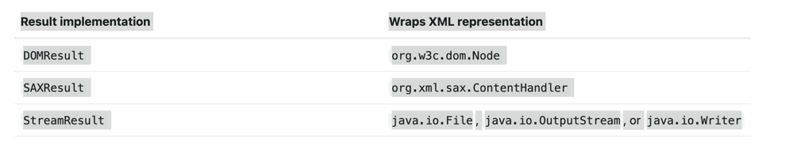
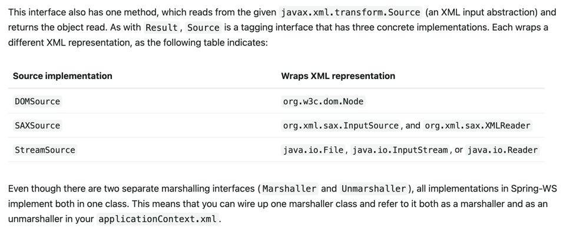

# Marshalling xml by using object-xml mappers
# 介绍
spring 对对象-xml 映射的支持,object-xml mapping 简称为 o-x mapping,将进行对象到xml的相互转换 ... 这个转换过程成为 xml 组装或者xml的序列化 ...
在o-x映射的领域內,组装器用于序列化一个对象到xml,反之使用解组装器去反序列化一个xml到对象图 .. xml能够采用dom 文档的形式或者一个输入流或者输出流或者SAX 处理器..
使用spring进行o/x映射的某一些好处:
- 容易配置
- 一致的接口
- 一致的异常体系

## 容易配置
spring bean工厂很容易配置一个组建器,无须构造一个JAXB 上下文,JiBX binding factories 以及其他内容 ...  你能够配置组建器作为bean.. 除此之外,xml基于命名空间的配置
对于大多数组建器来说多是可用的,让配置甚至更简单 ...
## 一致的接口
spring的 o-x映射操作 - 通过两个全局接口实现 Marshaller / Unmarshaller . 这个抽象让你切换o-x映射框架相对容易,在类上使用一点点或者无须任何改变就可以进行组建..
这种方式有额外的好处 - 让它通过mix-and-match的且非侵入性的方式进行 xml 组建(举个例子: 某些组建使用 JAXB 而某一些使用XStream), 让你能够使用每一种技术的优势 ..

## 一致的异常体系
spring提供了对异常的转换 - 将来自顶层o-x映射工具的异常进行转换到 已XmlMappingException作为顶部异常的自己的异常体系.. 这些运行时异常包装了原始的异常,因此不会有任何信息丢失 ..

## Marshaller 以及 Unmarshaller
一个用来构建  / 一个用来序列化,前者用于从java对象转换到 xml ,后者将xml转换为object ..

### Marshaller
```java
public interface Marshaller {

    /**
     * Marshal the object graph with the given root into the provided Result.
     */
    void marshal(Object graph, Result result) throws XmlMappingException, IOException;
}
```
此接口有一个主要的方法,归类给定对象到给定的javax.xml.transform.Result.  这个result是一个标记接口 - i基本呈现了一个xml输出的抽象 ...
具体的实现包裹了各种xml呈现,如下图所示:

> 尽管marshal() 方法接收一个简单的对象作为它的第一个参数,但是大多数Marshaller实现不能够处理任意的对象,相反,一个对象类必须能够映射到一个映射文件,需要被注解标记..
> 注册到marshaller中,或者有一个公共的基类. 请参阅本章后面的部分以确定您的 O-X 技术如何管理它。

### Understanding Unmarshaller
同理
```java
public interface Unmarshaller {

    /**
     * Unmarshal the given provided Source into an object graph.
     */
    Object unmarshal(Source source) throws XmlMappingException, IOException;
}
```
