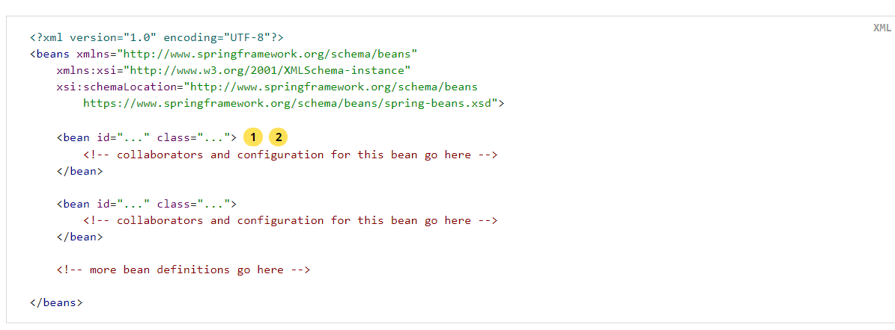

1.Introduction to the Spring IoC Container and Beans(介绍spring 容器和beans)
springFramework是对控制反转的主要实现,Ioc已知就是控制反转，仅仅通过构建器参数，或者通过传递给工厂函数的参数来处理对象的依的依赖
当创建bean的时候将会拦截这些依赖,将会从根本上去翻转控制(bean的实例化或者通过通过使用类的直接构造器或者服务发现模式解析此bean的依赖)

2.Application context是bean factory的一个超集，它提供了许多能力,例如:
四大特性<br/>
    1.第一是更容易的和spring aop进行集成。<br/>
    2.第二个是事件发布，<br/>
    3.第三个是选择应用的上下文(比如web环境选用WebApplicationContext)<br/>
    4.第四是为国际化做处理。<br/>
    可以知道applicationContext 提供了更多的企业级功能，而BeanFactory（提供了配置框架和一些基础功能）,如果需要使用BeanFactory代替ApplicationContext
    查看BeanFactory章节!

Note:  在Spring中,被Spring Ioc 容器管理的骨干对象被称作beans,一个对象的将会被IOC 实例化,组装，管理,摧毁(原型模式对象除外),
除此之外,Bean的依赖关系是通过配置元数据进行反映的【这些数据最后被IOC容器使用，产生对象】！


3. 什么是配置元数据!
    通过xml配置在beans元素中间的一些Bean定义,除此之外，通过java 注解的配置如@Configuration  @Bean,@Import @DependsOn 的配置信息，都算!
    一般来说会定义服务层对象，数据访问层对象，展示对象例如Action,以及基础设施对象，如Hibernate SessionFactories, JMS Queues, 以及更多!
    一般来说不会配置非常细腻化的域对象，因为通常使用数据访问层对象或者业务逻辑创建或者加载域对象，但是可以通过Spring结合Aspect 配置超出容器管理之外的对象!
   
 
4.实例化容器
    实例化容器的方式有很多种,比如ClassPathXmlApplicationContext,以及注解相关的，或者FileSystem....相关的!
    除此之外,Spring 通过Resource抽象进行应用上下文构造，它通过从给定义语法定义的URL 定位的路径构造一个输入流，并从中读取！


5. 组建基于 xml的配置元数据
    Spring能从多个路径获取上下文,也支持通过import元素引入资源文件,如下
   ```
       <beans>
                <import resource="services.xml"/>
                <import resource="resources/messageSource.xml"/>
                <import resource="/resources/themeSource.xml"/>
                <bean id="bean1" class="..."/>
                <bean id="bean2" class="..."/>
            </beans>
   ```
    上面的路径可以使用相对路径,但是不推荐，其次可以使用file://抓取绝对路径资源, 同时可以使用SPEL语法-> 来解析读取jvm属性（运行时）,尽量使用绝对路径(不要使用相对路径,可能会使得当前应用程序对程序外的目录产生依赖)
可以通过各种spring提供的schema 添加指令特性,比如context  或者 util 

6.容器的使用很简单  可以刷新容器、注册bean定义，或者所有的beanNames  以及通过条件获取bean对象;
    例如
```
    // create and configure beans
    ApplicationContext context = new ClassPathXmlApplicationContext("services.xml", "daos.xml");

    // retrieve configured instance
    PetStoreService service = context.getBean("petStore", PetStoreService.class);
    
    // use configured instance
    List<String> userList = service.getUsernameList();
```
更加灵活的方式使用GenericApplicationContext 来进行读取代理,例如XmlBeanDefinitionReader 对xml形式的Bean定义进行解析!
<pre>
    GenericApplicationContext context = new GenericApplicationContext();
    new XmlBeanDefinitionReader(context).loadBeanDefinitions("services.xml", "daos.xml");
    context.refresh();
</pre>
能够在同一个容器上混合（从不同配置文件上解析的bean定义)
通过applicationContext.getBean方式很少见,因为spring提供了自动装配注解进行bean构造拦截、并注入依赖(通过指定的配置元数据信息)
