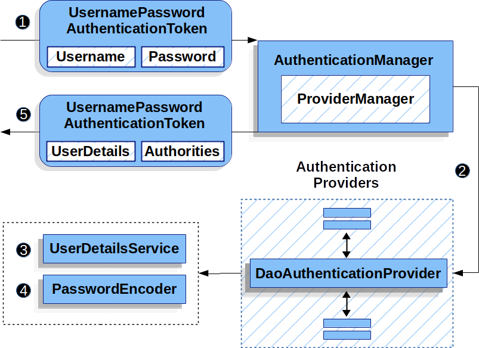
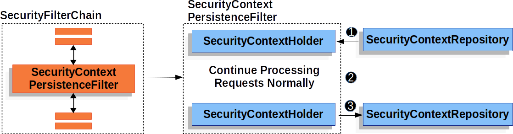
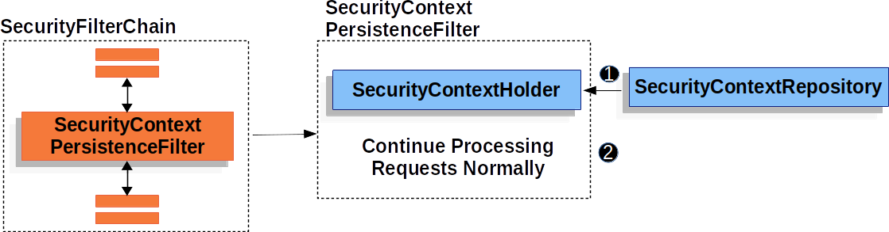

# Spring Security Authentication
## 认证
认证是spring security 提供的基础功能,它也提供了多种认证方式 \
- 表单
- basic
- digest
## 用户存储
- 内存存储
- jdbc存储
- UserDetailsService
  - 自定义存储
## password encoder
  密码编码器
  能够对密码进行加密/加盐,校验安全 ...
## DaoAuthenticationProvider
  是执行认证的一个基础协调器 \
  本质上,认证是通过AuthenticationManager 进行管理的,
  他将认证逻辑代理到ProviderManager,ProviderManager保留了许多认证Provider,
  根据不同的方式实现不同的Provider 认证处理,例如User-password / ldcp采用不同的
  AuthenticationProvider ..
  那么对于user-password 认证方式,核心就是DaoAuthenticationProvider .. \
  这个类内部利用了UserDetailsService 以及 PasswordEncoder 去认证用户名和密码 .. \
  我们可以查看它的工作流程:
  
  首先前端收集Username / password形成UsernamePasswordAuthenticationToken 交给AuthenticationManager
  进行处理,然后代理给ProviderManager 选择合适的认证Provider,最终拿到了
  DaoAuthenticationProvider 进行验证,由于前面说过这个provider会使用userDetailsService和PasswordEncoder进行用户校验
  ,校验完毕之后返回UsernamePasswordAuthenticationToken,其中用户身份是UserDetails,这个我们是可以自己扩展的,包含一些额外的信息,
  还有就是Authorities,取决于系统有哪些权限 ..
  然后这个Token将会被认证过滤器设置到SecurityContextHolder ..
  

## 持久化认证
官方提供了很多种持久化认证的方式
- SecurityContextRepository
  - HttpSecurityContextRepository
  - NullSecurityContextRepository
  - RequestAttributeSecurityContextRepository
- SecurityContextPersistenceFilter
- SecurityContextHolderFilter

当第一次请求保护的资源的时候,会要求凭证... 最常见的方式之一就是重定向用户到登录页面 ..\
一个总计的Http 交换(对于未认证用户请求一个保护资源)如下:
```text
GET / HTTP/1.1
Host: example.com
Cookie: SESSION=91470ce0-3f3c-455b-b7ad-079b02290f7b
HTTP
copy icon
Copied!
HTTP/1.1 302 Found
Location: /login
```
然后用户提交用户和密码
```text
POST /login HTTP/1.1
Host: example.com
Cookie: SESSION=91470ce0-3f3c-455b-b7ad-079b02290f7b

username=user&password=password&_csrf=35942e65-a172-4cd4-a1d4-d16a51147b3e
```
认证用户之后,用户关联到一个会话id 阻止[会话固定攻击](https://docs.spring.io/spring-security/reference/servlet/authentication/session-management.html#ns-session-fixation) ...
```text
HTTP/1.1 302 Found
Location: /
Set-Cookie: SESSION=4c66e474-3f5a-43ed-8e48-cc1d8cb1d1c8; Path=/; HttpOnly; SameSite=Lax
```
后续的请求包括这个session cookie(被用来认证用户  保持用户的会话)
当然这是一种方式,或者传递token ...
```text 
GET / HTTP/1.1
Host: example.com
Cookie: SESSION=4c66e474-3f5a-43ed-8e48-cc1d8cb1d1c8
```
### SecurityContextRepository
在spring security中关联一个用户到未来的请求是通过SecurityContextRepository ...

### HttpSecurityContextRepository
SecurityContextRepository的默认实现是 HttpSecurityContextRepository,它将SecurityContext关联到HttpSession ..
用户能够替换HttpSessionSecurityContextRepository为其他的 SecurityContextRepository实现(如果它们想要使用其他方式关联用户到后续的请求或者根本没有) ...

### NullSecurityContextRepository
如果不想要关联SecurityContext到HttpSession(例如,通过OAuth认证的时候),那么NullSecurityContextRepository是一种SecurityContextRepository实现,它不会做任何事情 ..
### RequestAttributeSecurityContextRepository
这个类将会保留SecurityContext作为请求的属性,使得SecurityContext在单个请求上有效(以确保 SecurityContext 可用于跨越可能清除 SecurityContext 的调度类型发生的单个请求)
举个例子:  假设客户端发出一个请求,已经认证了,但是发生了一个错误,依赖于servlet 容器实现,错误会导致任何已经建立的SecurityContext被清理并进行错误派发 ...
当这个错误派发处理时,则没有任何SecurityContext被建立 ...
这意味着错误页面不能够使用SecurityContext进行授权或者显示当前的用户(除非SecurityContext被持久化了)
那么使用这个类即可保持SecurityContext在dispatch type 改变的时候依旧可用 ...
```java
public SecurityFilterChain filterChain(HttpSecurity http) {
	http
		// ...
		.securityContext((securityContext) -> securityContext
			.securityContextRepository(new RequestAttributeSecurityContextRepository())
		);
	return http.build();
}
```
### SecurityContextPersistenceFilter
这个过滤器负责持久化SecurityContext(它通过SecurityContextRepository在请求之间持久化SecurityContext) ..

根据这个工作图,我们可以发现仅仅修改 SecurityContextHolder 即可确保SecurityContext 被持久化到SecurityContextRepository ..
有些情况(在SecurityContextPersistenceFilter 方法完成之前,响应已经提交并且写入了客户端),例如一个重定向发送到客户端(响应将会立即返回给客户端),这意味着建立的HttpSession 可能并没有出现在步骤3,因为会话id 不能够包含在已经写出的响应中 ...\
另一个情况是如果客户端成功认证,在SecurityContextPersistenceFilter完成之前提交,那么客户端发出了第二个请求(在SecurityContextPersistenceFilter完成认证之前),这个错误认证可能会出现在第二个请求中 ...

为了避免这些问题,SecurityContextPersistenceFilter 包含了request以及 response去检查,如果SecurityContext已经改变,并且在响应提交之前保存SecurityContext ...
### SecurityContextHolderFilter
这个过滤器负责加载SecurityContext(在请求之间通过 SecurityContextRepository加载) 


它仅仅加载SecurityContext,并不保存SecurityContext,这意味着当使用SecurityContextHolderFilter,它必须确保SecurityContext是显式的被保存(通过配置) ...
```java
public SecurityFilterChain filterChain(HttpSecurity http) {
	http
		// ...
		.securityContext((securityContext) -> securityContext
			.requireExplicitSave(true)
		);
	return http.build();
}
```
