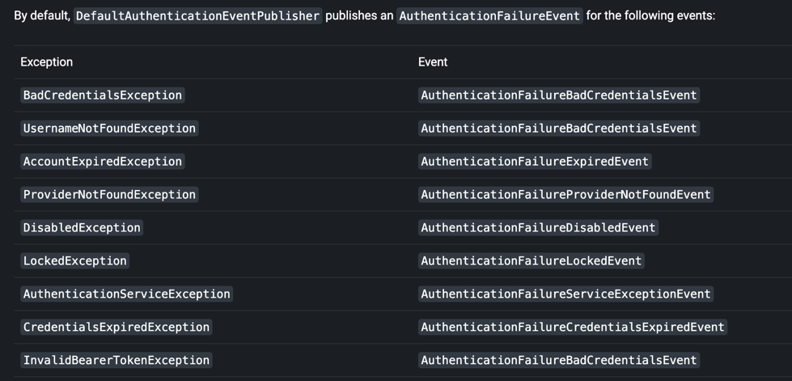

# 认证事件
当每一次认证成功或者认真失败的情况下,`AuthenticationSuccessEvent` 或者 `AuthenticationFailureEvent` 单独,将会触发 ..

为了监听这些事件,你必须首先发布一个 AuthenticationEventPublisher,spring security的 DefaultAuthenticationEventPublisher 将在针对这些目的工作良好
```java
@Bean
public AuthenticationEventPublisher authenticationEventPublisher
        (ApplicationEventPublisher applicationEventPublisher) {
        return new DefaultAuthenticationEventPublisher(applicationEventPublisher);
        }
```

然后你能够使用Spring的`@EventListener` 支持
```java
@Component
public class AuthenticationEvents {
	@EventListener
    public void onSuccess(AuthenticationSuccessEvent success) {
		// ...
    }

    @EventListener
    public void onFailure(AbstractAuthenticationFailureEvent failures) {
		// ...
    }
}
```
虽然类似于 AuthenticationSuccessHandler / AuthenticationFailureHandler,但是它们能够独立于servlet api使用 ..

## 增加的异常映射
默认情况下,spring security的事件派发器将发布以下事件:


发布者进行精确的异常匹配，这意味着这些异常的子类也不会产生事件。

最后,如果你希望提供额外的映射到发布者,能够通过`setAddtionalExceptionMappings` 方法

```java
@Bean
public AuthenticationEventPublisher authenticationEventPublisher
        (ApplicationEventPublisher applicationEventPublisher) {
    Map<Class<? extends AuthenticationException>,
        Class<? extends AbstractAuthenticationFailureEvent>> mapping =
            Collections.singletonMap(FooException.class, FooEvent.class);
    AuthenticationEventPublisher authenticationEventPublisher =
        new DefaultAuthenticationEventPublisher(applicationEventPublisher);
    authenticationEventPublisher.setAdditionalExceptionMappings(mapping);
    return authenticationEventPublisher;
}
```

## Default Event
您还可以提供一个包罗万象的事件以在出现任何 AuthenticationException 时触发：

但是这并不是说, 它一定会触发,而是AuthenticationException 如果没有出现在异常映射中 ..
那么则使用这个默认事件来包装认证异常 ..
```java
@Bean
public AuthenticationEventPublisher authenticationEventPublisher
        (ApplicationEventPublisher applicationEventPublisher) {
    AuthenticationEventPublisher authenticationEventPublisher =
        new DefaultAuthenticationEventPublisher(applicationEventPublisher);
    authenticationEventPublisher.setDefaultAuthenticationFailureEvent
        (GenericAuthenticationFailureEvent.class);
    return authenticationEventPublisher;
}
```