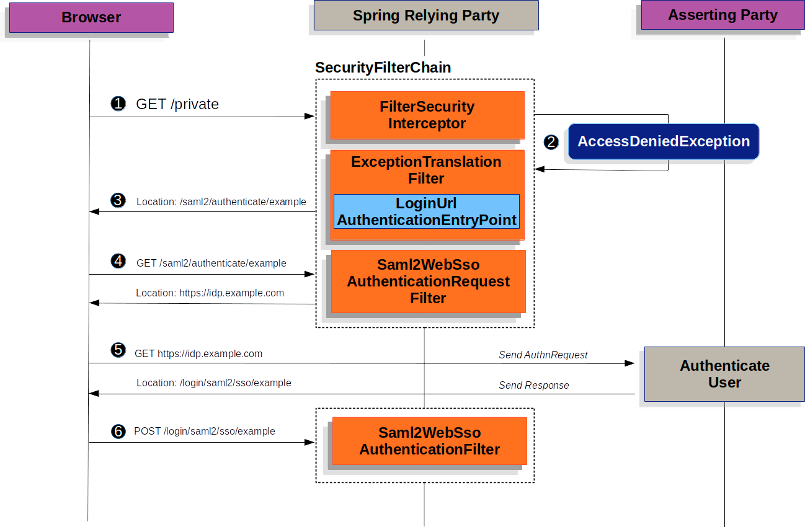
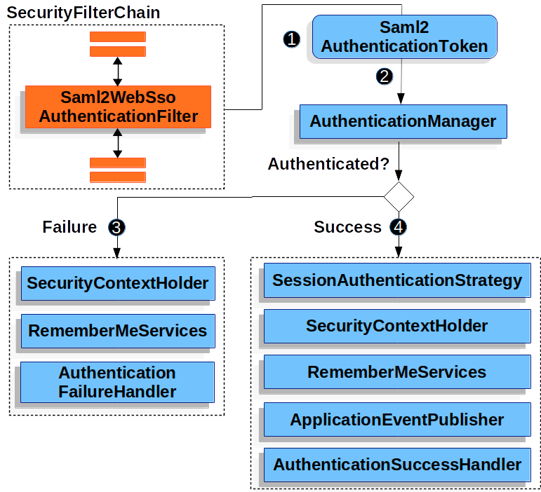
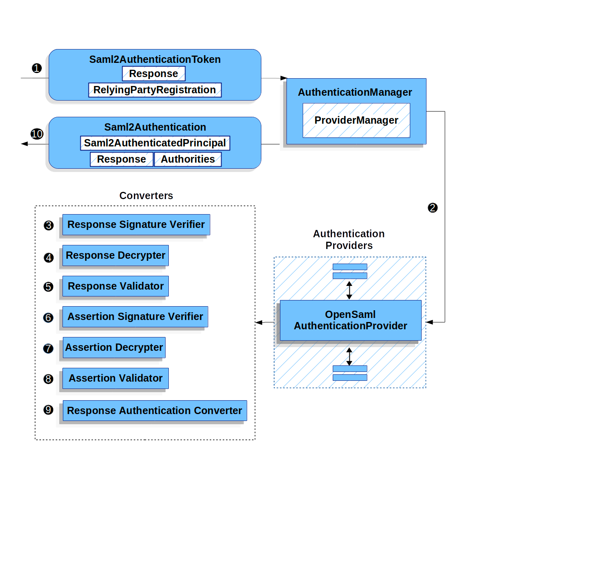

# saml 2.0 登录概述
我们开始解释怎样让 saml 2.0 依赖方认证在spring security中工作 .. 
就像 oauth2 2.0 登录那样,spring security 让用户到第三方执行认证,它通过一系列的重定向..



> 注意到上图构建于[SecurityFilterChain](https://docs.spring.io/spring-security/reference/servlet/architecture.html#servlet-securityfilterchain) 以及 
> [AbstractAuthenticationProcessingFilter](https://docs.spring.io/spring-security/reference/servlet/authentication/architecture.html#servlet-authentication-abstractprocessingfilter)


这个流程比较简单,我们简单解释其中的一些步骤:
例如第三步,用户发现缺少认证,那么spring security将尝试获取用户的认证信息, 那么AuthenticationEntryPoint 是一个 `LoginUrlAuthenticationEntryPoint`,
将会重定向到[saml2.0 认证请求生成端点](https://docs.spring.io/spring-security/reference/servlet/saml2/login/overview.html#servlet-saml2login-sp-initiated-factory) - 
Saml2WebSsoAuthenticationRequestFilter ... 除此之外,如果你配置了超过一个断言方,那么首先重定向到 收集者的页面(也就是需要选择一个进行认证请求生成) ...

第4步,创建并签名,序列化最后编码<saml2:AuthnRequest> 使用配置的[Saml2AuthenticationRequestFactory](https://docs.spring.io/spring-security/reference/servlet/saml2/login/overview.html#servlet-saml2login-sp-initiated-factory) ..

第5步,浏览器将根据此请求并呈现给断言方,断言方尝试认证用户,如果成功,那么返回<saml2:Response> 给浏览器 ..

第6步,浏览器Post请求发送认证响应给 断言消费者服务端点 ..

下图中描述了Spring Security 如何认证一个 <saml:Response>


这个流程比较简单,
第一步,浏览器将响应传递给应用,它代理给Saml2WebSsoAuthenticationFilter. 此过滤器调用配置的AuthenticationConverter ..
去创建一个Saml2AuthenticationToken (通过从HttpServletRequest抓取这个响应) .. 

此转换器额外的解析 [RelyingPartyRegistration](https://docs.spring.io/spring-security/reference/servlet/saml2/login/overview.html#servlet-saml2login-relyingpartyregistration) 并提供它到
Saml2AuthenticationToken ..

第二步,然后用AuthenticationManager 来实现token 校验,默认使用OpenSamlAuthenticationProvider ..

整体认证方式 在spring security中完全是一致的 ...

## Minimal Dependencies

SAML 2.0 服务提供器支持 在 spring-security-saml2-service-provider中,基于 OpenSAML 库构建 ..

## 最小化配置
当使用spring boot的时候,配置一个应用作为服务提供器需要有两个基本步骤:
1. 包括需要的依赖
2. 指示必要的断言方的元数据

> 同样,这个配置预先假设了你已经使用[断言方注册了依赖方](https://docs.spring.io/spring-security/reference/servlet/saml2/metadata.html#servlet-saml2login-metadata)

### 指定身份提供器元数据

在spring boot 应用中,为了指定身份提供器的元数据, 创建类似于如下配置:
```yaml
spring:
  security:
    saml2:
      relyingparty:
        registration:
          adfs:
            identityprovider:
              entity-id: https://idp.example.com/issuer
              verification.credentials:
                - certificate-location: "classpath:idp.crt"
              singlesignon.url: https://idp.example.com/issuer/sso
              singlesignon.sign-request: false
```

这里:
- https://idp.example.com/issuer
    
    是一个包含在SAML响应中的Issuer属性的值(负责响应身份提供器疑问)
- classpath:idp.crt

    表示验证SAML 响应的身份提供者的证书(位于类路径上) 
- idp.example.com/issuer/sso

    它是一个端点 表示身份提供器期待AuthnRequest 实例 ..
- adfs

    是一个你选择的任意的标识符(仅仅是配置的一个标识符)

> 身份提供器以及断言方都是 同义的, 如同服务提供器 以及依赖方 ..
> 这些频繁的简写为 AP 以及 RP(分别的) ...

## 运行时期待
正如早期配置,应用处理任何 `/login/saml2/sso/{registartionId}` 请求(包含SAMLResponse 参数)
```text
POST /login/saml2/sso/adfs HTTP/1.1

SAMLResponse=PD94bWwgdmVyc2lvbj0iMS4wIiBlbmNvZGluZ...
```
这里有两种方式引诱你的断言方生成SAMLResponse ..
1. 你能够导航到你的断言方 .. 对于每一个注册的依赖方它可能有某些类型的链接或者按钮(这样你能够点击他们去发送SAMLResponse - 返回到应用程序(对于一般的后台服务器来说,都是返回一个页面,然后执行自动脚本重定向,例如 Okta))
2. 你能够导航到应用中受保护的页面(例如,localhost:8080),然后应用重定向到 配置的断言方 .. 它会发送SAMLResponse ..(那么发送响应的方式依旧是 第一种类似,只不过少了导航的action)

对于发送SAMLResponse,都是身份提供者或者断言方给我们(也就是身份消费服务) ..

## SAML 2.0 登录集成(使用openSAML)

spring security saml 2.0 支持有一组设计的目的:
- 依赖于一组库进行saml 2.0 操作和域对象使用,为了实现这个目的,spring security 使用了 OpenSAML ..
- 确保这个库不必须的(当使用Spring Security的SAML 支持),为实现这一点，Spring Security 在合约中使用 OpenSAML 的任何接口或类都保持封装状态。
为了使得切换到OpenSAML之外的其他库或者不支持的OpenSAML版本 ..

正由于这两个目的的本质结果,spring security的saml api 十分的小(相比于其他模块) .. 除此之外,例如OpenSamlAuthenticationRequestFactory 以及  OpenSamlAuthenticationProvider
暴露了一个 converter 实现能够在认证过程中定义各种步骤 ..

举个例子,一旦你的应用接受了一个SAMLResponse 并且代理到 Saml2WebSsoAuthenticationFilter,那么这个过滤器将代理到 OpenSamlAuthenticationProvider ...

Authenticating an OpenSAML Response:


我们直接从第三步开始,认证提供器将反序列化OpenSAML 响应并检查它的签名,如果签名无效,则认证失败 ..

4. 提供[解密任何 EncryptedAssertion 元素](https://docs.spring.io/spring-security/reference/servlet/saml2/login/authentication.html#servlet-saml2login-opensamlauthenticationprovider-decryption), 如果解密失败,则认证失败 ..
5. 下一步 provider验证响应的Issuer(其实就是依赖方配置的EntityId) 以及 Destination 值,如果它们不匹配在依赖方注册中的配置,则认证失败 ..
6. 之后,提供者验证每一个Assertion的签名, 如果签名无效,认证失败,同样,如果响应或者断言没有签名,则认证失败 ..
要么响应或者所有的断言必须有签名 ...
7. 然后,提供器解码任何EncryptedID 或者 EncryptedAttribute 元素 .. 如果任何解码失败,认证失败 ..
8. 下一步,提供器验证每一个断言的`ExpiredAt` 以及`NotBefore` 时间戳..  以及<Subject> 以及 任何`<AudienceRestriction>` 条件,如果任何验证失败,则认证失败 ..
9. 紧接着,provider 尝试获取第一个断言的AttributeStatement 并映射它为Map<String,List<Object>>, 它同样授予ROLE_USER 授予的权限(不是很理解) ..
10. 最终,它将获取NameID(从第一个断言中), Map的一个属性,并且使用GrantedAuthority 并构造一个 Saml2AuthenticatedPrincipal, 然后放置Principal 和授权信息到Saml2Authentication ..


最终结果Authentication#getPrincipal 是一个 Saml2AuthenticatedPrincipal 对象,并且Authentication#getName 映射到第一个断言的NameID 元素 ..

Saml2AuthenticatedPrincipal#getRelyingPartyRegistrationId 持有和[关联的依赖方注册的标识符](https://docs.spring.io/spring-security/reference/servlet/saml2/login/overview.html#servlet-saml2login-relyingpartyregistrationid) .

## 自定义OpenSAML 配置
任何同时使用spring security 以及 OpenSAML 应该初始化 OpenSamlInitializationService(在类的一开始)

这是OpenSAML的InitializationService#initialize 的替代 ..
偶然间, 它能够有价值的自定义OpenSAML的构建, 编组和解组 SAML 对象 .. 在这些环境中,你相反也许希望调用`OpenSamlInitializationService#requireInitialize(Consumer)` 让你访问OpenSAML的XMLObjectProviderFactory ..

例如,当发送一个未签名的AuthNRequest时,你也许想要强制重新认证,在这种情况下,你能够注册你自己的 AuthnRequestMarshaller ..

```java
static {
    OpenSamlInitializationService.requireInitialize(factory -> {
        AuthnRequestMarshaller marshaller = new AuthnRequestMarshaller() {
            @Override
            public Element marshall(XMLObject object, Element element) throws MarshallingException {
                configureAuthnRequest((AuthnRequest) object);
                return super.marshall(object, element);
            }

            public Element marshall(XMLObject object, Document document) throws MarshallingException {
                configureAuthnRequest((AuthnRequest) object);
                return super.marshall(object, document);
            }

            private void configureAuthnRequest(AuthnRequest authnRequest) {
                authnRequest.setForceAuthn(true);
            }
        }

        factory.getMarshallerFactory().registerMarshaller(AuthnRequest.DEFAULT_ELEMENT_NAME, marshaller);
    });
}
```
`requireInitialize` 方法针对每一个应用实例仅仅调用一次 ..

## 覆盖或者替代Boot 自动配置
Spring boot 生成@Bean 对象(对一个依赖方) ..

第一个是SecurityFilterChain(将配置应用作为一个依赖方),当包括`spring-security-saml2-service-provider` ,`SecurityFilterChain` 看起来如下:
```java
@Bean
public SecurityFilterChain filterChain(HttpSecurity http) throws Exception {
    http
        .authorizeHttpRequests(authorize -> authorize
            .anyRequest().authenticated()
        )
        .saml2Login(withDefaults());
    return http.build();
}
```
如果应用没有暴露SecurityFilterChain bean,spring boot 将暴露之前提到的默认实现 ..

我们能够暴露这个bean:
```java
@Configuration
@EnableWebSecurity
public class MyCustomSecurityConfiguration {
    @Bean
    public SecurityFilterChain filterChain(HttpSecurity http) throws Exception {
        http
            .authorizeHttpRequests(authorize -> authorize
                .requestMatchers("/messages/**").hasAuthority("ROLE_USER")
                .anyRequest().authenticated()
            )
            .saml2Login(withDefaults());
        return http.build();
    }
}
```
这个示例决定了访问以`/messages/` 开头的URL 需要`USER` 角色 ..

第二个`@Bean` 需要关注的是spring boot 创建的 RelyingPartyRegistrationRepository,它呈现了断言方以及依赖方的元数据 ..
这包括了例如SSO 端点的位置(当依赖方 使用它从断言方请求认证) ..

你能够覆盖默认配置(通过发布自己的RelyingPartyRegistrationRepository bean),举个例子,你能够查看断言方的配置(通过访问它的元数据端点) ...

以下是设置依赖方的注册仓库:
```java
@Value("${metadata.location}")
String assertingPartyMetadataLocation;

@Bean
public RelyingPartyRegistrationRepository relyingPartyRegistrations() {
    RelyingPartyRegistration registration = RelyingPartyRegistrations
            .fromMetadataLocation(assertingPartyMetadataLocation)
            .registrationId("example")
            .build();
    return new InMemoryRelyingPartyRegistrationRepository(registration);
}
```
> registrationId 是一个任意值(能够在不同的注册之间切换的标识符) ..

除此之外,你能够手动的提供每一个:
```java
@Value("${verification.key}")
File verificationKey;

@Bean
public RelyingPartyRegistrationRepository relyingPartyRegistrations() throws Exception {
    X509Certificate certificate = X509Support.decodeCertificate(this.verificationKey);
    Saml2X509Credential credential = Saml2X509Credential.verification(certificate);
    RelyingPartyRegistration registration = RelyingPartyRegistration
            .withRegistrationId("example")
            .assertingPartyDetails(party -> party
                .entityId("https://idp.example.com/issuer")
                .singleSignOnServiceLocation("https://idp.example.com/SSO.saml2")
                .wantAuthnRequestsSigned(false)
                .verificationX509Credentials(c -> c.add(credential))
            )
            .build();
    return new InMemoryRelyingPartyRegistrationRepository(registration);
}
```
X509Support 是一个OpenSAML的类, 在前面的示例中为了使用简洁  ..

除此之外,可以通过dsl 来直接关联仓库, 这能够覆盖自动配置的SecurityChain:
```java
@Configuration
@EnableWebSecurity
public class MyCustomSecurityConfiguration {
    @Bean
    public SecurityFilterChain filterChain(HttpSecurity http) throws Exception {
        http
            .authorizeHttpRequests(authorize -> authorize
                .requestMatchers("/messages/**").hasAuthority("ROLE_USER")
                .anyRequest().authenticated()
            )
            .saml2Login(saml2 -> saml2
                .relyingPartyRegistrationRepository(relyingPartyRegistrations())
            );
        return http.build();
    }
```

依赖方能够 是一个多租户(通过注册多个依赖方在 RelyingPartRegistrationRepository)

### RelyingPartRegistration
这个实例在依赖方和断言方的元数据之间表示一个链接 ..

在 RelyingPartyRegistration 中，您可以提供依赖方元数据，例如它的 Issuer 值，它希望将 SAML 响应发送到哪里，以及它拥有的用于签名或解密有效负载的任何凭证。

同样,你能够提供断言方的元数据(例如 Issuer 值), 它期待AuthnRequest 发送到哪里,并且任何公钥凭证能够用作依赖方验证或者加密负载 ..

这里的解释或许有一点迷惑,也就是说断言方配置的是真正校验请求的 第三方元数据 ..
(例如认证请求 请求的地址, 以及 依赖方(也就是响应消费者) 获取公钥用来解析 认证响应),所以本质上配置的是认证第三方的元数据 ..

而依赖方表示(一般表示应用),负责认证响应的解析,验证(以及需要配置发送认证响应的回调地址(或者说重定向地址)) ..
一般依赖方就是应用自身,所以认证响应的Url 一般就是自己应用的 url..

例如以下配置:
```java
RelyingPartyRegistration relyingPartyRegistration = RelyingPartyRegistrations
        .fromMetadataLocation("https://ap.example.org/metadata")
        .registrationId("my-id")
        .build();
```

注意到我们能够从任何InputStream 源创建 RelyingPartyRegistration .. 例如一个已知示例将元数据存储在 数据库中 ..
```java
String xml = fromDatabase();
try (InputStream source = new ByteArrayInputStream(xml.getBytes())) {
    RelyingPartyRegistration relyingPartyRegistration = RelyingPartyRegistrations
            .fromMetadata(source)
            .registrationId("my-id")
            .build();
}
```
一个更加复杂的配置
```java
RelyingPartyRegistration relyingPartyRegistration = RelyingPartyRegistration.withRegistrationId("my-id")
        .entityId("{baseUrl}/{registrationId}")
        .decryptionX509Credentials(c -> c.add(relyingPartyDecryptingCredential()))
        .assertionConsumerServiceLocation("/my-login-endpoint/{registrationId}")
        .assertingPartyDetails(party -> party
                .entityId("https://ap.example.org")
                .verificationX509Credentials(c -> c.add(assertingPartyVerifyingCredential()))
                .singleSignOnServiceLocation("https://ap.example.org/SSO.saml2")
        )
        .build();
```

> 这里的顶级元数据方法都是依赖方的详情配置,在 `assertingPartyDetails` 方法内部的都是断言方的详情 ..
> 依赖方这里配置的location 表示断言消费者服务的位置,期待SAML 响应的地址 ..

默认的依赖方的entityId是 `{baseUrl}/saml2/service-provider-metadata/{registrationId}`。

当配置断言方了解依赖方的时候,这个值是必须的 ..

`assertionConsumerServiceLocation` 的默认值是 `/login/saml2/sso/{registrationId}`,默认情况下,它映射到 过滤链中的 Saml2WebSsoAuthenticationFilter ..

### URI 模式
在url中的{baseUrl} 以及 {registrationId} 这些占位符 都是可以被自动替换的 ..
这些占位符对于生成URI 是有用的,因此, 依赖方的`entityId` 以及 `assertionConsumerServiceLocation` 支持以下的占位符:
- `baseUrl`

  scheme,host,以及部署应用的端点
- `registrationId`

  依赖方的注册id
- baseSchema

  部署应用的模式(方案)
- baseHost

  部署应用的主机
- basePort

  部署应用的端口

例如,早期定义的 `assertionConsumerServiceLocation` 如下:

`/my-login-endpoint/{registrationId}`
在一个部署的应用中,它翻译为:
`/my-login-endpoint/adfs`

早期的entityId 定义为:
`{baseUrl}/{registrationId}`
在部署的应用中,它翻译为:
`https://rp.example.com/adfs`

主要的URL 模式如下:

- `/saml2/authenticate/{registrationId}`

  此端点生成 <saml2:AuthnRequest> 基于RelyingPartRegistration的配置 并发送给断言方 ..
- `/saml2/login/sso/{registrationId}`

  此端点认证 断言方的<saml2:Response>(基于RelyingPartyRegistration的配置)
- `/saml2/logout/sso`

  此端点处理 <saml2:LogoutRequest> 并提供<saml2:LogoutResponse> 负载 ..
从之前认证的状态查询RelyingPartyRegistration ..
- `/saml2/saml2-service-provider/metadata/{registrationId}`

  获取RelyingPartRegistration配置的元数据 ..

因为`registrationId` 是 RelyingPartyRegistration 的主要标识符 .. 对于未认证场景的情况下需要使用在URL 中 ..
如果你希望从URL中移除registrationId,能够指定 RelyingPartyRegistrationResolver 告诉spring security 如何查询`registrationId` ...

### 凭证
在前面展示的示例中,你可能也注意到使用了凭证

经常,一个依赖方会使用由加密负载的相同key 去解密 .. 除此之外,也可以用相同的key 去验证负载也可以加密它们 ..

因为这样,spring security 携带了 Saml2X509Credential, 一个特定于SAML的凭证能够简化配置相同key 来针对不同的使用情况 ..

最小化配置,你需要有一个来自断言方的 凭证(这样 断言方签名的响应 能够被验证) ..

为了构造一个 Saml2X509Credential,你能够使用去验证来自断言方的断言 .. 你能够加载秘钥文件并使用CertificateFactory:
```java
Resource resource = new ClassPathResource("ap.crt");
try (InputStream is = resource.getInputStream()) {
    X509Certificate certificate = (X509Certificate)
            CertificateFactory.getInstance("X.509").generateCertificate(is);
    return Saml2X509Credential.verification(certificate);
}
```
假设断言方将要加密断言,这种情况下,依赖方需要一个私钥解密编码值 ..
这种情况下,我们可以使用RSAPrivateKey 和它 相关的X509Certificate ...

你也能首先通过Spring Security的RsaKeyConverters 工具类加载然后像之前那样加载第二个(也就是证书) ..

> 当你指定这些文件的位置 作为合适的Spring boot 属性, spring boot 自动执行这些转换 ..


### 重复的依赖方配置
当一个应用使用了多个断言方,某些配置在RelyingPartyRegistration 实例上是重复的 ..

- 依赖方的 `entityId`
- `assertionConsumerServiceLocation`
- 它的凭证(例如,它的签名和解密凭证/证书)

此设置可以让某些身份提供者比其他身份提供者更容易轮换凭据。

重复能够在某些不同的方式中 缓解(alleviated):

首先,在yaml中能够使用引用缓解:
```yaml
spring:
  security:
    saml2:
      relyingparty:
        okta:
          signing.credentials: &relying-party-credentials
            - private-key-location: classpath:rp.key
              certificate-location: classpath:rp.crt
          identityprovider:
            entity-id: ...
        azure:
          signing.credentials: *relying-party-credentials
          identityprovider:
            entity-id: ...
```

第二,在数据库中,不需要副本 RelyingPartyRegistration 的模型 ..

第三步 在java中,你能够创建一个自定义的配置方法:
```java
private RelyingPartyRegistration.Builder
        addRelyingPartyDetails(RelyingPartyRegistration.Builder builder) {

        Saml2X509Credential signingCredential = ...
        builder.signingX509Credentials(c -> c.addAll(signingCredential));
        // ... other relying party configurations
        }

@Bean
public RelyingPartyRegistrationRepository relyingPartyRegistrations() {
        RelyingPartyRegistration okta = addRelyingPartyDetails(
        RelyingPartyRegistrations
        .fromMetadataLocation(oktaMetadataUrl)
        .registrationId("okta")).build();

        RelyingPartyRegistration azure = addRelyingPartyDetails(
        RelyingPartyRegistrations
        .fromMetadataLocation(oktaMetadataUrl)
        .registrationId("azure")).build();

        return new InMemoryRelyingPartyRegistrationRepository(okta, azure);
        }
```

上面说了不同方式的重复配置的减轻 ...

### 从请求上 解析 RelyingPartyRegistration
正如你所见,spring security 通过 在URI路径上查询registration id 来解析 RelyingPartyRegistration ..

这里有大量的原因你也许想要自定义,包含它们:
- 你也许已经知道了哪一个是你需要的RelyingPartyRegistration
- 您可能正在联合许多断言方

为了定制解析RelyingPartyRegistration 的方式, 你能够配置一个自定义的RelyingPartyRegistrationResolver ..
默认的行为是从uri的最后一个路径元素解析registration id 并查询 RelyingPartyRegistrationRepository ..

> 注意到如果在你的 RelyingPartyRegistration 中包含了任意的占位符, 你的解析器实现应该解析它们 ..

### 解析为单个一致的RelyingPartyRegistration
你也能够提供一个解析器,例如,总是返回相同的RelyingPartyRegistration:
```java
public class SingleRelyingPartyRegistrationResolver implements RelyingPartyRegistrationResolver {

    private final RelyingPartyRegistrationResolver delegate;

    public SingleRelyingPartyRegistrationResolver(RelyingPartyRegistrationRepository registrations) {
        this.delegate = new DefaultRelyingPartyRegistrationResolver(registrations);
    }

    @Override
    public RelyingPartyRegistration resolve(HttpServletRequest request, String registrationId) {
        return this.delegate.resolve(request, "single");
    }
}
```
为了这样做,我们可以提供一个解析器, 例如,总是返回相同的 `RelyingPartyRegistartion`:
```java
public class SingleRelyingPartyRegistrationResolver implements RelyingPartyRegistrationResolver {

    private final RelyingPartyRegistrationResolver delegate;

    public SingleRelyingPartyRegistrationResolver(RelyingPartyRegistrationRepository registrations) {
        this.delegate = new DefaultRelyingPartyRegistrationResolver(registrations);
    }

    @Override
    public RelyingPartyRegistration resolve(HttpServletRequest request, String registrationId) {
        return this.delegate.resolve(request, "single");
    }
}
```

> 下一步你可能想要查看如何使用这个解析器去自定义 [saml2: SPSSODescriptor 元数据的产生](https://docs.spring.io/spring-security/reference/servlet/saml2/metadata.html#servlet-saml2login-metadata)  ..

### 基于<saml2:Response#Issuer> 解析

当你有一个依赖方 能够接受来自多个断言方的断言时,你将有多个RelyingPartyRegistrations 当做 断言方 ...
主要问题是 依赖方的信息在每一个实例中都是重复的 ..

这包含了一种隐喻 - 断言消费者服务端点 对于每一个断言方则不一样 .. 这可能是不想要的 ..

相反你能够通过Issuer 解析registrationId, 一个RelyingPartyRegistrationResolver的自定义实现 也许看起来如下:
```java
public class SamlResponseIssuerRelyingPartyRegistrationResolver implements RelyingPartyRegistrationResolver {
	private final InMemoryRelyingPartyRegistrationRepository registrations;

	// ... constructor

    @Override
    RelyingPartyRegistration resolve(HttpServletRequest request, String registrationId) {
		if (registrationId != null) {
			return this.registrations.findByRegistrationId(registrationId);
		}
        String entityId = resolveEntityIdFromSamlResponse(request);
        for (RelyingPartyRegistration registration : this.registrations) {
            if (registration.getAssertingPartyDetails().getEntityId().equals(entityId)) {
                return registration;
            }
        }
        return null;
    }

	private String resolveEntityIdFromSamlResponse(HttpServletRequest request) {
		// ...
	}
}
```
上面的示例就是 通过 saml 响应抓取 entityId .. 来与 应用中配置的断言方的Issuer(是否一致),当然这里是entityId ..

> 下一步你可能想想要了解如何使用解析器定制 <saml2:Response> 认证 ..

### 联合登录
一个常见的与saml 2.0的安排是 一个身份提供者具有多个断言方 .. 在这种情况下,身份提供者的元数据端点返回 多个 <md:IDPSSODescriptor> 元素 ..

多个断言方能够在对 RelyingPartyRegistration的一次调用进行访问:
```java
Collection<RelyingPartyRegistration> registrations = RelyingPartyRegistrations
        .collectionFromMetadataLocation("https://example.org/saml2/idp/metadata.xml")
        .stream().map((builder) -> builder
            .registrationId(UUID.randomUUID().toString())
            .entityId("https://example.org/saml2/sp")
            .build()
        )
        .collect(Collectors.toList()));
```
由于这里的registrationId 设置为了一个随机值, 这将导致某些saml 2.0 端点是无法预知的 ..
这里有几种方式可以解释: 让聚焦一种适合指定的联合使用情况

在许多联合情况下, 所有断言方共享服务提供者配置, 让spring security 将默认包括registrationId 在它的许多saml2.0 url中, 下一步是改变这些uri 去排除`registrationId`..
这里包含了两个主要的uri,你将想要沿着这些线改变:
- 通过<saml2:Response#Issuer> 解析
- 使用默认的RelyingPartyRegistration 解析

> 可选的,你也许想要改变认证请求位置(可以说是认证请求生成的url 端点),但是由于这是一个内置到app的uri 并且没有发布到断言方,受益很小 ..

可以查看 完整示例[saml-extension-federation](https://github.com/spring-projects/spring-security-samples/tree/main/servlet/spring-boot/java/saml2/saml-extension-federation)


### 使用 spring security saml 扩展 uris
你可能需要从spring security saml 扩展迁移的情况下,这里有一些好处去配置你的应用去使用 默认的 saml 扩展uri

了解更多信息,请查看 [custom-urls](https://github.com/spring-projects/spring-security-samples/tree/main/servlet/spring-boot/java/saml2/custom-urls) 以及前面提到的 [saml-extension-federation](https://github.com/spring-projects/spring-security-samples/tree/main/servlet/spring-boot/java/saml2/saml-extension-federation) ..


