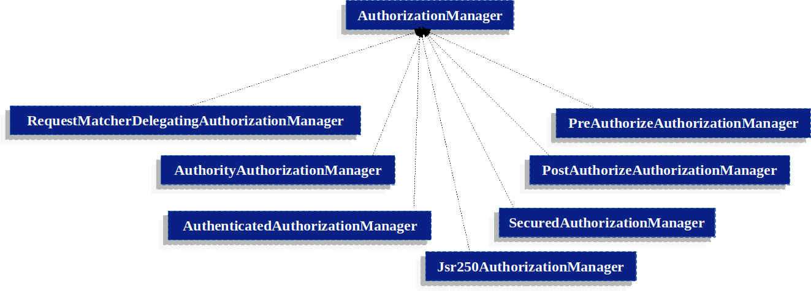
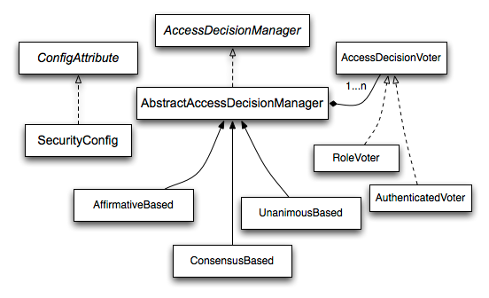
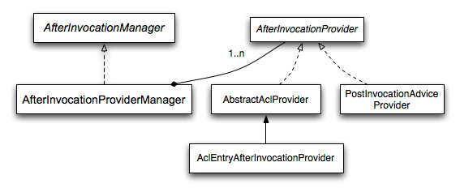

# 认证架构

这一部分描述了spring security 架构如何应用授权

## Authorities
Authentication 讨论了怎样让所有的Authentication 实现存储一组GrantedAuthority 对象. 
这些代表了授予给这个身份的权限 .. GrantedAuthority 对象将会插入到Authentication 对象中 - 通过
AuthenticationManager 并且后续将会被AccessDecisionManager 实例读取  - 当做出授权决定的时候  ..

GrantedAuthority 接口仅仅只有一个方法:
```java
String getAuthority();
```
这个方法将让AccessDecisonManager 实例去获取一个精准的GrantedAuthority的String 呈现 .. 由于返回的呈现作为String,一个`GrantedAuthority` 能够
很容易的被大多数`AccessDecisionManager` 实现读取 .. 如果一个GrantedAuthority 不能够精确的呈现为一个String,那么`GrantedAuthority` 将考虑作为一个
`complex` 复杂的并且getAuthority方法将必须返回 null ..

复杂`GrantedAuthority` 的示例是 - 它可能是一个实现存储了一组操作或者一组权限阈值 - 这将适用于不同的客户账户 .. 

一个复杂的GrantedAuthority 表现为`String` 可能十分的困难 .. 因此,`getAuthority` 方法应该返回 null ..

这指示了任何AccessDecisionManager 它需要支持这种特定的GrantedAuthority实现去理解它的内容 ..

spring security 包括了一个具体的GrantedAuthority 实现,那就是SimpleGrantedAuthority .. 这个实现让任何用户特定的字符串 能够转换为一个`GrantedAuthority` 

安全架构中包含的所有 AuthenticationProvider 实例都使用 SimpleGrantedAuthority 来填充 Authentication 对象。

## Pre-Invocation Handling
Spring Security 提供了拦截器去控制访问安全对象,例如方法执行或者 web 请求 .. 一个预调用 决定来判断调用是被允许的 - 通过AccessDecisionManager 来做出处理 ..

## AuthorizationManager

AuthorizationManager 替代了 AccessDecisionManager 以及 AccessDecisionVoter ..

应用定制AccessDecisionManager  或者 AccessDecisionVoter 鼓励去改变使用 [AuthorizationManager](https://docs.spring.io/spring-security/reference/servlet/authorization/architecture.html#authz-voter-adaptation)

AuthorizationManager 将会被AuthorizationFilter 调用 并负责做出最终访问控制决定 ..

这个AuthorizationManager 接口包含了两个方法 
```java
AuthorizationDecision check(Supplier<Authentication> authentication, Object secureObject);

default AuthorizationDecision verify(Supplier<Authentication> authentication, Object secureObject)
        throws AccessDeniedException {
    // ...
}
```
AuthorizationManager的 `check` 方法将会传递所有相关的信息(为了做出授权决定所需要的信息) ... 尤其是,传递secure 对象去启用这些包含在实际安全对象调用中的参数的检查 .

举个例子,假设安全对象是一个 MethodInvocation. 最容易的方式就是查询MethodInvocation的`Customer` 参数 ..  
之后在AuthorizationManager中实现某些类型的安全逻辑去确保主体能够被授权对客户进行操作 ..

也就是说这个身份可以代表客户进行操作 ..

实现也期待返回一个 正向的 `AuthorizationDecision`, 如果访问通过, 负向的则表示访问拒绝, 如果为 null,则表示放弃 做出选择 ..
`verify` 调用`check` 以及 后续如果出现负 AuthorizationDecision的情况下 抛出一个`AccessDeniedException` ..

## 基于代理的AuthorizationManager 实现
同时用户能够实现它们自己的AuthorizationManager 去控制授权的所有方面 .. Spring Security 携带了一个代理的AuthorizationManager 能够与独立的各种
AuthorizationManager 合作 ..

`RequestMatcherDelegatingAuthorizationManager` 将会将请求和最合适的代理AuthorizationManager 匹配,详情查看java源码 ..

对于方法安全,你能够使用AuthorizationManagerBeforeMethodInterceptor 以及 AuthorizationManagerAfterMethodInterceptor ..

注意,我们大多数情况也就是基于方法安全 ...

下面的图说明了情况


使用这种方式,一个组合的AuthorizationManager 实现能够投票一个authorization 决定 ..

###  AuthorityAuthorizationManager
最常见的AuthorizationManager 且由spring security 提供的是`AuthorityAuthorizationManager` , 它使用给定的authorities 集合配置去查询当前的Authentication ..
它将返回一个正向的`AuthorizationDecision` - 如果`Authentication` 中包含了给定的配置的authorities .. 否则它将返回一个负向的 `AuthorizationDecision` ..

### AuthenticatedAuthorizationManager
另一个管理器是AuthenticatedAuthorizationManager, 它能够被用来区分不同的认证用户(匿名 / 完全认证 / 记住我认证).. 大多数站点允许在记住我认证的情况下做出某些有限访问  ..
但是需要用户必须通过登录来确定身份以进行完全访问 ..


### 自定义的Authorization Managers
明显的是,你能够实现一个自定义的`AuthorizationManager` 并且能够加入更多任何你想要假如的访问控制逻辑 .. 它可能是特定你应用的一部分(和业务逻辑相关) 或者
可能实现某些安全管理逻辑 .. 举个例子,你能够创建一个实现能够查询 Open Policy Agent 或者 自己的授权数据库 来进行授权处理 ..
> 你能够发现一个[blog 文章](https://spring.io/blog/2009/01/03/spring-security-customization-part-2-adjusting-secured-session-in-real-time) 
> 它描述了如何使用遗留的 AccessDecisionVoter 去实时拒绝用户访问(当账户已经被冻结之后) ..


## 适配 AccessDecisionManager 以及 AccessDecisionVoters
正如之前的AuthorizationManager, spring security 发布了 AccessDecisionManager 一级 AccessDecisionVoter ..

在某些情况下,例如迁移旧的应用,它们可能想要引入AuthorizationManager(来 执行AccessDecisionManager 或者 AccessDecisionVoter) ..

为了调用存在的AccessDecisionManager,你可以适配一个AccessDecisionManager ..
```java
@Component
public class AccessDecisionManagerAuthorizationManagerAdapter implements AuthorizationManager {
    private final AccessDecisionManager accessDecisionManager;
    private final SecurityMetadataSource securityMetadataSource;

    @Override
    public AuthorizationDecision check(Supplier<Authentication> authentication, Object object) {
        try {
            Collection<ConfigAttribute> attributes = this.securityMetadataSource.getAttributes(object);
            this.accessDecisionManager.decide(authentication.get(), object, attributes);
            return new AuthorizationDecision(true);
        } catch (AccessDeniedException ex) {
            return new AuthorizationDecision(false);
        }
    }

    @Override
    public void verify(Supplier<Authentication> authentication, Object object) {
        Collection<ConfigAttribute> attributes = this.securityMetadataSource.getAttributes(object);
        this.accessDecisionManager.decide(authentication.get(), object, attributes);
    }
}
```
将此bean 关联到SecurityFilterChain ..
这样,就能够通过装饰器模式来调用已有的AccessDecisionManager ..
或者为了仅仅调用AccessDecisionVoter,你能够做一些事情 ...

```java
@Component
public class AccessDecisionVoterAuthorizationManagerAdapter implements AuthorizationManager {
    private final AccessDecisionVoter accessDecisionVoter;
    private final SecurityMetadataSource securityMetadataSource;

    @Override
    public AuthorizationDecision check(Supplier<Authentication> authentication, Object object) {
        Collection<ConfigAttribute> attributes = this.securityMetadataSource.getAttributes(object);
        int decision = this.accessDecisionVoter.vote(authentication.get(), object, attributes);
        switch (decision) {
        case ACCESS_GRANTED:
            return new AuthorizationDecision(true);
        case ACCESS_DENIED:
            return new AuthorizationDecision(false);
        }
        return null;
    }
}
```
这样也适配了调用一个AccessDecisionVoter ..
同样,将它编织到SecurityFilterChain ..

## 结构化角色
常见需要就是一个在应用的特定角色应该自动的包含其他角色 .. 例如,在应用中拥有`admin` 和 `user` 角色的概念 ... 你也许想要管理员能够做普通用户能够做的事情 .

为了这样做,你能够要么确保所有的管理员分配用户角色,除此之外,你能够修改每一个访问约束(当需要`user` 角色,同样让它包含 'admin' 角色) ..

这可能变得十分的复杂(如果应用中存在大量的角色) ..

那么使用角色体系将允许你能够配置这些角色(或者权限)应该能够包含其他角色 .. spring security的RoleVoter的扩展版本,RoleHierarchyVoter, 配置了一个
RoleHierarchy, 它将从此对象获取当前用户已经分配的所有可达权限 .. 一个常见的配置可能类似于如下:

```java
@Bean
AccessDecisionVoter hierarchyVoter() {
    RoleHierarchy hierarchy = new RoleHierarchyImpl();
    hierarchy.setHierarchy("ROLE_ADMIN > ROLE_STAFF\n" +
            "ROLE_STAFF > ROLE_USER\n" +
            "ROLE_USER > ROLE_GUEST");
    return new RoleHierarchyVoter(hierarchy);
}
```
>
> 注意: RoleHierarchy bean 配置可能不能在EnableMethodSecurity上兼容 ..
> 正如这个示例使用的时 AccessDecisionVoter ..如果你需要RoleHierarchy 支持方法安全,请继续使用@EnableGlobalMethodSecurity,
> 直到 [github.com/spring-projects/spring-security/issues/12783](https://github.com/spring-projects/spring-security/issues/12783) 问题解决 。。
> 
> 这里我们需要分清楚 启用方法安全和全局方法安全的区别, 启用全局方法安全的情况表示老式的,不建议的AccessDecisionManager等方式 ..
> 方法安全标识使用AuthorizationManager  ...

当前示例中,有4个角色出现在结构中(ROLE_ADMIN ⇒ ROLE_STAFF ⇒ ROLE_USER ⇒ ROLE_GUEST) ..
那么当安全约束评估的时候将通过适配RoleHierarchyVoter的AuthorizationManager 进行处理 .. 这里的`>` 表示包含的含义 ..

角色体系提供了简化访问应用的访问控制配置数据的便捷含义 .. 或者减少应用中需要分配给用户的权限数量 .. 

有关更加复杂的需求,你可能想要在你应用的特定的访问权限 和分配给用户的角色之间定义一个逻辑映射, 或者当加载用户信息时 在两者之间进行 转换 。。

## 遗留的Authorization Components
> spring security 包含了许多遗留的组件,现在还没有移除, 文档包含了它们 作为历史原因 .. 推荐替代它们,通过上述方式

## AccessDecisionManager

此管理器将被AbstractSecurityInterceptor 调用并负责 做出最终的访问控制决定 ..

```java
void decide(Authentication authentication, Object secureObject,
	Collection<ConfigAttribute> attrs) throws AccessDeniedException;

boolean supports(ConfigAttribute attribute);

boolean supports(Class clazz);
```
`decide`方法将传递所有用户相关的信息来做出授权决定 .. 尤其是传递的secure 对象能够启用对实际安全对象调用的参数检查 ..
举个例子,假设对象是一个MethodInvocation, 那么我们能够查询MethodInvocation 去检测Customer参数 .. 并在AccessDecisionManager中实现某些
安全逻辑去确保身份允许客户操作 .. 如果访问拒绝,则抛出AccessDeniedException 异常 ..

`supports(ConfigAttribute)` 方法将在AbstractSecurityInterceptor 一开始决定AccessDecisionManger是否能够处理传入的ConfigAttribute 时调用 ..

`supports(Class)` 方法将被security 拦截器实现调用去确保配置的 AccessDecisionManager 支持security拦截器提供的 secure 对象的类型

## 基于投票的 AccessDecisionManager 实现
当用户实现了自己的AccessDecisionManager 去控制所有的授权的相关方面 .. Spring Security 包含了各种AccessDecisionManager 实现(基于投票的) ..

[Voting Decision Manager](https://docs.spring.io/spring-security/reference/servlet/authorization/architecture.html#authz-access-voting) 描述了相关的类 ..

以下的图片展示了 AccessDecisionManager 接口:


通过此图我们已经可以发现一系列的 AccessDecisionVoter 实现负责 对授权决定进行投票 ..
AccessDecisionManager 决定是否要不要抛出一个 AccessDeniedException（基于投票的评估)

AccessDecisionVoter接口有三个方法:
```java
int vote(Authentication authentication, Object object, Collection<ConfigAttribute> attrs);

boolean supports(ConfigAttribute attribute);

boolean supports(Class clazz);
```
具体实现返回一个int,可能的值是AccessDecisionVoter 静态字段 ACCESS_ABSTAIN, ACCESS_DENIED and ACCESS_GRANTED ..
如果 ACCESS_ABSTAIN,表示弃权 .. 如果有意见,则是其他两个值的其中一个 ..

这里有三种AccessDecisionManager实现 ,很明显,ConsensusBased 表示意见必须一致(也就是达成共识,少数服从多数),那么只要有一个意见不同,则访问拒绝 ..
此实现基于非弃权的投票的一致性 grant / denies .. 有一个属性可以在相同票数或者全为齐全的情况下决定控制行为 ..

AffirmativeBased 很明显,只要存在ACCESS_GRANTED,则表示 grant .. 类似于前者实现, 有一个参数可以配置在所有投票者弃权时候的行为 ..
UnanimousBased 很明显, 它需要期待一致的 ACCESS_GRANTED 投票 为了 grant access(忽略弃权).. 同样有一个参数可以配置在所有投票者弃权时的行为 ..

你可以实现自定义的 AccessDecisionManager 来完全不同的计算投票 .. 举个例子, 来自特定的 AccessDecisionVoter 可能接受一个额外的权重, 然而来自特定的
投票者可能具有一票否决权 ..(这就是在建立,投票计分上的策略扩展) ..

### RoleVoter
大多数使用的AccessDecisionVoter 是spring security 提供的RoleVoter .. 这处理配置属性作为角色名并投票授予访问(当用户已经拥有了这个角色) ..

它投票任何以`ROLE_` 前缀开头的ConfigAttribute ... 它投票授予访问(如果 GrantedAuthority 返回了一个字符串呈现) 等价于以
`ROLE_` 前缀开头的一个或者多个ConfigAttributes .. 如果不匹配,则拒绝访问 ... 如果没有ConfigAttribute 以`ROLE_` 开始,那么voter 弃权 ..

### AuthenticatedVoter
这个能够被用来区分 不同的用户 (anonymous, fully-authenticated, and remember-me authenticated) .. 

当使用IS_AUTHENTICATED_ANONYMOUSLY 属性被用来授予 匿名访问 .. 这些属性将被AuthenticatedVoter 处理 .. 详情查看 [AuthenticatedVoter](https://docs.spring.io/spring-security/site/docs/6.0.3/api/org/springframework/security/access/vote/AuthenticatedVoter.html)

### Custom Voters

在自定义投票者之前,建议查看 accessDecisionManager 以及AfterInvocationManager 的工作原理

像其他的spring security的一部分,AfterInvocationManager 具有单个具体实现,AfterInvocationProviderManager,它包含了一组 AfterInvocationProviders ..
每一个 AfterInvocationProvider 允许修改返回的对象或者抛出 AccessDeniedException .. 的确多个提供者能够修改这些对象. 因此前者提供者的结果作为后者的输入 ..

请注意,如果我们使用AfterInvocationManager, 我们仍然需要配置属性去允许 MethodSecurityInterceptor 的 AccessDecisionManager 去允许操作 ..

如果你使用了spring security 的典型 AccessDecisionManager 实现,没有定义配置属性(ConfigAttribute)为了特定的secure 方法调用将会导致 每一个 AccessDecisionVoter 去弃权投票 ..
最终,如果AccessDecisionManager allowIfAllAbstainDecisions 属性是false,则将抛出一个 AccessDeniedException ..
你能够避免这个最终问题 - 通过设置 allowIfAllAbstainDecisions = true(通常不推荐),或者简单的确保至少有一个配置属性能够让 AccessDecisionVoter 投票去授予访问 或者拒绝 ..

后者是推荐的,通常通过实现`ROLE_` 的能够被RoleVoter 投票等其他Voter的配置属性来让授权正常进行 ..

例如(ROLE_AUTHENTICATED, ROLE_USER) ..

也就是投票弃权,最终将会放行访问(AffirmativeBased) ... 当然任意的配置方式都可以 ...

也就是授权一定要对应好 Voter(设定对应的配置属性),弃权的情况下,如何做选择(何时实现自定义的Voter) 都取决于开发者 ..


