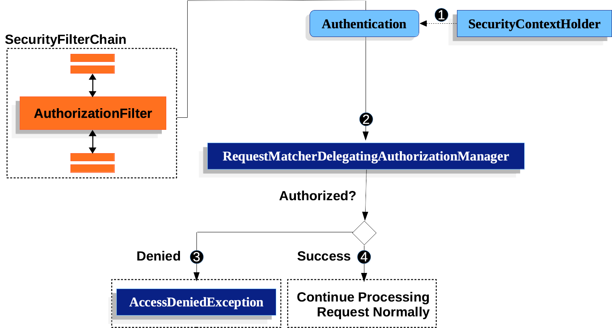

# 授权 httpServletRequests with AuthorizationFilter
这部分基于Servlet 架构和实现 - 通过深层的挖掘 授权是在基于Servlet的应用中是如何工作的 ...
> AuthorizationFilter 替代了 FilterSecurityInterceptor .. 为了保持向后兼容,FilterSecurityInterceptor仍然默认包含 ..
> 这部分讨论AuthorizationFilter 工作以及如何覆盖默认配置 ..

AuthorizationFilter 提供了对HttpServletRequest的授权, 它插入了一个FilterChainProxy 作为Security Filter其中之一 ..

你能够覆盖默认配置,通过声明一个SecurityFilterChain,替代authorizeRequests ,如何使用:
```java
@Bean
SecurityFilterChain web(HttpSecurity http) throws AuthenticationException {
    http
        .authorizeHttpRequests((authorize) -> authorize
            .anyRequest().authenticated();
        )
        // ...

    return http.build();
}
```
这种方式将优化以下几个方面:
1. 使用简化的AuthorizationManager api 替代元数据资源,配置属性 以及 decision mangers 以及 投票者 . 这能够简化复用和自定义 ..
2. 延迟Authentication 查询,取代了针对每个请求去查询authentication, 改变为仅仅在请求 -当一个授权决定需要认证时 ..
3. 基于bean 的配置支持

当`authorizeHttpRequests` 被使用替代 `authorizeRequests`, 然后AuthorizationFilter 将被用来替代 `FilterSecurityInterceptor` ..



此流程很简单:
1. AuthorizationFilter 将从SecurityContextHolder 中获取一个Authentication,它包装这个动作到Supplier 为了延迟查询 ..
2. 第二,它传递这个Supplier 以及 HttpServletRequest 到 AuthorizationManager ..
   1. 如果授权失败,一个 AccessDeniedException 抛出,在这种情况下 ExceptionTranslationFilter 将处理AccessDeniedException ..
   2. 如果授权成功,那么AuthorizationFilter 将继续执行FilterChain,允许应用正常处理 ..

我们能够配置Spring Security 包含多种不同的规则 - 通过增加多个规则以有序的优先级 ..

```java
@Bean
SecurityFilterChain web(HttpSecurity http) throws Exception {
	http
		// ...
		.authorizeHttpRequests(authorize -> authorize
			.requestMatchers("/resources/**", "/signup", "/about").permitAll()
			.requestMatchers("/admin/**").hasRole("ADMIN")
			.requestMatchers("/db/**").access(new WebExpressionAuthorizationManager("hasRole('ADMIN') and hasRole('DBA')"))
			// .requestMatchers("/db/**").access(AuthorizationManagers.allOf(AuthorityAuthorizationManager.hasRole("ADMIN"), AuthorityAuthorizationManager.hasRole("DBA")))
			.anyRequest().denyAll()
		);

	return http.build();
}
```
这里包含了各种授权规则,每一个规则根据它们声明的顺序有序 ..
例如这里的hasRole方法,不需要添加Role_前缀,因为会自动添加 ..

还使用自定义AuthorizationManager,例如WebExpression 组合授权管理器 ..

任何没有匹配的url则考虑为访问拒绝,这是一个好的策略(如果你不想要意外的忘记更新你的授权规则) ..

你能够采取一个基于 bean 的方式 - 通过构建你自己的 RequestMatcherDelegatingAuthorizationManager:

```java
@Bean
SecurityFilterChain web(HttpSecurity http, AuthorizationManager<RequestAuthorizationContext> access)
        throws AuthenticationException {
    http
        .authorizeHttpRequests((authorize) -> authorize
            .anyRequest().access(access)
        )
        // ...

    return http.build();
}

@Bean
AuthorizationManager<RequestAuthorizationContext> requestMatcherAuthorizationManager(HandlerMappingIntrospector introspector) {
    MvcRequestMatcher.Builder mvcMatcherBuilder = new MvcRequestMatcher.Builder(introspector);
    RequestMatcher permitAll =
            new AndRequestMatcher(
                    mvcMatcherBuilder.pattern("/resources/**"),
                    mvcMatcherBuilder.pattern("/signup"),
                    mvcMatcherBuilder.pattern("/about"));
    RequestMatcher admin = mvcMatcherBuilder.pattern("/admin/**");
    RequestMatcher db = mvcMatcherBuilder.pattern("/db/**");
    RequestMatcher any = AnyRequestMatcher.INSTANCE;
    AuthorizationManager<HttpServletRequest> manager = RequestMatcherDelegatingAuthorizationManager.builder()
            .add(permitAll, (context) -> new AuthorizationDecision(true))
            .add(admin, AuthorityAuthorizationManager.hasRole("ADMIN"))
            .add(db, AuthorityAuthorizationManager.hasRole("DBA"))
            .add(any, new AuthenticatedAuthorizationManager())
            .build();
    return (context) -> manager.check(context.getRequest());
}
```
本质上 AuthorizationFilter 授权 HttpServletRequests 基于RequestMatcherDelegatingAuthorizationManager ..

我们也能够为一个任意的请求匹配器 关联自定义的授权管理器:
映射`my/authorized/endpoint`  到一个自定义的授权管理器:
```java
@Bean
SecurityFilterChain web(HttpSecurity http) throws Exception {
    http
        .authorizeHttpRequests((authorize) -> authorize
            .requestMatchers("/my/authorized/endpoint").access(new CustomAuthorizationManager());
        )
        // ...

    return http.build();
}
```
或者全部自定义管理
```java
@Bean
SecurityFilterChain web(HttpSecurity http) throws Exception {
    http
        .authorizeHttpRequests((authorize) -> authorize
            .anyRequest().access(new CustomAuthorizationManager());
        )
        // ...

    return http.build();
}
```
默认 AuthorizationFilter 将会应用到所有派发器类型上 .. 我们能够配置spring security 不应用授权规则到所有派发类型 - 通过使用 `shouldFilterAllDispatcherTypes`方法
设置即可 .
```java
@Bean
SecurityFilterChain web(HttpSecurity http) throws Exception {
    http
        .authorizeHttpRequests((authorize) -> authorize
            .shouldFilterAllDispatcherTypes(false)
            .anyRequest().authenticated()
        )
        // ...

    return http.build();
}
```
但是更推荐的方式是自定义需要应用的派发器类型,例如,你也许想要授予所有使用了ASYNC / FORWARD 的派发器类型的请求访问 .

```java
@Bean
SecurityFilterChain web(HttpSecurity http) throws Exception {
    http
        .authorizeHttpRequests((authorize) -> authorize
            .dispatcherTypeMatchers(DispatcherType.ASYNC, DispatcherType.FORWARD).permitAll()
            .anyRequest().authenticated()
        )
        // ...

    return http.build();
}
```
我们还可以做得更多,例如指定访问规则:
```java
@Bean
SecurityFilterChain web(HttpSecurity http) throws Exception {
    http
        .authorizeHttpRequests((authorize) -> authorize
            .dispatcherTypeMatchers(DispatcherType.ERROR).hasRole("ADMIN")
            .anyRequest().authenticated()
        )
        // ...

    return http.build();
}
```

## 请求匹配器
此RequestMatcher 通常用来决定是否请求匹配某个规则,我们使用securityMatchers来决定给定的HttpSecurity 应该应用到给定的请求上 ..

也就是说在一个系统中通常可以存在多个HttpSecurity,针对不同的请求 ..

相同的方式,我们能够使用 requestMatchers 来决定授权规则是否应用到给定的请求上 ..

那么一般应用中存在一个HttpSecurity 就足够 ..

以下将尝试配置requestMatchers来决定是否应用授权
```java
@Configuration
@EnableWebSecurity
public class SecurityConfig {

	@Bean
	public SecurityFilterChain securityFilterChain(HttpSecurity http) throws Exception {
		http
			.securityMatcher("/api/**")
			.authorizeHttpRequests(authorize -> authorize
				.requestMatchers("/user/**").hasRole("USER")
				.requestMatchers("/admin/**").hasRole("ADMIN")
				.anyRequest().authenticated()
			)
			.formLogin(withDefaults());
		return http.build();
	}
}
```
The securityMatcher(s) and requestMatcher(s) methods 将会决定一种最适合应用的 RequestMatcher 实现 ..

如果spring mvc存在类路径上,那么 MvcRequestMatcher 将使用,否则 使用AntPathRequestMatcher ..

如果你想要使用一个特定的RequestMatcher,仅仅传递对应实现给这些方法即可 ..
```java
import static org.springframework.security.web.util.matcher.AntPathRequestMatcher.antMatcher; (1)
import static org.springframework.security.web.util.matcher.RegexRequestMatcher.regexMatcher;

@Configuration
@EnableWebSecurity
public class SecurityConfig {

	@Bean
	public SecurityFilterChain securityFilterChain(HttpSecurity http) throws Exception {
		http
			.securityMatcher(antMatcher("/api/**"))                              (2)
			.authorizeHttpRequests(authorize -> authorize
				.requestMatchers(antMatcher("/user/**")).hasRole("USER")         (3)
				.requestMatchers(regexMatcher("/admin/.*")).hasRole("ADMIN")     (4)
				.requestMatchers(new MyCustomRequestMatcher()).hasRole("SUPERVISOR")     (5)
				.anyRequest().authenticated()
			)
			.formLogin(withDefaults());
		return http.build();
	}
}

public class MyCustomRequestMatcher implements RequestMatcher {

    @Override
    public boolean matches(HttpServletRequest request) {
        // ...
    }
}
```
## 表达式
推荐的方式使用类型安全的授权管理器替代 SpEL .. 然而,WebExpressionAuthorizationManager 能够帮助去迁移遗留的Spel ..

为了使用这个管理器,你能够构建一个以下表达式(如果你想要尝试迁移),例如:
```java
.requestMatchers("/test/**").access(new WebExpressionAuthorizationManager("hasRole('ADMIN') && hasRole('USER')"))
```
如果你引用一个bean在表达式中: `@webSecurity.check(authentication, request)`,推荐的方式是直接bean 调用来替代,这看起来如下:
```java
.requestMatchers("/test/**").access((authentication, context) ->
    new AuthorizationDecision(webSecurity.check(authentication.get(), context.getRequest())))
```
对于复杂指令(包括bean应用 以及其他表达式), 推荐使用AuthorizationManager 进行自定义实现 - 并通过`access(AuthorizaitonManager)` 来配置 ..

如果你不能够这样做,那么你能够配置一个 `DefaultHttpSecurityExpressionHandler` - 使用bean 解析器 并将它应用到 WebExpressionAuthorizationManager#setExpressionhandler上 ..

这样,则让你自己处理表达式 .. 通过 ExpressionHandler 进行处理 ..