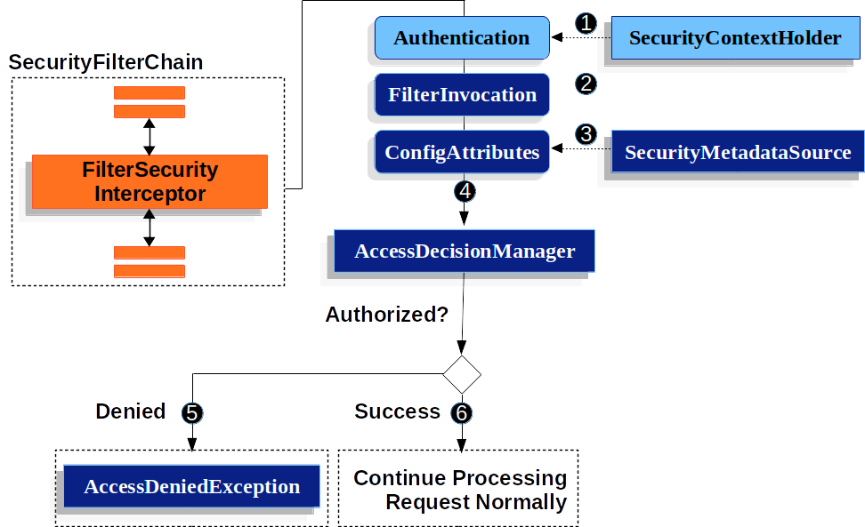

# FilterSecurityInterceptor
> 注意的是,此拦截器正在由AuthorizationFilter替换的过程中 .. 考虑替代 .

此部分基于Servlet architecture 架构和实现  ..

此拦截器提供了对HttpServletRequest实例的授权, 它将插入到FilterChainProxy中作为一个Security Filter ..

以下展示 FilterSecurityInterceptor的角色:


和AuthorizationFilter最大的不同是需要基于SecurityMetadataSource 去尝试 获取ConfigAttributes ..

最终交给AccessDecisionManager ...
1. FilterSecurityInterceptor 从SecurityContextHolder 获取一个 Authentication
2. FilterSecurityInterceptor 从httpServletRequest中创建一个 FilterInvocation
3. 传递 FilterInvocation 到SecurityMetadataSource 去获取 ConfigAttributes  ..
4. 然后传递Authentication / FilterInvocation,以及ConfigAttributes 到 AccessDecisionManager ..
5. 如果授权拒绝,则抛出AccessDeniedException .. 
6. 最终ExceptionTranslationFilter 处理访问拒绝异常 ..

默认情况,spring要求所有请求都需要被认证 ...  以下列出了显式配置
```java
@Bean
public SecurityFilterChain filterChain(HttpSecurity http) throws Exception {
	http
		// ...
		.authorizeRequests(authorize -> authorize
			.anyRequest().authenticated()
		);
	return http.build();
}
```
配置方式和AuthorizationHttpRequests() 差别不是很大
```java
@Bean
public SecurityFilterChain filterChain(HttpSecurity http) throws Exception {
	http
		// ...
		.authorizeRequests(authorize -> authorize
			.requestMatchers("/resources/**", "/signup", "/about").permitAll()
			.requestMatchers("/admin/**").hasRole("ADMIN")
			.requestMatchers("/db/**").access("hasRole('ADMIN') and hasRole('DBA')")
			.anyRequest().denyAll()
		);
	return http.build();
}
```

## Configure FilterSecurityInterceptor with Dispatcher Types
默认情况FilterSecurityInterceptor将使用到每一个请求上,这意味着如果一个请求从一个已经过滤的请求上派发,此拦截器将在派发的请求上执行相同的授权请求 ..
在某些场景上,你也许不想要应用授权(在某些派发器类型上) ...
```java
@Bean
SecurityFilterChain web(HttpSecurity http) throws Exception {
    http
        .authorizeRequests((authorize) -> authorize
            .dispatcherTypeMatchers(DispatcherType.ASYNC, DispatcherType.ERROR).permitAll()
            .anyRequest.authenticated()
        )
        // ...

    return http.build();
}
```
或者xml
```java
<http auto-config="true">
    <intercept-url request-matcher-ref="dispatcherTypeMatcher" access="permitAll" />
    <intercept-url pattern="/**" access="authenticated"/>
</http>

<b:bean id="dispatcherTypeMatcher" class="org.springframework.security.web.util.matcher.DispatcherTypeRequestMatcher">
    <b:constructor-arg value="ASYNC"/>
    <b:constructor-arg value="ERROR"/>
</b:bean>
```