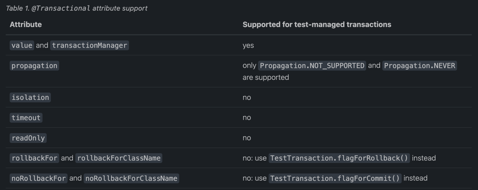

# spring 对集成测试的支持 以及对单元测试的最佳实践
spring 团队提倡测试驱动开发(TDD), spring 团队将控制反转使用在单元测试或者集成测试上让测试更加容易(通过预设某些setter 方法 以及在类上使用合适的构造器使得它们更容易在测试中
相互关联 而无需配置服务定位器注册比奥以及类似的结构 ...

# 1. spring 测试介绍
测试是企业级软件开发的不可分割的一部分,通过ioc原理增加的数据到单元测试以及spring框架对集成测试的支持好处 ..

# 2. 单元测试
构成应用程序的pojo能够通过JUnit或者TestNG测试,只需要通过new 操作符实例化,而无需spring 或者任何其他的容器.. 通过使用mock 对象(通过结合其他有价值的测试技术)去进行隔离测试 ..
如果遵循spring的架构推荐,那么将导致你的代码组件化以及更加清晰的层次 促进单元测试更加容易 ..
举个例子,你能够通过填充或者吗模拟dao 或者仓库结构来测试服务层对象,无需在单元测试期间访问持久化数据 。。。

单元测试通常运行非常的快,因此这里不需要配置任何运行时基础设施.. 强调真正的单元测试作为开发方法的一部分可以提高您的生产力.
你也许不需要这一部分去帮助你编写高效的单元测试(对于你的基于ioc的应用) .. 对于某些单元测试场景,spring 框架提供了mock 对象以及 测试支持类,了解它们并使用 ..

## mock 对象
spring 包括了大量的包 - 针对于mock
1. environment
2. jndi
3. servlet api
4. spring web reactive
### 环境
org.springframework.mock.env包 包含了有关Environment 以及 PropertySource mock实现的抽象..  MockEnvironment 以及 MockPropertySource对于依赖于指定环境属性的
容器外的测试开发来说非常有用 ..
### JNDI
org.springframework.mock.jndi 包包含了jndi spi的一部分实现, 你能够用来为测试套件配置简单的jndi 环境或者标准单机应用中配置jndi环境 .. 例如jdbc DataSource 实例在测试代码中
使用相同的 jndi名称绑定到jndi环境 - 如同它们在Jakarta EE容器中一样 .. 你能够重用应用代码以及配置到测试场景中而无需修改 ..
> 这个jndi的mock支持从spring 5.2开始不推荐,更推荐完整的第三方库解决方案([simple-jndi](https://github.com/h-thurow/Simple-JNDI))

### Servlet api
org.springframework.mock.web包包含了广泛的Servlet api mock 对象集合 - 能够测试 web 上下文,controllers 以及 filters ... 这些mock对象目的是与Spring web mvc 框架使用,
相比于动态mock对象来说更加方便(例如 [EasyMock](https://easymock.org/) 或者 其他的Servlet api mock 对象(例如 [MockObjects](http://www.mockobjects.com/))
> 从spring framework 6.0开始,在org.springframework.mock.web包中的mock对象基于Servlet 6.0 api ...

spring mvc 测试框架基于mock Servlet api 对象提供了对spring mvc的集成测试(查看[MockMvc](https://docs.spring.io/spring-framework/docs/current/reference/html/testing.html#spring-mvc-test-framework))

### spring web reactive
org.springframework.mock.http.server.reactive包包含了在WebFlux应用中使用的ServerHttpRequest以及 ServerHttpResponse的mock 实现. 
org.springframework.mock.web.server包包含了一个 mock ServerWebExchange(依赖于mock 请求和响应对象)..

同时MockServerHttpRequest 以及 MockServerHttpResponse 同时继承相同的抽象基类(作为server特定的实现)并且在它们之间共享行为 ..
举个例子,mock 请求是不可变的 - 一旦创建,但是你可以从ServerHttpRequest中调用mutate()方法取创建一个可以修改的实例 ..
为了mock 响应取正确的实现写约定 并且返回一个写完成句柄(也就是Mono<Void>),它默认使用具有cache().then()的Flux,这会缓存数据并使它在测试中能够
进行可用进行断言 .. 应用能够设置一个自定义的写函数(例如,为了测试一个无穷流)..
[WebTestClient](https://docs.spring.io/spring-framework/docs/current/reference/html/testing.html#webtestclient) 基于mock 请求
以及响应去提供webflux 应用的测试而无需http 服务器. 客户端还可以用于对正在运行的服务器进行端到端测试。

## 单元测试支持的类
spring 包含了大量的类能够帮助进行单元测试,它们分为两类
1. 通用测试工具
2. spring mvc 测试工具

### 通用测试工具集合
org.springframework.test.util 包包含了各种常见目的的工具类可以在单元测试或者集成测试中使用 .
- AopTestUtils 是aop相关的工具方法集合,可以用来隐藏在一层或者多层Spring代理上获取对底层最终目标对象. 例如如果你有一个配置的bean 作为动态mock  - 通过
使用例如EasyMock 或者Mockito, 并且它被Spring proxy 包装了,你也许需要直接访问底层的mock去在它之上配置期望并执行校验,对于Spring核心的Aop 工具类,查看AopUtils 以及 AopProxyUtils ..
ReflectionTestUtils 是基于反射的工具方法集合, 你能够在测试场景中使用 ,去改变一个常量的值,设置一个非public字段,执行一个非public setter方法,或者执行一个非public配置或者生命周期回调,
当你的测试代码有如下使用情况下:
  - orm 框架(例如jpa / hibernate) 纵容private / protected 字段访问 -对应域实体中的属性的public setter方法 ..
  - spring对注解的支持(例如各种依赖注入注解), 提供对private / protect字段 / setter方法 / 配置方法的依赖注入..
  - 使用例如@PostConstruct 以及 @PreDestroy 进行生命周期回调方法标识 ..
TestSocketUtils 是一个简单的工具类能够发现本地上可用的TCP端口(为了在集成测试场景中使用)
  > TestSocketUtils 能够在集成测试中使用-例如在随机可用端口上启动外部服务器的场景 .. 然而这些工具并不能保证给定端口的后续可用性,因此它是不可信任的 .. 替代TestSocketUtils
  > 去为服务器发现一个可用的本地端口,更推荐的方式是依赖于服务器的能力去在随机临时可用的端口上启动(根据它的选择或者由操作系统分配), 为了和此服务器交互,你应该查询当前服务器使用的端口 ..

### spring mvc 测试工具类
org.springframework.test.web 包包含了ModelAndViewAssert, 能够与JUnit,TestNG以及其他测试框架合并使用在单元测试中 - 处理spring mvc ModelAndView 对象 ..
> 单元测试spring mvc Controllers
> 为了测试作为pojo的spring mvc Controller, 使用 ModelAndViewAssert 连同 MockHttpServletRequest 以及 MockHttpSession,以及其他来自spring Servlet api mocks的类 ..
> 要结合 Spring MVC 的 WebApplicationContext 配置对 Spring MVC 和 REST Controller 类进行全面的集成测试，请改用[Spring mvc Test]框架替代 ..


# 3. 集成测试
主要是能够执行某些集成测试而不需要部署到应用服务器或者连接到其他企业级基础设施上 ..
1. 正确的关联到你的Spring Ioc容器上下文
2. 使用JDBC或者ORM工具进行数据访问,包括SQL语句的正确性,Hibernate查询,JPA Entity映射以及其他 ..
3. 对于Spring集成测试支持包含了以下方面：
   * jdbc 测试支持
   * spring 测试上下文支持
   * webTestClient
   * MockMvc
   * Testing Client Applications
   * Annotations

## 3.1 集成测试的目标是
1. 管理测试之间的Spring Ioc容器缓存 ..
2. 提供test装置实例的依赖注入
3. 提供对集成测试合适的事务管理
4. 提供了Spring特定的基类(帮助开发者编写集成测试) ..

### 3.1.1 上下文管理以及缓存
spring 测试上下文框架提供了一致的spring应用上下文加载 以及 webApplicationContext(且包含其他上下文的缓存) ...
上下文缓存很重要. \
主要是启动时间是一个大的问题,不是因为Spring本身的消耗,是因为由spring容器花时间实例化的对象 ..
例如,50 - 100个hibernate 映射文件的项目可能需要花10 - 20 秒加载映射文件,这会增加每一次运行的测试的时间(这会导致
整个集成测试更慢，减少开发者的效率) ... \
测试类通常声明要么一个xml 资源路径数组/ groovy配置元数据（通常是类路径) .. 这些东西用来配置应用上下文..
默认来说一旦加载，配置的应用上下文将会对测试重用,这样仅仅每一个测试套件的整体时间会增加一次(因为仅仅是配置消耗）,后续的测试执行将会更快,
这里的测试套件指的是运行在相同jvm中的所有测试 ... 例如来自ant / maven / gradle构建的所有测试(为给定项目或者模块运行的) ... \
非这种情况（例如需要应用上下文重载等测试可能需要在下一次测试之前进行应用上下文重构建 以及配置的刷新)..
这种情况无能为力 ..(无法加速测试时间)

### 3.1.2 测试装置的依赖注入
也就是spring 框架提供给我们的依赖注入

###  3.1.3 事务管理
默认回滚,但是你可以提供注解改变事务提交策略 ..(@Commit) ...
事务管理,注意: 仅仅支持 PlatformTransactionManager,也就是非响应式的事务管理器 ..
如果使用React类型的,没有任何效果 ...
一个事务性测试方法将会在测试方法执行完毕之后默认进行回滚,但是你可以通过Commit 进行事务提交...

### 3.1.4 集成测试支持的类
spring TestContext 框架提供了各种抽象支持类能够简化集成测试的编写.. 这些基础测试类提供了已知的回调到测试框架,同样包括方便的实例变量
以及方法,这让你能够访问:
- ctx,应用上下文
- JdbcTemplate 执行sql 查询数据, ....
除此之外,你可以创建你自己的自定义的,应用世界的超类 - 包含实例变量和方法 - 特定于你的项目的实现 ..
支持类如下所述[support class](./spring-context-framework.md#512-)


## 4. jdbc 测试支持
### 4.1 JdbcTestUtils
包含了简化标准的数据库测试场景的工具方法,特别是,JdbcTestUtils 提供了以下的静态工具方法 ..
详情查看 javadoc ..
- countRowsInTable(..)
- countRowsInTableWhere(..)
- delete...

AbstractTransactionalJUnit4SpringContextTests 以及 AbstractTransactionalTestNGSpringContextTests 提供了各种代理到
JdbcTestUtils方法的方法 ..
### 4.2  内嵌数据库
spring-jdbc模块提供了配置和启动一个内嵌的数据库 .. 这能够在集成测试中进行数据库交互 ...
查看[内嵌数据库支持](../core/new/data.access/dao-support.md#394-)  以及与内嵌数据进行测试数据访问逻辑  详情了解 ..


## 5. Spring TCF(testContext framework)
这个框架主要提供了通用，注解驱动单元 以及集成测试支持(无感知测试框架) .. 并且非常重视约定大于配置,包含了
许多默认值能够让你通过基于注解的配置进行覆盖 .. \
除了通用的测试基础设施,TCF同样提供了对JUnit4,JUnit5 以及 TestNG的隐式支持.. Spring提供了抽象支持类 .. \
因此Spring提供了一个自定义的Junit Runner 以及 自定义的JUnit Rules - 针对Junit4 并且为JUnit5增加了
自定义的Extension让你能够编写基于 POJO的测试类 .. \
POJO测试类不需                                                                                下                                                        要扩展特定的类体系,例如 abstract 支持类 .. \
根据需要了解相关内容,例如 如果你不对测试框架感兴趣,或者不扩展你自己的监听器 或者自定义loader,我们可以直接了解
如何定义配置并启动集成测试(例如上下文管理，依赖注入，事务管理),支持的类 以及注解支持部分 ..

### 5.1 关键抽象
框架核心由TestContextManager 类和 TestContext ,TestExecutionListener 以及 SmartContextLoader 接口组成 ..\
测试上下文管理器将会为每一个测试类创建(例如,所有JUnit5 的单个测试类的所有测试方法),测试上下文管理器,最终会管理当前测试的\
的上下文(TestContext) ,TestContextManager 同样会更新TestContext的状态（根据测试进度并代理到
TestExecutionListener 实现)这能够检测实际的测试执行 - 通过(依赖注入，管理事务以及其他所提供功能) .. \
一个SmartContextLoader 负责加载一个ApplicationContext - 为给定的测试类加载 .. \
查看javadoc 以及 Spring 测试套件了解更多信息以及各种实现的示例 ...


### 5.1.1 测试上下文
测试上下文封装了当前正在运行测试的上下文(不需要关心使用的实际测试框架)并且提供上下文管理 以及缓存支持(
为它负责的测试实例),这个测试TestContext 同样代理到 SmartContextLoader 去加载一个应用上下文(如果请求) ..
### 5.1.2 测试上下文管理器
这个管理器是一个进入Spring TCF的入口并且它负责管理单个TestContext并且 会触发事件到每一个注册的TestExecutionListener\
在已经定义好的测试执行点 ..
- 在任何特殊测试框架的"before class" / "before all"方法之前
- 测试示例的后置处理
- 在特殊测试框架的"before" / "before each" 之前
- 在测试启动之后且测试方法执行之前
- 测试方法执行之后但是在结束之前
- 在特殊的测试框架的"after" / "after each"的方法之后
- 在任何特殊的测试框架的"after class" / "after all"方法之后

### 5.1.3 TestExecutionListener
这个监听器定义了一些api 用来交互由 TestContextManager发布的的测试执行事件(只要监听器注册到
TestContextManager上)
### 5.1.4 上下文加载器
ContextLoader 是一个策略接口用来加载由Spring 测试上下文框架所管理的 一个集成测试的应用上下文 .. \
你应该实现SmartContextLoader 而不是此接口去提供组件类，激活bean 定义profiles,测试属性资源，\
上下文体系以及WebApplicationContext支持 .. \
SmartContextLoader 是一个ContextLoader接口的扩展 取代原有的最小的ContextLoader SPI..
特别是,一个SmartContextLoader能够选择处理资源位置，组件类，或者上下文初始化器 . \
因此,一个SmartContextLoader 能设置激活的bean definition profiles 以及它所加载的上下文中的测试属性资源(test propertySource)..\

Spring提供了以下的实现:
- DelegatingSmartContextLoader
   默认加载器之一,它內部代理到一个AnnotationConfigContextLoader或者 GenericXmlContextLoader或者GenericGroovyXmlContextLoader \
   依赖于为测试类声明的配置或者默认位置或者默认配置类的呈现情况,Groovy支持仅当Groovy出现在类路径上才启用 ..
- WebDelegatingSmartContextLoader
   默认加载起之一,它內部代理到一个AnnotationConfigWebContextLoader,一个GenericXmlWebContextLoader或者 GenericGroovyXmlWebContextLoader \
   一个web ContextLoader 仅仅当@WebAppConfiguration 出现在配置类上才启用.. Groovy 支持同上 ..
- AnnotationConfigContextLoader
   从组件类中加载一个标准的ApplicationContext ..
- AnnotationConfigWebContextLoader 
   从组件类这能够加载一个WebApplicationContext ...
- GenericGroovyXmlContextLoader
  从资源路径上加载标准的ApplicationContext(要么通过Groovy脚本或者XML配置文件)
- GenericGroovyXmlWebContextLoader
   从.... 记载一个WebApplicationContext ..
- GenericXmlContextLoader
   从xml资源位置上加载标准的应用上下文
- GenericXmlWebContextLoader
   从xml资源位置上加载WebApplicationContext..

## 引导TCF
Spring TestContext Framework 内部的默认配置足以满足所有常见用例。然而,有些时候开发团队或者第三方框架\
可能会改变默认的ContextLoader,实现一个自定义的TestContext或者ContextCache,增加ContextCustomizerFactory\
以及TestExecutionListener实现的默认集合 .. \
对于底层TCF如何操作,Spring提供了引导策略 ..,TestContextBootstrapper 定义了引导TestContext框架的SPI . \
一个TestContextBootstrapper 将会由TestContextManager 使用去加载当前测试的TestExecutionListener 实现 \
并且构建它所管理的TestContext,你能够配置自定义的引导策略(为测试类或者测试类体系) - 通过使用@BootstrapWith或者\
直接或者元注解的形式 ..,如果一个引导器没有显式通过@BootstrapWith 配置,要么 DefaultTestContextBootstrapper或者 
WebTestContextBootstrapper将会被使用,依赖于@WebAppConfiguration的出现 ... \
因此TestContextBootstrapper SPI 可能会在未来发生改变(适应新的需求),我们强烈建议实现者不要直接实现这个接口,相反扩展\
AbstractTestContextBootstrapper 或者它具体的子类之一进行替代 ..

## 5.3 TestExecutionListener 配置
Spring 提供了以下的TestExecutionListener 实现(默认注册的),顺序如下：
- ServletTestExecutionListener 为WebApplicationContext 配置Servlet api .. mock ..
- DirtiesContextBeforeModesTestExecutionListener 
   处理"before" 模式下的@DirtiesContext注解 
- ApplicationEventsTestExecutionListener
   提供对ApplicationEvents 的支持
- DependencyInjectionTestExecutionListener
   提供了测试实例的依赖注入
- DirtiesContextTestExecutionListener
   处理 "after"模式下的 @DirtiesContext 注解
- TransactionalTestExecutionListener
   提供默认回滚语义的事务性测试执行
- SqlScriptsTestExecutionListener
   通过@Sql注解运行配置的SQL 脚本 ..
- EventPublishingTestExecutionListener
   派发测试执行事件到测试的应用上下文中(这里是测试执行事件,不同于应用事件)
### 5.3.1 注册TestExecutionListener 实现
你能够注册TestExecutionListener 实现, 通过@TestExecutionListeners 显式的为一个测试类注册 测试执行监听器 !!! 它的子类以及它的内嵌类也能够
基于相同的方式注册
> 切换到默认的TestExecutionListener 实现
> 如果你扩展了一个类 - 它注释了@TestExcutionListeners 并且你希望切换到使用默认的监听器集合 ..
> 你能够使用以下方式注释你的类

```java
// Switch to default listeners
@TestExecutionListeners(
    listeners = {},
    inheritListeners = false,
    mergeMode = MERGE_WITH_DEFAULTS)
class MyTest extends BaseTest {
    // class body...
}


```
也就是进行合并 !!!!

### 5.3.2 默认的测试执行监听器实现的 自动发现
通过spring spi 实现自动发现,将全局自动配置的 测试执行监听器想要使用到整个测试套件上,那么 \
相比单个测试上添加默认和自定义的测试执行监听器来说要方便的很多 ... 通过SpringFactoriesLoader\
进行TestExecutionListener 发现,通过在META-INF/spring.factories文件中配置即可 ..
### 测试执行监听器的实现顺序
默认通过order注解或者 Ordered接口 ...

### 默认的和自定义测试执行器的合并
通过为@TestExecutionListeners的属性MergeMode.MERGE_WITH_DEFAULT 和默认的监听器进行合并 .. \
```java
@ContextConfiguration
@TestExecutionListeners(
    listeners = MyCustomTestExecutionListener.class,
    mergeMode = MERGE_WITH_DEFAULTS
)
class MyTest {
    // class body...
}
```
如果order 值更小,那么则排序将放置测试执行监听器到前面 !!!
## 5.4 应用事件
从spring framework5.3.3开始,TestContext框架支持记录 - 发布在applicationContext中的应用事件,
这样就能够根据在测试中断言某些事件 .. 在单个测试中的所有发布的事件能够有效的通过ApplicationEvents \
Api 获取(你能够像java.util.Stream)那样处理 .. \
为了在测试中使用ApplicationEvents ..,我们应该这样做:
1. 确保你的测试类式通过@RecordApplicationEvents注解或者元注解 ..
2. 确保ApplicationEventsTestExecutionListener 已经注册,注意到,这个监听器默认已经注册,但是有些情况
   你需要手动注册(例如你没有注册默认的测试监听器 ..)
3. 通过@Autowired 注解ApplicationEvents 类型的字段 并且在测试中或者生命周期方法使用它(
  例如JUnit5中的@BeforeEach / @AfterEach方法)
   - 当使用针对与Junit5的Spring 扩展时 - SpringExtension,你也许可以在测试中或者生命周期方法中声明一个ApplicationEvents类型的参数,又或者进行依赖注入 ..
   - 这里本质上就是因为junit5 扩展增强更进一步,相比于进行测试类的字段注入,能够进行各种方法注入 - 核心是通过ParameterDiscover 进行处理 !!!
   - 对于junit4.13版本以上,是通过规则 / 或者 runner 实现 依赖注入处理..
   
以下的测试类使用了JUnit5的SpringExtension 并使用AssertJ去断言已经发布事件的类型断言(当执行一个Spring管理的组件的方法时 ..)
```java
@SpringJUnitConfig(/* ... */)
@RecordApplicationEvents 
class OrderServiceTests {

    @Autowired
    OrderService orderService;

    @Autowired
    ApplicationEvents events; 

    @Test
    void submitOrder() {
        // Invoke method in OrderService that publishes an event
        orderService.submitOrder(new Order(/* ... */));
        // Verify that an OrderSubmitted event was published
        long numEvents = events.stream(OrderSubmitted.class).count(); 
        assertThat(numEvents).isEqualTo(1);
    }
}
```
这个示例很简单,能够了解执行的方法中发布了多少个这种类型的应用事件 ..

## 5.5 测试执行事件
EventPublishingTestExecutionListener 从spring 5.2开始引入去提供一种额外的方式去替代实现自定义的 \
TestExecutionListener.. 在测试的ApplicationContext的组件能够监听以下由EventPublishingTestExecutionListener发布的事件 ..
- BeforeTestClassEvent
- PrepareTestInstanceEvent
- BeforeTestMethodEvent
- BeforeTestExecutionEvent
- AfterTestExecutionEvent
- AfterTestMethodEvent
- AfterTestClassEvent

这些事件能够被各种原因进行消费，例如重设mock beans 或者 跟踪测试执行 .. 消费测试执行事件的一个好处是相比 \
实现一个自定义的TestExecutionListener来说,测试执行事件能够被当前测试中的ApplicationContext中的任何Spring bean \
进行消费,并且这样的bean能够直接从依赖注入中收益或者ApplicationContext的其他特性收益 ..,作为对比,一个TestExecutionListener
将不是一个ApplicationContext中的bean ...
> 这个EventPublishingTestExecutionListener默认已经被注册,但是仅仅在应用上下文已经加载之后才会发布事件 .. \
> 之前加载的应用上下文将没有任何用处 ..
> 因此,BeforeTestClassEvent 将不会发布-直到ApplicationContext 已经被其他的TestExecutionListener 加载 ..
> 举个例子,默认的 TestExecutionListener 实现集合是注册的,一个BeforeTestClassEvent将不会发布(如果第一个测试类使用了特殊的测试ApplicationContext) \
> 但是一个BeforeTestClassEvent 将会在后续的相同测试套件中的测试类中发布(如果使用相同的测试应用上下文，因为上下文已经加载 - 当后续的测试类运行的时候,而第一个测试类它由于加载应用上下文则无法享受到这个好处..) \
> -- 并且只要上下文没有从ContextCache中移除(通过@DirtiesContext 或者 最大尺寸 抛弃策略移除) ..
> 如果你想要确保BeforeTestClassEvent总是针对每一个测试类都需要进行发布,你也许可以注册一个 TestExecutionListener 去在beforeTestClass回调中加载ApplicationContext .. \
> 并且此监听器必须注册在 EventPublishingTestExecutionListener 之前..
> 并且类似的,@DirtiesContext 被用来从上下文缓存中移除ApplicationContext(当给定测试类中的最近的测试方法执行完毕) \
> AfterTestClassEvent 那么将不会为这个测试类派发此事件(因为只有被加载的上下文才能够进行事件派发) ..
> 此时应用上下文已经被移除 !!!

为了监听测试执行事件, Spring bean 可以选择实现 ApplicationListener接口,除此之外,监听器方法能够通过@EventListener注册并且 \
配置去监听一个或者多个事件类型... 由于这种方式很方便,以下注解增加了@EventListener注解作为元注解 .. 简化测试执行事件监听器的注解 ..
@BeforeTestClass

@PrepareTestInstance

@BeforeTestMethod

@BeforeTestExecution

@AfterTestExecution

@AfterTestMethod

@AfterTestClass

## 异常处理
默认情况,当一个测试执行事件监听器消费事件的时候抛出异常会导致传播到底层的测试框架,如果是同步的,没有任何问题,但是
如果是一个异步的执行事件监听器抛出了异常,那么这个异常将不会传递给底层的测试框架 ... 
本质上是因为异步异常处理,异步栈可能执行不是当前线程 !!!

### 5.5.2 异步监听器
很简单，只需要通过@Async 注解支持就可以 !!!
本质上,异步注解就是将方法操作包装 - 通过异步栈执行,但是目标对象的声明的对应方法最终只会返回传递值的future - 如果有返回值 !!!
但是由于是异步,也就意味着 返回值必须是异步包装类型 而不是普通类型,详情查看 @Async 方法注释 !!!

## 5.6 上下文管理
TestContext 负责提供上下文管理 以及对测试实例的缓存支持 !!!
测试示例默认没有自动具有对配置的ApplicationContext的访问 !!!如果测试类实现了ApplicationContextAware 接口,那么将会自动注入应用上下文到测试实例中 ..
注意到spring提供了各种方便与SpringContext结合使用的类 ... 但是这些是特定于spring的类，也就是会和spring 耦合，如果你不喜欢编写基于spring的测试类 或者为你的测试类
添加Test Context Framework 支持，那么就是使用前者...  并且这些特定的类都实现了ApplicationContextAware接口，提供了对ApplicationContext的自动访问 !!
> 或者基于依赖注入 注入应用上下文
> 可以作为实现ApplicationContextAware的替代 ... 如下
> ```java
> @SpringJUnitConfig
> class MyTest {
>
>    @Autowired 
>    ApplicationContext applicationContext;
>
>    // class body...
> }
> ```

同时这个能力是通过 DependencyInjectionTestExecutionListener提供的 ... 这些是默认配置的 ...
> 测试类使用testContext 框架能力不需要扩展任何类或者实现任何接口去配置它们的应用上下文 ...
> 通过设置@ContextConfiguration即可 ...如果没有显式指定应用上下文的资源位置或者组件类. 那么
> 配置的ContextLoader 将决定如何从默认位置加载上下文 或者从默认配置类加载上下文...  除了上下文
> 资源位置以及组件类，一个应用上下文可以通过应用上下文初始化器配置 !!!
> 除此之外可以通过实现并配置自定义的SmartContextLoader 进行高级使用 !!!

[spring application context configuration](https://docs.spring.io/spring-framework/docs/current/reference/html/testing.html#testcontext-ctx-management-xml)
这里存在各种配置方式 ...
### 5.6.6 上下文配置继承
@ContextConfiguration supports boolean inheritLocations and inheritInitializers attributes that denote whether resource locations or component classes and context initializers declared by superclasses should be inherited.
默认是true,也就是默认继承 ..
```java
@ExtendWith(SpringExtension.class)
// ApplicationContext will be loaded from "/base-config.xml"
// in the root of the classpath
@ContextConfiguration("/base-config.xml") 
class BaseTest {
    // class body...
}

// ApplicationContext will be loaded from "/base-config.xml" and
// "/extended-config.xml" in the root of the classpath
@ContextConfiguration("/extended-config.xml") 
class ExtendedTest extends BaseTest {
    // class body...
}
```
如果子类作为其他的类的父类同样可以进行指定的配置继承选项配置 !!!
通用,也支持增加初始化器 配置应用上下文,初始化器可以使用@Order注解进行 执行顺序排序 ..
### 5.6.7 profiles active
You can use @ActiveProfiles with any implementation of the SmartContextLoader SPI, but @ActiveProfiles is not supported with implementations of the older ContextLoader SPI.
```java
<!-- app-config.xml -->
<beans xmlns="http://www.springframework.org/schema/beans"
    xmlns:xsi="http://www.w3.org/2001/XMLSchema-instance"
    xmlns:jdbc="http://www.springframework.org/schema/jdbc"
    xmlns:jee="http://www.springframework.org/schema/jee"
    xsi:schemaLocation="...">

    <bean id="transferService"
            class="com.bank.service.internal.DefaultTransferService">
        <constructor-arg ref="accountRepository"/>
        <constructor-arg ref="feePolicy"/>
    </bean>

    <bean id="accountRepository"
            class="com.bank.repository.internal.JdbcAccountRepository">
        <constructor-arg ref="dataSource"/>
    </bean>

    <bean id="feePolicy"
        class="com.bank.service.internal.ZeroFeePolicy"/>

    <beans profile="dev">
        <jdbc:embedded-database id="dataSource">
            <jdbc:script
                location="classpath:com/bank/config/sql/schema.sql"/>
            <jdbc:script
                location="classpath:com/bank/config/sql/test-data.sql"/>
        </jdbc:embedded-database>
    </beans>

    <beans profile="production">
        <jee:jndi-lookup id="dataSource" jndi-name="java:comp/env/jdbc/datasource"/>
    </beans>

    <beans profile="default">
        <jdbc:embedded-database id="dataSource">
            <jdbc:script
                location="classpath:com/bank/config/sql/schema.sql"/>
        </jdbc:embedded-database>
    </beans>

</beans>

```
从上面其中某一个方面进行激活 ..
```java
@ExtendWith(SpringExtension.class)
// ApplicationContext will be loaded from "classpath:/app-config.xml"
@ContextConfiguration("/app-config.xml")
@ActiveProfiles("dev")
class TransferServiceTest {

    @Autowired
    TransferService transferService;

    @Test
    void testTransferService() {
        // test the transferService
    }
}


```
并且此注解也支持配置继承 ..可以通过inheritProfiles属性进行禁用 ...
It is sometimes useful to assign beans to a default profile. Beans within the default profile are included only when no other profile is specifically activated. You can use this to define “fallback” beans to be used in the application’s default state. For example, you may explicitly provide a data source for dev and production profiles, but define an in-memory data source as a default when neither of these is active.

```java
@Configuration
@Profile("dev")
public class StandaloneDataConfig {

    @Bean
    public DataSource dataSource() {
        return new EmbeddedDatabaseBuilder()
            .setType(EmbeddedDatabaseType.HSQL)
            .addScript("classpath:com/bank/config/sql/schema.sql")
            .addScript("classpath:com/bank/config/sql/test-data.sql")
            .build();
    }
}


```
```java
@Configuration
@Profile("production")
public class JndiDataConfig {

    @Bean(destroyMethod="")
    public DataSource dataSource() throws Exception {
        Context ctx = new InitialContext();
        return (DataSource) ctx.lookup("java:comp/env/jdbc/datasource");
    }
}


```
```java
@Configuration
@Profile("production")
public class JndiDataConfig {

    @Bean(destroyMethod="")
    public DataSource dataSource() throws Exception {
        Context ctx = new InitialContext();
        return (DataSource) ctx.lookup("java:comp/env/jdbc/datasource");
    }
}


```
```java
@Configuration
@Profile("default")
public class DefaultDataConfig {

    @Bean
    public DataSource dataSource() {
        return new EmbeddedDatabaseBuilder()
            .setType(EmbeddedDatabaseType.HSQL)
            .addScript("classpath:com/bank/config/sql/schema.sql")
            .build();
    }
}


```
```java
@Configuration
public class TransferServiceConfig {

    @Autowired DataSource dataSource;

    @Bean
    public TransferService transferService() {
        return new DefaultTransferService(accountRepository(), feePolicy());
    }

    @Bean
    public AccountRepository accountRepository() {
        return new JdbcAccountRepository(dataSource);
    }

    @Bean
    public FeePolicy feePolicy() {
        return new ZeroFeePolicy();
    }
}


```
```java
@SpringJUnitConfig({
        TransferServiceConfig.class,
        StandaloneDataConfig.class,
        JndiDataConfig.class,
        DefaultDataConfig.class})
@ActiveProfiles("dev")
class TransferServiceTest {

    @Autowired
    TransferService transferService;

    @Test
    void testTransferService() {
        // test the transferService
    }
}


```
Furthermore, it is sometimes necessary to resolve active profiles for tests programmatically instead of declaratively .for example, based on:

The current operating system.

Whether tests are being run on a continuous integration build server.

The presence of certain environment variables.

The presence of custom class-level annotations.

Other concerns.

To resolve active bean definition profiles programmatically, you can implement a custom ActiveProfilesResolver and register it by using the resolver attribute of @ActiveProfiles. For further information, see the corresponding javadoc. The following example demonstrates how to implement and register a custom OperatingSystemActiveProfilesResolver:
```java
// "dev" profile overridden programmatically via a custom resolver
@ActiveProfiles(
        resolver = OperatingSystemActiveProfilesResolver.class,
        inheritProfiles = false)
class TransferServiceTest extends AbstractIntegrationTest {
    // test body
}

```
```java
public class OperatingSystemActiveProfilesResolver implements ActiveProfilesResolver {

    @Override
    public String[] resolve(Class<?> testClass) {
        String profile = ...;
        // determine the value of profile based on the operating system
        return new String[] {profile};
    }
}
```
### 5.6.8 使用测试属性资源配置上下文
同spring默认的PropertySource注解类似,只是使用@TestPropertySource ...
> @TestPropertySource 能够与任何SmartContextLoader SPI一起使用,但是此注解不支持 更旧的ContextLoader SPI ..
> SmartContextLoader 的实现能够细腻的访问测试资源值 - 通过getPropertySourceLocations() 以及
> getPropertySourceProperties() - 来自MergedContextConfiguration类的方法 ..
#### 声明Test Property Sources
你能够通过TestPropertySource注解的locations / value属性配置测试属性文件!!!
同时支持传统的 以及基于xml的属性文件格式：
```text
"classpath:/com/example/test.properties" or "file:///path/to/file.xml".
```
支持各种资源格式,例如http: / file: 开头或者绝对路径开头的资源路径,但是资源通配符不允许,例如
```text
*/.properties
```
每一个路径必须评估为一个`.properties` 或者 `.xml` 资源 ..
同样内联属性，作为TestPropertySource的properties属性 配置 - key-value语法支持三种:
```text
key=value

key:value

key value
```
以下的示例设置两个内联属性..
```java
@ContextConfiguration
@TestPropertySource(properties = {"timezone = GMT", "port: 4242"}) 
class MyIntegrationTests {
    // class body...
}
```
> spring 5.2开始,此注解是一个可重复注解 ... 意味着后者会覆盖前者 ..
> 当然你可以使用它作为元注解 或者多个组合注解 !!!
> 越靠近测试类的注解优先级更高,例如直接注解呈现相比于TestPropertySource元注解具有更高的优先级 ..
> 也就是说,优先级高的将会覆盖优先级低的 ...

#### 默认属性文件检测
如果此注解声明为一个空注解,也就是没有配置属性值,那么将会根据声明注解的类进行默认的属性文件检测,例如
`com.example.MyTest` 类,它的相关默认的属性文件检测为`classpath:com/example/MyTest.properties`.
如果默认的无法检测,则抛出一个IllegalStateException ...

#### 优先级
在操作系统 / java system properties / 或者通过@PropertySource或者编程式增加的属性 - 测试属性具有更高的优先级 ..
也就是测试属性能够可选的覆盖前面提到的属性源的属性 ... 因此内联的属性具有相比于从资源位置加载的属性具有更高的优先级 ..
然而,通过@DynamicPropertySource 相比于通过@TestPropertySource加载的属性具有更高的优先级 ..
在下一个示例中， 通过/test.properties 定义的任何属性以及 timezone / port属性将会覆盖任何已有属性(包括从
java system properties / 系统环境变量加载的) ..
如果"/test.properties"定义了timezone / port 将会覆盖在@TestPropertySource的properties属性上声明的内联属性 ..
```java
@ContextConfiguration
@TestPropertySource(
    locations = "/test.properties",
    properties = {"timezone = GMT", "port: 4242"}
)
class MyIntegrationTests {
    // class body...
}
```
属性同样支持继承,inheritLocations and inheritProperties 属性可以同时设定来决定是否继承父类加载的属性 ..
默认是继承,那么测试类增加的内联属性以及资源路径将追加到父类声明的相应属性中 .. 也就是形成属性遮盖 ..(自然而然) ..
如果不想继承,则设置为false 即可 .. \
在下一个示例中,BaseTest加载的应用上下文仅仅使用base.properties文件加载作为测试属性源.. 
子类甚至跟多 ..
```java
@TestPropertySource("base.properties")
@ContextConfiguration
class BaseTest {
    // ...
}

@TestPropertySource("extended.properties")
@ContextConfiguration
class ExtendedTest extends BaseTest {
    // ...
}


```
在下一个示例中,BaseTest的应用上下文仅仅加载了一个内联key1属性属性源. ExtendedTest的应用上下文加载了两个内联属性..(key1 /key2属性) ...
这个示例展示了如何通过内联属性在超类和子类中定义属性 ..

### 5.6.9 使用动态属性源进行上下文配置
如spring 5.2.5开始,可以通过@DynamicPropertySource注解 支持动态属性 ..这个注解能够使用在集成测试中 - 如果你需要增加具有动态值的属性到
集成测试加载的应用上下文的Environment的PropertySources中 ..
> 此注解原来是设计去允许基于[TestContainer](https://www.testcontainers.org/)容器的测试的属性能够更容易暴露到Spring的集成测试 ..
> 然而,这个特性能够使用在任何外部形式的资源 - 这些生命周期在测试的应用上下文之外进行维护的情况下 ..

对比TestPropertySource 注解应用到类级别上,此注解必须应用到静态方法上(接收单个DynamicPropertyRegistry参数的) - 这将被用来加载name-value 对
到Environment .. 值是动态的并且通过Supplier提供的 - 当属性解析的时候才会执行 ..
通常方法引用被用来提供值，如下示例中被TestContainer 项目用来在spring 应用上下文之外管理Redis 容器 ..
管理的Redis容器的地址和端口对于测试应用上下文中的组件可用 - 通过redis.host / redis.port属性注入 ..
这些属性能够通过Spring的Environment抽象访问 - 或者直接注入到Spring管理的组件 !! -例如:
@Value("${redis.host}") and @Value("${redis.port}") ..
> 如果在基类中使用@DynamicPropertySource 并且如果发现在子类中方法中失败,因为动态属性在子类之间发生改变 ..
> 也许你需要通过@DirtiesContext注解基类 去确保每一个子类能够获取具有正确动态属性的独立应用上下文 !!!

```java
@SpringJUnitConfig(/* ... */)
@Testcontainers
class ExampleIntegrationTests {

    @Container
    static GenericContainer redis =
        new GenericContainer("redis:5.0.3-alpine").withExposedPorts(6379);

    @DynamicPropertySource
    static void redisProperties(DynamicPropertyRegistry registry) {
        registry.add("redis.host", redis::getHost);
        registry.add("redis.port", redis::getFirstMappedPort);
    }

    // tests ...

}
```

### 5.6.10 加载一个WebApplicationContext
通过@WebAppConfiguration 注解可以指示spring让TestContext框架加载一个WebApplicationContext ..
这个注解指示测试上下文框架加载一个WebApplicationContext  .. 在背后TcF将会创建一个MockServletContext 并且应用到测试的WAC...
默认情况下基础资源路径设置为 src/main/webapp. 这相对于jvm的根路径进行解析 ..(通常是你项目的路径)..
如果你熟悉maven项目中的web应用的目录结构 ... 你应该知道src/main/webapp是war的根路径的默认位置 ..可以覆盖 ... 你可以通过为此注解添加
一个替代的路径(例如@WebAppConfiguration("src/test/webapp")). 如果你希望从类路径上而不是文件系统上引用一个基础资源路径 ..
你能够使用Spring的`classpath:` 前缀 .. \
注意到spring测试对web应用上下文的支持等价于普通的应用上下文 ...
你能够在ContextConfiguration注解上声明xml配置文件,groovy 脚本或者@Configuration类 ..包括这种注解 ..
@ActiveProfiles / @TestExecutionListeners / @Sql /@Rollback 以及其他 ..
```java
@ExtendWith(SpringExtension.class)

// defaults to "file:src/main/webapp"
@WebAppConfiguration

// detects "WacTests-context.xml" in the same package
// or static nested @Configuration classes
@ContextConfiguration
class WacTests {
    //...
}


```
默认此注解将寻找file:src/main/webapp . 类似的,你能够声明@ContextConfiguration 而不指定任何资源locations /
组件classes 或者上下文初始化器 . spring 会根据约定去检测默认配置的出席 ..例如
WacTests同包的WacTests-context.xml 或者@Configuration类的静态内嵌类 ...
```java
@ExtendWith(SpringExtension.class)

// file system resource
@WebAppConfiguration("webapp")

// classpath resource
@ContextConfiguration("/spring/test-servlet-config.xml")
class WacTests {
    //...
}
```
这里需要注意的是,@WebAppConfiguration注解的资源路径是基于文件系统的,但是@ContextConfiguration 资源路径是基于类路径的 ...
所以上面示例中/spring/test-servlet-config.xml指的是相对于类路径的路径 .. \
但是资源语意是可以通过资源前缀修改的 ..

### 5.6.11 与 web mocks 协同工作
为了提供给你广泛的web 测试支持,TestContext 框架具有一个ServletTestExecutionListener 默认启用，当针对WebApplicationContext测试的情况下 ..
TestExecutionListener  - 通过使用Spring web的RequestContextHolder配置默认的线程本地状态 - 在每一个测试方法之前并创建一个MockHttpServletRequest,
MockHttpServletResponse 以及基于@WebAppconfiguration配置的基础资源路径创建一个ServletWebRequest ..
此监听器同样会确保MockHttpServletResponse 以及 ServletWebRequest 注入到测试实例 .. 一旦测试完成,它将清理线程本地状态 .. \
一旦你的测试中加载了一个webApplicationContext,你可能发现你需要和web mocks进行交互 .. 举个例子,为了配置测试装置或者在执行web组件之后执行断言 !!!
以下的示例展示了那些mock将会自动的注入到测试实例中，注意到WebApplicationContext 以及 MockServletContext 同时跨越整个测试套件缓存.. 但是其他mock是通过
ServletTestExecutionListener对应测试方法一对一管理 ..
```java
@SpringJUnitWebConfig
class WacTests {

    @Autowired
    WebApplicationContext wac; // cached

    @Autowired
    MockServletContext servletContext; // cached

    @Autowired
    MockHttpSession session;

    @Autowired
    MockHttpServletRequest request;

    @Autowired
    MockHttpServletResponse response;

    @Autowired
    ServletWebRequest webRequest;

    //...
}
```
### 5.6.12 上下文缓存
TestContext框架加载了应用上下文(或者web相关的应用上下文),那么上下文将会缓存并在之后的测试中进行重用(如果在相同测试套件中声明相同唯一的上下文配置的后续测试)...
为了理解缓存如何工作,重要的是理解唯一和测试套件意味着什么? \
一个应用上下文能够通过被用来加载它的配置参数的合并来唯一标识 .. 因此,配置参数的唯一性合并将被用来生成一个key(对于需要被缓存的上下文),
TestContext框架使用了以下的配置参数去构建上下文缓存key:
- locations(来自@ContextConfiguration的属性)
- classes(来自@ContextConfiguration的属性)
- contextInitializerClasses (from @ContextConfiguration)
- contextCustomizers (from ContextCustomizerFactory) - 这包括@DynamicPropertySource方法以及来自Spring boot测试支持的各种特性(例如@MockBean / @SpyBean)
- contextLoader(来自@ContextConfiguration)
- parent 来自（@ContextHierarchy)
- activeProfiles(来自@ActiveProfiles)
- propertySourceLocations (from @TestPropertySource)
- propertySourceProperties (from @TestPropertySource)
- resourceBasePath (from @WebAppConfiguration)

上下文共享发生在, 所产生的上下文key是一致的,那么则对于测试类将会共享相同的应用上下文 .. 这意味着加载应用上下文的配置话费仅仅只会增加一次(对于每一个测试套件 / 一组测试),后续的测试执行
可以更快 ..
> 测试套件和forked 进程
> spring tcf 在静态缓存中存储应用上下文,这意味着上下文是从字面上是存在一个静态变量中 .. 换句话说,如果测试运行在独立的进程中静态缓存将会在每一次测试执行之间进行清除 ..
> 这有效的禁用了缓存机制 ..
> 为了从缓存机制中收益,所以需要所有测试运行在相同的进程或者测试套件中 ...这能够通过在ide中执行一组测试(将所有测试分为一组)，类似的通过构建框架例如Ant,Maven,Gradle等执行测试时,
> 确保构建框架不会在测试之间进行fork.. 举个例子,maven surefire plug-in的forkMode模式设置为always或者pertest,
> 那么tcf将不能够在测试类之间进行上下文缓存并且构建程序明显的运行的更慢 ..

并且上下文缓存的尺寸限制为默认32(最大),无论是否达到,都会有一个lru(最近最少使用抛弃策略)被用来抛弃并关闭陈旧的上下文 .. 你能够配置最大值(通过命令行 或者 构建脚本设置jvm 系统属性) - spring.test.context.cache.maxSize .
作为替代,你可以通过SpringProperties机制设置相同属性 ..
因此在给定测试套件中加载了大量的应用上下文可能导致套件运行时间不必要的过长..  通常的好处是知道到底有多少个上下文已经加载并缓存 .. \
为了查看底层上下文缓存的统计,你可以设置org.springframework.test.context.cache的日志级别为 debug ..

对于测试打断应用上下文并要求重载的测试情况(例如,修改一个bean 定义或者应用对象的状态),你能够使用@DirtiesContext注释你的测试类或者测试方法 ..
这指示Spring将从缓存中移除上下文并在下一个测试(需要相同上下文的)执行之前进行重建,注意到@DirtiesContext注解是由DirtiesContextBeforeModesTestExecutionListener以及
DirtiesContextTestExecutionListener提供的，这默认启用 ...
> 应用上下文生命周期和控制台日志
> 当使用tcf调试一个测试时,你能够分析控制台输出(对应系统输出和错误输出流 - SYSOUT / SYSERR). 某些构建工具以及ides 能够关联控制台输出到给定测试，然而某些控制台输出不能容易的关联到给定测试 ..
> 有关由spring框架自己以及注册到应用上下文中的组件触发的控制台日志,需要理解在一个测试套件中由Spring测试框架加载的应用上下文的生命周期 ...
> 通常一个测试的应用上下文是当测试类的时候已经准备好的时候将会加载,例如通过依赖注入到测试实例的字段上，这意味着在应用上下文的初始化阶段的任何尝试控制台日志输出都通常不能够关联到一个独立的测试方法(
> 因此此时 测试方法还没有执行 ..,且测试实例正在初始化中 ..) .. 然而,如果上下文在一个测试方法执行之前立即关闭(根据@DirtiesContext语意)，一个上下文的新实例将被加载（在下一个测试方法执行之前) .. 后者的情况下，ide或者构建工具
> 能够关联控制台日志输出到独立的测试方法 ..
> 一个测试的应用上下文能够在以下的情况进行关闭:
> - 根据@DirtiesContext语意关闭 ..
> - 由于lru 抛弃策略进行自动的被缓存关闭 ..
> - jvm 关闭回调钩子触发上下文关闭(当测试套件的jvm结束时)
> 
> 如果上下文根据@DirtiesContext语意在特定的测试方法之后进行关闭 .. 一个ide / 构建工具也许能够关联控制台输出到单独的测试方法 ...
> 如果上下文根据@DirtiesContext语意在测试类之后进行关闭,在关闭应用上下文期间的任何控制台日志触发将不能够关联到一个独立的测试方法上 ..
> 类似的,任何在关闭阶段通过jvm 关闭钩子的任何控制台日志触发将无法关联到独立的测试方法 ..
> 
> 当一个Spring 应用是通过jvm 回调钩子关闭,在关闭阶段执行的回调是执行在SpringContextShutdownHook线程上.. 因此如果你希望当通过jvm关闭钩子
> 时禁用控制台日志尝试(触发),你能够注册一个自定义的过滤器到日志框架中允许你忽略该线程初始化的任何日志 ..

### 5.6.13 上下文体系
当编写依赖于spring 应用上下文的集成测试时,一般一个测试满足于单个应用上下文... 然而有些时候需要从应用上下文实例的体系上受益,举个例子,如果你开发spring mvc web应用 ..
你通常会存在一个顶级的webApplicationContext,通常由ContextLoaderListener 加载,并且子web应用上下文由spring的dispatcherServlet加载 ..
这会导致一个父子体系 - 能够共享组件以及基础设施配置(例如它们声明在父上下文中),能够被子上下文消费, 另一种情况时发生在spring batch 应用中,这经常会有一个相同的父上下文
提供共享的批处理基础设施的配置并且子上下文配置特定批处理job的配置 .. \
我们可以轻松的编写使用上下文体系的集成测试,只需要使用@ContextHierarchy 进行上下文配置声明 ..
要么独立的测试类或者在一个此测试类体系中注释 ..  如果在测试类层次结构中的多个类上声明了上下文层次结构，您还可以合并或覆盖上下文层次结构中特定命名级别的上下文配置。
当合并在体系中的给定级别的配置时,这个配置资源类型(那就是xml配置文件或者组件类)必须一致,否则,使用不同的资源类型来配置上下文层次结构中的不同级别是完全可以接受的。
它的含义就是,配置针对给定层级的应用上下文配置一定要一致,否则,上下文体系则失去了意义,例如父容器共享的配置，子容器也配置了一份,可接受,但是失去了上下文体系的意义 ..
以下是基于JUnit Jupiter的示例,它展示了需要使用上下文体系的常见配置场景的集成测试 ..

#### 使用上下文体系的单个测试类
例如这里是一个常见的spring mvc web应用,它由两个层级组成，一个顶级的web应用上下文 - 通过TestAppconfig加载,
另一个是dispatcher servlet的web 应用上下文,它由webConfig加载,这里注入的web应用上下文是子上下文(上下文层级中最低层的上下文)
```java
 @ExtendWith(SpringExtension.class)
@WebAppConfiguration
@ContextHierarchy({
        @ContextConfiguration(classes = TestAppConfig.class),
        @ContextConfiguration(classes = WebConfig.class)
})
class ControllerIntegrationTests {

    @Autowired
    WebApplicationContext wac;

    // ...
}


```

#### class hierarchy with implicit parent context
此测试示例中的测试类在测试类体系中定义了一个上下文体系, AbstractWebTests 声明了在spring支撑的web应用中的顶级 web应用上下文的配置 ..
注意,然而,AbstractWebTests 没有声明@ContextHierarchy,因此它的子类能够可选的参与到上下文体系中或者遵循@ContextConfiguration的标准语意 ..
SoapWebServiceTests and RestWebServiceTests both extend AbstractWebTests and define a context hierarchy by using @ContextHierarchy
最终结果就是三个应用上下文的上下文都加载了(根据它们声明的@ContextConfiguration),并且基于AbstractWebTests加载的应用上下文作为了具体子类加载的应用上下文的父应用上下文 ...
以下的示例展示了配置场景:
```java
@ExtendWith(SpringExtension.class)
@WebAppConfiguration
@ContextConfiguration("file:src/main/webapp/WEB-INF/applicationContext.xml")
public abstract class AbstractWebTests {}

@ContextHierarchy(@ContextConfiguration("/spring/soap-ws-config.xml"))
public class SoapWebServiceTests extends AbstractWebTests {}

@ContextHierarchy(@ContextConfiguration("/spring/rest-ws-config.xml"))
public class RestWebServiceTests extends AbstractWebTests {}
```

#### 合并上下文体系配置的类体系
这个示例展示了命名体系层级的使用 - 针对上下文体系的特定层级 - 进行配置合并 ..
BaseTests 在此体系中定义了两个层级,parent / child. ExtendedTests 扩展了BaseTests 并且指示tcf 在child 体系层级上进行上下文配置合并 ..
通过确保声明在@contextConfiguration的name属性同时为child, 导致三个应用的应用上下文将被加载：
- 一个根据/app-config.xml加载
- 一个根据/user-config.xml加载
- 一个同时根据/user-config.xml 和 order-config.xml加载

正如前面的示例所示,从/app-config.xml加载的应用上下文将设置为从/user-config.xml 以及 ("/user-config.xml","order-config.xml")加载的应用上下文的父上下文 ..
如下所示:
```java
@ExtendWith(SpringExtension.class)
@ContextHierarchy({
    @ContextConfiguration(name = "parent", locations = "/app-config.xml"),
    @ContextConfiguration(name = "child", locations = "/user-config.xml")
})
class BaseTests {}

@ContextHierarchy(
    @ContextConfiguration(name = "child", locations = "/order-config.xml")
)
class ExtendedTests extends BaseTests {}

```
#### 覆盖上下文体系配置的类体系
下面的示例说明了如何在上下文体系中的给定命名层级上进行配置覆盖- 通过设置@ContextConfiguration的 inheritLocations标志
为false. 因此，对于ExtendedTests的应用上下文仅仅从/test-user-config.xml加载,并且它的父上下文将设置为从/app-config.xml加载的上下文 ...
```java
@ExtendWith(SpringExtension.class)
@ContextHierarchy({
    @ContextConfiguration(name = "parent", locations = "/app-config.xml"),
    @ContextConfiguration(name = "child", locations = "/user-config.xml")
})
class BaseTests {}

@ContextHierarchy(
    @ContextConfiguration(
        name = "child",
        locations = "/test-user-config.xml",
        inheritLocations = false
))
class ExtendedTests extends BaseTests {}
```
> 在上下文体系中的上下文的变脏
> 如果在测试上使用@DirtiesContext,并且这个测试的上下文作为上下文体系的一部分 ..
> 你能够使用hierarchyMode 标志去控制如何清理上下文缓存 .... 了解更多原因 ..
> 查看@DirtiesContext的javadoc文档和[spring testing annotations](https://docs.spring.io/spring-framework/docs/current/reference/html/testing.html#spring-testing-annotation-dirtiescontext)中的讨论 ..

### 5.7  测试装置的依赖注入
当你使用DependencyInjectionTestExecutionListener(这是默认配置的), 你的测试实例的依赖将会自动从你使用@ContextConfiguration或者其他相关注解配置的应用上下文中
寻找bean 进行注入 .. 你能够使用setter 注入或者字段注入或者任选其一,依赖于你选择的是那种注解并且你是是否在方法或者字段上放置注解 ..
如果你使用Junit Jupiter,你能够可选的使用构造器注入(查看[使用SpringExtension 进行依赖注入]()), 本质上使用SpringExtension 进行依赖注入很简单,
因为它本质上实现了Junit Jupiter的ParameterResolver 扩展api, 能够对测试构造器 /测试方法 以及测试生命周期回调方法进行依赖注入... \
为了和Spring的基于注解的注入支持一致,你可以使用Spring的@Autowired 注解或者来自JSR-330的 @Inject 注解进行字段或者setter 注入 ..
> 当你使用不是Junit Jupiter的测试框架,TestContext框架将不会参与到测试类的实例化,因此对构造器使用@Autowried / @Inject注解将没有任何效果 ..
> 尽管字段注入是在生产代码中不建议的,但是字段注入在测试代码中非常的自然,差异的理由是，你永远不会直接实例化你的测试类. 因此这不再需要测试类中存在公共的构造方法或者setter 方法 ..
> 应该直接字段注入即可搞定,不需要通过方法调用来实现相同目的 ..

如果你不想使用依赖注入功能到测试实例中, 那就不需要使用依赖注入注解 .. 或者你能够禁用依赖注入 - 通过使用@TestExecutionListeners 进行显式的配置测试类并
省略 DependencyInjectionTestExecutionListener.class .. 或者与默认的监听器列表进行合并 .. \
考虑测试 HibernateTitleRepository 类的场景,如前面的目标部分所述 ..下面的列出的代码说明了在字段上或者setter方法上使用@Autowired .. 应用上下文的配置列在所有示例代码之后..

> 如下的依赖注入行为并不是特定于JUnit Jupiter ... 相同的DI 技术也能够与任何受支持的测试框架结合使用 ..
> 以下的示例调用了各种断言方法,它们是来自 Assertions的方法...

```java
@ExtendWith(SpringExtension.class)
// specifies the Spring configuration to load for this test fixture
@ContextConfiguration("repository-config.xml")
class HibernateTitleRepositoryTests {

    // this instance will be dependency injected by type
    @Autowired
    HibernateTitleRepository titleRepository;

    @Test
    void findById() {
        Title title = titleRepository.findById(new Long(10));
        assertNotNull(title);
    }
}
```
或者 setter注入
```java
@ExtendWith(SpringExtension.class)
// specifies the Spring configuration to load for this test fixture
@ContextConfiguration("repository-config.xml")
class HibernateTitleRepositoryTests {

    // this instance will be dependency injected by type
    HibernateTitleRepository titleRepository;

    @Autowired
    void setTitleRepository(HibernateTitleRepository titleRepository) {
        this.titleRepository = titleRepository;
    }

    @Test
    void findById() {
        Title title = titleRepository.findById(new Long(10));
        assertNotNull(title);
    }
}
```
上下文配置如下:
```java
<?xml version="1.0" encoding="UTF-8"?>
<beans xmlns="http://www.springframework.org/schema/beans"
    xmlns:xsi="http://www.w3.org/2001/XMLSchema-instance"
    xsi:schemaLocation="http://www.springframework.org/schema/beans
        https://www.springframework.org/schema/beans/spring-beans.xsd">

    <!-- this bean will be injected into the HibernateTitleRepositoryTests class -->
    <bean id="titleRepository" class="com.foo.repository.hibernate.HibernateTitleRepository">
        <property name="sessionFactory" ref="sessionFactory"/>
    </bean>

    <bean id="sessionFactory" class="org.springframework.orm.hibernate5.LocalSessionFactoryBean">
        <!-- configuration elided for brevity -->
    </bean>

</beans>
```
> 注意,如果你从spring提供的测试基类进行继承 - 并且想要使用依赖注入功能,你可能也包含了多个相同类型的多个bean在上下文中(例如多个数据源bean),
> 在这种情况下,你能够覆盖setter方法 并使用@Qualifer注解去指定一个特定的bean,如下所述(bean -> 需要委派到到父类中覆盖的方法)..
> ```java
> @Autowired
>    @Override
>    public void setDataSource(@Qualifier("myDataSource") DataSource dataSource) {
>        super.setDataSource(dataSource);
>    }
> ```
> 对于xml中的 <bean>定义 - 有对应的<qualifier>声明进行限定符匹配 ..

### 5.8 测试请求 - session 作用域的bean
我们只需要做以下步骤的事情即可:
- 确保测试加载了WebApplicationContext - 这只需要通过注释@WebAppConfiguration到此测试类即可 ..
- 注入mock请求或者session到测试实例中并合适的准备你的测试装置 ..
- 执行从配置的WebApplicationContext抓取的web组件(通过依赖注入抓取)
- 针对mock进行断言

以下的代码展示了登陆用例的xml配置,注意到userService已经包含了一个请求作用域的 loginAction bean,LoginAction 是通过Spel 表达式从当前http请求中抓取的用户名和密码 ..
在这个测试示例中,通过由tcf(text context framework)管理的mock进行请求参数配置 ..下面的示例中展示了使用示例的配置:
```xml
<beans>

    <bean id="userService" class="com.example.SimpleUserService"
            c:loginAction-ref="loginAction"/>

    <bean id="loginAction" class="com.example.LoginAction"
            c:username="#{request.getParameter('user')}"
            c:password="#{request.getParameter('pswd')}"
            scope="request">
        <aop:scoped-proxy/>
    </bean>

</beans>
```
在RequestScopedBeanTests中,注册了UserService(测试主体)以及MockHttpServletRequest到测试实例中.. 在requestScope()测试方法中,通过设置提供的MockHttpServletRequest
中设置请求参数去配置测试装置 .. 当userService的loginUser()方法执行时,我们假设用户服务需要访问当前MockHttpServletRequest的request-scoped的loginAction(也就是请求作用域下的loginAction) ..
(那就是,这里仅仅是设置参数)，这里能够根据已知的输入结果(用户名 /密码)来进行断言执行 ..
```java
@SpringJUnitWebConfig
class RequestScopedBeanTests {

    @Autowired UserService userService;
    @Autowired MockHttpServletRequest request;

    @Test
    void requestScope() {
        request.setParameter("user", "enigma");
        request.setParameter("pswd", "$pr!ng");

        LoginResults results = userService.loginUser();
        // assert results
    }
}


```
以下的代码类似于前面的request-scope bean,但是此时userService包含了一个session-scoped(会话范围内的 userPreferences bean)的依赖... 注意到这个bean
是通过spel表达式从当前http会话中抓取主题 .. 在这个测试中,我们需要配置主题到由tcf管理的mock 会话中 .. 以下的示例展示了我们应该如何做:
```java
<beans>

    <bean id="userService" class="com.example.SimpleUserService"
            c:userPreferences-ref="userPreferences" />

    <bean id="userPreferences" class="com.example.UserPreferences"
            c:theme="#{session.getAttribute('theme')}"
            scope="session">
        <aop:scoped-proxy/>
    </bean>

</beans>

```
在SessionScopedBeanTests示例中,我们注入了UserService 以及 MockHttpSession 到测试实例中,在sessionScope测试方法中,通过设置提供的MockHttpSession的
theme属性来配置测试装置 ..当userService的processUserPreferences()方法执行的时候,我们假设用户服务已经访问了当前MockHttpSession的session范围內的userPreferences bean,并且我们能够
针对配置的主题的结果进行断言... 以下展示了如何做:
```java
@SpringJUnitWebConfig
class SessionScopedBeanTests {

    @Autowired UserService userService;
    @Autowired MockHttpSession session;

    @Test
    void sessionScope() throws Exception {
        session.setAttribute("theme", "blue");

        Results results = userService.processUserPreferences();
        // assert results
    }
}

```

###  5.9 事务管理
#### 5.9.1 测试管理的事务
通过 TransactionalTestExecutionListener  声明式管理或者通过TestTransaction 编程式管理 ..
并且事务是通过测试加载的应用上下文进行管理 - 并且应用代码中的编程式管理是由测试执行的 ...
并且你不需要与spring所管理的事务(由测试加载的应用上下文內spring直接管理的事务) 以及在测试执行的过程中在应用代码中编程式管理的事务(应用管理的事务)
有疑惑 .. Spring管理的 以及应用管理的事务通常能够参与到测试管理的事务中 ...
然而,你应该小心使用 - 如果spring管理的或者应用管理的事务配置是
Required / Supports 之外的传播类型 ... 
也就是说测试方法本身包含在一个事务中,那么不需要创建额外事务,只需要前面提到的两种事务特性 ...


> 警告:
> 抢占式超时 以及测试管理的事务
> 当结合来自测试框架的任何形式的抢占式超时和Spring的测试管理的事务时需要注意:
> 特别是，Spring的测试支持将绑定事务状态到当前线程(通过java.lang.ThreadLocale变量) -在当前测试方法执行之前 ..
> 如果一个测试框架在新的线程中执行当前的测试方法来执行抢占式超时,那么在当前测试方法中执行的任何动作将不会在测试管理的事务中执行 ..
> 因此这种情况下任何动作的结果将不会导致使用测试管理的事务进行回滚 .. 并且动作将会提交给持久化存储,例如 - 关系型数据库 .. 即使测试管理的事务正确的被spring回滚 。。
> 例如在关系型数据库中,尽管测试管理的事务已经正确被Spring回滚了 ..
> 
> 包括以下情形但是不限于这些:
> 1. Junit4的@Test(timeout=...)支持 以及 TimeOut 规则
> 2. Junit Jupiter的org.junit.jupiter.api.Assertions 类中assertTimeoutPreemptively(...)
> 3. TestNG的@Test(timeout=...) 支持
> 
> 也就是抢占式超时会导致测试事务失效 ..

#### 启用和禁用事务
@Transactional 注解的测试方法 导致测试方法将运行在事务中,默认自动在测试完成之后形成事务回滚 .. 如果@Transactional 注释在测试类上, 当前类体系中的
每一个方法都将运行在一个事务中. 没有使用@Transactional注解的测试方法(在类或者方法层级上)将不会运行在测试中 .. \
注意到@Transactional 不支持在测试生命周期方法上使用(类级别的方法或者说套件级别的) - 例如注释Junit Jupiter的@BeforeAll / @BeforeEach等等 ..
因此,注解了@Transactional的测试 - 但是propagation传播行为属性设置为NOT_SUPPORTED或者 NEVER的将不会运行在事务之内 ..

上图中描述了注释支持的一些属性 以及可替代的方式 ..

> 提示:
> 方法级别的生命周期方法,例如,注释了Junit Jupiter的@BeforeEach / @AfterEach的方法,将会运行在测试管理的事务中 ..
> 套件级别以及类级别的生命周期方法不支持:
> 举个例子: Junit Jupiter的@BeforeAll 或者 @AfterAll 以及 TestNG的@BeforeSuite / @AfterSuite,@BeforeClass或者@AfterClass
> 将不会运行在测试管理的事务中 ...
> 如果你需要在事务中运行套件级别或者类级别方法,你需要注入相关的PlatformTransactionManager到测试类中并使用TransactionTemplate 进行编程式
> 事务管理 ..

注意到: AbstractTransactionalJUnit4SpringContextTests  以及 AbstractTransactionalTestNGSpringContextTests 已经预先配置来支持在类级别上
进行事务管理
```java
@SpringJUnitConfig(TestConfig.class)
@Transactional
class HibernateUserRepositoryTests {

    @Autowired
    HibernateUserRepository repository;

    @Autowired
    SessionFactory sessionFactory;

    JdbcTemplate jdbcTemplate;

    @Autowired
    void setDataSource(DataSource dataSource) {
        this.jdbcTemplate = new JdbcTemplate(dataSource);
    }

    @Test
    void createUser() {
        // track initial state in test database:
        final int count = countRowsInTable("user");

        User user = new User(...);
        repository.save(user);

        // Manual flush is required to avoid false positive in test
        sessionFactory.getCurrentSession().flush();
        assertNumUsers(count + 1);
    }

    private int countRowsInTable(String tableName) {
        return JdbcTestUtils.countRowsInTable(this.jdbcTemplate, tableName);
    }

    private void assertNumUsers(int expected) {
        assertEquals("Number of rows in the [user] table.", expected, countRowsInTable("user"));
    }
}
```
这个示例编写了集成测试,同样根据事务回滚和提交行为,在测试代码执行完毕之后将自动rollback .. - 被 TransactionalTestExecutionListener 回滚..
### 5.9.3 事务回滚和提交行为
默认测试事务将自动的在测试完成之后自动回滚;然而,事务性提交以及回滚行为能够通过注解进行配置(@Commit / @Rollback注解)...

### 5.9.4 编程式事务管理
通过TestTransaction的静态方法进行测试管理的事务编程式交互.. \
你能够在测试/before/after 方法中使用TestTransaction来开启或者结束当前的测试管理的事务
或者配置当前的测试管理的事务去rollback或者提交 .. 当TransactionalTestExecutionListener启用的时候TestTransaction将自动可用 ..
```java
@ContextConfiguration(classes = TestConfig.class)
public class ProgrammaticTransactionManagementTests extends
        AbstractTransactionalJUnit4SpringContextTests {

    @Test
    public void transactionalTest() {
        // assert initial state in test database:
        assertNumUsers(2);

        deleteFromTables("user");

        // changes to the database will be committed!
        TestTransaction.flagForCommit();
        TestTransaction.end();
        assertFalse(TestTransaction.isActive());
        assertNumUsers(0);

        TestTransaction.start();
        // perform other actions against the database that will
        // be automatically rolled back after the test completes...
    }

    protected void assertNumUsers(int expected) {
        assertEquals("Number of rows in the [user] table.", expected, countRowsInTable("user"));
    }
}
```
上面的示例中,通过TestTransaction进行编程式管理 ...
也就是说spring相关的测试基类不仅支持类级别的事务管理 ,同时还提供了许多spring tcf框架的能力,依赖注入,bean的显式依赖查找 ...
### 5.9.5 在事务之外运行代码
偶尔,你可能需要在事务性方法之前或者之后运行某些代码 - 而不是测试上下文之外 - 例如,为了在运行你的测试之前验证数据库的最初状态或者校验在测试之后期望事务提交行为(如果测试被配置提交事务)... 
. TransactionalTestExecutionListener 支持@BeforeTransaction / @AfterTransaction 注解来
针对这样的每一个场景 .. 你能够在测试类中将这些注解放置在任何void方法之上,或者任何接口的default void方法之上.. \
TransactionalTestExecutionListener 确保在合适的时间运行before 事务方法或者 after 事务方法 ..
> 提示:
> 任何before 方法(例如使用JUnit Jupiter的@BeforeEach注释的方法) 以及 任何之后方法(例如Junit Jupiter的AfterEach方法)将会运行在事务内 ..
> 除此之外,使用@BeforeTransaction / @AfterTransaction将不会运行 - 如果测试方法没有配置在事务中运行 ...

### 5.9.6 配置事务管理器
TransactionalTestExecutionListener  希望在测试的Spring应用上下文中定义一个 PlatformTransactionManager ... \
如果在测试应用上下文中包含了 多个 PlatformTransactionManager的实例,你能够声明限定符 - 通过使用@Transactional("myTxMgr")或者@Transactional(transactionManager = "myTxMgr")
或者由任何@Configuration类提供的 TransactionManagementConfigurer  实现选择默认使用的事件管理器 ...
考虑TestContextTransactionUtils.retrieveTransactionManager()的文档了解使用在测试的应用上下文中查询事务管理器的算法 ..

### 5.9.7 所有事务相关注解的说明
以下基于JUnit Jupiter的测试用例来展示一个虚拟的集成测试场景 - 高亮所有事务相关的注解 ..
这个实例并不打算说明最佳实践 - 相反说明这些注解如何使用 .. 查看注解支持部分了解更多信息以及配置示例,对于@Sql的事务管理包含了使用@Sql 进行声明式
sql 脚本执行并使用默认的事务回滚语义的额外示例,以下展示了如何使用相关注解:
```java
@SpringJUnitConfig
@Transactional(transactionManager = "txMgr")
@Commit
class FictitiousTransactionalTest {

    @BeforeTransaction
    void verifyInitialDatabaseState() {
        // logic to verify the initial state before a transaction is started
    }

    @BeforeEach
    void setUpTestDataWithinTransaction() {
        // set up test data within the transaction
    }

    @Test
    // overrides the class-level @Commit setting
    @Rollback
    void modifyDatabaseWithinTransaction() {
        // logic which uses the test data and modifies database state
    }

    @AfterEach
    void tearDownWithinTransaction() {
        // run "tear down" logic within the transaction
    }

    @AfterTransaction
    void verifyFinalDatabaseState() {
        // logic to verify the final state after transaction has rolled back
    }

}
```
> 当测试orm 代码的时候避免假阳性
> 当你的测试应用代码 - 如果操作Hibernate session 或者 JPA持久化上下文的状态,确保在运行对应代码的测试方法内刷新工作单元 ... 失败去刷新底层的工作单元
> 可能会产生假阳性: 也就是你的测试通过,但是在生产环境中相同的代码会抛出异常,注意到这适用于任何管理基于内存的工作单元的orm框架, 如下面的基于Hibernate的示例,
> 一个方法说明了假阳性,另一个方法正确的暴露了刷新会话的结果 ...

```java
// ...

@Autowired
SessionFactory sessionFactory;

@Transactional
@Test // no expected exception!
public void falsePositive() {
    updateEntityInHibernateSession();
    // False positive: an exception will be thrown once the Hibernate
    // Session is finally flushed (i.e., in production code)
}

@Transactional
@Test(expected = ...)
public void updateWithSessionFlush() {
    updateEntityInHibernateSession();
    // Manual flush is required to avoid false positive in test
    sessionFactory.getCurrentSession().flush();
}

// ...
```
对于jpa 是类似的
```java
// ...

@PersistenceContext
EntityManager entityManager;

@Transactional
@Test // no expected exception!
public void falsePositive() {
    updateEntityInJpaPersistenceContext();
    // False positive: an exception will be thrown once the JPA
    // EntityManager is finally flushed (i.e., in production code)
}

@Transactional
@Test(expected = ...)
public void updateWithEntityManagerFlush() {
    updateEntityInJpaPersistenceContext();
    // Manual flush is required to avoid false positive in test
    entityManager.flush();
}

// ...
```
> 测试orm entity生命周期回调
> 类似于测试orm 代码的假阳性避免, 如果你的应用利用entity的生命周期回调(也称为entity 监听器),确保刷新在运行对应代码的测试方法中刷新底层工作单元 ..
> 刷新或者清理工作单元失败可能导致某些生命周期回调不会执行 ...
> 例如,当使用JPA的时候,@PostPersist, @PreUpdate, and @PostUpdate callbacks 将不会被调用 - 直到entityManager.flush()方法调用之后并且在一个entity保存了或者
> 更新之后调用之后这些钩子才会被执行 .. (例如刷新肯定是flush调用之后,才会执行更新前回调和更新后回调，参照对象是 数据库连接)\
> 类似的,如果一个entity 已经与当前工作单元关联(和当前持久化上下文关联), 尝试重载一个entity,将不会导致@PostLoad 回调执行
> 除非entityManager.clear() 在尝试重载之前执行(也就是清理了entity) ..
> 以下的示例展示了如何刷新EntityManager 去确保@PostPersist 回调在entity 持久化时调用 .. 一个使用了@PostPersist 回调的entity监听器已经针对示例中使用的
> Person entity 进行注入
> ```java
>  // ...
>
>@Autowired
>JpaPersonRepository repo;
>
>@PersistenceContext
>EntityManager entityManager;
>
>@Transactional
>@Test
>void savePerson() {
>// EntityManager#persist(...) results in @PrePersist but not @PostPersist
>repo.save(new Person("Jane"));
>
>    // Manual flush is required for @PostPersist callback to be invoked
>    entityManager.flush();
>
>    // Test code that relies on the @PostPersist callback
>    // having been invoked...
> }
>
> // ...
>
>
> ```
查看在spring 框架的测试套件中使用的[jpa entity listener tests](https://github.com/spring-projects/spring-framework/blob/main/spring-test/src/test/java/org/springframework/test/context/junit/jupiter/orm/JpaEntityListenerTests.java)了解 使用所有JPA 生命周期回调的工作示例 ..

### 5.10 执行sql 脚本
spring-jdbc模块提供了初始化一个内嵌的或者存在的数据库 - 通过在spring 应用上下文加载的时候执行sql脚本 .. 测试的时候当应用上下文加载的时候初始化一个数据库非常有用 ... \
特别是在集成测试阶段能够修改数据库 ... 以下的部分描述了编程式运行sql脚本 以及在集成测试阶段声明式运行脚本 ..
### 5.10.1 编程式执行sql脚本
spring 提供了以下的选项用来在集成测试方法中进行声明式sql 脚本执行 ..
- org.springframework.jdbc.datasource.init.ScriptUtils
    提供了静态工具集合方法能够执行sql 脚本并且主要打算在框架內部使用 ..
    如果你需要完全控制sql脚本的解析和执行,ScriptUtils 能够适合你的需要(相比于后者,即将说明的下列类) ...
- org.springframework.jdbc.datasource.init.ResourceDatabasePopulator
 提供了基于对象的api 进行编程式填充、初始化、或者清理一个数据库(通过执行定义在外部资源的sql) ...
 它提供了配置字符集编码 / 语句分割符 / 注释分割符 以及错误处理标志- 在解析并运行sql脚本的过程中使用的 ..这些选项 ..  
 每一个选项都有一个合适的默认值,为了运行配置在此类的sql脚本，你需要执行要么populate(Connection) 方法 - 根据一个java.sql.Connection进行执行 ..
 或者通过execute(DataSource)方法针对javax.sql.DataSource运行此填充器 ..以下的示例展示了指定了测试schema 以及 测试数据并设置语句分割符为@@,并针对
 DataSource进行脚本运行 ..
```java
@Test
void databaseTest() {
    ResourceDatabasePopulator populator = new ResourceDatabasePopulator();
    populator.addScripts(
            new ClassPathResource("test-schema.sql"),
            new ClassPathResource("test-data.sql"));
    populator.setSeparator("@@");
    populator.execute(this.dataSource);
    // run code that uses the test schema and data
}
```
这个类将內部代理到ScriptUtils去解析并运行sql脚本 ... 类似的 AbstractTransactionalJUnit4SpringContextTests and AbstractTransactionalTestNGSpringContextTests 的
executeSqlScript(..)同样內部使用ResourceDatabasePopulator 去运行sql 脚本...
- org.springframework.test.context.junit4.AbstractTransactionalJUnit4SpringContextTests
- org.springframework.test.context.testng.AbstractTransactionalTestNGSpringContextTests

### 5.10.2 使用Sql注解编程式执行Sql脚本
你可以声明到测试类或者测试方法上去配置独立的sql语句或者sql脚本的资源路径(如果是在方法上 - 可以在一个集成测试方法前后对给定数据源进行运行 ..)
此注解由SqlScriptsTestExecutionListener 提供，默认启用 ..
> 方法级别的Sql注解声明覆盖类级别的声明,spring framework 5.2开始,这个行为可以在每一个测试类或者每一个测试方法上通过@SqlMergeMode进行配置 ..
#### 路径资源语意
同理都是spring Resource ... 可以使用各种资源协议前缀  ...
以下是一个基于junit jupiter的 集成测试上 在方法以及类级别使用@Sql的情况
```java
@SpringJUnitConfig
@Sql("/test-schema.sql")
class DatabaseTests {

    @Test
    void emptySchemaTest() {
        // run code that uses the test schema without any test data
    }

    @Test
    @Sql({"/test-schema.sql", "/test-user-data.sql"})
    void userTest() {
        // run code that uses the test schema and test data
    }
}
```
#### 默认脚本检测
如果没有sql 脚本或者语句声明,那么将尝试寻找默认的脚本，依赖于Sql注解在哪里声明,如果没有发现默认配置,则抛出一个IllegalStateException ..
- 类级别的声明,如果注解的类是 com.exmaple.MyTest,那么相关的默认脚本是Classpath:com/example/MyTest.sql
- 方法级别的声明: 如果测试方法为testMethod()并且定义在com.example.MyTest类上,那么相应的默认脚本是 classpath:/com/example/MyTest.testMethod.sql ...

#### 可以声明多个sql 脚本集合
@Sql是一个可重复注解 ... 你能够通过@SqlGroup注解作为声明多个Sql注解实例的容器
```java
@Test
@Sql(scripts = "/test-schema.sql", config = @SqlConfig(commentPrefix = "`"))
@Sql("/test-user-data.sql")
void userTest() {
    // run code that uses the test schema and test data
}
```
上面的示例中,配置了sql的注释前缀，它使用了不同的语法(对于单行注释) ...  以下的示例等价于前面的示例,但是@Sql的声明是通过SqlGroup注解进行分组 ..
在java8以及之上,@SqlGroup的容器注解使用是可选的,但是使用SqlGroup注解能够兼容其他jvm语言(例如 kotlin) ..
```java
@Test
@SqlGroup({
    @Sql(scripts = "/test-schema.sql", config = @SqlConfig(commentPrefix = "`")),
    @Sql("/test-user-data.sql")
)}
void userTest() {
    // run code that uses the test schema and test data
}
```

#### 脚本执行阶段
默认情况,sql脚本都将在相关的测试方法之前运行,如果你需要运行一个特殊的sql脚本集合(在测试方法之后) - 举个例子(清理数据库状态).. 
你能够设置Sql注解的executionPhase属性,如下所示：
```java
@Test
@Sql(
    scripts = "create-test-data.sql",
    config = @SqlConfig(transactionMode = ISOLATED)
)
@Sql(
    scripts = "delete-test-data.sql",
    config = @SqlConfig(transactionMode = ISOLATED),
    executionPhase = AFTER_TEST_METHOD
)
void userTest() {
    // run code that needs the test data to be committed
    // to the database outside of the test's transaction
}
```
注意到ISOLATED and AFTER_TEST_METHOD都是静态从sql.TransactionMode 以及 sql.ExecutionPhase中静态倒入的 ..
#### @SqlConfig 进行脚本配置
你能够使用SqlConfig注解配置脚本解析和错误处理 .. 当声明为一个集成测试类的类级别的注解时,@SqlConfig 作为所有在当前类体系中的sql脚本的全局配置 ..
当直接通过@Sql注解的config属性直接声明时，@SqlConfig将作为声明在由@Sql注解围绕的sql脚本的局部配置 . \
每一个@SqlConfig的属性都有一个合适的默认值 .. 由于java语言规范对注解属性的规则定义,@SqlConfig属性必须有一个显式的默认值（要么是""字符串 或者{} 数组,
或者Default(这些都是示例,并不代表着枚举一定使用DEFAULT) - 枚举值) .. 这个方式让SqlConfig注解的局部声明能够选择性的覆盖来自全局的@SqlConfig声明的属性（通过提供不是java 语言规范定义的属性默认值的其他值) ..
全局的属性将会被集成(如果局部SqlConfig的属性没有额外的属性覆盖) ... \
由@Sql 以及 @SqlConfig提供的配置选项等价于由ScriptUtils以及 ResourceDatabasePopulator支持的那些属性 .. 但是这些选项是 <jdbc:initialize-database/> XML 命名空间元素提供的超集。
#### @Sql的事务管理
默认情况下，SqlScriptsTestExecutionListener 推断想要的事务意义 - 根据由@Sql提供的脚本 ..
特别是在事务之外运行脚本,或者在i已经存在的spring管理的事务中执行(例如由TransactionalTestExecutionListener管理的事务 - 注释了@Transactional注解的测试方法) 或者在
一个隔离的事务中，依赖于@SqlConfig的transactionMode属性的配置值 以及在应用上下文中PlatformTransactionManager的出席情况 .. \
作为最少必要条件，也就是说java.sql.DataSource 必须出现在测试的ApplicationContext ... \
如果由SqlScriptsTestExecutionListener - 检测数据源以及PlatformTransactionManager以及推断事务语意的使用的算法导致的结果不满足你的需求 .. 你能够显式的指定名称 - 通过设置@SqlConfig的
dataSource 以及 transactionManager属性 ... 因此你能够通过 设置@SqlConfig的transactionMode属性来控制事务传播行为 ..(例如,是否脚本应该执行在隔离的事务中 ...)
尽管完全概述使用Sql注解进行事务管理的所有支持的选项超出了这个参考手册的范围 ... 但是 @SqlConfig and SqlScriptsTestExecutionListener
提供了详细的信息,并且以下的示例展示了一个典型的测试场景并且使用JUnit Jupiter并使用Sql并进行事务性测试 ..
```java
@SpringJUnitConfig(TestDatabaseConfig.class)
@Transactional
class TransactionalSqlScriptsTests {

    final JdbcTemplate jdbcTemplate;

    @Autowired
    TransactionalSqlScriptsTests(DataSource dataSource) {
        this.jdbcTemplate = new JdbcTemplate(dataSource);
    }

    @Test
    @Sql("/test-data.sql")
    void usersTest() {
        // verify state in test database:
        assertNumUsers(2);
        // run code that uses the test data...
    }

    int countRowsInTable(String tableName) {
        return JdbcTestUtils.countRowsInTable(this.jdbcTemplate, tableName);
    }

    void assertNumUsers(int expected) {
        assertEquals(expected, countRowsInTable("user"),
            "Number of rows in the [user] table.");
    }
}


```
也就是说,默认sql注解的使用都会被SqlScriptsTestExecutionListener 用来推断必要的事务语意 ...
#### 通过@SqlMergeMode 进行配置合并
从spring 5.2开始，@Sql的声明能够合并,合并的角度无非就是方法级别和类级别的sql声明合并 ... \
例如可以在类级别上提供数据库模式或者某些常见测试数据并在每一个测试方法上指定特定的测试数据 .. 为了启用@Sql合并，那么需要使用SqlMergeMode(MERGE)
去注释你的测试方法或者测试类 .. 为了禁用特定方法的合并(或者特定的测试子类的合并)，你能够切换为默认的模式(@SqlMergeMode(OVERRIDE)).. 考虑相关部分的注解描述了解详情 ..
本质上就是在测试类上设置@SqlMergeMode 表示此测试类全局的sql合并模式,那么方法上的@Sql会根据此合并模式进行合并 ..
如果在测试方法上指定,那么将覆盖类级别上的@SqlMergeMode的配置(如果有,否则依旧还是覆盖 .. 以方法上的注释声明为主 ..)

### 5.11 并行测试执行
spring 5.0 引入了在单个jvm中并行执行测试的基本支持(当使用spring TestContext框架时).. 这意味着大多数测试类和测试方法能够并行执行而无须改变任何测试代码或者配置 ..
> 了解如何配置并行测试执行，查看测试框架，构建工具 / ide 的文档 ..
> 记住在测试套件中引入的兵法可能导致不期待的副作用,奇怪的运行时行为 .. 以及此测试可能会不间断的或者随机的失败 ..
 
spring 团队因此提供了以下的通用指南(当不能并行运行测试时):
如果测试无法并行运行的情况：
- 使用了spring框架的DirtiesContext支持
- 使用Spring boot的MockBean和SpyBean注解支持
- 使用Junit4的@fiexMethodOrder支持或者任何测试框架特性(可能确保方法在特定顺序下执行),注意,如果整个测试在并行下运行,那么这一条将不适用 ..
- 改变共享服务或者系统的状态（例如数据库,消息代理 以及文件系统等其他),这适用于内嵌以及外部系统 ..
> 如果并行测试执行失败并出现异常，表明当前测试的 ApplicationContext 不再处于活动状态，这通常意味着应用上下文在不同线程中从上下文缓存中移除 ..
> 这也许是由于@Dirtiescontext的使用或者由于ContextCache的自动抛弃,如果@DirtiesContext 是罪犯,你也许需要寻找一种方式去避免使用@DirtiesContext或者将这些测试从
> 并行测试中排除,如果ContextCache的最大尺寸已经达到,你呢个能够增加缓存的最大尺寸,查看上下文缓存的详情 ...

## 5.12 测试上下文框架支持的类
### 5.12.1 Spring Junit 4 Runner
Spring TestContext框架提供了对JUnit4的完整集成 - 通过自定义runner(支持JUnit4.12或者更高版本) .. 通过使用@RunWith(SpringJUnit4ClassRunner.class)注解测试类或者更简短的变种@RunWith(SpringRunner.class)变种 ..
开发者可以实现标准的基于JUnit4单元以及集成测试 并同时获得TestContext框架的好处, \
例如加载应用上下文的支持,测试实例的依赖注入,事务性测试方法执行以及其他 .
如果你想要使用其他的runner 与Spring TestContext框架(例如JUnit4的Parameterized runner) 或者第三方的runner(例如 MockitoJUnitRunner),你能够可选的
使用Spring对JUnit规则的支持进行替代 ...

以下的代码列出了配置一个测试类去运行自定义的Spring Runner的最小需要:
```java
@RunWith(SpringRunner.class)
@TestExecutionListeners({})
public class SimpleTest {

    @Test
    public void testMethod() {
        // test logic...
    }
}
```
前面的示例中,TestExecutionListeners 配置了一个空列表,将禁用所有的监听器,否则需要通过@ContextConfiguration 配置一个
应用上下文 ... 
```java
@SpringJUnitConfig(TestDatabaseConfig.class)
@Transactional
class TransactionalSqlScriptsTests {

    final JdbcTemplate jdbcTemplate;

    @Autowired
    TransactionalSqlScriptsTests(DataSource dataSource) {
        this.jdbcTemplate = new JdbcTemplate(dataSource);
    }

    @Test
    @Sql("/test-data.sql")
    void usersTest() {
        // verify state in test database:
        assertNumUsers(2);
        // run code that uses the test data...
    }

    int countRowsInTable(String tableName) {
        return JdbcTestUtils.countRowsInTable(this.jdbcTemplate, tableName);
    }

    void assertNumUsers(int expected) {
        assertEquals(expected, countRowsInTable("user"),
            "Number of rows in the [user] table.");
    }
}
```
注意到这里不需要在userTest方法运行之后清理数据库 .. 因此任何对数据库的改变(要么在测试方法或者在/test-data.sql中,因此此时@Sql 包含的脚本运行在事务之内)
将会在测试方法执行完毕之后由TransactionalTestExecutionListener 进行自动回滚 ..
### 5.12.2 Spring Junit 4 Rules
org.springframework.test.context.junit4.rules 包提供了以下的JUnit4 规则(支持JUnit4.12 以及更高)
- SpringClassRule
- SpringMethodRule

SpringClassRule 是一个JUnit TestRule - 支持Spring TestContext框架的类级别的特性 ..但是SpringMethodRule 是一个Junit
MethodRule(Spring TestContext框架的支持实例级别或者方法级别的特性).. \
针对SpringRunner,Spring基于规则的Junit 支持包含了独立于org.junit.runner.Runner任何实现的优势,因此它能够和现有的其他runner进行
合并(例如Junit4的Parameterized)或者第三方runner(例如MockitoJUnitRunner) ...
为了支持TestContext框架的完整功能,你必须合并SpringClassRule 与SpringMethodRule. 以下的示例展示了正确声明这些规则在集成测试中:
```java
// Optionally specify a non-Spring Runner via @RunWith(...)
@ContextConfiguration
public class IntegrationTest {

    @ClassRule
    public static final SpringClassRule springClassRule = new SpringClassRule();

    @Rule
    public final SpringMethodRule springMethodRule = new SpringMethodRule();

    @Test
    public void testMethod() {
        // test logic...
    }
}
```
这样你不需要做任何事情,即可享受Spring TestContext框架带来的好处...
### 5.12.3 JUnit4 支持类
org.springframework.test.context.junit4 包提供了以下的支持类 - 针对基于JUnit4的测试情况 - 支持JUnit4.12以及更高
- AbstractJUnit4SpringContextTests
- AbstractTransactionalJUnit4SpringContextTests

AbstractJUnit4SpringContextTests  是一个基础测试类 - 它集成了Spring TestContext 框架在Junit4环境中显式使用ApplicationContext
测试支持 .. 当你基于这个类扩展,你能够访问applicationContext实例 ...  你能够用来执行任何显式的bean 查询或者测试上下文的状态.. \
AbstractTransactionalJUnit4SpringContextTests  很显然这是一个支持事务的扩展 - 增加了一些进行jdbc访问的便捷方法.. 这个类期待一个
javax.sql.DataSource bean 以及 PlatformTransactionManager bean(也就是说这些bean需要定义在应用上下文中) .. 当你扩展这个类,你能够
访问一个protected的 jdbcTemplate实例变量 - 你能运行sql语句查询数据库 ... 你能够确认数据库状态 - 在运行数据库相关应用代码前后 ..
spring会确保这些查询运行在和应用代码中相同事务范围内.. 当你结合orm 工具使用时,需要避免假阳性 .. 如[Jdbc 测试支持](spring-context-framework.md#jdbc-)
提到的,这个类(AbstractTransactionalJUnit4SpringContextTests ) 提供了便捷的方法能够代理到 JdbcTestUtils中的方法 - 通过jdbcTemplate实现这个动作 ...
除此之外,AbstractTransactionalJUnit4SpringContextTests  提供了 executeSqlScript(...) 方法针对给定配置的数据源运行SQL 脚本..

> 这些类便于扩展,如果你不想要你的测试类和spring 特定的类体系耦合.. 你能够配置你的测试类 - 通过注解@RunWith(SpringRunner.class)或者Spring JUnit rules

### 5.12.4 SpringExtension for JUnit Jupiter
SpringTestContext 框架提供了对Junit Jupiter测试框架的完整集成 .. 在Junit5中引入 .. 通过使用
@ExtendWith(SpringExtension.class)注释测试类,你能够实现标准的基于Junit Jupiter 以及 集成测试 ..
并使用TestContext框架的好处, 例如加载应用上下文的加载,测试实例的依赖注入,事务性测试方法执行,以及其他 .. \
因此,感谢JUnit Jupiter提供的丰富的扩展api,在Spring支持的JUnit 4和TestNG的功能集之外，Spring还提供了以下功能：
- 测试构造方法,测试方法 以及测试生命周期回调方法的依赖注入
- 基于SpEL表达式,环境变量,系统属性以及其他的[条件测试执行](https://junit.org/junit5/docs/current/user-guide/#extensions-conditions) 的强力支持,查看
@EnabledIf 以及 @DisabledIf了解详情和示例 ..
- 你能够使用组合的注解 - 合并来自Spring和JUnit Jupiter的注解,查看[Meta-Annotation Support for Testing](https://docs.spring.io/spring-framework/docs/current/reference/html/testing.html#integration-testing-annotations-meta) 对@TransactionalDevTestConfig 以及 @TransactionalIntegrationTest 
注解的使用...
这个示例结合SpringExtension 与@ContextConfiguration ..
```java
// Instructs JUnit Jupiter to extend the test with Spring support.
@ExtendWith(SpringExtension.class)
// Instructs Spring to load an ApplicationContext from TestConfig.class
@ContextConfiguration(classes = TestConfig.class)
class SimpleTests {

    @Test
    void testMethod() {
        // test logic...
    }
}
```
你能够使用Junit5中的注解作为源注解 .. Spring提供了@SpringJUnitConfig 以及 @SpringJUnitWebConfig组合注解去简化
测试应用上下文以及Junit Jupiter的配置..
以下的示例使用了@SpringJUnitConfig 去简化配置数量
```java
// Instructs Spring to register the SpringExtension with JUnit
// Jupiter and load an ApplicationContext from TestConfig.class
@SpringJUnitConfig(TestConfig.class)
class SimpleTests {

    @Test
    void testMethod() {
        // test logic...
    }
}
```
类似的@SpringJUnitWebConfig 去创建WebApplicationContext 用于JUnit Jupiter ..
```java
// Instructs Spring to register the SpringExtension with JUnit
// Jupiter and load a WebApplicationContext from TestWebConfig.class
@SpringJUnitWebConfig(TestWebConfig.class)
class SimpleWebTests {

    @Test
    void testMethod() {
        // test logic...
    }
}
```
查看 @SpringJUnitConfig 和 @SpringJUnitWebConfig  了解详情 ..
总结: 对于JUnit4,我们使用Runner 来实现和 SpringExtension 相同的TestContext框架为测试框架集成提供的功能 ..
那么对于JUnit5(也就是Junit Jupiter) - 使用SpringExtension(直接扩展测试框架) ..
也就是runner 和 扩展的区别也就是 - 使用junit4 还是5的区别 ..
同样junit4还有许多特定便于扩展的测试基类,包括Rules ..,而junit jupiter 扩展能力强,所以不需要这些 ..
#### 使用SpringExtension 进行依赖注入
SpringExtension 实现了 [ParameterResolver](https://junit.org/junit5/docs/current/user-guide/#extensions-parameter-resolution)  - 
来自JUnit Jupiter的扩展api ... 能够让Spring对测试构造器  / 测试方法 以及生命周期回调方法进行依赖注入 ..
这与junit 4不同,junit4不支持测试构造方法注入 / 测试方法依赖注入 ... \
特别是,SpringExtension 能够从测试的应用上下文中注入依赖到测试构造器以及注释了以下注解的方法上:
- @BeforeAll
- @AfterAll
- @BeforeEach
- @AfterEach
- @Test
- @RepeatedTest
- @ParameterizedTest
- other annotations..

#### 构造器注入
如果需要进行构造器注入, 需要使用依赖注入注解,同样Spring能够配置去注册一个测试构造器的所有参数,如果构造器是可自动装配的..-需要以下条件任意之一成立
1. 注释了@Autowired的构造器
2. @TestConstructor 出现或者源注解在测试类上(并且这个注解的autowireMode属性设置为ALL)
3. 默认的测试构造器自动装配模式设置为ALL

查看@TestConstructor 详情了解如何改变全局测试构造器自动装配模式 ..
> 警告
> 如果一个测试类的构造器考虑为可自动装配,Spring假设负责解析构造器中的所有参数的对象 .. 因此,其他注册到Junit Jupiter的
> ParameterResolver 将不能够解析这种构造器的参数..
> 构造器注入不能够结合JUnit Jupiter的@TestInstance(PER_CLASS) 支持 - 如果@DirtiesContext 被用来在测试方法前后关闭测试的应用上下文 ..
> 原因是@TestInstance(PER_CLASS)指示JUnit Jupiter去在测试方法调用之间缓存测试实例 ..,那么 测试实例将会保留之前从应用上下文注入的bean 引用,
> 而方法执行完毕之后(由于@DirtiesContext的原因,应用上下文已经关闭),所以这个测试类的构造器仅仅在这种场景下执行一次,导致依赖注入不会再次发生,结果就是后续的
> 测试将和已经关闭的应用上下文的bean 进行交互,这就导致错误 ..
> 为了结合@TestInstance(PER_CLASS)与 在测试方法之前或者之后上使用@DirtiesContext,你必须配置来自Spring的依赖能够通过字段或者setter注入,那么它们能够在测试方法执行之间
> 重新注册 ..

例如下面的示例,Spring 注册了来自应用上下文中TestConfig.class中加载的OrderService到OrderServiceIntegrationTests构造器中
```java
@SpringJUnitConfig(TestConfig.class)
class OrderServiceIntegrationTests {

    private final OrderService orderService;

    @Autowired
    OrderServiceIntegrationTests(OrderService orderService) {
        this.orderService = orderService;
    }

    // tests that use the injected OrderService
}
```
注意到这个特性让测试依赖能够是final,因此不可变 ..\
如果spring.test.constructor.autowire.mode属性设置all, 能够省略在构造器上声明的@Autowried注解 ..
```java
@SpringJUnitConfig(TestConfig.class)
class OrderServiceIntegrationTests {

    private final OrderService orderService;

    OrderServiceIntegrationTests(OrderService orderService) {
        this.orderService = orderService;
    }

    // tests that use the injected OrderService
}
```
#### 方法注入
如果在Junit Jupiter测试方法上有一些参数或者测试生命周期回调方法是Applicationcontext或者它的子类型 或者 这些方法
元注解了@Autowired ,@Qualifier / @Value,那么Spring 将会注入这个值 - 为特定的参数使用来自测试上下文的相关的bean .. \
在前面的示例中,Spring 注入了来自ApplicationContext的OrderService(本质上从TestConfig.class中加载)并注入到deleteOrder()
测试方法上 ..
```java
@SpringJUnitConfig(TestConfig.class)
class OrderServiceIntegrationTests {

    @Test
    void deleteOrder(@Autowired OrderService orderService) {
        // use orderService from the test's ApplicationContext
    }
}
```

由于Junit Jupiter对ParameterResolver支持的健壮性,你能够注册多个依赖到单个方法,不仅仅是来自Spring的,也可以是来自Junit Jupiter自己的或者
其他第三方扩展的 .. 以下的示例展示了如何同时注册Spring 以及 Junit Jupiter的依赖到 placeOrderRepeatedly()测试方法
```java
@SpringJUnitConfig(TestConfig.class)
class OrderServiceIntegrationTests {

    @RepeatedTest(10)
    void placeOrderRepeatedly(RepetitionInfo repetitionInfo,
            @Autowired OrderService orderService) {

        // use orderService from the test's ApplicationContext
        // and repetitionInfo from JUnit Jupiter
    }
}
```
注意到来自Junit Jupiter的@RepeatedTest使用让测试方法能够赢得 / 获得对RepetitionInfo的访问..
#### @Nested test 类配置
Spring TestContext框架支持使用测试相关的注解到@Nested 的JUnit Jupiter的测试类上, 从Spring框架5.0开始 ..
然而,知道Spring 5.3 类级别的测试配置注解不能被闭包类进行继承(就像从父类上继承一样) ... \
Spring5.3 引入了一流的支持 - 为了让闭包类继承测试类的配置, 并且这些配置默认将被继承 .. - 为了改变默认的INHERIT模式
到OVERRIDE 模式,你可以注释单独的@Nested 测试 - 使用@NestedTestConfiguration(EnclosingConfiguration.OVERRIDE) ..
显式的 @NestedTestConfiguration 声明将应用到注释的类 - 同样它的任何子类和内嵌类 ..
因此,你也许能够在顶层测试类使用@NestedTestConfiguration进行注释, 并且它将递归的应用到它的所有内嵌的测试类 .. \
为了允许开发团队改变默认行为到OVERRIDE,举个例子,为了兼容Spring 5.0 到 5.2,默认的配置能够通过jvm 系统属性或者 类路径上的根下的spring.properties
进行全局修改 ..查看 改变默认闭包配置继承模式了解详情 .. - 默认是INHERIT,但是能够通过spring.test.enclosing.configuration jvm 系统属性OVERRIDE .. \
尽管下面的"Hello world"示例非常的简单,它展示了如何声明一个通用配置在顶层类上(然后它可以被@Nested 测试类继承).. 在这个特殊的示例中,仅仅TestConfig配置类将继承 ..
每一个内嵌测试类可以提供它自己的激活方面的集合,导致可以为不同的内嵌测试类加载不同的应用上下文 ...(查看 上下文缓存了解详情 ..)
也可以查看 [支持的注解](https://docs.spring.io/spring-framework/docs/current/reference/html/testing.html#integration-testing-annotations-nestedtestconfiguration) 了解
那些注解能够被内嵌测试类继承 ...
```java
@SpringJUnitConfig(TestConfig.class)
class GreetingServiceTests {

    @Nested
    @ActiveProfiles("lang_en")
    class EnglishGreetings {

        @Test
        void hello(@Autowired GreetingService service) {
            assertThat(service.greetWorld()).isEqualTo("Hello World");
        }
    }

    @Nested
    @ActiveProfiles("lang_de")
    class GermanGreetings {

        @Test
        void hello(@Autowired GreetingService service) {
            assertThat(service.greetWorld()).isEqualTo("Hallo Welt");
        }
    }
}
```

### 5.12.5 TestNG Support Classes
org.springframework.test.context.testng 包提供了对TestNG相关的支持 - 包括了一些TestNG相关的基础测试类 ..
- AbstractTestNGSpringContextTests
- AbstractTransactionalTestNGSpringContextTests

其实这些本质上对应了Jupiter的实现,一个是能够显式的在TestNG环境中使用ctx 测试支持 .. 另一个是可以支持事务扩展 ..
操作都是一样的 ....
> 同理,如果不想要和spring特定的类进行耦合,你能够配置你自己的测试类 - 通过使用@ContextConfiguration,@TestExecutionListeners并且
> 可以手动的通过TestContextManager 检测你的测试类 ..
> 查看AbstractTestNGSpringContextTests  的源代码了解如何测试你的测试类 ..

### 5.13 aot(ahead of time support for tests)
这一部分描述了在使用spring tcf的集成测试支持的提前优化支持（aot) .. \
这个测试支持扩展了spring的[core aot 支持](https://docs.spring.io/spring-framework/docs/current/reference/html/core.html#core.aot) 并包含了以下特性:
- 在当前项目中使用tcf加载应用上下文的所有集成测试的构建时间检测
  - 提供了基于JUnit Jupiter 以及 Junit4的测试的显式支持 以及对TestNG以及其他使用spring core 测试注解的测试框架的隐式支持 .. 只要当前测试式通过使用注册到当前项目的
  Junit Platform TestEngine运行的 ..
- 构建时间aot 处理: 在当前项目中的每一个独一无二的测试上下文将刷新的aot 过程(或者处理)
- 运行时aot 支持: 当在aot运行时模式下执行时,一个spring集成测试将使用一个aot优化的ApplicationContext(它透明的参与到上下文缓存中 !!)
> 警告:
> @contextHierarchy 注解当前在aot模式下是不支持的 ..

为了提供特定测试运行时提示 - 对于在Graalvm 原生镜像下使用时,你有以下选项:
- 实现爱你自定义的TestRuntimeHintsRegistrar 并通过META-INF/spring/aot.factories 全局注册 ..
- 实现  RuntimeHintsRegistrar 并通过META-INF/spring/aot.factories 全局注册或者使用@ImportRuntimeHints局部注册到测试类上 ..
- 通过@Reflective 或者 @RegisterReflectionForBinding. 注释测试类
- See [Runtime Hints](https://docs.spring.io/spring-framework/docs/current/reference/html/core.html#core.aot.hints) for details on Spring’s core runtime hints and annotation support.

> TestRuntimeHintsRegistrar 作为 核心RuntimeHintsRegistrar api的伴生api,你需要为测试支持注册全局提示，而不是特定的测试类，那么请选择实现RuntimeHintsRegistrar而不是特定的测试API。

如果你实现了一个自定义的ContextLoader,那么它必须实现AotcontextLoader 为了提供aot 构建时处理以及 aot运行时执行支持 .. 注意,然而所有由spring框架提供的
context loader 实现 或者spring boot提供的都已经实现了AotContextLoader ..
如果你实现了一个自定义的 TestExecutionListener, 它必须实现AotTestExecutionListener,为了参与到aot 处理... 查看在spring-test模块中的SqlScriptsTestExecutionListener了解更多 ..

## 6.WebTestClient
WebTestClient 是一个http 客户端设计来此测试服务端程序 ... 它包装了Spring的WebClient并使用它来执行请求，但是它会暴露一个测试面用来验证响应 ..  \
WebTestClient 能够被用来执行端到端的http 测试 ... 它能够被用来测试Spring MVC 以及Spring WebFlux 应用而无须启用一个服务器 - 仅仅通过mock 服务器请求以及响应对象 ..
> kotlin 用户: [查看kotlin 测试支持](https://docs.spring.io/spring-framework/docs/current/reference/html/languages.html#kotlin-webtestclient-issue)

### 6.1 配置
为了配置一个WebTestClient,你需要选择绑定的服务器 .. 它可以是模拟各种服务器配置或者连接到一个存活的服务器的方式中的任意一种 ..
### 6.1.1 绑定到controller
此配置允许你测试一个特定的控制器 - 通过mock 请求以及响应对象 ... 而不需要运行服务器 ... \
对于webflux应用,使用以下的代码块加载等价于WebFlux java配置的基础设施 ... 注册给定的controllers并创建一个 WebHandler chain去处理请求 ...
```java
WebTestClient client =
        WebTestClient.bindToController(new TestController()).build();
```
也就是服务器启动,java配置会自动加载上图代码中加载的相同的基础设施 .. \
上图是通过将配置绑定到控制器上 .. \
对于spring mvc,使用以下代码委派到 StandaloneMockMvcBuilder 去加载等价于WebMvc java配置的基础设施 ... - 注册给定的控制器 并创建一个 MockMvc的实例去处理请求 ..
```java
WebTestClient client =
        MockMvcWebTestClient.bindToController(new TestController()).build();
```

### 6.1.2 绑定到应用上下文
这个配置允许你加载Spring配置以及Spring mvc 或者 webflux的基础设施以及控制器声明(controllers) 并使用它去处理请求 - 通过mock 请求以及 mock 请求对象... 而不需要运行服务器 ..
对于WebFlux来说,使用以下的代码 - 这将让ApplicationContext传递给WebHttpHandlerBuilder 去创建WebHandler chain 去处理请求:
```java
@SpringJUnitConfig(WebConfig.class) 
class MyTests {

    WebTestClient client;

    @BeforeEach
    void setUp(ApplicationContext context) {  
        client = WebTestClient.bindToApplicationContext(context).build(); 
    }
}
```
对于spring mvc,使用以下代码去加载应用上下文 ..  通过传递给MockMvcBuilders.webAppContextSetup 去创建MockMvc实例并处理请求:
```java
@ExtendWith(SpringExtension.class)
@WebAppConfiguration("classpath:META-INF/web-resources") (1)
@ContextHierarchy({
    @ContextConfiguration(classes = RootConfig.class),
    @ContextConfiguration(classes = WebConfig.class)
})
class MyTests {

    @Autowired
    WebApplicationContext wac; (2)

    WebTestClient client;

    @BeforeEach
    void setUp() {
        client = MockMvcWebTestClient.bindToApplicationContext(this.wac).build(); (3)
    }
}
```
详情查看上述代码的源代码 ...

### 6.1.3 绑定到路由函数（Router function)
配置也允许测试函数式断点 - 通过模拟请求以及响应对象测试  - 而无须运行服务器 ...
对于WebFlux,使用以下代码委派到RouterFunctions.toWebHandler 去创建服务器配置去处理请求 ..
```java
RouterFunction<?> route = ...
client = WebTestClient.bindToRouterFunction(route).build();
```
对于 Spring MVC，目前没有用于测试 [WebMvc 功能端点](https://docs.spring.io/spring-framework/docs/current/reference/html/web.html#webmvc-fn) 的选项。
### 6.1.4 绑定到服务器
此配置允许连接到服务器并执行完整的 / 端到端的http 测试 ..
### 6.1.5 客户端配置
除了前面描述的服务器选项,你也能够配置客户端选项,包括base url ，默认的请求头, 客户端过滤器,以及其他的配置 .. 这些选项在bindToSever()之后很容易使用(也就是这个方法之后就是配置客户端) ..
对于其他所有配置选项,你可以使用configureClient()去过度服务器到客户端配置（如果你正在配置服务器端的选项 ...） ...如下所示:
```java
client = WebTestClient.bindToController(new TestController())
        .configureClient()
        .baseUrl("/test")
        .build();
```
### 6.2 写测试
WebTestClient 提供了一个等价于[WebClient](https://docs.spring.io/spring-framework/docs/current/reference/html/web-reactive.html#webflux-client-body)的api  直到通过使用exchange()去执行一个请求,查看WebClient文档了解如何准备一个请求(使用任何内容 - 包括表单数据 / multipart data 以及其他数据类型) ..
在调用了exchange()之后,WebTestClient 和WebClient 存在不同并且继续使用工作流去验证响应 ... \
为了断言响应状态 以及请求头，使用以下代码
```java
client.get().uri("/persons/1")
    .accept(MediaType.APPLICATION_JSON)
    .exchange()
    .expectStatus().isOk()
    .expectHeader().contentType(MediaType.APPLICATION_JSON);
```
你可能想要断言所有期待,即使其中一个失败,那么你可以使用expectAll(...) 取代多个expect*(..)调用 ... 这个特性类似于
在AspectJ中的软断言支持 以及JUnit Jupiter中支持的assertAll() ...
```java
client.get().uri("/persons/1")
    .accept(MediaType.APPLICATION_JSON)
    .exchange()
    .expectAll(
        spec -> spec.expectStatus().isOk(),
        spec -> spec.expectHeader().contentType(MediaType.APPLICATION_JSON)
    );
```
你能够选择通过以下的选择之一去解码响应体
- expectBody(Class<T>) 解构为单个对象
- expectBodyList(Class<T>) 解构并收集对象到List<T>
- expectBody() 从[Json 内容](https://docs.spring.io/spring-framework/docs/current/reference/html/testing.html#webtestclient-json) 或者空body 解码为byte[] ..

并且在最终更高层的对象上执行断言 ..
```java
client.get().uri("/persons")
        .exchange()
        .expectStatus().isOk()
        .expectBodyList(Person.class).hasSize(3).contains(person);
```
如果你认为内置的断言是不满足的,那么你能够消费对象 相反并执行任何其他的断言 ...
```java
import org.springframework.test.web.reactive.server.expectBody

client.get().uri("/persons/1")
        .exchange()
        .expectStatus().isOk()
        .expectBody(Person.class)
        .consumeWith(result -> {
            // custom assertions (e.g. AssertJ)...
        });
```
或者你能够退出此工作流并获取一个EntityExchangeResult ...
```java
EntityExchangeResult<Person> result = client.get().uri("/persons/1")
        .exchange()
        .expectStatus().isOk()
        .expectBody(Person.class)
        .returnResult();
```
> 提示：
> 当你需要解码一个具有泛型的目标对象,查看接收ParameterizedTypeReference的重载方法而不是Class<T> ...

### 6.2.1 没有内容
如果响应期待为空内容,则你可以断言
```java
client.post().uri("/persons")
        .body(personMono, Person.class)
        .exchange()
        .expectStatus().isCreated()
        .expectBody().isEmpty();
```
如果你想要忽略响应内容,下面的方式断言没有任何内容
```java
client.get().uri("/persons/123")
        .exchange()
        .expectStatus().isNotFound()
        .expectBody(Void.class);
```
### 6.2.2 Json 内容
你能够使用expectBody() 而不是使用目标类型去执行断言(在原始内容上而非高级对象上进行断言),通过使用[JSONAssert](https://jsonassert.skyscreamer.org/) 验证验证的JSON内容:
```java
client.get().uri("/persons/1")
        .exchange()
        .expectStatus().isOk()
        .expectBody()
        .json("{\"name\":\"Jane\"}")


```
使用[JSONPath](https://github.com/jayway/JsonPath) 去验证json 内容
```java
client.get().uri("/persons")
        .exchange()
        .expectStatus().isOk()
        .expectBody()
        .jsonPath("$[0].name").isEqualTo("Jane")
        .jsonPath("$[1].name").isEqualTo("Jason");
```
### 6.2.3 流式响应
为了测试底层的无限流,例如"text/event-stream" 或者 "application/x-ndjson",通过验证响应状态以及请求头开始,并获取一个FluxExchangeResult ..
```java
FluxExchangeResult<MyEvent> result = client.get().uri("/events")
        .accept(TEXT_EVENT_STREAM)
        .exchange()
        .expectStatus().isOk()
        .returnResult(MyEvent.class);
```
现在你已经能够能够使用来自reactor-test的StepVerifier进行响应消费
```java
Flux<Event> eventFlux = result.getResponseBody();

StepVerifier.create(eventFlux)
        .expectNext(person)
        .expectNextCount(4)
        .consumeNextWith(p -> ...)
        .thenCancel()
        .verify();

```

### 6.2.4. MockMvc Assertions
WebTestClient 是一个http 客户端并且它能够仅仅验证客户端响应中包括了什么样的状态，请求头，以及body ... \
当测试一个使用MockMvc Server配置的Spring mvc 应用的时候，你有一个额外的选择去执行执行在服务器响应上进行进一步断言 .. \
通过在断言body之后获取一个ExchangeResult 开始 ...
```java
// For a response with a body
EntityExchangeResult<Person> result = client.get().uri("/persons/1")
        .exchange()
        .expectStatus().isOk()
        .expectBody(Person.class)
        .returnResult();

// For a response without a body
EntityExchangeResult<Void> result = client.get().uri("/path")
        .exchange()
        .expectBody().isEmpty();
```
也就是获取了EntityExchangeResult<Person> 之后包含了服务器响应 ...\
然后切换到MockMvc 服务器断言
```java
MockMvcWebTestClient.resultActionsFor(result)
        .andExpect(model().attribute("integer", 3))
        .andExpect(model().attribute("string", "a string value"));
```
注意，这里的expect*方法并非断言,仅仅是一种解码内容 ...
所以断言永远是在expect*方法之后 ...

## 7. MockMvc
Spring mvc测试框架,成为MockMvc,提供了测试spring mvc应用的支持,它支持所有spring mvc 请求处理- 但是通过mock 请求和响应对象 - 而不是运行服务器 ..
MockMvc能够被用来执行请求并验证响应 ... 它能够被WebTestClient使用 - 那种情况下它将加入作为服务器去处理请求 .. \
WebTestClient的优势是能够和高级对象工作而不仅仅是底层对象 -同样能够完全切换到，成熟的，端到端的http测试 - 针对存活的服务器进行测试并使用相同的测试API做相同的事情 ..
### 7.1 概述
能够对spring mvc 进行单元测试 - 通过实例化一个控制器,注入它的依赖并调用它的方法 ... 然而这种测试不能够验证请求映射，数据绑定以及消息转换，类型转换，验证并且可能它们不能够涉及到
@InitBinder  /@ModelAttribute / @ExceptionHandler方法的支持 .. \
spring mvc 测试框架，称为 MockMvc,主要提供了对spring mvc 控制器的完整测试而无须运行服务器 .. 它通过DispatcherServlet执行动作并传递ServletApi的 Mock实现(来自spring-test模块的)
它能够复刻完整的spring mvc 请求处理而不需要运行服务器 .. \
MockMvc 是一个服务端测试框架 - 能够让你验证大多数spring mvc 应用的功能 -通过使用轻量级的 、 指定目标的测试 ... \
您可以单独使用它来执行请求并验证响应,或者你能够通过WebTestClient Api使用它 ...(使用WebTestClient ,并将MockMvc插入为服务器去处理请求 ..)

### 7.2 静态导入
当使用MockMvc直接执行请求时,你需要静态导入以下类:
- MockMvcBuilders.*

- MockMvcRequestBuilders.*

- MockMvcResultMatchers.*

- MockMvcResultHandlers.*

An easy way to remember that is search for MockMvc*. If using Eclipse be sure to also add the above as “favorite static members” in the Eclipse preferences.
当通过 WebTestClient使用MockMvc的情况下则不需要静态导入,WebTestClient提供了流式api-所以不需要静态导入 ..
### 7.3 配置选择
1. 直接针对需要测试的控制器,并编程式配置spring mvc 基础设施 .. 
2. 配置spring mvc的spring 配置以及控制器 基础设施 ...(也就是应用上下文)

为了测试一个特定控制器,你只需要如下配置MockMvc
```java
class MyWebTests {

    MockMvc mockMvc;

    @BeforeEach
    void setup() {
        this.mockMvc = MockMvcBuilders.standaloneSetup(new AccountController()).build();
    }

    // ...

}
```
或者你能够配置, 通过WebTestClient进行此测试时,则代理到相同的构建器（如上所述) .. 查看对应部分了解详情 ... - 例如 MockMvcWebTestClient \
为了通过Spring 配置进行配置MockMvc ..
```java
@SpringJUnitWebConfig(locations = "my-servlet-context.xml")
class MyWebTests {

    MockMvc mockMvc;

    @BeforeEach
    void setup(WebApplicationContext wac) {
        this.mockMvc = MockMvcBuilders.webAppContextSetup(wac).build();
    }

    // ...

}
```
> 你可以使用那些配置选项:
> webAppContextSetup 会加载实际的Spring mvc配置,最终会有一个更加完整的集成测试 .. 因此TestContext框架会缓存加载的spring配置. 它能够帮助测试运行的更快 ..
> 甚至就算你在测试套件中引入更多的测试 ..
> 因此你能够注册mock服务到控制器中 - 通过spring 配置(去将关注点集中在web 层)，如下示例说明了如何声明一个mock 服务(通过Mockito)
> ```java
>   
> <bean id="accountService" class="org.mockito.Mockito" factory-method="mock">
>     <constructor-arg value="org.example.AccountService"/>
> </bean>> 
> ```
> 你能够注册mock服务到测试中去配置并验证你的期待,如下所示:
> ```java
> 
> @SpringJUnitWebConfig(locations = "test-servlet-context.xml")
> class AccountTests {
>
>     @Autowired
>     AccountService accountService;
>
>     MockMvc mockMvc;
>
>    @BeforeEach
>     void setup(WebApplicationContext wac) {
>         this.mockMvc = MockMvcBuilders.webAppContextSetup(wac).build();
>     }
>
>     // ...
>
> }
>
> 
> ```

standaloneSetup类似于单元测试 ... 仅仅一次测试一个controller ... 你能够手动为controller注册mock 依赖,它将不会加载任何spring配置 .. 这种测试往往聚焦在风格上
并使得更容易测试对应的控制器 .. 无论需要特定的spring mvc配置来进行工作还是其他 .. 这是一种非常方便的方式去编写临时的测试去验证特定的行为或者debug一个疑问(issue) .. \
同样大多数集成对比单元测试的争论,这里没有谁对谁错 .. 然而使用这种方式standaloneSetup 意味着可能需要额外的webAppContextSetup测试来验证spring mvc 配置,除此之外，你\
能够在webAppContextSetup编写所有测试 .. 为了针对实际的spring mvc配置进行测试 ..
### 7.4 配置特性
不管你使用哪一种 MockMvc builder ,那么所有的MockMvcBuilder 提供了某些常见或者非常有用的特性 ..
例如,你能声明一个 Accept(为所有请求) 并且返回200状态吗 以及在所有响应中都包含一个 Content-Type请求头 ..
```java
// static import of MockMvcBuilders.standaloneSetup

MockMvc mockMvc = standaloneSetup(new MusicController())
    .defaultRequest(get("/").accept(MediaType.APPLICATION_JSON))
    .alwaysExpect(status().isOk())
    .alwaysExpect(content().contentType("application/json;charset=UTF-8"))
    .build();
```
除此之外,第三方框架(以及应用)能够预打包配置指令,例如在MockMvcConfigurer中进行配置 .. spring框架有这样的内置实现能够帮助去保留并重用http 会话(跨越多个请求重用session) ..
你能够如下使用:
```java
// static import of SharedHttpSessionConfigurer.sharedHttpSession

MockMvc mockMvc = MockMvcBuilders.standaloneSetup(new TestController())
        .apply(sharedHttpSession())
        .build();

// Use mockMvc to perform requests...
```
查看ConfigurableMockMvcBuilder 了解所有的 MockMvc 构建器特性或者使用ide 去探索这些可用的选项 ..
### 7.5 执行请求
使用MockMvc执行请求并验证响应 .. 如果通过WebTestClient 使用MockMvc,请查看相关部分了解请求执行 ..
以下是请求示例:
```java
// static import of MockMvcRequestBuilders.*

mockMvc.perform(post("/hotels/{id}", 42).accept(MediaType.APPLICATION_JSON));
```
你能够执行文件上传请求(内部使用MockMultipartHttpServletRequest - 进行模拟),因此不需要实际的multipart请求的解析 .. 相反，你能够如下示例配置：
```java
mockMvc.perform(multipart("/doc").file("a1", "ABC".getBytes("UTF-8")));
```
你能够在url模版风格中指定查询参数,如下所示:
```java
mockMvc.perform(get("/hotels?thing={thing}", "somewhere"));
```
你也能够增加Servlet 请求参数 - 例如查询 / 表单参数,如下所示:
```java
mockMvc.perform(get("/hotels").param("thing", "somewhere"));
```
如果应用代码依赖于Servlet 请求参数并且不显式的检测查询字符串(大多数是这种情况), 你使用那个选项并不重要 .. 记住,通过url模版提供的查询参数式解码的 .. -
然而通过param方法提供的请求方法参数也期待是已经是解码的 .. \
大多数情况下,偏好在请求url之外留下上下文路径和servlet路径 .. 如果你必须测试完整请求uri,那么必须确保相关的contextPath 以及 servletPath 设置 .. 因此请求
映射能够工作,如下示例所示:
```java
mockMvc.perform(get("/app/main/hotels/{id}").contextPath("/app").servletPath("/main"))
```
前面的示例中，在每一个执行的请求中设置contextPath 以及 servletPath很笨重 .. 因此你能够配置默认的请求属性，如下所示:
```java
class MyWebTests {

    MockMvc mockMvc;

    @BeforeEach
    void setup() {
        mockMvc = standaloneSetup(new AccountController())
            .defaultRequest(get("/")
            .contextPath("/app").servletPath("/main")
            .accept(MediaType.APPLICATION_JSON)).build();
    }
}
```
这钱吗的属性将会影响由MockMvc实例执行的任何请求 ... 如果相同的属性在给定的请求上设置,他将覆盖默认值 .. 那就是为什么在默认请求中的http 方法以及url不重要 .. 因为每一个额外的
请求都会被指定 ..

### 7。6 定义期待
你能够在执行一个请求之后追加一个或者多个addExpect(..)调用去定义期待，如下所示,只要一个期待失败,那么将没有其他的期待进行断言 ..
```java
// static import of MockMvcRequestBuilders.* and MockMvcResultMatchers.*

mockMvc.perform(get("/accounts/1")).andExpect(status().isOk());

```
你能够在执行一个请求之后通过追加addExpectAll(...)定义多个期待。 如下所示,相比addExpect(...)来说,addExpectAll(..)保证所有提供的期待都将被断言并且所有的失败都将被跟踪并报告:
```java
// static import of MockMvcRequestBuilders.* and MockMvcResultMatchers.*

mockMvc.perform(get("/accounts/1")).andExpectAll(
    status().isOk(),
    content().contentType("application/json;charset=UTF-8"));
```
MockMvcResultMatchers.* 提供了大量的期待,某些能够进一步内嵌更多详情期待 ... \
期待失败总共分为两个大类,第一个类用于验证响应的属性(例如,响应码/headers / 内容),这些是要断言的最重要的结果。 \
第二种是响应之外,这些断言能够让你检测(审查)spring mvc 特定的方面,例如处理请求的控制器方法,无论是否抛出或者处理异常,内容的模型是什么,
选择的视图是什么,增加了那些flash 属性,这一类的期待也能够让你审查servlet 特定的方面,例如请求以及会话属性 ... \
例如,以下测试断言binding或者验证失败 ..
```java
mockMvc.perform(post("/persons"))
    .andExpect(status().isOk())
    .andExpect(model().attributeHasErrors("person"));
```
大多数情况,当编写测试的时候,最有用的是转存执行请求的结果,你能够像下面这样做,这里的print()来自MockMvcResultHandlers的静态导入 ..
```java
mockMvc.perform(post("/persons"))
    .andDo(print())
    .andExpect(status().isOk())
    .andExpect(model().attributeHasErrors("person"));
```
一旦请求处理没有导致一个未处理异常,那么print方法将会打印所有必要的结果数据到System.out. 同样还有一个log方法以及两种print()方法的额外变种 ..
一种能够接收一个OutputStream 并且另一个接收一个Writer.. 举个例子,执行print(System.err)将会打印结果数据到System.err,当执行print(myWriter)
的时候将打印结果数据到自定义的writer ..如果你想要日志记录结果数据而不是打印,你能够使用log方法,这回记录结果数据作为在org.springframework.test.web.servlet.result
的日志分类的debug 消息 .. \
在某些情况下,你也许想要直接访问结果并验证某些无法验证的事情 .. 这能够通过在所有其他期待之后追加.andReturn(),如下所示:
```java
MvcResult mvcResult = mockMvc.perform(post("/persons")).andExpect(status().isOk()).andReturn();
// ...
```
如果所有的测试重复相同的期待,那么你能够配置常用期待(仅仅在构建MockMvc实例的时候配置一次),如下所示:
```java
MvcResult mvcResult = mockMvc.perform(post("/persons")).andExpect(status().isOk()).andReturn();
// ...
        standaloneSetup(new SimpleController())
        .alwaysExpect(status().isOk())
        .alwaysExpect(content().contentType("application/json;charset=UTF-8"))
        .build()
```
注意到常用期待总是应用并且将不会被覆盖(如果不创建一个单独的MockMvc实例 ...). \
当一个json 响应中包含了由[Spring HATEOAS](https://github.com/spring-projects/spring-hateoas) 创建的超链接,你能够验证最终链接 - 通过使用
JSONPath 表达式,如下所示:
```java
mockMvc.perform(get("/people").accept(MediaType.APPLICATION_JSON))
    .andExpect(jsonPath("$.links[?(@.rel == 'self')].href").value("http://localhost:8080/people"));
```
当xml响应内容包含了由spring HATEOAS创建的超链接,你能够验证最终链接(通过使用XPath 表达式) ..
```java
Map<String, String> ns = Collections.singletonMap("ns", "http://www.w3.org/2005/Atom");
mockMvc.perform(get("/handle").accept(MediaType.APPLICATION_XML))
    .andExpect(xpath("/person/ns:link[@rel='self']/@href", ns).string("http://localhost:8080/people"));
```
### 7.7 异步请求
这部分描述了如何使用MockMvc进行一步请求处理测试,如果通过WebTestClient使用MockMvc,不需要做额外的事情来支持异步请求,因为WebTestClient
默认已经自动采用异步请求处理 .. \
servlet 异步请求,在spring mvc中的支持,由存在的servlet 容器线程执行并且允许应用去异步的计算响应 ... 在异步派发之后同样在Servlet容器的线程之上完成处理 .. \
在spring mvc测试中,异步请求能够被测试 - 首先通过断言产生的异步值 .. 然后手动执行异步派发,最终验证响应 ... 下面是一个返回DeferredResult / Callable 的控制器方法的示例测试 ..
或者返回响应式类型,例如Reactor Mono ...
```java
// static import of MockMvcRequestBuilders.* and MockMvcResultMatchers.*

@Test
void test() throws Exception {
    MvcResult mvcResult = this.mockMvc.perform(get("/path"))
            .andExpect(status().isOk()) (1)
            .andExpect(request().asyncStarted()) (2)
            .andExpect(request().asyncResult("body")) (3)
            .andReturn();

    this.mockMvc.perform(asyncDispatch(mvcResult)) (4)
            .andExpect(status().isOk()) (5)
            .andExpect(content().string("body"));
}
```
1. 检查响应状态(仍然是未改变的，因为它是异步请求,所以它分为两个阶段的状态，如果是异常则另算,因为异常本身就会被记录并报告)
2. 异步处理必须开始
3. 等价并断言异步结果
4. 手动执行一个ASYNC 派发(因为这里没有运行容器)
5. 验证最终响应

### 7.8 流式响应
最好的方法去测试流式响应(例如 Server-Sent事件)是通过WebTestClient,这能够作为一个测试客户端去连接到一个MockMvc实例去执行spring mvc
控制器上的测试而不需要运行一个服务器,例如:
```java
WebTestClient client = MockMvcWebTestClient.bindToController(new SseController()).build();

FluxExchangeResult<Person> exchangeResult = client.get()
        .uri("/persons")
        .exchange()
        .expectStatus().isOk()
        .expectHeader().contentType("text/event-stream")
        .returnResult(Person.class);

// Use StepVerifier from Project Reactor to test the streaming response

StepVerifier.create(exchangeResult.getResponseBody())
        .expectNext(new Person("N0"), new Person("N1"), new Person("N2"))
        .expectNextCount(4)
        .consumeNextWith(person -> assertThat(person.getName()).endsWith("7"))
        .thenCancel()
        .verify();
```
WebTestClient 能够被用来检测到一个存在的服务器并执行完全的端到端集成测试,这在spring boot中同样支持，例如
[测试一个运行中的服务器](https://docs.spring.io/spring-boot/docs/current/reference/html/spring-boot-features.html#boot-features-testing-spring-boot-applications-testing-with-running-server)

### 7.9 过滤器注入
当配置一个MockMvc实例的时候,你能够注入一个或者多个Filter实例.. 如下所示:
```java
mockMvc = standaloneSetup(new PersonController()).addFilters(new CharacterEncodingFilter()).build();
```
注入的过滤器将会通过来自spring-test的MockFilterChain 进行过执行,并且最后一个过滤器将代理到DispatcherServlet ...

### 7.10 MockMvc 对比端到端测试
MockMvc 建立在来自spring-test的Servlet api mock实现并且它不依靠运行容器 .. 因此相比于完全端到端集成测试(使用实际客户端以及正在运行的活的服务器) \
我们可以通过从空白的MockHttpServletRequest开始，无论你增加什么,那么这个请求就会变成什么 .. 可能会让您感到惊讶的是默认情况下没有上下文路径；没有
jsessionid cookie;没有请求转发,错误或者异步处理,因此这里将没有实际的jsp渲染,相反,"forwarded" 以及 "redirected" url 将会保留到MockHttpServletResponse中
并且能够使用期待进行断言 .. \
那就是,如果你使用jsp,你能够验证jps页面(请求转发到的页面),但是不会渲染html页面,换句话说,jsp将不会被执行,但是请注意，所有其他不依赖于转发的渲染技术，例如 Thymeleaf 和 Freemarker，都会按预期将 HTML 渲染到响应主体。通过@ResponseBody方法渲染JSON、XML等格式也是如此。
这并不是说使用这种技术将不可以使用转发,仅仅是说它们可以通过组件的形式将页面内容直接动态渲染并写入到响应体中 ... \
除此之外,你也许能够考虑使用来自Springboot的完整集成测试支持 - 通过@SpringBootTest ... 查看 【spring boot reference guide](https://docs.spring.io/spring-boot/docs/current/reference/html/spring-boot-features.html#boot-features-testing) \
每一种都有优点和缺点，在spring mvc 测试中提供的选项包含了从经典单元测试到完整集成测试的范围內的每一个点上是不同的 ... 可以确定的是,spring mvc 测试中没有选项是可以归类到经典单元测试中,但是已经很接近了 .. \
例如,你可以隔离web 层 - 通过注入 mocked 服务到控制器中,这种情况下你仅仅通过DispatcherServlet去测试web层,而不是实际的spring配置,就像你可能测试数据访问层 - 隔离这层之上进行测试 ..
同样你可以使用单机配置,一次聚焦一个控制器并且手动的提供配置要求它去工作 ... \
另一种重要的区别是,当使用spring mvc测试时,概念上,例如这些测试是服务端的，因此你能够检查到底使用了哪一个处理器,如果异常通过HandlerExceptionResolver 处理，那么model的内容是什么,binding 的错误是什么以及其他详情 ... \
这意味着它能非常容易编写期待,因为服务器并不是一个黑盒，所以和使用实际的http客户端测试是一致的 .. \
这通常是单元测试的优势,它更容易编写、推理和调试，但不能取代对完整集成测试的需求。 \
与此同时,不要忽略了事实 - 响应是检查的重点 ... 简短来说,即使在同一个项目中，这里也有多种测试风格和策略的空间。

### 7.11. Further Examples
The framework’s own tests include [many sample tests](https://github.com/spring-projects/spring-framework/tree/main/spring-test/src/test/java/org/springframework/test/web/servlet/samples) intended to show how to use MockMvc on its own or through the WebTestClient. Browse these examples for further ideas.

### 7.12 HtmlUnit 集成
spring 提供了mockMvc 以及 [HtmlUnit](https://htmlunit.sourceforge.io/)的集成,当使用基于html的视图时能够简化端到端的测试执行 ...这个集成让你能够:
1. 通过使用HtmlUnit或者[webDriver](https://www.seleniumhq.org/)或者 [Geb](https://www.gebish.org/manual/current/#spock-junit-testng) 更容易的测试html页面 ..而不需要部署到Servlet 容器 ..
2. 在页面中测试js
3. 可选的,使用mock服务测试去加速测试
4. 在容器內端到端测试以及 容器外集成测试之间共享逻辑(???)

> 注意:
> MockMvc 与模版技术(不依赖于Servlet 容器)工作,例如thymeleaf / freemarker以及其他 ..模版技术 .. 但是不能和jsp协同工作,因为jsp依赖于 servlet 容器 ..

### 7.12.1 为什么 集成 HtmlUnit
最脑袋里面最明显的问题是为什么我需要它，通过探索一个非常基本的示例应用能够得到最好的回答 ... 假设你有一个在Message对象上支持crud操作的spring mvc web应用,这个应用也支持通过所有消息进行分页,你应该如何测试它? \
在spring mvc中测试,我们能够非常容易的测试 - 我们是否能够创建一个Message,如下:
```java
MockHttpServletRequestBuilder createMessage = post("/messages/")
        .param("summary", "Spring Rocks")
        .param("text", "In case you didn't know, Spring Rocks!");

mockMvc.perform(createMessage)
        .andExpect(status().is3xxRedirection())
        .andExpect(redirectedUrl("/messages/123"));
```
那么如果我们想要测试一个表单视图(让我们创建消息),例如,假设我们的表单看起来如下快照:
```java
<form id="messageForm" action="/messages/" method="post">
    <div class="pull-right"><a href="/messages/">Messages</a></div>

    <label for="summary">Summary</label>
    <input type="text" class="required" id="summary" name="summary" value="" />

    <label for="text">Message</label>
    <textarea id="text" name="text"></textarea>

    <div class="form-actions">
        <input type="submit" value="Create" />
    </div>
</form>
```
我们怎么确保我们的表单产生正确的请求去创建新的消息,你能够创建天真的如下示例:
```java
mockMvc.perform(get("/messages/form"))
        .andExpect(xpath("//input[@name='summary']").exists())
        .andExpect(xpath("//textarea[@name='text']").exists());
```
这个测试有一些明显的漏洞 .. 如果我们更新我们的控制器去使用message参数而不是text ..  我们表单测试仍然能够通过，即使html表单已经脱离了与控制器的同步 .. \
为了解决这个问题,我们能够合并我们的两个测试，如下:
```java
String summaryParamName = "summary";
String textParamName = "text";
mockMvc.perform(get("/messages/form"))
        .andExpect(xpath("//input[@name='" + summaryParamName + "']").exists())
        .andExpect(xpath("//textarea[@name='" + textParamName + "']").exists());

MockHttpServletRequestBuilder createMessage = post("/messages/")
        .param(summaryParamName, "Spring Rocks")
        .param(textParamName, "In case you didn't know, Spring Rocks!");

mockMvc.perform(createMessage)
        .andExpect(status().is3xxRedirection())
        .andExpect(redirectedUrl("/messages/123"));
```
这可能能够减少我们的测试不正确的通过的风险，但是仍然有一些问题:
- 如果我们的页面中有多个表单,我们可能能够更新我们的xpath 表达式，但是会变得更加复杂，因为我们会考虑更多的因素,这个字段正确的类型是，是否这个字段已经启用? 以及其他 ..
- 另一个问题是我们所做的工作是我们预期的两倍。我们首先必须验证视图,然后我们需要使用我们验证过的参数进行视图提交，但是这些事情我们应该可以一次完成 ..
- 最终,我们仍然考虑到某些情况.. 例如,表单存在js校验,我们也希望去测试 ..

总体问题是测试网页不涉及单个交互。 相反,它是用户和web页面交互的合并并且如何和web页面的其他资源交互的合并 .. 例如,表单视图的结果被用来作为用户的输入去创建消息 .. 除此之外
,我们的表单视图可能最终还需要使用额外的资源(影响这个页面的行为的资源),例如js 验证 ..

#### 集成测试来拯救?
为了解决前面提到的问题,我们可能执行端到端的集成测试 .. 但是仍然有某些缺陷,考虑测试通过消息分页的视图，我们可能需要如下测试:
- 当消息为空的时候,需要让我们的页面去展示一个通知告知用户没有结果数据
- 我们的页面是否正确的展示单个消息
- 我们的页面是否正确的分页
为了配置这些测试，我们需要确保我们的数据库包括这些正确的消息 .. 这可能导致大量额外的挑战：
- 在数据库中确保正确的消息这可能非常的乏味 / 烦人 /繁琐(考虑外键约束 ..)
- 测试会变得更加慢,因为每一个测试可能需要确保这个数据库位于正确的状态 ..
- 由于需要使用数据库的特定状态来进行测试,所以不能进行并行测试 ..
- 在例如一些item上执行一些断言(例如自动生成的ids / 时间戳 / 并且其他的可能会更加复杂 ..)

这些挑战并不意味着我们应该结合集成测试，相反我们能够减少端到端集成测试的数量(通过重构我们的详细测试去使用mock服务去更快速,更可靠的测试,而没有任何副作用) ..
我们能够实现一小部分的正确的端到端测试去验证简单的工作流去确保一切工作正常 ..
#### 进入HtmlUnit 集成
因此哦我们可以实现测试页面交互 和 仍然在我们的测试套件中保持高性能的一个平衡,回答是通过 集成HtmlUnit使用MockMvc ..
#### HtmlUnit Integration Options
如果你想集成MockMvc使用HtmlUnit,你包含了大量的选项:
- [MockMvc 以及 HtmlUnit](https://docs.spring.io/spring-framework/docs/current/reference/html/testing.html#spring-mvc-test-server-htmlunit-mah) : 如果你想要使用底层的HtmlUnit库
- [MockMvc and WebDriver](https://docs.spring.io/spring-framework/docs/current/reference/html/testing.html#spring-mvc-test-server-htmlunit-webdriver) 这个选项能够更容易开发以及测试代码(在集成和端到端测试中 ..)
- [MockMvc and Geb](https://docs.spring.io/spring-framework/docs/current/reference/html/testing.html#spring-mvc-test-server-htmlunit-geb) 如果你想要使用Groovy 进行测试,在集成测试和端到端测试之间加速开发 ..
### 7.12.2 MockMvc 和 HtmlUnit
This section describes how to integrate MockMvc and HtmlUnit. Use this option if you want to use the raw HtmlUnit libraries.
#### MockMvc and HtmlUnit Setup
首先,确保你包含了一个 net.sourceforge.htmlunit:htmlunit的测试依赖,为了在Apache HttpComponents 4.5+使用HtmlUnit ,你需要使用HtmlUnit2.18 或者更高 .. \
我们能够容易的创建一个HtmlUnit WebClient(与MockMvc集成的客户端),通过 MockMvcWebClientBuilder 进行集成 ..如下所示：
```java
WebClient webClient;

@BeforeEach
void setup(WebApplicationContext context) {
    webClient = MockMvcWebClientBuilder
            .webAppContextSetup(context)
            .build();
}
```
这是使用MockMvcWebClientBuilder的一个示例，对于高级使用,查看 [Advanced MockMvcWebClientBuilder](https://docs.spring.io/spring-framework/docs/current/reference/html/testing.html#spring-mvc-test-server-htmlunit-mah-advanced-builder) ..
这确保任何引用 localhost 作为服务器的 URL 都被定向到我们的 MockMvc 实例，而不需要真正的 HTTP 连接。和平常一样,使用网络连接请求任何其他 URL。这让我们可以轻松测试 CDN 的使用。
#### MockMvc 以及 HtmlUnit 使用
现在我们可以使用HtmlUnit,和平常一样,我们不需要部署应用到servlet 容器,我们能够请求这个视图去创建消息,如下所示：
```java
HtmlPage createMsgFormPage = webClient.getPage("http://localhost/messages/form");
```
> 注意:
> 这个默认的上下文路径是 "",除此之外,我们能够指定上下文路径，如[advancced MockMvcWebClientBuilder](https://docs.spring.io/spring-framework/docs/current/reference/html/testing.html#spring-mvc-test-server-htmlunit-mah-advanced-builder) 

一旦我们对HtmlPage有一个引用，我们能够过滤表单并提交它去创建消息,如下所示：
```java
HtmlForm form = createMsgFormPage.getHtmlElementById("messageForm");
HtmlTextInput summaryInput = createMsgFormPage.getHtmlElementById("summary");
summaryInput.setValueAttribute("Spring Rocks");
HtmlTextArea textInput = createMsgFormPage.getHtmlElementById("text");
textInput.setText("In case you didn't know, Spring Rocks!");
HtmlSubmitInput submit = form.getOneHtmlElementByAttribute("input", "type", "submit");
HtmlPage newMessagePage = submit.click();
```
最终，我们能够验证一个新的消息是否正确的创建，下面使用[AssertJ](https://assertj.github.io/doc/) 库的断言
```java
assertThat(newMessagePage.getUrl().toString()).endsWith("/messages/123");
String id = newMessagePage.getHtmlElementById("id").getTextContent();
assertThat(id).isEqualTo("123");
String summary = newMessagePage.getHtmlElementById("summary").getTextContent();
assertThat(summary).isEqualTo("Spring Rocks");
String text = newMessagePage.getHtmlElementById("text").getTextContent();
assertThat(text).isEqualTo("In case you didn't know, Spring Rocks!");
```
前面的代码通过各种方式优化了我们的MockMvc test,首先我们不再显式的验证我们的表单并像表单一样创建请求,相反,我们请求表单，填充它然后提交它,这里极大的减少了
消耗 .. \
另一种重要的因素是 [Html 使用Mozilla Rhino engine](https://htmlunit.sourceforge.io/javascript.html) 去评估/ 计算 js ..
这意味着我们能够在我们的页面中测试js的行为 .. \
查看 [HtmlUnit documentation](https://htmlunit.sourceforge.io/gettingStarted.html) 了解如何使用HtmlUnit ..

#### Advanced MockMvcWebClientBuilder
到目前为止,我们已经使用了 MockMvcWebClientBuilder - 通过尽可能简单的方式,通过基于 由tcf框架加载的WebApplicationContext 去 构建WebClient ... 这种方式如下所示的
重复:
```java
WebClient webClient;

@BeforeEach
void setup(WebApplicationContext context) {
    webClient = MockMvcWebClientBuilder
            .webAppContextSetup(context)
            .build();
}
```
我们能够指定额外的配置,如下所示:
```java
WebClient webClient;

@BeforeEach
void setup() {
    webClient = MockMvcWebClientBuilder
        // demonstrates applying a MockMvcConfigurer (Spring Security)
        .webAppContextSetup(context, springSecurity())
        // for illustration only - defaults to ""
        .contextPath("")
        // By default MockMvc is used for localhost only;
        // the following will use MockMvc for example.com and example.org as well
        .useMockMvcForHosts("example.com","example.org")
        .build();
}
```
作为一种替代,我们能够通过配置单独的MockMvc示例去执行相同的配置,并提供它给 MockMvcWebClientBuilder,如下所示:
```java
MockMvc mockMvc = MockMvcBuilders
        .webAppContextSetup(context)
        .apply(springSecurity())
        .build();

webClient = MockMvcWebClientBuilder
        .mockMvcSetup(mockMvc)
        // for illustration only - defaults to ""
        .contextPath("")
        // By default MockMvc is used for localhost only;
        // the following will use MockMvc for example.com and example.org as well
        .useMockMvcForHosts("example.com","example.org")
        .build();
```
这是非常啰嗦的,但是,通过使用MockMvc示例构建WebClient,我们具有一个完全能力的MockMvc(触手可及的) ..
> 了解创建MockMvc示例的额外信息,查看[选择配置](#73-配置选择)

### 7.12.3 MockMvc 以及 WebDriver
在前面的部分,我们已经知道如何结合基本的HtmlUnit api与MockMvc 结合工作,在这一部分,我们使用额外的抽象(在Selenium [WebDriver](https://docs.seleniumhq.org/projects/webdriver/)中的抽象)让事情变得更加简单 ..
#### 为什么使用WebDriver and MockMvc
我们已经使用HtmlUnit and MockMvc,也就是为什么还想要使用WebDriver,这个Selenium WebDriver提供了一种优雅的api让我们能够让我们容易的组织代码 ..
为了更好的展示它是如何工作的,我们将使用示例进行说明 ..
> 尽管它作为[Selenium](https://docs.seleniumhq.org/)的一部分,WebDriver 不需要Selenium 服务器来运行测试 ...

假设我们需要确保消息是正确的创建,这个测试涉及到发现Html form input 元素3,填充它们并做出各种断言 ...
这种方式导致各种独立的测试，因为我们同样想要测试错误条件 ... 举个例子,我们想要确保我们获得一个错误(如果我们仅仅填充了表单的一部分),如果我们填充了整个表单,
新创建的消息应该在之后进行展示 ... \
假设其中一个字段名为"summary", 我们可能有一些事情 - 类似于下面在我们测试中在多个地方重复的部分:
```java
HtmlTextInput summaryInput = currentPage.getHtmlElementById("summary");
summaryInput.setValueAttribute(summary);
```
因此我们如果改变id 到 smmry将会发生什么呢? 这样做会迫使我们更新所有测试以包含此更改，这违背了DRY 原理,因此我们应该理想的抓取这段代码到我们自己的方法中,如下所示
```java
public HtmlPage createMessage(HtmlPage currentPage, String summary, String text) {
    setSummary(currentPage, summary);
    // ...
}

public void setSummary(HtmlPage currentPage, String summary) {
    HtmlTextInput summaryInput = currentPage.getHtmlElementById("summary");
    summaryInput.setValueAttribute(summary);
}
```
这样当我们更新ui的时候不会更新我们所有的测试 ... \
我们可能还有有更进一步的阶段并且使用呈现我们当前所在的HtmlPage的Object中 替代这一块逻辑 ...如下所示:
```java
public class CreateMessagePage {

    final HtmlPage currentPage;

    final HtmlTextInput summaryInput;

    final HtmlSubmitInput submit;

    public CreateMessagePage(HtmlPage currentPage) {
        this.currentPage = currentPage;
        this.summaryInput = currentPage.getHtmlElementById("summary");
        this.submit = currentPage.getHtmlElementById("submit");
    }

    public <T> T createMessage(String summary, String text) throws Exception {
        setSummary(summary);

        HtmlPage result = submit.click();
        boolean error = CreateMessagePage.at(result);

        return (T) (error ? new CreateMessagePage(result) : new ViewMessagePage(result));
    }

    public void setSummary(String summary) throws Exception {
        summaryInput.setValueAttribute(summary);
    }

    public static boolean at(HtmlPage page) {
        return "Create Message".equals(page.getTitleText());
    }
}
```
之前,这个模式已知作为[Page Object Pattern](https://github.com/SeleniumHQ/selenium/wiki/PageObjects) ,然而我们能使用HtmlUnit更确切的做这些事情 。。
WebDriver 提供了某些工具 -能够让我们使得此模式变得更加容易实现 ...
#### MockMvc and WebDriver Setup
为了让Selenium WebDriver 与Spring mvc 测试框架一起使用 ... 确保你的项目中包括了一个测试依赖(org.seleniumhq.selenium:selenium-htmlunit-driver) .. \
我们能够容易的创建创建一个Selenium WebDriver(与MockMvc集成) - 通过使用MOckMvcHtmlUnitDrvierBuilder 如下示例:
```java
WebDriver driver;

@BeforeEach
void setup(WebApplicationContext context) {
    driver = MockMvcHtmlUnitDriverBuilder
            .webAppContextSetup(context)
            .build();
}
```
> 注意:
> 这是一个使用MockMvcHtmlUnitDriverBuilder的简单的示例,高级示例查看MockMvcHtmlUnitDriverBuilder的高级使用 ..

这前面的示例确保任何引用localhost作为服务器的url 直接通过MockMvc实例,而不需要实际的http 连接 ... 任何其他的url请求通过
网络连接,和平常一样 .. 这让我们更容易测试CDN的使用 ..
#### MockMvc 以及 WebDriver的使用
同样使用WebDriver 不需要部署应用到Servlet 容器中,例如,我们能够请求一个创建消息的视图,如下所示:
```java
CreateMessagePage page = CreateMessagePage.to(driver);
```
填充表单并提交它去创建消息,如下所示:
```java
ViewMessagePage viewMessagePage =
        page.createMessage(ViewMessagePage.class, expectedSummary, expectedText);
```
这提高了我们的HtmlUnit 测试的设计 - 通过利用页面对象模式... 正如为什么使用WebDriver和 MockMvc所提到的,我们能够在HtmlUnit上
使用页面对象模式,相比WebDriver更加的简单,考虑如下示例的CreateMessagePage 实现:
```java
public class CreateMessagePage extends AbstractPage { (1)

    (2)
    private WebElement summary;
    private WebElement text;

    @FindBy(css = "input[type=submit]") (3)
    private WebElement submit;

    public CreateMessagePage(WebDriver driver) {
        super(driver);
    }

    public <T> T createMessage(Class<T> resultPage, String summary, String details) {
        this.summary.sendKeys(summary);
        this.text.sendKeys(details);
        this.submit.click();
        return PageFactory.initElements(driver, resultPage);
    }

    public static CreateMessagePage to(WebDriver driver) {
        driver.get("http://localhost:9990/mail/messages/form");
        return PageFactory.initElements(driver, CreateMessagePage.class);
    }
}
```
上述代码首先创建了一个 继承AbstractPage的CreateMessagePage, 我们不需要了解AbstractPage的详情，但是在summary中，它包含了
对于我们页面的常见功能.. 例如,假设我们的应用有一个导航条,全局错误消息,以及其他特性,我们能够在共享的位置中放置这段逻辑 ... \
同样,我们有一个成员变量 - 塔表示我们感兴趣的Html页面的一部分, 这是WebElement的类型 .. WebDriver的[PageFactory](https://github.com/SeleniumHQ/selenium/wiki/PageFactory)
让我们从CreateMessagePage的HtmlUnit版本移除了大量的代码 - 通过自动解析每一个WebElement, [PageFactory#initElements(WebDriver,Class<T>)](https://seleniumhq.github.io/selenium/docs/api/java/org/openqa/selenium/support/PageFactory.html#initElements-org.openqa.selenium.WebDriver-java.lang.Class-)
将自动的解析每一个WebElement - 通过使用字段名并且通过 HTML 页面中元素的 ID 或名称查找它。 \
我们能够使用[@FindBy](https://github.com/SeleniumHQ/selenium/wiki/PageFactory#making-the-example-work-using-annotations) 注解去覆盖默认的查询逻辑 .. 例如此示例中
使用@FindBy 注解去通过css 选择器去查找提交按钮(input[type=submit]) .. \
最终我们能够验证我们成功创建的消息， 如下示例使用[AssertJ](https://assertj.github.io/doc/) 断言库 ..
```java
assertThat(viewMessagePage.getMessage()).isEqualTo(expectedMessage);
assertThat(viewMessagePage.getSuccess()).isEqualTo("Successfully created a new message");
```
我们能够查看我们的ViewMessagePage,让我们与自定义域模型进行交互,它暴露了一个返回Message对象的方法 ..
```java
public Message getMessage() throws ParseException {
    Message message = new Message();
    message.setId(getId());
    message.setCreated(getCreated());
    message.setSummary(getSummary());
    message.setText(getText());
    return message;
}
```
能够在断言中,使用这个丰富的域对象 .. \
对后我们不能忘记关闭WebDriver - 当测试完成时 ..
```java
@AfterEach
void destroy() {
    if (driver != null) {
        driver.close();
    }
}
```
For additional information on using WebDriver, see the Selenium【WebDriver documentation](https://github.com/SeleniumHQ/selenium/wiki/Getting-Started) .
#### 高级使用 MockMvcHtmlUnitDriverBuilder
在我们目前为止的示例中,我们使用了MockMvcHtmlUnitDriverBuilder - 以最简单的方式 .. 通过构建WebDriver(基于由spring tcf加载的WebApplicationContext).. 这个方式在这个示例中重复,如下:
```java
WebDriver driver;

@BeforeEach
void setup(WebApplicationContext context) {
    driver = MockMvcHtmlUnitDriverBuilder
            .webAppContextSetup(context)
            .build();
}
```
我们能够指定额外的配置选择,如下所示:
```java
WebDriver driver;

@BeforeEach
void setup() {
    driver = MockMvcHtmlUnitDriverBuilder
            // demonstrates applying a MockMvcConfigurer (Spring Security)
            .webAppContextSetup(context, springSecurity())
            // for illustration only - defaults to ""
            .contextPath("")
            // By default MockMvc is used for localhost only;
            // the following will use MockMvc for example.com and example.org as well
            .useMockMvcForHosts("example.com","example.org")
            .build();
}
```
除此之外，我们能够执行完全相同的配置(通过一个独立的MockMvc并应用到MockMvcHtmlUnitDriverBuilder)
```java
MockMvc mockMvc = MockMvcBuilders
        .webAppContextSetup(context)
        .apply(springSecurity())
        .build();

driver = MockMvcHtmlUnitDriverBuilder
        .mockMvcSetup(mockMvc)
        // for illustration only - defaults to ""
        .contextPath("")
        // By default MockMvc is used for localhost only;
        // the following will use MockMvc for example.com and example.org as well
        .useMockMvcForHosts("example.com","example.org")
        .build();
```
这显然更加啰嗦,但是通过使用MockMvc示例构建WebDriver,我们能够获得一个具有完全能力的MockMvc ..
### 7.12.4. MockMvc and Geb
在前面的部分中,我们尝试了WebDriver 和MockMvc 集成使用.. 这一部分,使用[geb](https://www.gebish.org/) 去编写测试.. 甚至是groovy 语言编写的测试 ..
#### Geb 以及MockMvc 集成的原因
Geb本身基于WebDriver支持, 因此它提供了我们从WebDriver中获取的相同好处 .. 然而,Geb 让事情变得更加简单(对于我们仅仅只关心某一些模版代码) ..
#### MockMvc 以及 Geb 配置
我们能够容易的初始化一个Geb Browser 通过 - 使用了MockMvc的Selenium WebDriver,如下所示:
```groovy
def setup() {
    browser.driver = MockMvcHtmlUnitDriverBuilder
        .webAppContextSetup(context)
        .build()
}
```
> 注意:
> 这个示例使用MockMvcHtmlUnitDriverBuilder,了解更多高级使用,查看 MockMvcHtmlUnitDriverBuilder的高级使用 ..
> 这确保了任何引用localhost作为服务器的url 直接通过我们的MockMvc实例 而不需要一个真实的http 连接,任何其他的url 是通过网络连接请求的 ..
> 这让我们能够容易的测试cdn的使用 ..

#### MockMvc 以及 Geb 使用
现在我们能够使用Geb ,就像之前那些集成使用一样，不需要部署应用到Servlet 容器中,举个例子,我们能够请求创建消息的视图- 如下:
```groovy
to CreateMessagePage
```
能够填充表单并提交去创建消息,如下所示:
```groovy
when:
form.summary = expectedSummary
form.text = expectedMessage
submit.click(ViewMessagePage)
```
任何未识别的方法调用 或者属性访问或者引用 都将会转发到当前页面对象 ..- 这是groovy的特性 \
这移除了大量的模版代码(当我们直接使用WebDriver时所需要的) .. \
和直接使用WebDriver 一样,这通过使用页面对象模式优化了HtmlUnit 测试的设计 .. 如前面所提到的,我们能够在HtmlUnit 和WebDriver中使用页面对象模式 .. \
但是通过Geb甚至更加容易 ... 考虑我们的新的使用Groovy编写的CreateMessagePage 实现 ..
```groovy
class CreateMessagePage extends Page {
    static url = 'messages/form'
    static at = { assert title == 'Messages : Create'; true }
    static content =  {
        submit { $('input[type=submit]') }
        form { $('form') }
        errors(required:false) { $('label.error, .alert-error')?.text() }
    }
}
```
这里创建的CreateMessagePage 继承于Page,我们不需要关注Page的细节，但是总结就是它包含了对于我们页面的常见功能 .. 我们定义了一个能够发现页面的URL... 
现在让我们导航到页面上,如下:
```groovy
to CreateMessagePage
```
我们也有一个at 闭包能够判断我们正处于指定的页面 .. 他应该返回true，如果我们在正确的页面中 .. 这就是为什么我们能够断言是否在正确的页面中 .. 如下:
```groovy
then:
at CreateMessagePage
errors.contains('This field is required.')
```
> 注意:
> 我们能够在闭包中断言 - 因此我们能够判断出这里的有些事情出现了问题(如果我们正在错误的页面中) ..

现在,我们能够创建一个content 闭包(能欧指定页面中感兴趣的区域),我们能够使用[ jQuery-ish Navigator API ](https://www.gebish.org/manual/current/#the-jquery-ish-navigator-api)
去选择我们感兴趣的内容 .. \
最终,我们能够验证一个新的消息是成功创建了,如下所示:
```groovy
then:
at ViewMessagePage
success == 'Successfully created a new message'
id
date
summary == expectedSummary
message == expectedMessage
```
有关Geb 更多信息，【Geb的书](https://www.gebish.org/manual/current/) 用户手册了解更多 ..

8. 测试客户端应用
你能够 使用客户端测试去测试內部使用RestTemplate的代码,这个想法是声明期待的请求并提供一个"stub" 响应,因此你能够专注于测试代码(在隔离中,而不需要运行服务器),这下面的示例展示了应该如何做:
```java
RestTemplate restTemplate = new RestTemplate();

MockRestServiceServer mockServer = MockRestServiceServer.bindTo(restTemplate).build();
mockServer.expect(requestTo("/greeting")).andRespond(withSuccess());

// Test code that uses the above RestTemplate ...

mockServer.verify();
```
在前面的示例中,MockRestServiceServer(作为客户端rest 测试的核心类)使用一个自定义的ClientHttpRequestFactory配置RestTemplate并根据期待断言实际的请求并返回 "stub" 响应 ..
在这种情况下,我们请求了/greeting 并响应具有text/plain 内容的200响应 .. 我们能够定义额外的期待的请求以及需要的存根响应 .. \
当我们定义了期待的请求以及stub响应 --- RestTemplate 可以像往常一样在客户端代码中使用。.. \
因为主要就是mock restTemplate的过程,然后测试业务逻辑 ...

在测试的末尾,通过mockServer.verify() 来验证所有已经满足的期待 .. \
默认情况下，请求按照声明期望的顺序进行，你能够设置ignoreExpectOrder 选项(当构建服务器的时候), 也就是对应定义的请求应该有序处理 ..
这种情况下所有的期待都会检查(按照顺序)去发现对给定请求的匹配 .. \
这意味着请求允许以任意顺序出现,以下的示例使用了ignoreExpectOrder:
```java
server = MockRestServiceServer.bindTo(restTemplate).ignoreExpectOrder(true).build();
```
即使默认使用无序请求,每一个请求仅仅允许执行一次, expect方法提供了一种重载变种 - 能够接收一个ExpectedCount(能够指定一个数值范围) - 
举个例子(once, manyTimes,max,min,between 以及其他 ...),以下示例使用times:
也就是前多少次的请求由次服务器mock 响应 ..
```java
RestTemplate restTemplate = new RestTemplate();
        MockRestServiceServer mockServer = MockRestServiceServer.bindTo(restTemplate).build();
        mockServer.expect(times(2), requestTo("/something")).andRespond(withSuccess());
        mockServer.expect(times(3), requestTo("/somewhere")).andRespond(withSuccess());

// ...
mockServer.verify();
```
注意,当ignoreExpectOrder 没有设置的时候(默认), 因此所有请求期待根据声明的顺序处理,那么此顺序仅仅应用到任何期待的请求的第一个(也就是顺序中声明的第一个是谁,那么第一个请求必须是它)，
举个例子如果"/something"期待两次并后跟"/somewhere" 3次\
那么也就是说请求/somewhere之前应该请求"something", 但是,除了随后的“/something”和“/somewhere”之外(也就是第一个请求执行之后,顺序都是任意的 .. 并不是按照它这里的意思,
它这里somewhere 在它第一个请求之后,也就是是其他请求,只要你定义了期待 ..)，后续请求可以随时出现。 \
作为替代,客户端测试支持也提供了 ClientHttpRequestFactory 实现 - 能够配置 RestTemplate 去绑定到MockMvc实例 .. 以下使用实际的服务器逻辑处理请求而无须运行一个服务器 .. 以下的示例展示了如何做:
```java
MockMvc mockMvc = MockMvcBuilders.webAppContextSetup(this.wac).build();
this.restTemplate = new RestTemplate(new MockMvcClientHttpRequestFactory(mockMvc));

// Test code that uses the above RestTemplate ...
```
在某些情况下- 它也许需要执行一个实际的调用到远程服务而不是mock一个响应,那么以下的示例展示了如何通过ExecutingResponseCreator 处理:
```java
RestTemplate restTemplate = new RestTemplate();

// Create ExecutingResponseCreator with the original request factory
ExecutingResponseCreator withActualResponse = new ExecutingResponseCreator(restTemplate.getRequestFactory());

MockRestServiceServer mockServer = MockRestServiceServer.bindTo(restTemplate).build();
mockServer.expect(requestTo("/profile")).andRespond(withSuccess());
mockServer.expect(requestTo("/quoteOfTheDay")).andRespond(withActualResponse);

// Test code that uses the above RestTemplate ...

mockServer.verify();
```
上述代码，我们创建了 ExecutingResponseCreator - 使用来自 RestTemplate中的ClientHttpRequestFactory - 在MockRestServiceServer替代客户端请求工厂之前,将不同于mock 响应的不同客户端请求工厂 .. \
然后我们定义了两种响应的期待:
- 对于/profile 端点的stub 200响应(没有实际的请求将执行)
- 获取一个通过调用/quoteOfTheDay端点的响应 

在第二种情况中,这个请求通过前面捕捉到的ClientHttpRequestFactory执行,这生成了一个响应(可能来自实际的远程服务器，依赖于RestTemplate之前如何配置的)

### 8.1 静态导入
同服务端测试一样,对于客户端的测试的流式api也需要少部分的静态导入, 这很容易通过MockRest*来发现 ... 或者搜索 ... Eclipse 用户应该可以增加MockRestRequestMatchers.* 以及
MockRestResponseCreators.* 作为偏好的静态成员(通过Eclipse preferences under java -> Editor -> Content Assist -> Favorites).. 这允许你敲击第一个静态方法名的第一个字符就可以使用内容协助 ..
其他的IDE(例如 IntelliJ)也许不需要任何额外的配置 .. 检查对静态成员的代码完善支持即可 ..
### 8.2 对于客户端Rest Tests的更多示例
Spring MVC Test’s own tests include [example tests](https://github.com/spring-projects/spring-framework/tree/main/spring-test/src/test/java/org/springframework/test/web/client/samples) of client-side REST tests.

## 9. Appendix
### 9.1 Annotations (注解)
这一部分描述了我们可以在测试spring 应用中使用的注解,它包括以下主题:
- 标准的Annotation Support
- spring 测试注解
- spring Junit4 测试注解
- spring Junit Jupiter 测试注解
- 对测试的元注解支持 ...

### 9.1.1 标准注解支持
以下的注解都是spring tcf框架支持的所有配置的标准语义支持 .. 注意到这些注解不特定于测试,能够使用在Spring框架的任何地方:
- @Autowired
- @Qualifier
- @Value
- @Resource(jakarta.annotation) if JSR-250 存在
- @ManagedBean (jakarta.annotation) 如果 jsr-250 存在
- @Inject(jakarta.inject) 如果 jsr-330 存在
- @Named(jakarta.inject) 如果Jsr-330 存在
- @PersistenceContext(jakarta.persistence) 如果Jpa 存在
- @PersistenceUnit(jakarta.persistence) 如果jpa 存在
- @Transactional (org.springframework.transaction.annotation) (在tcf中具有有限属性支持,例如不支持事务中执行,或者绝不)

> 注意:
> jsr-250 生命周期注解
> 在spring tcf 中,你能够使用@PostConstruct 以及 @PreDestroy 到任何配置在应用上下文中的应用组件上 .. 然而,这些生命周期注解在实际的测试类中使用的应该很少 ..
> 
> 如果一个在测试类中的方法标注了@PostConstruct,那么此方法将运行在底层测试框架(并不是指tcf,而是junit4 或者其他测试框架)的任何before方法之前 ...(举个例子,通过注释了JUnit Jupiter的@BeforeEach方法),另一方面,如果在测试类中的一个方法通过@PreDestroy 进行注释 .. 那么方法将绝不会运行... 因此在一个测试类中,我们土建使用来自底层测试框架的测试生命周期回调 而不是 @PostConstruct and @PreDestroy .

### 9.1.2 spring 测试注解
spring框架提供了以下的spring 特定的注解集合 能够让你使用在连同textContext框架的单元或者集成测试中.. 查看相关的文档了解更多信息,包括默认属性值,属性别名,以及其他详情 ... \
spring 测试注解包括了以下内容:
- @BootstrapWith
- @ContextConfiguration
- @WebAppConfiguration
- @ContextHierarchy
- @ActiveProfiles
- @TestPropertySource
- @DynamicPropertySource
- @DirtiesContext
- @TestExecutionListeners
- @RecordApplicationEvents
- @Commit
- @Rollback
- @BeforeTransaction
- @AfterTransaction
- @Sql
- @SqlConfig
- @SqlMergeMode
- @SqlGroup

#### @BootstrapWith
@BootstrapWith 是一个类级别的注解能够让你配置spring tcf 框架如何引导 .. 特别是你能够使用@BootstrapWith 去指定一个自定义的 TestContextBootstrapper, 查看
[引导测试上下文](#引导TCF)

#### @ContextConfiguration
这是一个类级别的元数据定义注解 能够被用来判断如何为集成测试 - 加载并配置一个applicationContext. \
@ContextConfiguration 声明了应用上下文资源路径 胡总和被用来加载应用上下文的组件类 .. \
资源路路径通常是一个xml配置文件或者groovy 脚本(位于类路径上的),然而组件类通常是一个标注了@Configuration的类 .. 然而资源路径也能够指向文件系统中的文件或者脚本,并且组件类也可以是@Component class,@Service 类以及其他 ..(查看组件类了解详情) .. \
以下的示例展示了通过@ContextConfiguration 注释引用XML文件:
```java
@ContextConfiguration("/test-config.xml") (1)
class XmlApplicationContextTests {
    // class body...
}
```
1. 引用xml文件 \

如下的示例展示了如何引用一个类
```java
@ContextConfiguration(classes = TestConfig.class) (1)
class ConfigClassApplicationContextTests {
    // class body...
}
```
除了使用这个注解,我们还可以声明初始化应用上下文的 初始化器
```java
@ContextConfiguration(initializers = CustomContextInitializer.class) (1)
class ContextInitializerTests {
    // class body...
}
```
你能够使用ContextConfiguration 注解去声明ContextLoader策略, 注意,你通常不需要显式的配置加载器,因为默认的加载器支持initializers 以及要么资源路径或者组件类(locations / classes) \
以下的示例同时使用了location / loader:
```java
@ContextConfiguration(locations = "/test-context.xml", loader = CustomContextLoader.class) (1)
class CustomLoaderXmlApplicationContextTests {
    // class body...
}
```
> 注意:
> @ContextConfiguration 提供了对声明在超类或者密闭类中的资源路径和配置类 以及 上下文初始化器的继承 ..
> 查看上下文管理 以及@Nested 测试类配置 ...以及 ContextConfiguration 注解的javadoc了解更多详情 ..

#### @ContextHierarchy
@ContextHierarchy 是一个类级别的注解 被用来定义 集成测试中的 ApplicationContext 实例的体系 .. \
@ContextHierarchy 应该被声明为一个具有一个或者多个的@ContextConfiguration 实例的列表,每一个定义了上下文层级中的一个层级 ..以下的示例说明了如何在单个测试类中使用 @ContextHierarchy(@ContextHierarchy 能够在测试类体系中使用) ..
```java
@ContextHierarchy({
    @ContextConfiguration("/parent-config.xml"),
    @ContextConfiguration("/child-config.xml")
})
class ContextHierarchyTests {
    // class body...
}
```
或者 
```java
@WebAppConfiguration
@ContextHierarchy({
    @ContextConfiguration(classes = AppConfig.class),
    @ContextConfiguration(classes = WebConfig.class)
})
class WebIntegrationTests {
    // class body...
}
```
如果你需要在一个测试类体系中合并上下文体系中的给定级别的配置,你必须显式的给为类体系中的每一层层级命名(通过@ContextConfiguration 的名称属性),查看[上下文体系](#5613-) 以及ContextHierarchy注解的javadoc 了解更多 ..

#### @ActiveProfiles
@ActiveProfiles 是一个类级别的注解能够被用来声明哪一些bean 定义方面应该被激活(当加载一个集成测试的ApplicationContext时),以下展示了dev profile 应该被激活:
```java
@ContextConfiguration
@ActiveProfiles("dev") (1)
class DeveloperTests {
    // class body...
}
```
以下的示例说明同时指示 dev / integration profile 应该被激活 ..
```java
@ContextConfiguration
@ActiveProfiles({"dev", "integration"}) (1)
class DeveloperIntegrationTests {
    // class body...
}
```
> 注意:
> @ActiveProfiles 提供了继承来自超类或者密闭类声明的 bean 定义 profiles 激活(默认选择), 同样我们可以编程式通过自定义 ActiveProfilesResolver 来激活bean 定义profiles(这种能够基于条件实现bean 定义 profile 激活), 痛切通过@ActiveProfiles的resolver 属性进行注册 ...
> 
查看使用Environment Profiles 进行上下文配置或者 @Nested 测试类配置 以及@ActiveProfiles javadoc 了解更多 ...

#### @TestPropertySource
这个注解是一个类级别的注释 - 能够让你配置属性文件的路径 并在增加内联属性去增加PropertySources到任何集成测试加载的应用上下文的环境中(Environment) ..
以下的示例展示了如何声明来自类路径的属性文件:
```java
@ContextConfiguration
@TestPropertySource("/test.properties") (1)
class MyIntegrationTests {
    // class body...
}
```
1. 获取来自类路径根路径的test.properties \
以下的示例展示了如何声明内联属性:
```java
@ContextConfiguration
@TestPropertySource(properties = { "timezone = GMT", "port: 4242" }) (1)
class MyIntegrationTests {
    // class body...
}
```
相关的内容可以在 [Context Configuration with Test Property Sources](https://docs.spring.io/spring-framework/docs/current/reference/html/testing.html#testcontext-ctx-management-property-sources) 发现 ..
#### @DynamicPropertySource
它是一个方法级别的注解能够让你去注册动态属性到由集成测试加载的应用上下文的环境的PropertySources集合中 .. 动态属性是非常有用的,当你不能提前知道一个属性的值时 .. 例如:
如果一个属性是由外部资源(例如 由[Testcontainers](https://www.testcontainers.org/) 项目管理的容器所 管理) .. \
以下的示例说明了如何注册一个动态属性:
```java
@ContextConfiguration
class MyIntegrationTests {

    static MyExternalServer server = // ...

    @DynamicPropertySource (1)
    static void dynamicProperties(DynamicPropertyRegistry registry) { (2)
        registry.add("server.port", server::getPort); (3)
    }

    // tests ...
}
```
1. 通过@DynamicPropertySource注释静态方法(static)
2. 接收 DynamicPropertyRegistry 作为一个参数
3. 注册一个动态的server.port 属性(通过从服务器懒惰的获取) \
查看 [ContextConfiguration with Dynamic Property Source](https://docs.spring.io/spring-framework/docs/current/reference/html/testing.html#testcontext-ctx-management-dynamic-property-sources) 了解更多详情 ..

#### @dirtiesContext
此注解指示底层的应用上下文应该在测试的执行过程中会变脏(也就是说,测试可能修改或者用某种方式使得上下文腐败).. 例如,通过修改单例bean的状态 .. 所以它应该被关闭 .. \
当一个应用的内容标记为脏的时候,它将会从测试上下文缓存中移除并且关闭 .. 因此,底层的Spring 容器将会对后续需要相同配置元数据的上下文的测试进行重建 ... \
你能够使用@DirtiesContext 在相同类或者类体系级别中同时在类或者方法级别的注解注释 .. \
在这种情况下,上下文将会标记为脏的(在任何注释方法前后,同样在当前测试类前或者后),依赖于配置的方法模式或者类模式: \
以下的示例解释了对于各种配置场景下上下文会变脏 ..
- 当前测试类之前,当你在测试类上注释注解(并设置类模式为 BEFORE_CLASS)
这种情况标识需要创建一个新的spring 容器进行测试 ..
```java
@DirtiesContext(classMode = BEFORE_CLASS) (1)
class FreshContextTests {
    // some tests that require a new Spring container
}
```
- 在当前测试类之前标识上下文脏了 .. \
在当前上下文之后标识上下文脏了,你可以声明类模式为AFTER_CLASS(例如,默认的类模式)
标识在执行之后将导致上下文变脏 .
```java
@DirtiesContext (1)
class ContextDirtyingTests {
    // some tests that result in the Spring container being dirtied
}
```
在当前测试类的每一个方法之前,当你设置类模式为(BEFORE_EACH_TEST_METHOD)
在每一个测试方法之前可以需要一个新的spring 容器
```java
@DirtiesContext(classMode = BEFORE_EACH_TEST_METHOD) (1)
class FreshContextTests {
    // some tests that require a new Spring container
}
```
在每一个测试方法之后,当设置为 AFTER_EACH_TEST_METHOD
也就是在每一个测试方法之后,会导致容器变脏 ..
```java
@DirtiesContext(classMode = AFTER_EACH_TEST_METHOD) (1)
class ContextDirtyingTests {
    // some tests that result in the Spring container being dirtied
}
```
在当前测试之前,当设置在方法上,且方法模式为 BEFORE_METHOD ..
在
```java
@DirtiesContext(methodMode = BEFORE_METHOD) (1)
@Test
void testProcessWhichRequiresFreshAppCtx() {
    // some logic that requires a new Spring container
}
```
在当前测试之后,当在方法上设置且方法模式为 AFTER_METHOD (默认方法模式)
```java
@DirtiesContext (1)
@Test
void testProcessWhichDirtiesAppCtx() {
    // some logic that results in the Spring container being dirtied
}
```
如果你在一个测试中使用@dirtiesContext(那些上下文-配置为使用@ContextHierchy的上下文体系的一部分),你能够使用hierarchyMode 标志去控制如何清理上下文的缓存 .. 默认情况下,一个详细的算法被用来清理上下文缓存. 不仅包括当前级别，还包括当前测试共享的相同的祖先上下文的所有其他上下文层次结构。(也就是说,如果其他测试使用了上下文体系且共享与此测试的祖先上下文,那么其他测试的上下文结构也将被清理 ..) 所有在通用祖先上下文的子级别的所有应用上下文实例将从上下文缓存中移除并关闭 .. 如果此彻底的算法对特殊使用情况下通杀(或者过度杀伤),你能够指定一个更简单的当前级别算法,如下所示:
```java
@ContextHierarchy({
    @ContextConfiguration("/parent-config.xml"),
    @ContextConfiguration("/child-config.xml")
})
class BaseTests {
    // class body...
}

class ExtendedTests extends BaseTests {

    @Test
    @DirtiesContext(hierarchyMode = CURRENT_LEVEL) (1)
    void test() {
        // some logic that results in the child context being dirtied
    }
}
```
1. 使用当前级别算法 ...
有关更多对于 EXHAUSTIVE  和当前级别的算法,那么参考 DirtiesContext.HierarchyMode java doc 了解更多...

#### @TestExecutionListeners
@TestExecutionListeners 被用来对一个特定的测试类注册监听器(可以扩展功能),如果你希望全局注册监听器,那么你应该通过自动发现机制注册它们 .. \
如下示例展示了如何注册两个 TestExecutionListener  实现:
```java
@ContextConfiguration
@TestExecutionListeners({CustomTestExecutionListener.class, AnotherTestExecutionListener.class}) (1)
class CustomTestExecutionListenerTests {
    // class body...
}
```
默认情况,@TestExecutionListeners 提供了对来自超类或者密闭类的监听器继承支持 .. 查看@Nested 测试类配置以及 @TestExecutionListeners javadoc文档了解示例或者更多详情 ... 如果你发现你需要切换到默认的 TestExecutionListener 实现,我们可以启用测试执行监听器合并 ...

#### @RecordApplicationEvents
此注解是一个类级别的注释 能够被用来指示spring tcf 记录所有的应用事件(在单个测试执行过程中 发布在应用上下文中的事件)... 这个记录的事件能够通过ApplicationEvents api 在测试中访问: \
查看 [Application Events](#54-) 以及 @RecordApplicationEvents javadoc 了解示例以及更多详情 ...
#### @Commit
将指示在事务性测试方法中提交事务 - 在测试方法完成之后, 你能够使用@Commit 作为@Rollback(false)去显式的传递或者传达代码的意图 .. 类似@Rollback,@Commit 能够声明为类级别或者方法级别的注解 .. \
以下的示例展示了如何使用@Commit 注解:
```java
@Commit (1)
@Test
void testProcessWithoutRollback() {
    // ...
}
```
#### @Rollback
@Rollback 指示了事务性测试方法应该在测试方法完成之后进行回滚 ... 如果为true,那么事务将会回滚,否则事务将会提交 ...  在spring tcf框架中的集成测试回滚默认是true(即使@Rollback 没有显式的设置) ... \
当声明为类级别的注释, 为此测试类体系中的所有测试提供了默认回滚的语义 ...  当声明为方法级别的注释,那么它定义了特定测试方法的回滚语义,完全覆盖类级别的@Rollback / @commit 语义 .. \
以下示例导致测试类结果不会被回滚(那就是提交到数据库)
```java
@Rollback(false) (1)
@Test
void testProcessWithoutRollback() {
    // ...
}
```

#### @BeforeTransaction
此注解可以放置在一个void方法之上,标识在事务启动之前运行,这种测试方法也就是可以在事务测试方法执行之前做一些准备工作,例如初始化schema , data,此注解注释的方法不需要public 语义并且也可以生命在java8的 接口默认方法上 .. 但是有一个注意事项就是,如果测试方法不是事务性的,那么此注解注释的方法将不会执行 ...
```java
@BeforeTransaction 
void beforeTransaction() {
    // logic to be run before a transaction is started
}
```
#### @AfterTransaction
此注解同理,但是在事务结束之后进行运行.. 此注解将不需要public 语义 .. 同上 ...
```java
@AfterTransaction (1)
void afterTransaction() {
    // logic to be run after a transaction has ended
}
```
#### @Sql
此注解能够注释测试类或者测试方法用来配置Sql脚本(可以在集成测试期间 针对给定数据库进行运行),如下所示:
```java
@Test
@Sql({"/test-schema.sql", "/test-user-data.sql"}) (1)
void userTest() {
    // run code that relies on the test schema and test data
}
```
查看 [声明式使用@Sql执行脚本了解更多](#5102-sqlsql)
### SqlConfig
它定义了元数据能够被用来决定如何解析并运行Sql脚本(通过@Sql注解配置的脚本信息),如下所示:
```java
@Test
@Sql(
    scripts = "/test-user-data.sql",
    config = @SqlConfig(commentPrefix = "`", separator = "@@") (1)
)
void userTest() {
    // run code that relies on the test data
}
```
例如设置注释前缀,以及sql脚本中的分隔符 ..
#### @SqlMergeMode
@SqlMergeMode 被用来注释一个测试类或者测试方法去配置是否合并方法级别的@Sql声明 与类级别的@Sql声明. 如果@SqlMergeMode 没有声明在测试类或者测试方法中,Override 合并模式将自动使用 ... 使用Override 模式,那么方法级别的@Sql 声明将会影响到 类级别的@Sql 声明 ... \
注意到方法级别的@SqlMergeMode 将会覆盖类级别的声明 ...
```java
@SpringJUnitConfig(TestConfig.class)
@Sql("/test-schema.sql")
@SqlMergeMode(MERGE) (1)
class UserTests {

    @Test
    @Sql("/user-test-data-001.sql")
    void standardUserProfile() {
        // run code that relies on test data set 001
    }
}
```
下面的示例展示了如何使用@SqlMergeMode到方法级别上
```java
@SpringJUnitConfig(TestConfig.class)
@Sql("/test-schema.sql")
class UserTests {

    @Test
    @Sql("/user-test-data-001.sql")
    @SqlMergeMode(MERGE) (1)
    void standardUserProfile() {
        // run code that relies on test data set 001
    }
}
```
#### SqlGroup
@SqlGroup 是一个容器注解 - 能够聚合各种@Sql注解,你能够使用SqlGroup注解去声明各种内嵌的Sql注解,或者你能够结合Java8对可重复注解的支持,那么@Sql注解能够在相同类或者相同方法上多次声明,隐式的生成容器注解,如下示例展示了如何声明一个SqlGroup ...
```java
@Test
@SqlGroup({ (1)
    @Sql(scripts = "/test-schema.sql", config = @SqlConfig(commentPrefix = "`")),
    @Sql("/test-user-data.sql")
})
void userTest() {
    // run code that uses the test schema and test data
}
```
### 9.1.3 spring Junit 4 测试注解
以下注释式仅仅对junit4的测试支持,包括了SpringRunner / spring junit4 rules 以及 spring Junit4 支持类:
- @IfProfileValue
- @ProfileValueSourceConfiguration
- @Timed
- @Repeat

#### @IfProfileValue
此注解指示了启用特定测试环境，如果配置的 ProfileValueSource  返回了给定提供name的匹配的一个值value),那么 测试将会启用,否则测试将会禁用并且实际上被忽略 .. \
你能够应用此注解到类级别上,方法上或者同时使用, 在类级别上的使用相比于方法级别上的使用具有更高的优先级(相比于在类或者它的子类上来说). 特别是,一个测试启用可能由于类级别以及方法级别都同时生效,@IfProfileValue注解的缺席意味着这个测试隐喻启动,这类似于Junit4的@Ignore 注解的语义, 相反@Ignore 的出现默认就是禁用测试 .. \
以下的示例展示了如何使用此注解:
```java
@IfProfileValue(name="java.vendor", value="Oracle Corporation") (1)
@Test
public void testProcessWhichRunsOnlyOnOracleJvm() {
    // some logic that should run only on Java VMs from Oracle Corporation
}
```
仅当java 厂商是"Oracle",那么运行测试 .. \
除此之外,你能够配置 @IfProfileValue注解 使用values(列表 - Or 语义)去实现类似于TestNG在Junit4环境中的测试组支持 ...考虑如下示例:
```java
@IfProfileValue(name="test-groups", values={"unit-tests", "integration-tests"}) (1)
@Test
public void testProcessWhichRunsForUnitOrIntegrationTestGroups() {
    // some logic that should run only for unit and integration test groups
}
```
仅当test-groups, 包含了 unit-tests 或者 integration-tests 才进行测试执行 ..

#### @ProfileValueSourceConfiguration
此注解是一个类级别的注解用来指定 使用的ProfileValueSource的类型 - 当通过@IfProfileValue注解抓取配置的profile 值的时侯,如果此注解没有在测试中声明,SystemProfileValueSource 默认启用,以下的示例展示了如何使用 @ProfileValueSourceConfiguration:
```java
@ProfileValueSourceConfiguration(CustomProfileValueSource.class) (1)
public class CustomProfileValueSourceTests {
    // class body...
}
```
使用自定义的profile value source ..
#### Timed
此注解指示注解的测试方法必须在指定的测试周期内完成(毫秒值), 如果测试执行时间超过了给定的时间周期,那么测试失败 .. \
测试周期包含了运行测试方法它自身,以及测试的任何重复(例如@Repeat),任何测试装置的配置和拆除  ... 如下示例展示了应该如何做;
```java
@Timed(millis = 1000) (1)
public void testProcessWithOneSecondTimeout() {
    // some logic that should not take longer than 1 second to run
}
```
设置一个测试的测试时间为 1秒 .. \
spring的@Timed 注释具有不同的语义(相比于@Test(timeout=...)支持),尤其是,由于Junit4 处理测试执行超时的方式(那就是通过在单独的线程执行测试方法),@Test(timeout)抢占式失败测试(如果测试花费时间太长),Spring的@Timed,换句话说,他不会抢占式失败测试 相反它会在失败之前等待测试执行完成(也就是它还是会等待测试执行完毕 然后导致测试失败,原因是时间超时)...
#### @Repeat
此注解可以注释在测试方法上,标识方法可以重复性的运行 ... 运行次数可以在注释上进行指定 .. \
能够重复执行的范围包括了测试方法执行本身  以及 任何测试装置的配置和拆除 .. \
当与 SpringMethodRule 一起使用时，范围还包括通过 TestExecutionListener 实现对测试实例的准备。 以下示例展示了@Repeat 注解:
```java
@Repeat(10) (1)
@Test
public void testProcessRepeatedly() {
    // ...
}
```
### 9.1.4 spring Junit Jupiter Testing Annotations
以下的注释能够在结合SpringExtension 以及Junit Jupiter使用的时候能够支持,也就是Junit5 的编程模型:
- @SpringJUnitConfig
- @SpringJUnitWebConfig
- @TestConstructor
- @NestedTestConfiguration
- @EnabledIf
- @DisabledIf

#### @SpringJUnitConfig
它是一个组合注解(合并了@ExtendWith(SpringExtension.class) 与 来自tcf的 @ContextConfiguration), 它能够被用在类级别上作为@ContextConfiguration的一个自然替代 .. \
相比较配置选项,和@ContextConfiguration 不同之处是,@SpringJUnitConfig能够将组件类声明在value属性上,作为上下文配置加载来源 ... \
以下示例展示了如何使用@SpringJunitConfig 注解去指定一个配置类:
```java
@SpringJUnitConfig(TestConfig.class) (1)
class ConfigurationClassJUnitJupiterSpringTests {
    // class body...
}
```
以下的示例展示了如何使用@SpringJUnitConfig  注解去指定一个配置文件的路径:
```java
@SpringJUnitConfig(locations = "/test-config.xml") (1)
class XmlJUnitJupiterSpringTests {
    // class body...
}
```
查看上下文管理以及@SpringJunitConfig的javadoc 以及 @ContextConfiguration 了解更多详情 ..

#### @SpringJUnitWebConfig
此注解是一个组合注解,它合并了 @ExtendWith(SpringExtension.class) 以及 @ContextConfiguration 以及 @WebAppConfiguration,你能够在类级别上使用它作为@ContextConfiguration 以及 @WebAppConfiguration的直接替换 ..  \
关于配置选项, 仅仅不同是直接在此注解上配置value属性来声明组件类,除此之外,你可以覆盖来自@WebAppConfiguration的value属性(通过使用@SpringJUnitWebConfig的resourcePath 属性) ... \
以下展示了如何使用:
```java
@SpringJUnitWebConfig(TestConfig.class) (1)
class ConfigurationClassJUnitJupiterSpringWebTests {
    // class body...
}
```
以下展示了如何指定一个配置文件的 位置
```java
@SpringJUnitWebConfig(locations = "/test-config.xml") (1)
class XmlJUnitJupiterSpringWebTests {
    // class body...
}
```
查看上下文管理 以及 @SpringJUnitWebConfig 以及 @ContextConfiguration 以及 @WebAppConfiguration的更多详情 ..
#### @TestConstructor
@TestConstructor 是一个类型级别的注释,被用来配置一个测试类的构造器的那些参数能够注入来自测试的应用上下文的组件 .. \
如果此注解没有存在或者作为没有作为元注解存在于一个类上,那么默认的测试构造器注入模式将会启用 .. 查看下面的提示了解更多(如何改变默认的模式),注意,然而,在构造器上的局部@Autowired声明会相比于@TestConstructor  以及默认模式具有更高的优先级 ..
> 提示:
> 改变默认测试构造器的注入模式
> 默认测试构造器的注入模式能够通过设置 spring.test.constructor.autowire.mode  jvm 系统属性为all 进行改变, 除此之外,也可以通过SpringProperties 机制进行修改 .. 
> 从spring 5.3开始,默认的模式也能够通过[JUnit Platform](https://junit.org/junit5/docs/current/user-guide/#running-tests-config-params)配置参数进行配置 ..
> 如果spring.test.constructor.autowire.mode 属性没有设置,测试类构造器将不会自动注入 ..
> 注意:
> 从spring 5.2开始,@TestConstructor 仅仅支持允许结合SpringExtension 在Junit Jupiter中使用 .. 注意到,SpringExtension 经常被自动注册,当使用例如SpringJUnitConfig 以及 SpringJUnitWebConfig 或者来自spring boot测试的各种测试注解时 ,将自动注册 ...

#### @NestedTestConfiguration
这个是一个类型级别的注解能够被用来配置spring测试配置注解如何处理密闭类体系 - 针对匿名测试类: \
如果此注解没有出现或者元注解到一个测试类上,在它的超类体系中,或者在它的密闭类体系中,默认的密闭配置继承模式将会被使用,查看下面的描述了解如何修改默认的配置模式:
>
> 提示:
> 默认此密闭配置继承模式是INHERIT, 但是能够通过设置jvm 系统属性 spring.test.constructor.autowire.mode 为OVERRIDE,除此之外,默认的模式能够通过SpringProperties 机制进行设置 ..

spring tcf框架对以下注解信任@NestedTestConfiguration 语义 ..
- @BootstrapWith
- @ContextConfiguration
- @WebAppConfiguration
- @ContextHierarchy
- @ActiveProfiles
- @TestPropertySource
- @DynamicPropertySource
- @DirtiesContext 
- @TestExecutionListeners
- @RecordApplicationEvents
- @Transactional
- @Commit
- @Rollback
- @Sql 
- @SqlConfig
- @SqlMergeMode
- @TestConstructor

> 注意:
> 此注解的使用 通常仅仅在JUnit Jupiter中结合 @Nested(这属于junit5的注解) 测试类使用时才会收益 ..
> 然而,也许对spring以及内嵌的测试类支持的其他测试框架也能够使用此注解 ...

#### @EnabledIf
此注解被用来指示注释的JUnit Jupiter测试类或者测试方法作为启用的信号并且如果给定的表达式(expression)评估为true的情况下才运行... 特别是,如果表达式评估为Boolean.TRUE或者评估String 为true(忽略大小写),那么此测试将会启用 .. 当应用到类级别上,在类中的所有测试方法将自动默认启用 ... \
表达式能够是以下情况的任意之一:
- spring 表达式语言表达式(spel),例如`@EnabledIf("#{systemProperties['os.name'].toLowerCase().contains('mac')}")` ,
- spring 环境中的属性的占位符,例如`@EnabledIf("${smoke.tests.enabled}")`
- 文本字符串,例如`@EnabledIf("true")` ... 

但是请注意，不是属性占位符动态解析结果的文本文字的实用价值为零,因此@EnableIf("false") 等价于@Disabled 以及 @EnableIf("true") 逻辑上是无意义的 .. \
你能够使用@EnabledIf 作为元注解去创建自定义的组合注解,举个例子,你能够创建一个自定义的
@EnabledOnMac 注解如下所示:
```java
@Target({ElementType.TYPE, ElementType.METHOD})
@Retention(RetentionPolicy.RUNTIME)
@EnabledIf(
    expression = "#{systemProperties['os.name'].toLowerCase().contains('mac')}",
    reason = "Enabled on Mac OS"
)
public @interface EnabledOnMac {}
```
> 注意,这仅仅是一个示例,如果你和此示例相同,你可以使用JUnit Jupiter对@EnabledOnOs(MAC)来进行支持 ..
> 
> 警告:
> 从JUnit 5.7开始,JUnit Jupiter 有一个条件注解名为EnabledIf,也就是如果你使用Spring的@EnabledIf 去支持确保从正确的包中导出注解类型 ...

#### @DisabledIf
同理,将会被禁用 ..
```java
@Target({ElementType.TYPE, ElementType.METHOD})
@Retention(RetentionPolicy.RUNTIME)
@DisabledIf(
    expression = "#{systemProperties['os.name'].toLowerCase().contains('mac')}",
    reason = "Disabled on Mac OS"
)
public @interface DisabledOnMac {}
```
> 注意:
> 这仅仅是一个示例,如果你有这方面的需求,和此示例场景一样,你应该使用Junit Jupiter的@DisabledOnOs(MAC) 内置支持 ..
> 
> 警告:
> 从JUnit5.7开始,Junit Jupiter 有一个条件注解@DisabledIf,那就是,如果你希望使用Spring的@DisabledIf 支持,那么你可能需要导入正确包中的注解类型 ..

### 9.1.5 对测试的元数据支持
你能够使用大多数和测试相关的注解作为元注解去创建自定义的组合注解并减少配置重复(在跨一个测试套件之间)... \
你能够使用以下的注解作为元数据与tcf联合使用 ...
```text
@BootstrapWith

@ContextConfiguration

@ContextHierarchy

@ActiveProfiles

@TestPropertySource

@DirtiesContext

@WebAppConfiguration

@TestExecutionListeners

@Transactional

@BeforeTransaction

@AfterTransaction

@Commit

@Rollback

@Sql

@SqlConfig

@SqlMergeMode

@SqlGroup

@Repeat (only supported on JUnit 4)

@Timed (only supported on JUnit 4)

@IfProfileValue (only supported on JUnit 4)

@ProfileValueSourceConfiguration (only supported on JUnit 4)

@SpringJUnitConfig (only supported on JUnit Jupiter)

@SpringJUnitWebConfig (only supported on JUnit Jupiter)

@TestConstructor (only supported on JUnit Jupiter)

@NestedTestConfiguration (only supported on JUnit Jupiter)

@EnabledIf (only supported on JUnit Jupiter)

@DisabledIf (only supported on JUnit Jupiter)
```
也就是说我们上述学习的所有注解差不多都可以进行元注解使用
```java
@RunWith(SpringRunner.class)
@ContextConfiguration({"/app-config.xml", "/test-data-access-config.xml"})
@ActiveProfiles("dev")
@Transactional
public class OrderRepositoryTests { }

@RunWith(SpringRunner.class)
@ContextConfiguration({"/app-config.xml", "/test-data-access-config.xml"})
@ActiveProfiles("dev")
@Transactional
public class UserRepositoryTests { }
```
现在发现在Junit4 的测试套件中存在重复的配置,我们能够通过引入自定义组合注解去聚合对spring的常用测试配置来减少重复 ...
```java
@Target(ElementType.TYPE)
@Retention(RetentionPolicy.RUNTIME)
@ContextConfiguration({"/app-config.xml", "/test-data-access-config.xml"})
@ActiveProfiles("dev")
@Transactional
public @interface TransactionalDevTestConfig { }
```
然后我们能够使用自定义的 @TransactionalDevTestConfig 注解去简化单独的基于Junt4的测试类的配置,如下所示:
```java
@RunWith(SpringRunner.class)
@TransactionalDevTestConfig
public class OrderRepositoryTests { }

@RunWith(SpringRunner.class)
@TransactionalDevTestConfig
public class UserRepositoryTests { }
```
如果我们基于Junit Jupiter编写测试,我们能够减少代码重复(甚至进一步),因此在Junit5中的注解也能够作为元注解 ... 考虑以下示例:
```java
@ExtendWith(SpringExtension.class)
@ContextConfiguration({"/app-config.xml", "/test-data-access-config.xml"})
@ActiveProfiles("dev")
@Transactional
class OrderRepositoryTests { }

@ExtendWith(SpringExtension.class)
@ContextConfiguration({"/app-config.xml", "/test-data-access-config.xml"})
@ActiveProfiles("dev")
@Transactional
class UserRepositoryTests { }
```
假设我们发现在Junit Jupiter的测试套件中发现之前的配置有许多重复,那么还是使用元注解解决重复问题:
```java
@Target(ElementType.TYPE)
@Retention(RetentionPolicy.RUNTIME)
@ExtendWith(SpringExtension.class)
@ContextConfiguration({"/app-config.xml", "/test-data-access-config.xml"})
@ActiveProfiles("dev")
@Transactional
public @interface TransactionalDevTestConfig { }
```
现在通过自定义的 @TransactionalDevTestConfig 注解去简化的每一个基于Junit Jupiter的测试类的配置 ..
```java
@TransactionalDevTestConfig
class OrderRepositoryTests { }

@TransactionalDevTestConfig
class UserRepositoryTests { }
```
因为Junit Jupiter 支持对@Test / @RepeatedTest / ParameterizedTest的使用, 以及可以使用其他作为元注解,因此你能够创建自定义的组合注解(在测试方法级别上),例如,我们能够希望创建一个组合注解(合并了来自JUnit Jupiter的@Test以及@Tag注解以及来自spring的@Transactional注解),我们能够创建 @TransactionalIntegrationTest 注解:
```java
@Target(ElementType.METHOD)
@Retention(RetentionPolicy.RUNTIME)
@Transactional
@Tag("integration-test") // org.junit.jupiter.api.Tag
@Test // org.junit.jupiter.api.Test
public @interface TransactionalIntegrationTest { }
```
然后我们能够使用自定义的 TransactionalIntegrationTest  注释来简化基于Junit Jupiter的每一个测试方法,如下:
```java
@TransactionalIntegrationTest
void saveOrder() { }

@TransactionalIntegrationTest
void deleteOrder() { }
```
了解更多信息,了解[spring Annotation Programming Model](https://github.com/spring-projects/spring-framework/wiki/Spring-Annotation-Programming-Model) wiki page ..

### 9.2 更多资源
查看以下的资源了解更多有关测试的信息:
- [JUnit](https://www.junit.org/): 一个编程友好的测试框架(对于java) 并且基于jvm,被spring 框架使用在测试套件中并且支持在spring tcf框架中 ..
- [TestNG](https://testng.org/): 受JUnit启发并且增加了测试组支持 / 数据驱动测试，分发测试以及其他特性.. 并被spring tcf框架 ..
- [AssertJ](https://assertj.github.io/doc/): 对于java的流式断言, 包括java8 lambda ,stream 以及各种特性 ..
- [Mock Objects](https://en.wikipedia.org/wiki/Mock_Object)
- [MockObjects.com](http://www.mockobjects.com/) 专注于mock对象的web站点,优化在测试驱动开发中的代码设计 .
- [Mockito](https://mockito.github.io/): 基于[Test Spy](http://xunitpatterns.com/Test%20Spy.html) 模式的Java mock 库, 被spring框架在测试套件中使用 ..
- [EasyMock](https://easymock.org/): 一个java类库 - 提供了对接口的Mock 对象(通过类扩展的对象) - 通过动态生成它们(依赖于java的代理机制)
- [JMock](https://jmock.org/): 提供了使用mock对象对基于java代码的测试驱动开发的支持
- [DbUnit](https://www.dbunit.org/): JUnit扩展（也可用于Ant和Maven），针对数据库驱动的项目，除其他外，在测试运行之间将你的数据库置于已知状态。
- [Testcontainers](https://www.testcontainers.org/): 支持JUnit测试的Java库，为普通数据库、Selenium网络浏览器或其他可以在Docker容器中运行的东西提供轻量级的、可抛弃的实例。
- [The Grinder](https://sourceforge.net/projects/grinder/): java 加载测试框架
- [springMockK](https://github.com/Ninja-Squad/springmockk): 在kotlin编写spring boot 集成测试 -使用[MockK](https://mockk.io/) 代替Mockito的支持


