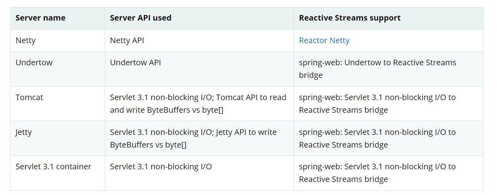
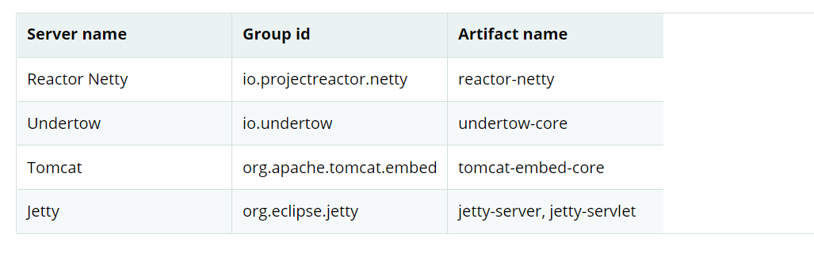

# Reactive Core
spring-web模块包含了以下的基础支持(针对reactive web app)
 - 服务器请求处理的两种级别的支持
    - [HttpHandler](https://docs.spring.io/spring-framework/docs/5.3.10-SNAPSHOT/reference/html/web-reactive.html#webflux-httphandler): 进行无阻塞式IO进行Http请求处理以及Reactive Stream 反压的基础概念,连同Reactor Netty,Undertow,Tomcat,Jetty,以及其他Servlet 3.1+容器的适配器
    - [webHandler](https://docs.spring.io/spring-framework/docs/5.3.10-SNAPSHOT/reference/html/web-reactive.html#webflux-web-handler-api): 轻量级的更高级API,通常就是为了请求处理的web API,在其之上构建了具体的编程模型(例如注解的controller 以及函数式端点)
- 对于客户端,这里有一个基本的ClientHttpConnector 约定去执行Http请求(通过无阻塞式IO)以及Reactive Stream back pressure,连同Reactor Netty以及 reactive Jetty HttpClient 以及 Apache HttpComponents的适配器,在应用中使用的高级别的WebClient在这些基础的约定之上构建!
## HttpHandler
他是一个简单的抽象,能够处理请求和响应,故意最少化,主要目的仅仅是为了在不同Http服务器API进行最小的抽象!

下面描述了服务器的依赖(也可以看支持的[版本](https://github.com/spring-projects/spring-framework/wiki/What%27s-New-in-the-Spring-Framework))

下面的代码快照展示了如何在各种服务器API中使用HttpHandler;
###Reactor Netty
```text
HttpHandler handler = ...
ReactorHttpHandlerAdapter adapter = new ReactorHttpHandlerAdapter(handler);
HttpServer.create().host(host).port(port).handle(adapter).bind().block();
```
### Undertow
```text
HttpHandler handler = ...
UndertowHttpHandlerAdapter adapter = new UndertowHttpHandlerAdapter(handler);
Undertow server = Undertow.builder().addHttpListener(port, host).setHandler(adapter).build();
server.start();
```
### Tomcat
```text
HttpHandler handler = ...
Servlet servlet = new TomcatHttpHandlerAdapter(handler);

Tomcat server = new Tomcat();
File base = new File(System.getProperty("java.io.tmpdir"));
Context rootContext = server.addContext("", base.getAbsolutePath());
Tomcat.addServlet(rootContext, "main", servlet);
rootContext.addServletMappingDecoded("/", "main");
server.setHost(host);
server.setPort(port);
server.start();
```
### Jetty
```text
public class xxx {

HttpHandler handler = ...
Servlet servlet = new JettyHttpHandlerAdapter(handler);

Server server = new Server();
ServletContextHandler contextHandler = new ServletContextHandler(server, "");
contextHandler.addServlet(new ServletHolder(servlet), "/");
contextHandler.start();

ServerConnector connector = new ServerConnector(server);
connector.setHost(host);
connector.setPort(port);
server.addConnector(connector);
server.start();
}
```
### Servlet 3.1+ Container
为了作为一个war部署到servlet 3.1+的容器中,你能够扩展并且包括AbstractReactiveWebInitializer 到War中,这个类包装了一个包含了ServletHttpHandlerAdapter并且将它作为一个Servlet注册!
### WebHandler API
org.springframework.web.server 包 基于HttpHandler的约定下提供了一个通用的目标性的 web api(通过多个WebExceptionHandler的链、多个WebFilter、单个WebHandler 组件去处理请求) \
该链可以通过简单地指向一个 Spring ApplicationContext 来与 WebHttpHandlerBuilder 放在一起，其中组件是自动检测的，和/或通过向构建器注册组件,其实它的意思是WebHttpHandlerBuilder中包含了这些链组件并且还拥有指向ApplicationContext的引用! \
当然HttpHandler有一个抽象不同Http server的使用的目标,这个WebHandler API打算提供一个使用在web应用程序中的通用广泛的特性集合:
- 包含属性的用户会话
- 请求属性
- 对请求解析的Locale 或者 Principal
- 访问解析的以及缓存形式的数据
- 多个数据的抽象
- 以及更多
#### Special bean type
下面的表所列出的组件是WebHttpHandlerBuilder
能够在Spring 应用上下文中能够自动检测的或者能够通过它直接注册的 \
beanName     BeanType    Count      Description \
<any>   WebExceptionHandler    0...N 提供了处理来自WebFilter实例链以及目标WebHandler异常,为了获取更多，查看异常! \
<any>   WebFilter  0..N   应用拦截风格逻辑在过滤器链以及目标WebHandler的其他地方前后进行处理! \
webHandler   WebHandler  1 针对请求的处理器 \
webSessionManager WebSessionManager 0...1 通过一个方法在ServerWebExchange上暴露的一个管理WebSession 实例的管理器,默认是DefaultWebSessionManager \
serverCodecConfigurer ServerCodecConfigurer 0...1   为了访问解析表单数据以及文件上传数据的HttpMessageReader 实例-通过一个方法在ServerWebExchange暴露的实例,默认是ServerCodecConfiguer.create() \
localeContextResolver LocaleContextResolver 0...1  LocalContext的解析器(通过一个方法在ServerWebExchange上暴露的,默认是AcceptHeaderLocaleContextResolver) \
forwardedHeaderTransformer ForwardedHeaderTransformer 0...1 为了处理转发类型的请求头,要么通过抓取或者移除它们或者仅仅移除它们,默认不使用!
#### Form Data
ServerWebExchange 暴露以下方法来访问表单数据:
```text
Mono<MultiValueMap<String,String>> getFormData();
```
DefaultServerWebExchange 使用了这个配置的HttpMessageReader 去解析表单数据(application/x-www-form-urlencoded 到一个MultiValueMap中).
默认来说,FormHttpMessageReader 是已经配置完毕且通过ServerCodecConfigurer进行使用(查看 [Web Handler API](https://docs.spring.io/spring-framework/docs/5.3.10-SNAPSHOT/reference/html/web-reactive.html#webflux-web-handler-api))

### Multipart Data
ServerWebExchange 暴露了以下方法来访问multipart 数据;
```text
Mono<MultiValueMap<String, Part getMultipartData();
```
默认的DefaultServerWebExchange 使用了配置的HttpMessageReader<MultiValueMap<String,Part>> 去解析multipart/form-data 内容到MultiValueMap; 默认来说DefaultPartHttpMessageReader,并没有任何第三方的依赖,除此之外,SynchronossPartHttpMessageReader能够被使用,这些都是基于[同步 NIO](https://github.com/synchronoss/nio-multipart)的Multipart 类库,两者消息读取器都能够被ServerCodecConfigurer bean 配置(查看 [Web Handler API](https://docs.spring.io/spring-framework/docs/5.3.10-SNAPSHOT/reference/html/web-reactive.html#webflux-web-handler-api)) \
为了在流机制中解析multipart data,你能够使用从HttpMessageReader<Part>中返回的Flux<Part>替代,举个例子,在一个注解的控制器中，@RequestPart 的使用应用了类似于Map的方式通过名称访问独立的部分,因此需要完全解析multipart data ,相反你能够使用@RequestBody 解码内容到Flux<Part>中而不需要收集到MultiValueMap中!
#### Forwarded Headers
当一个请求通过代理的时候(例如 负载均衡器，主机、端口、以及方案(模式)也许需要改变,它将视为一个挑战(来自一个客户端的角度,去创建一个链接指向正确的主机和端口以及模式(协议)) \
[RFC 7239](https://tools.ietf.org/html/rfc7239) 定义了Forwarded Http请求头能够让代理能够使用去提供关于原始请求的信息,这并不是一个标准的请求头,所以包括了X-Forwarded-Host, X-Forwarded-Port, X-Forwarded-Proto, X-Forwarded-Ssl,Forwarded-Prefix \
ForwardedHeaderTransformer 是一个修改请求主机、端口、模式或者协议的组件,基于转发的请求头以及这些远程的那些请求头,如果你声明它作为一个名称为forwardedHeaderTransformer的bean,他将被检测到并被使用! \
存在对转发请求头的安全考虑,因此一个应用不知道这个请求头是否被代理增加的、还是有意的,或者恶毒的客户端发起的,这就是为什么一个代理的信任的范围应该考虑移除未信任的来自于外部的传输的转发,你能够配置ForwardedHeaderTransformer且removeOnly=true,这种情况下它移除且不会使用这些请求头! \
在5.1 ForwardedHeaderFilter 已经不建议使用了并且被ForwardedHeaderTransformer取代,因此转发的请求头能够被更早的处理,在交换机创建之前. 如果过滤器已经被配置了,它将取出(删除)列表中的过滤器并且使用ForwardHeaderTransformer进行替代使用!
### 过滤器
在WebHandler API中,你能够使用WebFilter去应用拦截式风格的逻辑在过滤器处理链的其余部分和目标 WebHandler 之前和之后应用拦截式逻辑,当使用[WebFlux Config](https://docs.spring.io/spring-framework/docs/5.3.10-SNAPSHOT/reference/html/web-reactive.html#webflux-config),注册一个WebFilter是简单的且能够声明作为一个Spring的Bean(并且可选的)通过@Order注解或者实现Ordered接口表达它的优先级 \
#### Cors
webflux 提供了细腻化的跨域支持(通过在控制器上放置注解),然而当你使用它和Spring security结合时,我们建议依赖与内置的CorsFilter,这必须放置在Spring Security的过滤链之前 \
查看[CORS](https://docs.spring.io/spring-framework/docs/5.3.10-SNAPSHOT/reference/html/web-reactive.html#webflux-cors)以及[webflux-cors.html](https://docs.spring.io/spring-framework/docs/5.3.10-SNAPSHOT/reference/html/webflux-cors.html#webflux-cors-webfilter)获取更多
#### 异常
在WebHandler API中,你能够使用一个WebExceptionHandler 去处理一个来自WebFilter实例链以及目标WebHandler的异常. 当使用WebFlux配置时,注册一个WebExceptionHandler 非常简单-并且可以作为一个bean,通过实现Ordered接口以及@Order注解调整优先级! \
下面的表描述了必要的WebExceptionHandler实现:
Exception Handler   Description \
ResponseStatusExceptionHandler 提供了ResponseStatusException的异常处理-通过设置响应的异常Http状态码 \
WebFluxResponseStatusExceptionHandler ResponseStatusExceptionHandler的扩展-它能够检测任何通过@ResponseStatus注解到异常上的任何Http状态码,这个处理器在[WebFlux Config](https://docs.spring.io/spring-framework/docs/5.3.10-SNAPSHOT/reference/html/web-reactive.html#webflux-config)中声明!
###Codecs 
spring-web 以及 spring-core模块提供了对序列和反序列化字节内容以及通过使用Reactive Streams back pressure的非阻塞I/O从高级对象中进行处理,支持以下特性:
- [Encoder](https://docs.spring.io/spring-framework/docs/5.3.10-SNAPSHOT/javadoc-api/org/springframework/core/codec/Encoder.html) 以及 [Decoder](https://docs.spring.io/spring-framework/docs/5.3.10-SNAPSHOT/javadoc-api/org/springframework/core/codec/Decoder.html) 都是底层概念能够独立于Http的内容进行编码和解码!
- HttpMessageReader 以及 HttpMessageWriter 是一个能够编码以及解码Http 消息内容的一个约定-合约
- 一个Encoder 能够使用EncoderHttpMessageWriter进行包装然后适配于Web应用的一个使用,当然Decoder也能够被DecoderHttpMessageReader进行包装!
- [DataBuffer](https://docs.spring.io/spring-framework/docs/5.3.10-SNAPSHOT/javadoc-api/org/springframework/core/io/buffer/DataBuffer.html) 抽象不同的字节缓冲区呈现(例如Netty ByteBuf,java.nio.ByteBuffer,等等),并且所有的编码器都能够工作,查看[Data Buffers and Codecs](https://docs.spring.io/spring-framework/docs/5.3.10-SNAPSHOT/reference/html/core.html#databuffers) 在Spring 核心部分描述更多; \
spring-core 模块提供了byte[],ByteBuffer,DataBuffer,Resource,以及String encoder以及decoder实现,spring-web模块提供了jackson JSON,jackson Smile,JAXB2,协议缓冲区以及其他编码器以及解码器连同基于Web的Http消息读取器以及写入器实现-针对表单数据、multipart-content,服务器发送事件、以及其他事情! \
ClientCodecConfigurer 以及 ServerCodecConfigurer 通常被应用中用来配置 并且定制解码器(codecs),查看[Http message codecs](https://docs.spring.io/spring-framework/docs/5.3.10-SNAPSHOT/reference/html/web-reactive.html#webflux-config-message-codecs);
#### Jackson JSON
JSON 以及 二进制JSON([Smile](https://github.com/FasterXML/smile-format-specification))两者同时被Jackson 库所支持! \
Jackson2Decoder 工作如下:
- jackson的异步,非阻塞式解析器被用来收集字节块的流到TokenBuffer的每一个所呈现的JSON对象;
- 每一个TokenBuffer将传递给Jackson的ObjectMapper去创建一个高级对象! \
- 当解码到一个单个值的publisher(eg. Mono),这里仅仅是一个TokenBuffer;
- 当解码到一个multi-value publisher(eg. Flux),每一个TokenBuffer 也可以传递给ObjectMapper(一旦接收到足够的字节能够完全形成对象),输入的内容可以是JSON数组,或者任何一个分行的JSON形式,例如NDJSON,JSON Lines,或者JSON Text Sequences(json 文本序列); \
Jackson2Encoder 工作如下:
- 对于单个值的Publisher(eg. Mono),简单的序列化它-通过ObjectMapper
- 对于使用了application/json的multi-value publisher,默认通过使用Flux#collectionToList()收集这些值并序列化这些结果集合!
- 包含流媒体类型的multi-publisher,例如具有application/x-ndjson或者application/stream+x-jackson-smile的流媒体类型,使用[行分割的JSON](https://en.wikipedia.org/wiki/JSON_streaming)形式独立编码,写入以及刷新每一个值,其他流媒体类型也许能够注册到编码器中;
- 对于SSE Jackson2Encoder 在每一次事件以及输出刷新的时候进行执行-确保递送没有延迟! \
注意:  Jackson2Encoder 以及 Jackson2Decoder同时不支持String类型的元素,相反默认的组装是呈现为序列化的JSON格式的一个字符串序列,能够通过CharSequenceEncoder进行渲染,如果你需要从Flux<String>中渲染一个JSON数组,使用Flux#collectionToList并且编码成功一个Mono<List<String>>
#### 表单数据
FormHttpMessageReader 以及 FormHttpMessageWriter 支持编码以及解码application/x-www-form-urlencoded内容; \
在服务器端-表单内容经常需要从多个地方进行访问,ServerWebExchange提供给了一个专用的getFormData()方法-然后通过FormHttpMessageReader解析这些内容并缓存结果以避免重复访问,查看在WebHandler API部分的[Form Data](https://docs.spring.io/spring-framework/docs/5.3.10-SNAPSHOT/reference/html/web-reactive.html#webflux-form-data)部分获取更多! \
一旦getFormData()被调用,这个原始的原始内容能够不在从请求体中读取,对于这个原因,应用将期待通过ServerWebExchange来对缓存的数据进行一致性访问-而不是从原始的请求体中获取!
#### Multipart
MultipartHttpMessageReader 以及 MultipartHttpMessageWriter 支持编码以及解码"multipart/form-data"内容,依次代理MultipartHttpMessageReader代理到其他的HttpMessageReader -将数据解析到Flux<Part> 并且然后简单的收集这一部分数据到MultiValueMap,默认来说DefaultPartHttpMessageReader 会被使用,通过ServerCodecConfigurer可以改变使用的HttpMessageReader,获取关于DefaultPartHttpMessageReader的信息,查看DefaultPartHttpMessageReader的信息！ \
在服务器端当multipart表单内容可以需要在多次访问,ServerWebExchange提供了专用的getMultipartData()并通过MultipartHttpMessageReader解析并缓存结果,便于重复访问,查看[Multipart Data](https://docs.spring.io/spring-framework/docs/5.3.10-SNAPSHOT/reference/html/web-reactive.html#webflux-multipart)在WebHandler API的部分! \
一旦getMultipartData()使用,原始的内容不再从请求体中获取,应用为了一致性调用使用getMultipartData进行重复获取数据调用作了努力,类似map的访问部分数据,否则只能通过SynchronossPartHttpMessageReader来进行单次访问Flux<Part>
#### limits
Decoder 以及HttpMessageReader实现是缓存一些或者输入的全部(但是能够通过在内存中限制缓冲区的最大缓冲数量),在某些情况下缓存会出现因为输入会被聚合并且作为单个对象呈现-举个例子,拥有@RequestBody byte[],x-www-form-urlencoded数据的控制器方法,以及其他! \
缓存在流中也会发生,当分割输入流的时候-举个例子,分割的文本,JSON对象的一个流以及其他,对于这些流的情况,限制应用的字节数量与流中的一个对象相联系; \
对于配置的缓冲区的尺寸,你能够检查(如果一个给定的Decoder或者HttpMessageReader暴露了一个maxInMemorySize属性并且javadoc会包含默认值的详细信息),在服务器端,ServerCodecConfigurer提供了形式可以设置所有的编码器,查看[Http Message codec](https://docs.spring.io/spring-framework/docs/5.3.10-SNAPSHOT/reference/html/web-reactive.html#webflux-config-message-codecs),在客户端所有编码器的限制都能够在WebClient.Builder中改变 \
对于多部分解析，maxInMemorySize 属性限制了非文件部分的大小,对于文件部分,它决定了这一部分写入到磁盘的阈值. 对于写入磁盘的文件部分,这里有一个额外的maxDiskUsagePerPart属性去限制每一个部分所占用的磁盘空间总量,这里也有一个maxParts属性去限制在multipart请求中parts的所有数量,为了将三种都配置在WebFlux中,你需要应用一个预先配置的MultipartHttpMessageReader到ServerCodecConfigurer上! \
#### Streaming
当将流输入到HttpResponse(举个例子,text/event-stream,application/x-ndjson),周期性发送数据是非常重要的,为了可靠的检查失联的客户端(立刻)-而不是以后,例如一个发送可能是仅仅有注释,空的SSE事件或者任何"no-op"的数据-只要能够有效的作为一个心跳! \
#### DataBuffer
DataBuffer在WebFlux中是一个字节buffer的呈现,这是Spring的核心部分-更多的在【Data Buffers and Codecs](https://docs.spring.io/spring-framework/docs/5.3.10-SNAPSHOT/reference/html/core.html#databuffers)进行说明,关键点在于理解-例如在某些服务器上，如Netty,字节buffer能够池化并且可以引用计数,并且能够被释放-当消费完毕的时候,避免内存泄漏! \
WebFlux应用通常不需要考虑这些细节,除非它们直接消费或者向buffer中生产数据,相反依靠编码器来回转换高级对象的转换,或者除非它们选择创建自定义的编码器! 对于这些情况请参考Data Buffers and Codecs的文档,特别是使用[DataBuffer](https://docs.spring.io/spring-framework/docs/5.3.10-SNAPSHOT/reference/html/core.html#databuffers-using)的文档!
### Logging
Debug级别在SpringFlux中被设计为紧凑的,最小化的以及对人类友好的. 主要集中信息输出非常高有用(反复)-相比于针对指定疑问进行调试的时候更加友好! \
#### LogId
webFlux中有可能一个请求出现在多个线程之中(线程id作为指定请求的日志号不合适),这就是为什么WebFlux日志消息都默认以请求相关的信息作为ID前缀! \
在服务器端,日志ID存储在ServerWebExchange属性(LOG_ID_ATTRIBUTE),当一个完全格式化的ID的前缀可以通过ServerWebExchange#getLogPrefix()进行修改,在WebClient端,日志ID是存储在ClientRequest的属性中(LOG_ID_ATTRIBUTE),获取日志前缀同样可以通过 ClientRequest#getPrefix() \
####Sensitive Data
debug以及trace能够记录许多敏感信息，这就是为什么表单参数以及请求头默认标记并且你需要显示的启用它们被记录(全面) \
下面的例子中展示了如何处理server-side请求:
```text
@Configuration
@EnableWebFlux
class MyConfig implements WebFluxConfigurer {

    @Override
    public void configureHttpMessageCodecs(ServerCodecConfigurer configurer) {
        configurer.defaultCodecs().enableLoggingRequestDetails(true);
    }
}
```
下面的例子展示了如何处理客户端请求:
```text
Consumer<ClientCodecConfigurer> consumer = configurer ->
        configurer.defaultCodecs().enableLoggingRequestDetails(true);

WebClient webClient = WebClient.builder()
        .exchangeStrategies(strategies -> strategies.codecs(consumer))
        .build();
```
#### Appenders
日志类库slf4j以及log4j2提供了异步记录工具类能够避免阻塞,当然这些有它们自己的缺点，例如潜在的删除消息(不能够对入队的消息进行删除),它们也有可取之处(在响应式、非阻塞式的应用中)
#### 自定义编码器
应用能够注册自定义的编码器来支持其他可选的媒体类型,或者指定的行为-不被当前默认的编码器所支持的行为 \
有些配置选项能够开发者强制的加到默认编码器上,自定义的编码器可能想要一个机会和这些首选项对齐,例如强制限制缓冲大小以及记录敏感日志! \
例如下面的例子展示了如何对客户端请求进行操作: 
```text
WebClient webClient = WebClient.builder()
        .codecs(configurer -> {
                CustomDecoder decoder = new CustomDecoder();
                configurer.customCodecs().registerWithDefaultConfig(decoder);
        })
        .build();
```