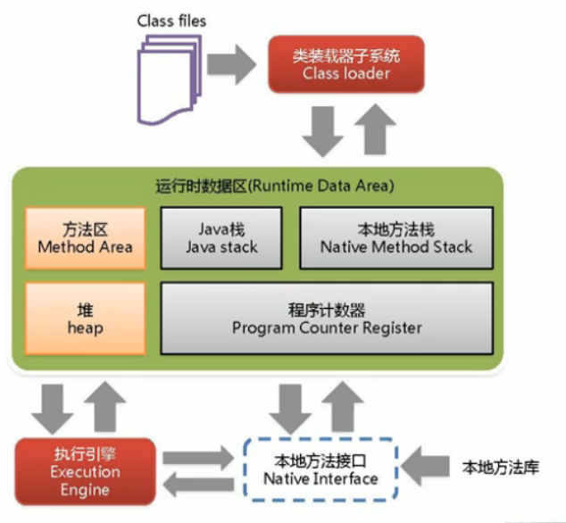
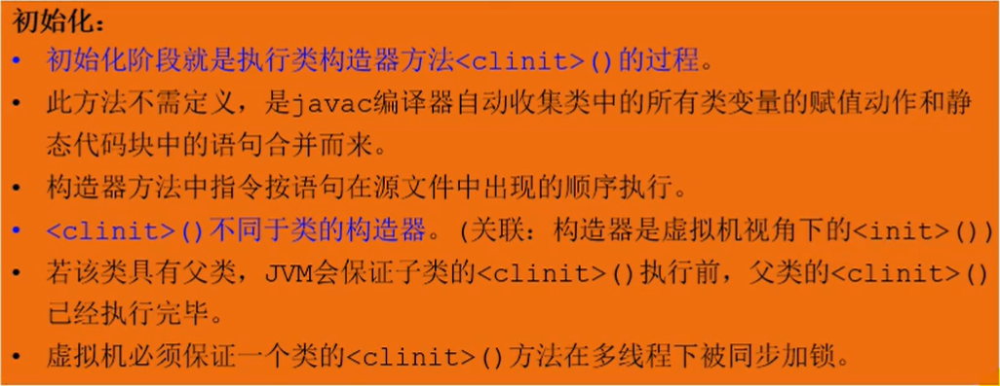

# JVM

## 资料

官方文档：https://docs.oracle.com/javase/specs/index.html

## 常用的JVM实现

- Hotspot：oracle官方
- Jrockit：BEA，曾今号称世界上最快的jvm
- J9 - IBM
- Microsoft VM
- Taobao VM ：Hotspot深度定制版
- Liquid VM ：直接针对硬件
- azul zing ：最新垃圾回收的业界标杆，www.azul.com

