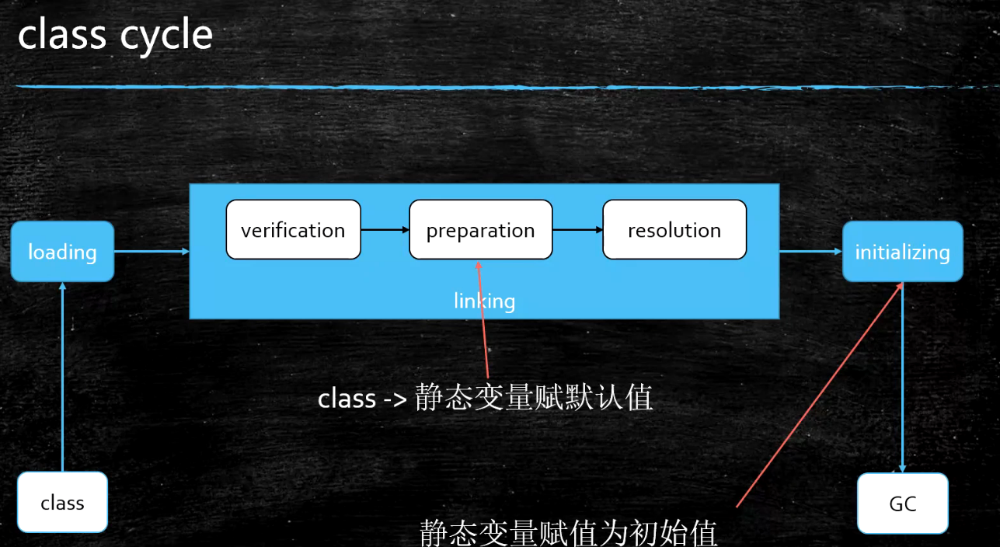

### 类加载过程



1. **loading**

   - 双亲委派
   - LazyLoading 五种情况
     - new getstatic putstatic invokestatic指令，访问final变量除外
     - java.lang.reflect对类进行反射调用时
     - 初始化子类的时候，父类首先初始化
     - 虚拟机启动时，被执行的主类必须初始化
     - 动态语言支持java.lang.invoke.MethodHandle解析的结果为REF_getstatic REF_putstatic REF_invokestatic的方法句柄时，该类必须初始化
   - ClassLoader的源码
     findInCache -> parent.loadClass -> findClass()
   - 自定义类加载器
     - extends ClassLoader
     - overwrite findClass() -> defineClass(byte[] -> Class clazz)
     - 加密
   - <font color=red>如何打破双亲委派机制，parent是如何指定的</font> 
     - 用 **super(parent)** 指定
     - 双亲委派的打破： *重写loadClass（）*
       - 何时打破过？
          1. JDK1.2之前，自定义ClassLoader都必须重写loadClass()
          2. ThreadContextClassLoader可以实现基础类调用实现类代码，通过thread.setContextClassLoader指定
          3. 热启动，热部署
             osgi tomcat 都有自己的模块指定classloader（可以加载同一类库的不同版本）
   - 混合执行 编译执行 解释执行
      - *检测热点代码：*-XX:CompileThreshold = 10000

2. **linking**
   
   1. **verification**    —验证
      1. 验证文件是否符合JVM规定
   2. **preparation**  —准备
      1. 静态变量赋默认值
   3. **resolution **   —解析
      1. 将类、方法、属性等符号引用解析为直接引用
         常量池中的各种符号引用解析为指针、偏移量等内存地址的直接引用
   
3. **initializing**
   调用类初始化代码 <clinit>，给静态成员变量赋初始值 ， 这里需要和 preparation 分清楚

   ```java
   public class T001_ClassLoadingProcedure {
       public static void main(String[] args) {
           System.out.println(T.count);
       }
   }
   class T {
       public static int count = 2; //0
       public static T t = new T(); // null
       //private int m = 8;
       private T() {
           count ++;
           //System.out.println("--" + count);
       }
   }
   ```

   **结果：** 3  new T()在count=2 之后，会先初始化cout，然后执行++操作

### 类加载器


Bootstrap 类加载器是最顶级的类加载器

**双亲委派机制核心代码：**

```java
protected Class<?> loadClass(String name, boolean resolve)throws ClassNotFoundException{
    synchronized (getClassLoadingLock(name)) {
        // First, check if the class has already been loaded
        Class<?> c = findLoadedClass(name);
        if (c == null) {
            long t0 = System.nanoTime();
            try {
                if (parent != null) {
                    c = parent.loadClass(name, false);
                } else {
                    c = findBootstrapClassOrNull(name);
                }
            } catch (ClassNotFoundException e) {
                // ClassNotFoundException thrown if class not found
                // from the non-null parent class loader
            }
            if (c == null) {
                // If still not found, then invoke findClass in order
                // to find the class. 父类加载器未找到则会自己去加载类，主要是用的findClass()方法
                long t1 = System.nanoTime();
                c = findClass(name);
                // this is the defining class loader; record the stats
                sun.misc.PerfCounter.getParentDelegationTime().addTime(t1 - t0);
                sun.misc.PerfCounter.getFindClassTime().addElapsedTimeFrom(t1);
                sun.misc.PerfCounter.getFindClasses().increment();
            }
        }
        if (resolve) {
            resolveClass(c);
        }
        return c;
    }
}
```

**Tip:**

类加载过程可以看成：

1. load - 默认值 - 初始值
2. new - 申请内存 - 默认值 - 初始值
