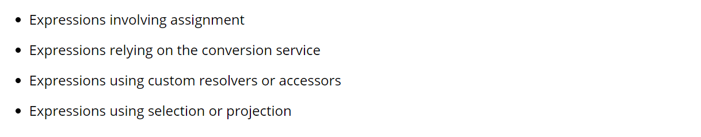

# Spring expression Language (SPEL) 表达式
是一个表达式语言,支持查询以及收集一个对象图层(在运行时),和EL相似但是有其他的特性,例如方法执行以及基本的字符串模板功能; \
例如其他不同的java 表达式语言: OGNL,MVEL,以及JBoss EL, SpEL 基于与技术无关的 API，如果需要，可以集成其他表达式语言实现;
SpEL serve 作为表达式执行的底层,它可以独立使用,如果需要独立使用,可能需要创建一些引导层基础设置类,例如parser,大多数spring用户不需要处理这个基础设置类,反之它可能仅仅需要执行字符串表达式,例如集成SpEL到创建xml或者基于注解的bean 定义,可以查看[Expression support for defining bean definitions](https://docs.spring.io/spring-framework/docs/current/reference/html/core.html#expressions-beandef) \
这里主要说明语法、语法特性、API,Inventor 和 Society 类被用作表达式计算的目标对象。本章末尾列出了这些类声明和用于填充它们的数据。
支持功能:
```text
Literal expressions

Boolean and relational operators

Regular expressions

Class expressions

Accessing properties, arrays, lists, and maps

Method invocation

Relational operators

Assignment

Calling constructors

Bean references

Array construction

Inline lists

Inline maps

Ternary operator

Variables

User-defined functions

Collection projection

Collection selection

Templated expressions
```
##### 执行
完整参考见[Language Reference.](https://docs.spring.io/spring-framework/docs/current/reference/html/core.html#expressions-language-ref) \
```java
ExpressionParser parser = new SpelExpressionParser();
Expression exp = parser.parseExpression("'Hello World'"); 
String message = (String) exp.getValue();
```
SpEL的类接口位于org.springframework.expression以及子包,例如spel.support;
上述例子主要是通过ExpressionParser进行解析表达式字符串,
Expression用于执行解析后的表达式,解析失败抛出ParseException,执行失败,抛出EvaluationExpression; \
SpEL支持很多特性,例如方法执行,访问属性,调用构造器;
```java
ExpressionParser parser = new SpelExpressionParser();
Expression exp = parser.parseExpression("'Hello World'.concat('!')"); 
String message = (String) exp.getValue();
```
例如调用javaBean的属性:
```java
ExpressionParser parser = new SpelExpressionParser();

// invokes 'getBytes()'
Expression exp = parser.parseExpression("'Hello World'.bytes"); 
byte[] bytes = (byte[]) exp.getValue();
```
对于内嵌属性的访问支持:
```java
ExpressionParser parser = new SpelExpressionParser();

// invokes 'getBytes().length'
Expression exp = parser.parseExpression("'Hello World'.bytes.length"); 
int length = (Integer) exp.getValue();
```
```java
ExpressionParser parser = new SpelExpressionParser();
Expression exp = parser.parseExpression("new String('hello world').toUpperCase()"); 
String message = exp.getValue(String.class);
```
注意public <T> T getValue(Class<T> desiredResultType) 无需转换表达式的结果,因为如果转换失败，会抛出EvaluationExpression(使用注册的类型转换器进行转换) \
一般来说,使用更多的是在一个对象上调用属性:
```java
// Create and set a calendar
GregorianCalendar c = new GregorianCalendar();
c.set(1856, 7, 9);

// The constructor arguments are name, birthday, and nationality.
Inventor tesla = new Inventor("Nikola Tesla", c.getTime(), "Serbian");

ExpressionParser parser = new SpelExpressionParser();

Expression exp = parser.parseExpression("name"); // Parse name as an expression
String name = (String) exp.getValue(tesla);
// name == "Nikola Tesla"

exp = parser.parseExpression("name == 'Nikola Tesla'");
boolean result = exp.getValue(tesla, Boolean.class);
// result == true
```
这里的Inventor只是Spring的一个测试类;
##### 理解 EvaluationContext
它主要用于在执行表达式的时候解析属性,方法,字段以及进行类型转换,主要有两种实现:
*  SimpleEvaluationContext 暴露了底层 SpEL语言特性的一个子集和配置选项,用于不需要完整范围的 SpEL 语言语法并且应该有意义地限制的表达式类别。示例包括但不限于数据绑定表达式和基于属性的过滤器
* StandardEvaluationContext 完全暴露SpEL 语言特性和配置选项,你能够使用它指定一个默认的根对象并配置任何可用的执行相关的策略; \
  SimpleEvaluationContext 设计为仅仅支持部分SpEL语言语法,包括java 类型引用,构造器以及bean 引用,需要显式选择执行在表达式中的属性和方法的支持级别,默认来说,你可以使用create()静态工厂方法启动只读访问属性特性,你也能够包含一个构建器去配置支持的具体级别,指定一个或者进行合并:
    * 自定义的PropertyAccessor(不包含反射)
    * 数据绑定属性(只读访问)
    * 可读可写(数据绑定属性)
##### 类型转换
它使用Conversion Service,conversionService默认包含了许多转换器,也支持扩展自定义的转换器,除此之外,他是一个"泛型感知",意味着如果表达式使用泛型对象,SpEL会尝试转换为正确的类型(以维护类型的不正确性); \
实际中,支持赋值,使用setValue即可,例如设置List的属性值,spring在放置到集合之前会转换为指定集合元素的类型;
```java
class Simple {
    public List<Boolean> booleanList = new ArrayList<Boolean>();
}

Simple simple = new Simple();
simple.booleanList.add(true);

EvaluationContext context = SimpleEvaluationContext.forReadOnlyDataBinding().build();

// "false" is passed in here as a String. SpEL and the conversion service
// will recognize that it needs to be a Boolean and convert it accordingly.
parser.parseExpression("booleanList[0]").setValue(context, simple, "false");

// b is false
Boolean b = simple.booleanList.get(0);
```

##### Parser Configuration
前面说到,独自使用,需要配置基础引导类,例如Parser,那么可以使用org.springframework.expression.spel.SpelParserConfiguration配置一个SpEL表达式解析器,此配置对象控制了表达式组件的一些行为,例如: \
你需要通过index访问数组或者集合,但是index所在的元素 = null,SpEL会自动创建元素,当使用表达式构建属性引用的链来说这非常有用,如果index超出数组或者集合尺寸,SpEL能够自动增长数组或者列表来容纳index的错误,为了通过指定的index增加元素,SpEL将在设置指定值之前尝试使用元素类型的默认构造器创建元素,如果元素类型没有默认构造器,那么增加的value = null,如果这里没有内建或者自定义转换器知道如何设置此value, null 将会包含在指定indexarray或者列表中;
```java
class Demo {
    public List<String> list;
}

// Turn on:
// - auto null reference initialization
// - auto collection growing
SpelParserConfiguration config = new SpelParserConfiguration(true,true);

ExpressionParser parser = new SpelExpressionParser(config);

Expression expression = parser.parseExpression("list[3]");

Demo demo = new Demo();

Object o = expression.getValue(demo);

// demo.list will now be a real collection of 4 entries
// Each entry is a new empty String
```
##### SpEL 编译(Compilation)
性能很重要,比如与Spring Integration使用的时候性能很重要;
满足高性能的原理是: 在求值期间，编译器生成一个 Java 类，该类包含运行时的表达式行为，并使用该类来实现更快的表达式求值。由于缺少表达式周围的类型，编译器在执行编译时使用在表达式的解释评估期间收集的信息。例如，它不完全从表达式中知道属性引用的类型，但在第一次解释评估期间，它会找出它是什么。当然，如果各种表达式元素的类型随时间发生变化，则基于这些导出信息进行编译可能会在以后造成麻烦。出于这个原因，编译最适合类型信息不会因重复评估而改变的表达式 \
例如支持数组索引访问,那么取消了数组整体执行,提升性能;
```java
someArray[0].someProperty.someOtherProperty < 0.1
```
###### 编译配置
默认情况没有编译器开启,但是有两种方式开启:
1) 通过使用解析器配置程序开启
2) 当SpEL 作为一个内嵌属性使用在另一个组件中,你可以使用一个Spring属性开启它; \
编译器有三种模式:
   org.springframework.expression.spel.SpelCompilerMode收集了所有模式.
   *  OFF (默认选择)
   *  IMMEDIATE 快速模式(尽可能快的编译),通常是第一次解析评估,如果编译表达式失败(通常是由于类型改变),表达式苹果的调用者接收一个异常;
   *  MIXED 在解析和编译模式下切换,有些时候编译失败之后可能会转为解析形式重试,一般来说用户进入 IMMEDIATE 模式的异常是在内部处理的 \
IMMEDIATE模式退出是因为MIXED模式可能会对表达式造成副作用,如果编译表达式部分成功之后出错,他可能已经完成了某些事情(对系统的状态可能造成了影响),如果发生,调用者可能不想它运行在解释模式,因此表达式可能有两种运行选择(一半解释、一半编译) \
选择模式之后,使用SpelParserConfiguration 配置到parser中,例如:
```java
SpelParserConfiguration config = new SpelParserConfiguration(SpelCompilerMode.IMMEDIATE,
    this.getClass().getClassLoader());

SpelExpressionParser parser = new SpelExpressionParser(config);

Expression expr = parser.parseExpression("payload");

MyMessage message = new MyMessage();

Object payload = expr.getValue(message);
```
当指定了编译模式,能够指定类加载器,类加载器非常重要,如果指定了它就能够查看当前执行的表达式中的所有类型,如果么有指定,默认是使用当前上下文的执行当前表达式的当前线程的类加载器; \
第二种方式就是通过配置jvm属性配置spring.expression.compiler.mode,或者通过Spring.properties 机制加载SpelCompilerMode;   
###### 编译器限制
不是每一种表达式都支持编译,最初是为了使用在大多数通用表达式(可能使用在性能要求很高(critical)的上下文中),例如下面的表达式不能够编译:


#### 在bean 定义中使用表达式
语法形式为#{\<expression>}
例如: xml
```xml
<bean id="numberGuess" class="org.spring.samples.NumberGuess">
    <property name="randomNumber" value="#{ T(java.lang.Math).random() * 100.0 }"/>

    <!-- other properties -->
</bean>
```
所有的应用上下文中的具有名称的bean都是预定义的变量,例如可以使用environment中的变量属性:
```xml

<bean id="taxCalculator" class="org.spring.samples.TaxCalculator">
    <property name="defaultLocale" value="#{ systemProperties['user.region'] }"/>

    <!-- other properties -->
</bean>
```
于是你还可以通过bean名称引用变量 
```xml
<bean id="numberGuess" class="org.spring.samples.NumberGuess">
    <property name="randomNumber" value="#{ T(java.lang.Math).random() * 100.0 }"/>

    <!-- other properties -->
</bean>

<bean id="shapeGuess" class="org.spring.samples.ShapeGuess">
    <property name="initialShapeSeed" value="#{ numberGuess.randomNumber }"/>

    <!-- other properties -->
</bean>
```
##### 注解配置也是一样的
```java
public class FieldValueTestBean {

    @Value("#{ systemProperties['user.region'] }")
    private String defaultLocale;

    public void setDefaultLocale(String defaultLocale) {
        this.defaultLocale = defaultLocale;
    }

    public String getDefaultLocale() {
        return this.defaultLocale;
    }
}
```
根据自动注入特性:
```java
public class PropertyValueTestBean {

    private String defaultLocale;

    @Value("#{ systemProperties['user.region'] }")
    public void setDefaultLocale(String defaultLocale) {
        this.defaultLocale = defaultLocale;
    }

    public String getDefaultLocale() {
        return this.defaultLocale;
    }
}
```
对自动装配的方法也可以使用
```java
public class SimpleMovieLister {

    private MovieFinder movieFinder;
    private String defaultLocale;

    @Autowired
    public void configure(MovieFinder movieFinder,
            @Value("#{ systemProperties['user.region'] }") String defaultLocale) {
        this.movieFinder = movieFinder;
        this.defaultLocale = defaultLocale;
    }

    // ...
}
```

#### 语言参考
基本使用方式,参考[官网](https://docs.spring.io/spring-framework/docs/current/reference/html/core.html#expressions-beandef)
##### 行内表达式 {}
本身意味着是一个空列表,可以使用表达式解析出一个列表,例如:
xxx.parseExpression("{{'a','b'}}"),如果列表本身由固定的文字构成,那么返回常量列表,而不是每次都创建(为了性能); \
如果这样使用 "{name: 'Nikola'}"那么这就是一个行内Map;因为
{:}标识一个空的map,同样为了性能考虑,对于固定的map,则返回一个常量map;当然map的key可以选择不加引号(但是如果是存在.符号,那么需要加上双引号),{"my.ini":"nihao"};
##### types
通过表达式中使用T(某某类型)来创建一个类对象实例,对于java.lang包下的类型,都能够理解,但是其他类型需要全修饰符类型;
底层通过StandardEvaluationContext 使用TypeLocator 发现类型,这个类型定位器本质上是一个StandardTypeLocator(它能够理解java.lang下的类型);并且它也能执行静态方法,例如: \
```java
        boolean trueValue = parser.parseExpression(
        "T(java.math.RoundingMode).CEILING < T(java.math.RoundingMode).FLOOR")
        .getValue(Boolean.class);
```
##### 变量使用
可以通过#variableName 引用变量,例如可以通过EvaluationContext设置变量数据,然后表达式解析使用;
```java
Inventor tesla = new Inventor("Nikola Tesla", "Serbian");

EvaluationContext context = SimpleEvaluationContext.forReadWriteDataBinding().build();
context.setVariable("newName", "Mike Tesla");

parser.parseExpression("name = #newName").getValue(context, tesla);
System.out.println(tesla.getName())  // "Mike Tesla"
```
有效的变量名,字符数字下划线 $符号;
##### #this #root
#this标识表达式所操作的对象本身,#root标识执行上下文;
```java
// create an array of integers
List<Integer> primes = new ArrayList<Integer>();
primes.addAll(Arrays.asList(2,3,5,7,11,13,17));

// create parser and set variable 'primes' as the array of integers
ExpressionParser parser = new SpelExpressionParser();
EvaluationContext context = SimpleEvaluationContext.forReadOnlyDataAccess();
context.setVariable("primes", primes);

// all prime numbers > 10 from the list (using selection ?{...})
// evaluates to [11, 13, 17]
List<Integer> primesGreaterThanTen = (List<Integer>) parser.parseExpression(
        "#primes.?[#this>10]").getValue(context);
```
