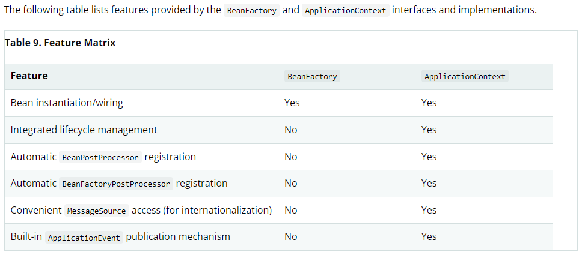

# BeanFactory API
它提供了Spring ioc的核心功能,它约定了如何和spring的其他部分以及三方框架集成的约定 ... \
DefaultListableBeanFactory 实现是一个关键的代理(在高级GenericApplicationContext容器中) ... \
BeanFactory 以及相关的接口(例如BeanFactoryAware,InitializingBean / DisposableBean)都是和其他框架组件集成的切入点 , 不需要反射或者注解,允许集成,应用级别的bean 也可以使用相同的接口集成,
但是通常是通过注解声明式依赖注入又或者是编程式处理 .. \
注意BeanFactory API 和 DefaultListableBeanFactory实现并没有假设配置格式以及任何被使用的组件注解,也就是前边bean 描述中的可以通过多种 BeanDefinitionReader进行 不同类型的bean 定义解析处理,这完全取决
于开发者的使用(它们都可以在一个共享的BeanDefinition对象上进行操作),这就是为什么Spring 如此灵活并且可扩展 ..
## 1.16.1 BeanFactory / ApplicationContext
beanFactory是真正的ioc容器,而ApplicationContext为ioc容器提供了更多丰富的功能,并且一般情况下我们应该使用 ApplicationContext 而不是BeanFactory,除非你真的知道你在干什么? \
因为ioc容器真正的功能只有bean 托管的功能,其余的扩展点都是applicationContext提供的...

### 容器增加扩展点
默认DefaultListableBeanFactory都是对Bean不可知的,例如假设需要使用注解处理以及AOP 代理,那么默认的ioc容器根本没有这些后置处理器,所以你需要在引导期间加入,而对于applicationContext这一切都已经自动处理了 ..
```text
DefaultListableBeanFactory factory = new DefaultListableBeanFactory();
// populate the factory with bean definitions

// now register any needed BeanPostProcessor instances
factory.addBeanPostProcessor(new AutowiredAnnotationBeanPostProcessor());
factory.addBeanPostProcessor(new MyBeanPostProcessor());

// now start using the factory
```
对于使用一个简单的DefaultListableBeanFactory,你应该调用 postProcessBeanFactory 方法,才能够将后置处理器用起来 ..
```text
DefaultListableBeanFactory factory = new DefaultListableBeanFactory();
XmlBeanDefinitionReader reader = new XmlBeanDefinitionReader(factory);
reader.loadBeanDefinitions(new FileSystemResource("beans.xml"));

// bring in some property values from a Properties file
PropertySourcesPlaceholderConfigurer cfg = new PropertySourcesPlaceholderConfigurer();
cfg.setLocation(new FileSystemResource("jdbc.properties"));

// now actually do the replacement
cfg.postProcessBeanFactory(factory);
```
以上是将PropertySourcesPlaceholderConfigurer后置处理器应用到Spring ioc容器上 ... 这可能太麻烦了,这就是为什么使用ApplicationContext而不是容器接口 ...
### 提示
AnnotationConfigApplicationContext 注册了所有常见的注释后处理器，并且可以通过配置注释（例如@EnableTransactionManagement）在幕后引入额外的处理器。在 Spring 的基于注解的配置模型的抽象级别上，bean 后处理器的概念变成了纯粹的内部容器细节。