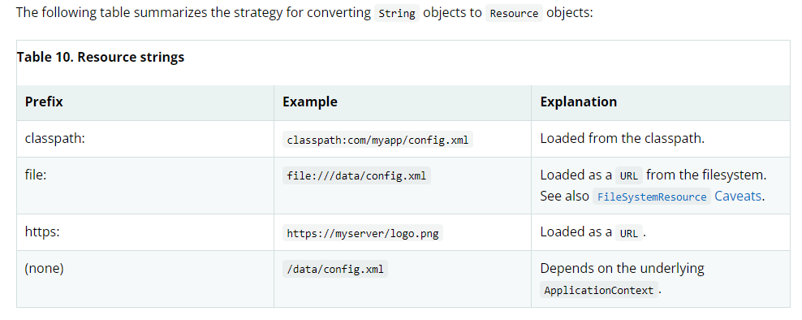

# Resources
spring 提供了许多资源接口,包括内置的Resource也有许多,其次还可以通过ResourceLoader 进行资源加载,ResourcePatternResolver 接口进行资源模式匹配
## Resource 接口
它包含了一个java.net.URL 实例,但是传统的标准处理器访问底层资源是不足够的,例如无法访问类路径上的资源或者相对于ServletContext的资源 .. \
现在你可以注册一些特定的URL 前缀进行使用(例如 http:),这通常变得十分复杂,URL 接口仍然缺少许多想要的功能,例如方法检测资源的存在性 ... \
它内置于org.springframework.core.io包下,并且有更多的可用接口抽象了访问底层资源的方法 ... \
总而言之,它是非常好的一个资源抽象服务,对于其他库来说它也能达到相同的目录,只不过和Spring耦合了,所以你应该使用工具类将耦合范围缩小 ...(资源的可读可写完全是so easy) ..
## 2.3 内置的资源实现
1. UrlResource
2. ClassPathResource
3. FileSystemResource
4. PathResource
5. ServletContextResource
6. InputStreamResource
7. ByteArrayResource

完整描述查看 Resource doc文档 .. \
### 2.3.1 UrlResource
包含一个java.net.URL 的UrlResource,使用它访问任何对象,例如文件,https目标,ftp目标以及其他 ... 这些都可以通过String呈现 ,合适的前缀指示了一种url类型,这包括: 
- file:
  访问文件路径
- https:
  通过https协议访问资源
- ftp
    通过ftp访问资源
以及其他前缀 ..(这是默认的url支持的) \
对于通过 java 代码手动创建的UrlResource,它本身支持String 参数隐式转换,这将通过JavaBeans的PropertyEditor 决定指定类型的Resource创建 ..
如果路径字符串包含了已知的前缀(被propertyEditor使用,例如classpath:),它将创建合适的Resource,如果没有假设这个字符串是标准的URL string,并创建
UrlResource ...

### 2.3.2 ClassPathResource
通过类加载器获取类路径上的资源(例如上下文加载器,给定类加载器或者给定类加载资源) .. \
如果是类路径资源(对于在文件系统内部但是不在jar内部的类路径资源,且没有解压 - 通过servlet引擎或者其他环境处理)可以使用java.io.File进行解析 ,其余的方式可以通过
各种Resource支持对java.net.URL解析 .. \
同上,但凡通过String 隐式构建Resource,都会被PropertyEditor进行识别而进行对应的Resource创建 ..
### 2.3.3 FileSystemResource
它通过File / java.nio.file.Path处理(它应用标准的基于String的路径转换,但是通过java.nio.file.FilesAPI 执行所有操作),对于java.nio.path.Path 可以使用
PathResource代替,FileSystemResource 支持文件解析以及URl 解析(这个意思是它们能够转换为文件或者URL)

## 2.3.4 PathResource
通过java.nio.file.Path进行资源处理,这个类支持的prefix,取决于它的SPI 注册情况,默认包含zip / jar / 包括window文件系统 / linux文件系统的路径处理(取决于操作系统安装的JDK) ..,同样它也支持
解析为FILE 以及URL 同样它也实现扩展的接口 WritableResource接口,PathResource实际上是一个纯粹的基于java.nio.path.Path的、具有不同createRelative行为的FileSystemResource替代品。
## 2.3.5 ServletContextResource
ServletContext资源的Resource实现(它可以在web应用的根目录下解析相对路径) ... \
同样它支持流式访问以及URL 访问(但是仅仅允许java.io.File访问的时候,仅当web应用归档是解压的,也就是资源实际上是能够在文件系统上进行访问,而不会转换为其他文件系统,例如在jar中访问 / zip),无论有没有解压或者直接从JAR访问,又或是
像数据库一样(这实际上依赖于Servlet 容器),例如有些容器可能会解压应用归档文件(例如你打包为WAR,tomcat是会进行解压的),但是你有可能使用内置tomcat,Spring boot 项目,它本身是一个jar文件,这样就相当于直接从JAR文件中访问(无法转换为一个FILE) ... \
由于File仅代表当前文件系统上的某一个文件,它不可能直接解析JAR文件系统里面的内容(这是规定) ...
## 2.3.6 InputStreamResource
一个InputStreamResource是给定输入流的实现,这仅当其他资源类型不可用时才应该使用这一种,尤其是可以选择ByteArrayResource或者基于文件的一种Resource ... \
对比其他Resource,这是一个已经打开的资源的描述符,isOpen将会返回True,(如果你希望关注(保存)资源描述符又或是需要多次读取一个流,不应该使用它...)

## 2.3.7 ByteArrayResource
对给定的字节数组一个Resource实现,它会为给定的字节数组创建ByteArrayInputStream ...
这是非常有用的(可以从给定的字节数组中加载内容,而不会求助于单次使用的InputStreamResource..)

## 2.4 ResourceLoader
这个接口被用来读取一个资源 ...,上下文代理了这个接口的行为,尤其是注意,当没有前缀的时候,加载一个资源是特定于上下文的类型的,例如
```text
Resource template = ctx.getResource("some/resource/path/myTemplate.txt");
```
如果上下文是一个基于classpath的上下文,那么它加载的是类路径上的资源 .. \
如果你是一个FileSystemXmlApplicationContext实例,那么它应该会返回FileSystemResource .. \
对于WebApplicationContext,它仅仅返回ServletContextResource ... \
因此你能够根据特定上下文加载合适的资源 ..,同样你可以通过字符串指定资源类型前缀,加载对应的资源 ..
```text
Resource template = ctx.getResource("classpath:some/resource/path/myTemplate.txt");
```
```text
Resource template = ctx.getResource("file:///some/resource/path/myTemplate.txt");
```
```text
Resource template = ctx.getResource("https://myhost.com/resource/path/myTemplate.txt");
```


## 2.5 ResourcePatternResolver 接口
这个接口是ResourceLoader的扩展,它定义了一些策略用来解析一个location pattern(例如Ant-style path pattern)到Resource 对象 ..
```java
public interface ResourcePatternResolver extends ResourceLoader {

    String CLASSPATH_ALL_URL_PREFIX = "classpath*:";

    Resource[] getResources(String locationPattern) throws IOException;
}
```
例如它定义了一个classpath*:,它会匹配类路径上的所有资源 ,例如classpath*:/config/beans.xml,表示在类路径上的JAR或者不同目录都可以包含相同的路径的相同名称的多个文件 .. \
本质上它的意思就是会查询所有类路径上的对应资源路径信息 .. \
通过ResourceLoaderAware 对传入的ResourceLoader进行 扩展接口语义检查 .. \
PathMatchingResourcePatternResolver 是一个单独的实现可以使用在ApplicationContext外部并且能够被ResourceArrayPropertyEditor 用来收集Resource[] bean数组属性 ..
这个解析器能够解析特定的资源路径到一个或者多个匹配的Resource 对象, 它可以是简单路径进行一对一映射,也可以通过classpath*: 前缀或者内置ant风格的普通表达式(使用org.springframework.util.AntPathMatcher工具类进行匹配),后者也支持通配符 ... \
最后默认实现就是PathMatchingResourcePatternResolver ,并通过ApplicationContext代理到它 ..,但是在使用过程中出现了一些问题,也就是Ant风格确实可以但是你不能够直接进行/**/*xx这种形式的匹配,至少要有一个确定的路径值..
```text
@Test
		public void test() throws IOException {
			System.out.println(urlResource);

//			final Resource resource = resourceLoader.getResource("resource*.txt");
			// 有效
			final Resource[] resources = resourcePatternResolver.getResources("classpath:ioc/**/resource*.txt");
			// 无效
//			final Resource[] resources = resourcePatternResolver.getResources("classpath:/**/*/resource*.txt");
			for (Resource resource : resources) {
				System.out.println(resource.getURL());
			}
		}
```

### 总结
也就是Spring提供了许多Aware接口,你可以通过工具类和他们进行耦合,通过自动装配不同的接口获得不同的能力,模式匹配,通过ResourcePatternResolver类型,
简单的通过ResourceLoader 即可 ... 同样它们都有对应的Aware接口 ..

## 2.7 Resources as Dependencies
完全可以通过@Value来实现这样的效果,@Value注解的强大之处就不再细说 ... 举个例子,xml形式
```java
package example;

public class MyBean {

    private Resource template;

    public setTemplate(Resource template) {
        this.template = template;
    }

    // ...
}
```
```xml
<bean id="myBean" class="example.MyBean">
    <property name="template" value="some/resource/path/myTemplate.txt"/>
</bean>
```
```xml
<property name="template" value="classpath:some/resource/path/myTemplate.txt"/>
```
```xml
<property name="template" value="file:///some/resource/path/myTemplate.txt"/>
```
又或是通过占位符动态解析,假设template.path是Environment中的一个属性 ...详情查看[environment](1.13-environment-abstraction.md)
```java
@Component
public class MyBean {

    private final Resource template;

    public MyBean(@Value("${template.path}") Resource template) {
        this.template = template;
    }

    // ...
}
```
对于多个类路径下面的相同路径查询通过,classpath*: 即可,并通过Resource[] 接收自动装配的值 ...
同理这里使用动态解析 ..
```java
@Component
public class MyBean {

    private final Resource[] templates;

    public MyBean(@Value("${templates.path}") Resource[] templates) {
        this.templates = templates;
    }

    // ...
}
```

## 2.8 应用上下文和资源路径
### 2.8.1 构造应用上下文
在刚学习Spring的时候,写的最多的就是通过类路径上的文件构造应用上下文
```text
ApplicationContext ctx = new ClassPathXmlApplicationContext("conf/appContext.xml");
```
例如上面的一行代码估计写的很多,除此之外,我们可以通过指定前缀从不同的资源位置或者类型加载配置文件,又或者是根据应用上下文类型构造合适的资源路径查找配置文件 ..
```text
ApplicationContext ctx =
    new FileSystemXmlApplicationContext("conf/appContext.xml");
```
例如上面这一行导致依据当前工作目录的相对路径查找配置文件 ..
```text
ApplicationContext ctx =
    new FileSystemXmlApplicationContext("classpath:conf/appContext.xml");
```
只需要记住,没有任何前缀的资源路径都会根据应用上下文进行合适的处理 ..
### 同样配置类和xml配置文件混用
底层无非就是具体解析资源路径的配置文件,然后使用对应的BeanDefinitionReader读取配置声明,配置类也使用对应的BeanDefinitionReader读取 ...
### 2.8.2 应用上下文构造器的资源路径通配符
1. 普通路径
2. classpath*: 前缀
3. PathMatcher 实现Ant风格的匹配 \
   请注意，此通配符特定于应用程序上下文构造函数中资源路径的使用（或当您直接使用 PathMatcher 实用程序类层次结构时），并在构造时解析。它与 Resource 类型本身无关。您不能使用 classpath*: 前缀来构造实际的资源，因为资源一次只指向一个资源。

### Ant-style Patterns
```text
/WEB-INF/*-context.xml
com/mycompany/**/applicationContext.xml
file:C:/some/path/*-context.xml
classpath:com/mycompany/**/applicationContext.xml
```
根据Ant-style模式解析路径位置时,解析器遵循一个复杂的过程去解析通配符,首先它会分离出从路径开始到非*号的连续碎片进行产生一个独立的URL,
然后如果这个URL 不是jar 或者时特定于容器的变种(例如: webLogic中的zip,或者Websphere中的wsjar),那么它会使用java.io.File表示这个路径,然后通过遍历文件系统解析通配符,
在jarURL的情况下,解析器要么通过JarURLConnection或者手动解析jar URL并尝试遍历jar中的内容去解析通配符 ...
#### 隐含兼容
如果指定的路径已经是一个文件 URL（或者因为基本 ResourceLoader 是一个文件系统而隐式地或显式地），则保证通配符以完全可移植的方式工作。 \
如果指定的路径是一个classpath location,解析器通过将前置非*路径进行Classloader.getResource()调用获取一个路径节点,在这种情况下根据类加载器的定义有序的返回匹配的URL..(多个的情况下随机返回第一个(有可能是这样,或者有顺序),详情查看ClassLoader),
尤其是它通过java.io.File的形式呈现这个目录(类路径资源解析到一个文件系统的位置上) 或者某些形式的JAR URL(类路径资源解析到了一个jar路径),尽管如此，此操作仍存在可移植性问题。 \
如果前置路径返回的是一个jar URL,这个解析器必须根据此URL获取一个java.net.JarURLConnection或者手动解析jar URL .. 然后遍历jar的内容解析通配符 ... \
在大多数环境下能够工作,但是其他可能失败,强烈推荐来自jar的资源通配符解析(在你使用它之前在特定的环境进行测试) ..
#### classpath*: prefix
本质上就是通过 ClassLoader.getResources(…)获取所有类路径上的文件(并合并为最终的应用上下文定义),这是比较简单的 .. \
对于通配符路径依赖于底层的类加载器的getResources()方法,大多数应用服务器现在都有自己的Classloader实现,这行为可能就不一样,特别是处理jar文件,如果classpath*工作去使用Classloader去从类路径上加载一个jar中一个文件: \
getClass().getClassLoader().getResources("<someFileInsideTheJar>"),一定要进行详细的测试(放置在两个不同位置的相同名称的文件),例如文件名相同路径相同但是位于类路径上的不同jar . \
如果出现了不合适的结果,检查应用服务器文档并设置去影响ClassLoader的行为 ... \
如果结合PathMatcher 模式(也就是ant 风格模式),那么就先使用ClassLoader.getResources()获得所有有效目录,然后通过相同的PathMatcher解析策略解析通配符子路径 ...
#### 注意事项
官方明确规定,使用ant-style pattern,必须包含一个根目录(在模式开始之前,也就是不能以 *开头),除非实际的目录文件存在于文件系统内,这就意味着classpath*:*.xml可能无法从jar文件的根下抓取文件但是能够从扩展目录的根进行抓取 .. \
Spring 抓取类路径实体的能力来源于JDK的ClassLoader.getResources()方法,对于空字符串返回查询的最终根目录,Spring 评估URLClassLoader 运行时配置以及 在jar文件中的材料清单的java.class.path信息,但这不保证兼容的行为 .. \
类路径包的扫描必须有相关的目录实体出现在类路径上: \
当通过Ant构建Jar时,不应该激活jar任务的files-only开关,类路径目录在某些环境下由于安全策略不能暴露,例如标准的单机应用(基于JDK1.7.0_45或者更高,可能需要你在清单中配置信任库信息),查看https://stackoverflow.com/questions/19394570/java-jre-7u45-breaks-classloader-getresources); \
在基于JDK9的模块路径(jigsaw),Spring的类路径扫描能够如期工作,将资源放入一个专门的目录下是非常推荐的,避免了前面提到的搜索jar文件根层的可移植性问题。 \
当具有classpath的Ant-style模式时,不一定能够匹配出资源(如果查询在多个类路径位置上是必要的时候,使用classpath就不一定能够查询出来,因为它随机返回一个路径,不一定存在,应该使用classpath*:),但是你也可以使用相同路径前缀可能有所帮助,例如
```text
com/mycompany/package1/service-context.xml
```
替换成
```text
classpath:com/mycompany/**/service-context.xml
```
这样可能能够解决(如果返回的第一个根节点就包含了这些资源),否则你就应该使用classpath*:

###  2.8.3 FileSystemResource 注意
FileSystemResource并不是依附于FileSystemApplicationContext的,也就是FileSystemApplicationContext(当FileSystemApplicationContext不是实际的ResourceLoader)可能不会如你期望解析绝对或者相对路径 ..
相对路径是相对于当前工作目录,然而绝对路径相对于文件系统的根进行查找 .. \
为了向后兼容,所以无论是相对路径还是绝对路径,都依据相对路径进行处理,
```text
ApplicationContext ctx =
    new FileSystemXmlApplicationContext("conf/context.xml");
```
等价于
```text
ApplicationContext ctx =
    new FileSystemXmlApplicationContext("/conf/context.xml");
```
当你是实在是需要绝对路径解析,通过 URLResource是一个好的选择
```text
// actual context type doesn't matter, the Resource will always be UrlResource
ctx.getResource("file:///some/resource/path/myTemplate.txt");
```
或者
```text
// force this FileSystemXmlApplicationContext to load its definition via a UrlResource
ApplicationContext ctx =
    new FileSystemXmlApplicationContext("file:///conf/context.xml");
```
