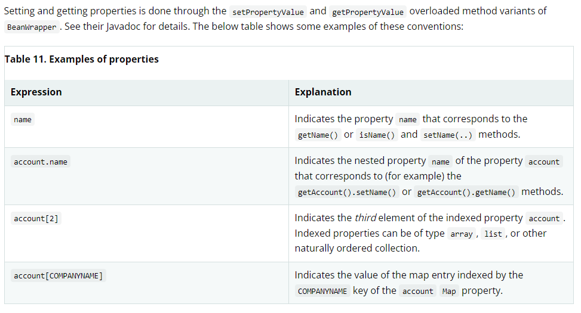
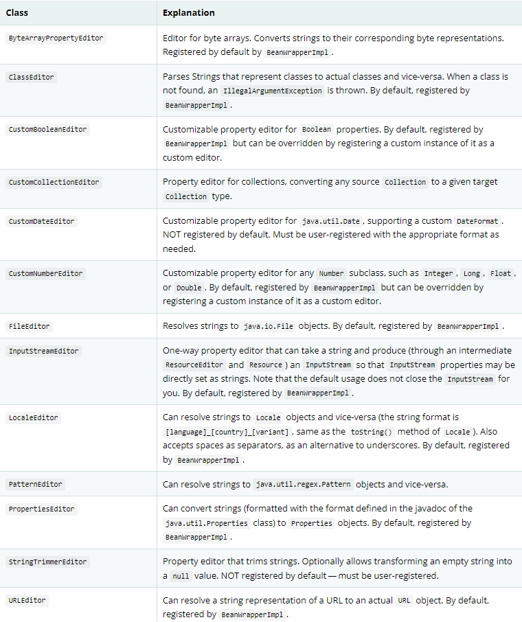

# 验证,数据绑定以及类型转换

## 概说
对于业务逻辑的验证有优点又有缺点,Spring提供了校验(数据绑定)设计,它们之间并没有互斥性 ..并且你能够很容易的国际化且能够有任意的验证器进行增强 ...,
Spring 默认提供了一些验证器 .. \
数据绑定能够动态解析用户输入并绑定到应用的领域模型(或者任何你想处理用户输入的模型),Spring 提供了DataBinder来做这个事情,Validator 和 DataBinder 组成了validation 包,它们提供了大量
有用的功能 .. \
BeanWrapper 是一个最基本的概念,并且在各个地方大量应用,一般不需要直接使用BeanWrapper \
Spring DataBinder 以及 底层的BeanWrapper 都使用PropertyEditorSupport实现解析并格式化属性值 ... \
PropertyEditor 以及 PropertyEditorSupport类型都是javaBeans的规范之一,Spring 3引入core.convert包提供一个通用类型转换的基础设施,同高级"format"包一样能够格式化UI 字段值 .. \
你能够使用这些包(因为它们简化了PropertyEditorSupport实现) ... \
Spring 支持java bean 校验(通过配置基础设施以及一个适配器到Spring 自己的Validator约定),这可以在源码中查看得到验证 ...,同样应用能够全局性的启动Bean校验,同java Bean验证描述的那样,对所有
的验证单独使用,在web层,你可以注册一个局部controller包含的Spring Validator 实例(每一个DataBinder包含一个Validator),这能够加入自定义验证逻辑 ...
## 3.1 通过Spring Validator 接口
通过Validator进行验证,这个接口能够使用一个Errors对象,当验证的时候,你可以通过Errors对象暴露验证失败 ... \
实现Validator 是十分直接了当的,特别是当你知道如何使用 ValidationUtils 帮助类,如下所述:
```java
public class PersonValidator implements Validator {

    /**
     * This Validator validates only Person instances
     */
    public boolean supports(Class clazz) {
        return Person.class.equals(clazz);
    }

    public void validate(Object obj, Errors e) {
        ValidationUtils.rejectIfEmpty(e, "name", "name.empty");
        Person p = (Person) obj;
        if (p.getAge() < 0) {
            e.rejectValue("age", "negativevalue");
        } else if (p.getAge() > 110) {
            e.rejectValue("age", "too.darn.old");
        }
    }
}
```
对于内嵌对象的校验,应该针对每一个模型封装一个Validator,然后整体进行校验,结合使用 ..
```java
public class CustomerValidator implements Validator {

    private final Validator addressValidator;

    public CustomerValidator(Validator addressValidator) {
        if (addressValidator == null) {
            throw new IllegalArgumentException("The supplied [Validator] is " +
                "required and must not be null.");
        }
        if (!addressValidator.supports(Address.class)) {
            throw new IllegalArgumentException("The supplied [Validator] must " +
                "support the validation of [Address] instances.");
        }
        this.addressValidator = addressValidator;
    }

    /**
     * This Validator validates Customer instances, and any subclasses of Customer too
     */
    public boolean supports(Class clazz) {
        return Customer.class.isAssignableFrom(clazz);
    }

    public void validate(Object target, Errors errors) {
        ValidationUtils.rejectIfEmptyOrWhitespace(errors, "firstName", "field.required");
        ValidationUtils.rejectIfEmptyOrWhitespace(errors, "surname", "field.required");
        Customer customer = (Customer) target;
        try {
            errors.pushNestedPath("address");
            ValidationUtils.invokeValidator(this.addressValidator, customer.getAddress(), errors);
        } finally {
            errors.popNestedPath();
        }
    }
}
```

## 3.2 解析代码到错误消息的验证
将错误消息对应到消息代码,通过MessageSource实现国际化消息错误处理,MessageCodesResolver 决定Errors接口注册了那些错误代码,
默认来说DefaultMessageCodesResolver,它不仅使用调用者提供的code注册了消息并且同样注册包含了传递给reject方法的字段名的消息,举个例子,这可能比较抽象,
如果使用rejectValue("age", "too.darn.old"),除了too.darn.old代码之外,Spring还会注册too.darn.old.age以及too.darn.old.age.int(字段名和类型),这是一种约定能够
方便的告诉开发者能够定位错误消息 .. \
关于更多MessageCodesResolver的信息 以及默认策略能够通过MessageCodesResolver和DefaultMessageCodesResolver的javadoc了解 ..

## 3.3 BeanWrapper 的 bean 操作
org.springframework.beans 包坚持JavaBean的标准,[javaBeans](https://docs.oracle.com/javase/8/docs/api/java/beans/package-summary.html),
BeanWrapper 和BeanWrapperImpl 提供了设置属性值的功能(包括单独或者批量的),通过获取属性描述符来决定属性是否是可读或者可写的 .. \
同样它支持内嵌属性(不限制深度的子属性设置),同样BeanWrapper支持标准的javaBean规范的PropertyChanListeners以及 VetoableChangeListeners的能力,不需要增加额外的代码(针对目标类),最后
BeanWrapper同样支持设置索引属性,同样这个类并不直接使用(而是通过DataBinder以及 BeanFactory) ..

### 3.3.1 设置或者获取基本属性 / 内嵌属性
设置或者获取属性通过 setPropertyValue / get....(以及其他的一些重载方法) ..
 
#### 直接使用BeanWrapper
```java
public class Company {

    private String name;
    private Employee managingDirector;

    public String getName() {
        return this.name;
    }

    public void setName(String name) {
        this.name = name;
    }

    public Employee getManagingDirector() {
        return this.managingDirector;
    }

    public void setManagingDirector(Employee managingDirector) {
        this.managingDirector = managingDirector;
    }
}
```
```java
public class Employee {

    private String name;

    private float salary;

    public String getName() {
        return this.name;
    }

    public void setName(String name) {
        this.name = name;
    }

    public float getSalary() {
        return salary;
    }

    public void setSalary(float salary) {
        this.salary = salary;
    }
}
```
使用方式
```text
BeanWrapper company = new BeanWrapperImpl(new Company());
// setting the company name..
company.setPropertyValue("name", "Some Company Inc.");
// ... can also be done like this:
PropertyValue value = new PropertyValue("name", "Some Company Inc.");
company.setPropertyValue(value);

// ok, let's create the director and tie it to the company:
BeanWrapper jim = new BeanWrapperImpl(new Employee());
jim.setPropertyValue("name", "Jim Stravinsky");
company.setPropertyValue("managingDirector", jim.getWrappedInstance());

// retrieving the salary of the managingDirector through the company
Float salary = (Float) company.getPropertyValue("managingDirector.salary");
```
## 3.3.2 内置的PropertyEditor 实现
例如Spring提供了一些内置的属性编辑器,例如有处理Date的,在Spring和Object之间互相转换 ... 如果不支持,你可以通过增加
java.beans.PropertyEditor 支持自定义行为(将它注入到BeanWrapper),或者注入到特定的ioc容器中,让beanWrapper或者ioc容器知道如何转换属性
到想要的类型 ...  For more about PropertyEditor, see the javadoc of the java.beans package from Oracle.
- setting properties
    通过使用PropertyEditor 实现完成,例如String -> Object,或者对于xml中声明的class属性尝试解析为Class 对象 .
- 解析Http请求参数(spring mvc),通过PropertyEditor 实现完成(当然你也可以手动绑定在CommandController的子类中) ... \
Spring 提供了大量内置的PropertyEditor 实现让我们的生活更加容易,它们位于org.springframework.beans.propertyeditors包 .. \
大多数在下面的表中列出,默认是注入到BeanWrapperImpl中了,我们能够注册自己的变种或者覆盖默认的PropertyEditor ... 

Spring 使用java.beans.PropertyEditorManager 查询路径从而添加可能的属性编辑器,这个查询路径包括sun.beans.editors,它包含了一些
Font / Color以及大多数基础类型的属性编辑器,同样这个标准的JavaBeans基础设施也会自动的发现PropertyEditor(不需要你显式的注册),如果你有一个类,然后具有的名字
并使用Editor追加一个属性编辑器,则它自动被是被为对应类的属性编辑器 .. \
例如:
```text
com
  chank
    pop
      Something
      SomethingEditor // the PropertyEditor for the Something class
```

