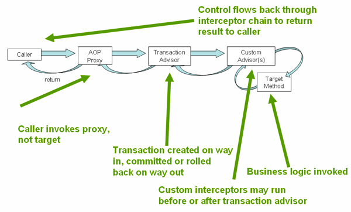

# 事务管理
## 事务的演变
事务本来存在全局事务和本地事务的区别
- 全局事务
  主要是可以和多个事务性资源进行交互，也就是伪分布式事务（单机上的多个资源的协同事务处理)
- 本地事务
  特定于单个事务性资源,也就是不支持跨多个事务性资源处理

并且一般来说，全局事务需要一个应用服务器以及容器管理型事务进行声明性事务管理,这里
统称的全局事务属于JTA(java transaction api),它们需要使用jndi,同样ejb容器同样需要
使用jndi,但是ejb相当的笨重,所以一般不是事务管理的首选 ... \
于是Spring通过同一个的事务抽象模型解决了全局事务和本地事务的兼容性问题以及各种缺点，通过
统一的事务管理器抽象，仅仅只需要修改bean 配置就可以切换事务类型并不需要修改任何事务代码
从而实现方便的事务管理，并且屏蔽了底层细节能够让事务api更加的简单 ...
## 事务涉及内容
也就是事务定义,一个事务定义决定了一个事务是否应该开启，或者是否在已有的以及事务传播、隔离级别，以及事务执行超时
时间以及它的回滚策略或者说是否为一个只读事务,那么这些统统通过事务定义来决定 ..
### 事务对象
spring 通过一个事务状态来简化一个事务的执行，通过TransactionStatus能够知道一个事务的状态、
并且可以查询事务的 状态或者修改事务的状态 ... 例如刷新 / 回滚 / 提交 ..
## 事务模型切换
在spring 事务中,我们仅仅只需要修改bean 定义,它们都存放到ioc容器中, 通过这种隔离抽象让
spring的事务抽象能够从spring本身解耦,这就是一个有价值的抽象 ... 当我们想要切换事务类型时，
仅仅只需要注册对应的bean 定义即可，这相比于 修改事务代码更加的方便、简单 ...
> 对于jndi的情况下,例如 jta情况下,需要的dataSource 使用了来自 jndi的bean,例如使用的是
```xml
 <jee:jndi-lookup id="dataSource" jndi-name="jdbc/jpetstore"/>
```
那么了解[The JEE Schema](https://docs.spring.io/spring-framework/docs/current/reference/html/integration.html#integration.appendix.xsd-schemas-jee)
查看 jndi的规范 ..
> 如果使用jta,那么它能够使用任何事务性资源，这是由于jta 事务是一个全局事务，它能够利用任何事务
性资源 ..

## hibernate 事务配置
能够使用hibernate 本地事务,只需要配置一个hibernate LocalSessionFactoryBean, 然后应用能够
从中获取一个Hibernate Session 实例 ..
> 注意如果一个DataSource(由非JTA 事务管理器使用) - 并且通过JNDI查询且通过Jakarta EE 容器进行管理
> 它应该是非事务性的,因为Spring框架管理事务 ..

hibernate的事务下,事务管理器必然是HibernateTransactionManager类型,它们都需要一个DataSource,同样
HibernateTransactionManager 还需要一个SessionFactory,以下的示例展示了如何使用一个事务管理器：
```xml
<bean id="sessionFactory" class="org.springframework.orm.hibernate5.LocalSessionFactoryBean">
    <property name="dataSource" ref="dataSource"/>
    <property name="mappingResources">
        <list>
            <value>org/springframework/samples/petclinic/hibernate/petclinic.hbm.xml</value>
        </list>
    </property>
    <property name="hibernateProperties">
        <value>
            hibernate.dialect=${hibernate.dialect}
        </value>
    </property>
</bean>

<bean id="txManager" class="org.springframework.orm.hibernate5.HibernateTransactionManager">
    <property name="sessionFactory" ref="sessionFactory"/>
</bean>
```
或者如果你使用Hibernate 以及Jakarta EE 容器管理的事务,那么替换为JtaTransactionManager类型即可,同样只需要加入
Hibernate相关的配置即可,并且同样需要通过事务协调器让Hibernate 感知到 JTA的存在 以及连接释放模式配置处理:
```xml
<bean id="sessionFactory" class="org.springframework.orm.hibernate5.LocalSessionFactoryBean">
    <property name="dataSource" ref="dataSource"/>
    <property name="mappingResources">
        <list>
            <value>org/springframework/samples/petclinic/hibernate/petclinic.hbm.xml</value>
        </list>
    </property>
    <property name="hibernateProperties">
        <value>
            hibernate.dialect=${hibernate.dialect}
        </value>
    </property>
</bean>

<bean id="txManager" class="org.springframework.orm.hibernate5.HibernateTransactionManager">
    <property name="sessionFactory" ref="sessionFactory"/>
</bean>
```
或者直接传递jta 事务管理器
```xml
<bean id="sessionFactory" class="org.springframework.orm.hibernate5.LocalSessionFactoryBean">
    <property name="dataSource" ref="dataSource"/>
    <property name="mappingResources">
        <list>
            <value>org/springframework/samples/petclinic/hibernate/petclinic.hbm.xml</value>
        </list>
    </property>
    <property name="hibernateProperties">
        <value>
            hibernate.dialect=${hibernate.dialect}
            hibernate.transaction.coordinator_class=jta
            hibernate.connection.handling_mode=DELAYED_ACQUISITION_AND_RELEASE_AFTER_STATEMENT
        </value>
    </property>
</bean>

<bean id="txManager" class="org.springframework.transaction.jta.JtaTransactionManager"/>
```

## 事务资源同步
事务管理器也可以实现对事务资源的同步,那么主要是通过持久化api(例如，jdbc,hibernate,jpa)去管理资源的创建 / 重用
/还有正确的清理 ...
### 高级的同步方式
首选的方式是使用spring的高级基于默认的持久化集成api或者使用原生的 orm api与事务感知的工厂bean/代理进行原生的资源工厂管理 ..
这些事务感知解决方案內部处理资源的创建/ 重用/ 清理/ 可选的资源事务同步以及异常映射,那就是用户数据访问代码并没有解释这些任务,
它们仅仅存粹集中于处理非模版化的持久化逻辑,通常来说你可以使用原生的orm api 或者采用模版方式进行jdbc访问(例如jdbcTemplate) ..
### 底层同步方式
例如DataSourceUtils(for jdbc ),EntityManagerFactoryUtils(for jpa),SessionFactoryUtils(for hibernate),以及其他存在的
底层api ...当你需要直接处理这些底层持久化api的资源类型时，通过这些类正确获取Spring框架所管理的实例,以及可选的同步的事务,以及在处理过程中
出现的异常正确的映射到一致的api .. \
例如如果使用jdbc,那么使用以下代码获取一个数据库连接
```java
Connection conn = DataSourceUtils.getConnection(dataSource);
```
也就是遵循 spring框架的约定处理 ..
如果已经存在的事务包含了一个同步链接的连接，那么返回当前连接实例(存在事务基于线程绑定) ... 否则这个方法将触发创建一个新的连接,这能够（可选的）同步到
任何已有的存在的事务并在后续相同的事务下重用此连接... 并且任何SQLException 将会被SpringFramework的CannotGetJdbcConnectionException进行
包装,形成了一致的持久化异常处理映射,这个异常仅仅是spring框架下的DataAccessException 类型体系下的其中一个 .. \
这个方法相比于从SQLException让你能够获取到更多信息并且可以确保跨数据库移植性以及跨不同的持久化技术 .. \
这种方式不需要spring 事务管理(事务同步是可选的),因此你能够在任何情况下使用它 .. \
当然,一旦你使用了Spring的jdbc 支持, jpa支持或者 hibernate 支持,你通常将不会使用DataSourceUtils或者其他帮助类,因为通过Spring抽象能够更好的工作
相比于直接通过相关的api来说 .. \
例如,你使用JdbcTemplate 或者 jdbc.object包中的类来简化jdbc的使用,正确的连接抓取发生在这些场景之后并且你不需要写任何特定的代码 ...

### 事务感知数据库代理
最底层存在一个TransactionAwareDataSourceProxy类，它将代理目标DataSource,它将包装目标DataSource去增加对spring管理事务的感知，在这个方面下,它类似于
事务性 jndi DataSource(通过 jakarta EE 服务器提供) ... \
这句话可能很抽象,仅仅是它能够基于不同的事务获取到不同的连接(举个例子,JDBC),代理的本质就是为了实现一对多的关系 ... \
一般来说你不会需要或者想要使用这个类,除非现有的代码必须被调用并且需要传递到一个标准的jdbc DataSource接口实现 . \
在这种情况下,此代码可用但是它参与到了Spring管理的事务中,你能够使用前面提到的高级抽象编写新的代码 ..

## 声明式事务
spring框架支持声明式事务管理,并且是通过aop实现的,并且不需要理解aop就能够使用,这是侵入性最小的方式 .. \
并且此方式类似于EJB CMT,我们能够指定事务行为或者缺失的（反义词,排他性处理）到独立的方法级别上.. 你能够在事务\
上下文中进行setRollbackOnly()调用,如果有必要 .. \
两种事务管理的不同是:
- spring 事务管理不像ejb cmt,它是绑定到jta,声明式事务管理可以使用到任何环境,在jta 事务或者本地事务都可以使用,仅仅只需要调整配置文件 ..
- 能将声明式事务使用到任何类不仅仅是ejb中特定的类 ..
- spring框架提供了声明式回滚规则，一个ejb不支持的特性,且支持编程式或者声明式回滚规则都可以 ..
- spring让你能够通过aop定制事务性行为,你能够在事务回滚的情况性下插入自定义行为.. 你也能够增加任意通知，联同事务性通知 。。,使用ejb cmt时，
  你不能够影响容器的事务管理,除了设置 rollbackOnly ..(setRollbackOnly())..
- Spring Framework 不像高端应用程序服务器那样支持跨远程调用传播事务上下文,如果你需要这个特性,推荐使用ejb,使用之前考虑清楚,一般不希望让事务跨越远程调用 ..

回滚规则的概念非常重要,让你能够指定那些异常能够自动回滚,你能够声明式指定,通过配置而不是java代码,同样你仍然能够设置setRollbackOnly(),在当前
TransactionStatus对象上去回滚当前事务进行返回,这样做的优势业务对象不依赖于事务基础设施,例如通常不需要倒入Spring事务性api或者其他Spring apis .. \
尽管 ejb容器默认的行为自动在系统级异常下回滚事务(通常是一个运行时异常),ejb cmt 并不会自动回滚事务(在应用级异常上) - 那就是除了java.rmi.RemoteException的其他检查异常 ...\
spring默认的声明式事务管理的行为遵守ejb的约定(回滚未检查异常),通常可以定制这个行为 ...
### 理解spring 框架的声明式事务实现
不仅仅为了教会你如何使用,还希望理解它如何工作,声明式事务是通过 aop 代理启用的,并且事务通知是通过元数据(配置或者注解),aop 和事务元数据合并提供了一个 aop代理(
使用 TransactionInterceptor 结合一个合适的 TransactionManager 实现进行围绕方法执行进行事务驱动 ..) \
TransactionInterceptor 提供声明式 以及响应式编程模型的事务管理 ,这个拦截器检测事务管理的实际偏好(通过检测方法的返回类型), 如果方法返回一个响应式类型（例如,Publisher或者
Kotlin的 Flow或者这些类型的子类型 - 对于响应式事务管理是合法的 ... \
事务管理器风格影响了实际需要哪一种事务管理器 .. 声明式事务需要一个 PlatformTransactionManager,响应式事务使用ReactiveTransactionManager 实现 ...

> @Transactional 通常是基于线程绑定的事务且通过PlatformTransactionManager进行管理,在当前执行线程中暴露一个事务范围(为所有的数据访问操作),这不会传播到
> 当前方法內新启动的线程 ..
> 响应式事务是通过ReactiveTransactionManager 管理的,它使用Reactor 上下文而不是基于线程本地属性 .. 因此,所有参与的数据访问操作需要在相同的的响应式管道中的相同Reactor 上下文中执行 ..

以下的照片展示了一个事务性代理上的方法调用概念图：

### 声明式事务示例
这个示例中,DefaultFooService 将在每一个实现方法上抛出一个 UnsupportedOperationException,此行为将导致事务被创建并且根据此异常实例来进行回滚处理 ..
```java
public interface FooService {

    Foo getFoo(String fooName);

    Foo getFoo(String fooName, String barName);

    void insertFoo(Foo foo);

    void updateFoo(Foo foo);

}
```
以下的示例展示了前面的接口实现
```java
public class DefaultFooService implements FooService {

    @Override
    public Foo getFoo(String fooName) {
        // ...
    }

    @Override
    public Foo getFoo(String fooName, String barName) {
        // ...
    }

    @Override
    public void insertFoo(Foo foo) {
        // ...
    }

    @Override
    public void updateFoo(Foo foo) {
        // ...
    }
}
```
假设FooService接口的前两个方法必须运行在只读语义的事务上下文中,其他的必须运行在读写语义的事务上下文中 ..,那么配置如下:
```xml
<!-- from the file 'context.xml' -->
<?xml version="1.0" encoding="UTF-8"?>
<beans xmlns="http://www.springframework.org/schema/beans"
    xmlns:xsi="http://www.w3.org/2001/XMLSchema-instance"
    xmlns:aop="http://www.springframework.org/schema/aop"
    xmlns:tx="http://www.springframework.org/schema/tx"
    xsi:schemaLocation="
        http://www.springframework.org/schema/beans
        https://www.springframework.org/schema/beans/spring-beans.xsd
        http://www.springframework.org/schema/tx
        https://www.springframework.org/schema/tx/spring-tx.xsd
        http://www.springframework.org/schema/aop
        https://www.springframework.org/schema/aop/spring-aop.xsd">

    <!-- this is the service object that we want to make transactional -->
    <bean id="fooService" class="x.y.service.DefaultFooService"/>

    <!-- the transactional advice (what 'happens'; see the <aop:advisor/> bean below) -->
    <tx:advice id="txAdvice" transaction-manager="txManager">
        <!-- the transactional semantics... -->
        <tx:attributes>
            <!-- all methods starting with 'get' are read-only -->
            <tx:method name="get*" read-only="true"/>
            <!-- other methods use the default transaction settings (see below) -->
            <tx:method name="*"/>
        </tx:attributes>
    </tx:advice>

    <!-- ensure that the above transactional advice runs for any execution
        of an operation defined by the FooService interface -->
    <aop:config>
        <aop:pointcut id="fooServiceOperation" expression="execution(* x.y.service.FooService.*(..))"/>
        <aop:advisor advice-ref="txAdvice" pointcut-ref="fooServiceOperation"/>
    </aop:config>

    <!-- don't forget the DataSource -->
    <bean id="dataSource" class="org.apache.commons.dbcp.BasicDataSource" destroy-method="close">
        <property name="driverClassName" value="oracle.jdbc.driver.OracleDriver"/>
        <property name="url" value="jdbc:oracle:thin:@rj-t42:1521:elvis"/>
        <property name="username" value="scott"/>
        <property name="password" value="tiger"/>
    </bean>

    <!-- similarly, don't forget the TransactionManager -->
    <bean id="txManager" class="org.springframework.jdbc.datasource.DataSourceTransactionManager">
        <property name="dataSource" ref="dataSource"/>
    </bean>

    <!-- other <bean/> definitions here -->

</beans>

```
当然事务性通知中的`transaction-manager` 属性可以省略,如果TransactionManager的bean名称是`transactionManager`. 如果此bean 不是这个名称,
那么你需要显式指定 ... \
aop配置 指示了事务切面,其中的切入点指示需要在那些方法上进行横切,拦截并被顾问进行通知执行 .. \
前面的配置将会被用来根据`fooService` bean 定义去创建一个事务性代理（围绕此bean 进行事务性通知处理),这个代理将会在合适的时候执行事务性通知,
例如当代理上的合适的方法执行时,一个事务将会被创建/ 暂停 / 标记为只读 以及其他,依赖于执行方法关联的事务配置 ) \
考虑如下的程序测试前面的配置:
```java
public final class Boot {

    public static void main(final String[] args) throws Exception {
        ApplicationContext ctx = new ClassPathXmlApplicationContext("context.xml");
        FooService fooService = ctx.getBean(FooService.class);
        fooService.insertFoo(new Foo());
    }
}


```
上面程序输入类似如下(有关DefaultFooService类的insertFoo(..)方法抛出的UnsupportedOperationException 堆栈 以及 log4j输出被省略了):
```text
<!-- the Spring container is starting up... -->
[AspectJInvocationContextExposingAdvisorAutoProxyCreator] - Creating implicit proxy for bean 'fooService' with 0 common interceptors and 1 specific interceptors

<!-- the DefaultFooService is actually proxied -->
[JdkDynamicAopProxy] - Creating JDK dynamic proxy for [x.y.service.DefaultFooService]

<!-- ... the insertFoo(..) method is now being invoked on the proxy -->
[TransactionInterceptor] - Getting transaction for x.y.service.FooService.insertFoo

<!-- the transactional advice kicks in here... -->
[DataSourceTransactionManager] - Creating new transaction with name [x.y.service.FooService.insertFoo]
[DataSourceTransactionManager] - Acquired Connection [org.apache.commons.dbcp.PoolableConnection@a53de4] for JDBC transaction

<!-- the insertFoo(..) method from DefaultFooService throws an exception... -->
[RuleBasedTransactionAttribute] - Applying rules to determine whether transaction should rollback on java.lang.UnsupportedOperationException
[TransactionInterceptor] - Invoking rollback for transaction on x.y.service.FooService.insertFoo due to throwable [java.lang.UnsupportedOperationException]

<!-- and the transaction is rolled back (by default, RuntimeException instances cause rollback) -->
[DataSourceTransactionManager] - Rolling back JDBC transaction on Connection [org.apache.commons.dbcp.PoolableConnection@a53de4]
[DataSourceTransactionManager] - Releasing JDBC Connection after transaction
[DataSourceUtils] - Returning JDBC Connection to DataSource

Exception in thread "main" java.lang.UnsupportedOperationException at x.y.service.DefaultFooService.insertFoo(DefaultFooService.java:14)
<!-- AOP infrastructure stack trace elements removed for clarity -->
at $Proxy0.insertFoo(Unknown Source)
at Boot.main(Boot.java:11)

```
其中AspectJInvocationContextExposingAdvisorAutoProxyCreator 已经在spring-2.5命名修改为 AspectJAwareAdvisorAutoProxyCreator,详情查看[spring-2.5.x-changelog](https://github.com/cbeams/spring-framework-2.5.x/blob/master/changelog.txt)
对于响应式事务管理,那么代码需要使用响应式类型 ...
> spring框架使用ReactiveAdapterRegistry 决定是否一个方法返回类型是响应式的 ..

以下是响应式类型的版本示例:
```java
public interface FooService {

    Flux<Foo> getFoo(String fooName);

    Publisher<Foo> getFoo(String fooName, String barName);

    Mono<Void> insertFoo(Foo foo);

    Mono<Void> updateFoo(Foo foo);

}

public class DefaultFooService implements FooService {

  @Override
  public Flux<Foo> getFoo(String fooName) {
    // ...
  }

  @Override
  public Publisher<Foo> getFoo(String fooName, String barName) {
    // ...
  }

  @Override
  public Mono<Void> insertFoo(Foo foo) {
    // ...
  }

  @Override
  public Mono<Void> updateFoo(Foo foo) {
    // ...
  }
}


```
命令式和响应式事务管理共享想通过的事务边界和事务属性定义的相同语义 .. 两者的主要区别是一个是延迟执行 .. \
TransactionInterceptor 将会使用事务性操作符装饰返回的响应式类型去启动或者清理事务 .. 因此调用一个事务性\
响应式方法将会延迟到实际的事务管理到激活这个响应式类型处理的订阅类型 .. \
响应式事务管理的有关数据封装的另一个方面是这本就是编程模型的自然结果 .. \
命令式事务的方法返回值将从方法的成功中断之后的事务性方法中返回,因此部分计算结果将不会逃脱方法范围 .. \
响应式事务方法返回了一个响应式的包装类型,它呈现了一个计算结果（通过使用一个promise去开始并完成计算）.. \
发布者可以在事务正在进行但不一定完成时发出数据。因此，依赖于整个事务成功完成的方法需要确保调用代码中的完成和缓存结果 ..(不是很理解,
但是是一个方法调用了事务性方法，并根据promise 进行完成(completed)并在回调中记录结果) ..

### 声明式事务的回滚
前面的部分描述了如何根据类或者通常是服务层类指定事务性配置的基础(声明式),现在如何进行事务的控制回滚,同样是声明式配置,了解根据@Transactional注解进行
声明式回滚语义控制,查看 [@Transactional](https://docs.spring.io/spring-framework/docs/current/reference/html/data-access.html#transaction-declarative-attransactional-settings).. \
推荐方式是指示Spring框架的事务基础设施 进行事务工作（通过从代码中抛出一个Exception - 当前事务执行的上下文中) .. 这个Spring框架的事务基础设施代码将会捕获任何未处理的Exception(从调用栈中冒泡)并根据它来决定
是否进行事务回滚 .. \
默认配置中,Spring的事务基础设施代码标记事务回滚的情况是仅仅为运行时，且未检查异常 .. 那就是当抛出的异常是一个RuntimeException或者它的子类的实例时(Error 同样也是)将 \
进行回滚,从事务性方法中抛出的已检查的异常将不会导致回滚 .. \
你可以配置那些异常类型应该回滚，包括已检查异常(通过指定回滚规则) ...
> 回滚规则
> 决定那些异常抛出时应该进行事务回滚,基于异常类型或者异常模式 ..
> 回滚规则可以xml 可以通过rollback-for / no-rollback-for属性配置,这些规则将会定义为pattern,当使用@Transactional时,rollback 规则能够通过rollbackFor/noRollbackFor进行配置或者 \
> rollbackForClassName / noRollbackForClassName 属性,这允许规则能够基于异常类型或者异常pattern定义(分别定义) ..
> 当一个回滚规则定义为异常类型时,这个类型将会根据抛出异常的类型或者它的父类型进行比较,提供类型安全并避免使用模式时可能发生的任何意外匹配,举个例子:
> `jakarta.servlet.ServletException.class`将仅仅匹配 `jakarta.servlet.ServletException`以及它的子类 ..
> 当回滚模式根据异常模式定义时，模式能够是一个完全限定类名称或者字串（但是必须是Throwable的子类),不支持任何通配符支持,例如"jakarta.servlet.ServletException" 或者"ServletException" 将匹配 
> jakarta.servlet.ServletException 以及 它的子类 以及任何名称中携带了"ServletException"的异常 .. \
> 
> 警告:
> 由于模式仅仅是字串匹配,所以你需要考虑是否包括package信息来提高异常匹配命中率 .. 根据业务场景决定 ..
> 因此,基于模式的回滚规则也许可能导致意外的匹配,例如规则如果是"com.example.CustomException",那么它可能匹配
> "com.example.CustomExceptionV2"或者 "com.example.CustomException$AnotherException"

以下的xml快照说明如何配置一个已检查，应用特定的异常类型,通过使用rollback-for属性的异常模式:
```xml
<tx:advice id="txAdvice" transaction-manager="txManager">
    <tx:attributes>
        <tx:method name="get*" read-only="true" rollback-for="NoProductInStockException"/>
        <tx:method name="*"/>
    </tx:attributes>
</tx:advice>
```
如果你不想要哪些异常抛出时进行事务回滚,那么你能够指定"no rollback" 规则,这以下的示例告诉了Spring框架事务基础设施提交指定的事务(即使它出现了InstrumentNotFoundException)
```xml
<tx:advice id="txAdvice">
    <tx:attributes>
        <tx:method name="updateStock" no-rollback-for="InstrumentNotFoundException"/>
        <tx:method name="*"/>
    </tx:attributes>
</tx:advice>
```
当Spring框架的事务基础设施捕捉到一个异常并且根据配置的回滚规则去决定是否一个事务应该回滚,最强的匹配规则赢 ,所以在以下的配置下,任何不是InstrumentNotFoundException的异常将会被回滚 ..
```xml<tx:advice id="txAdvice">
    <tx:attributes>
        <tx:method name="*" rollback-for="Throwable" no-rollback-for="InstrumentNotFoundException"/>
    </tx:attributes>
</tx:advice>
```
你也能够编程式指定一个必要的回滚,但是这种方式耦合且侵入性非常高
```java
public void resolvePosition() {
    try {
        // some business logic...
    } catch (NoProductInStockException ex) {
        // trigger rollback programmatically
        TransactionAspectSupport.currentTransactionStatus().setRollbackOnly();
    }
}
```
非常强烈鼓励去通过声明式方式进行回滚,如果可能.. 编程式回滚可用,但是你应该尽量减少使用它 ..
它的使用过与实现干净的基于POJO架构的方式背道而驰 ..

### 配置不同的事务语义(为不同的bean)
很简单,只需要配置多个不同的事务aop 顾问配置即可 ..
```xml
<?xml version="1.0" encoding="UTF-8"?>
<beans xmlns="http://www.springframework.org/schema/beans"
    xmlns:xsi="http://www.w3.org/2001/XMLSchema-instance"
    xmlns:aop="http://www.springframework.org/schema/aop"
    xmlns:tx="http://www.springframework.org/schema/tx"
    xsi:schemaLocation="
        http://www.springframework.org/schema/beans
        https://www.springframework.org/schema/beans/spring-beans.xsd
        http://www.springframework.org/schema/tx
        https://www.springframework.org/schema/tx/spring-tx.xsd
        http://www.springframework.org/schema/aop
        https://www.springframework.org/schema/aop/spring-aop.xsd">

    <aop:config>

        <aop:pointcut id="serviceOperation"
                expression="execution(* x.y.service..*Service.*(..))"/>

        <aop:advisor pointcut-ref="serviceOperation" advice-ref="txAdvice"/>

    </aop:config>

    <!-- these two beans will be transactional... -->
    <bean id="fooService" class="x.y.service.DefaultFooService"/>
    <bean id="barService" class="x.y.service.extras.SimpleBarService"/>

    <!-- ... and these two beans won't -->
    <bean id="anotherService" class="org.xyz.SomeService"/> <!-- (not in the right package) -->
    <bean id="barManager" class="x.y.service.SimpleBarManager"/> <!-- (doesn't end in 'Service') -->

    <tx:advice id="txAdvice">
        <tx:attributes>
            <tx:method name="get*" read-only="true"/>
            <tx:method name="*"/>
        </tx:attributes>
    </tx:advice>

    <!-- other transaction infrastructure beans such as a TransactionManager omitted... -->

</beans>
```
如下示例展示了如何配置两个不同的bean(使用完全不同的事务配置)
```xml
<?xml version="1.0" encoding="UTF-8"?>
<beans xmlns="http://www.springframework.org/schema/beans"
    xmlns:xsi="http://www.w3.org/2001/XMLSchema-instance"
    xmlns:aop="http://www.springframework.org/schema/aop"
    xmlns:tx="http://www.springframework.org/schema/tx"
    xsi:schemaLocation="
        http://www.springframework.org/schema/beans
        https://www.springframework.org/schema/beans/spring-beans.xsd
        http://www.springframework.org/schema/tx
        https://www.springframework.org/schema/tx/spring-tx.xsd
        http://www.springframework.org/schema/aop
        https://www.springframework.org/schema/aop/spring-aop.xsd">

    <aop:config>

        <aop:pointcut id="defaultServiceOperation"
                expression="execution(* x.y.service.*Service.*(..))"/>

        <aop:pointcut id="noTxServiceOperation"
                expression="execution(* x.y.service.ddl.DefaultDdlManager.*(..))"/>

        <aop:advisor pointcut-ref="defaultServiceOperation" advice-ref="defaultTxAdvice"/>

        <aop:advisor pointcut-ref="noTxServiceOperation" advice-ref="noTxAdvice"/>

    </aop:config>

    <!-- this bean will be transactional (see the 'defaultServiceOperation' pointcut) -->
    <bean id="fooService" class="x.y.service.DefaultFooService"/>

    <!-- this bean will also be transactional, but with totally different transactional settings -->
    <bean id="anotherFooService" class="x.y.service.ddl.DefaultDdlManager"/>

    <tx:advice id="defaultTxAdvice">
        <tx:attributes>
            <tx:method name="get*" read-only="true"/>
            <tx:method name="*"/>
        </tx:attributes>
    </tx:advice>

    <tx:advice id="noTxAdvice">
        <tx:attributes>
            <tx:method name="*" propagation="NEVER"/>
        </tx:attributes>
    </tx:advice>

    <!-- other transaction infrastructure beans such as a TransactionManager omitted... -->

</beans>
```
### <tx:advice/> 配置
这部分总结了各种事务性配置,但是xml形式很少使用了,并且配置属性也很简单 ...

| 属性 | 必填 | 默认值 | 描述 |
|---- | ---- | ---- | ---- |
| name | Yes | | 与事务属性关联的方法名称。通配符（*）可用于将相同的事务属性设置与多种方法关联（例如，get*、handle*、on*Event等）。 | 
| propagation | No | REQUIRED | 事务传播行为。 | 
| isolation | No | DEFAULT | 事务隔离级别。仅适用于REQUIRED或REQUIRES_NEW的传播设置。 | 
| timeout | No | -1 | 事务超时（秒）。仅适用于REQUIRED或REQUIRES_NEW传播。 | 
| read-only | No | false | 读写与只读事务。仅适用于REQUIRED或REQUIRES_NEW。 | 
| rollback-for | No | | 以逗号分隔的触发回滚的Exception实例列表。例如，com.foo.MyBusinessException，ServletException。 | 
| no-rollback-for | No | | 不触发回滚的Exception实例的逗号分隔列表。例如，com.foo.MyBusinessException、ServletException。 |

### 使用@Transactional
jakarta.transaction.Transactional 作为 spring自己的事务注解的自然替代(drop-in)
```java
// the service class that we want to make transactional
@Transactional
public class DefaultFooService implements FooService {

    @Override
    public Foo getFoo(String fooName) {
        // ...
    }

    @Override
    public Foo getFoo(String fooName, String barName) {
        // ...
    }

    @Override
    public void insertFoo(Foo foo) {
        // ...
    }

    @Override
    public void updateFoo(Foo foo) {
        // ...
    }
}
```
这是类级别的使用,包括了声明了的所有方法 以及它子类的所有方法将被事务管理 ...,同样可以独立使用在方法级别傻姑娘 ..,
不同之处是你需要使用@EnableTransactionManagement 启用事务管理(相比于xml 配置来说) .. 、
响应式的写法类似:
```java
// the reactive service class that we want to make transactional
@Transactional
public class DefaultFooService implements FooService {

    @Override
    public Publisher<Foo> getFoo(String fooName) {
        // ...
    }

    @Override
    public Mono<Foo> getFoo(String fooName, String barName) {
        // ...
    }

    @Override
    public Mono<Void> insertFoo(Foo foo) {
        // ...
    }

    @Override
    public Mono<Void> updateFoo(Foo foo) {
        // ...
    }
}
```
但是注意到有一些特定的考虑(返回Publisher, 为了Reactive Streams 取消信号)，查看[Cancel Signals](https://docs.spring.io/spring-framework/docs/current/reference/html/data-access.html#tx-prog-operator-cancel) 了解更多 ..
> 方法可见性以及 @Transactional
> 当你联同spring标准配置使用事务性代理，你应该应用@Transactional 注解到具有public 可见性的方法,如果你注解到protected / private或者包可见的方法,没有错误抛出,但是注释的方法将不会展示配置的事务性配置 .. \
> 如果你需要注释非共有方法,考虑以下段落中关于基于类的代理的提示或者考虑使用AspectJ编译时或者加载时编织 .. \
> 当你在@Configuration类上使用 @EnableTransactionManagement,protected或者包可见方法能够让基于类的代理的方法变得具有事务性，通过注册自定义的transactionAttributeSource bean(如下所示),注意到不管怎样, \
> 基于接口的代理的事务性方法必须总是public 并且定义在被代理的接口上 ..

```java
/**
 * Register a custom AnnotationTransactionAttributeSource with the
 * publicMethodsOnly flag set to false to enable support for
 * protected and package-private @Transactional methods in
 * class-based proxies.
 *
 * @see ProxyTransactionManagementConfiguration#transactionAttributeSource()
 */
@Bean
TransactionAttributeSource transactionAttributeSource() {
    return new AnnotationTransactionAttributeSource(false);
}
```
上面这个注册了一个能够让基于类代理能够让非public 修饰符的方法具有事务性 ..
> spring TestContext 框架支持非私有的@Transactional 测试方法(默认支持) ...
 
你能够使用@Transactional 注解到接口定义中(一个接口的方法上 / 或者一个类定义上 或者类的方法上).. \
然而,仅仅只有这个注解是不足以激活事务行为的,@Transactional 注解仅仅是元数据(能够被某些运行时基础设施消费 - 感知@Transactional)并且将 \
使用这些元数据来配置具有适合事务性行为的bean..\
在前面这个示例中,<tx:annotation-driven /> 元素启用了事务性行为 ..

> spring 团队推荐使用@Transactional注解到具体的类或者方法(相比于注解到接口上),某些时候你可以将注解放置到接口上或者接口的方法上 \
> 但是仅仅在你使用基于接口的代理情况下才会如期工作,事实上java注解不会继承来自接口的,如果你使用基于类代理(proxy-target-class="true")或者基于
> 编织的模式是(mode="aspectj") - 基于编织切面的情况下,那么事务配置就不会被代理以及编织基础设施识别,那么目标对象也不会包装到一个事务性代理中 .. \
> 
> 在代理模式下(mode="proxy")- 这是默认行为,仅仅通过代理发起的外部方法调用才会被拦截,这意味着自调用(事实上在目标对象中的方法调用了目标对象的另一个方法) \
> 将不会导致实际的事务（例如一个新事务）即使执行的方法标记了@Transactional(也就是事务失效),那么代理必须完全被初始化来提供期待的行为,
> 所以你不应该在你的初始化代码中依赖这个特性⟩——⟩例如，在@PostConstruct 方法中。-因为此时还没有完全初始化来提供对应的行为) ..

考虑到使用AspectJ模式(如果你希望自调用也进行事务拦截),那么将不存在代理,其次,目标类将会被编织（那就是字节码将会被修改)来支持@Transactional在特定种类的方法上的运行时行为 ..

| XML属性               | 注解属性                                              | 默认值                       | 描述                                                                                                                                                                                                                      |
|---------------------|---------------------------------------------------|---------------------------|-------------------------------------------------------------------------------------------------------------------------------------------------------------------------------------------------------------------------|
| transaction-manager | N/A (查看 Transaction-ManagementConfigurer-javadoc) | transactionManager        | 要使用的事务管理器的名称。如上例所示，仅当事务管理器的名称不是transactionManager时才需要。                                                                                                                                                                  | 
| mode                | mode                                              | proxy                     | 默认模式（代理）通过使用Spring的AOP框架来处理带注解的bean（遵循代理语义，如前所述，仅适用于通过代理传入的方法调用）。替代模式（aspectj）则将受影响的类与Spring的AspectJ事务切面进行编织，修改目标类字节码以应用于任何类型的方法调用。AspectJ编织需要在类路径中使用spring-aspects.jar并启用加载时编织（或编译时编织）。（有关如何设置加载时编织的详细信息，请参见Spring配置。） | 
| proxy-target-class  | proxyTargetClass                                  | false                     | 仅适用于代理模式。控制为使用@Transactional注解注释的类创建哪种类型的事务代理。如果proxy-target-class属性设置为true，则将创建基于类的代理。如果proxy-target-class为false或省略了属性，则将创建基于标准JDK接口的代理。（有关不同代理类型的详细检查，请参见代理机制。）                                                       | 
| order               | order                                             | Ordered.LOWEST_PRECEDENCE | 定义应用于带@Transactional注解的bean的事务通知的顺序。（有关AOP通知排序相关规则的更多信息，请参见通知顺序。)没有指定的顺序意味着AOP子系统确定通知的顺序。                                                                                                                               |

当然我们还可以通过TransactionManagementConfigurer 进行事务管理器配置器配置一个真正需要使用的事务管理器 .. \
> 注意到proxy-target-class 属性控制事务性代理类型将会使用来对@Transactional注解的注释类进行使用,如果设置为true,将使用基于类的代理\
> 否则将使用基于接口的代理类型创建目标事务性代理 ..
> 
> 注意:
>   @EnableTransactionManagement and <tx:annotation-driven/>  仅仅会查询相同它们所处的相同上下文的所有注释了@Transactional的bean,\
> 这意味着如果你放置一个注解驱动的配置到WebApplicationContext,它仅仅在controllers上检查@Transactional注解bean,而不是你的services,查看 mvc \
> 了解更多信息 ..
> 在为一个方法评估事务性配置时越贴近的优先级越高,由于可以在类上或者方法上配置事务,那么在方法上的事务配置相比于类上具有更高的优先级 ..
>
#### @Transactional
@Transactional注解是元数据，它指定接口、类或方法必须具有事务语义（例如，在调用此方法时启动一个全新的只读事务、暂停任何现有事务）。默认的@Transactional设置如下：

事物传播设置为PROPAGATION_REQUIRED。
事物隔离级别为ISOLATION_DEFAULT。
事务是读写的。
事务超时默认为基础事务系统的默认超时，如果不支持超时，则默认为无。
任何RuntimeException都会触发回滚，而任何检测的Exception都不会触发。
你可以更改这些默认设置。下表总结了@Transactional注解的各种属性：

| 属性                     | 类型                        | 描述                                     | 
|------------------------|---------------------------|----------------------------------------|
| value                  | String                    | 可选的限定符，指定要使用的事务管理器。                    | 
| propagation            | enum: Propagation         | 可选的传播设置。                               | 
| isolation              | enum: Isolation           | 可选的隔离级别。仅适用于REQUIRED或REQUIRES_NEW的传播值。 | 
| timeout                | int (以秒为单位)               | 可选的事务超时。仅适用于REQUIRED或REQUIRES_NEW的传播值。 | 
| readOnly               | boolean                   | 读写与只读事务。仅适用于REQUIRED或REQUIRES_NEW的值。   | 
| rollbackFor            | Class对象数组，必须从Throwable派生。 | 必须引起回滚的异常类的可选数组。                       | 
| rollbackForClassName   | 类名数组。这些类必须从Throwable派生。   | 必须引起回滚的异常类名称的可选数组。                     | 
| noRollbackFor          | Class对象数组，必须从Throwable派生。 | 不能导致回滚的异常类的可选数组。                       | 
| noRollbackForClassName | 字符串类名称的数组，必须从Throwable派生。 | 不能引起回滚的异常类名称的可选数组。                     |

当前你不能够显式的控制事务的名称，这里的名称意味着在一个事务监控器中出现的事务名称，如果可以(例如WebLogic的事务监视器) 并记录输出,对于 \
声明式事务,事务名称总是全限定类名+"." + 事务性通知的方法名，例如BusinessService类中的handlePayment(..)方法启动了一个事务,那么 \
事务的名称层将是com.example.BusinessService.handlePayment ...

#### 使用@Transactional的多个事务管理器
大多数Spring应用应该仅仅会用到一个事务管理器,但是有些情况下你可能会在单个应用中使用多个事务管理器,通过修改@Transactional注解的transactionManager  \
或者value属性来指定执行的事务管理器(这里可以是bean 名称或者事务管理器bean的限定符名称)，例如你使用了@Qualifier注解,你可以如下使用:
```java
public class TransactionalService {

    @Transactional("order")
    public void setSomething(String name) { ... }

    @Transactional("account")
    public void doSomething() { ... }

    @Transactional("reactive-account")
    public Mono<Void> doSomethingReactive() { ... }
}
```
对应的事务管理器
```xml
<tx:annotation-driven/>

    <bean id="transactionManager1" class="org.springframework.jdbc.datasource.DataSourceTransactionManager">
        ...
        <qualifier value="order"/>
    </bean>

    <bean id="transactionManager2" class="org.springframework.jdbc.datasource.DataSourceTransactionManager">
        ...
        <qualifier value="account"/>
    </bean>

    <bean id="transactionManager3" class="org.springframework.data.r2dbc.connectionfactory.R2dbcTransactionManager">
        ...
        <qualifier value="reactive-account"/>
    </bean>
```
这种情况下TransactionalService各个方法运行在单独的事务管理器中，通过不同的限定符修饰的事务管理器 .. \
默认的<tx:annotation-driven> 的默认的事务管理器名称为transactionManager,在没有符合的TransactionManager \
bean发现时仍然会使用默认的事务管理器 ..
#### 自定义组合注解
如果你发现在许多不同的方法上需要加入相同的属性,那么可以使用元注解支持,实现自定义组合注解进行使用
```java
@Target({ElementType.METHOD, ElementType.TYPE})
@Retention(RetentionPolicy.RUNTIME)
@Transactional(transactionManager = "order", label = "causal-consistency")
public @interface OrderTx {
}

@Target({ElementType.METHOD, ElementType.TYPE})
@Retention(RetentionPolicy.RUNTIME)
@Transactional(transactionManager = "account", label = "retryable")
public @interface AccountTx {
}

```
使用方式如下：
```java
public class TransactionalService {

    @OrderTx
    public void setSomething(String name) {
        // ...
    }

    @AccountTx
    public void doSomething() {
        // ...
    }
}


```
不同的元注解定义了不同的事务性标签 / 以及事务管理器限定符,也包括了不同的传播行为 / 回滚规则 / 超时时间 以及其他特性 ..
### 事务传播
在spring管理的事务中，需要感知物理和逻辑事务的不同,以及传播设置如何适用于这种差异。
#### 理解PROPAGATION_REQUIRED

这个传播行为强制一个物理事务,要么当前区域的没有本地事务存在或者参与到一个定义在更大范围的存在的外部事务中. 在同一线程内的公共调用堆栈中，这是一个很好的缺省值(例如一个服务层上代理到各种仓库方法，那么所有的底层资源都参与到了服务层的事务) - 这句话有没有引起
自己之前的疑问呢（@Transactional到底应该放在哪里,是mapper / 还是 service) ... 那么这里已经存在了答案 ..
> 默认情况下,一个参与的事务加入了外部范围的特征，安静的忽略本地的隔离级别,超时范围或者只读标志（如果需要）,考虑切换到validateExistingTransactions = true \
> 让给事务管理器能够拒绝隔离级别(当参加到一个具有不同隔离级别的一存在的事务中时),非宽松模式下也拒绝只读不匹配(那就是內部读写事务尝试参与到一个外部的只读范围內的事务)..

那就是在什么地方上进行@Transactional 取决于你的业务，取决于你的方法的实际使用情况,以及你数据的安全隔离级别（是否需要考虑参与到其他更大范围的事务中,是否允许不一致的隔离级别事务范围参与)
从而引起@Transactional的正确使用 ..(所以想将一个东西用好,还需要业务场景和经验) .. \
当传播设置是PROPAGATION_REQUIRED,那么根据这个应用的配置，每一个方法的逻辑事务范围也将被创建,每一个这样的逻辑事务范围能够独立的决定是否回滚(rollback-only),
这里是一个新的知识点(逻辑事务范围,可以决定是否仅仅回滚这一部分),那么外部的事务范围将逻辑独立于內部的事务范围 .. (注意是逻辑独立)\
在标准的PROPAGATION_REQUIRED行为下，所有的这些范围都将映射到相同的物理事务,因此一个在內部事务范围中设置的rollback-only标志也会影响外部事务的最终事务状态 ... \
然而,当一个內部事务范围设置为rollback-only,然而外部事务并没有决定回滚它自身，那么回滚（由內部事务范围安静触发）是不期待的 . 
一个对应的UnexpectedRollbackException将会在此时抛出，这是期待的行为(因此事务的调用者将不可能被误导去假设一个提交已经执行,但是实际上没有执行),因此 \
如果一个內部的事务(外部调用者无感知)默默的标记事务为rollback-only,那么外部调用者仍然调用提交,这外部的调用者需要接收一个这样的异常UnexpectedRollbackException 指示其实有一个 \
回滚已经执行 ..
#### PROPAGATION_REQUIRES_NEW

这将导致每一次都是用独立的物理事务(对影响的事务范围),绝不会参与到外部范围的已存在事务 ..在这种情况下,底层的资源事务是不同的,提交或者回滚都是独立的,外部事务将不会被一个內部事务的回滚状态影响 \
并且一个內部事务的锁会在它完成之后立即释放,例如一个独立的內部事务也能够声明自己的隔离级别，超时时间/read-only 配置并且不会继承外部特征,
这里所说的內部事务都是全新的物理事务 ..
#### PROPAGATION_NESTED
它表示具有多个保存点的单个物理事务（能够进行多次保存点回滚的传播行为),这样的部分回滚让一个內部事务能够仅仅回滚它所在范围的事务,外部的事务仍然能够继续（尽管某些操作已经回滚）,这通常映射到JDBC保存点 \
因此它仅仅和JDBC资源事务工作,查看 spring的DataSourceTransactionManager.

### 通知事务性操作
假设你想要同时运行事务性操作以及某些基本的分析通知,如何在<tx:annotation-driven />中实现这一点 .. \
假设你执行updateFoo(Foo)方法,你想要查看以下的动作:
- 配置的分析切面启动
- 事务通知运行
- 被通知对象的方法执行
- 事务提交
- 分析切面报道整个事务性方法执行的完整时间 ..

如下是上诉测试的通知类:
```java
public class SimpleProfiler implements Ordered {

    private int order;

    // allows us to control the ordering of advice
    public int getOrder() {
        return this.order;
    }

    public void setOrder(int order) {
        this.order = order;
    }

    // this method is the around advice
    public Object profile(ProceedingJoinPoint call) throws Throwable {
        Object returnValue;
        StopWatch clock = new StopWatch(getClass().getName());
        try {
            clock.start(call.toShortString());
            returnValue = call.proceed();
        } finally {
            clock.stop();
            System.out.println(clock.prettyPrint());
        }
        return returnValue;
    }
}
```
以及xml配置
```xml
<?xml version="1.0" encoding="UTF-8"?>
<beans xmlns="http://www.springframework.org/schema/beans"
    xmlns:xsi="http://www.w3.org/2001/XMLSchema-instance"
    xmlns:aop="http://www.springframework.org/schema/aop"
    xmlns:tx="http://www.springframework.org/schema/tx"
    xsi:schemaLocation="
        http://www.springframework.org/schema/beans
        https://www.springframework.org/schema/beans/spring-beans.xsd
        http://www.springframework.org/schema/tx
        https://www.springframework.org/schema/tx/spring-tx.xsd
        http://www.springframework.org/schema/aop
        https://www.springframework.org/schema/aop/spring-aop.xsd">

    <bean id="fooService" class="x.y.service.DefaultFooService"/>

    <!-- this is the aspect -->
    <bean id="profiler" class="x.y.SimpleProfiler">
        <!-- run before the transactional advice (hence the lower order number) -->
        <property name="order" value="1"/>
    </bean>

    <tx:annotation-driven transaction-manager="txManager" order="200"/>

    <aop:config>
            <!-- this advice runs around the transactional advice -->
            <aop:aspect id="profilingAspect" ref="profiler">
                <aop:pointcut id="serviceMethodWithReturnValue"
                        expression="execution(!void x.y..*Service.*(..))"/>
                <aop:around method="profile" pointcut-ref="serviceMethodWithReturnValue"/>
            </aop:aspect>
    </aop:config>

    <bean id="dataSource" class="org.apache.commons.dbcp.BasicDataSource" destroy-method="close">
        <property name="driverClassName" value="oracle.jdbc.driver.OracleDriver"/>
        <property name="url" value="jdbc:oracle:thin:@rj-t42:1521:elvis"/>
        <property name="username" value="scott"/>
        <property name="password" value="tiger"/>
    </bean>

    <bean id="txManager" class="org.springframework.jdbc.datasource.DataSourceTransactionManager">
        <property name="dataSource" ref="dataSource"/>
    </bean>

</beans>
```
下面的示例创建和之前一样的配置,但是使用纯xml声明的方式:
```xml
<?xml version="1.0" encoding="UTF-8"?>
<beans xmlns="http://www.springframework.org/schema/beans"
    xmlns:xsi="http://www.w3.org/2001/XMLSchema-instance"
    xmlns:aop="http://www.springframework.org/schema/aop"
    xmlns:tx="http://www.springframework.org/schema/tx"
    xsi:schemaLocation="
        http://www.springframework.org/schema/beans
        https://www.springframework.org/schema/beans/spring-beans.xsd
        http://www.springframework.org/schema/tx
        https://www.springframework.org/schema/tx/spring-tx.xsd
        http://www.springframework.org/schema/aop
        https://www.springframework.org/schema/aop/spring-aop.xsd">

    <bean id="fooService" class="x.y.service.DefaultFooService"/>

    <!-- the profiling advice -->
    <bean id="profiler" class="x.y.SimpleProfiler">
        <!-- run before the transactional advice (hence the lower order number) -->
        <property name="order" value="1"/>
    </bean>

    <aop:config>
        <aop:pointcut id="entryPointMethod" expression="execution(* x.y..*Service.*(..))"/>
        <!-- runs after the profiling advice (cf. the order attribute) -->

        <aop:advisor advice-ref="txAdvice" pointcut-ref="entryPointMethod" order="2"/>
        <!-- order value is higher than the profiling aspect -->

        <aop:aspect id="profilingAspect" ref="profiler">
            <aop:pointcut id="serviceMethodWithReturnValue"
                    expression="execution(!void x.y..*Service.*(..))"/>
            <aop:around method="profile" pointcut-ref="serviceMethodWithReturnValue"/>
        </aop:aspect>

    </aop:config>

    <tx:advice id="txAdvice" transaction-manager="txManager">
        <tx:attributes>
            <tx:method name="get*" read-only="true"/>
            <tx:method name="*"/>
        </tx:attributes>
    </tx:advice>

    <!-- other <bean/> definitions such as a DataSource and a TransactionManager here -->

</beans>

```
当然你还可以调整通知执行的顺序 ...
### 使用@Transactional 和AspectJ
使用注解以及 `spring-aspects.jar`中的 `org.springframework.transaction.aspectj.AnnotationTransactionAspect` 进行编织,
必须使用事务管理器来配置这个切面, 可以通过ioc容器来关注依赖注入此切面,最简单的方式是通过<tx:annotation-driven />元素配置此事务管理切面并指定个mode属性为 \
'aspectj'，由于关注的是在spring容器之外运行事务，下面演示如何编程式使用  \
以下示例展示了创建事务管理器并配置 AnnotationTransactionAspect 并使用它:
```java
// construct an appropriate transaction manager
DataSourceTransactionManager txManager = new DataSourceTransactionManager(getDataSource());

// configure the AnnotationTransactionAspect to use it; this must be done before executing any transactional methods
AnnotationTransactionAspect.aspectOf().setTransactionManager(txManager);
```
> 当你使用这个切面，你必须注释实现类(或者类和方法)而不是此类实现的接口,Aspectj 遵循java的规则(不继承接口上的注解) ..

在类上的@Transactional注解指定了此类上的任何public 方法的执行的默认事务语义 .. \
在同类上的方法上的@Transactional注解将覆盖给定类注解上的默认事务语义,你能够注释任何方法,不管可见性 .. \
为了使用AnnotationTransactionAspect编织你的应用,你必须使用AspectJ构建应用（查看 [Aspect Development Guide](https://www.eclipse.org/aspectj/doc/released/devguide/index.html)
或者使用加载时编织. spring主要使用加载时编织(结合Aspectj切面使用编织对应的bean) ...

## 编程式事务管理
spring 提供了编程式事务管理,
- 通过使用TransactionTemplate或者TransactionalOperator
- TransactionManager实现 .. \
spring团队通常推荐使用 TransactionTemplate 进行编程式事务管理(在命令式流中) /或者在TransactionalOperator(在响应式流中) .. ,第二种方式 \
类似于使用JTA UserTransaction api,虽然异常处理不那么麻烦 ..
### 使用TransactionTemplate
类似于其他spring template,例如jdbcTemplate,它使用回调的方式(释放了应用代码进行模版化获取/释放事务资源)并生成意向驱动的代码,
仅仅让我们的代码关注于我们需要干什么 .. 使用此api将会耦合Spring的事务基础设施和api,具体那种事务管理取决于开发需要并自己做出选择 .. \
应用代码必须运行在事务性上下文中并且显式的使用TransactionTemplate （类似下面的示例),作为一个应用开发这,我们能够编写一个 TransactionCallback\
实现(通常是一个匿名内部类)包含了需要在事务上下文中运行的代码,你能够将一个这样的实例传递到 `execute(..)`方法(TransactionTemplate暴露的),如下所示:
```java
public class SimpleService implements Service {

    // single TransactionTemplate shared amongst all methods in this instance
    private final TransactionTemplate transactionTemplate;

    // use constructor-injection to supply the PlatformTransactionManager
    public SimpleService(PlatformTransactionManager transactionManager) {
        this.transactionTemplate = new TransactionTemplate(transactionManager);
    }

    public Object someServiceMethod() {
        return transactionTemplate.execute(new TransactionCallback() {
            // the code in this method runs in a transactional context
            public Object doInTransaction(TransactionStatus status) {
                updateOperation1();
                return resultOfUpdateOperation2();
            }
        });
    }
}


```
如果没有返回值,你可以使用便利的TransactionCallbackWithoutResult类,在这个回调中如果需要回滚,只需要调用TransactionStatus对象的\
setRollbackOnly方法即可 ..
```java
transactionTemplate.execute(new TransactionCallbackWithoutResult() {

    protected void doInTransactionWithoutResult(TransactionStatus status) {
        try {
            updateOperation1();
            updateOperation2();
        } catch (SomeBusinessException ex) {
            status.setRollbackOnly();
        }
    }
});


```
#### 指定事务配置
默认一个事务模版包含默认事务配置,但是我们可以编程式自定义:
```java
public class SimpleService implements Service {

    private final TransactionTemplate transactionTemplate;

    public SimpleService(PlatformTransactionManager transactionManager) {
        this.transactionTemplate = new TransactionTemplate(transactionManager);

        // the transaction settings can be set here explicitly if so desired
        this.transactionTemplate.setIsolationLevel(TransactionDefinition.ISOLATION_READ_UNCOMMITTED);
        this.transactionTemplate.setTimeout(30); // 30 seconds
        // and so forth...
    }
}


```
但是你也可以通过配置自定义：
```xml
<bean id="sharedTransactionTemplate"
        class="org.springframework.transaction.support.TransactionTemplate">
    <property name="isolationLevelName" value="ISOLATION_READ_UNCOMMITTED"/>
    <property name="timeout" value="30"/>
</bean>

```
那么这样所有的service,将会应用相同的事务模板 .. 最终事务模板是线程安全的,它不会维护任何会话状态 .. 
然而它会维护配置状态,如果使用不同的事务配置,那么你需要创建不同的TransactionTemplate ...

#### 使用TransactionalOperator
TransactionalOperator 服从操作符设计 类似于其他响应式操作符,使用回调形式去释放应用代码的模版化代码需求并释放事务性资源,通过代码进行意向驱动 ..
假设一个服务如下:
```java
public class SimpleService implements Service {

    // single TransactionalOperator shared amongst all methods in this instance
    private final TransactionalOperator transactionalOperator;

    // use constructor-injection to supply the ReactiveTransactionManager
    public SimpleService(ReactiveTransactionManager transactionManager) {
        this.transactionalOperator = TransactionalOperator.create(transactionManager);
    }

    public Mono<Object> someServiceMethod() {

        // the code in this method runs in a transactional context

        Mono<Object> update = updateOperation1();

        return update.then(resultOfUpdateOperation2).as(transactionalOperator::transactional);
    }
}
```
两种使用方式: \

- 使用Project Reactor类型的操作符风格(mono.as(transactionalOperator::transactional)),
- 其他情况使用回调风格(transactionalOperator.execute(TransactionCallback<T>)) \

回滚方法仅仅只需要在对应的 ReactiveTransaction对象上 设置setRollbackOnly()即可 ..
```java
transactionalOperator.execute(new TransactionCallback<>() {

    public Mono<Object> doInTransaction(ReactiveTransaction status) {
        return updateOperation1().then(updateOperation2)
                    .doOnError(SomeBusinessException.class, e -> status.setRollbackOnly());
        }
    }
});

```

通过tcf 框架而不是SpringbootTest 则无法真正测试回滚 ... 并且响应式事务不支持测试类中添加@Transactional,详情查看测试代码中的注释 ...

##### 取消信号
在Reactive Stream中,一个订阅者能够取消订阅并停止它的生产者 .. 在Reactor中的操作符,同其他库一样,例如 next(),take(long),timeout(Duration),以及其他的能够颁发取消信号 .. \
这里不需要知道取消的原因,无论它是由于错误或者 或者就是简单的缺乏进一步的消费,从Spring 5.3开始,取消信号导致回滚 ..,针对事务Publisher的下游使用的操作符需要好好考虑 \
尤其是Flux或者其他多值发布器 .. 最终输出必须被消费去允许事务完成 ...
详情查看测试代码中的注释链接... (也就是在流完成之前,如果发生了取消,默认行为则回滚 ...)
##### 指定事务配置
你能够指定事务配置,例如传播模式,隔离级别,超时以及其他到TransactionalOperator上,默认操作符使用默认的事务配置,以下示例展示了特定事务操作符的自定义:
```java
public class SimpleService implements Service {

    private final TransactionalOperator transactionalOperator;

    public SimpleService(ReactiveTransactionManager transactionManager) {
        DefaultTransactionDefinition definition = new DefaultTransactionDefinition();

        // the transaction settings can be set here explicitly if so desired
        definition.setIsolationLevel(TransactionDefinition.ISOLATION_READ_UNCOMMITTED);
        definition.setTimeout(30); // 30 seconds
        // and so forth...

        this.transactionalOperator = TransactionalOperator.create(transactionManager, definition);
    }
}
```
这本质上就是将@Transactional注解的事务属性直接编程式设置到操作符上 ...,对于使用不同事务属性的事务定义来说,必然需要创建不同的事务操作符 ...

#### PlatformTransactionManager
通过事务管理器直接管理事务 ... 通过TransactionDefinition 以及 TransactionStatus对象,能够初始化一个事务,回滚或者提交事务 ..
```java
DefaultTransactionDefinition def = new DefaultTransactionDefinition();
// explicitly setting the transaction name is something that can be done only programmatically
def.setName("SomeTxName");
def.setPropagationBehavior(TransactionDefinition.PROPAGATION_REQUIRED);

TransactionStatus status = txManager.getTransaction(def);
try {
    // put your business logic here
} catch (MyException ex) {
    txManager.rollback(status);
    throw ex;
}
txManager.commit(status);
```

#### 事务ReactiveTransactionManager
通过它直接管理事务,同样通过 TransactionDefinition 以及ReactiveTransaction对象,能够操作事务 ..
```java
DefaultTransactionDefinition def = new DefaultTransactionDefinition();
// explicitly setting the transaction name is something that can be done only programmatically
def.setName("SomeTxName");
def.setPropagationBehavior(TransactionDefinition.PROPAGATION_REQUIRED);

Mono<ReactiveTransaction> reactiveTx = txManager.getReactiveTransaction(def);

reactiveTx.flatMap(status -> {

    Mono<Object> tx = ...; // put your business logic here

    return tx.then(txManager.commit(status))
            .onErrorResume(ex -> txManager.rollback(status).then(Mono.error(ex)));
});
```

### 选择编程式或者声明式事务
编程式事务不需要事务代理,并且随意划分事务范围,所以,更加细腻 ... 同样它能够设置事务名称(也仅有它能够有这样的能力 ...) .. \
换句话说,如果一个应用如果有大量的事务操作，声明式事务是值得的,它保证了业务逻辑之外的事务管理且不难配置 .. 当使用Spring的时候,
而不是ejb,声明式事务的配置消耗会很小 ..

### 1.7 事务范围的事件
从spring 4.2开始,一个事件的监听着能够绑定到事务的阶段中,典型示例就是当事务完全成功的时候处理事件,这让事件能够很灵活的使用,如果事务的输出 \
对于监听器来说非常的重要 .. \
通过@EventListener 注解注册一个普通的监听器，你需要将它绑定到事务中,使用@TransactionalEventListener.. 那么这个监听器默认绑定到了事务的 \
提交阶段 ... \
假设组件发布了一个订单创建事件并且我们想要定义一个监听器能够处理（当事务成功提交之后),以下这个示例说明如何配置事务事件监听器: 
```java
@Component
public class MyComponent {

    @TransactionalEventListener
    public void handleOrderCreatedEvent(CreationEvent<Order> creationEvent) {
        // ...
    }
}
```
这个注解暴露了一个phase 属性能够让你定制事务的阶段(你想要将监听器绑定到那个阶段).. \
默认支持 提交之前 / 提交之后,回滚之后，同样事务完成之后也有一个阶段(完成之后) - 不管是提交还是回滚都算完成 .. \
如果没有事务执行,那么监听器将不会执行,因此不需要required 语义,同样也可以覆盖行为 - 通过设置 `fallbackExecution`属性 = true ...
这意味着,不管怎样都会执行 ..(这管理的是事件监听器对事件处理的默认行为 ...) 
> 此事务性事件管理器仅仅工作在由PlatformTransactionManager所管理的基于线程绑定的事务 ... ,对于响应式事务使用Reactor 上下文而不是 \
> 线程本地属性,所以从事件监听器的角度上来说,它不存在参与到兼容的激活的事务中 ..

### 1.8 应用服务器特定的集成
spring 事务抽象通常是应用服务器无感知的,除此之外,Spring的JtaTransactionManager类(它能够针对JTA UserTransaction 以及 TransactionManager对象的JNDI lookup),
也就是说事务管理器会自动检测,针对应用服务器也有可能有差异,访问JTA TransactionManager 允许增强事务语义 .. \
特别是，支持事务暂停.. \
Spring JtaTransactionManager 是标准的选择（当运行Jakarta EE应用服务器的时候并且在所有常用服务器上也工作),高级功能,例如事务暂停(同样能够在许多服务器上工作),例如: GlassFish,
JBoss,Geronimo - 而无须特定的配置 ... 但是为了完全支持事务暂停以及 后续的高级整合,Spring 包括了特定的装饰器(例如WebLogic / WebSphere) .. \
对于标准场景，包括WebLogic / WebSphere,可以使用便利的<tx:jta-transaction-manager/>的配置元素 . \
当配置时,此元素将自动检测底层的服务器并选择最好的事务管理器,这意味着你不需要显式的配置服务器特定的适配器类,相反它们将自动选择,标准的JtaTransactionManager 作为默认降级策略 ..
#### 1.8.1 IBM WebSphere
从websphere 6.1.0.9 以及以上,推荐Spring JTA 事务管理器使用为WebSphereUowTransactionManager,这个适配器使用IBM的UOWManager API,这在应用服务器6.1.0.9及以后是可用的 ... \
使用这个适配器,Spring 驱动的事务暂停（暂停和恢复是通过PROPAGATION_REQUIRES_NEW 初始化的)通常被IBM支持 .. \
也就是IBM支持 事务暂停 ..
#### 1.8.2 Oracle WebLogic Server
从WebLogic Server9.0及以上,我们可以使用WebLogicJtaTransactionManager 而不是JtaTransactionManager,这是jta事务管理器的WebLogic特定子类 在WebLogic管理的事务环境中 去支持
Spring事务定义的完全能力,超越了标准的JTA 语义 ...,特性包括事务名称,每一个事务的隔离级别,在所有情况下的事务的正确恢复 ..

#### 1.9.1 对特定的DataSource使用过错误的事务管理器
PlatformTransactionManager 的使用基于事务性技术的选择 以及需求.. 正确的使用,Spring框架仅仅提供了直观以及可移植的抽象，如果你使用全局事务,你必须使用JTATransactionManager(或者应用服务器特定的子类) \
进行所有事务性操作 ... 否则,事务基础设施尝试执行本地事务(根据特定资源,例如容器管理的DataSource实例)，这样的本地交易是没有意义的，并且很好的应用程序服务器将它们视为错误。\
因为你要进行全局事务,但是却指定的是本地事务 ..
### 1.10 更多资源
有关Spring框架的事务支持，可以查看
- [Distributed transactions in Spring, with and without XA](https://www.infoworld.com/article/2077963/distributed-transactions-in-spring%E2%80%94%E2%80%8Bwith-and-without-xa.html) 是一个JavaWorld 
呈现(在Spring 的 David Syer指南中),在Spring 应用中对发布的事务保留了7中模式,3种使用了XA,4种没有 ..
- [java transaction design strategies](https://www.infoq.com/minibooks/JTDS) 是一本来自[infoQ](https://www.infoq.com/) 的书,提供了\
好的在java中的事务,它还包括如何使用 Spring Framework 和 EJB3 配置和使用事务的并行示例。