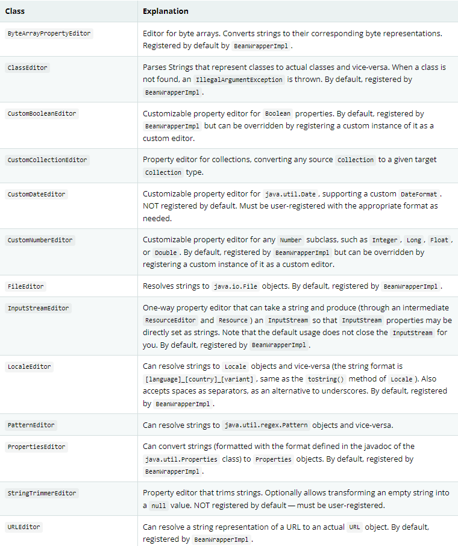
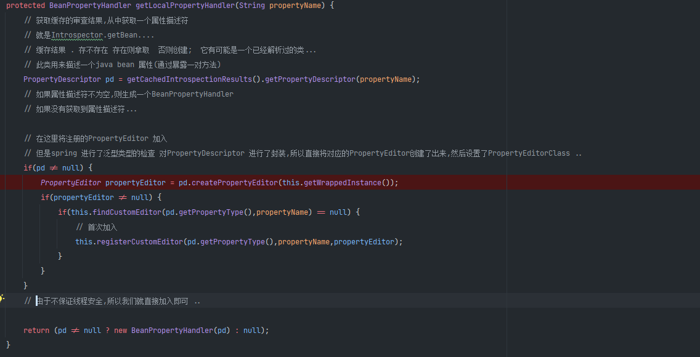

# 验证,数据绑定以及类型转换

## 概说
对于业务逻辑的验证有优点又有缺点,Spring提供了校验(数据绑定)设计,它们之间并没有互斥性 ..并且你能够很容易的国际化且能够有任意的验证器进行增强 ...,
Spring 默认提供了一些验证器 .. \
数据绑定能够动态解析用户输入并绑定到应用的领域模型(或者任何你想处理用户输入的模型),Spring 提供了DataBinder来做这个事情,Validator 和 DataBinder 组成了validation 包,它们提供了大量
有用的功能 .. \
BeanWrapper 是一个最基本的概念,并且在各个地方大量应用,一般不需要直接使用BeanWrapper \
Spring DataBinder 以及 底层的BeanWrapper 都使用PropertyEditorSupport实现解析并格式化属性值 ... \
PropertyEditor 以及 PropertyEditorSupport类型都是javaBeans的规范之一,Spring 3引入core.convert包提供一个通用类型转换的基础设施,同高级"format"包一样能够格式化UI 字段值 .. \
你能够使用这些包(因为它们简化了PropertyEditorSupport实现) ... \
Spring 支持java bean 校验(通过配置基础设施以及一个适配器到Spring 自己的Validator约定),这可以在源码中查看得到验证 ...,同样应用能够全局性的启动Bean校验,同java Bean验证描述的那样,对所有
的验证单独使用,在web层,你可以注册一个局部controller包含的Spring Validator 实例(每一个DataBinder包含一个Validator),这能够加入自定义验证逻辑 ...
## 3.1 通过Spring Validator 接口
通过Validator进行验证,这个接口能够使用一个Errors对象,当验证的时候,你可以通过Errors对象暴露验证失败 ... \
实现Validator 是十分直接了当的,特别是当你知道如何使用 ValidationUtils 帮助类,如下所述:
```java
public class PersonValidator implements Validator {

    /**
     * This Validator validates only Person instances
     */
    public boolean supports(Class clazz) {
        return Person.class.equals(clazz);
    }

    public void validate(Object obj, Errors e) {
        ValidationUtils.rejectIfEmpty(e, "name", "name.empty");
        Person p = (Person) obj;
        if (p.getAge() < 0) {
            e.rejectValue("age", "negativevalue");
        } else if (p.getAge() > 110) {
            e.rejectValue("age", "too.darn.old");
        }
    }
}
```
对于内嵌对象的校验,应该针对每一个模型封装一个Validator,然后整体进行校验,结合使用 ..
```java
public class CustomerValidator implements Validator {

    private final Validator addressValidator;

    public CustomerValidator(Validator addressValidator) {
        if (addressValidator == null) {
            throw new IllegalArgumentException("The supplied [Validator] is " +
                "required and must not be null.");
        }
        if (!addressValidator.supports(Address.class)) {
            throw new IllegalArgumentException("The supplied [Validator] must " +
                "support the validation of [Address] instances.");
        }
        this.addressValidator = addressValidator;
    }

    /**
     * This Validator validates Customer instances, and any subclasses of Customer too
     */
    public boolean supports(Class clazz) {
        return Customer.class.isAssignableFrom(clazz);
    }

    public void validate(Object target, Errors errors) {
        ValidationUtils.rejectIfEmptyOrWhitespace(errors, "firstName", "field.required");
        ValidationUtils.rejectIfEmptyOrWhitespace(errors, "surname", "field.required");
        Customer customer = (Customer) target;
        try {
            errors.pushNestedPath("address");
            ValidationUtils.invokeValidator(this.addressValidator, customer.getAddress(), errors);
        } finally {
            errors.popNestedPath();
        }
    }
}
```

## 3.2 解析代码到错误消息的验证
将错误消息对应到消息代码,通过MessageSource实现国际化消息错误处理,MessageCodesResolver 决定Errors接口注册了那些错误代码,
默认来说DefaultMessageCodesResolver,它不仅使用调用者提供的code注册了消息并且同样注册包含了传递给reject方法的字段名的消息,举个例子,这可能比较抽象,
如果使用rejectValue("age", "too.darn.old"),除了too.darn.old代码之外,Spring还会注册too.darn.old.age以及too.darn.old.age.int(字段名和类型),这是一种约定能够
方便的告诉开发者能够定位错误消息 .. \
关于更多MessageCodesResolver的信息 以及默认策略能够通过MessageCodesResolver和DefaultMessageCodesResolver的javadoc了解 ..

## 3.3 BeanWrapper 的 bean 操作
org.springframework.beans 包坚持JavaBean的标准,[javaBeans](https://docs.oracle.com/javase/8/docs/api/java/beans/package-summary.html),
BeanWrapper 和BeanWrapperImpl 提供了设置属性值的功能(包括单独或者批量的),通过获取属性描述符来决定属性是否是可读或者可写的 .. \
同样它支持内嵌属性(不限制深度的子属性设置),同样BeanWrapper支持标准的javaBean规范的PropertyChanListeners以及 VetoableChangeListeners的能力,不需要增加额外的代码(针对目标类),最后
BeanWrapper同样支持设置索引属性,同样这个类并不直接使用(而是通过DataBinder以及 BeanFactory) ..

### 3.3.1 设置或者获取基本属性 / 内嵌属性
设置或者获取属性通过 setPropertyValue / get....(以及其他的一些重载方法) ..
 
#### 直接使用BeanWrapper
```java
public class Company {

    private String name;
    private Employee managingDirector;

    public String getName() {
        return this.name;
    }

    public void setName(String name) {
        this.name = name;
    }

    public Employee getManagingDirector() {
        return this.managingDirector;
    }

    public void setManagingDirector(Employee managingDirector) {
        this.managingDirector = managingDirector;
    }
}
```
```java
public class Employee {

    private String name;

    private float salary;

    public String getName() {
        return this.name;
    }

    public void setName(String name) {
        this.name = name;
    }

    public float getSalary() {
        return salary;
    }

    public void setSalary(float salary) {
        this.salary = salary;
    }
}
```
使用方式
```text
BeanWrapper company = new BeanWrapperImpl(new Company());
// setting the company name..
company.setPropertyValue("name", "Some Company Inc.");
// ... can also be done like this:
PropertyValue value = new PropertyValue("name", "Some Company Inc.");
company.setPropertyValue(value);

// ok, let's create the director and tie it to the company:
BeanWrapper jim = new BeanWrapperImpl(new Employee());
jim.setPropertyValue("name", "Jim Stravinsky");
company.setPropertyValue("managingDirector", jim.getWrappedInstance());

// retrieving the salary of the managingDirector through the company
Float salary = (Float) company.getPropertyValue("managingDirector.salary");
```
## 3.3.2 内置的PropertyEditor 实现
例如Spring提供了一些内置的属性编辑器,例如有处理Date的,在Spring和Object之间互相转换 ... 如果不支持,你可以通过增加
java.beans.PropertyEditor 支持自定义行为(将它注入到BeanWrapper),或者注入到特定的ioc容器中,让beanWrapper或者ioc容器知道如何转换属性
到想要的类型 ...  For more about PropertyEditor, see the javadoc of the java.beans package from Oracle.
- setting properties
    通过使用PropertyEditor 实现完成,例如String -> Object,或者对于xml中声明的class属性尝试解析为Class 对象 .
- 解析Http请求参数(spring mvc),通过PropertyEditor 实现完成(当然你也可以手动绑定在CommandController的子类中) ... \
Spring 提供了大量内置的PropertyEditor 实现让我们的生活更加容易,它们位于org.springframework.beans.propertyeditors包 .. \
大多数在下面的表中列出,默认是注入到BeanWrapperImpl中了,我们能够注册自己的变种或者覆盖默认的PropertyEditor ... 

Spring 使用java.beans.PropertyEditorManager 查询路径从而添加可能的属性编辑器,这个查询路径包括sun.beans.editors,它包含了一些
Font / Color以及大多数基础类型的属性编辑器,同样这个标准的JavaBeans基础设施也会自动的发现PropertyEditor(不需要你显式的注册),如果你有一个类,然后具有的名字
并使用Editor追加一个属性编辑器,则它自动被是被为对应类的属性编辑器 .. \
例如:
```text
com
  chank
    pop
      Something
      SomethingEditor // the PropertyEditor for the Something class
```
### BeanInfo
自动扫描,但是Spring 并没有使用它 ... 实测没有,通过修改BeanWrapper的一部分代码进行支持 ...

这里根据pd的PropertyEditor进行单一支持,但是这样还不够,这个方法返回的PropertyDescriptor 是Spring自己封装的,我们需要了解它的底层

这样,我们可以看到它将PropertyEditor 进行了持有,所以在BeanWrapper中我们可以用它构建一个PropertyEditor(针对当前bean的property editor) ... \
还有一些注意事项: \
也就是这个类必须是非匿名类(它需要直接访问构造器访问,除非我们覆盖spring的PropertyEditor实现) ... 重写createPropertyEditor()实现 ...

### 注册额外的自定义PropertyEditor 实现
对于我们来说,ioc扩展点有很多,我们可以直接通过编程式通过beanFactory接口的registerCustomEditor()注册自定义属性编辑器,另一种就是使用后置处理器,叫做CustomEditorConfigurer,当然这两种结合使用可能还不错,
因为后置处理器就是可以使用在bean工厂上,但是比较麻烦(你可以还需要做额外的代码配置),相反推荐在ApplicationContext上使用它,一切就是那么自然,以类似的方式为特定的bean注册属性编辑器(并且能够自动发现并应用) .. \
注意所有的bean工厂和应用上下文自动的应用了大量的内置属性编辑器,尽管它们使用BeanWrapper 处理属性转换,除此之外,应用上下文可以覆盖或者增加额外的编辑器处理资源查询(例如针对特定的应用上下文类型查询资源的方式) .. \
标准的java beans PropertyEditor 实例能够被用来将字符串转换为实际的复杂的类型的属性 .... 
```java
package example;

public class ExoticType {

    private String name;

    public ExoticType(String name) {
        this.name = name;
    }
}

public class DependsOnExoticType {

    private ExoticType type;

    public void setType(ExoticType type) {
        this.type = type;
    }
}
```
自定义属性编辑器
```java
package example;

public class ExoticTypeEditor extends PropertyEditorSupport {

    public void setAsText(String text) {
        setValue(new ExoticType(text.toUpperCase()));
    }
}
```
为应用上下文增加支持
```xml
<bean class="org.springframework.beans.factory.config.CustomEditorConfigurer">
    <property name="customEditors">
        <map>
            <entry key="example.ExoticType" value="example.ExoticTypeEditor"/>
        </map>
    </property>
</bean>
```
### PropertyEditorRegistrar
除了使用PropertyEditorRegistrar,这个接口特别有用, PropertyEditorRegistrar 并且能够和PropertyEditorRegistry结合使用,一个接口已经被Spring的BeanWrapper(包括DataBinder)实现 ... \
这个实例能够联合CustomEditorConfigurer 使用,因为CustomEditorConfigurer暴露了一个 setPropertyEditorRegistrars(..)属性,能够增加到CustomEditorConfigurer 和DataBinder 和Spring mvc控制器共享 ... \
因此它避免了对自定义编辑器的同步(因为PropertyEditorRegistrar每次都会创建一个全新的PropertyEditor ..-当每次bean 尝试创建的时候) ... \
由于它能够在容器中共享或者spring mvc控制器中共享,例如:
```java
@Controller
public class RegisterUserController {

    private final PropertyEditorRegistrar customPropertyEditorRegistrar;

    RegisterUserController(PropertyEditorRegistrar propertyEditorRegistrar) {
        this.customPropertyEditorRegistrar = propertyEditorRegistrar;
    }

    @InitBinder
    void initBinder(WebDataBinder binder) {
        this.customPropertyEditorRegistrar.registerCustomEditors(binder);
    }

    // other methods related to registering a User
}
```
例如这样,我们还可以为binder注入自定义编辑器(这是针对于控制器而言的WebDataBinder),这样就能够根据需要在多个控制器中进行按需注册 ..

## 3.4 Spring 类型转换
Spring 3提供了core.convert包提供了通用类型的转换系统,这个系统定义了SPI 去实现类型转换逻辑并在运行时执行类型转换的API ,在Spring 容器中,你能够使用这个系统作为PropertyEditor实现替代方案用来转换具体化的
bean属性值(string) 到 需要的属性类型 ..
### 3.4.1 转换器SPI
首先我们需要明白bean 属性设置的底层实现 首先是尝试使用PropertyEditor 进行处理,然后再尝试使用ConversionService进行处理,所以当没有PropertyEditor能够处理的时候,就查看后者,如果觉得PropertyEditor难用,converter SPI是一种好的选择 \
需要注意,这种转换器会自动处理 列表 /集合,无需针对集合做出对应的转换器实现(这是内置的集合 / 数组转换器代理了过程),默认使用的DefaultConversionService 注册了这些转换器 ...\
如果你的转换器抛出了任何未检查异常(例如转换失败),特别是你应该使用IllegalArgumentException 报告无效的资源值,确保转换器实现线程安全 .. \
spring默认在core.convert.support包下提供了各种转换器实现确保能够在通常情况下提供支持 ...
### 3.4.2 使用ConverterFactory
另一种你需要将集中化处理转换逻辑,对整个类体系的详细处理,你可以实现ConverterFactory
```java
package org.springframework.core.convert.converter;

public interface ConverterFactory<S, R> {

    <T extends R> Converter<S, T> getConverter(Class<T> targetType);
}
```
参数S表示你想要转换到R的基类型(你可以定义转换的目标类范围(R)),然后实现转换器获取方法即可 ...(T 表示R的子类 .) \
考虑StringToEnumConverterFactory 作为一个例子:
```java
package org.springframework.core.convert.support;

final class StringToEnumConverterFactory implements ConverterFactory<String, Enum> {

    public <T extends Enum> Converter<String, T> getConverter(Class<T> targetType) {
        return new StringToEnumConverter(targetType);
    }

    private final class StringToEnumConverter<T extends Enum> implements Converter<String, T> {

        private Class<T> enumType;

        public StringToEnumConverter(Class<T> enumType) {
            this.enumType = enumType;
        }

        public T convert(String source) {
            return (T) Enum.valueOf(this.enumType, source.trim());
        }
    }
}
```
例如这是一个示例,它将一个String转换为枚举的子类 ..
### 3.4.3 使用GenericConverter
如果需要一个复杂的转换器实现,考虑此接口,它更加灵活但是缺少类型签名,支持转换多个来源到多个目标 ... 并且GenericConverter 使用必要的来源和目标字段上下文(你可能在转换逻辑中使用),例如通过字段注解或者声明在
字段签名上的泛型信息驱动类型转换的上下文 ....
```java
package org.springframework.core.convert.converter;

public interface GenericConverter {

    public Set<ConvertiblePair> getConvertibleTypes();

    Object convert(Object source, TypeDescriptor sourceType, TypeDescriptor targetType);
}
```
上面是它的定义 ....,他需要定义支持转换source到目标类型的对,可以有多个,convert(Object,TypeDescriptor,TypeDescriptor)包含转换逻辑, source表示需要转换的值,source TypeDescriptor 提供了对
原始包含需要被转换值得字段的访问(例如 bean 之间的属性 -> copy),目标TypeDescriptor提供了对目标字段的访问 ... \
对于对象来说,源typeDescriptor 可能包含的信息和一个对象的属性字段对应的TypeDescriptor包含的信息可能不一样 ..,在实际编写的时候需要注意 ... \
一个更加典范的例子是ArrayToCollectionConverter  ...,默认来说一般用不上这么复杂的转换器,除非你真的需要它,否则应该使用转换器或者转换器工厂 ...
### 使用ConditionalGenericConverter
根据条件进行转换,一个好的例子是IdToEntityConverter,在持久化Entity 标识符和实体引用进行转换 , 也就是通过id转换为一个实体(例如它条件判断目标类型是否有一个find[目标类型名称]的方法,且公共静态,有则进行转换) ... \
如有需要,我们也可以执行定义 ...

## 3.4.4 ConversionService API
默认前面的转换器都会被ConversionService默默的使用 ... 同样ConversionService(大多数)都实现了ConverterRegistry,为注册转换器提供了SPI .. \
除此之外,ConversionService 实现代理了注册的转换器进行类型转换 .. \
强壮的ConversionService实现位于core.convert.support包,GenericConversionService 是一个通用目的的 对大多数环境适用的接口,为了创建一个通用的ConversionService配置,可以参考
ConversionServiceFactory(它提供了工厂方法) ..
## 3.4.5 配置一个ConversionService
ConversionService 无状态且在应用启动时实例化并且在多个线程中共享 ... 通常在Spring 应用中每一个容器都有一个ConversionService,Spring捆绑这样的服务,当然我们可以直接注入到bean中或者直接执行 .. \
如果没有注入ConversionService,那么原始的PropertyEditor系统会被使用 ...
```text
<bean id="conversionService"
    class="org.springframework.context.support.ConversionServiceFactoryBean"/>
```
之前说过,可以通过工厂进行定制ConversionService ..\
默认的ConversionService能够在 字符串,数值,枚举,集合,map和其他公共类型之间进行转换 ... 为了应用或者覆盖默认的转换器(你需要通过自定义的转换器实现),通过设置converters即可 ...属性值可以是
Converter,ConverterFactory,GenericConverter接口 ..
```text
<bean id="conversionService"
        class="org.springframework.context.support.ConversionServiceFactoryBean">
    <property name="converters">
        <set>
            <bean class="example.MyCustomConverter"/>
        </set>
    </property>
</bean>
```
当然这么强大的能力应该使用在Mvc中,可以查看对应的控制器中的方法参数的转换和格式化 ...[webMvc 类型转换](../webmvc/1.11-mvc-config.md#1113-) \
除此之外,如果希望在转换过程中执行格式化,使用 FormattingConversionServiceFactoryBean ..

## 3.4.6 编程式使用ConversionService
除了spring 底层本质上在幕后使用ConversionService之外,还可以直接注入它(依赖注入) ... \
例如你尝试转换List<Integer>到List<String>
```text
DefaultConversionService cs = new DefaultConversionService();

List<Integer> input = ...
cs.convert(input,
    TypeDescriptor.forObject(input), // List<Integer> type descriptor
    TypeDescriptor.collection(List.class, TypeDescriptor.valueOf(String.class)));
```
上述代码并没有使用Spring应用上下文的conversionService,但是 这是默认实现,我们也可以单独使用,然后注册一些转换器什么的 ... ,但是需要注意,如果你在多线程内使用,必须保证converter 线程安全 ... \
由于这个默认实现自动注入了适合大多数环境的转换器,我们可以通过DefaultConversionService的addDefaultConverters 对ConverterRegistry 注册这些常用的转换器 ... \
一般来说ConverterRegistry 就是ConversionService自己 ...
## 3.5 Spring 字段格式化
这一种其实也可以看作是转换,但是前面的转换仅仅是类型转换,而formatter可能会做更多的事情,spring认为这一类的converter称为formatter更加合适,因为它们可以看作是对数据的格式化(而不是简单转换) ..
### 3.5.1 Formatter SPI
```java
package org.springframework.format;

public interface Formatter<T> extends Printer<T>, Parser<T> {
}
```
它继承了Printer 以及 Parser 阻塞式构建的接口 ..
```java
public interface Printer<T> {

    String print(T fieldValue, Locale locale);
}
```
可以进行国际化打印 ..
```java
import java.text.ParseException;

public interface Parser<T> {

    T parse(String clientValue, Locale locale) throws ParseException;
}
```
可以国际化解析 ...,它们针对的是 String -> target -> String ..(支持双向支撑)...,例如客户端和服务器场景,客户端将String传递个服务端,服务端处理之后转为String 返回给客户端进行视图渲染 .. \
如果Formatter尝试解析失败应该抛出ParseException 或者 IllegalArgumentException ... 确保Formatter 实现线程安全 ... \
默认ConversionService实现并没有支持Formatter,所以需要它的子类实现支撑Formatter ... Spring默认内置了一些数字 /  精度/ 货币的格式化器 ...(例如格式化Number的核心都是通过java.text.NumberFormat),
还有一些关于日期的格式化(它们本质上通过java.text.DateFormat) ...
### 3.5.2 基于注解驱动的格式化
通过AnnotationFormatterFactory实现 基于注解/或者字段解析 ..
```java
package org.springframework.format;

public interface AnnotationFormatterFactory<A extends Annotation> {

    Set<Class<?>> getFieldTypes();

    Printer<?> getPrinter(A annotation, Class<?> fieldType);

    Parser<?> getParser(A annotation, Class<?> fieldType);
}
```
例如通过AnnotationFormatterFactory 绑定@NumberFormat注解 格式化数字(通过指定的数字风格或者模式) ...
```java
public final class NumberFormatAnnotationFormatterFactory
        implements AnnotationFormatterFactory<NumberFormat> {

    public Set<Class<?>> getFieldTypes() {
        return new HashSet<Class<?>>(asList(new Class<?>[] {
            Short.class, Integer.class, Long.class, Float.class,
            Double.class, BigDecimal.class, BigInteger.class }));
    }

    public Printer<Number> getPrinter(NumberFormat annotation, Class<?> fieldType) {
        return configureFormatterFrom(annotation, fieldType);
    }

    public Parser<Number> getParser(NumberFormat annotation, Class<?> fieldType) {
        return configureFormatterFrom(annotation, fieldType);
    }

    private Formatter<Number> configureFormatterFrom(NumberFormat annotation, Class<?> fieldType) {
        if (!annotation.pattern().isEmpty()) {
            return new NumberStyleFormatter(annotation.pattern());
        } else {
            Style style = annotation.style();
            if (style == Style.PERCENT) {
                return new PercentStyleFormatter();
            } else if (style == Style.CURRENCY) {
                return new CurrencyStyleFormatter();
            } else {
                return new NumberStyleFormatter();
            }
        }
    }
}
```
使用注解并结合ConversionService处理它
```java
public class MyModel {

    @NumberFormat(style=Style.CURRENCY)
    private BigDecimal decimal;
}
```
#### 格式化注解API
org.springframework.format.annotation 提供了强移植性的注解API ... \
你也能够使用NumberFormat 格式化Number (到 Double / Long),@DateTimeFormat 格式化 Date / Calendar / Long(时间戳)以及 JSR-310 java.time ... \
例如,使用@DateTimeFormat 格式化 java.util.Date到ISO Date(yyyy-MM-dd)
```java
public class MyModel {

    @DateTimeFormat(iso=ISO.DATE)
    private Date date;
}
```
## 3.5.3 FormatterRegistry SPI
同样能够注册格式化器和转换器,FormattingConversionService 是FormatterRegistry的实现(对于大多数环境是合适的),通过编程式或者声明式配置为Spring bean ... \
通过 FormattingConversionServiceFactoryBean,因为这个实现了ConversionService,能够直接配置它(为了结合Spring 的DataBinder和SPEL 使用)... \
总而言之,它集中了配置规则,而不是在多个控制器中重复配置,通过共享的FormatterRegistry ,就像是全局使用一样 ..
## 3.5.4 FormatterRegistrar SPI
同样它的主要能力就是为FormatterRegistry注册格式化器和转换器(为什么可以注册转换器的原因,一般都是两者能力都具备) ..
```java
package org.springframework.format;

public interface FormatterRegistrar {

    void registerFormatters(FormatterRegistry registry);
}
```
但是它本身只具备注册格式化器的能力,并且它能够对格式化器和转换器进行分类(针对不同的格式化注册机 管理不同类型的Formatter) ...

## 3.5.5 SpringMvc 配置格式化
[spring mvc 格式化](../webmvc/1.11-mvc-config.md#1113-)
## 3.6 配置全局日期 /时间格式化
默认情况,没有注释@DataTimeFormat的日期或者时间字段(从字符串转换)通过DateFormat.SHORT 格式,你能够定义自己的全局格式化改变这个行为 ... \
为了这样做确保Spring没有注册默认的格式化器,相反手动注册格式化器(使用以下帮助) ...
- org.springframework.format.datetime.standard.DateTimeFormatterRegistrar
    DateTime 格式化注册器
- org.springframework.format.datetime.DateFormatterRegistrar
    日期格式化注册器
```java
@Configuration
public class AppConfig {

    @Bean
    public FormattingConversionService conversionService() {

        // Use the DefaultFormattingConversionService but do not register defaults
        DefaultFormattingConversionService conversionService = new DefaultFormattingConversionService(false);

        // Ensure @NumberFormat is still supported
        conversionService.addFormatterForFieldAnnotation(new NumberFormatAnnotationFormatterFactory());

        // Register JSR-310 date conversion with a specific global format
        DateTimeFormatterRegistrar registrar = new DateTimeFormatterRegistrar();
        registrar.setDateFormatter(DateTimeFormatter.ofPattern("yyyyMMdd"));
        registrar.registerFormatters(conversionService);

        // Register date conversion with a specific global format
        DateFormatterRegistrar registrar = new DateFormatterRegistrar();
        registrar.setFormatter(new DateFormatter("yyyyMMdd"));
        registrar.registerFormatters(conversionService);

        return conversionService;
    }
}
```
通常的一个配置情况是这样 ..,在Web应用中可能还需要额外的配置 ..(也就是基于Web定制器增加 格式化器),例如:
```java
@Configuration
@EnableWebMvc
public class WebConfig implements WebMvcConfigurer {

    @Override
    public void addFormatters(FormatterRegistry registry) {
        // ...
    }
}
```
等价于直接配置ConversionService ...

## 3.7 java Bean 校验
spring支持[Java Bean 校验](https://beanvalidation.org/)API ...,基于注解声明式的在字段上进行约束 ...,内置约束查看 [Bean Validation](https://beanvalidation.org/),对于额外的支持可以查看
[Hibernate Validator](https://hibernate.org/validator/) ...
### 3.7.2 配置一个Bean 校验提供器
前面提过Spring 提供自己的Validator 和标准的Bean 校验提供器做桥接代理 bean 校验,如果你的应用需要校验(你可以注入一个javax.validation.ValidationFactory或者 javax.validation.Validator) .. \
所以你可以使用Bean ValidationAPI 包括引导一个校验器作为Spring bean .. \
默认实现是LocalValidatorFactoryBean(包含国际化) ..
```java
import org.springframework.validation.beanvalidation.LocalValidatorFactoryBean;

@Configuration
public class AppConfig {

    @Bean
    public LocalValidatorFactoryBean validator() {
        return new LocalValidatorFactoryBean();
    }
}
```
这个例子使用默认的引导机制初始化触发bean 验证 .. 只要是一个合格的Bean Validation provider 只要出现在类路径上将自动的被检测 ..
### inject validator
LocalValidatorFactoryBean 同时实现了 javax.validation.ValidatorFactory 以及 javax.validation.Validator ... 同样 以及Spring的org.springframework.validation.Validator ...
你能够注册任意一个接口bean用来执行验证逻辑 ..
```java
import javax.validation.Validator;

@Service
public class MyService {

    @Autowired
    private Validator validator;
}
```
这将直接通过bean 校验api 工作,
```java
import org.springframework.validation.Validator;

@Service
public class MyService {

    @Autowired
    private Validator validator;
}
```
通过Spring 代理行为进行bean 校验 ...
### 配置自定义约束
一个bean 验证约束由两部分组成
- @Constraint 注解声明约束以及它的可配置属性
- javax.validation.ConstraintValidator 实现(约束的行为)
- 每一个这样的注解将会引用一个相关的ConstraintValidator 实现类 ... 在运行时ConstraintValidatorFactory 将会实例化引用的实现(当约束注解出现在你的领域模式中) ...

默认来说,LocalValidatorFactoryBean 配置了一个 SpringConstraintValidatorFactory 被Spring 用来创建ConstraintValidator 实例,让你的自定义ConstraintValidator 像其他bean 一样从依赖注入中收益 ..
```java
@Target({ElementType.METHOD, ElementType.FIELD})
@Retention(RetentionPolicy.RUNTIME)
@Constraint(validatedBy=MyConstraintValidator.class)
public @interface MyConstraint {
}
```
然后你的自定义约束验证器可以使用依赖注入特性
```java
import javax.validation.ConstraintValidator;

public class MyConstraintValidator implements ConstraintValidator {

    @Autowired;
    private Foo aDependency;

    // ...
}
```

### Spring 启动方法验证
bean 验证1.1 支持方法验证特性(作为一个自定义扩展,hibernate validator 4.3支持) 能通过使用MethodValidationPostProcessor bean 定义收到支持 ...
```java
import org.springframework.validation.beanvalidation.MethodValidationPostProcessor;

@Configuration
public class AppConfig {

    @Bean
    public MethodValidationPostProcessor validationPostProcessor() {
        return new MethodValidationPostProcessor();
    }
}
```
为了启用Spring 启动方法验证,目标类通过@Validated 注解注释,同样可以可选的声明验证组使用,查看这个后置处理器配置和hibernate validator 以及 bean 验证1.1 提供者使用的详情 ... \
方法验证依赖于围绕目标类进行AOP 代理,或者对方法进行JDK 动态代理或者CGLIB 代理 .. \
在使用代理的时候有一些限制,在AOP 代理中有所体现,并且在代理类上使用方法和访问器才有效(直接字段访问不会工作) ... 主要原因可能是在目标代理对象上进行直接访问没有触发(代理对象上的方法) ...

### 额外的配置选项
默认的LocalValidatorFactoryBean 配置已经足够,具有针对各种Bean校验解构的配置选项,从消息插值到遍历解析 ... ,详情可以查看 LocalValidatorFactoryBean java doc ...

### 配置DataBinder
从spring 3开始,你可以配置DataBinder使用Validator,一旦配置你能够通过binder.validate()执行Validator 实例,任何校验Errors 将自动的增加到binder的BindingResult中 ...

```text
Foo target = new Foo();
DataBinder binder = new DataBinder(target);
binder.setValidator(new FooValidator());

// bind to the target object
binder.bind(propertyValues);

// validate the target object
binder.validate();

// get BindingResult that includes any validation errors
BindingResult results = binder.getBindingResult();
```
但是一般情况下我们在mvc下使用,都是基于java bean api校验,声明式注解处理,如果需要灵活处理产生java bean,可能需要自己实例化bean,调度validator进行 javabean 校验规范 调度,这是非常合适的 ... \
当然可以包含多个校验器实例(dataBinder.addValidators / dataBinder.replaceValidators),这是有用的,合并全局配置的bean 校验和 本地配置的Spring 验证器作用到DataBinder 实例 ...

