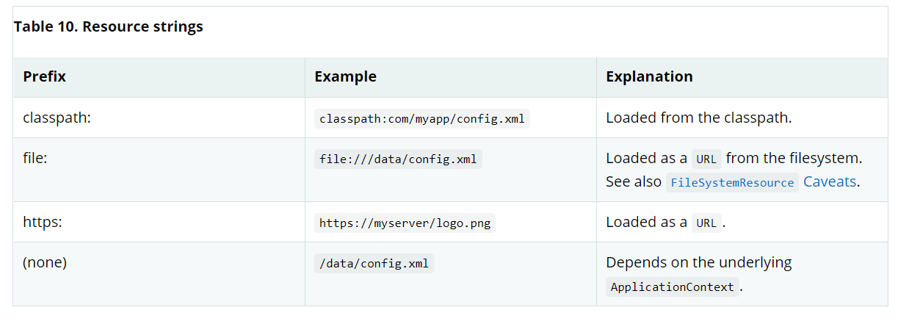

# Resource
主要是利用spring来处理资源,主要是ResourceLoader的功劳!
1) Resource\
    它主要是spring将资源抽象为一个实体的承载类,本质上封装了java.net.URL以及对各种特殊前缀进行资源标识并检索,由于原生缺少很多功能,spring封装它并提供丰富的api\
```java
public interface Resource extends InputStreamSource {

    boolean exists();

    boolean isReadable();

    boolean isOpen();

    boolean isFile();

    URL getURL() throws IOException;

    URI getURI() throws IOException;

    File getFile() throws IOException;

    ReadableByteChannel readableChannel() throws IOException;

    long contentLength() throws IOException;

    long lastModified() throws IOException;

    Resource createRelative(String relativePath) throws IOException;

    String getFilename();

    String getDescription();
}
```
根据Resource接口,主要需要注意它实现了InputStreamSource ,父接口存在一个InputStream getInputStream() throws IOException方法,它主要负责定位以及打开资源流,每次执行都会返回一个新的流,调用者有权关闭资源! \
其次isOpen方法判断资源是否打开状态,如果为true,那么这个inputStream不能够多次读并且只能读一次且完整关闭资源,否则将抛出异常!\
还有一些资源实现了WritableResource接口,那么具有写资源的权力,spring对Resource做了很多扩展,同时也运用了很多在其中,例如各种ApplicationContext的构造器参数(包含了一个资源路径的字符串参数),这个参数可能仅仅就是一个简单的路径参数或者拥有指定前缀的路径参数,指定前缀的路径的资源实现必须是可创建且能使用的!\
本质上来说,Resource更像一个工具类,获取资源的工具类等价于其他获取资源库 \
前面说过,Resource抽象并没有替换功能,它只是尽可能包装,例如URLResource包装了一个URL使其能够进行工作! \
2) spring有很多Resource的实现,分别代表了各种前缀规
* UrlResource

    底层是java.net.url,只要是能够通过url标识的资源都能够进行访问,例如文件,http目标,ftp目标等等;也能够使用其他前缀从其他地方标识资源,例如file: 从文件系统获取,ftp: 从通信端口获取,https: https 协议进行访问资源!

* ClassPathResource

    这个就是从类路径进行访问资源,要么使用线程上下文类加载器,要么使用类加载器,获取用于加载资源的加载类,这个实现也支持java.nio.file的一种资源形式，(如果类路径资源在文件系统中但并不是在于一个jar中的类路径资源并且没有扩展到文件系统中,例如servlet引擎或者其他任何环境),那么将它表示为基于java.net.url的资源实现进行获取!\
  一般情况下如果指定了前缀,那么资源对象将隐式创建!\
  例如如果提供了一个字符串路径,前缀为classpath: 那么PropertyEditor可能会根据此前缀创建ClassPathResource!
* FileSystemResource
    
    java.io.file 句柄的实现,也支持java.nio.file.path,将一个基于字符串的路径转换为java.nio.file.Files的api执行所有操作,java.nio.file.path的也同样支持PathResource进行替换,FileSystemResource支持作为文件和URL进行解析;

* PathResource

    java.nio.file.Path句柄,将通过Path api进行所有操作,也支持file或者url并且同样也实现了writableResource接口;PathResource实际上是FileSystemResource的纯java.nio.path.Path替代品，具有不同的createRelative行为;
* ServletContextResource

    很明显通过servlet容器进行扩展的资源补充,主要是根据servlet引擎的root目录为准,它支持流和url访问,但是如果web应用归档也是以扩展并且资源且存在于文件系统上也支持使用java.io.file进行访问;无论它是否被扩展还是处于文件系统上或者从jar中直接访问又或是像数据库一样访问(很明显)这取决于实际依赖的servlet容器!
* InputStreamResource

    它是一个关于InputStream的实现,如果没有任何前缀可以使用那么可以试试它,除此之外更倾向于使用ByteArrayResource或者任意的一个基于file的Resource实现是更好的！\
  对比于其他Resource实现,这个描述符标识已经打开的资源,因此isOpen永远返回true,如果你需要在某处保存资源描述符,获取尝试多次读取,这并不允许!
* ByteArrayResource
    
    加载byteArray,它将创建一个ByteArrayInputStream,在某些场景下它相比于InputStreamResource它是更好的!

3) ResourceLoader 接口

    它用于加载资源并返回资源对象:
```java
public interface ResourceLoader {

    Resource getResource(String location);

    ClassLoader getClassLoader();
}
```
请注意所有的应用上下文都实现了ResourceLoader接口,因此能用它包含一个Resource实例; \
当你通过指定的上下文调用了一个getResource方法之后,如果没有指定的路径前缀,你将会回退到通过相应的上下文决定合适的前缀类型,例如使用ClassPathXmlApplicationContext,如果没有前缀,那么默认将在classPath上查询资源!
```java
Resource template = ctx.getResource("some/resource/path/myTemplate.txt");
```
例如 ClassPathXmlApplicationContext ->  ClassPathResource. If the same method were run FileSystemXmlApplicationContext -> FileSystemResource. WebApplicationContext, -> ServletContextResource,总会找到和应用上下文相关的资源对象! \
你同样可以使用其他的前缀,而不用管应用上下文的类型,那么也能够加载资源!

    
4) ResourcePatternResolver
  此接口扩展了ResourceLoader并对解析路径模式指定了策略,(例如，Ant样式的路径模式）转换为Resource对象)
 ```java
public interface ResourcePatternResolver extends ResourceLoader {

    String CLASSPATH_ALL_URL_PREFIX = "classpath*:";

    Resource[] getResources(String locationPattern) throws IOException;
}
```
正如你所见,它使用了一个classpath*前缀,他将会匹配类路径上的所有资源,不同目录的相同资源,获取多个文件,还能够从jar中获取路径资源!
查看[ Wildcards in Application Context Constructor Resource Paths ](https://docs.spring.io/spring-framework/docs/current/reference/html/core.html#resources-app-ctx-wildcards-in-resource-paths)了解更多! \
通过ResourceLoaderAware能够判断一个ResourceLoader是否已经实现并扩展了ResourceLoader\
PathMatchingResourcePatternResolver是一个单独的实现,它通常能够在容器外使用也能够被ResourceArrayPropertyEditor 用来收集Resource[]对象;PathMatchingResourcePatternResolver也能够通过前缀来获取一个或多个匹配的Resource对象;这个资源路径也可以是一一映射的资源的路径,获取也可以是包含了classpath*:的路径前缀或者其他ant风格的普通表达式(会使用org.springframework.util.AntPathMatcher工具类进行匹配),后者对于classPath*: 是有效的! \
目前默认的应用上下文实现的ResourceLoader 是PathMatchingResourcePatternResolver,对于每个应用上下文都是相同的,它们本身实现了ResourcePatternLoader,但是会代理给默认的是PathMatchingResourcePatternResolver;
5) ResourceLoaderAware 
```java
public interface ResourceLoaderAware {

    void setResourceLoader(ResourceLoader resourceLoader);
}
```
当一个类实现了ResourceLoaderAware并被spring管理之后,应用上下文调用此方法会将自身作为参数(是所有的spring相关实现的应用上下文都会这样做!); \
因为应用上下文是一个ResourceLoader,此类也可以使用ApplicationContextAware从而直接的加载资源,但是通常情况下你需要使用那个,就指定谁,这仅仅只会耦合一部分,而不是和整个ApplicationContext接口进行耦合! \
在应用组件中,你可以选择使用自动装配一个ResourceLoader,传统的构造器以及byType自动装配模式有能力提供一个ResourceLoader,这不必担心;对于更加灵活的和字段进行连接或者多参数方法的能力,考虑使用基于注解的自动装配特性,这种情况下ResourceLoader将自动和字段进行连接,构造器参数,或者作为字段的一个期待的ResourceLoader类型的方法参数,构造器等等,通过@Autowired 能够解决! \
<b>为了加载一个或者多个Resource对象(通过使用一个包含了通配符的或者使用了指定的classpath*:资源前缀),考虑使用一个ResourcePatternResolver自动连接到应用组件中代替ResourceLoader!</b>
6) 将资源作为依赖
  
   如果Bean本身将通过某种动态过程来确定并提供资源路径,他需要确定使用ResourceLoader或者ResourcePatternResolver接口来决定加载资源,例如: \
  模板顺序的加载,这些资源需要依赖于用户的角色,如果资源是静态的,这种情况可以消除ResourceLoader接口的使用(或者ResourcePatternResolver),你仅仅只需要暴露一个Resource属性即可,然后将它注入到你需要的地方!\
   注入这些属性的麻烦之处在于，所有应用程序上下文都注册并使用了特殊的JavaBeans PropertyEditor，可以将String路径转换为Resource对象。例如，以下MyBean类具有资源类型的模板属性: <br/>
```java
public class MyBean {

  private Resource template;

  public setTemplate(Resource template) {
    this.template = template;
  }

  // ...
}  
```
在xml配置文件中,配置如下:
```xml
<bean id="myBean" class="example.MyBean">
    <property name="template" value="some/resource/path/myTemplate.txt"/>
</bean>
```
由于此处没有使用前缀,那么应用上下文将使用自己作为ResourceLoader加载资源,根据实际的应用上下文类型进行资源加载! \
如果你需要指定Resource的类型,你可以使用前缀,例如:
```xml
<property name="template" value="classpath:some/resource/path/myTemplate.txt">
<property name="template" value="file:///some/resource/path/myTemplate.txt"/>
```
如果myBean类通过使用基于注解的驱动配置进行重构,那么这个资源的路径可以通过当前Resource属性名,例如template.path进行存储,例如: \
  提供给Environment的属性文件,模板路径(当前例子存储的key)即将能够通过@Value进行应用(将通过Property placeholder进行处理),spring将抓取这个key的值并作为一个string,然后将使用特殊的PropertyEditor转为字符串到Resource对象(并注入到MyBean的构造器中)
```java
@Component
public class MyBean {

    private final Resource template;

    public MyBean(@Value("${template.path}") Resource template) {
        this.template = template;
    }

    // ...
}
```
当然也可以是这样
```java
@Component
public class MyBean {

    private final Resource[] templates;

    public MyBean(@Value("${templates.path}") Resource[] templates) {
        this.templates = templates;
    }

    // ...
}
```
7) 应用上下文以及资源路径

如何通过资源创建应用上下文,包括xml形式,如何使用通配符!
* 应用上下文的构造器参数!
  例如: \
```java
ApplicationContext ctx =
    new FileSystemXmlApplicationContext("conf/appContext.xml");
```
那么在这个例子中,当相对于当前工作目录(项目根目录)! \
当然也可以指定前缀,当然后续对于无前缀的路径依旧使用自己(应用上下文)进行解析!
* ClassPathXmlApplicationContext 构造器

由于该类存在大量的应用构造器,可以方便的使用来构造应用上下文;
例如,可以结合字符串路径和类对象结合使用! \
例如:
```text
com/
  example/
    services.xml
    repositories.xml
    MessengerService.class
```
然后使用形式可以是:
```java
ApplicationContext ctx = new ClassPathXmlApplicationContext(
    new String[] {"services.xml", "repositories.xml"}, MessengerService.class);
```
* 应用上下文构造器中的资源路径使用通配符!

应用上下文中资源路径可以是一个简单的路径,可以是一一映射的目标资源路径,相反,你可以包含classpath*:,或者内部的Ant风格的匹配模式(通过使用spring的PathMatcher工具进行匹配),后者对通配符有效！
当你需要使用这种机制装配组件风格的应用,所有的组件能够发布一个上下文定义碎片到已知的定位路径,当使用了classpath*:的前缀的最终的应用上下文创建完毕之后，所有组件碎片将会自动拾取! \
请注意，此通配符特定于在应用程序上下文构造函数中使用资源路径（或当您直接使用PathMatcher实用工具类层次结构时），并且在构造时已解析。它与资源类型本身无关。您不能使用classpath *：前缀来构造实际的Resource，因为资源一次仅指向一个资源。 \
Ant-style Patterns

路径定位能够包含一个Ant-style的匹配形式,例如:
```text
/WEB-INF/*-context.xml
com/mycompany/**/applicationContext.xml
file:C:/some/path/*-context.xml
classpath:com/mycompany/**/applicationContext.xml
```
当路径包含了一个Ant-style模式,解析器准许一个更加复杂的优先级去尝试解析通配符,它将从路径上的最后一个非通配符片段中去生产一个Resource并获取一个URL,如果这个URL不是一个jar: URL 或者容器相关的变体(例如zip： 在webLogic,wsjar: 在WebSphere等等),使用一个java.io.file通过遍历文件系统去解析通配符,如果是在一个jar url的情况下,解析器要么从中获取一个java.net.JarURLConnection,要么手动解析jar URL以及遍历这个jar 文件的内容去解析通配符!
* 移植性的影响

如果路径已经使用了file URL(或者是隐式使用,由于ResourceLoader 是基于filesystem 或者显式!),通配符也能够在完全兼容的方式进行工作! \
如果指定的路径是类路径位置，则解析器必须通过调用Classloader.getResource（）获得最后的非通配符路径段URL。由于这只是路径的一个节点（而不是末尾的文件），因此实际上（在ClassLoader javadoc中）未定义确切返回的是哪种URL。实际上，它始终是代表目录的java.io.File（类路径资源在其中解析到文件系统位置）或某种jar URL（类路径资源在jar上解析）。尽管如此，此操作仍存在可移植性问题; \
如果jar url 包含了最后一个非通配符路径端,解析器必须获取一个java.net.JarURLConnection或者手动解析jar URL,为了能够让解析jar的内容中的通配符的工作继续下去,使其工作在大多数环境中,而不是会失败的那种,强烈推荐在解析来自jars中的通配符之前先在指定环境中进行测试!
* classpath*: Prefix
  它到底是什么? 通过它指定的资源在类路径上必须包含(内部的,本质上使用通过ClassLoader.getResources(...))并且将他们合并到最终的应用上下文定义中! \
  通配符类路径依赖于getResources()方法,大多数应用服务器如今都有自己的ClassLoader实现,可能有着不同的行为,特别是处理jar 文件的时候,一个简单的测试是测试classpath*是否工作是使用ClassLoader在jar的类路径上加载一个文件: getClass().getClassLoader().getResources("<someFileInsideTheJar>"),尝试通过具有相同名称的不同配置的文件来进行这个测试,例如在不同jar上的相同类路径上存放在相同文件;这种情况下会返回一个不好的结果,检查应用服务器文档可能会影响ClassLoader的行为的设置! \
  你也能够合并classpath*: 前缀和PathMatcher模式同时使用在一个路径中: classpath*: MEATA-INF/*-beans.xml,这种情况下,解析策略非常简单,A ClassLoader.getResources()调用将会从最后一个非通配符的路径片段为准从类加载器层级中匹配资源;
 然后从每个资源获取相同的PathMatcher解析前面描述的策略用于通配符子路径 \
* 于通配符相关的注意事项

  注意classpath*: 当于Ant-style风格合并的时候,在模式开始之前需要依赖于一个根目录,除非目标文件处于文件系统中,这意味例如classpath*:*.xml可能不会从jar文件中的根目录抓取,相反仅仅会从扩展的根目录进行抓取!
  Spring检索类路径条目的能力源自JDK的ClassLoader.getResources（）方法，该方法仅返回文件系统中的空字符串位置（指示可能要搜索的根目录）。 Spring还会评估jar文件中的URLClassLoader运行时配置和java.class.path清单，但这不能保证会导致可移植行为 \
  当你通过Ant构建jar的是皇后,你不应该激活files-only(jar 任务开关),类路径目录也许由于这个开关而因安全策略(在某些环境下)没有暴露,例如,在JDK1.7.0_45及其以上的单机应用(它们需要设置Trusted-Library到你的列表清单中(manifests)),可以查看[https://stackoverflow.com/questions/19394570/java-jre-7u45-breaks-classloader-getresources](https://stackoverflow.com/questions/19394570/java-jre-7u45-breaks-classloader-getresources) \
  在JDK9的模块化路径中,spring的类路径扫描通常能够如期工作,放置资源到专用的目录中是非常推荐的,避免前面的兼容性问题(在jar文件的根目录级别上出现的问题) \
  Ant-style pattern 相关的classpath: 如果根目录在多个类路径上查询都是有效的,那么它不会保证发现匹配资源,考虑demo:
``text
  com/mycompany/package1/service-context.xml  
``
现在使用Ant-style路径,有时想要使用它去发现文件!
```text
classpath:com/mycompany/**/service-context.xml
```
这里资源可能就只存在于类路径上的一个位置,但是当一个路径(例如前面的例子中)被用于尝试解析它的时候,他在解析第一个URL就通过getResource("com/mycompany")返回了;如果基本包节点存在多个ClassLoader 定位,那么第一个位置可能无法找到想要的资源,因此在这样的情况下你应该使用classpath*: 并使用相同的Ant-style匹配,这样就会查询所有的包含了com.mycompany基本包类路径的位置: classpath*: com/mycompany/**/service-context.xml \
大致就是说如果是一个单路径classpath可能能够查询出来,但是存在多个类路径,那么无法可能查询出来;

8) FileSystemResource Caveats 文件系统注意事项

未附加到FileSystemApplicationContext的FileSystemResource（即，当FileSystemApplicationContext不是实际的ResourceLoader时）将按您期望的方式处理绝对路径和相对路径。相对路径是相对于当前工作目录的，而绝对路径是相对于文件系统的根的。\
  为了向后兼容,当FileSystemApplicationContext是一个ResourceLoader的时候,这个FileSystemApplicationContext将强制抓取所有的FileSystemResource实例将所有位置路径都视为相对位置，无论它们是否以前导斜杠开头;例如:
```java
ApplicationContext ctx =
    new FileSystemXmlApplicationContext("conf/context.xml");
```
```java
ApplicationContext ctx =
    new FileSystemXmlApplicationContext("/conf/context.xml");
```
等价于:
```java
FileSystemXmlApplicationContext ctx = ...;
ctx.getResource("some/resource/path/myTemplate.txt");
```
```java
FileSystemXmlApplicationContext ctx = ...;
ctx.getResource("/some/resource/path/myTemplate.txt");
```
如果实在是想要使用绝对路径,可以使用URLResource进行替代!
```java
// actual context type doesn't matter, the Resource will always be UrlResource
ctx.getResource("file:///some/resource/path/myTemplate.txt");
```
```java
// force this FileSystemXmlApplicationContext to load its definition via a UrlResource
ApplicationContext ctx =
    new FileSystemXmlApplicationContext("file:///conf/context.xml");
```
