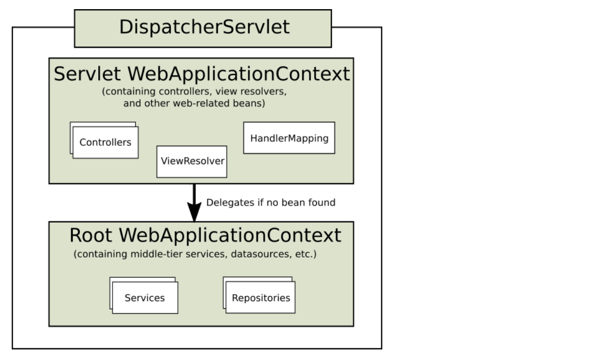

## DispatcherServlet
### overview
围绕前端控制器模式设计,包含一个核心Servlet,称为DispatcherServlet,提供了对请求处理的共享算法,实际工作执行是代理到可配置的组件,此模型非常灵活并且支持不同(diverse)的工作流; \
DispatcherServlet 作为一个Servlet,需要被声明并且根据servlet配置进行示意(要么java 配置或者 web.xml配置),最后DispatcherServlet 使用spring 的配置去发现代理组件(用来处理请求映射、视图映射、异常处理、以及[更多](https://docs.spring.io/spring-framework/docs/5.3.10-SNAPSHOT/reference/html/web.html#mvc-servlet-special-bean-types)的组件)) \
下面的一个例子是DispatcherServlet的一种java配置注册,通过Servlet 容器来自动检测(查看[Servlet Config](https://docs.spring.io/spring-framework/docs/5.3.10-SNAPSHOT/reference/html/web.html#mvc-container-config)) \

```java
public class MyWebApplicationInitializer implements WebApplicationInitializer {

    @Override
    public void onStartup(ServletContext servletContext) {

        // Load Spring web application configuration
        AnnotationConfigWebApplicationContext context = new AnnotationConfigWebApplicationContext();
        context.register(AppConfig.class);

        // Create and register the DispatcherServlet
        DispatcherServlet servlet = new DispatcherServlet(context);
        ServletRegistration.Dynamic registration = servletContext.addServlet("app", servlet);
        registration.setLoadOnStartup(1);
        registration.addMapping("/app/*");
    }
}
```

你也能够使用一个在web.xml中配置、注册初始化DispatcherServlet;

```xml
<web-app>

    <listener>
        <listener-class>org.springframework.web.context.ContextLoaderListener</listener-class>
    </listener>

    <context-param>
        <param-name>contextConfigLocation</param-name>
        <param-value>/WEB-INF/app-context.xml</param-value>
    </context-param>

    <servlet>
        <servlet-name>app</servlet-name>
        <servlet-class>org.springframework.web.servlet.DispatcherServlet</servlet-class>
        <init-param>
            <param-name>contextConfigLocation</param-name>
            <param-value></param-value>
        </init-param>
        <load-on-startup>1</load-on-startup>
    </servlet>

    <servlet-mapping>
        <servlet-name>app</servlet-name>
        <url-pattern>/app/*</url-pattern>
    </servlet-mapping>

</web-app>
```
Spring Boot 允许不同的初始化顺序,而不是通过Servlet 容器的回调钩子进行启动,boot允许使用Spring 配置去引导它自己以及一个内嵌的Servlet 容器,过滤器以及Servlet 声明可以在Spring配置中检测并通过Servlet容器注册,查看更多信息[boot documentation](https://docs.spring.io/spring-boot/docs/current/reference/htmlsingle/#boot-features-embedded-container)

#### 上下文层级(Context Hierarchy)
DispatcherServlet 期待一个WebApplicationContext(是一个ApplicationContext的简单扩展)自定义配置;\
WebApplicationContext 和ServletContext 以及Servlet之间存在一个联系;它也约束了ServletContext这样的应用能够使用RequestContextUtils静态方法去查询一个WebApplicationContext(如果它确实需要访问); \
对于许多应用来说,有一个webApplicationContext是简单且足够的,它也可能拥有一个上下文层级(存在一个顶级的WebApplicationContext 在多个DispatcherServlet中共享,或者其他Servlet实例),每一个都可以有自己的子级WebApplicationContext 配置,查看[Additional Capabilities of the ApplicationContext](https://docs.spring.io/spring-framework/docs/5.3.10-SNAPSHOT/reference/html/core.html#context-introduction)来获取在上下文层级的特性; \
顶级的web应用上下文通常包含了一些基础设施bean,例如数据仓库、业务服务bean,需要共享到多个Servlet实例,这些beans 是能够有效的继承并且能够覆盖(意味着,重新声明)到Servlet指定的子 Web应用上下文中;

于是你可以选择通过以下方式定义你的顶级Web应用上下文以及Servlet应用上下文;
```java
public class MyWebAppInitializer extends AbstractAnnotationConfigDispatcherServletInitializer {

    @Override
    protected Class<?>[] getRootConfigClasses() {
        return new Class<?>[] { RootConfig.class };
    }

    @Override
    protected Class<?>[] getServletConfigClasses() {
        return new Class<?>[] { App1Config.class };
    }

    @Override
    protected String[] getServletMappings() {
        return new String[] { "/app1/*" };
    }
}
```
如果不需要应用上下文层级(体系),应用能够返回所有配置(通过getRootConfigClasses)然后使得getServletConfigClasses()返回null;

上面的例子等价于web.xml:
```xml
<web-app>

    <listener>
        <listener-class>org.springframework.web.context.ContextLoaderListener</listener-class>
    </listener>

    <context-param>
        <param-name>contextConfigLocation</param-name>
        <param-value>/WEB-INF/root-context.xml</param-value>
    </context-param>

    <servlet>
        <servlet-name>app1</servlet-name>
        <servlet-class>org.springframework.web.servlet.DispatcherServlet</servlet-class>
        <init-param>
            <param-name>contextConfigLocation</param-name>
            <param-value>/WEB-INF/app1-context.xml</param-value>
        </init-param>
        <load-on-startup>1</load-on-startup>
    </servlet>

    <servlet-mapping>
        <servlet-name>app1</servlet-name>
        <url-pattern>/app1/*</url-pattern>
    </servlet-mapping>

</web-app>
```
如果一个应用上下文层次结构不是需要的,应用可能会配置一个根上下文(仅仅)并且会使得contextConfigLocation(Servlet 参数为空),这句话在web.xml配置中适用,因为使用java配置,这可能意义不大,但是效果差不多;

#### 特殊的bean 类型
DispatcherServlet 代理到指定的bean去处理请求以及渲染合适的响应,"通过规定的bean" -> 我们指的是实现框架契约的 Spring 管理的对象实例,那些通常往往是内置约束、合作,但是你能够自定义它们 的属性以及扩展或者替代它们;\
下面的列表展示了那些bean能够被DispatcherServlet检测:
* HandlerMapping
    将一个请求映射到指定的handler上(包含了拦截器的pre以及后置处理),这个映射基于某些条件,详细信息查看HandlerMapping实现; \
    两个主要的HandlerMapping 实现是RequestMappingHandlerMapping(它支持@RequestMapping 注解的方法)以及SimpleUrlHandlerMapping(它维护URL路径模式的显式注册到指定的handlers)
* HandlerAdapter
    帮助DispatcherServlet 去执行一个handler方法到映射到一个请求,不管handler实际上如何执行,举个例子,执行一个注解过的controller需要解析注解,HandlerAdapter的主要目的是去保护DispatcherServlet免受这些细节影响;

* HandlerExceptionResolver
    策略解析异常,可能映射它们到handlers,到html错误视图,或者其他的目标,查看异常部分获取[更多](https://docs.spring.io/spring-framework/docs/5.3.10-SNAPSHOT/reference/html/web.html#mvc-exceptionhandlers);
* ViewResolver 解析逻辑基于字符串的视图名称(从handler方法返回的字符串视图名称)到实际的View(通过它渲染响应),查看[View Resolution](https://docs.spring.io/spring-framework/docs/5.3.10-SNAPSHOT/reference/html/web.html#mvc-viewresolver)以及[View Technologies](https://docs.spring.io/spring-framework/docs/5.3.10-SNAPSHOT/reference/html/web.html#mvc-view)

* LocaleResolver,LocaleContextResolver
    解析Locale的客户端去使用或者尽可能遵循它们的时区,为了能够提供国际化视图 ,可以查看[Locale](https://docs.spring.io/spring-framework/docs/5.3.10-SNAPSHOT/reference/html/web.html#mvc-localeresolver);
* ThemeResolver 解析你应用程序中使用的主题-例如 提供个性化的布局,查看[Themes](https://docs.spring.io/spring-framework/docs/5.3.10-SNAPSHOT/reference/html/web.html#mvc-themeresolver);

* MultipartResolver 解析一个多文件上传请求的抽象(例如 ,浏览器形式的文件上传)使用某些文件上传的解析库帮助,查看[Multipart Resolver](https://docs.spring.io/spring-framework/docs/5.3.10-SNAPSHOT/reference/html/web.html#mvc-multipart)

* FlashMapManager 存储并抓取"input" 以及 "output" FlashMap 能够被用于传递属性(从一个请求传递到另一个请求),通常在重定向中非常有效,查看[Flash Attributes](https://docs.spring.io/spring-framework/docs/5.3.10-SNAPSHOT/reference/html/web.html#mvc-flash-attributes)

#### Web Mvc Config
应用能够声明上面指定bean 类型列表列出的基础设施bean(来确保处理请求),这个DispatcherServlet 会从WebApplicationContext中获取每一个特殊的bean,如果这里没有匹配到bean 类型,否则它会降级处理(在DispatcherServlet.properties中的默认类型列表) \
大多数情况下,[MVC Config](https://docs.spring.io/spring-framework/docs/5.3.10-SNAPSHOT/reference/html/web.html#mvc-config)是一个好的开始,它可以声明需要的bean(通过java 配置或者基于xml),提供高水准的配置回调API 进行这些自定义; \
Note: boot 依赖于MVC java配置spring mvc 并且提供了许多额外的方便的选项;
#### Servlet Config
在Servlet 3.0+ 环境中,你能够程序化配置Servlet 容器的一个选择(要么替换web.xml或者合并web.xml),下面是注册DispatcherServlet的一个例子:
```java
import org.springframework.web.WebApplicationInitializer;

public class MyWebApplicationInitializer implements WebApplicationInitializer {

    @Override
    public void onStartup(ServletContext container) {
        XmlWebApplicationContext appContext = new XmlWebApplicationContext();
        appContext.setConfigLocation("/WEB-INF/spring/dispatcher-config.xml");

        ServletRegistration.Dynamic registration = container.addServlet("dispatcher", new DispatcherServlet(appContext));
        registration.setLoadOnStartup(1);
        registration.addMapping("/");
    }
}
```
WebApplicationInitializer 是一个接口被SpringMVc提供确保你的实现将会被检测并且自动被Servlet3容器自动初始化,一个WebApplicationInitializer的抽象基类实现是AbstractDispatcherServletInitializer,确保它更容易注册DispatcherServlet(通过覆盖方法来指定DispatcherServlet的配置位置(例如Servlet WebApplicationContext的配置文件位置等等)以及servlet 映射)
```java
public class MyWebAppInitializer extends AbstractAnnotationConfigDispatcherServletInitializer {

    @Override
    protected Class<?>[] getRootConfigClasses() {
        return null;
    }

    @Override
    protected Class<?>[] getServletConfigClasses() {
        return new Class<?>[] { MyWebConfig.class };
    }

    @Override
    protected String[] getServletMappings() {
        return new String[] { "/" };
    }
}
```
如果你使用了基于xml的spring配置,你应该直接从AbstractDispatcherServletInitializer进行扩展,例如:
```java
public class MyWebAppInitializer extends AbstractDispatcherServletInitializer {

    @Override
    protected WebApplicationContext createRootApplicationContext() {
        return null;
    }

    @Override
    protected WebApplicationContext createServletApplicationContext() {
        XmlWebApplicationContext cxt = new XmlWebApplicationContext();
        cxt.setConfigLocation("/WEB-INF/spring/dispatcher-config.xml");
        return cxt;
    }

    @Override
    protected String[] getServletMappings() {
        return new String[] { "/" };
    }
}
```
abstractDispatcherServletInitializer 也提供了一个方便的形式去增加一个Filter 实例并且让他们能够自动映射到DispatcherServlet中
```java
public class MyWebAppInitializer extends AbstractDispatcherServletInitializer {

    // ...

    @Override
    protected Filter[] getServletFilters() {
        return new Filter[] {
            new HiddenHttpMethodFilter(), new CharacterEncodingFilter() };
    }
}
```
每一个过滤器使用默认名称(基于它自己的具体的类型)并自动映射到DispatcherServlet;

AstractDispatcherServletInitializer的isAsyncSupported保护方法提供了一个在DispatcherServlet中启动异步支持并映射所有过滤器给它,默认设置为true的;
#### 处理(processing)
DispatcherServlet 处理请求根据以下:
* WebApplicationContext 能够被搜索并且它被绑定为一个请求的属性(Controller 以及其他的元素在当前进程中能够使用它进行处理),默认通过DispatcherServlet.WEB_APPLICATION_CONTEXT_ATTRIBUTE key绑定;
* locale 解析器也是绑定到请求上能够让元素在当前进程中解析使用的locale(当处理请求时- 渲染视图、预解析数据以及等等),如果你不需要locale 解析,你不需要locale解析器;
* theme 解析器也会绑定到请求中让元素(决定怎样使用主题),如果你不希望使用主题,你可以忽略它;
* 你能够指定一个文件上传解析器,会检测请求是不是一个文件上传请求,如果文件上传请求发现,此请求将会包装为一个MultipartHttpServletRequest 来进行后续处理(通过当前进程中的其他元素处理),查看[Multipart Resolver](https://docs.spring.io/spring-framework/docs/5.3.10-SNAPSHOT/reference/html/web.html#mvc-multipart) 获取更多关于文件上传的处理的详细信息;
* 如果发现了一个合适的handler,运行与处理程序（预处理器、后处理器和控制器）关联的执行链以准备用于渲染的模型,除此之外,对于带有注释(例如@ResponseBody)的控制器,响应能够被渲染(在HandlerAdapter内)而不是返回一个视图;
* 如果返回了一个model,那么视图将会被渲染,如果没有Model返回(业务由于预处理器或者后置处理器拦截了此请求,由于安全原因),没有视图能够被渲染,因为请求已经被处理完成了;

HandlerExceptionResolver bean 可以声明在WebApplicationContext被用来解析当在请求处理过程中抛出的异常进行解析,那些异常解析器允许自定义阐述异常的逻辑,查看[Exception](https://docs.spring.io/spring-framework/docs/5.3.10-SNAPSHOT/reference/html/web.html#mvc-exceptionhandlers)获取更多详细信息;

同样支持http 缓存支持,处理器能够使用WebRequest的checkNotModified方法,以及用于控制器的 HTTP 缓存中描述的带注释控制器的更多选项[Http Caching for Controllers](https://docs.spring.io/spring-framework/docs/5.3.10-SNAPSHOT/reference/html/web.html#mvc-caching-etag-lastmodified)

你能够单独的定制DispatcherServlet 实例(通过增加一个Servlet 初始化参数到web.xml),它支持以下参数:
* contextClass ConfigurableWebApplicationContext的实现类,会被实例化并被DispatcherServlet本地包含,默认使用的XmlWebApplicationContext;
* contextConfigLocation 表示spring相关的配置文件存放位置,会传递给上下文实例,这个位置可以是多个配置文件的位置,会通过常用分隔符进行分割,在多应用上下文位置放置相同bean 定义,后者的位置具有更高的优先级;

* namespace WebApplicationContext的命名空间,默认是[servlet-name]-servlet,所以一般来说dispatcherServlet的名称是 dispatcher,所以此上下文的命名空间是dispatcher-Servlet;
* throwExceptionIfNoHandlerFound 
    没有发现处理此请求的handler是否应该抛出异常(NoHandlerFoundException),此异常能够被HandlerExceptionResolver捕获(例如@ExceptionHandler 控制器方法)并且处理;
    默认来说,设置为 false,这种情况DispatcherServlet会设置响应到404(NOT_FOUND)而不是抛出一个异常;
   注意: 如果配置了[default servlet mapping](https://docs.spring.io/spring-framework/docs/5.3.10-SNAPSHOT/reference/html/web.html#mvc-default-servlet-handler),未解析的请求总是转发给默认servlet 并且 404永远不会抛出;

#### 路径匹配
servlet api 暴露所有的请求路径作为requestURI 并且会详细划分为contextPath、servletPath以及pathInfo(这些值依赖于Servlet到底是如何配置的),从这些输入来说,mvc 需要解析映射handler的路径查询,这些路径在DispatcherServlet自己内部的映射,排除contextPath以及任何servletMapping前缀(如果它出现了);

servletPath 以及 pathInfo 是解码的并且确保它们不可能直接和全requestURI进行比较(以导出 lookupPath 并且需要对 requestUri 进行解码),然而这会导致它自己的问题,因为路径中包含了编码的保留字符例如'/',';',这反过来又会在解码后改变路径的结构,这会导致安全问题;除此之外,Servlet 容器可能会在不同程度上对 servletPath 进行规范化，这使得进一步无法针对 requestUri 执行 startsWith 比较

这就是为什么最好避免依赖基于前缀的servletPath映射类型附带的servletPath,如果DispatcherServlet使用'/'映射为默认servlet或者没有前缀'/*',并且Servlet 容器是4.0+,那么spring mvc能够检测Servlet的映射类型并且完全避免使用servletPath和pathInfo,在servlet3.1容器上,假设相同的Servlet映射类型,可以通过在mvc配置中通过路径匹配提供的具有alwaysUseFullPath=true的UrlPathHelper来实现等效;
因此默认的Servlet 映射'/'是一个好的选择,然而这仍然存在一个问题(requestUri需要解码并且使得它能够和controller的mappings进行比较),这又是不可取的,因为有可能对改变结构路径的保留字符进行编码,如果这些字符串是不期待的,那么你应该拦截它们(例如 security http firewall),或者你应该配置UrlPathHelper(包含urlDecode=false),但是controller mappings 将需要匹配编码的路径(但是也许不总是会工作),因此有些时候DispatcherServlet 需要更像URL 空间(通过其他的Servlet)并且需要通过前缀进行映射;

上面的问题能够通过将PathMatcher 切换到以解析的PathPattern 更加完善的解决(在spring 5.3以及更高可用),see [Pattern Comparison](https://docs.spring.io/spring-framework/docs/5.3.10-SNAPSHOT/reference/html/web.html#mvc-ann-requestmapping-pattern-comparison),不像AntPathMatcher它需要查询解码的路径或者编码过的控制器映射,一个解析过的PathPattern 匹配一个解析过的路径(叫做 RequestPath),一次一个路径碎片,解析的PathPattern也支持servletPath前缀映射的使用(只要前缀保持简单并且不包含需要编码的字符)

#### interception
所有的HandlerMapping 实现支持handler拦截器 (当你想要应用一些特殊的功能到具体请求上时)非常有用,举个例子,对一个主体进行检测,拦截器必须实现HandlerInterceptor (来自org.springframework.web.servlet)的三个方法(它能够提供足够的灵活性进行所有的前置处理以及后置处理)
* preHandle(..): 
* postHandle(..):
* afterCompletion(..) 请求已经完成之后...
如果preHandle返回false,那么DispatcherServlet会认为拦截器已经处理了请求,不会在交给其他的过滤器以及实际的处理器进行处理;

可以通过mvc配置注册拦截器,也可以通过单独的HandlerMapping实现设置拦截器;

注意postHandle 对于@ResponseBody以及ResponseEntity方法对于响应已经写入完成以及在postHandle之前在HandlerAdapter中提交了响应处理那么基本上没什么作用,这意味着改变响应太晚了,例如增加一个额外的请求头,对于更多实际场景,你能够实现ResponseBodyAdvice 并且要么声明一个[Controller Advice ](https://docs.spring.io/spring-framework/docs/5.3.10-SNAPSHOT/reference/html/web.html#mvc-ann-controller-advice)bean,或者直接在RequestMappingHandlerAdapter中配置;

#### 异常
如果一个异常在请求映射或者从一个请求处理器(@Controller)中抛出时,DispatcherServlet 会代理异常处理到HandlerExceptionResolver beans 去解析异常以及提供额外的处理,通常是一个错误响应 \
 下面列出了必要的HandlerExceptionResolver 实现列表:
 * SimpleMappingExceptionResolver 将一个异常类名和错误视图名进行映射,通常在浏览端应用中去渲染一个错误页面是有用的
 * DefaultHandlerExceptionResolver springMvc中抛出的异常解析并映射它们到http 状态码,查看额外的ResponseEntityExceptionHandler 以及 [rest api 异常信息](https://docs.spring.io/spring-framework/docs/5.3.10-SNAPSHOT/reference/html/web.html#mvc-ann-rest-exceptions)
 * ResponseStatusExceptionResolver  解析@ResponseStatus注解的异常并映射它们到具体的http 状态码(根据此注解的value值)
 * ExceptionHandlerExceptionResolver 通过执行一个@Controller或者@ControllerAdvice中的@ExceptionHandler方法来解析异常,查看[@ExceptionHandler methods](https://docs.spring.io/spring-framework/docs/5.3.10-SNAPSHOT/reference/html/web.html#mvc-ann-exceptionhandler)
 ##### 解析器的链
 你能够形成一个异常解析链(通过声明多个HandlerExceptionResolver beans到 Spring configuration 并且根据需要设置它们的order 属性),order 属性越高,异常解析器定位越晚; \
 HandlerExceptionResolver的规定能够返回:
* ModelAndView 指示一个错误视图
* 如果异常已经在resolver 处理完毕之后会返回一个空ModelAndView
* 如果异常未解决则返回null,供后续解析器尝试,如果到最后异常仍然存在,则允许它冒泡到Servlet 容器;  \
这个Mvc 配置能够自动的声明内置的解析器(对于默认的spring mvc 异常),为了处理@ResponseStatus 注解的异常,并且为了支持@ExceptionHandler 方法,你能够定制列表并替换它;
##### 容器错误页面
 如果异常没有被HandlerExceptionResolver解决,那么会持续传播或者如果响应状态设置为一个错误状态(4xx,5xx),servlet 容器能够渲染一个默认的错误html 页面; 为了定制容器的错误页面(你可以渲染在web.xml中声明错误页面的定制),例如:
 ```xml
<error-page>
    <location>/error</location>
</error-page>
```
前面的例子中,如果异常冒泡或者响应已经存在了错误码,servlet 容器会产生一个错误分发(通过容器内部已经配置完毕的URL(/error)),本身此过程通过dispatcherServlet处理,尽可能映射它到一个@Controller中,能够实现返回一个拥有model的错误视图或者渲染一个JSON 响应,例如:
```java
@RestController
public class ErrorController {

    @RequestMapping(path = "/error")
    public Map<String, Object> handle(HttpServletRequest request) {
        Map<String, Object> map = new HashMap<String, Object>();
        map.put("status", request.getAttribute("javax.servlet.error.status_code"));
        map.put("reason", request.getAttribute("javax.servlet.error.message"));
        return map;
    }
}
```
此Servlet api 没有提供一个方式去创建错误页面映射(在java中),但是可以选择同时包含WebApplicationInitializer 以及一个最小化的web.xml配置;
#### 视图解析
spring mvc 定义ViewResolver 以及 View接口能够让你在浏览器中渲染models不需要你使用指定的视图技术,ViewResolver 提供了一个在view名称和实际视图的映射,View 解释数据的预准备,在指定视图技术之上渲染之前; \
下面列出了ViewResolver 技术体系的详细信息:
* AbstractCachingViewResolver AbstractCachingViewResolver缓存视图的子类实例,缓存能够提高某些视图技术的性能,你能够关闭缓存,通过设置cache = false,因此你必须在运行时刷新某个视图(例如 ,修改FreeMarker模板被修改时),你也能够使用removeFromCache(String viewName,Locale loc)方法;
* UrlBasedViewResolver ViewResolver的简单实现(是一种将逻辑视图名到URL的有效直接解决方案，而不需要映射定义),如果你的逻辑名匹配了你的视图资源的名称(一种直接了当的方式),这是合适的,不需要映射;
* InternalResourceViewResolver UrlBasedViewResolver的简洁子类支持InternalResourceView(强调: Servlets 以及 JSPs)以及 JstlView 、TilesViews视图,后两者不常用,你能够指定(生成有所有视图)的视图类名,通过设置resolver的setViewClass(..),查看UrlBasedViewResolver获取更多;
* FreeMarkerViewResolver UrlBasedViewResolver的一个简洁子类(支持FreeMarkerView)并且它自己的自定义子类;
* ContentNegotiatingViewResolver ViewResolver的实现能够解析一个基于请求文件名或者Accept请求头的视图,查看[内容协商](https://docs.spring.io/spring-framework/docs/5.3.10-SNAPSHOT/reference/html/web.html#mvc-multiple-representations)
* BeanNameViewResolver 实现了ViewResolver接口、能够将一个视图名解析为bean名称(在当前应用上下文),这是一个非常灵活的变量(它允许混合以及匹配不同的视图类型-基于不同的视图名),每一个View能够定义成一个bean,或者放置在xml或者配置文件中;

##### 处理
你能够通过声明多个视图解析器bean组成一个解析链,通过设置order属性来指定它们解析视图的顺序,记住order值越大,位置越靠后; \
ViewResolver的规定是如果视图没有被发现,则返回null,但是在jsp以及InternalResourceViewResolver中,这只有一种方式去推测(如果jsp存在那么通过RequestDispatcher进行派发),因此你必须总是需要配置一个InternalResourceViewResolver到最后(进行兜底操作); \
配置视图 解析是非常简单的,只需要增加一个ViewResolver bean到你的spring 配置中,mvc 配置提供了一个专属的配置api进行View 解析器的配置以及增加一些可选的ViewController (如果仅仅只需要通过url映射到html 模板,而无需通过controller 逻辑,那么此配置非常有效);
##### 重定向
redirect: .... 会被UrlBasedViewResolver进行解析,判断此指令应该重定向到哪里,将视图名(此时它应该又是一个url)作为重定向结果; \
 最终效果就是就像是从controller中返回了一个RedirectView(这两种效果一致),但是现在controller本身能够根据逻辑视图名称规范进行操作,例如 (redirect: /myapp/some/resource)重定向相对于当前Servlet context的一个URL,当然也可以重定向到一个绝对URL地址; \
 注意: 如果controller方法注解了@ResponseStatus,此注解的值优先级高于(RedirectView设置响应状态的值)
 
##### 转发
你也能够使用forward: 视图名称的前缀将通过UrlBasedViewResolver以及子类进行解析,本身会创建一个InternalResourceView,它会尝试RequestDispatcher.forward(). 因此,在InternalResourceViewResolver 以及 InternalResourceView(jsp)中来说,此前缀没有作用,但是当你使用了其他的视图技术(但是想要强制进行一个资源的转发能够被SERVLET/JSP引擎处理)是非常有用的,注意的是你需要有一个多视图解析器的链进行替换;
##### 内容协商
[ContentNegotiatingViewResolver](https://docs.spring.io/spring-framework/docs/5.3.10-SNAPSHOT/javadoc-api/org/springframework/web/servlet/view/ContentNegotiatingViewResolver.html) 它本身不会解析视图但是它会代理给其他的视图解析器处理并且选择客户端请求类似的视图,这个代表-能够从Accept请求头中推断或者从一个查询参数中进行推断("/path?format=paf") \
此内容协商视图解析器选择一个合适的视图去处理请求(通过比较请求媒体类型(使用media type 被称为Content-Type请求头)-被ViewResolver相关联的View所支持的mediaType进行比较),View首先有一个兼容的Content-Type返回并呈现给客户端,如果一个兼容的视图不能够被ViewResolver链应用,通过DefaultViews属性设置的视图列表将会被考虑,后者对于单个View能够渲染当前资源的一个合适的呈现而不管逻辑当前逻辑视图名是怎样,Accept请求头能够包括通配符(text/*),这种情况下如果包含一个Content-Type是text/html的View那么将兼容此匹配; \
查看View Resolver(在mvc配置中的详细获取更多) \
#### Locale
spring 支持国际化的骨架的大部分,在spring web mvc中是这样,DispatcherServlet 会使用客户端的locale进行消息解析,通过LocaleResolver对象完成; \
当一个请求进入,DispatcherServlet 尝试查询一个locale Resolver,如果发现了一个,将尝试使用它设置locale,通过RequestContext.getLocale方法,你能够总是抓取通过LocaleResolver解析的locale; \
为了自动locale解析,你也能够将拦截器附加(拦截)到处理器映射(查看[interception](https://docs.spring.io/spring-framework/docs/5.3.10-SNAPSHOT/reference/html/web.html#mvc-handlermapping-interceptor)查看handler映射的拦截器信息))来改变特殊情况下的locale(例如: 基于请求中的参数) \
Locale 解析器并且拦截器是定义在org.springframework.web.servlet.i18n包中并且通过普通的方式配置到你的应用上下文中,spring 默认包括了以下几种locale解析器:
* [TimeZone](https://docs.spring.io/spring-framework/docs/5.3.10-SNAPSHOT/reference/html/web.html#mvc-timezone)
* [Header Resolver](https://docs.spring.io/spring-framework/docs/5.3.10-SNAPSHOT/reference/html/web.html#mvc-localeresolver-acceptheader)
* [Cookie Resolver](https://docs.spring.io/spring-framework/docs/5.3.10-SNAPSHOT/reference/html/web.html#mvc-localeresolver-cookie)
* [Session Resolver](https://docs.spring.io/spring-framework/docs/5.3.10-SNAPSHOT/reference/html/web.html#mvc-localeresolver-session)
* [Locale Interceptor](https://docs.spring.io/spring-framework/docs/5.3.10-SNAPSHOT/reference/html/web.html#mvc-localeresolver-interceptor)
##### TimeZone
除了包含客户端的locale,time zone也是非常有用的,LocaleContextResolver接口提供了一个LocaleResolver的扩展让解析器提供一个丰富的LocaleContext,它也许包括了time zone 信息; \
如果有必要,用户的时区可以通过使用RequestContext.getTimeZone方法获取,时区信息会自动通过任何 Date/Time Converter 以及 Formatter对象(已经通过Spring 的ConversionService注册的这些对象)进行使用;
##### Header Resolver
此locale resolver 检测 accept-language 请求头来进行locale 解析,此请求头包含了当前客户端操作系统使用的locale,注意这个resolver不支持time zone 信息;
##### Cookie Resolver
此locale resolver 检测一个Cookie信息(查看它是否设置了TimeZone 或者Locale信息),如果有进行locale解析,其次还可以设置此解析器的一些属性(例如指定cooke的名称以及最大存活时间),例如:
```xml
<bean id="localeResolver" class="org.springframework.web.servlet.i18n.CookieLocaleResolver">

    <property name="cookieName" value="clientlanguage"/>

    <!-- in seconds. If set to -1, the cookie is not persisted (deleted when browser shuts down) -->
    <property name="cookieMaxAge" value="100000"/>

</bean>
```
下面的表描述了CookieLocaleResolver的属性:
* 属性   默认     描述
*   cookieName classname+LOCALE cookie的名称
* cookieMaxAge servlet容器默认设置    -1表示不进行持久化,当关闭浏览器则清除;
* cookiePath /    限制cookie对于你站点的某些部分的限制可见性,当cookiePath 指定了,只有当前路径以及子路径可见
##### session Resolver
此SessionResolver会从session中抓取Locale/TimeZone,对比CookieLocaleResolver,此策略是局部存储(通过servlet容器内部的HttpSession进行设置),结果就是,对于每个会话来说都是临时的,会话结束之后丢失信息; \
这里没有和外部的会话管理机制有直接的关系,例如Spring Session项目,SessionLocaleResolver 评估、修改相关的HttpSession属性(针对当前HttpServletRequest)
##### Locale Interceptor
你能够启动locales的修改(通过增加一个LocaleChangeInterceptor到HandlerMapping定义之一中),它会推断请求中的参数并且改变locale,在dispatcher的应用上下文中调用LocaleResolver上的setLocale方法,下面的例子就是调用*.view资源(包含了一个参数名为siteLanguage)立即改变Locale,因此如果有一个请求为https://www.sf.net/home.view?siteLanguage=nl,改变站点语言为Dutch(荷兰),例如:
```xml
<bean id="localeChangeInterceptor"
        class="org.springframework.web.servlet.i18n.LocaleChangeInterceptor">
    <property name="paramName" value="siteLanguage"/>
</bean>

<bean id="localeResolver"
        class="org.springframework.web.servlet.i18n.CookieLocaleResolver"/>

<bean id="urlMapping"
        class="org.springframework.web.servlet.handler.SimpleUrlHandlerMapping">
    <property name="interceptors">
        <list>
            <ref bean="localeChangeInterceptor"/>
        </list>
    </property>
    <property name="mappings">
        <value>/**/*.view=someController</value>
    </property>
</bean>
```
#### 主题Theme
这个东西用的人很少,不做解释,就是为静态资源映射一些主题信息,然后直接在视图文件中进行使用,视图解析还原信息;
#### 文件上传 Multipart Resolver
此文件上传解析器来自org.springframework.web.multipart包(是一个处理文件上传的策略接口),其中一个实现就是基于[commons fileupload](https://commons.apache.org/proper/commons-fileupload)以及基于servlet 3.0的文件上传请求解析; \
为了启用多文件上传,你需要声明一个MultipartResolver bean到DispatcherServlet相关的spring配置中,bean名称为multipartResolver,DispatcherServlet 检测它并应用到进入的请求上,当一个POST请求并且content-Type = multipart/form-data被接受,那么此resolver 解析此内容并将当前HttpServletRequest包装为一个MultipartHttpServletRequest去提供对已解析文件的访问,除了暴露一部分作为请求参数;
##### Apache Commons FileUpload
为了使用apache的普通文件上传,你需要配置一个CommonsMultipartResolver,你需要导入commons-fileupload jar 作为依赖. \
此解析器变种在当前应用中将代理给局部库来处理文件上传,提供最大移植性(在跨Servlet 容器之间),除此之外,可以使用标准的Servlet 多文件解决方案(通过容器本身的解析器解析,将在下面进行讨论) \
注意: Commons 文件上传支持POST请求且Content-type = /multipart/,查看CommonsMultipartResolver 获取更多配置详情;
##### Servlet 3.0
* java 配置,在Servlet 注册中设置MultipartConfigElement元素
* web.xml中增加一个<multipart-config>元素配置到servlet 声明上\
例如:
```java
public class AppInitializer extends AbstractAnnotationConfigDispatcherServletInitializer {

    // ...

    @Override
    protected void customizeRegistration(ServletRegistration.Dynamic registration) {

        // Optionally also set maxFileSize, maxRequestSize, fileSizeThreshold
        registration.setMultipartConfig(new MultipartConfigElement("/tmp"));
    }

}
```
一旦Servlet3.0配置完毕,你能够增加一个StandardServletMultipartResolver的bean,注意名称一定是multipartResolver;\
注意: 此解析器使用你的SERVLET 容器的文件上传解析器,底层暴露此应用到容器实现存在差异,默认来说解析任何/multipart/ content-type请求头(且任意类型的请求方法)但是在所有的servlet 容器上兼容性不好,查看文档查看更多;
#### 日志
spring mvc 设置debug级别为紧凑、最小化且人性化;它侧重于反复有用的高价值信息，而不是仅在调试特定问题时有用的其他信息。 \
TRACE级别通常同dubug一样的原则,对于调试debug问题来说很有用,除此之外,有些日志消息需要展示在TRACE和DEBUG的不同\
好日志来自使用日志的经验,如果你发现了不符合 既定目标的内容请告诉spring;
##### sensitive 敏感信息
DEBUG以及 TRACE日志也许能够记录日志敏感信息,这就是为什么请求参数以及请求头参数默认被记录并且完全显式记录通过DispatcherServlet的enableLoggingRequestDetails属性来开启 \
例如:
```java
public class MyInitializer
        extends AbstractAnnotationConfigDispatcherServletInitializer {

    @Override
    protected Class<?>[] getRootConfigClasses() {
        return ... ;
    }

    @Override
    protected Class<?>[] getServletConfigClasses() {
        return ... ;
    }

    @Override
    protected String[] getServletMappings() {
        return ... ;
    }

    @Override
    protected void customizeRegistration(ServletRegistration.Dynamic registration) {
        registration.setInitParameter("enableLoggingRequestDetails", "true");
    }

}
```