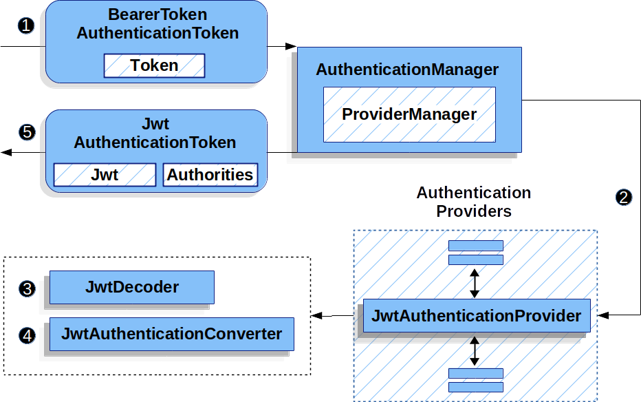
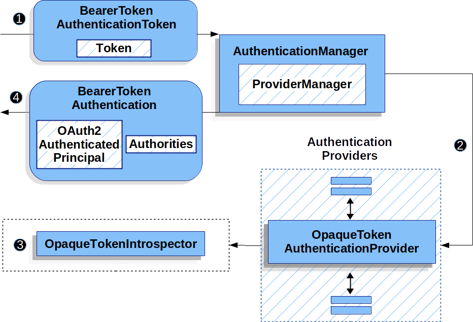

# OAuth2

## OAuth2 Resource Server

### JWT

#### OAuth 2.0 Resource Server JWT

## JWT的最小依赖

    大多数资源服务器支持收集到了spring-security-oauth2-resource-server. 然而对于JWT 的解码和校验的支持是在spring-security-oauth2-jose中,
    意味着两者都是必要的(为了拥有一个支持JWT 编码 Bearer Token的资源服务器工作)

## JWT的最小配置

    当使用Spring Boot,配置一个应用作为资源服务器只需要两步,第一步包括前面所说的依赖,第二步指明授权服务器的位置 ..

### 指明Authorization 服务器的位置

```yml
    spring:
    security:
      oauth2:
        resourceserver:
          jwt:
            issuer-uri: https://idp.example.com/issuer
```

这里的https://idp.example.com/issuer 是包含在JWT token的iss声明中的值(表示授权服务器颁发的),资源服务器使用这个属性 去进一步的自我配置,发现授权服务器的公钥,以及后续校验进入的JWT ..
为了使用issuer-uri 属性,以下其中一个地址必须有一个能够支持访问且返回正确的元数据 .. 类似:
https://idp.example.com/issuer/.well-known/openid-configuration,
https://idp.example.com/.well-known/openid-configuration/issuer,
or https://idp.example.com/.well-known/oauth-authorization-server/issuer
表示授权服务器支持的端点,这个端点指的是 [Provider Configuration endpoint](https://openid.net/specs/openid-connect-discovery-1_0.html#ProviderConfig)
or a [Authorization Server Metadata endpoint](https://tools.ietf.org/html/rfc8414#section-3).

### 开始期望

当这个属性以及这些依赖被使用,资源服务器将自动的配置它自己去校验JWT编码的Bearer Token .. 它通过确定性启动过程来实现这一点： 1. 为了获得jwks_url属性来查询Provider 配置或者授权服务器元数据端点 2.
查询jwks_url端点以确定支持的算法 3. 查询jwks_url以针对发现的有效的公钥算法 配置验证策略 4. 针对iss值 配置校验策略去验证每一个JWT iss 声明
这个过程的结果是授权服务器必须启动且接收这些请求为了资源服务器成功的启动 .. 如果授权服务器死亡(当资源服务器查询它的时候(会有合理的超时),启动将会失败)

### 运行期望

一旦应用启动,资源服务器将尝试处理包含了Authorization: Bearer请求头的任何请求 ... 因此只要这个schema(方案) 被指定,资源服务器将会尝试根据Bearer Token 规范处理请求 .. \
给定一个格式良好的JWT,Resource Server可以:
- 根据从jwks_url端点获取的公钥进行jwt 签名验证 - 验证jwt的exp 以及 nbf 时间戳 和 iss 声明 - 使用SCOPE 映射每一个scope到authority ... 当授权服务器派发了新的密钥,Spring
  Security将自动的轮换密钥 .. Authentication#getPrincipal的结果,默认来说是一个Spring security Jwt对象,并且 Authentication#getName 映射到了JWT的 sub
  属性上(如果它存在的话) ...

## 如何让JWT 认证工作

下一步,让我们查看Spring security使用的架构组件(为了支持在基于Servlet的环境的应用进行JWT 验证)
JwtAuthenticationProvider 是一个AuthenticationProvider 实现(利用JwtDecoder 和 JwtAuthenticationConverter进行 JWT认证)
首先查看JwtAuthenticationProvider 如何工作在Spring security中:


## 直接指定授权服务器JWK Set

如果授权服务器不支持任何配置端点,或者如果资源服务器必须独立启动(而不依靠授权服务器),那么jwk-set-uri可以如下设定:

```yaml
spring:
  security:
    oauth2:
      resourceserver:
        jwt:
          issuer-uri: https://idp.example.com
          jwk-set-uri: https://idp.example.com/.well-known/jwks.json
```

这个JWK Set并没有标准化,但是它通常能够在授权服务器文档中发现 ... 因此资源服务器不再需要启动时 ping 授权服务器,我们仍然指定issuer-uri(因此资源服务器仍然能够校验进入的JWT的iss声明) ..

## 覆盖或者替代Boot 自动配置

这里有两个Bean - Spring Boot在资源服务器端自动配置的 第一个是SecurityFilterChain(配置应用作为一个资源服务器)
,当包括了spring-security-oauth2-jose,SecurityFilterChain看起来像:

```yml
    @Bean
    public SecurityFilterChain filterChain(HttpSecurity http) throws Exception {
    http
    .authorizeHttpRequests(authorize -> authorize
    .anyRequest().authenticated()
    )
    .oauth2ResourceServer(OAuth2ResourceServerConfigurer::jwt);
    return http.build();
    }
```

如果应用没有暴露SecurityFilterChain bean,那么Spring Boot 将会暴露上面所说的默认值 ... 例如我们可以替代:

```yaml
@EnableWebSecurity
  public class MyCustomSecurityConfiguration {
  @Bean
  public SecurityFilterChain filterChain(HttpSecurity http) throws Exception {
  http
  .authorizeHttpRequests(authorize -> authorize
  .mvcMatchers("/messages/**").hasAuthority("SCOPE_message:read")
  .anyRequest().authenticated()
  )
  .oauth2ResourceServer(oauth2 -> oauth2
  .jwt(jwt -> jwt
  .jwtAuthenticationConverter(myConverter())
  )
  );
  return http.build();
  }
}
```

上述指定了/messages/**下面的URL 必须有message:read的作用域 ... 且覆盖了jwt 认证转换器, ... \
例如我们还可以创建一个JWT Decoder ... 它解码一个字符串token 到已验证的Jwt实例 ...

```yaml
@Bean
  public JwtDecoder jwtDecoder() {
  return JwtDecoders.fromIssuerLocation(issuerUri);
}
```

调用 JwtDecoders#fromIssuerLocation 会调用提供者配置或授权服务器元数据端点以派生 JWK 集 Uri。 如果应用没有暴露JwtDecoder bean,Spring Boot 将会自动的暴露默认值 ..
并且它的配置能够被覆盖,通过使用jwtSetUri() 或者 decoder()进行替代 ...

### 使用jwkSetUri()

一个授权服务器的JWK Set Uri 能够被配置为一个配置属性(或者在DSL 中提供)
此方式设置优先于配置属性的方式

### 使用decoder()

比jwkSetUri()更加有效的是decoder(), 这完全能够通过JwtDecoder的任意Boot 自动配置替代 ..
对于深度配置是非常有效的,类似[验证](https://docs.spring.io/spring-security/reference/servlet/oauth2/resource-server/jwt.html#oauth2resourceserver-jwt-validation),[映射](https://docs.spring.io/spring-security/reference/servlet/oauth2/resource-server/jwt.html#oauth2resourceserver-jwt-claimsetmapping)或者[请求超时](https://docs.spring.io/spring-security/reference/servlet/oauth2/resource-server/jwt.html#oauth2resourceserver-jwt-timeouts)
..

### 暴露一个JwtDecoder @Bean

等价于前一种方式

```yaml
@Bean
  public JwtDecoder jwtDecoder() {
  return NimbusJwtDecoder.withJwkSetUri(jwkSetUri).build();
}
```

## 配置可信的算法

默认,NimbusJwtDecoder,因此资源服务器仅仅使用RS256进行校验Token ... 你能够通过Spring Boot 或者 NimbusJwtDecoder 构建或者
从 [Jwt Set](https://docs.spring.io/spring-security/reference/servlet/oauth2/resource-server/jwt.html#oauth2resourceserver-jwt-decoder-jwk-response)响应中定制
..

### 通过 Spring Boot

最简单的方式就是配置为属性:

```yaml
spring:
  security:
    oauth2:
      resourceserver:
        jwt:
          jws-algorithm: RS512
          jwk-set-uri: https://idp.example.org/.well-known/jwks.json
```

### 使用构建器

```yaml
@Bean
  JwtDecoder jwtDecoder() {
  return NimbusJwtDecoder.withJwkSetUri(this.jwkSetUri)
  .jwsAlgorithm(RS512).build();
}
```

在NimbusJwtDecoder上调用多次jwsAlgorithm 能够处理多种算法 ..

```yaml
@Bean
  JwtDecoder jwtDecoder() {
  return NimbusJwtDecoder.withJwkSetUri(this.jwkSetUri)
  .jwsAlgorithm(RS512).jwsAlgorithm(ES512).build();
}
```

或者你也能够调用 jwsAlgorithms:

```yaml
@Bean
  JwtDecoder jwtDecoder() {
  return NimbusJwtDecoder.withJwkSetUri(this.jwkSetUri)
  .jwsAlgorithms(algorithms -> {
  algorithms.add(RS512);
  algorithms.add(ES512);
  }).build();
}
```

### 从JWK 集合 响应中获取

由于Spring Security的JWT 支持基于Nimbus,你能够极大的利用它的特性 例如: Nimbus 具有JWSKeySelector实现(它将根据JWK Set URI 响应来选择算法集合)
,你能够使用它生成一个NimbusJwtDecoder:

```yaml
@Bean
  public JwtDecoder jwtDecoder() {
  // makes a request to the JWK Set endpoint
  JWSKeySelector<SecurityContext> jwsKeySelector =
  JWSAlgorithmFamilyJWSKeySelector.fromJWKSetURL(this.jwkSetUrl);

  DefaultJWTProcessor<SecurityContext> jwtProcessor =
  new DefaultJWTProcessor<>();
  jwtProcessor.setJWSKeySelector(jwsKeySelector);

  return new NimbusJwtDecoder(jwtProcessor);
}
```

## 信任单个非对称 密钥

相比使用JWK Set端点支持 资源服务器的简化方式是 硬编码RSK 公钥,公钥能够通过Spring boot或者构建器提供

### 通过Spring Boot

```yaml
spring:
  security:
    oauth2:
      resourceserver:
        jwt:
          public-key-location: classpath:my-key.pub
```

或者允许更加复杂的查询,你能够使用 RsaKeyConversionServicePostProcessor后置处理

```yaml
@Bean
  BeanFactoryPostProcessor conversionServiceCustomizer() {
  return beanFactory ->
  beanFactory.getBean(RsaKeyConversionServicePostProcessor.class)
  .setResourceLoader(new CustomResourceLoader());
}
```

指定密钥的位置:

```text
key.location: hfds://my-key.pub
```

然后注入这个值:

```java
public class AutoConfiguration {
    @Value("${key.location}")
    RSAPublicKey key;
}
```

### 使用构建器

为了直接关联一个 RSAPublicKey ,你能够简单的使用合适的 NimbusJwtDecoder 构建器:

```yaml
  @Bean
  public JwtDecoder jwtDecoder() {
  return NimbusJwtDecoder.withPublicKey(this.key).build();
}
```

## 信任单个对称密钥

使用单个对称密钥是简单的, 你能够简单的加载 SecretKey并使用合适的 NimbusJwtDecoder构建器,例如:

```yaml
@Bean
  public JwtDecoder jwtDecoder() {
  return NimbusJwtDecoder.withSecretKey(this.key).build();
}
```

## 配置授权

一个JWT 是从OAuth2.0授权服务器颁发的(通常要么有scope / scp属性),指示这个scope(或者权限)已经被授予,例如:

```json
{
  "scope": "messages contacts"
}
```

当在这种情况下,资源服务器将尝试强制将scope转换为授权的 authorities ,每一个scope使用"SCOPE_"前缀 .. 这就意味着可以通过JWT衍生的SCOPE 进行一个端点或者方法的保护 ...
相关的表达式应该指示这个前缀:

```yaml
@EnableWebSecurity
  public class DirectlyConfiguredJwkSetUri {
  @Bean
  public SecurityFilterChain filterChain(HttpSecurity http) throws Exception {
  http
  .authorizeHttpRequests(authorize -> authorize
  .mvcMatchers("/contacts/**").hasAuthority("SCOPE_contacts")
  .mvcMatchers("/messages/**").hasAuthority("SCOPE_messages")
  .anyRequest().authenticated()
  )
  .oauth2ResourceServer(OAuth2ResourceServerConfigurer::jwt);
  return http.build();
  }
}
```

或者通过基于方法的安全校验:

```java
public class xxx {
    @PreAuthorize("hasAuthority('SCOPE_messages')")
    public List<Message> getMessages(...) {
    }
}
```
## 手动的抓取Authorities
但是，在许多情况下，此默认设置是不够的。 例如某些授权服务器并没有使用scope 属性,相反它们使用的是自定义属性或者,其他情况下
资源服务器也许需要是配置这些属性或者合并这些属性到一个内部化的权限上
为了这样做,Spring Security包含了一个JwtAuthenticationConverter,它负责将JWT 转换为一个Authentication,默认情况下
Spring Security 将会为JwtAuthenticationProvider 使用一个默认的 JwtAuthenticationConverter;
作为配置JwtAuthenticationConverter的一部分,你能提供一个subsidiary(附属)的转换器 从JWT到 授权集合 处理 ..
假设你的授权服务器使用了一个自定义的声明叫做 authorities 来交流权限,在这种情况下,你能够配置JwtAuthenticationConverter 应该检查这个Claim
```yaml
@Bean
public JwtAuthenticationConverter jwtAuthenticationConverter() {
    JwtGrantedAuthoritiesConverter grantedAuthoritiesConverter = new JwtGrantedAuthoritiesConverter();
    grantedAuthoritiesConverter.setAuthoritiesClaimName("authorities");

    JwtAuthenticationConverter jwtAuthenticationConverter = new JwtAuthenticationConverter();
    jwtAuthenticationConverter.setJwtGrantedAuthoritiesConverter(grantedAuthoritiesConverter);
    return jwtAuthenticationConverter;
}
```
你也能够配置授权前缀可以变得不同,通过ROLE_代替SCOPE_ ...
```yaml
@Bean
public JwtAuthenticationConverter jwtAuthenticationConverter() {
    JwtGrantedAuthoritiesConverter grantedAuthoritiesConverter = new JwtGrantedAuthoritiesConverter();
    grantedAuthoritiesConverter.setAuthorityPrefix("ROLE_");

    JwtAuthenticationConverter jwtAuthenticationConverter = new JwtAuthenticationConverter();
    jwtAuthenticationConverter.setJwtGrantedAuthoritiesConverter(grantedAuthoritiesConverter);
    return jwtAuthenticationConverter;
}
```
Or, you can remove the prefix altogether by calling JwtGrantedAuthoritiesConverter#setAuthorityPrefix("").
为了更加灵活,DSL 支持完全替换转换器,通过 Converter<Jwt, AbstractAuthenticationToken> 自定义实现即可 ...

```java
static class CustomAuthenticationConverter implements Converter<Jwt, AbstractAuthenticationToken> {
    public AbstractAuthenticationToken convert(Jwt jwt) {
        return new CustomAuthenticationToken(jwt);
    }
}

// ...

@EnableWebSecurity
public class CustomAuthenticationConverterConfig {
    @Bean
    public SecurityFilterChain filterChain(HttpSecurity http) throws Exception {
        http
            .authorizeHttpRequests(authorize -> authorize
                .anyRequest().authenticated()
            )
            .oauth2ResourceServer(oauth2 -> oauth2
                .jwt(jwt -> jwt
                    .jwtAuthenticationConverter(new CustomAuthenticationConverter())
                )
            );
        return http.build();
    }
}
```
## 配置验证
使用最小化的Spring Boot 配置,指示授权服务器的issuer uri,资源服务器会自动的校验iss 声明以及 exp 和 nbf 时间戳声明 ..
当验证需要自定义的情况下,资源服务器关联了两个标准的校验器并且也能够接收自定义的OAuth2TokenValidator 实例 ...
### 配置时间戳验证
JWT 通常有一个有效窗口(有效期),从有效期开始指定在 nbf claim,结束指定在exp 声明中 ..
然而,每一个服务器有可能经历时间漂移,那么一个资源服务器可能过期,而另一个却没有,这能够导致某些实现上的问题(由于在分布式系统中增加合作的服务器实例)
资源服务器使用JwtTimestampValidator  去验证token的窗口期(有效期),并且能够配置使用 clockSkew 去减缓这种问题;
```yaml
@Bean
JwtDecoder jwtDecoder() {
     NimbusJwtDecoder jwtDecoder = (NimbusJwtDecoder)
             JwtDecoders.fromIssuerLocation(issuerUri);

     OAuth2TokenValidator<Jwt> withClockSkew = new DelegatingOAuth2TokenValidator<>(
            new JwtTimestampValidator(Duration.ofSeconds(60)),
            new JwtIssuerValidator(issuerUri));

     jwtDecoder.setJwtValidator(withClockSkew);

     return jwtDecoder;
}
```
默认情况下，资源服务器配置 60 秒的时钟偏差。
### Configuring a Custom Validator
通过 OAuth2TokenValidator  简单的增加一个对 aud的声明检查
```java
OAuth2TokenValidator<Jwt> audienceValidator() {
    return new JwtClaimValidator<List<String>>(AUD, aud -> aud.contains("messaging"));
}
```
当然实现可以更加复杂:
```java
static class AudienceValidator implements OAuth2TokenValidator<Jwt> {
    OAuth2Error error = new OAuth2Error("custom_code", "Custom error message", null);

    @Override
    public OAuth2TokenValidatorResult validate(Jwt jwt) {
        if (jwt.getAudience().contains("messaging")) {
            return OAuth2TokenValidatorResult.success();
        } else {
            return OAuth2TokenValidatorResult.failure(error);
        }
    }
}

// ...

OAuth2TokenValidator<Jwt> audienceValidator() {
    return new AudienceValidator();
}
```
然后，要添加到资源服务器中，只需指定 JwtDecoder 实例：
## 配置Claim Set 映射
Spring Security 使用 Nimbus库进行JWT 解析并验证它们的签名,因此,Spring Security是取决于Nimbus的每一个字段值的解析以及如何将每个字段强制转换为Java类型
例如，由于 Nimbus 仍然与 Java 7 兼容，它不使用 Instant 来表示时间戳字段。
并且完全可以使用不同的库或用于 JWT 处理，这可能会做出需要调整的自己的强制决策。
或者，很简单，资源服务器可能出于特定领域的原因想要从 JWT 添加或删除声明。
Resource Server supports mapping the JWT claim set with MappedJwtClaimSetConverter.

| Claim | Java Type|
| ------| --------- |
|   aud    |  Collection<String>  |
| exp | Instant|
| iat | Instant|
| iss | String|
|jti| String|
| nbf | Instant|
|sub|String|
我们可以通过使用MappedJwtClaimSetConverter.withDefaults 配置独立的转换策略
```java
@Bean
JwtDecoder jwtDecoder() {
    NimbusJwtDecoder jwtDecoder = NimbusJwtDecoder.withJwkSetUri(jwkSetUri).build();

    MappedJwtClaimSetConverter converter = MappedJwtClaimSetConverter
            .withDefaults(Collections.singletonMap("sub", this::lookupUserIdBySub));
    jwtDecoder.setClaimSetConverter(converter);

    return jwtDecoder;
}
```
保持其他所有默认处理逻辑,除了 sub的转换 ...
### 增加一个Claim
MappedJwtClaimSetConverter 能够被用来增加一个自定义的声明,举个例子,适配以前的系统:
```java
MappedJwtClaimSetConverter.withDefaults(Collections.singletonMap("custom", custom -> "value"));
```
### 移除一个Claim
```java
MappedJwtClaimSetConverter.withDefaults(Collections.singletonMap("legacyclaim", legacy -> null));
```
### 重命名一个Claim
例如复杂场景,需要咨询多个claims或者重命名一个声明,资源服务器接收转换器进行转换:
```java
public class UsernameSubClaimAdapter implements Converter<Map<String, Object>, Map<String, Object>> {
    private final MappedJwtClaimSetConverter delegate =
            MappedJwtClaimSetConverter.withDefaults(Collections.emptyMap());

    public Map<String, Object> convert(Map<String, Object> claims) {
        Map<String, Object> convertedClaims = this.delegate.convert(claims);

        String username = (String) convertedClaims.get("user_name");
        convertedClaims.put("sub", username);

        return convertedClaims;
    }
}
```
然后,实例能够正常提供:
```java
@Bean
JwtDecoder jwtDecoder() {
    NimbusJwtDecoder jwtDecoder = NimbusJwtDecoder.withJwkSetUri(jwkSetUri).build();
    jwtDecoder.setClaimSetConverter(new UsernameSubClaimAdapter());
    return jwtDecoder;
}
```
## 配置超时
默认情况下，资源服务器使用 30 秒的连接和套接字超时来与授权服务器进行协调..
有些场景下这可能太短,更进一步,它没有考虑更复杂的模式，如退避和发现。
为了调整Resource Server 连接授权服务器的方式,NimbusJwtDecoder  接收一个 RestOperations,
```java
@Bean
public JwtDecoder jwtDecoder(RestTemplateBuilder builder) {
    RestOperations rest = builder
            .setConnectTimeout(Duration.ofSeconds(60))
            .setReadTimeout(Duration.ofSeconds(60))
            .build();

    NimbusJwtDecoder jwtDecoder = NimbusJwtDecoder.withJwkSetUri(jwkSetUri).restOperations(rest).build();
    return jwtDecoder;
}
```
同样默认,Resource Server会在内存缓存授权服务器的JWK Set 5分钟, 这或许也需要调整,更进一步,他并没有考虑复杂的缓存模式(例如抛弃或者使用共享缓存)
调整Resource Server 缓存JWK set的方式,NimbusJwtDecoder  接收一个Cache的集合 ..
```java
@Bean
public JwtDecoder jwtDecoder(CacheManager cacheManager) {
    return NimbusJwtDecoder.withJwkSetUri(jwkSetUri)
            .cache(cacheManager.getCache("jwks"))
            .build();
}
```
当给定一个Cache,资源服务器将使用JWK Set Uri作为一个key并将JWK Set JSON 作为值 ...
Spring 本身没有提供缓存提供器,因此你需要包括合适的依赖,例如spring-boot-starter-cache以及你喜欢的缓存提供器 ...

无论是socket / cache 超时,你也许想要直接通过Nimbus 工作,为了这样做,记住NimbusJwtDecoder 它有一个构造器可以包含Nimbus’s JWTProcessor ...


#### OAuth 2.0 Resource Server Opaque Token

## 最小依赖
同JWT描述的最小依赖,大多数Resource Server的支持收集到了spring-security-oauth2-resource-server,然而除非有一个自定义的OpaqueTokenIntrospector提供,
这个Resource Server 将会降级使用NimbusOpaqueTokenIntrospector, 这意味着spring-security-oauth2-resource-server 以及 oauth2-oidc-sdk 是必须存在为了
让资源服务器最小化支持和opaque Bearer Token工作,请参考spring-security-oauth2-resource-server 获取正确的oauth2-oidc-sdk ...
## 最小配置
通常来说,opaque token能够通过OAuth 2.0 Introspection Endpoint 进行验证,由授权服务器托管,当需要撤销时，这会很方便。
当使用spring-boot,配置一个应用作为资源服务器(使用自我检查)仅仅只需要两步,第一步包含需要的依赖,第二步,指明省查的端点详情:
### 指定授权服务器
```yaml
spring:
  security:
    oauth2:
      resourceserver:
        opaque-token:
          introspection-uri: https://idp.example.com/introspect
          client-id: client
          client-secret: secret
```
这里的introspection-uri 是认证服务器托管的省查端点(并且 client-id  / client-secret是需要和这个端点进行通信的凭证)
资源管理器将使用这些属性去进一步自我配置并且验证后续进入JWT ..
当使用省查,授权服务器的话就是法律,如果授权服务器响应这个token是有效的,那么它就是有效的 ..

### 开始期望
当这个属性以及这些依赖都已经使用,资源服务器将会自动的配置它自己去验证Opaque Bearer Token;
这个开始过程是十分简单的(相比于JWT)因为它不再需要发现任何端点并且 不需要额外的验证规则需要加入 ..
### 运行期望
一旦应用已经启动,资源服务器将会尝试处理包含了Authorization: Bearer header的任何请求
只要指定了这种方案,资源服务器将会尝试根据Bearer Token 规范处理请求 ..
给定一个Opaque Token,资源服务器将会:
1. 使用提供的凭证和Token 查询提供的 省查 端点
2. 检查响应中是否包含{'active': true}属性
3. 映射scope到authority,并且增加前缀SCOPE_

Authentication#getPrincipal 获取的结果就是,Spring Security的OAuth2AuthenticatedPrincipal对象,并且 Authentication#getName
映射到token的sub属性(如果它存在的话)
## 如何让Opaque Token 认证工作
先看一下Spring Security 使用opaque token 在servlet应用中工作的核心骨架组件:
OpaqueTokenAuthenticationProvider 是一个AuthenticationProvider实现,它利用了OpaqueTokenInstrospector 去认证一个opaque token ..
让我们查看一下OpaqueTokenAuthenticationProvider 是如何在Spring Security中工作的,

也就是这张图的核心就是通过 OpaqueTokenAuthenticationProvider  会省查opaque token(它通过 OpaqueTokenIntrospector授予权限),当认证成功,返回的Authentication
是一个 BearerTokenAuthentication 并且它的身份是 OAuth2AuthenticatedPrincipal (它由当前的OpaqueTokenIntrospector 返回),最终返回的
BearerTokenAuthentication将会存储在SecurityContextHolder中(由认证过滤器设置)

## 查询认证后的属性
一旦token进行了认证,一个BearerTokenAuthentication 将会设置到SecurityContext中,这意味着@Controller方法可以直接使用 这个认证信息
```yaml
@GetMapping("/foo")
public String foo(BearerTokenAuthentication authentication) {
    return authentication.getTokenAttributes().get("sub") + " is the subject";
}
```
因为BearerTokenAuthentication 持有了一个 OAuth2AuthenticationPrincipal,那么意味着在controller方法中可以直接获取
```yaml
@GetMapping("/foo")
public String foo(@AuthenticationPrincipal OAuth2AuthenticatedPrincipal principal) {
    return principal.getAttribute("sub") + " is the subject";
}
```
### 通过spEL 查询属性
当然你也能通过spEL访问属性
举个例子,如果@EnableGlobalMethodSecurity 使用,你能够通过@PreAuthorize 注解,你能够:
```yaml
@PreAuthorize("principal?.attributes['sub'] == 'foo'")
public String forFoosEyesOnly() {
    return "foo";
}
```
## 覆盖或者替换spring boot 自动配置
资源服务器本身 spring boot stater 自动配置了两个Bean
一个是SecurityFilterChain,当使用Opaque Token,这个过滤链看起来像:
```yaml
@Bean
public SecurityFilterChain filterChain(HttpSecurity http) throws Exception {
    http
        .authorizeHttpRequests(authorize -> authorize
            .anyRequest().authenticated()
        )
        .oauth2ResourceServer(OAuth2ResourceServerConfigurer::opaqueToken);
    return http.build();
}
```
如果没有暴露这样的bean,默认就暴露上面这个默认值 ..
替代也是非常简单的,只需要暴露自己的Bean即可 ..
```bean
@EnableWebSecurity
public class MyCustomSecurityConfiguration {
    @Bean
    public SecurityFilterChain filterChain(HttpSecurity http) throws Exception {
        http
            .authorizeHttpRequests(authorize -> authorize
                .mvcMatchers("/messages/**").hasAuthority("SCOPE_message:read")
                .anyRequest().authenticated()
            )
            .oauth2ResourceServer(oauth2 -> oauth2
                .opaqueToken(opaqueToken -> opaqueToken
                    .introspector(myIntrospector())
                )
            );
        return http.build();
    }
}
```
第二个Bean就是OpaqueTokenIntrospector,还记得前面的工作流程吗,OpaqueTokenAuthenticationProvider会使用OpaqueTokenInstrospector进行Token 解析,
他将一个字符串token 解析并转换为一个有效的OAuth2AuthenticatedPrincipal ...
```java
@Bean
public OpaqueTokenIntrospector introspector() {
    return new NimbusOpaqueTokenIntrospector(introspectionUri, clientId, clientSecret);
}
```
如果应用没有暴露,那么上述默认值将自动暴露 ..
当然这个配置可以通过 introspectionUri()以及 introspectionClientCredentials() 定制 或者使用 introspector() 替代 ..
如果你没有使用Spring Boot,那么这些组件你都需要配置,并且都能够通过xml命名空间的形式配置 ...

### 使用introspectionUri()
通过它可以配置授权服务器的省查uri(通过配置为一个配置属性即可,当然也可以配置在dsl中)
```java

@EnableWebSecurity
public class DirectlyConfiguredIntrospectionUri {
    @Bean
    public SecurityFilterChain filterChain(HttpSecurity http) throws Exception {
        http
            .authorizeHttpRequests(authorize -> authorize
                .anyRequest().authenticated()
            )
            .oauth2ResourceServer(oauth2 -> oauth2
                .opaqueToken(opaqueToken -> opaqueToken
                    .introspectionUri("https://idp.example.com/introspect")
                    .introspectionClientCredentials("client", "secret")
                )
            );
        return http.build();
    }
}
```
当然dsl中的优先级高于属性配置 ..
### 使用introspector()
直接替换spring boot 自动配置的 OpaqueTokenIntrospector,提供自定义的省查器 ..
```java
@EnableWebSecurity
public class DirectlyConfiguredIntrospector {
    @Bean
    public SecurityFilterChain filterChain(HttpSecurity http) throws Exception {
        http
            .authorizeHttpRequests(authorize -> authorize
                .anyRequest().authenticated()
            )
            .oauth2ResourceServer(oauth2 -> oauth2
                .opaqueToken(opaqueToken -> opaqueToken
                    .introspector(myCustomIntrospector())
                )
            );
        return http.build();
    }
}
```
对于深度配置(例如授权映射,JWT 撤销,请求超时) ..
### 暴露OpaqueTokenIntrospector 作为Bean
等价于 introspector()
```java
@Bean
public OpaqueTokenIntrospector introspector() {
    return new NimbusOpaqueTokenIntrospector(introspectionUri, clientId, clientSecret);
}
```
## 配置授权
一个OAuth2.0 省查端点通常会返回一个scope属性,指示被授予的scopes,例如
```json
{"scope": "messages contacts" }
```
当然资源服务器在尝试转换scope到授权权限的列表时会默认的使用前缀"SCOPE_"增加到每一个权限上 ...
这意味着你能够使用从OpaqueToken 衍生的scope保护端点或者方法 ... 相关的表达式应该包含这个前缀:
```java
@EnableWebSecurity
public class MappedAuthorities {
    @Bean
    public SecurityFilterChain filterChain(HttpSecurity http) throws Exception {
        http
            .authorizeHttpRequests(authorizeRequests -> authorizeRequests
                .mvcMatchers("/contacts/**").hasAuthority("SCOPE_contacts")
                .mvcMatchers("/messages/**").hasAuthority("SCOPE_messages")
                .anyRequest().authenticated()
            )
            .oauth2ResourceServer(OAuth2ResourceServerConfigurer::opaqueToken);
        return http.build();
    }
}
```
或者方法
```java
@PreAuthorize("hasAuthority('SCOPE_messages')")
public List<Message> getMessages(...) {}
```
## 手动的抓取授权
默认情况OpaqueToken 支持抓取scope 声明并解析到独立的 GrantedAuthority  实例上 ..
例如一个introspection 响应如下:
```text
{
    "active" : true,
    "scope" : "message:read message:write"
}
```
然后资源服务器会生成一个Authentication 且包含两个Authorities,一个是message:read 另一个是 message:write ...
当然你也可以定制 OpaqueTokenIntrospector ,可以指定Authorities的自定义映射行为(例如查看属性集,并根据自定义形式转换)
```java
public class CustomAuthoritiesOpaqueTokenIntrospector implements OpaqueTokenIntrospector {
    private OpaqueTokenIntrospector delegate =
            new NimbusOpaqueTokenIntrospector("https://idp.example.org/introspect", "client", "secret");

    public OAuth2AuthenticatedPrincipal introspect(String token) {
        OAuth2AuthenticatedPrincipal principal = this.delegate.introspect(token);
        return new DefaultOAuth2AuthenticatedPrincipal(
                principal.getName(), principal.getAttributes(), extractAuthorities(principal));
    }

    private Collection<GrantedAuthority> extractAuthorities(OAuth2AuthenticatedPrincipal principal) {
        List<String> scopes = principal.getAttribute(OAuth2IntrospectionClaimNames.SCOPE);
        return scopes.stream()
                .map(SimpleGrantedAuthority::new)
                .collect(Collectors.toList());
    }
}
```
当然前面说过可以直接将它暴露为一个Bean ...
## 配置超时
默认情况下,资源服务器和授权服务器通过连接进行协商,默认socket 30秒超时 ..
这也许太短(对于某些场景),例如他并没有考虑复杂的模式(例如避退和发现)
为了调整资源服务器和授权服务器的连接的方式,NimbusOpaqueTokenIntrospector  可以接收一个RestOptions的实例 ..
```java
@Bean
public OpaqueTokenIntrospector introspector(RestTemplateBuilder builder, OAuth2ResourceServerProperties properties) {
    RestOperations rest = builder
            .basicAuthentication(properties.getOpaquetoken().getClientId(), properties.getOpaquetoken().getClientSecret())
            .setConnectTimeout(Duration.ofSeconds(60))
            .setReadTimeout(Duration.ofSeconds(60))
            .build();

    return new NimbusOpaqueTokenIntrospector(introspectionUri, rest);
}
```
例如调整连接超时 / 读取超时 ...
## 使用JWTs 进行省查
一个通常的问题是(是否省查无法和JWT兼容),Spring Security的Opaque Token 支持设计并不关心token的格式,它能够很乐意的处理任何token到提供的省查端点 ...
(因此，假设您有一个要求，要求您检查每个请求的授权服务器，以防 JWT 已被撤销。)
甚至即时你使用的JWT 形式的token,你的验证方法是省查,你也可以实现:
```yaml
spring:
  security:
    oauth2:
      resourceserver:
        opaque-token:
          introspection-uri: https://idp.example.org/introspection
          client-id: client
          client-secret: secret
```
在这种情况下 Authentication  是一个 BearerTokenAuthentication,OAuth2AuthenticatedPrincipal 的任何属性都是通过 省查端点返回的 ...
但是，让我们说，奇怪的是，自省端点只返回令牌是否处于活动状态。怎么办？
在这种情况下,你能够创建一个自定义的 OpaqueTokenIntrospector (询问这个端点的实例),但是更新返回的身份包含一个JWT的声明作为属性 ...
这样就能够组合用户的信息 ...
```java
public class JwtOpaqueTokenIntrospector implements OpaqueTokenIntrospector {
    private OpaqueTokenIntrospector delegate =
            new NimbusOpaqueTokenIntrospector("https://idp.example.org/introspect", "client", "secret");
    private JwtDecoder jwtDecoder = new NimbusJwtDecoder(new ParseOnlyJWTProcessor());

    public OAuth2AuthenticatedPrincipal introspect(String token) {
        OAuth2AuthenticatedPrincipal principal = this.delegate.introspect(token);
        try {
            Jwt jwt = this.jwtDecoder.decode(token);
            return new DefaultOAuth2AuthenticatedPrincipal(jwt.getClaims(), NO_AUTHORITIES);
        } catch (JwtException ex) {
            throw new OAuth2IntrospectionException(ex);
        }
    }

    private static class ParseOnlyJWTProcessor extends DefaultJWTProcessor<SecurityContext> {
    	JWTClaimsSet process(SignedJWT jwt, SecurityContext context)
                throws JOSEException {
            return jwt.getJWTClaimsSet();
        }
    }
}
```
上述代码返回的身份包含了jwt的声明作为 属性 ...

## Calling a /userinfo Endpoint
通常来说,一个资源服务器并不关心最终用户,相反是这些已经授予的权限 ..
也就是说，有时将授权声明与用户联系起来可能很有价值。
如果一个应用使用了spring-security-oauth2-client,它配置了合适的 ClientRegistrationRepository,那么它是十分简单的(通过 OpaqueTokenIntrospector进行定制)
实现必须做以下三件事情:
- 代理到审查端点,去校验token的有效性
- 查找与 /userinfo 端点关联的适当客户端注册(也就是为了最终拿到 /userinfo端点)
- 执行并从/userinfo 端点返回响应 ..
```java
public class UserInfoOpaqueTokenIntrospector implements OpaqueTokenIntrospector {
    private final OpaqueTokenIntrospector delegate =
            new NimbusOpaqueTokenIntrospector("https://idp.example.org/introspect", "client", "secret");
    private final OAuth2UserService oauth2UserService = new DefaultOAuth2UserService();

    private final ClientRegistrationRepository repository;

    // ... constructor

    @Override
    public OAuth2AuthenticatedPrincipal introspect(String token) {
        OAuth2AuthenticatedPrincipal authorized = this.delegate.introspect(token);
        Instant issuedAt = authorized.getAttribute(ISSUED_AT);
        Instant expiresAt = authorized.getAttribute(EXPIRES_AT);
        ClientRegistration clientRegistration = this.repository.findByRegistrationId("registration-id");
        OAuth2AccessToken token = new OAuth2AccessToken(BEARER, token, issuedAt, expiresAt);
        OAuth2UserRequest oauth2UserRequest = new OAuth2UserRequest(clientRegistration, token);
        return this.oauth2UserService.loadUser(oauth2UserRequest);
    }
}
```
如果你没有使用spring-security-oauth2-client,仍然很简单,你只需要简单的执行 /userinfo(通过自己的WebClient执行)
```java
public class UserInfoOpaqueTokenIntrospector implements OpaqueTokenIntrospector {
    private final OpaqueTokenIntrospector delegate =
            new NimbusOpaqueTokenIntrospector("https://idp.example.org/introspect", "client", "secret");
    private final WebClient rest = WebClient.create();

    @Override
    public OAuth2AuthenticatedPrincipal introspect(String token) {
        OAuth2AuthenticatedPrincipal authorized = this.delegate.introspect(token);
        return makeUserInfoRequest(authorized);
    }
}
```
#### OAuth 2.0 Resource Server Multi-tenancy
## 支持 JWT 和 Opaque Token
在许多情况下,你需要同时访问两种token,举个例子,你也许支持多个租户(一种颁发JWT,另一种颁发opaque token) ...
如果在请求时决定使用某一种,你可以使用 AuthenticationManagerResolver  来实现这样的效果:
```java
@Bean
AuthenticationManagerResolver<HttpServletRequest> tokenAuthenticationManagerResolver
        (JwtDecoder jwtDecoder, OpaqueTokenIntrospector opaqueTokenIntrospector) {
    AuthenticationManager jwt = new ProviderManager(new JwtAuthenticationProvider(jwtDecoder));
    AuthenticationManager opaqueToken = new ProviderManager(
            new OpaqueTokenAuthenticationProvider(opaqueTokenIntrospector));
    return (request) -> useJwt(request) ? jwt : opaqueToken;
}
```
上面的代码决定了在请求时判断使用哪一种认证管理器 ..
The implementation of useJwt(HttpServletRequest) 看起来依赖了url路径的请求材料 ...
当然也可以通过dsl 定制
```java
http
    .authorizeHttpRequests(authorize -> authorize
        .anyRequest().authenticated()
    )
    .oauth2ResourceServer(oauth2 -> oauth2
        .authenticationManagerResolver(this.tokenAuthenticationManagerResolver)
    );
```
## 多租户
一个资源服务器考虑多租户的情况是(当这里有多个策略验证 bearer token), 租户的标识符作为key ...
举个例子,你的资源服务器也许能够访问来自不同授权服务器的bearer token或者你的授权服务器也许呈现的角色是多种issuer ...
在每一种情况下,有两件事情需要完成并且 和你选择它们去做什么进行 平衡取舍
- 解析租户
- 传播租户
## 通过声明解析租户
通过issuer 声明判断不同的租户,由于 issuer 声明伴随着 签名的JWT,这能够通过 JwtIssuerAuthenticationManagerResolver 完成,例如
```java
JwtIssuerAuthenticationManagerResolver authenticationManagerResolver = new JwtIssuerAuthenticationManagerResolver
    ("https://idp.example.org/issuerOne", "https://idp.example.org/issuerTwo");

http
    .authorizeHttpRequests(authorize -> authorize
        .anyRequest().authenticated()
    )
    .oauth2ResourceServer(oauth2 -> oauth2
        .authenticationManagerResolver(authenticationManagerResolver)
    );
```
这看起来很棒,因为issuer 端点都是懒加载的,事实上,相关的 JwtAuthenticationProvider (仅当第一次携带了issuer的请求发送时)才会实例化 ..
这使得应用程序的启动与这些授权服务器的启动和可用性无关。
## 动态租户
当然,你也许不想要重启应用(当新增了一个租户),在这种情况下,你能够配置 JwtIssuerAuthenticationManagerResolver (让它包含一个AuthenticationManager实例的仓库),让你能够在运行时编辑它 ..
```java
private void addManager(Map<String, AuthenticationManager> authenticationManagers, String issuer) {
	JwtAuthenticationProvider authenticationProvider = new JwtAuthenticationProvider
	        (JwtDecoders.fromIssuerLocation(issuer));
	authenticationManagers.put(issuer, authenticationProvider::authenticate);
}

// ...

JwtIssuerAuthenticationManagerResolver authenticationManagerResolver =
        new JwtIssuerAuthenticationManagerResolver(authenticationManagers::get);

http
    .authorizeHttpRequests(authorize -> authorize
        .anyRequest().authenticated()
    )
    .oauth2ResourceServer(oauth2 -> oauth2
        .authenticationManagerResolver(authenticationManagerResolver)
    );
```
事实上,构造的JwtIssuerAuthenticationManagerResolver 使用了策略去获取包含给定issuer的AuthenticationManager ...
这种方式允许我们从仓库中增加或者移除元素(这里使用的是Map)- 在运行时 ... \
这种方式可能不安全(因为它直接根据一个issuer 并构造了一个AuthenticationManager),发行者应该是代码可以从受信任的来源（例如允许的发行者列表）验证的发行者。
### 仅仅解析一次Claim
您可能已经观察到，这种策略虽然简单，但需要权衡 JWT 在请求中由 AuthenticationManagerResolver 解析一次，然后由 JwtDecoder 再次解析。
额外的解析能够被减缓(通过直接在 JwtDecoder配置 使用Nimbus 的JWTClaimsSetAwareJWSKeySelector )
```java
@Component
public class TenantJWSKeySelector
    implements JWTClaimsSetAwareJWSKeySelector<SecurityContext> {

	private final TenantRepository tenants; 
	private final Map<String, JWSKeySelector<SecurityContext>> selectors = new ConcurrentHashMap<>(); 

	public TenantJWSKeySelector(TenantRepository tenants) {
		this.tenants = tenants;
	}

	@Override
	public List<? extends Key> selectKeys(JWSHeader jwsHeader, JWTClaimsSet jwtClaimsSet, SecurityContext securityContext)
			throws KeySourceException {
		return this.selectors.computeIfAbsent(toTenant(jwtClaimsSet), this::fromTenant)
				.selectJWSKeys(jwsHeader, securityContext);
	}

	private String toTenant(JWTClaimsSet claimSet) {
		return (String) claimSet.getClaim("iss");
	}

	private JWSKeySelector<SecurityContext> fromTenant(String tenant) {
		return Optional.ofNullable(this.tenantRepository.findById(tenant)) 
		        .map(t -> t.getAttrbute("jwks_uri"))
				.map(this::fromUri)
				.orElseThrow(() -> new IllegalArgumentException("unknown tenant"));
	}

	private JWSKeySelector<SecurityContext> fromUri(String uri) {
		try {
			return JWSAlgorithmFamilyJWSKeySelector.fromJWKSetURL(new URL(uri)); 
		} catch (Exception ex) {
			throw new IllegalArgumentException(ex);
		}
	}
}
```
为了使用这种方式,确保授权你服务器应该配置去包括这个claim集合作为token 签名的一部分,没有这个,并不能保证issuer 没有被黑客修改 ..
现在你能够创建一个 JWTProcessor:
```java
@Bean
JWTProcessor jwtProcessor(JWTClaimSetJWSKeySelector keySelector) {
	ConfigurableJWTProcessor<SecurityContext> jwtProcessor =
            new DefaultJWTProcessor();
	jwtProcessor.setJWTClaimsSetAwareJWSKeySelector(keySelector);
	return jwtProcessor;
}
```
这种情况下,还不够,由于每一个JWT可能是不同的租户,那么我们需要一个租户感知的验证器：
```java
@Component
public class TenantJwtIssuerValidator implements OAuth2TokenValidator<Jwt> {
	private final TenantRepository tenants;
	private final Map<String, JwtIssuerValidator> validators = new ConcurrentHashMap<>();

	public TenantJwtIssuerValidator(TenantRepository tenants) {
		this.tenants = tenants;
	}

	@Override
	public OAuth2TokenValidatorResult validate(Jwt token) {
		return this.validators.computeIfAbsent(toTenant(token), this::fromTenant)
				.validate(token);
	}

	private String toTenant(Jwt jwt) {
		return jwt.getIssuer();
	}

	private JwtIssuerValidator fromTenant(String tenant) {
		return Optional.ofNullable(this.tenants.findById(tenant))
		        .map(t -> t.getAttribute("issuer"))
				.map(JwtIssuerValidator::new)
				.orElseThrow(() -> new IllegalArgumentException("unknown tenant"));
	}
}
```
现在我们有了一个感知租户的处理器和 感知租户的验证器,我们能够使用它们创建我们自己的JwtDecoder;
```java
@Bean
JwtDecoder jwtDecoder(JWTProcessor jwtProcessor, OAuth2TokenValidator<Jwt> jwtValidator) {
	NimbusJwtDecoder decoder = new NimbusJwtDecoder(jwtProcessor);
	OAuth2TokenValidator<Jwt> validator = new DelegatingOAuth2TokenValidator<>
			(JwtValidators.createDefault(), jwtValidator);
	decoder.setJwtValidator(validator);
	return decoder;
}
```
如果你使用的是其他方式解决租户而不是通过JWT 声明,你需要确保通过相同的方式解决你的下游资源服务器 ..
举个例子,如果你通过子域解决,那么你同样需要通过相同的子域解决下游资源服务器 ...
然而,如果你通过一个bearer token中的声明解析它,可以了解 Spring Security对 bearer token 传播的支持 ..  https://docs.spring.io/spring-security/reference/servlet/oauth2/resource-server/bearer-tokens.html#oauth2resourceserver-bearertoken-resolver ...

#### OAuth 2.0 Bearer Tokens
## Bearer Token 解析
默认来说,资源服务器会从Authorization请求头中查询 bearer token,然而你能够通过有力的方式定制:
### 通过自定义头读取Bearer Token
也就是重写规则:
DefaultBearerTokenResolver 暴露为一个Bean

```java
@Bean
BearerTokenResolver bearerTokenResolver() {
    DefaultBearerTokenResolver bearerTokenResolver = new DefaultBearerTokenResolver();
    bearerTokenResolver.setBearerTokenHeaderName(HttpHeaders.PROXY_AUTHORIZATION);
    return bearerTokenResolver;
}
```
或者，在提供者同时使用自定义标头和值的情况下，您可以改用 HeaderBearerTokenResolver。
### 从Form 表单参数中获取Bearer Token
通过 DefaultBearerTokenResolver配置即可
```java
DefaultBearerTokenResolver resolver = new DefaultBearerTokenResolver();
resolver.setAllowFormEncodedBodyParameter(true);
http
    .oauth2ResourceServer(oauth2 -> oauth2
        .bearerTokenResolver(resolver)
    );
```
## Bearer Token Propagation
现在你的资源服务器已经验证了Token,可也许能够完全传递到下游的服务中,这是十分简单的(通过ServletBearerExchangeFilterFunction),你能够如下所示:
```java
@Bean
public WebClient rest() {
    return WebClient.builder()
            .filter(new ServletBearerExchangeFilterFunction())
            .build();
}
```
当上面的WebClient 被用来执行请求的时候,Spring Security 将会查询当前的Authentication 并抓取一个 AbstractOAuth2Token凭证,它将会在
Auhtorization 头上传递这个token ...
当执行 https://other-service.example.com/endpoint的时候,为Authorization header 上添加一个 bearer token ...
当你需要覆盖这个行为的时候:
在需要覆盖此行为的地方，只需自己提供标头即可，如下所示：
```java
this.rest.get()
        .uri("https://other-service.example.com/endpoint")
        .headers(headers -> headers.setBearerAuth(overridingToken))
        .retrieve()
        .bodyToMono(String.class)
        .block()
```
这种情况下过滤器将会降级并且简单的转发请求到 web 过滤器链的其余部分 ...
与 OAuth 2.0 客户端过滤器功能不同，此过滤器功能不会尝试更新令牌，如果它已过期。要获得此级别的支持，请使用 OAuth 2.0 客户端过滤器 ..

## RestTemplate support
此时对于 ServletBearerExchangeFilterFunction 没有等价的RestTemplate,但是你能够传播这个请求的bearer token(是十分简单的),你能够提供自己的拦截器:
```java
@Bean
RestTemplate rest() {
	RestTemplate rest = new RestTemplate();
	rest.getInterceptors().add((request, body, execution) -> {
		Authentication authentication = SecurityContextHolder.getContext().getAuthentication();
		if (authentication == null) {
			return execution.execute(request, body);
		}

		if (!(authentication.getCredentials() instanceof AbstractOAuth2Token)) {
			return execution.execute(request, body);
		}

		AbstractOAuth2Token token = (AbstractOAuth2Token) authentication.getCredentials();
	    request.getHeaders().setBearerAuth(token.getTokenValue());
	    return execution.execute(request, body);
	});
	return rest;
}
```
与 OAuth 2.0 授权客户端管理器不同，如果令牌过期，此过滤器拦截器不会尝试更新令牌。要获得此级别的支持，请使用 [OAuth 2.0 Authorized Client Manager](https://docs.spring.io/spring-security/reference/servlet/oauth2/client/index.html#oauth2client) 创建拦截器。
## Bearer Token 失败
一个bearer token 也许由于许多原因无效,举个例子(token失效)
在这些情况下,资源服务器将抛出InvalidBearerTokenException,不像其他异常,这个将会导致 OAuth 2.0 Bearer Token 错误响应 ..
```text
HTTP/1.1 401 Unauthorized
WWW-Authenticate: Bearer error_code="invalid_token", error_description="Unsupported algorithm of none", error_uri="https://tools.ietf.org/html/rfc6750#section-3.1"
HTTP REQUEST
copy icon
Cop
```
除此之外,它还会派发一个 AuthenticationFailureBadCredentialsEvent,你可以在应用内进行监听:
```java
@Component
public class FailureEvents {
	@EventListener
    public void onFailure(AuthenticationFailureBadCredentialsEvent badCredentials) {
		if (badCredentials.getAuthentication() instanceof BearerTokenAuthenticationToken) {
		    // ... handle
        }
    }
}
```