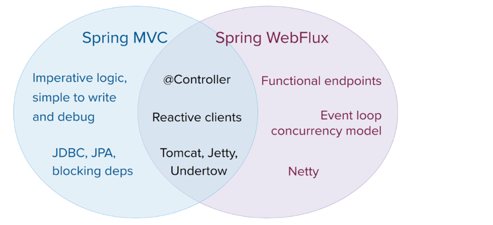

# web on Reactive Stack(web 响应式技术栈)
这部分是针对于响应式技术栈的web应用程序的文档,建立在在非阻塞式的服务器上运行的响应式流式API,例如Netty,Undertow,以及Servlet 3.1+ 的容器,个别章节包含了Spring webflux框架,reactive webClient,对测试的支持,以及响应式类库,对于基于Servlet的技术栈web应用,查看[Web on Servlet Stack](https://docs.spring.io/spring-framework/docs/5.3.10-SNAPSHOT/reference/html/web.html#spring-web )
## Spring WebFlux
最原始的web框架是Spring framework,Spring webMvc,它主要关注于对Servlet api以及Servlet 容器的构建,reactive-stack web 框架，webflux 在Spring 5.0开始增加,完全非阻塞式,支持响应式流 back pressure,并且运行在如Netty、Undertow以及Servlet 3.1+的容器上 \
spring mvc 和spring webflux 支持共存,有些时候且需要共存,例如 使用了reactive WebClient的Spring Mvc Controller;
## 概念
spring webflux的创建原因是:
通过使用较少的线程以及更少的硬件资源去处理并发的一个非阻塞式Web 技术栈,Servlet 3.1 尝试提供了非阻塞式IO的API，然而使用它将远离Servlet API的其他部分,这里的有一些概念是同步的(Filter,Servlet) 或者阻塞的(getParameter,getPart). 这些上面已经提到的一些API往往是非常普遍的API并且作为功能提供并跨越非阻塞运行时使用，这是非常重要的(因为 服务器例如 Netty)完全建立在异步之上,非阻塞步骤! \
另一部分是函数式编程,例如在java5引入的注解创建了一个机会(例如 注解的Rest Controller或者单元测试),java 8可选的lambda表达式创造了一个进行函数式API的机会 ,对于非阻塞式应用以及 持续性-api来说是一个福利(boon)(例如受欢迎的CompletableFuture 以及 [ReactiveX](http://reactivex.io/)) 允许声明式的异步组合逻辑. 在编程模型的层级上说,java8使得Spring webflux 能够与注解的controllers一样提供函数式的web端点;
### 定义 "reactive"
我们在非阻塞以及函数式上创造,但是什么是响应式?
reactive,是一个术语,参考编程模型去围绕响应式改变-网络 组件响应 I/O事件,UI controllers 响应鼠标事件以及其他. 在这些场景中,非阻塞是响应式,因此可以代替阻塞,当操作完成或者数据可用的时候,我们处于对通知做出反应的模式 \
这里还有一个另外重要的机制(我们在 Spring 团队中与“reactive”相关联并且它支持非阻塞式反压),在同步中,迫切的代码,阻塞式调用提供了一个反压的原生模式能够强制使得调用者等待,在非阻塞式中控制事件的频率也是非常重要,因此一个这样一个快速的生产者就不会压倒它的目的地 \
Reactive Streams 是一个小规范（也在 Java 9 中采用），它定义了带有背压的异步组件之间的交互。例如，数据存储库（充当发布者）可以生成 HTTP 服务器（充当订阅者）然后可以写入响应的数据。 Reactive Streams 的主要目的是让订阅者控制发布者生成数据的速度或速度。\
注意: 生产者不能够慢下来?
Reactive流的主要目的是建立这个机制和约束-范围,如果一个发布者无法慢下来,它将决定是否缓存、删除或者失败!
### reactive API
响应式流扮演了一个非常重要的角色-为了互通性. 它感兴趣的库以及基础组件,但是很少作为应用api,因为他实在是太底层了. 应用需要高级且丰富的、函数式API 去组合异步逻辑-类似于Java 8的Stream api,但是不仅仅针对于集合,这个角色是 响应式类库! \
[Reactor](https://github.com/reactor/reactor) 是针对Spring webflux的选择的一个响应式库,它提供了Mono 以及Flux API 类型去在数据序列 0 ... 1(Mono) 以及 0...N(Flux)-通过一组丰富的操作符集合(和ReactiveX 运算符词汇对齐)上进行工作,Reactor是一个响应式的流类库,因此它所有的操作符支持非阻塞式反压,Reactor 主要专注于Java 服务器端的服务,它和Spring 密切合作开发的! \
WebFlux 需要Reactor作为一个核心的依赖,但是它具有互通性-通过响应式流和其他的响应式类库进行互通,作为一个通用的规则,一个WebFlux API接受一个简单的Publisher 作为输入,内部将适配它到一个Reactor的类型,使用这些东西,并且要么返回一个Flux或者Mono作为输出,因此你能够将任何一个Publisher 作为输入 并且你能够应用在输出上应用操作,但是你需要适配输出(为了与另一个响应式类库进行使用). 无论是否可行(例如，注解的controllers),WebFlux 透明的适配RxJava或者其他响应式类库的使用,查看[Reactive Libraries](https://docs.spring.io/spring-framework/docs/5.3.10-SNAPSHOT/reference/html/web-reactive.html#webflux-reactive-libraries)获取更多！\
除了响应式API之外,WebFlux也能够在Kotlin中和[Coroutines](https://docs.spring.io/spring-framework/docs/5.3.10-SNAPSHOT/reference/html/languages.html#coroutines)携程使用-这将会提供更加紧密的编程风格. 下面的Kotlin代码实例是一个提供了Coroutines API的demo;
### 编程模型
spring-web 模块包含了响应式的根基(在Spring WebFlux之下),包括Http 抽象,对支持的服务器的响应式流的适配器,[编码器](https://docs.spring.io/spring-framework/docs/5.3.10-SNAPSHOT/reference/html/web-reactive.html#webflux-codecs),以及一个核心的[WebHandler API](https://docs.spring.io/spring-framework/docs/5.3.10-SNAPSHOT/reference/html/web-reactive.html#webflux-web-handler-api) 和Servlet API相当的API(但是是非阻塞式的概念!)\
在根基上,Spring WebFlux提供了一个两种编程模型的选择:
* 注解的Controllers,和Spring MVC组成并且基于来自于Spring-web模块的相同注解,spring mvc 以及 webFlux控制器支持响应式(Reactor 以及 RxJava)返回类型,并且 因此,区分它们并不容易,一个非常显著的区分就是WebFlux支持响应式的@RequestBody 参数！
* 函数式端点: 基于lambda表达式,轻量级,并且函数式的编程模型，你能够认为他就是一个小的库或者工具的集合(应用能够使用它路由或者处理请求). 与注解式的controller的显著不同是应用需要负责请求处理的开始以及结束，而不是通过注释声明意图(intent)并被回调！\
### 应用能力
Spring mvc 或者 webFlux?
它们本身协同工作扩展好处,以下展示了它们之间的各个部分!
\
我们建议你考虑以下几点:
* 如果你有一个完全能够工作的spring mvc应用,不需要做任何改变,命令式编程更容易编写、容易理解且更容易调试,你能够有用选择库的最大权力,因此由于历史原因,大多数都是阻塞的!
* 如果你已经准备好进行非阻塞式web技术栈编程，Spring WebFlux提供与此领域中的其他人相同的执行模型优势并且提供了服务器的选择(Netty,Tomcat,Jetty,Undertow,以及Servlet 3.1+ 容器),一个编程模型的选择(注解的控制器以及 函数式web端点),以及响应式类库的选择(Reactor or RxJava)
* 如果对轻量级、函数式的web框架(通过java8 lambda表达式或者kotlin)使用感兴趣,你能够使用Spring WebFlux函数式web 端点. 这是一个好的选择-对于小型应用或者一些少量复杂需求的微服务来说可以从更高的透明度和控制中受益。
* 在微服务架构中，你能够进行应用的混合-通过Spring mvc 或者Spring WebFlux的控制器或者和Spring WebFlux的函数式端点进行混合. 并且支持相同的基于注解的编程模型,能够更加容易的重用知识(使用正确的工具做正确的事情);
* 评估一个应用最简单的方式就是检查它的依赖,如果你有阻塞式的持久化API(JPA,JDBC)或者网络API在使用,Spring mvc 对于大多数架构来说至少是最合适的选择,虽然在Reactor 以及RxJava中执行阻塞式调用(在不同线程执行)技术上可行,但是这并没有利用非阻塞式框架的最大好处!
* 如果你有一个spring mvc应用并且需要调用远程服务,尝试使用reactive WebClient,你能够返回响应式类型(Reactor,RxJava或者[更多](https://docs.spring.io/spring-framework/docs/5.3.10-SNAPSHOT/reference/html/web-reactive.html#webflux-reactive-libraries))-直接从Spring mvc控制器方法上返回。 每个调用的延迟（latency)或调用之间的相互依赖性越大，好处就越大. Spring mvc controller 也能够调用其他的响应式组件!
* 如果有一个大的团队,请记住在转向非阻塞,函数式、声明式编程过程中的陡峭学习曲线,一个典型的例子就是开始没有完全切换到使用响应式WebClient. 除此之外,从小处着手并衡量收益. 我们期望这样,对于一个更加宽广的应用程序，这种偏移是不必要的,如果您不确定要寻找什么好处
 ,通过学习怎样进行非阻塞式I/O工作(例如  在单线程中国的Node.js并发)以及它的效率！
 ### 服务器
 反正就是适配,Spring WebFlux 并没有对启动或者关闭服务器进行支持,然而它非常容易通过Spring 配置以及 [WebFlux infrastructure](https://docs.spring.io/spring-framework/docs/5.3.10-SNAPSHOT/reference/html/web-reactive.html#webflux-config)并且包含了一少段代码的应用! \
 SpringBoot 拥有WebFlux的starter(能够自动构建这些步骤),默认来说,starter使用Netty,但是也非常容易切换为Tomcat或者Jetty或者其他的(通过改变maven依赖或者grade依赖即可),Spring Boot默认使用Netty,因为它性能更高(异步),非阻塞式空间并且允许客户端以及服务器共享资源! \
 Tomcat 以及 Jetty 能够同时和Spring mvc 以及 WebFlux一起使用,记住,无论怎样,它们的使用方式非常不同,Spring mvc 依赖于Servlet 阻塞式I/O 并且让应用程序直接使用Servlet API(如果它们需要的话,可以),Spring WebFlux 依赖于Servlet 3.1非阻塞式IO并且通过底层的适配器使用背后的Servlet API,它并不会直接暴露使用! \
 对于Undertow,Spring WebFlux直接使用Undertow API而不是用Servlet API!
 ### 性能
 性能有很多的特征和意义,响应式以及非阻塞式并不会使得应用运行的更快,它们能够干什么,在某些情况下(例如:  如果使用WebClient 去并行远程服务调用),大体上,他需要做更多的工作并且它能够稍微的增加需要的处理时间! \
 响应式的期待的关键点是通过更小的、固定的线程以及较少的内存进行工作,这意味着应用在负载上具有弹性性质,因为它可以通过可预测的方式进行他收缩,为了明了这些好处,然而你需要有一些延迟(包括慢的以及不可预见的网络I/O混合),这就是展示它能力的开始，并且差异可能是巨大的!
 ### 并发模型
 mvc 以及 webFlux 支持注解controller,但是有一点不同是,并发模型并且对于阻塞和线程的默认组装存在不同!\
 在Spring mvc中(通常是servlet 应用),它假设应用能够阻塞当前线程(例如,进行远程调用),对于这个原因,servlet 容器使用了一个大量线程的线程池去在请求处理期间吸取潜在的阻塞! \
 在Spring WebFlux(以及 非阻塞式服务器),它假设应用不会阻塞,因此非阻塞式的服务器使用一个较小的、固定尺寸的线程池(事件轮询工作者)去处理请求! \
 缩放、较小数量的线程也许听起来很矛盾(contradictory 但是绝不会阻塞当前线程(相反依赖于 回调),意味着你不需要额外的线程,因为没有阻塞调用来利用);
 #### 执行一个阻塞API
 你是否想使用一个阻塞式的库,Reactor以及RxJava都提供了一个publishOn操作符在不同线程进行持续处理,这意味着这里是一个容易的转义仓,记住，不论怎样,阻塞式API对于这个并发模型来说不是一个好的主意!
 #### 不可变状态
 在Reactor 以及 RxJava中,通过操作符声明逻辑,在运行时,一个响应式的管道是一个具有形式的(这里的数据被依次处理了)-在不同的阶段中,一个关键好处是它使应用程序不必保护可变状态,因为在管道中的应用程序代码绝不会并发执行!
 #### Threading Model
 在具有Spring WebFlux的服务器上应该有多少个线程!
* 在一个"vanilla"的Spring WebFlux服务器上(例如,没有数据访问或者说没有其他的可选依赖)，你可以期待一个线程用于服务器、其他几个线程用于请求处理(通常线程的数量和CPU内核数一样多),Servlet Containers,然而一开始可能需要更多的线程(例如 tomcat中 10个),同时支持Servlet (阻塞式IO)以及Servlet 3.1的非阻塞式I/O使用
*  WebClient 以事件循环样式运行,因此你能够看见一个更小的、固定线程进行处理(例如,reactor-http-nio-包含着Reactor Netty连接器),然而,如果Reactor Netty同时在用在客户端以及服务器，那么两者默认共享事件循环资源!
* Reactor 以及 RxJava 提供了线程池抽象,叫做调度器,为了使用包含了publishOn操作符-被用来将处理切换到不同的线程池. 这个调度器有一个名称(建议使用一个指定的并发策略-例如:  并行) - (包含指定限制的线程的CPU约束任务)或者 灵活的(使用大的线程池的IO帮绑定工作),如果你需要查看这些线程,可以使用指定了线程池'Scheduler'策略
*数据访问类库 以及其他的第三方依赖也能够创建并通过它们自己的方式使用线程!
#### configuring
spring 框架并没有提供启动、关闭服务器的支持，为了配置服务器的线程模型,你需要使用特定于服务器的配置API，或者,你能够使用Spring Boot,检查SpringBoot针对于每一个Server的依赖,你能够直接配置WebClient,对于其他的类库,查看它们各自的文档!

                                                                                    
